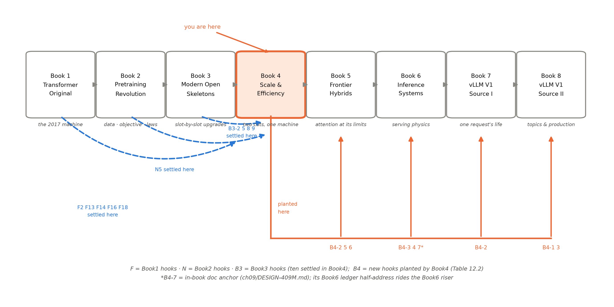
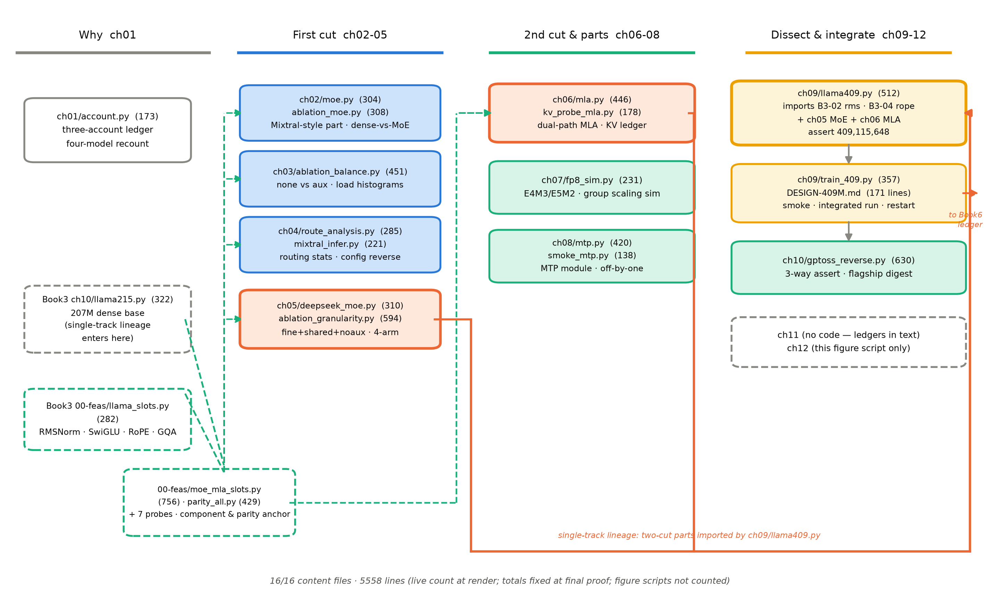

# 第 12 章 收束：训练侧效率的极限与瓶颈转移

## 12.0 开篇：从全书到这里

上一章合上时镜头交到了这里：「镜头拉回全书：本册十三站到此全部走完——两把刀（第 2-6 章）、四件训练侧补件（第 7-8 章）、两台旗舰拆解（第 9-10 章）、一条支线（本章）。下一章收束：MoE 的历史是一部简化史，均衡手段一路从损失函数搬进路由机制、再搬进架构本身——共享与 latent 正是这条线的最后两站；把话说圆，清点十钩与三本账的去向，然后交棒。」【第 11 章成稿直引】现在兑现这句交棒：把话说圆——训练侧效率这条线说到它的极限与边界；清点——十钩对账、两刀证据链、三本账的去向；然后交棒——瓶颈正在移向哪里，下一册在哪儿接。

本章是全书的「总-下」，没有新实验、没有新零件，回答三个问题。其一，**判决**：训练侧效率这条主线走到哪一站了——「近极致」三个字敢不敢说、说到什么边界为止？其二，**回望与对账**：我们亲手造的两刀机，每一刀的证据链是否闭合（12.2）；本册接走的十笔旧账与自己埋下的七笔新钩，是否笔笔有下落（12.3）。其三，**移交**：三本账移交给谁、瓶颈正在移向哪里（12.4），最后清点两份可带走的资产（12.5）。这是出发去 Book5/Book6 前的装备清点。

> **最小背景栏**：本章没有新的前置知识，全部调用已教内容——三口径账本与派发开销（第 1 章）、MoE 机构与训练难题（第 2-3 章）、Mixtral 与 DeepSeekMoE 两代实证（第 4-5 章）、MLA 全链（第 6 章）、低精度与稳定化处方（第 7 章）、MTP（第 8 章）、两刀整合与设计文档（第 9 章）、旗舰拆解方法论（第 10 章）、LatentMoE 支线（第 11 章）。数字一律指回原处，不重新论证。

## 12.1 训练侧效率的极限：一部简化史的收口

先判最大的那个命题。把第 2 章到第 11 章的 MoE 主线摊在一条时间轴上，看到的不只是「技术进步」，更是一部**简化史**：Shazeer 2017 的三件套——噪声 top-k、k=4、双辅助损失——被后世逐件拆掉。GShard 拆掉噪声、把 k 砍到 2，换来 Transformer 原生与 600B【证据等级：官方论文 2006.16668 v1 §4】；Switch 拆掉最后一件（k=2→1），只留一个门控值保可微性，规模推到 1.571T【证据等级：官方论文 2101.03961 v3 §5.6】；每拆一件，机制更简单、可调超参更少、规模更大。DeepSeekMoE 看似回头（k 抬回 8），实则把每份切细——同一预算下可表达的知识组合从 $\binom{16}{2}=120$ 涨到 $\binom{64}{8}=4{,}426{,}165{,}368$【证据等级：官方论文 2401.06066 v1 §3.1】，这是设计空间的打开而非回退；到旗舰世代，「少份宽选/多份窄选/细粒度+共享」三学派在同一机构上各有落点（Llama 4 的 16/128 选 1、gpt-oss 的 32/128 选 4、DSV3 的 256 选 8+1 共享——第 10 章表 10.3 的横读）。简化史的终点站不是某个唯一解，是一张**标好取值的菜单**。

而这部简化史自始至终在同一条账本约束下推进——第 1 章立的那条：MoE 省的是每 token 的通行费，不省仓库与搬运。总参数涨、显存照付全款（权重全装），路由与派发反而是新增开销；GShard 的预告片到今天仍是对这门生意最好的注脚——参数从 37.5B 涨到 600B（16 倍），训练成本只从 6 涨到 22 core-years（3.6 倍）【证据等级：官方论文 2006.16668 v1 Fig 1——第 1 章图 1.1 的样本】。「容量与通行费分开记」在 2017 年是惊奇的悖论，到 2025 年已是旗舰 MoE 一侧的出厂默认——而第 10 章速览表里仍站着一排 dense 旗舰（Llama 3、Gemma3、Qwen3-32B），说明菜单的另一栏也还开着：稀疏不是唯一的答案，是答案空间里被探索得最深的一格。

第二条线是**均衡手段的迁移**，本册反复操练的那句判断：从损失函数（2017 双损失→GShard/Switch 单损失→ST-MoE router z-loss→DSV2 三级）搬进路由机制（noaux：bias 逐 step 更新、只影响路由不进门值、连 α 都不用调，DSV3 连 token dropping 也砍掉），再搬进架构本身（切细+共享直接减少「需要均衡的量」；LatentMoE 把派发量与通信同缩 $d/\ell$——第 11 章）。每一代都不是推翻上一代，而是把均衡的责任从「损失函数」往「机制与架构」搬家。这句判断在我们的 26M 机器上也走了一遍：四臂消融里细粒度+共享最优（4.797）、noaux 以不到 0.05 nat 的质量差换掉了损失项且 MaxVio 反而更低（0.011 对 0.014）——「机制式均衡以小于噪声带宽的价格免掉损失税」，与 DSV3 Table 5 的 17 胜 1 平 2 负同向【证据等级：本书实验（单种子趋势级）+官方论文 2412.19437 v2 §4.5.2】。

第三条线是**低精度台阶**，第 3 章埋线、第 7 章兑现的那条：GShard 全程 fp32 硬扛（1T bf16 实验因数值稳定性弃用）→ Switch selective precision 把 fp32 局限在路由器内（bf16 臂发散到 −3.780、selective 臂 −1.716【证据等级：官方论文 2101.03961 v3 Table 2】）→ ST-MoE z-loss 从损失侧压量级 → DSV3 的 FP8 全栈（格式全 E4M3 × 细粒度缩放 1×128/128×128 × FP32 分段累加 × 五组件保 BF16 × 双规模 <0.25% 验收——整条训练只花 2.788M H800 GPU 小时【证据等级：官方技术报告 2412.19437 v2 表 1（成本行）】）→ gpt-oss 把存储压到 MXFP4 的 4.25 bits（官方口径「post-trained…quantization of the MoE weights to MXFP4」）。稳定化组件在这条线上与架构咬合成型：QK-Norm、QK-Clip、sink+clamp 三路线各有地盘，而 MLA 挤掉 QK-Norm 这件事提醒我们——组件不是独立商品，是整机处方。再加上 MTP 让每个位置产出多份监督（DSV3 的官方分账干脆把 MTP 模块单列：主模型 671B、MTP 模块 13.46B，全 checkpoint 685B【证据等级：官方 README_WEIGHTS+本书复算逐位，第 9 章 9.2 节】），训练目标这一轴也补上了最后一块板。

四条轴——机构、几何、精度、目标——各自都到了「下一步收益变小、或者收益的兑现地在别处」的位置。所以「训练侧效率近极致」这句话，我们敢说，但要说准它是什么：**不是物理极限，是工程平台期**——独立轴上的免费午餐快摘完了，剩下的钱要么花在系统侧工程（派发与专家通信），要么花在服役侧（这本账才刚开张）。而且这个判断自带三条诚实边界：其一，等算力口径的证据稀缺——早期三篇里只有 Switch 给过严格逐 FLOP 对齐的稠密对照，Shazeer 的「6% 计算量」是外部对照口径（第 1 章脚注），引用任何加速倍数必须先对口径；其二，质量证据多为损失级——DSV3 的 FP8 对照只有损失曲线相对误差 <0.25%，没有任务级评测对照【证据等级：官方技术报告 2412.19437 v2 附录 B.1（负结论：报告未给）】；其三，配方披露不全——Mixtral 训练配方零披露、gpt-oss 悬案七条（第 10 章表 10.4）。「近极致」是从 config 与论文账本里读出的工程形态，不是我们复训验证过的结论——这句话本身，就是本册证据制度想留给你的判断力。这份判断力回到导览 0.1 的那道面试题——下一台机器，这两个插槽装不装、装哪种取值——现在你能答了：装不装看账本（通行费与仓库值不值得分账），装哪种看菜单（三学派的取值各有旗舰背书），信不信看消融（我们 26M 档的四臂梯度与旗舰史同向）。

## 12.2 两刀机回望：207M→409M 的证据链

判决之后看机器。这台机器的全部数字都在前文带证据等级出现过，此处只把它们串成一条链——从 Book3 接手的 207M 骨架（本册复测 1.907 s/step，Book3 记录 1.702，测量日差异如实并注【证据等级：本书实验（MPS bf16，2026-10）】），到第 9 章装成的**409M 两刀机**主臂：总参 409,115,648（逐项手算=模型 assert 逐位）、激活参 168.9M（本册口径=含 lm_head、不含输入 embedding lookup、含路由门；non-emb 136.1M、双份 201.6M 并列——第 9 章表 9.2 与 9.5 节）、每 token KV 3,840 个元素（对 GQA 基线 12,288，−68.8%）、实测 3.007 s/step、峰值 8,550MB；孪生的**207M 等参对照臂**总参 207,064,064，与稠密 207M 只差 55,296（0.03%）——「同预算两刀 vs 稠密」的最强对照【证据等级：本书实验（探针 F+第 9 章，JSON 存档）】。验收四件套同样链式闭合：冒烟点火贴预言（双臂初始 loss 实测 10.5910/10.5843，咬合 $\ln 32000+\tfrac12 d\sigma^2=10.578$ 的千分位）；HF 结构对拍链式 PASS——最强证书是 **cand2 全机 409M strict 直搬 max|Δlogits|=7.629e-06、argmax 一致率 100%**（本书迄今最大的一次 strict 直搬，第 9 章 9.5 节），其前传是第 6 章 `q_lora=64`/`=null` 双臂的 9.54e-07 与第 2 章 mini Mixtral 的 8.34e-07；整合短训按半小时窗档规划（主臂窗口档 598 步、预登记 540 步降档线，对照臂 512 步），验收判据预注册为两刀协同无 NaN、loss 单调下降——双臂曲线见第 9 章图 9.3；全量长训按作者决策暂缓、重启手册随文档交付。这台机器也把「MoE 慢在哪」的账诚实留了底：派发开销梯度 26M 档 2.3×→65M 档 1.74×→207M 档 1.44×（朴素逐专家循环、launch-bound，随规模收敛），且等激活体量下专家数不加价（E16/E8=0.95——第 5 章的负结论）——教学档的「慢」不是 MoE 的税，是未做 kernel 融合的工程欠账，这笔账的去向见 12.4。改装史物理地写在 import 语句里：[`ch09/llama409.py`](code/ch09/llama409.py) 的插槽供货清单——Book3 第 2 章的 RMSNorm（不动件）、第 3 章的 SwiGLU（首层稠密重启变体的供职件——定版 12/12 层 MoE）、第 4 章的 RoPE（不动件），加上本册第 5 章的 DeepSeekMoE（第一刀）与第 6 章的 MLA（第二刀）——五件 import 各自注明来路，GQA 件退役进虚影。

把两刀的证据链压成一张表，如表 12.1——它是 Book3 表 10.3 插槽清单的续篇：那一册动四格，本册只动两格，两格不动件原样承 Book3，每一刀背后站着「本机消融+文献锚+对拍证书」三重证据。

表 12.1 两刀证据链表（插槽｜旧件｜新件｜动刀章｜消融证据（本机）｜文献锚——Book3 表 10.3 同款续篇；消融读数均单种子趋势级、判据预注册）

| 插槽 | 旧件 → 新件 | 动刀章 | 消融证据（本机） | 文献锚 |
|---|---|---|---|---|
| 归一化 | pre-RMSNorm（不动） | —（Book3 第 2 章） | 等价买简（Book3 消融指回） | Book3 表 10.3 |
| 前馈 | dense SwiGLU（1024-2816-1024）→ MoE（$E$=8/top-2/共享 1/专家宽 938；12/12 层全 MoE——首层稠密留作重启变体，DESIGN §3） | 第 2-5 章 | 等激活 2000 步 MoE 优 0.038 nat；细粒度+共享再优 0.056；noaux 以 <0.05 nat 换掉损失项（MaxVio 0.011） | 1701.06538 / 2006.16668 / 2101.03961 / 2401.06066 / 2408.15664 |
| 位置 | RoPE（不动；第二刀新增解耦车道 $k^R$ 的施加位） | —（Book3 第 4 章） | —（机制不变，只改施加范围） | 2104.09864（Book3 已核） |
| 注意力 | GQA（16Q/8KV）→ MLA（$d_c$=256+解耦 $d_h^R$=64） | 第 6 章 | 双路径对拍 5.96e-08（注意力权重级）；KV 字节实测=公式逐位 7/7；−68.8% | 2405.04434 v5 §2.1+App C/D |
| 出入口 | untied、$V$=32000（不动） | —（Book3 第 5 章） | —（单/双份口径开关承 Book3） | Book3 表 10.3 |

表里还有一处值得单独点名的诚实格：cand1（重 MLA 档）在本册尺度上「参数不省反贵」（注意力槽比 GQA 槽多 3.7M/层）——MLA 的「参数也省」要在 $h\cdot d_h\gg d_c$ 的旗舰几何下才成立（第 6/9 章的尺度 honesty 素材）。两刀机不假装自己是旗舰，它只保证每一刀的账都算得清。它的定位由此清晰：不是旗舰的缩比复读，是旗舰证据链的教学复刻——同一刀口、同一条验收链（assert、冒烟、对拍、短训、设计文档），尺寸按一台笔记本重排。

## 12.3 F/N/B3 总决算：十钩对账与 B4 新钩地图

现在摊开对账页。导览表 0.2 预告过的台账，表 12.2 是回执：上十行是本册接走的十笔旧账（F=Book1 埋设、N=Book2、B3=Book3），每行注明回收章与兑现摘要；下七行是本册埋下的新钩（B4-1~B4-7，沿用登记表纪律：显式地址、最小披露、不硬造）。

表 12.2 F/N/B3 总决算与 B4 新钩地图（回收/埋设与各章成稿的实际表述逐条核对；B4 行话术沿用导览表 0.2 代称）

| # | 钩子（一句话） | 本册兑现（回收章·摘要） | 状态 / 后续去向 |
|---|---|---|---|
| F2 | 自回归串行：因果掩码的另一面 | 第 8 章——MTP 章「从训练侧出手」开场显式承接 | 推理侧半句 → Book6 第 1/10 章（与 B4-4 合交货） |
| F13 | 文本之外的模态（Gemma3 出厂带视觉塔） | 第 10 章——速览表 Gemma3 行 config 事实边界注记（只计文本栈参数） | 视觉侧与能力扩展 → Book5 第 10 章 |
| F14 | FFN 的两刀：换激活、换专家 | 第 1 章开场+第 2-5 章全链（机构→难题→两代实证） | 本册清账 |
| F16 | 头数与 $d_k$ 的账本：推理时代翻转 | 第 6 章开篇「账本变了」第三段（与 B3-2 同句合成） | 本册清账 |
| F18 | 低精度：从 GNMT 定点 8-bit 到今天 | 第 7 章——接棒一句+两张处方笺（训练侧半句） | 推理侧半句 → Book6 第 11 章／Book8 第 8 章（B4-3 执行） |
| N5 | 低精度与训练稳定化的处方 | 第 7 章主场——Book2 认病、本册开药 | 本册清账 |
| B3-2 | KV 的下一刀：$h_{kv}\cdot d_k$ 低秩折叠 | 第 6 章开篇直引 Book3 欠账原句，账本续写成表 6.2 | 本册清账 |
| B3-5 | config 逆向五步法的复用 | 第 10 章主场——gpt-oss 三方逐位 20,914,757,184+活账口径发现+悬案七条 | 读厂商自报数字手册 → Book5 第 11 章（地址保留） |
| B3-8 | Llama 3 拒绝专家群的稳定性权衡 | 第 3 章开场——拒绝引语+本机负载崩塌现场（max/min 327.8、死专家） | 本册清账 |
| B3-9 | Llama 4 的 MoE 化 config 事实 | 第 2 章——机构首次展开+三学派接续 | 本册清账 |
| B4-1 | 分布式专家并行（专家铺卡的工程） | 第 2 章末埋（机构学根据止步、all-to-all 属系统侧） | → Book8 第 6 章 |
| B4-2 | MLA 开箱后的换算子战线；箱子的引擎落地 | 第 6 章末埋（复合句） | → Book5 第 2/6 章；Book7 第 9 章 |
| B4-3 | 推理侧量化（F18 下半程执行句） | 第 7 章末埋 | → Book6 第 11 章／Book8 第 8 章（K3 MXFP4 QAT 半句→Book5 第 7 章） |
| B4-4 | MTP 的推理侧身份（起草-验证） | 第 8 章末埋（厂商数字唯一落点=欠账框） | → Book6 第 10 章 |
| B4-5 | 窄窗与汇聚元的机制与收益 | 第 10 章豁免框埋（config 事实已交货） | → Book5 第 2 章 |
| B4-6 | LatentMoE 的 2026 发扬（Stable LatentMoE） | 第 11 章末埋 | → Book5 第 7 章 |
| B4-7 | 两刀机重启锚+消费线衔接 | 第 9 章设计文档内置（文档锚，非叙事钩） | 册内 `DESIGN-409M.md`；账本算例 → Book6 第 2-3 章 |

顺带登记一笔审计结论：这十笔钩的回收落点全部落在第 1-11 章内——三册登记表与成稿的「→ Book4 第 N 章」地址经全字匹配逐条对平、章号零回改（导览 0.5 节的台账预览因此与本章决算严格同构），其中 F16 与 B3-2 在同一句里合址兑现、F18 清训练侧半句而推理侧半句由 B4-3 执行、F2 的推理侧半句与 B4-4 合单交货——合址不双开，是这套登记制度省墨而不省账的写法。

图 12.1 把这张双栏账放上八册地图：你走过的第四站高亮在正中，左侧三支蓝色虚线是 Book1 的五笔 F 账、Book2 的 N5、Book3 的四笔 B3 账在本册汇清，右侧的橙色总线是七笔 B4 钩流向 Book5/6/7/8 的去向——八册不是八本独立的书，是一张有借有还的账目网；本册接十笔、清十笔（F2/F18 各清半句、B3-5 保留 Book5 半址）、再放七笔（其一为文档锚），是这张网上至今头绪最多的一站。



图 12.1 八册地图（自绘，沿用 Book1/Book2/Book3 图式）：丛书八册的阅读路径，Book4《规模与效率》高亮（you are here）；左侧三支蓝色虚线=Book1 的 F2/F13/F14/F16/F18、Book2 的 N5、Book3 的 B3-2/5/8/9 在本册结清，橙色总线=本册埋设的 B4-1~B4-7 流向 Book5（B4-2/5/6）、Book6（B4-3/4/7*）、Book7（B4-2）、Book8（B4-1/3）——与表 12.2 逐行对应（*B4-7 为文档锚——册内 `DESIGN-409M.md`，其 Book6 账本算例半址计入 Book6 支路）。复现：`python [`code/ch12/make_figures.py`](code/ch12/make_figures.py) --only 1`（秒级）

## 12.4 三本账移交与瓶颈转移

清点完钩子，移交账本。本册立起的三本账，去向各有明确的门牌。

**参数账移交 Book6。**总参/激活参双口径（第 1 章立式、第 10 章旗舰横读）是推理系统显存与算力账的输入：一台引擎要装下多少权重、伺候多少请求，第一笔输入就是「总参×字节」与「激活参×FLOPs」。配套纪律一并移交：引任何官方 B 数先判单份/双份口径（DeepSeek 全系与 gpt-oss=单份、Qwen3-30B-A3B=双份——第 10 章 10.4 节的跨厂商口径表）。两刀机本身以**账本算例**身份登记进设计文档（B4-7）：Book6 第 2-3 章算容量账时不必回读本册正文，凭 `DESIGN-409M.md` §10 的工程参数（409,115,648 参数、bf16 权重约 818MB、KV 3,840 元素/token）即可开工——顺带一句防断链的显式登记：Book6 mini 引擎的默认服务对象仍是 Book3 终态稠密+GQA 小模型，两刀机是算例与选做扩展。

**KV 元素账移交 Book6 与 Book7。**第 6 章把 Book3 的 KV 账本从「头份数×头维」续写成「箱子容量」$(d_c+d_h^R)\cdot L$；这本账的下文分两条：一条是 Book6 第 3 章的压缩全景（架构侧/精度侧/淘汰侧三股怎么拧——Book3 B3-1 的地界），另一条是 Book7 第 9 章的 MLA 后端——箱子的读取在真实引擎里由专门的 kernel 承担，transformers eager 路径不做权重吸收这件事（第 6 章实现对照框）正是它必须在场的证词。

**MTP 移交 Book6 第 10 章。**第 8 章只交了训练侧的半件：多 token 目标怎么立、怎么不踩 off-by-one；「训练目标转身成为推理资产」的机制与收益账（起草-验证-回滚）连同 F2 的推理侧半句，在那里合流交货（B4-4）。

**预算账与重启锚留在册内。**第 9 章设计文档把本机实测（3.007 s/step、峰值 8,550MB）外推成多档预算表（Chinchilla 档 8.2B token 的本机天数与 A100/H100 的 MFU 档），连同数据配方、验收标准、风险预案与十步重启 checklist 一起装订——「重启即可执行」的标准承 Book3 `DESIGN-215M.md` 先例：不依赖本书上下文，所有决策自带依据与出处。待高算力机器到位，凭文档直接点火；这份文档就是 B4-7 的正身，也是本册唯一一件「不是钩的移交」。

三笔移交背后是同一个结构性的判断，也是本册收束最想留下的一句展望：**训练侧省钱、服务侧收账——瓶颈移向 serving**。MoE 把每 token 的 FLOPs 砍下来，但派发与专家通信是系统侧的新开销（本机朴素循环 2.3×→1.44× 的派发开销梯度（第 1 章表 1.4、12.2 节）只是它的教学版，工程正解在融合 kernel 与 EP——B4-1 的地界）；MLA 把 KV 压进小箱子，但箱子的读取要专门后端；MTP 多想一步棋，兑现要靠推理侧的验证与回滚；FP8/MXFP4 的训练侧成熟了，部署矩阵是另一本账（B4-3 的地界）。四件套每一件的收益兑现处都不在训练场，在服役场——「怎么训得省」的账本合拢之日，正是「怎么用得省」的账本开张之时 → **Book6**。所以「瓶颈转移」在本册出现了两层：微观一层，均衡的责任在 MoE 内部从损失函数搬进机制与架构（12.1 的简化史）；宏观一层，效率的战场从训练侧整体搬进服役侧（本段）——两层搬家是同一个故事：责任与账单，总是搬向离数据更近、离兑现更近的地方。另一条岔路同样实名注册：开箱后的注意力仍是那场 $O(n^2)$ 的精确内积，把算子本身换掉是另一条战线；2026 旗舰的地界（含 K3 的 Stable LatentMoE 精读）也已挂账——两处都在 **Book5**。

## 12.5 册末清点：代码资产与术语表

最后清点两份可带走的资产。

**第一份是代码**——图 12.2 是本册代码资产的总览，按导览 0.4 的四段旅程排布。这张图上最重要的两条线：橙色的是单轨主线的组装段——第 5 章的 DeepSeekMoE 与第 6 章的 MLA 被第 9 章的 `llama409.py` 用 import 搬进整机（连同 Book3 的 RMSNorm、SwiGLU 与 RoPE——两件不动件加一件首层稠密机构件（重启变体用，定版 12/12 层 MoE），改装史写在 import 语句里），再交棒给训练脚本与设计文档；青色虚线是上游与对拍锚——Book3 的组件库正身进站后，本册 [`00-feasibility/moe_mla_slots.py`](code/00-feasibility/moe_mla_slots.py) 作为新组件的对拍锚立起，各章教学重写件逐一与它逐位一致（0.00e+00），`parity_all.py` 把「教学件↔正身↔HF」三层互拍固化成一条命令，并立为正身任何改动的交付门槛（批二/批三交付边界与终校的固定动作）；锚旁边那七枚探针（A-G，调研期总机时约 22 分钟）是参考底座——两刀 config 的三候选账、消融配臂公式、HF 对拍的坑清单，都先在那里冒烟过。黄色的一列是大项目的交付：两刀整机、训练脚本与设计文档；青色实框是补件与拆机件（FP8 模拟、MTP 模块、旗舰拆解脚本）；灰虚框是无代码章（第 11 章账本入正文）与仅图脚本的收束章。正文代码 16 件、总行数 5,558 行（`wc -l` 定版计数，与图 12.2 底部实时计数同口径——ch01-ch10 的组件与实验正文件，不含各章图脚本，也不含 `00-feasibility` 的探针与对拍锚件）；从 207M 到 409M，一条从 Book3 接力、全程可跑的代码史——旅程停在任何一站，你手里都是一台当下完整的机器。



图 12.2 本册代码资产总览（自绘）：四列对应导览 0.4 的四段旅程；橙色线=单轨主线组装段（[`ch05/deepseek_moe.py`](code/ch05/deepseek_moe.py)+[`ch06/mla.py`](code/ch06/mla.py)→[`ch09/llama409.py`](code/ch09/llama409.py) 整机→训练脚本与设计文档），青色虚线=上游来路与对拍锚（Book3 `llama_slots.py` 底座与本册 [`00-feasibility/moe_mla_slots.py`](code/00-feasibility/moe_mla_slots.py)/`parity_all.py`——各章教学件的对拍锚），橙框=被整机 import 的两刀正件、黄框=大项目整合交付（整机+训练脚本+设计文档）、青色实框=补件与拆机件、灰虚框=无代码章；框内括号为行数（`wc -l`，渲染时实时读取，定版计数）。复现：`python [`code/ch12/make_figures.py`](code/ch12/make_figures.py) --only 2`（秒级）

**第二份是词汇**。汇总第 0-11 章全部术语首现处（「本书用语」为本册自创、无通行英译；第 8-11 章条目按卷级大纲口径登记、与成稿同步校订），沿前三册册末术语表格式列于下方，按首现章排序——它同时是全书索引的骨架，共 70 条。用法提示一条：首现列登记概念在成稿中的第一次出现（导览表格与章末预告里的路标式提及标作「（预告）」），与概念正式下定义或上正菜的章不同时以双址并列（如「死专家」首现第 2 章 2.4 节预告、正菜在第 3 章）；个别条目是对全册线索的归纳词（如「打分函数代际」），按定义章登记、原样字串未必在登记章出现——检索时以首现为入口、以定义处为准。

| 术语 | 英文 | 首现 | 一句话定义 |
|---|---|---|---|
| 两刀机 | （本书用语） | 导览 | 在 Book3 207M 骨架上换前馈（MoE）与注意力（MLA）两插槽的终态整机（主臂 409M） |
| 效率悖论 | efficiency paradox | 导览（第 1 章立式） | 总参数涨、单 token 成本降同时成立——容量与通行费分开记的现象 |
| 三口径账本 | （本书用语） | 导览（预告）／第 1 章 | 总参数／激活参数／每 token FLOPs（$\approx2N_{act}$）三本分开记 |
| 单份/双份口径 | （本书用语） | 导览（预告）／第 1 章 | 激活参数含不含输入 embedding lookup 的两种报法；引官方 B 数先判定 |
| 等激活/等总参口径 | （本书用语） | 第 1 章 | MoE 消融配臂两对照：dense $d_{ff}=k\cdot w_e$（+共享）或 $E\cdot w_e$ |
| 派发开销 | dispatch overhead | 第 1 章 | MoE 把 token 搬到专家再搬回的额外耗时（本机朴素循环 1.4-2.3×，随规模收敛） |
| gather/scatter | gather / scatter | 第 1 章 | 按 top-k 索引把 token 聚到各专家、再散回原位的搬运原语 |
| launch-bound | launch-bound | 第 1 章 | 逐专家 Python 循环下内核启动开销主导的慢（教学档如实报） |
| 取整口径 | （本书用语） | 第 1 章 | 官方 B 数与逐位实算之差的常见成因（Mixtral 47B vs 自算 46.703B） |
| 条件计算 | conditional computation | 第 1 章 | 每个 token 只激活参数子集的范式——「容量」与「每 token 成本」分账的机制根源 |
| 三方逐位 | three-way bit-exact | 第 1 章（预告）／第 10 章 | 手算=HF API=分片头审计逐位对平的参数账标准 |
| 悬案登记 | open-questions registry | 第 1 章（承 Book3 第 9 章制度） | config 读不出什么就显式列表、交给地界正确的后续册，不猜 |
| 噪声 top-k 门控 | noisy top-k gating | 第 2 章 | 打分加噪再 top-k 的原始门控；噪声=探索+可微的负载估计 |
| top-k 内重归一化 | top-k renormalization | 第 2 章 | 只对选中的 k 个门控值重新归一（数学等价、实现口径） |
| 专家容量 | expert capacity | 第 2 章 | 每专家每批的座位数 $(N\cdot k/E)\cdot\mathrm{CF}$；坐不下走残差=「保险丝」 |
| 容量因子 | capacity factor, CF | 第 2 章 | 容量的放大旋钮（Switch 式 (2.6) 显式参数化；1.0-1.25 最优） |
| 溢出 | overflow | 第 2 章 | 超出容量的 token 走残差直通——信息不死、只跳过一次精炼 |
| 随机路由 | random routing | 第 2 章 | GShard 以 $\propto g_2$ 概率派发第二专家、否则跳过（按概率省算力） |
| 专家并行 | expert parallelism, EP | 导览（预告）／第 2 章（2.6 节） | 专家互不通信、天然可分片：通信退化为 token 搬运（all-to-all）；工程→Book8 |
| 三学派 | （本书用语） | 第 2 章（2.8 节） | 旗舰 MoE 几何三取值：少份宽选／多份窄选／细粒度+共享 |
| 赢者通吃 | winner-take-all | 第 2 章（预告）／第 3 章 | 被偏爱专家的自增强回路：训得多→更强→更被偏爱 |
| 死专家 | dead expert | 第 2 章（预告）／第 3 章 | 计数归零的专家（本机 200 步现场：max/min 327.8、出现死专家） |
| 辅助损失 | auxiliary loss | 第 2 章（预告）／第 3 章 | 为均衡附加的损失项家族（importance/load→单损失→三级） |
| 损失税 | （本书用语） | 导览（预告）／第 3 章立义 | 均衡与主目标抢梯度（干扰梯度）的代价；第 5 章 noaux 免税 |
| router z-loss | router z-loss | 第 3 章 | 压 router logits 量级的正则（首现 ST-MoE，$c_z$=0.001——非 Switch） |
| 选择性精度 | selective precision | 第 3 章 | 路由器内 cast fp32、专家仍 bf16 的精度分区 |
| MaxVio | max violation | 第 3 章 | 均衡度量 $\max\|\mathrm{frac}-1/E\|$（noaux 论文口径，硬计数） |
| 干扰梯度 | interference gradients | 第 3 章 | 辅助损失向训练引入的、与主目标抢方向的梯度 |
| 路由分析三结论 | routing analysis | 第 4 章 | 无主题分工（实证）／句法对齐（推测级）／位置局部性（实证）——防过度转述红线 |
| 替身 | stand-in | 第 4 章 | 因许可与体量选定的对照真权重（OLMoE/Qwen3-4bit）——选型即 config 练习 |
| 细粒度专家分割 | fine-grained expert segmentation | 第 5 章 | 专家切 $1/m$：同预算组合空间 $120\to4.4\times10^9$ |
| 共享专家 | shared expert | 导览（预告）／第 5 章 | 不走路由的常驻车间：隔离公共知识、去冗余 |
| 免辅助损失路由 | auxiliary-loss-free routing (noaux) | 第 3 章（预告）／第 5 章 | bias 逐 step 更新、只影响路由不进门值——均衡从损失搬进机制 |
| 打分函数代际 | scoring function | 第 5 章 | softmax 乘性→sigmoid+选中归一（V2→V3）；gpt-oss 用 linear+top-4 |
| 首层稠密 | first-k-dense | 导览（预告）／第 5 章 | 前几层保留 dense FFN 的排布：every-other→每层→首 1 层→首 3 层 |
| 设备受限路由 | device-limited routing | 第 5 章 | 先选 M 台设备再 top-K（限 EP 通信；出自 DSV2 §2.2.2 非首篇论文） |
| 活字段 | （本书用语） | 第 5 章 | config 里有、实现里未必用的字段（topk_method 遗留等） |
| signflip 反向对照 | （本书用语，事故留档） | 第 5 章 | bias 方向装反的正反馈现场——负反馈的方向就是机制的全部 |
| 低秩分解 | low-rank factorization | 第 6 章 | $A\approx BC$：把大矩阵压成两个瘦矩阵之积的折叠 |
| 多头潜在注意力 | multi-head latent attention, MLA | 导览（预告）／第 6 章 | KV 联合压进 $d_c$ 箱子+解耦 RoPE 键的注意力形态 |
| KV 联合压缩 | joint KV compression | 导览（预告）／第 6 章 | K/V 共用一个箱子 $c^{KV}$（秩 $\le d_c$，省一半缓存；RMSNorm 住箱） |
| 查询压缩 | query-side compression | 第 6 章 | 只省训练激活不省 KV 缓存的可选件（$d_c'$；V2-Lite=null=天然消融臂） |
| 解耦 RoPE | decoupled RoPE | 导览（预告）／第 6 章 | 位置走 $d_h^R$ 维共享车道 $k^R$ 不进箱子——三步死局的出口 |
| 权重吸收 | weight absorption | 导览（预告）／第 6 章 | 上投影吸进查询/输出侧、推理在低秩空间算（矩阵结合律；eager 不做） |
| 显式/吸收形态 | explicit / absorbed forms | 第 6 章 | 训练物化 K/V 对推理只缓存 $c^{KV}+k^R$ 的双形态（对拍 5.96e-08） |
| 部署口径 | deployment-scope | 第 6 章 | −93.3% 的复合口径（MLA×层数差×6bit KV）；引用必与 −98.24%/−82.24% 并列 |
| KV 元素账 | KV element ledger | 导览（第 6 章立式） | 每 token 元素数 $(d_c+d_h^R)\cdot L$——Book3 式 (6.2) 的续本，单位=元素 |
| E4M3／E5M2 | FP8 formats | 第 7 章 | 1/4/3 与 1/5/2 位分配；最大 448 与 57,344；前向/梯度分工 |
| 次正规数 | subnormal | 第 7 章 | 指数域耗尽后的最小步长区——bulk 断崖的机制现场 |
| 缩放粒度 | scaling granularity | 第 3 章（预告）／第 7 章 | scale 住哪：per-tensor→1×128/128×128→32 元素块（一路搬近数据） |
| bulk 断崖 | （本书用语） | 第 7 章 | 离群吃掉量程后主体信噪比的塌方（31.5→17.5 dB；per-group 稳住） |
| FP 尺度自相似 | FP scale self-similarity | 第 7 章 | 量化噪声随幅度等比缩小——FP 与 INT 量化的本质差异 |
| MXFP4 | microscaling FP4 | 导览（预告）／第 7 章 | 32 元素块共享 E8M0 指数+块内 E2M1；4.25 bits/param |
| QK-Norm | query-key normalization | 导览（预告）／第 7 章 | 沿头维归一化 Q/K——点积变余弦有界；MLA 不适用（K 不物化） |
| QK-Clip | QK-Clip | 第 7 章 | 逐头 max logit 超 $\tau$=100 触发权重重缩放（不动当步计算图） |
| Muon／MuonClip | Muon / MuonClip | 导览（预告）／第 7 章 | 正交化更新的优化器／其与 QK-Clip 的稳定化组合（15.5T 零 spike） |
| 多 token 预测 | multi-token prediction, MTP | 导览（预告）／第 8 章 | 共享主干+预测 $t{+}2$ 的第二训练目标；推理侧身份→Book6 |
| 规模反转 | scale reversal | 第 8 章 | MTP 小模型更差、规模上去反超（交叉点在 0.6B→1.3B 之间——原文无「4B」） |
| off-by-one 三视图 | （本书用语） | 第 8 章 | 主/支路 target 恰错一位的静默 bug 的结构/功能/运行时三视图 |
| 教师强制 | teacher forcing | 第 8 章 | 串行式 MTP 支路输入用真值 $t{+}1$ 的嵌入（oracle）——支路任务并非天然更难 |
| 逐字段演进账 | （本书用语） | 第 8 章（预告）／第 9 章 | V2→V3 每字段「什么改成这样、为什么」的对表读法 |
| 等参对照臂 | （本书用语） | 第 9 章 | cand3：同预算两刀 vs 稠密（207,064,064 对 207M，差 0.03%） |
| 双候选 bootstrap | dual-candidate bootstrap | 第 2 章（预告）／第 9 章（承 Book3） | 工作区/书仓两布局自适应的跨册 import 寻址 |
| 矩形注意力 | rectangular attention | 第 10 章 | $h\cdot d_k>d$ 的头数×头维几何（gpt-oss 4096>2880） |
| 旗舰速览表 | flagship config digest | 导览（预告）／第 10 章 | 十机型 config 实算的横读表，每行就地标证据等级 |
| LatentMoE／潜空间专家 | LatentMoE | 导览（预告）／第 11 章 | token 先投到 $\ell<d$ 潜空间再路由；负载与通信同缩 $d/\ell$ |
| 门面／产能 | （本书用语） | 第 11 章 | 专家矩阵两维拆分：门面 $d$ 按通信与读取计费、产能 $m$ 按表达力计费 |
| 同账不同切 | （本书用语） | 第 11 章（成词；对照遍及第 2/5/11 章） | 同一笔预算换个切法的对照（等激活/等总参/等通信）——好坏只有消融说了算 |
| 凸组合勘误 | （本书用语） | 第 11 章 | LatentMoE 仍是离散 top-K、非连续插值的直觉纠正 |
| 瓶颈转移 | bottleneck shift | 第 12 章 | 训练侧省钱、服务侧收账——效率主战场从「训它」挪向「用它」 |

## 12.6 本章小结：合上这本书

开篇的三问，逐一交卷。**判决**：训练侧效率的四条轴（机构、几何、精度、目标）各自到了工程平台期——MoE 主线是一部简化史，均衡手段从损失函数搬进机制与架构，低精度从 fp32 硬扛走到 FP8 全栈与 MXFP4 存储；「近极致」说的是免费午餐快摘完，且每件套的收益兑现地都挪去了服役侧——这个判断自带等算力口径、损失级证据、配方披露三条边界。**回望与对账**：两刀的证据链闭合（表 12.1——本机消融+文献锚+对拍证书三重），十笔旧账笔笔落地、七笔新钩全部带显式地址（表 12.2），有借有还、无地址的许诺一条没有。**移交**：参数账与 KV 元素账移交 Book6 与 Book7，MTP 移交 Book6 第 10 章，预算账连同两刀机锁进重启手册——瓶颈移向 serving 的账本，在下一册开张。

**带走的心智**（全书级）：如果整册书只允许你带走三件，请带这三件。第一件，**三本账随身、口径先行**——见任何模型先分总参/激活参/KV 元素三本记，引任何官方 B 数先判单双份口径、报任何 KV 比值先问元素还是字节（−93.3% 的三种报价与 671B 的逐位对平，都是口径这门课的实物教具）。第二件，**换件就是换账本，但换什么、何时换由整机咬合决定**——前馈换 MoE 买「容量与通行费分账」，注意力换 MLA 买「箱子」；而 MLA 挤掉 QK-Norm、Muon 请出 QK-Clip、gpt-oss 拒绝 QK-Norm 改用限幅——架构、格式、优化器、稳定化组件是一台互相咬合的机器，没有万能零件，只有与整机配套的处方。第三件，**均衡的手段会搬家，效率的瓶颈也会搬家**——从损失函数搬进路由机制与架构，是一部 MoE 简化史；从训练侧搬进服役侧，是这本账的下一章；读到任何新方案，先问它的责任从哪搬到哪、账单由谁收。

合上这本书，回到图 12.1 的八册地图看一眼：第四站走完了。你已经会造 2025 年旗舰的两件核心替换件、会拆无论文的机器、会把三本账算到逐位——但地图上还有两条路在你脚下岔开：一条通往 Book5，注意力本体还在 $O(n^2)$ 里等着动手术，2026 旗舰的精读挂了账；一条通往 Book6，训练侧省下的每一分钱都在那里等着被收账——怎么把这台机器**伺候好**，是推理系统整册的正题。深呼吸。账本翻页。

## 12.7 动手验证（本章图表与复述自测）

- **复现本章两图**（秒级，CPU；行数在渲染时实时读取，重跑脚本即定版）：
  ```bash
  cd 工作区根目录 && source env.sh && \
    python [`code/ch12/make_figures.py`](code/ch12/make_figures.py) --only 1,2
  ```
  验收点：图 12.1 中 Book4 高亮、三支蓝色虚线自 Book1/Book2/Book3 汇入、橙色总线四条支路与表 12.2 的 B4 去向逐行对得上（B4-7 文档锚以 * 注记、其 Book6 半址计入该支路）；图 12.2 中橙色单轨线从 Book3 底座经 `moe_mla_slots` 对拍锚连到第 5/6 章两刀正件、再汇入 [`ch09/llama409.py`](code/ch09/llama409.py) 与设计文档，各框行数与 `wc -l` 实测一致。
- **台账审计**（十分钟，对照阅读）：把导览表 0.2 与本章表 12.2 并排逐行对读，核对每笔 F/N/B3 钩的「本册兑现」与对应章开篇回收句、章末欠账框的实际表述一致，七笔 B4 钩的埋设章与去向章闭合——这套首尾对账，就是这套书的结构课。
- **复述自测**（本章验收标准）：①能否不看书画出两刀证据链表（表 12.1）并说出每刀的本机消融读数与文献锚；②能否复述「训练侧效率近极致」的论证与它的三条诚实边界；③能否说出三本账各自移交给谁、瓶颈转移的两层含义（均衡责任的搬家与效率战场的搬家）、下一册的两个入口各在等什么。
