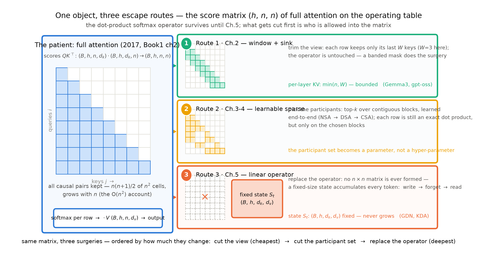
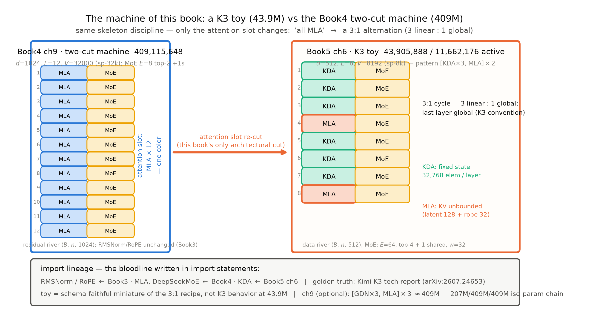

# 导览：注意力躺在手术台上

> 本章无实验、无数值引注——43.9M、32,768、3:1 这些数字都只当路标，后续章节会带证据等级重新登场（图 0.1/0.2 的复现命令见各自图注）。带着一个问题读：**满注意力还是唯一解吗？如果不是，2026 年的旗舰为什么各自选了不同的刀？**后面十二章都是这句话的展开。

上一册合上时留了一句重话，原样抄在这里：「一条通往 Book5，注意力本体还在 $O(n^2)$ 里等着动手术，2026 旗舰的精读挂了账」（Book4 第 12 章卷末）。现在就站在这条路上兑现。资格也是上一册发的：你拆过 MLA 的箱子、读过无论文的机器、手里还有一台点得着火的 409M 两刀机。但一句潜台词要说破——那两刀都绕开了注意力本体：MoE 动的是前馈插槽，MLA 压的是 KV 的箱子，开箱之后那场逐对打分的精确内积原封未动，$O(n^2)$ 的账一分没少。Book4 省的是「每个 token 付多少钱」，本册问的是更老的一笔账：这场内积本身，凭什么不可替换？

在八册地图上，这是第五站。Book1 到 Book4 教你机器是什么、怎么喂饱、怎么逐插槽升级、怎么把「装知识」与「用知识」分开记账；本册把手术台转正——注意力本体从「唯一解」变成「选型题」：它凭什么可以被换掉、三条突围路线各动哪里、2026 年的旗舰各选了哪把刀、代价与收益怎么算成一本账。总纲只有一句：**满注意力不再是唯一解**——但从「唯一解」走到「选型题」，中间隔着三条路线、两台 1M 真机、一份 47 页的官方报告。

> **最小背景栏**：本册只假设你完整读过 Book1-4——$O(n^2)$ 账与点积消融（Book1 第 2/11 章）、KV 账本与 GQA（Book3 第 6 章）、RoPE 与外推链 PI/NTK/YaRN（Book3 第 4/7 章）、组装学四插槽（Book3 第 8 章）、config 逆向五步法（Book3 第 9 章）、207M 整机（Book3 第 10 章）、MoE 全链/MLA/FP8 与 MXFP4/MTP（Book4 第 2-8 章）、两刀机 409M（Book4 第 9 章）、gpt-oss 精拆与十机型速览（Book4 第 10 章）、LatentMoE 基座（Book4 第 11 章）。除此之外自包含：滑窗注意力（SWA，sliding window attention）、attention sink（汇聚元）、原生稀疏注意力（NSA，Native Sparse Attention）、DeepSeek 稀疏注意力（DSA，DeepSeek Sparse Attention）、线性注意力（linear attention）、门控 Delta 网络（GDN，Gated DeltaNet）、KDA（Kimi Delta Attention）——本册主角都会先教到「你能凭书稿画出它」再投入使用。

## 0.1 读完这本书，你会拥有什么

先说清目的地。合上这本书时，你会有五样东西，外加一样说不成「东西」的东西。

**第一，「满注意力不再是唯一解」的选型判断力。**这是全册题眼。三条突围路线不是论文分类学，是按「改动多少」排好次序的三把刀（图 0.1）：**改视野**——滑窗，算子不动，每个 token 只看最近 $W$ 个邻居（Gemma3 与 gpt-oss 的 config 事实）；**改参与集合**——可学习稀疏，哪些 token 参与变成端到端学出来的块选择（NSA 到 DSA 的减法；GLM-5 全层装机，DSV4 推上 1M）；**换算子**——线性注意力，点积 softmax 整个退役，换成一只固定容量的状态（GDN；Qwen3-Next 到 K3 的 3:1 配方）。读完你能回答：下一台机器，注意力插槽装哪种、为什么、账怎么算？

**第二，三条路线各一台过对拍的 mini 件。**第 2 章的滑窗+汇聚件、第 3 章的块稀疏件、第 5 章的 GDN 双形态件——每件都与官方实现（transformers 5.18.0）逐位对拍，不是「示意代码」。

**第三，一台 43.9M 的 K3 玩具，外加选做的三刀机。**血统写在 import 语句里：Book3 的 RMSNorm 与 RoPE、Book4 的 MLA 与 DeepSeekMoE、本册的 KDA——四代组件装进一台 8 层小机器（第 6-7 章）；第 9 章选做段再把两刀机的 9 层注意力插槽换成 GDN，得到与 Book4 等总参的三刀机——207M→409M→409M，同预算三代架构的对照链收官。

**第四，一本新账：分类型 KV/状态账本。**混合架构把「一台机器一本账」变成了「一台机器三种账」——全局层的 KV 随上下文无界增长、滑窗层被窗宽钉住、线性层干脆是常数（固定状态）。这本账第 1 章立式，第 6 章给出杀手数字（K3 线性层的固定状态只有 MLA 层 1M 账的 0.75%），第 8 章算交叉点。它是你读任何混合架构发布新闻的解毒剂。

**第五，一套读厂商自报数字的防身术。**2026 年的新困难是证据面变薄：预览版论文、只发博客的机型、托管口径的档位。第 11 章把「读厂商自报数字」写成五步法操作手册，配 GLM-5 的双数字全案做解剖标本。

还有一样是心智。半年后公式细节多半忘了，画面会留下——「打分矩阵是作业面，三把刀动的是同一张表」「KV 是账本、状态是记忆」「选型不是对错题，是算术题」。每章小结都会回答：**如果只允许你记住一件事，是什么？**



图 0.1 三条突围路线总览（自绘示意级）：左=手术台上的本体，满注意力的打分矩阵 $QK^{\top}\ (B,h,n,n)$（8×8 示意，填色=因果可见格；下接逐行 softmax 与对 $V$ 加权）；右=三把刀按「改动多少」纵排——路线一裁带（第 2 章，窗口 $W$）、路线二选块（第 3-4 章，可学习稀疏）、路线三废表换固定状态 $S_t\ (B,h,d_k,d_v)$（第 5 章，线性）；底行为三刀排序。复现：`python "[`code/ch00/make_figures.py`](code/ch00/make_figures.py)" --only 1`（秒级）

## 0.2 卷间契约：从 Book4 出发

册与册之间立契约：上一册交出什么、本册新增什么、改什么。表 0.1 是本册与前四册的完整契约——迷路时回来看一眼。

| 契约栏 | 明细 | 地址 |
|---|---|---|
| **已知基础**（四册已教，直接指回、不再重教） | $O(n^2)$ 账、点积兼容性函数与消融 | Book1 第 2/11 章 |
| | 注意力三角色/因果掩码/FFN 数据流 | Book1 第 3-7 章 |
| | GPT-2 底座与训练五件套 | Book2 第 10 章 |
| | 四插槽组件（RMSNorm/SwiGLU/RoPE/untied 词表） | Book3 第 2-5 章 |
| | KV 账本与 GQA | Book3 第 6 章 |
| | 外推工程线 PI/NTK/YaRN | Book3 第 7 章 |
| | 组装学（插槽世界观） | Book3 第 8 章 |
| | config 逆向五步法（含 iRoPE config） | Book3 第 9 章 |
| | 207M 整机与训练配方 | Book3 第 10 章 |
| | MoE 全链（机构→难题→DeepSeekMoE） | Book4 第 2-5 章 |
| | MLA（KV 低秩装箱/解耦位置键/权重吸收） | Book4 第 6 章 |
| | FP8/MXFP4 格式课与训练侧低精度 | Book4 第 7 章 |
| | MTP（多 token 预测） | Book4 第 8 章 |
| | 两刀机 409M 与四件套先例 | Book4 第 9 章 |
| | gpt-oss 精拆与十机型速览（窄窗与 sink 的 config 事实） | Book4 第 10 章 |
| | LatentMoE 基座 | Book4 第 11 章 |
| | 激活参数口径与单双份判定 | Book4 第 1/10 章 |
| **本册新增** | why 开题：三笔旧账+三条路线地图+分类型账本立式 | 第 1 章 |
| | 路线一：滑窗与汇聚（SWA/sink；本机复现 lost-in-the-middle） | 第 2 章 |
| | 路线二：NSA→DSA 与两台 1M 真机（证据等级实战主场） | 第 3-4 章 |
| | 路线三：线性注意力（kernel/delta rule/GDN；Qwen3-Next 整机） | 第 5 章 |
| | K3 报告精读·上（KDA/Gated MLA/NoPE/AttnRes+43.9M 玩具） | 第 6 章 |
| | K3 报告精读·下（Stable LatentMoE 三处方/MXFP4 QAT/原生多模态） | 第 7 章 |
| | 长上下文两条哲学（外推 vs 状态压缩；iRoPE 调和） | 第 8 章 |
| | 2026 混合配方谱系+选做三刀机四件套 | 第 9 章 |
| | 能力扩展专题（多模态三步曲/后训练链概览） | 第 10 章 |
| | 读厂商自报数字五步法 | 第 11 章 |
| **架构修改**（一刀，演化线本册段） | 注意力插槽：满注意力→3:1 混合（3 线性:1 全局）——K3 玩具 $[\mathrm{KDA}\times3,\ \mathrm{MLA}]\times2$（第 6 章）与三刀机 $[\mathrm{GDN}\times3,\ \mathrm{MLA}]\times3$（第 9 章选做，与两刀机等总参）；归一化/位置/前馈插槽全承前册不动 | 第 6/9 章 |

表 0.1 卷间契约三栏（自排）

三栏各有一句话。已知基础=**本册不重教**（遇到 GQA、五步法直接指回）；新增是正文主体；修改一栏是四册以来最克制的一次：Book3 动四格加一刀、Book4 动两格、本册只动一格——注意力插槽，且动的是**层的排布节律**而非零件本身。这也是 2026 旗舰的真实改法：K3 全机 93 层里 69 层线性、24 层全局，Qwen3-Next 48 层里 36:12，动的都是这一格的排布【证据等级：config 逆向】。其余插槽一件不换——本册直接站在上一册的资产上。

## 0.3 先看一眼我们要造的机器

出发前先看清两样东西：刀下的本体，与我们的终态。

**例 0.1（构造例）** 动刀之前，先看一眼手术台上躺着什么。设 1 个头、3 个 token（$n=3$）、$d_k=2$，取好算的数，打分已算出：

$$S=QK^{\top}:\ (1,1,3,2)\cdot(1,1,2,3)\ \to\ (1,1,3,3)=\begin{pmatrix}2&\cdot&\cdot\\ 1&3&\cdot\\ 0&1&2\end{pmatrix}$$

三步走完满注意力的前半生：① 打分——$QK^{\top}$ 产出 9 格；② 因果掩码——右上 3 格不可见（记 $\cdot$），剩 6 格；③ 逐行 softmax——第 3 行 $[0,1,2]$ 归一为约 $[0.09,0.24,0.67]$，每行和为 1。效果读法：这 9 格就是本册全部手术的作业面——第 2 章裁它的带、第 3-4 章选它的块、第 5 章干脆不再物化这张表。

九格矩阵是「现状」，那「终态」长什么样？图 0.2 把两台机器并排：左边是 Book4 第 9 章的两刀机——12 层，注意力格 MLA 一色；右边是本册第 6 章的 K3 玩具——8 层，$[\mathrm{KDA}\times3,\ \mathrm{MLA}]\times2$，注意力格从「一色」变成「三青一橙」：三层线性 KDA 管记忆、第四层全局 MLA 管账本，末层全局承 K3 惯例。真机同款节律：K3 的 93 层里 69 层 KDA、24 层 MLA【证据等级：config 逆向+官方技术报告 arXiv:2607.24653】。玩具是这台 1T 机器的缩微同构样机——机制同构、规模无关，行为外推的边界第 6 章声明。



图 0.2 K3 玩具粗图 vs Book4 两刀机（自绘示意级，3:1 层带高亮）：左=Book4 第 9 章 409M 两刀机（12 层，注意力格 MLA 一色，$d$=1024）；右=本册第 6 章 K3 玩具（8 层 $[\mathrm{KDA}\times3,\mathrm{MLA}]\times2$，青=KDA 线性层、橙=保留的全局 MLA 层，$d$=512，末层全局承 K3 惯例）；底部=import 血统（RMSNorm/RoPE←Book3，MLA/DeepSeekMoE←Book4，KDA←本册第 6 章）与玩具外推声明；第 9 章选做三刀机 $[\mathrm{GDN}\times3,\mathrm{MLA}]\times3$ 在底行注记。数字为定版路标，正文引用以第 6 章 assert 为正身。复现：`python "[`code/ch00/make_figures.py`](code/ch00/make_figures.py)" --only 2`（秒级）

这里钉死一个跨册对读口径。Book4 第 9 章卷末有一句：「往后的分岔也登记清楚：Book5 的 3:1 混合改装是选做支线（注意力手术的另一片战场），本册两刀机不参与。」——这句「不参与」是 Book4 册内的岔路登记：那一册不做此改装，机器封存待用。本册第 9 章的选做段正是以它为底座的演化线续章（系列演化线「FFN 换 MoE + GQA 换 MLA（Book4）→ 注意力换 3:1 混合（Book5，选做）」钦定此选法）。两册对读的口径在此说定：两刀机不是被退役，是上一段演化线的终点、下一段的底座。

造机姿势与前三册一脉相承：不是重造，是改装——这次整台机器的族谱都写在 import 语句里，每一处来路可追溯（第 6 章逐行兑现）。

## 0.4 旅程地图：五段

整册书是一条旅程，分五段加一场收束。迷路时回到这张地图：

| 段 | 章 | 我们在做什么 | 一句话 |
|---|---|---|---|
| 为什么 | 第 1 章 | 三笔旧账开题+三条路线地图+分类型账本立式 | 满注意力凭什么被质疑 |
| 三条路线 | 第 2-5 章 | 改视野（滑窗与汇聚）→改参与集合（NSA→DSA；两台 1M 真机现场）→换算子（kernel→delta rule→GDN） | 按改动多少递进的三把刀 |
| 真机精读 | 第 6-7 章 | K3 官方报告逐节精读（注意力侧/效率侧）+43.9M 玩具与短训 | golden truth 的正面案例 |
| 哲学与谱系 | 第 8-9 章 | 外推 vs 状态压缩两条哲学+2026 配方谱系+选做三刀机 | 路线走完后的收拢 |
| 扩展与方法论 | 第 10-11 章 | 多模态三步曲与后训练链概览+读厂商自报数字五步法 | 架构册的能力地图与防身术 |
| 收束 | 第 12 章 | 三条路线判决+钩子总决算+新账移交 | 满注意力不再是唯一解 |

次序为什么必须这样？「先拆路线、后读真机、再收哲学」不是排法偏好，是资格问题：精读 K3 报告时的每个机制，都应能指回「我们在第 N 章亲手写过它的 mini 版」；哲学章那张外推 vs 状态压缩的对表，是三条路线走完后自然分出的岔口——没造过刀的人看对表，只能沦为抄立场。路线章内部同样按构造逻辑递进：从最便宜的刀开到最深的，每把刀都从「它解决哪笔账」问起。

也别以为这三条路线是论文里的分类学——工程已经把它们收编成了配置文件的字段名。实物 0.1 是 transformers 5.18.0 通用掩码层的层类型词表：

```python
LAYER_PATTERN_TO_MASK_FUNCTION_MAPPING = {
    "full_attention": create_causal_mask,
    "sliding_attention": create_sliding_window_causal_mask,
    "chunked_attention": create_chunked_causal_mask,
    "compressed_sparse_attention": create_sliding_window_causal_mask,
    "heavily_compressed_attention": create_sliding_window_causal_mask,
    …（略一行及注释）…
    "indexed_attention": partial(create_causal_mask, allow_is_causal_skip=False),
    "linear_attention": create_recurrent_attention_mask,
    "conv": create_recurrent_attention_mask,
    …（略 hybrid 两行）…
}
```

实物 0.1 层类型词表 dump（transformers 5.18.0 `masking_utils.py` L1507-1520 原样摘录、节选）【证据等级：config/源码】

看键名：`sliding_attention` 就是路线一（窗口），`indexed_attention` 与 `compressed_sparse_attention` 就是路线二（DSA 与 DSV4 的稀疏索引），`linear_attention`/`conv` 就是路线三（递归状态）。我们接下来四章要教的，工业界已写进词表——不是将来时，是现在完成时（第 1 章 1.5 节逐字段展开）。

## 0.5 三条贯穿线索

旅程里有三条线。盯住它们，十二章会从「十二章的文章」读成「一个故事」。

**一条代码线。**两刀机（Book4 第 9 章）→ K3 玩具 43.9M（第 6 章）→ 三刀机（第 9 章选做）——一律 import 复用、不复制：Book3/Book4 的件原样进机身，本册各章交付的新件（滑窗件、块稀疏件、GDN 件、KDA 件、三处方件）都过「与正身逐位一致」的 CPU 对拍。依赖永远单向，旅程停在任何一站，你手里都是一台当下完整、能跑的机器。

**一条伏笔线。**前四册留下的指向本册的欠账共十一笔主钩、六笔次级钩，本册逐笔回收；另埋八笔新钩（B5-1~8）流向后续三册。表 0.2 全量展示——完整欠账框见各章章末，总决算在第 12 章。

| # | 钩子（一句话） | 本册落点 | 状态 / 去向 |
|---|---|---|---|
| F11 | 原典 restricted attention 的占位 | 第 2 章开篇即兑（「2017 年的占位成了定式配置」） | 本册回收 |
| F12 | 「比点积更复杂的兼容性函数」通行证 | 第 1 章立、第 3/5 章兑现 | 本册回收 |
| F13 | 文本之外的模态 | 第 10 章多模态三步曲 | 本册回收（Book4 半句已兑） |
| B3-3 | 外推 vs 状态压缩两条哲学 | 第 8 章主场 | 本册回收 |
| B3-4 | 后训练链 | 第 10 章概览 | 本册回收 |
| B3-5 | 读厂商自报数字手册 | 第 11 章正身 | 本册回收（Book4 半句已兑） |
| B3-7 | partial RoPE / NoPE 头维净土 | 第 6 章落点+第 8 章收束 | 本册回收 |
| B4-2 | MLA 开箱后的换算子战线；Gated MLA | 第 2 章起步+第 6 章正身 | 本册回收（Book7 第 9 章半句保留不动） |
| B4-3 | K3 的 MXFP4 量化感知训练 | 第 7 章 | 本册回收半句（主落点在 Book6/8） |
| B4-5 | 窄窗与汇聚元的机制与收益 | 第 2 章主场 | 本册回收 |
| B4-6 | Stable LatentMoE 三处方 | 第 7 章正菜 | 本册回收 |
| F1 | $O(n^2)$ 旧账 | 第 1 章开题 | 本册回收 |
| F6 | 位置外推 | 第 8 章 | 本册回收 |
| F9 | 检索与注意力本体的余脉 | 第 10 章 | 本册回收 |
| F10 | 容量→上下文长度接力棒 | 第 4 章+第 8 章 | 本册回收 |
| N6 | few-shot 的能力侧 | 第 10 章 | 本册回收 |
| N7 | 上下文长度主线 | 第 4 章+第 8 章 | 本册回收 |
| B5（→Book6） | 账本的服务侧语义；K3 报告的 MTP 合流事实 | 第 2/7 章埋设 | Book6 第 5/10 章 |
| B5（→Book7） | 线性层的引擎后端 | 第 5 章埋设 | Book7 第 9 章 |
| B5（→Book8） | 1M 的服务侧账；KV/状态联合管理；多模态服务；读数方法论的复用 | 第 6/8/10/11 章埋设 | Book8（其一为弱候选，看篇幅） |

表 0.2 伏笔台账预览（自排；F=Book1 埋设、N=Book2、B3/B4=Book3/4；十一钩+次级六钩全量，B5 新钩以代称预告、机制见后续册；B5-8 为第 9 章设计文档内置的文档锚，不入正文）

**一本新账。**分类型 KV/状态账本是本册的第三条线：同一台机器里，全局层的 KV 随 $n$ 无界增长、滑窗层的账被窗宽 $W$ 钉死、线性层的账是常数（固定状态）——一台机器的上下文成本第一次能逐层算清。这本账从第 1 章立式记到第 12 章移交——它的服务侧读法（同一池子里谁滚动淘汰、谁全保）是后续册的正题，本册只把「需求」立在账上。

## 0.6 这本书的纪律与约定

六条纪律，读之前说清楚。

**时间冻结在旗舰世代 2026，纪律换血。**K3、DSV4、GLM-5、Qwen3.5 四家进正文主线；冻结线后的对象（GLM-5.3、DSV4.1 这类）只入悬案框与脚注。Book4 的禁词表在本册废止——滑窗、sink、稀疏、线性、混合架构、KDA、多模态、后训练链，全是本册正菜；换上的新禁词是推理系统与引擎册的那套名词（roofline、批处理五部曲、张量并行、PD 分离这类，以及 vLLM 的专有名词）——正文一律不出现、不解释，只允许在七处白名单位置（本段元话语、章末欠账框、展望预告句、收束章回指、实现对照框、案例章豁免、否定语境点名）以「点名+去向」的方式露一面。代价与收益和前四册相同：看不到最新版，看得清每个设计为何非如此不可。

**K3 精读纪律是本册生命线。**凡引 Kimi K3，一律双锚口径：官方技术报告 arXiv:2607.24653 加本地 PDF 页码，每句机制断言带节号；报告图的版权条款禁用，机制主图从零原创；未细读的节不引具体细节。DSV4 的论文是预览版（arXiv:2606.19348），引用处一律带「预览版」标注；2026 旗舰的 benchmark 成绩一律厂商自报标注。

**大项目暂缓声明。**本册无独立大项目章（作者决策 2026-10-05）：单轨选做「注意力换 3:1」整机按四件套交付——整合代码、分钟级冒烟、半小时级短训、「重启即可执行」的设计文档（第 9 章）。K3 玩具是第 6-7 章的正菜实验，正常排期不暂缓；其余各章实验一概不缩水。

**每个数字都有出处等级。**官方论文＞官方技术报告＞config 逆向＞第三方复测＞厂商自报，从严到宽随行标注；本书自测数字全部来自本机真实运行（数值对拍一律 CPU fp32，计时与内存走 MPS 口径），复现命令附在各章「动手验证」。

**两项新制度：玩具级例子与产物实物。**从本册起（作者 2026-10-05 增补），每个关键知识点配一个可心算的 toy 例——编号、小数字、步骤化、每步标输入输出、结尾一句效果读法（本章样例=例 0.1）；每个关键产物给实物本体——原样摘录或同构缩样，不以形容代替（本章样例=实物 0.1）。例子给流程、实物给产物，一册到底。

**环境与先修。**先修只要 Book1-4；一台 Apple Silicon 笔记本可复现全部实验（模块实验分钟级、短训半小时级、计时独占窗口）；语料沿用前册两套缓存（引用数字带词表标签）；单种子加判据预注册——先立判据再跑，结果无论方向都如实报告；随书仓库零数据零权重，语料与权重运行时下载、缓存落本地。

所以，回到开篇的问题：满注意力还是唯一解吗？本册用十二章回答「不再是——但也没有唯一的替代」，答案不是听来的，是算出来的：三条路线各有一本账，一台机器选哪把刀，让账本说话。第一站从还三笔最老的欠账开始——2017 年论文 Table 1 第 4 行的那个占位、点积兼容性函数那句预言，还有 $O(n^2)$ 这笔从 Book1 记到今天的账：到 1M 时代，它涨成了什么规模。

现在，深呼吸。手术灯已经亮起——第一刀，还是从账本开始。

---

*下一章：第 1 章 满注意力仍是唯一解吗——三笔旧账、三条路线与一本新账：打分矩阵与 KV 两本账随 $n$ 涨到什么规模，三条突围路线的地图怎么画，分类型账本立式；从 2017 年那扇论文自己留的门读起。*
