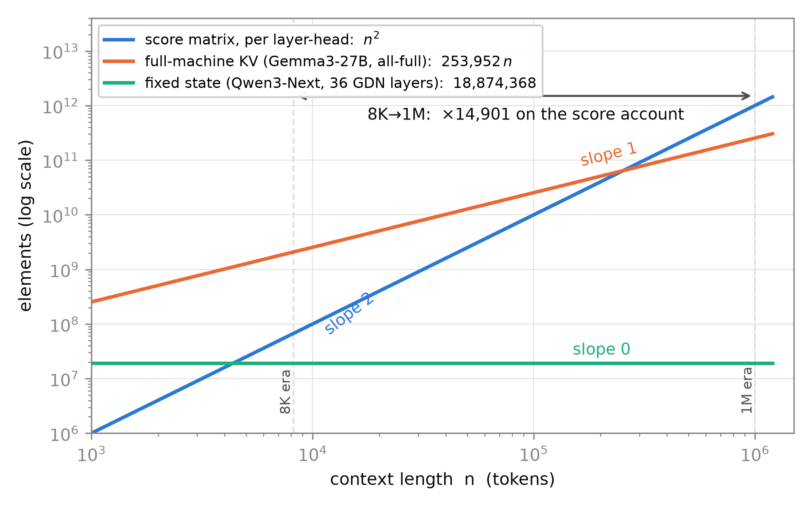
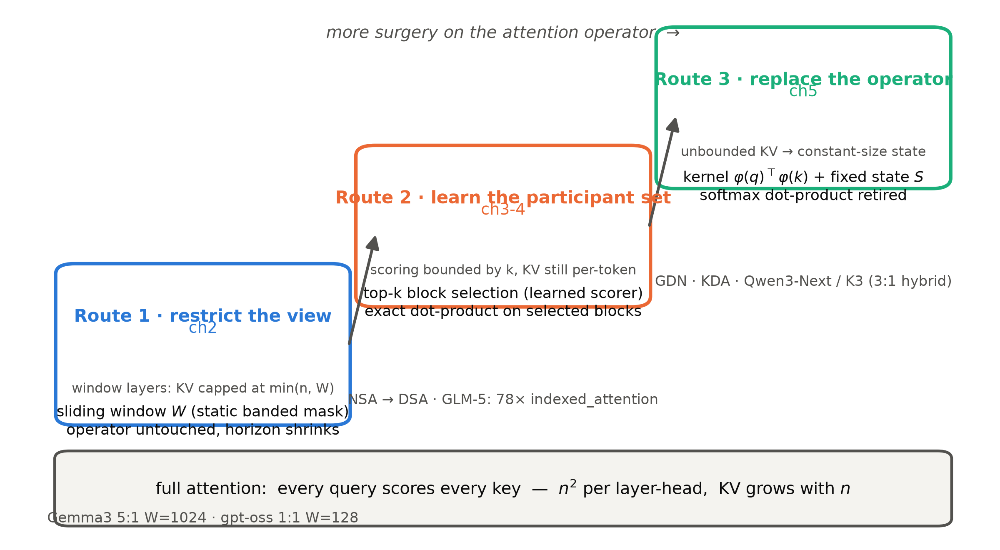

# 第 1 章 满注意力仍是唯一解吗——三笔旧账、三条路线与一本新账

## 1.0 开篇：从全书到这里

导览合上时，我们已经把地图钉在了墙上：这本册子要对注意力本体动手术——把 Book4 那台挨过两刀（FFN→MoE、GQA→MLA）的 409M 机器继续往下改，改到注意力插槽不再是清一色的满注意力；墙角还挂着一张 43.9M 的 K3 玩具图纸，和一条贯穿全书的代码线。但导览没有回答一件事：**这一刀凭什么敢动？**满注意力是 2017 年原典的全部家当，Book1 到 Book4 四册造的每一台机器，注意力插槽里装的都是它原封不动的算子——九年里全行业真的找到替代品了吗？

本章是本册唯一一章专职的「为什么」，要回答的问题只有一句话：**满注意力（full attention）仍是唯一解吗？**我们分三步走：先把 2017 年就记下的三笔旧账取回来、看看它们到 1M 上下文时代涨成了什么规模（1.1-1.2）；再沿「改动多少」把全部突围方案排成三条路线、画出本册的作战地图（1.3-1.4）；最后立起本册的新工具——一本分类型记的 KV/状态账本（1.5-1.6），它是此后每章拆真机都要掏出来的算盘。产出三样：三笔旧账的清算单、三条路线的地图（图 1.2）、一本新账的公式表（表 1.2）。

本章结束时，「敢动刀」有了两重根据——账单上的（两笔账都随长度失控）与工程界的（三条路线已经写进了配置文件的词表）；而「第一刀怎么下」——最便宜的那刀从哪里落——留给下一章。

> **最小背景栏**：本章默认你已读过 Book1 第 2 章（打分矩阵与 $\sqrt{d_k}$ 点积、Table 1 的复杂度表）与第 11 章（三笔大账与十八笔伏笔的集中清算）；Book3 第 6 章（KV 账本与 GQA 记号：每 token 每层 KV 元素 $=2h_{kv}d_k$）、第 8 章（插槽组装学）、第 9 章（config 逆向五步法）；Book4 第 6/9 章（MLA 与两刀机）、第 10 章（gpt-oss 精拆与十机型 config 事实）。符号沿用：层数 $L$、上下文长度 $n$、查询头数 $h$、KV 头数 $h_{kv}$、头维 $d_k$、残差流宽 $d$；「层/头/token」三口径的账本单位是**元素个数**（不是字节；字节数再乘精度宽度，与 Book3/Book4 口径一致）。

## 1.1 三笔旧账：2017 年记下的、1M 时代到期的

动刀之前，先把借据原文取回来。Book1 结账时留过一张十八笔的伏笔总账，其中三笔的回收地址写着本册，而它们全部源于同一张 2017 年的 Table 1。

**第一笔，F1：$O(n^2)$。**原典 Table 1 第一行白纸黑字：自注意力每层 $O(n^2\cdot d)$。Book1 第 2 章讲完这张表，在章末欠账框里把话挑明了：

> 「$O(n^2)$：二次方不是 bug，是 2017 年用复杂度换 $O(1)$ 路径长度的成交价。句长 30 的翻译机付得起；长序列时代这笔账要重谈——稀疏与线性注意力从数学侧还（restricted attention 那行 future work 是原始借据），系统侧则从显存与 kernel 还。→ Book5 第 1 章（三条突围路线总览）、Book6 第 3 章（推理显存的偿付）」【证据等级：Book1 第 2 章章末欠账框直引】

「成交价」的来路 Book1 第 2 章复盘过：让每个词一步看见所有词（任意两位置路径长度 $O(1)$），代价就是两两都得算一遍。翻译机时代句长 30，这笔账付得起；可 Book4 拆到的旗舰已经站在 131K 上下文上，2026 年的新旗舰（DSV4、GLM-5.2、Kimi K3）把 config 里的 `max_position_embeddings` 写到了 $1{,}048{,}576$——1M 档成了旗舰门槛，Qwen 系原生 262K，其中 Qwen3-Next 外推到 1M 档、Qwen3.5 托管到 1.01M（均为厂商自报；口径之分第 8 章对表）。$n$ 涨了三个数量级，平方律的账会涨六个数量级——具体涨成什么数，1.2 节马上算。

**第二笔，F11：restricted attention 的占位。**原典 Table 1 第四行还藏着一行更耐人寻味的：「Self-Attention (restricted)」，复杂度 $O(r\cdot n\cdot d)$——只对以输出位置为中心、大小 $r$ 的邻域做注意力。论文对它的全部承诺是 §4 的一句 *"We plan to investigate this approach further in future work."*（我们计划在未来工作中进一步研究这一方向）【证据等级：官方论文 v7 §4，承 Book1 第 2 章直引】。Book1 讲 Table 1 时对这行占位下过一句判词：

> 「这行 2017 年的占位在后世的长上下文模型里成了定式配置（→ Book5 第 2 章）。」【证据等级：Book1 第 2 章成稿直引】

「定式配置」四个字在 Book4 已经眼见为实：gpt-oss 的 config 里写着 `sliding_window=128`，24 项 `layer_types` 里一半是滑窗层——2017 年那句 future work，六年后成了 Gemma 与 gpt-oss 的两行 config 字段。这张 IOU 的正面兑付在第 2 章。

**第三笔，F12：兼容性函数的口子。**Book1 清算时顺路登记的最后一张小额借据，原文出自论文 §6.2 的 (B) 行讨论——缩放点积消融的收尾处：

> *"a more sophisticated compatibility function than dot product may be beneficial"*（比点积更精巧的兼容性函数可能有益）——「这是给整个注意力变体领域发的通行证（F12），Book5 全册都在兑现它。」【证据等级：官方论文 v7 §6.2 (B) 行 + Book1 第 11 章成稿直引】

三笔账摆在一起，结构就清楚了：F1 是总账（平方律），F11 是路线一的原始借据（裁视野），F12 是路线三的通行证（换算子）——而夹在中间的路线二（让「参与哪些 token」本身可学），是在还 F1 这笔总账的路上长出来的中间形态。本册后面十一章正文（第 1-11 章），就是这三笔账的分期偿还计划；本章先立两样东西：账到底多大（1.2），以及三条还款路线的地图（1.3）。

## 1.2 两本随 $n$ 涨的账：打分矩阵与 KV 缓存

借据摆开了，现在算账——先算打分账。满注意力每层每头要做全部 query 对全部 key 的打分：输入 $Q\in(B,h,n,d_k)$、$K\in(B,h,d_k,n)$，一次矩阵乘 $(B,h,n,d_k)\cdot(B,h,d_k,n)\to(B,h,n,n)$——打分矩阵（score matrix）本身就是账：

$$
a_{\text{score}}(n) \;=\; n^2 \quad\text{（每层每头打分元素；因果情形有效格 } \tfrac{n(n+1)}{2}\text{）}
\tag{1.1}
$$

用人话说：**打分矩阵自己就是个 $n\times n$ 的方阵，序列多长、表就多宽，表的面积按边长的平方长。**Book1 第 2 章实测过它的显存面孔（$n$ 从 64 扫到 512，每头每样本的表涨整整 64 倍）；现在把 $n$ 推到旗舰档位再算一遍：

**例 1.1（构造例：$n$ 翻倍，表翻四倍）** 取可心算的小数字：输入 $n=4$ 个 token → 打分矩阵 $4\times4=$ **16 格**（因果上三角有效格 $4\times5/2=10$）；输入 $n=8$ → $8\times8=$ **64 格**（上三角 36）。输出对比：长度只翻了一倍（$4\to 8$），表的格数翻了四倍（$16\to 64$）。这个例子让你看见平方律的手感——**每加长一倍上下文，打分账就乘 4**；加长三个数量级，账乘六个数量级。

把四档真实长度代入式 (1.1)（[`code/ch01/context_account.py::score_matrix_account`](code/ch01/context_account.py#L82) 复算，JSON 落 `log/book5-ch01/`）：$n=2{,}048$（GPT-2 训练长度）→ 每层每头 $4.19\text{M}$ 格；$n=8{,}192$（Gemma 2 上下文）→ $67.1\text{M}$；$n=131{,}072$（Gemma 3 / gpt-oss 声明上下文）→ $17.2\text{G}$；$n=1{,}000{,}000$ → **$10^{12}=1\text{T}$ 格**【证据等级：本书实验（CPU，2026-10）】。先把「1M」的口径钉死：叙述与打分演示里的 1M 取整数 $10^6$（好算）；各机 config 满档的 1M 是 $2^{20}=1{,}048{,}576$，1.6 节表 1.3 的账本一律按 config 值计——同一本「1M 账」两个 $n$，相差约 5%，后文不再逐处重申。另一层口径：这还只是**单层单头**的账——每层每个查询头各有一张表，整机再乘 $L\times h$（Gemma3-27B 是 $62\times32=1{,}984$ 张）。放大倍数：$131\text{k}/8\text{k}$ 是 $(16)^2=256\times$；$1\text{M}/8\text{k}$ 是 $10^{12}/8192^2\approx 14{,}901\times$——**上下文长度涨 122 倍，单是每层每头的打分表就涨约 1.5 万倍**。这笔账在进入计算之前先淹的是显存：$17.2\text{G}$ 个格子的 fp32 打分表一张约 64 GiB，比整台 Gemma3-27B 的权重（bf16 约 54 GB）还大。

> **实物 1.1（JSON 读数，看什么：两个数字的对比）** 产物文件 `log/book5-ch01/context_account_run1.json` 的打分账两行——
> ```json
> {"n": 131072, "n2_elements_per_layer_head": 17179869184, "causal_upper_triangle": 8590000128, "ratio_vs_8192": 256.0}
> {"n": 1000000, "n2_elements_per_layer_head": 1000000000000, "causal_upper_triangle": 500000500000, "ratio_vs_8192": 14901.2}
> ```
> 看第二行的第三个字段：同一台机器、同一层同一个头，只是把上下文从 128K 换到 1M，打分元素涨了 14,901 倍——式 (1.1) 不是抽象公式，是这张表的读数。【证据等级：本书实验（CPU，2026-10）】

打分账之外还有第二本：**KV 缓存账**。推理期每个 token 的 K、V 都要留下来给后面的 token 用，Book3 第 6 章立过账：每 token 每层新增 $2h_{kv}d_k$ 个元素，$n$ 个 token 累计 $2Lh_{kv}d_k\cdot n$——**线性、无界**。这笔账 Book4 拆 gpt-oss 时记过每 token 增量口径（24 层 24,576 元素），存量口径同样吓人：Gemma3-27B 若 62 层全是满注意力，每 token $2\times62\times16\times128=253{,}952$ 元素，@128K 全满存量 $3.33\times10^{10}$ 元素 ≈ 66.6 GB（bf16）——比权重本体（27B×2 字节 ≈ 54 GB）还大；推到 1M 就是 508 GB【证据等级：本书复算（config 公式，承 Book4 ch10 config 事实）】。Gemma 3 报告开篇那句动机原话说得直白："A challenge with long context is the memory explosion of the KV cache during inference."【证据等级：官方技术报告 2503.19786 §1 直引】

两本账的付账节奏还不一样，这个区别此后每章都要用到。KV 账是**存量账**：每个 token 落地时添一笔，之后一直躺在缓存里等着被后面的 token 读——账单只取决于「攒了多少 token」。打分账是**流量账**：训练与整段前向时，$n\times n$ 的表一次摊开算；逐 token 生成时，每来一个新 query 都要对已有的全部 key 重新打一遍分——每步付 $n$，生成到第 $n$ 个 token 累计又是 $n^2$ 量级。一本挤显存、一本耗算力，突围路线动刀时省的是哪本、没省的是哪本，1.6 节的账本会逐栏对账。

两本账，一本平方、一本线性，病根却是同一个：**每个 query 看所有 key**。打分表为什么是 $n^2$？因为 $n$ 个 query 每个都要对 $n$ 个 key 逐一打分；KV 为什么无界？因为「所有 key」里没有哪个敢扔——扔了下一个 token 可能就要用。把这两本账、连同即将登场的一种新层，叠在一幅对数坐标上（图 1.1），三条线的斜率就是本章的全部分水岭：平方（斜率 2）、线性（斜率 1）、还有一个此前四册从未出现过的家族——**常数（斜率 0）**：有一种层，不管来多少 token，状态就那么大。它是路线三的产物，先在图上亮个相，1.6 节给它立正式账本。



图 1.1 三族增长行为（双对数）：蓝=满注意力打分元素/层/头（$n^2$，斜率 2）；橙=Gemma3-27B 全满口径的全机 KV 元素（$253{,}952\,n$，斜率 1）；青=Qwen3-Next 36 层 GDN 的固定状态（18,874,368 元素，斜率 0）。8K→1M 打分账放大 14,901 倍（箭头）。数据源：本书复算（config 公式），脚本 [`ch01/context_account.py`](code/ch01/context_account.py)。

## 1.3 三条突围路线：按「改动多少」排出的三把刀

账算完了，怎么还？把 2019 年以来所有「给注意力省账」的方案摆在一起，很容易写成一篇分类学：窗口类、稀疏类、线性类、压缩类……本册不走这条路。我们是**构造的逻辑**：要造一台付得起 1M 账的机器，下一步能动的部件是什么、按动多少排序——改动从少到多，恰好排出三把刀（图 1.2 的阶梯）。

**第一把刀：改视野（restrict the view）——滑窗注意力（sliding-window attention, SWA）。**算子一个字不动，只把「每个 query 看所有 key」裁成「每个 query 只看最近 $W$ 个 key」——第 $t$ 个 query 只对 $[\max(0,t-W+1),\,t]$ 窗内的 key 计分，掩码从三角变成带状（banded）。打分账从 $n^2$ 降到 $nW$，窗内 KV 之外的全部可以不留在缓存里。代表机型：Gemma3（52 滑窗 + 10 全局交替、窗 1024【证据等级：官方技术报告 §2 + config】）、gpt-oss（1:1 交替、窗 128【证据等级：承 Book4 ch10 表 10.1】）。这是 F11 那行 2017 年占位的直系后代——第 2 章主场。

**第二把刀：改参与集合（learn the participant set）——可学习稀疏（learnable sparsity）。**视野还是可能太窄：有些任务要的信息在 500K 之外，窗口够不着。那就让「参与哪些 key」本身变成学出来的：一个轻量打分器给每个块（block）打分，每个 query 只对得分最高的 $k$ 个块做**精确的**点积 softmax。算子没换、视野不限，换的是参与名单——而且名单是内容相关的（查代码就看代码块、查日期就看日期段）。代表机型：NSA→DSA（DeepSeek 系）、GLM-5（78 层全部 DSA【证据等级：config 快照】）。第 3-4 章主场。

**第三把刀：换算子（replace the operator）——线性注意力（linear attention）。**前两把刀有个共同的没说破的事实：只要参与集合超过窗宽、块数一多，每一对 query-key 仍要做精确内积。第三把刀动到本体：把点积 softmax 整个换成一个固定维度的特征映射 $\varphi(q)^\top\varphi(k)$，$n$ 个 key-value 不再逐对算，而是累加进一个**固定大小的状态** $S$——图 1.1 里那条斜率 0 的线就是它的账。代价也直白：状态是压缩过的，精确检索做不到了（这条负结论第 5 章正面展开）。代表机型：Gated DeltaNet（Qwen3-Next 36 层）、KDA（Kimi Delta Attention，Kimi K3 69 层）——两家都以「3 线性 : 1 全局」混装。第 5 章主场。



图 1.2 三条路线「改动多少」阶梯（示意级，自绘）：底座=满注意力；三步依次动 mask 几何、动参与集合、动算子本身——每步的 KV/状态行为注在台阶底部。机型与章号对应表 1.1。

表 1.1 三条路线速览（机制一行 / 账本行为 / 代表机型 / 主场章）

| 路线 | 动什么 | 打分账 | KV/状态账 | 代表机型 | 章 |
|---|---|---|---|---|---|
| 一 改视野 | mask 几何（窗宽 $W$，静态） | $nW$ | 滑窗层有界 $\min(n,W)$，全局层仍无界 | Gemma3（5:1）、gpt-oss（1:1 窗 128） | ch2 |
| 二 改参与集合 | 块级 top-$k$ 选择（可学习） | $nk$ | 打分有界、KV 仍逐 token 存 | NSA→DSA、GLM-5（78 层全 DSA） | ch3-4 |
| 三 换算子 | 相似度函数 $\varphi(q)^\top\varphi(k)$ | 对 $n$ 线性 | **固定状态，与 $n$ 无关** | GDN（Qwen3-Next）、KDA（K3） | ch5 |

现在把三把刀放回 1.0 的那个问题：注意力到底是什么？本书从 Book1 起一直用的工作定义是——**注意力 = 逐 token 的全局信息混合器**。这个定义拆开来有三件套：视野是全局的（每个 query 看所有 key）、打分是精确的（softmax 点积把权重削尖到可以逐位取回）、计算是逐对的（$n^2$ 张表）。三笔账正是三件套的价签，三把刀正是逐件拆包：路线一裁「全局」、路线二裁「逐对」（只对选中的算）、路线三裁「精确」（换掉打分函数本身）。**没有哪把刀把三件全拆**——这正是 2026 年旗舰全是混合架构（hybrid architecture）的原因：Gemma3 留着每 6 层一见的全局层，Qwen3-Next 与 K3 用 3:1 把线性层与全局层混装——第 9 章会把这些配方谱系拼成一张总表。满注意力没有被打败，它被**稀释**了：从「每一层都是它」变成「配方里的一味」。

## 1.4 softmax 不是注意力的本体：相似度函数才是

三把刀里，前两把都还在满注意力的算子里打转——它们不质疑「query 和 key 怎么比相似」，只裁「跟谁比」。第三把刀敢把算子整个换掉，底气来自哪里？来自 F12 那扇 2017 年论文自己留的门。要把这扇门看清楚，需要一个预科视角：核（kernel）视角。

把注意力的输出改写成统计学里的非参数核平滑（kernel smoother，Nadaraya-Watson 估计）形式：

$$
\mathrm{Attn}(q_i) \;=\; \frac{\sum_{j\le i}\kappa(q_i,\,k_j)\,v_j}{\sum_{j\le i}\kappa(q_i,\,k_j)}
\tag{1.2}
$$

其中 $\kappa(\cdot,\cdot)$ 是任意一个非负相似度函数（kernel）。用人话说：**注意力的输出就是「按相似度加权平均的一袋 value」——分子是加权求和，分母是权重归一；只要给我一个「这两个向量有多像」的打分函数，我就给你一种注意力。**2017 年的满注意力在这个菜单上只是一款：$\kappa(q,k)=\exp(q^\top k/\sqrt{d_k})$——softmax 不是别的，就是指数核的归一化；点积不是本体，只是计算指数核的高效方式。这个视角不是后人硬安的：线性注意力的原始论文明确建立在「注意力即在输入上做核平滑」的表述之上【证据等级：官方论文 2006.16236 v3 §3.2】。

菜单上再点一道便宜的菜给读者一个手感：$\varphi(x)=\mathrm{elu}(x)+1$——一个逐元素的非负特征映射，取 $\kappa(q,k)=\varphi(q)^\top\varphi(k)$。它保证非负（elu 输出 $>-1$，加 1 后恒正），没有指数、没有 max 稳定项，算一次是一次乘加。代入式 (1.2) 它就是一台完整的注意力——输出不再是「削尖到某几个 key」的精确取回，而是「整片按浓淡涂色」的平滑混合。锐度差可以用一维小数字摸到：设 $q=2$，两个 key $k=3$ 与 $k=1$——指数核的权重比是 $e^{2\times3}/e^{2\times1}=e^4\approx55:1$（分数差被指数放大成压倒性优势，权重几乎全押在前者）；elu+1 核的权重比只有 $3\times4 : 3\times2=2:1$（分数差几乎原样透传，两个 key 平分秋色）。**指数核是显微镜，elu+1 核是染色剂**——锐度换便宜，这笔交易值不值，是第 5 章的正菜；本章只需要立起那句话：**softmax 不是注意力的本体，相似度函数才是——点积 softmax 只是菜单上最贵的一款。**

回头看 F12 的原文位置会更觉分量：它写在 §6.2 的 (B) 行讨论里——那一行做的正是「把 $d_k$ 缩小会伤质量」的消融（Book1 第 3 章读过），作者摸到的边界是「点积这一款在头维变小时会糊」，于是留了口子「更精巧的兼容性函数可能有益」。compatibility function（兼容性函数）是论文对打分函数的称呼，Book1 第 2 章已登记。九年后回看：路线三整条路都修在这句口子上；而 1.3 节的三把刀也在此合流——**前两把刀裁的是 $\kappa$ 的定义域（跟谁比），第三把刀换的是 $\kappa$ 本身（怎么比）**。F12 通行证的兑现时间表：第 5 章全额。

## 1.5 层类型词表：三条路线已被工程收编

地图画完了，现在看一件让「突围」二字显得过于悲壮的事实：我们要花五章教的三条路线，工业界已经写进了配置文件的词表。HuggingFace transformers 5.18.0 的 `masking_utils.py` 里有一张官方映射表——每种「层类型」（layer type）各配哪种掩码构造：

> **实物 1.2（HF 源码摘录，看什么：三条路线的字段名都在这张表里）** transformers 5.18.0 `masking_utils.py` L1507-1520（本地浅克隆 `repos/transformers`，与安装版本同源；摘录自 [`ch01/context_account.py::vocab_excerpt`](code/ch01/context_account.py#L46) 的 dump 产物）：
> ```python
> LAYER_PATTERN_TO_MASK_FUNCTION_MAPPING = {
>     "full_attention": create_causal_mask,
>     "sliding_attention": create_sliding_window_causal_mask,
>     "chunked_attention": create_chunked_causal_mask,
>     "compressed_sparse_attention": create_sliding_window_causal_mask,
>     "heavily_compressed_attention": create_sliding_window_causal_mask,
>     "minimax_m3_sparse": create_causal_mask,
>     # Indexers always needs to materialize the mask to account for causality (no SDPA `is_causal` shortcut)
>     "indexed_attention": partial(create_causal_mask, allow_is_causal_skip=False),
>     "linear_attention": create_recurrent_attention_mask,
>     "conv": create_recurrent_attention_mask,
>     "hybrid": {"full_attention": create_causal_mask, "linear_attention": create_recurrent_attention_mask},
>     "hybrid_sliding": {"sliding_attention": create_causal_mask, "linear_attention": create_recurrent_attention_mask},
> }
> ```
> 逐行对号：`sliding_attention` = 路线一；`indexed_attention`（DSA）/`compressed_sparse_attention`（DSV4 的 CSA）= 路线二；`linear_attention`/`conv` = 路线三；最后两行 `hybrid` 系 = 混合架构的官方词——一张词表，恰好是图 1.2 的阶梯。【证据等级：config/源码（transformers 5.18.0）】

这张表不只是掩码策略：同一套层类型词还驱动着缓存层的类分发——`full_attention` 层的缓存无界增长、`sliding_attention` 层封顶在窗宽、`linear_attention` 层存的不是 KV 而是「递归状态 + 卷积状态」【证据等级：config/源码（transformers 5.18.0 `cache_utils.py` 层类型映射）】；再往下还有第三张映射，把各层类型分发到对应的注意力实现。一张词表、三张映射，就是混合架构在框架层的「接口宪法」。也就是说，1.6 节要立的分类型账本，在工程侧早有一套按层类型记账的类结构做事实源——我们的新账不是发明，是把工程的类分层写成公式。

最后看一台真机的 dump。用 Book3 第 9 章的 config 逆向法，把 GLM-5 的 config 快照喂给 `GlmMoeDsaConfig`，读出它生成的 `layer_types`：

> **实物 1.3（GLM-5 layer_types 78 项摘录，看什么：一台 78 层旗舰里 `full_attention` 出现了几次——零次）** [`ch01/context_account.py::glm5_layer_types`](code/ch01/context_account.py#L56) 按真实 config 快照实例化（`num_hidden_layers=78`，无显式 `layer_types`，由生成规则展开）：
> ```python
> layer_types = ['indexed_attention', 'indexed_attention', 'indexed_attention',
>                'indexed_attention', 'indexed_attention', 'indexed_attention',
>                ...（共 78 项，全部为 'indexed_attention'——counts: {"indexed_attention": 78}）]
> ```
> 78 层，每一层的注意力都是 DSA：query 先让索引器挑出 top-2048 个 key，再做精确内积。「满注意力仍是唯一解吗」——这台机器的 config 用 78 个 `indexed_attention` 回答了。【证据等级：config 逆向（GLM-5 config 快照 + transformers 5.18.0 生成规则）】

## 1.6 分类型 KV/状态账本：本册的新账立式

1.5 节末尾那个「零次」留了一个账本问题：GLM-5 的 78 层全是稀疏索引层，Gemma3 的 62 层里 52 层滑窗 10 层全局，Qwen3-Next 的 48 层里 36 层线性 12 层全局——**一台机器里混住着三种层，每种层的缓存行为完全不同**。Book3 第 6 章的 KV 账本 $2Lh_{kv}d_k\cdot n$ 假设全部层同型，对混合架构必须分类型重立。这就是本册的新账——分类型 KV/状态账本（typed KV/state ledger），单位仍是元素个数：

$$
\mathrm{Ledger}(n) \;=\; c_{kv}\Big(\underbrace{L_g\cdot n}_{\text{全局层：随 } n \text{ 线性，无界}} \;+\; \underbrace{L_s\cdot \min(n,\,W)}_{\text{滑窗层：过窗封顶，有界}}\Big) \;+\; \underbrace{L_l\cdot s_{\text{state}}}_{\text{线性层：固定，与 } n \text{ 无关}}
\tag{1.3}
$$

其中 $c_{kv}$ 是每 token 每层的 KV 增量——GQA/MQA 机型就是 Book3 第 6 章的 $2h_{kv}d_k$（Gemma3-27B 为 $2\times16\times128=4{,}096$），MLA 机型是「压缩维+共享绳位」（Book4 第 6 章的小箱子：K3 与 GLM-5 都是 $512+64=576$）。用人话说：**混合架构的缓存账要按层类型分三栏记——全局层这栏随长度一直涨、滑窗层这栏涨到窗宽就停、线性层这栏从第一个 token 到第一百万个 token 都是同一个数。**三栏的记账人也不一样：全局层逐 token 追加，滑窗层要滚动淘汰窗外的，线性层只在必要时存一份状态快照——这本账的「服务侧语义」是后续册的正题，此处只立公式。各符号与形状收进公式表：

表 1.2 分类型 KV/状态账本公式表（式 (1.3) 的符号；单位=元素个数）

| 符号 | 含义 | 形状 / 口径 | 单位 |
|---|---|---|---|
| $L_g$ / $L_s$ / $L_l$ | 全局 / 滑窗 / 线性层数（$L_g+L_s+L_l=L$） | 标量；由 config `layer_types` 逐层数出 | 层 |
| $c_{kv}$ | 每 token 每层 KV 增量 | GQA/MQA：$2h_{kv}d_k$；MLA：压缩维+绳位（如 576） | 元素 |
| $n$ / $W$ | 上下文长度 / 窗宽 | 标量 | token |
| $\min(n,W)$ | 滑窗层缓存上限 | 标量；$n>W$ 后不再增长 | token |
| $s_{\text{state}}$ | 线性层每层固定状态 | 状态张量 $(h_v,\,d_k,\,d_v)$，头数机型而异 | 元素 |
| $\mathrm{Ledger}(n)$ | 全机缓存存量 | 标量（三栏之和） | 元素 |

第三栏的状态几何随机型定：GDN 层是 $h_v{\times}d_k{\times}d_v$（Qwen3-Next：$32{\times}128{\times}128=524{,}288$ 元素/层），KDA 层同构而头更多（K3：$96{\times}128{\times}128=1{,}572{,}864$ 元素/层）【证据等级：config 逆向】。拿五台真机各算满档账（表 1.3；[`ch01/context_account.py::MACHINES`](code/ch01/context_account.py#L116) 速算，整数精确）：

表 1.3 五机型满档分类型速算（各机按其 config 的 `max_position_embeddings` 记满档；BF16 GB=元素×2，十进制）

| 机型 @ 满档 | 全局层（无界） | 滑窗层（有界） | 线性层（固定） | 合计 | 对照 |
|---|---|---|---|---|---|
| Gemma3-27B @131K（10 全+52 滑，$W{=}1024$） | 5.37G 元素 | 218M（封顶） | — | 11.17 GB | 全满 66.57 GB，**省 83.2%** |
| gpt-oss-20b @131K（12 全+12 滑，$W{=}128$） | 1.61G | 1.57M（封顶） | — | 3.22 GB | 全满 6.44 GB，省 50% |
| GLM-5 @202,752（78 层全 DSA） | 9.11G（latent 576/token/层） | — | — | 18.22 GB | 打分参与 top-2048（计算侧有界） |
| Qwen3-Next @262K（12 全+36 GDN） | 3.22G | — | 18.87M+0.88M 卷积 | 6.48 GB | **$n^*=1{,}536$** |
| Kimi K3 @1M（24 MLA+69 KDA） | 14.50G | — | 108.5M | 29.21 GB | 线性状态仅为全局层 KV 的 **0.75%** |

【证据等级：本书复算（config 公式整数精确，2026-10；config 事实承 Book4 ch10（gpt-oss）与各机官方 config：Gemma3/Qwen3-Next/K3/GLM-5）】

三栏读出三件事。第一，路线一的「省」有精确形状：Gemma3-27B 的 52 个滑窗层封顶在 436 MB、只占全机缓存的 3.9%——但省掉的那 83.2% 是「全满对照」的假想账，真机本来就不会全满；**渐近斜率只由全局层占比 $L_g/L$ 决定**（Gemma3 为 16.1%，gpt-oss 为 50%），全局层那栏仍在无界地涨——「窗口封顶了局部层，无界的根还在全局层」，这是第 2 章账本主线的预告。第二，路线二在表里没有第三栏：GLM-5 的 DSA 层挑瘦的是**打分的参与集合**，缓存仍逐 token 存（18.22 GB 无界）——路线二管住了计算账，没管住缓存账（把 KV 也压进压缩域的是 DSV4 的 CSA，第 4 章展开）。第三，路线三的第三栏第一次让缓存账与 $n$ 脱钩：K3 推到 1M 上下文，69 层 KDA 的全部状态 108.5M 元素 ≈ 217 MB，只有 24 层 Gated MLA 的 KV（29.0 GB）的 0.75%——**线性层把这本账从长度轴上摘掉了**。而把三件事合起来还有第四件、也是对本章标题的回答：表 1.3 五台机器，注意力插槽里没有一处装着纯满注意力——每一台都至少动了一刀。

三栏之间还有一个值得单独命名的量：**交叉点**（crossover point）$n^*$——同一台机器里，全局层无界增长的 KV 追平线性层固定状态总量所需的 token 数：

$$
n^* \;=\; \frac{L_l\cdot s_{\text{state}}}{c_{kv}\cdot L_g}
\tag{1.4}
$$

用人话说：**过了 $n^*$ 个 token，线性层就开始「白赚」——它一次性付清的固定状态，比全局层攒到那时的 KV 还少，且差距随 $n$ 线性拉大。**代入两台真机：Qwen3-Next $n^*=36\times524{,}288\,/\,(1{,}024\times12)=1{,}536$（GQA 式 $c_{kv}$）；K3 $n^*=69\times1{,}572{,}864\,/\,(576\times24)\approx7{,}851$（MLA 式 $c_{kv}$）【证据等级：本书复算（config 公式）】。两个数都很小——1.5K 与 7.9K，连旗舰上下文的零头都不到。也就是说在真机的工作区间里，线性层几乎全程处于「赚」的一侧；$n^*$ 真正的用途不是判断「要不要用线性」，而是第 8 章收束论里统一回看三条路线账本时的度量尺——玩具档的 $n^*$ 反而更小（第 6 章的 K3 玩具 L=8 档：探针期预算值 219，toyA 定版后正身 614——第 6 章 6.7 节），真机与玩具都远在日常上下文之下，届时同表对照。

> **动手验证**：`cd 工作区根目录 && source env.sh && python "[`code/ch01/context_account.py`](code/ch01/context_account.py)"`——CPU 秒级，打印打分账四档、五机型速算与两张实物 dump，产物 JSON 落 `log/book5-ch01/context_account_run1.json`（`--out-name` 防覆写）。

## 1.7 本章小结

回到开篇的问题：满注意力仍是唯一解吗？我们分两步回答了它。先取回三笔旧账——F1 的平方律、F11 的 restricted attention 占位、F12 的兼容性函数口子——并把两本随 $n$ 涨的账算到了旗舰档位：打分表在 1M 上下文涨到每层每头 1T 格（对 8K 放大 14,901 倍），KV 存量线性无界、比权重本体还大。再画出三条按「改动多少」递进的突围路线（改视野→改参与集合→换算子），并从 kernel 视角立起「相似度函数才是本体」的通行证、从 HF 词表与 GLM-5 的 78 个 `indexed_attention` 看到三条路线的工程收编。最后立了分类型账本：全局无界、滑窗封顶、线性固定，三栏公式加一个交叉点 $n^*$。

**带走的心智**：满注意力的贵，贵在它的三件套——全局视野、精确打分、逐对计算；三条突围路线不是三个流派，而是按「动哪个部件」排出的三把刀：裁视野最便宜（mask 换几何），改参与集合次之（名单变成学出来的），换算子最彻底（点积 softmax 整个退役、账本换成固定状态）。**从此读任何 2026 旗舰的 config，`layer_types` 那一行不再是黑话——它逐层写着这台机器每一层挨的是哪把刀；而分类型账本三栏（无界/封顶/固定）告诉你在长度轴上，这台机器的缓存到底会不会失控。**

zoom out 回全书：本章立起了「为什么动刀」与「刀谱总览」，单轨主线的演化线也从这里进入本册段——Book3 稠密 207M、Book4 两刀 409M，接下来要看注意力插槽怎么从「一色满注意力」变成「3:1 混装」。下一章动第一把刀：它便宜到不改算子、不换词表、只在 config 里写两行字段——窗口凭什么敢开到 128 这么窄、被裁掉的远处信息谁来兜底，F11 那张 2017 年的 IOU 将在 Gemma 与 gpt-oss 的 config 面前正面兑付。
