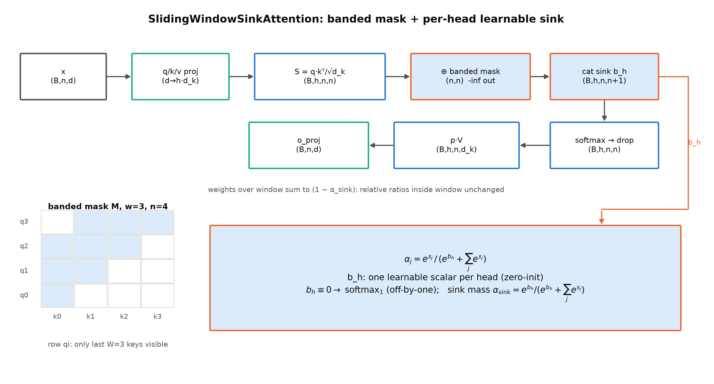
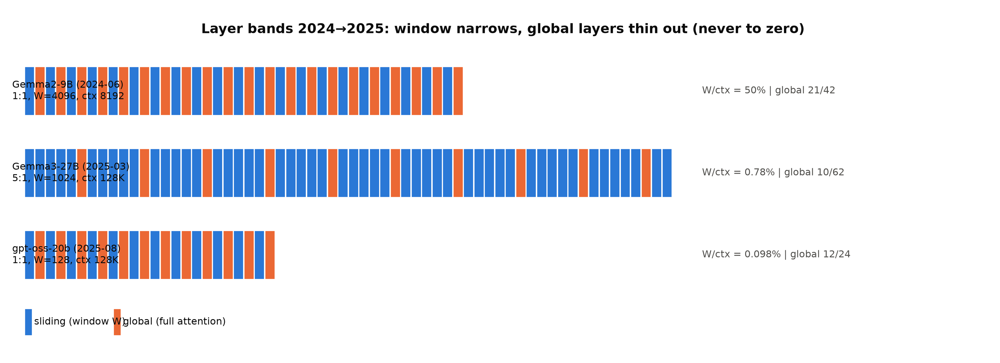
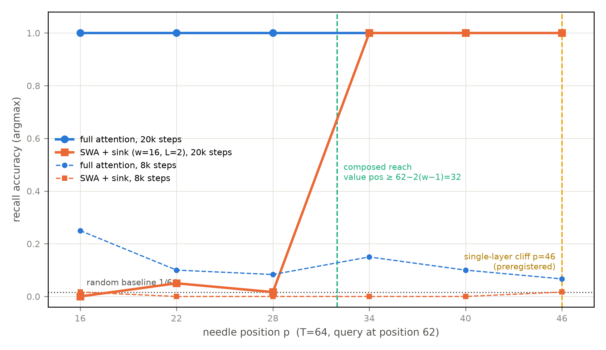

# 第 2 章 路线一：滑窗与汇聚——SWA 与 attention sink

## 2.1 三张到期的欠账单

上一章我们把 2017 年就记下的三笔账摊开在 1M 时代的桌面上：打分矩阵的 $O(n^2)$ 账、KV 缓存的无界账、以及「点积兼容性函数可能不够强」那张给全册发的通行证。三条突围路线也排好了队——按改动多少递进：改视野、改参与集合、换算子。本章动第一刀，也是最便宜的一刀：**不改算子、只改视野**——每个 token 本来能看全部历史，现在只许看最近 $W$ 个。

但在动刀之前，先清点三张恰好都到期了的欠账单。

第一张来自上一册。拆 gpt-oss 时我们在 config 面前停了手，章末的欠账框里写着：

> **【欠账】** 1:1 交错窗 128 与 attention sink 在 config 面上只是两行字段——机制与收益的展开地界（为什么窗口这么窄也不塌、sink 存的是什么）在 **Book5 第 2 章**。→ Book5 第 2 章
> 【Book4 ch10 章末欠账框原文，L173】

这张欠账单现在到期了。窗宽 128 只占声明上下文 131,072 的 0.098%——一个 token 只许看千分之一的历史，模型居然照常工作，凭什么？

第二张欠得更久。2017 年原典在自己的 §4 里写过一句：

> "We plan to investigate this approach further in future work."
> 【2017 原论文 §4；Book1 第 2 章已引（F11 登记）】

这句话紧挨着 Table 1 第 4 行那个「restricted attention（局部受限注意力）」的占位——复杂度 $O(r\cdot n\cdot d)$ 的老配方。九年过去，这个占位成了 Gemma 与 gpt-oss 的定式配置：原典的 IOU，在本章兑付。

第三张是 MLA 那册的。Book4 第 6 章章末写道：「MLA 把 KV 装进了小箱子，但开箱后的注意力仍是那场 $O(n^2)$ 的精确内积」【Book4 ch06 章末欠账框原文，L238】。上一册压的是箱子，这一册开始动注意力本体——而第一刀恰恰温和到连算子都不换：点积、softmax、缩放，一样不少，被裁掉的只是「看多远」。

> **最小背景栏**：读懂本章只需要三件旧资产——KV 账本与 GQA 记号（$2Lh_{kv}d_k\cdot n$，Book3 第 6 章）；MLA 的压缩思路（Book4 第 6 章，本章只作对照不展开）；gpt-oss 的 config 拆解（Book4 第 10 章，五步法与 layer_types 字段在那里首次亮相）。

本章要回答两个问题：**窗口凭什么敢开这么窄？sink 存的究竟是什么？**产出四样：一个可对拍的滑窗+sink 组件（`swa_sink.py`）、本册新账本「分类型 KV 账本」的第一笔算例、一次本机的 lost-in-the-middle 复现（含一个如约而至的负结论）、以及「窄窗不塌」的机制三件套。章末我们会发现：窗口封顶了一半层的 KV，但无界的根还留在全局层里——这个「不够」，正是第三章让参与集合可学的起点。

## 2.2 滑窗机制：参与集合成了一条滑动邻域

三张欠账单都指向同一件小事——把「看多远」裁短。先立机制。满注意力下，第 $t$ 个 query 对全部历史 key 计分；滑窗注意力（sliding-window attention, SWA）只改一件事——把参与集合从「全部历史」裁成「最近 $W$ 个」：

$$
M_{ij}=\mathbb{1}\big[\,j\le i\ \text{且}\ i-j<W\,\big]
\tag{2.1}
$$

| 符号 | 含义 | 形状/取值 |
|---|---|---|
| $M$ | 带状因果掩码（banded causal mask） | $(n,n)$，布尔 |
| $i,j$ | query 与 key 的位置下标 | $0\le i,j<n$ |
| $W$ | 窗宽：每 token 回看的 key 数 | 超参（4096/1024/128） |
| $n$ | 序列长 | — |

用人话说：$M$ 在因果下三角上再挖一条宽带——第 $i$ 行只在 $[i-W+1,\,i]$ 这 $W$ 格放行，带外一律 $-\infty$。它是静态几何：不依赖内容、不依赖训练，写进 config 就定死。

**例 2.1（构造例）** 取 $W=3$、$n=4$，手画这张掩码。输入：位置 0-3 共 4 个 token。逐行套用式 (2.1)：

| query | 放行的 key 集合 | 掩码行 |
|---|---|---|
| $q_0$ | $\{0\}$（左边不够 3 格） | `1 0 0 0` |
| $q_1$ | $\{0,1\}$ | `1 1 0 0` |
| $q_2$ | $\{0,1,2\}$ | `1 1 1 0` |
| $q_3$ | $\{1,2,3\}$（$0$ 已出窗） | `0 1 1 1` |

输出就是那 16 格的 0/1 阵——第 4 行告诉你：$q_3$ 看得见 $k_1,k_2,k_3$，唯独看不见 $k_0$。整个机制的全部直觉就在这：**每个 token 的「历史」从第一天起就被截成了 $W$ 长的一条**。（[`code/ch02/swa_sink.py`](code/ch02/swa_sink.py#L31)::banded_causal_mask 的运行自检打印的正是这四行。）

放进整层数据流（图 2.1）：$x\ (B,n,d)$ 经 q/k/v 投影得 $(B,h,n,d_k)$ 与 $(B,h_{kv},n,d_k)$，GQA 展开后做点积 $(B,h,n,d_k)\cdot(B,h,d_k,n)\to(B,h,n,n)$，掩码在 softmax 之前以 $-\infty$ 遮掉带外格，之后一切照旧——$(B,h,n,n)\cdot(B,h,n,d_k)\to(B,h,n,d_k)$，再展平回 $(B,n,h\cdot d_k)$ 经输出投影。算子一个没换。



图 2.1 滑窗+sink 注意力层数据流（自绘）：banded mask 分块与 sink 标量进分母两处高亮，每个张量框标形状；下方小图是例 2.1 的 $4\times4$ 掩码与式 (2.2)。

这一刀的账很好算：打分矩阵每层每头的有效元素从 $\approx n^2/2$ 降到 $nW$；KV 需求从 $n$ 封顶为 $\min(n,W)$——$n\to\infty$ 时滑窗层的缓存**不再增长**。还要注意一个口径：$O(nW)$ 是每层计算复杂度，训练仍然完全并行（掩码是静态几何，一个 mask 张量吃掉整个序列），「必须逐步递推」是第三章线性路线才会遇到的约束。

机制讲完，看工业界的 config 事实。教学件的掩码已与 transformers 5.18.0 的通用构造函数逐元素对拍：三种几何（$n{=}96/W{=}32$、$n{=}64/W{=}16$、$n{=}50/W{=}7$）全部相等【证据等级：本书实验（CPU/MPS，2026-10）】——HF 的实现就是式 (2.1)（`masking_utils.py` L101 的 `kv_idx > q_idx - sliding_window` 与因果掩码取 AND，L140）。

表 2.1 三家 config 事实（窗口与交替比例；均为首层滑窗）

| 机型 | 交错比例（滑窗:全局） | 窗 $W$ | $W$/上下文 | 渐近斜率 $L_g/L$ | 证据等级 |
|---|---|---|---|---|---|
| Gemma2-9B（2024-06） | 1:1（42 层各半） | 4096 | 50% | 50.0% | 官方技术报告 2408.00118 §2+Table 1 |
| Gemma3-27B（2025-03） | 5:1（52+10） | 1024 | 0.78% | 16.1% | 官方技术报告 2503.19786 §2 + config |
| gpt-oss-20b（2025-08） | 1:1（24 层各半） | 128 | 0.098% | 50.0% | config + 官方论文 2508.10925 §2.2 |
| （对照，勿串）Llama 4 | 3:1，但为 NoPE+chunked 注意力 | — | — | — | 承 Book4 ch10 考据框 |

三家的直引都验过：Gemma2「alternate between a local sliding window attention … and global attention … in every other layer」【官方技术报告 2408.00118 §2】；Gemma3「a pattern of 5 local layers for every global layer」「starting with a local layer as the first layer of the model」【官方技术报告 2503.19786 §2】；gpt-oss「Following GPT-3, attention blocks alternate between banded window and fully dense patterns … the bandwidth is 128 tokens」【官方论文 2508.10925 §2.2】。**三家的交替比例各不相同，社区传抄最常见的错误就是把它们张冠李戴**——gpt-oss 是 1:1，Gemma3 是 5:1，Llama 4 是 3:1 且机制根本不同（chunked 分块注意力+NoPE，那是另一种窗口几何，见 Book4 ch10 考据框）。



图 2.2 三家窗口层带对比（自绘，据表 2.1 config 生成规则绘制）：蓝格=滑窗层、橙格=全局层——窗口越开越窄（50%→0.78%→0.098%），全局层越来越稀（every layer→每 6 层一见），但没有一家退到 0。

把表 2.1 竖着读、图 2.2 横着看，是一条清晰的定式化叙事：**窗口越开越窄、全局层越留越稀**。Gemma2 的窗还有上下文的一半宽；Gemma3 两根旋钮一起拧——窗压到 1/128、全局层稀到六层一见——滑窗层的 KV 才真正「封顶」；gpt-oss 走到极端窄窗 128。而全局层的功能从「每层都在」退到「每 6 层一见」，却没有任何一家敢退到 0——为什么不敢，2.4 节回答。

> **【考据框】滑窗的血统链。** gpt-oss 那句「Following GPT-3」不是客套：GPT-3 论文 §2.1 原句确为「we use alternating dense and locally banded sparse attention patterns in the layers of the transformer」，且句内自注 similar to the Sparse Transformer（arXiv:1904.10509）【官方论文 2005.14165 §2.1 直引】。于是交错窗的谱系是 Sparse Transformer(2019)→GPT-3(2020)→gpt-oss(2025)；Gemma2 报告则把滑窗直接引到 Longformer 一系（2020）——两条血统在 2024-2025 的旗舰上合流。这条链在 2026 还在延伸：DSV4 的滑窗层窗宽同样是 128【证据等级：config 逆向；DSV4 正菜在第 4 章】。

## 2.3 attention sink：多余概率质量的去处

窗口裁掉了视野，马上会撞上一个现象：如果 cache 里只保留最近 $W$ 个 token 的 KV（窗口注意力的天然服务方式），模型会当场崩溃。StreamingLLM 把这个失败模式量给了出来：Llama-2-13B 上纯窗口（0+1024，开头一个不保）的困惑度高达 **5158.07**；保留最初 4 个 token（4+1020 配置）后回落到 **5.40**【证据等级：官方论文 2309.17453 v4 Table 1（本地 PDF 逐字复核）】。一个 token 都没多看，只是把开头 4 个「钉」在 cache 里，困惑度差出近一千倍。

被钉住的那几个开头 token，就是 attention sink（注意力汇聚）。为什么偏偏是开头？因果掩码放行「所有历史」，初始 token 于是出现在之后**每一个**位置的 softmax 分母里——它是全序列出勤率最高的 key，收到的梯度最勤，被训练成「兜底」的成本最低。这也解释了崩溃的机制：窗口注意力把开头淘汰出局后，每一次 softmax 都被迫在剩下的窗内 token 里重新分摊全部概率质量——模型没学会往这些 token 身上倒注意力，分布整体错位，困惑度爆表。现象本身在 lost in the middle（Liu et al., TACL 2023）的时代就可见：多文档问答里相关信息放开头最好、放中间最差的 U 形曲线里，「开头最好」那半边就是初始 token 在吸注意力【官方论文 2307.03172 v3】。StreamingLLM 的消融补了细节：Llama-2-7B 上保 0/1/2/4/8 个开头 token 的困惑度是 3359.95/11.88/10.51/**9.59**/9.54——1-2 个不够、4 个基本饱和【官方论文 Table 2】。但注意家族差异：Falcon-7B、MPT-7B、Pythia-12B 都是保 1 个就到平台，「4 个才饱和」是 Llama-2 特有——论文自释为其 `<s>` 在分块前打头、第 0 位近乎随机 token（§3.1 末段）。还有一组更妙的置换实验：把保住的 4 个 token 换成 4 个换行符，困惑度 5.60，几乎没差——**sink 承接的是注意力质量，不是语义内容**【官方论文 Table 1】。

那 sink 究竟是什么？这里有两派解释，至今没有裁决，我们并陈。

**说 A：汇聚元/全局信息枢纽（功能性解释）**——sink 在收集并广播序列的全局信息，是有用的枢纽。Catch-Tag-Release（NeurIPS 2025）给 sink 建了「接住-打标-放回」的工作模型，认为它承担位置记忆；OutRo（2026 预印本）发现 sink 的 value 向量像共享偏置一样加在每个 token 的输出上，把 sink 的因果限制放松反而提升了 7 个视频问答基准【官方论文 2502.00919；预印本 2603.14337】。这派的证据是干预级的——「利用 sink 反而更好」说明它载有可用信息。

**说 B：softmax 归一化的副产物（结构性解释）**——softmax 强制归一，注意力总和必须为 1；当模型「谁都不想看」时，多余的概率质量总得有个去处，初始 token 对所有后续位置可见、最容易被训练成这个去处。StreamingLLM 站的就是这侧："initial tokens are more easily trained to serve as attention sinks, capturing unnecessary attention"【官方论文 §3.1】。这派有两个因果级证据：其一就是上面的换行符置换（内容无关）；其二是 Gu et al.（ICLR 2025 Spotlight）：sink 在语言与视觉模型中普遍存在、在预训练的有效优化阶段之后涌现、行为像吸收多余注意力的 key 偏置；把 softmax 换成不需归一化的 sigmoid 注意力后，较小规模模型的 sink 消失且性能不受损【官方论文 2410.10781，摘要级】。

两说的边界都如实标：说 A 的证据多在 2025-2026、规模较小、部分在特定任务上；说 B 的「不掉点」只在 ≤1B 量级验证过、不能直接外推到旗舰，且 sink 的 value 侧观察（范数、共享偏置）说明它并非纯空转。**本书不裁决**——两说共用一个事实基础：softmax 必须归一，概率质量总要有去处。顺带钉一个防混边界：K3 报告里的 Attention Residuals 是残差流侧的另一机制，与 sink 无关，第 6 章处理。

说 B 里藏着一件工程珍品。Miller 2023 年的博客指出 softmax 的分母少了一项，补上即 softmax₁：$\mathrm{SoftMax_1}(x)_i=e^{x_i}/(1+\sum_j e^{x_j})$——分母固定多一个 1，相当于永远在场、分数恒为 0 的虚拟 token【技术博客（一手）Miller 2023】。StreamingLLM 把它收编为式 (2) 并验证：从零训的 160M 模型上，Zero Sink 版纯窗口困惑度 29214（照样崩），Learnable Sink 版（可学分数）降到 18.01——**虚拟 token 必须可学且「在场」**；附录还给了边界：放 2 个可学 sink 反而更差（25.73），一个就够【官方论文 2309.17453 v4 Table 3/Table 10】。这套「保 sink+滚窗口」的流式方案在工程上也立得住：单卡 A6000 上每 token 生成加速最高 22.2×【官方论文 2309.17453 v4 Fig 10 图注】——缓存不再随历史增长，每步成本被钉死在窗口上。

gpt-oss 把这条路走到了参数化：**每头一枚可学标量，直接拼进 softmax 分母**——"Each attention head has a learned bias in the denominator of the softmax, similar to off-by-one attention and attention sinks … enables the attention mechanism to pay no attention to any tokens"【官方论文 2508.10925 §2.2】。写成公式：

$$
\alpha_j=\frac{e^{s_j}}{e^{b_h}+\sum_{j'}e^{s_{j'}}},\qquad
\alpha_{\mathrm{sink}}=\frac{e^{b_h}}{e^{b_h}+\sum_{j'}e^{s_{j'}}}
\tag{2.2}
$$

| 符号 | 含义 | 形状 |
|---|---|---|
| $s_j$ | query 与第 $j$ 个 key 的打分（已缩放、已加掩码） | $(B,h,n,n)$ 的一行 |
| $b_h$ | 第 $h$ 头的可学 sink 标量 | 标量，共 $h$ 枚 |
| $\alpha_j$ | 真实 token $j$ 分到的权重 | $(B,h,n,n)$ |
| $\alpha_{\mathrm{sink}}$ | sink 吸走的概率质量 | $(B,h,n,1)$，加权前丢弃 |

用人话说：分母多了一项 $e^{b_h}$，真实 token 的权重整体乘上 $(1-\alpha_{\mathrm{sink}})$，窗内相对比例不变——注意力想「谁都不看」时，把质量倒进这枚标量，而不是倒进某个倒霉的开头 token。$b_h\equiv 0$ 时它退化成 softmax₁；$b_h$ 可学时，它是 StreamingLLM 可学 sink 的「去 token 化」版本。

**例 2.2（构造例）** 3 个 key、单头单 query，打分 $s=[1,\,2,\,0.5]$，看 sink 标量怎么重分配权重。输入三步走：

1. 无 sink：$e^{s}=[2.72,\,7.39,\,1.65]$，分母 $=11.76$，权重 $=[0.23,\,0.63,\,0.14]$。
2. 加 $b=-2$（少吸档）：分母多 $e^{-2}=0.135$，变 $11.89$；权重 $=[0.229,\,0.621,\,0.139]$，三者同乘 $0.989$；$\alpha_{\mathrm{sink}}=0.011$。
3. 换 $b=+2$（多吸档）：分母多 $e^{2}=7.39$，变 $19.15$；权重 $=[0.142,\,0.386,\,0.086]$，同乘 $0.614$；$\alpha_{\mathrm{sink}}=0.386$。

输出读法：sink 一枚标量进分母，真实 token 的权重**整体打折、相对比例纹丝不动**——$b$ 从 $-2$ 拧到 $+2$，sink 吸走的质量从 1% 涨到 39%。gpt-oss 真机学到的是哪一档？看下面的实物。

**实物 2.1**（gpt-oss 的 sink 正身：源码行+真权重值；看什么——「sink 从现象变成参数」落在哪三个地方）

```python
# transformers 5.18.0 modeling_gpt_oss.py（官方参考实现同构）
L293:  self.sinks = nn.Parameter(torch.empty(config.num_attention_heads))
L251:  sinks = module.sinks.reshape(1, -1, 1, 1).expand(…)
L252:  combined_logits = torch.cat([attn_weights, sinks], dim=-1)
L259:  scores = probs[..., :-1]  # we drop the sink here
```

```text
# gpt-oss-20b 真权重 dump（存量缓存零下载，log/book5-ch02/sinks_dump.txt）
L00 model.layers.0.self_attn.sinks shape=(64,) sinks[:8]=[+2.5156, +0.5586, ...] min=-2.4531 max=+4.0625 mean=+1.1161
L03 model.layers.3.self_attn.sinks shape=(64,) sinks[:8]=[+1.6016, +5.3750, ...] min=+1.5234 max=+7.4375 mean=+4.0908
# 24 层逐层 dump：mean 全为正、多数落在 +1.1～+4.1（例 2.2 的「主动多吸」档）
```

【证据等级：官方源码（本地浅克隆行级锚）+ 真权重张量值 dump（本书实验，CPU 惰性读，2026-10）】指名看两处：L293 那行——sink 是 `nn.Parameter`，每头一个标量、是**参数**不是 token；dump 的 mean——24 层全部学成正值，多数在 +1 到 +4 之间，即真机的 sink 普遍拧在「主动多吸」档。与 StreamingLLM 的 4-token 方案对照：参数 sink 不占 KV、不会被窗口淘汰、流式推理零缓存代价；代价是只有一维自由度——存不了内容，只能存「多少注意力可以无处安放」这件事本身。教学件与 HF 的 eager 实现做过同权重整层对拍：strict 加载后输出 max|Δ|=0.0（逐位一致）；「cat-softmax-drop」写法与式 (2.2) 闭式的数值差 1.79e-07（fp32 精度内）【证据等级：本书实验（CPU/MPS，2026-10）】。

> **【考据框】「sink+clamp」的精确口径（对 Book4 表 7.3 的表述精确化）。** 官方实现在**注意力通路上没有任何 logit 截断**——掩码全用 $-\infty$，唯一的 clamp 在 SwiGLU：gate 上限 7.0、linear 分支 $\pm 7.0$，论文脚注自认「Our SwiGLU implementation is unconventional, including clamping and a residual connection」【官方论文 2508.10925 §2.2 脚注 1 + 官方参考源码】。transformers 版 softmax 前减最大值是数值稳定技巧，注释自明「not in the original implementation」。因此 gpt-oss 的稳定化处方应写成「sink+SwiGLU 限幅」，社区「注意力分数 ±30 截断」一类说法以源码为准驳。

> **【考据框】sink 与 softcap 是两味药。** Gemma2 的 logit soft-capping（$\text{logits}\leftarrow c\cdot\tanh(\text{logits}/c)$，$c{=}50/30$）管每个 logit 的**幅值**；sink 管概率质量的**去处**。二者是并列稳定件：Gemma2 用 soft-cap（无 sink）→ Gemma3 换 QK-Norm → gpt-oss 用 sink+SwiGLU 限幅——同一病灶三种药，承 Book4 表 7.3，此处只补 sink 机制正身。

## 2.4 为什么窗 128 也不塌：三件套

回到开篇的问题：gpt-oss 的窗只有上下文的千分之一，为什么模型不塌？把证据摆开，是三件套。

**第一件，sink 兜底。** softmax 必须归一，窗口滚动淘汰又不断制造「推倒第一张多米诺」的危机——sink（无论 4 个开头 token 还是一枚可学标量）给了多余质量一个不塌的出口。StreamingLLM 的 5158→5.40 修复是证据。值得注意的是这个先验活到了路线二内部：NSA 的选择分支把「1 个初始块+2 个局部块」钉进 top-k 选择，不许学掉【官方论文 2502.11089 §4.1】——路线一的经验在路线二的机器里存活。

**第二件，交错全局层兜住长程。** 窗口只看近邻，跨窗信息靠每 6 层（Gemma3）或每 2 层（gpt-oss）一见的全局层续命：信息经全局层写入残差流，再被后续滑窗层当「近邻」读走。机制图像走一遍：句首的关键信息在第 5 层（全局层）被写进残差流的某几格；第 6-10 层虽然是滑窗、看不远，但那几格残差流就落在它们窗口可及的近处——对滑窗层来说，「远处的事」已经被上一层的全局视野搬运成了「近处的物」。按 5:1 的排布，任何跨窗信息最多等 5 层就能搭上一班全局层（机制图像，示意级）。Gemma3 的官方消融给了定量支持：1:1、5:1、7:1 三种比例对验证集困惑度影响极小（"The impact is minimal, even with 7-to-1"）【官方技术报告 2503.19786 §5.2 Fig 3，2B text-only 模型】。BigBird 的理论是更早的锚：常数个全局 token 就能保住 universal approximator 与图灵完备——全局层可以稀，但不能无。位置侧同款分工：Gemma3 全局层 RoPE base 拉到 $10^6$ 且 PI×8 缩放只作用全局层、滑窗层保持 $10^4$ 原样；gpt-oss 滑窗层不做外推、全局层用 YaRN 从 4096 扩到 131072——**滑窗只看 $W$ 个近邻、相对位置极小，天然不需要外推**。这个「按层分工」的位置哲学第 8 章正面展开。

**第三件，语言本身的局部性。** lost in the middle 的 U 形（首尾最好）说明满注意力模型实际依赖的也是「开头+局部」；NSA 从训练侧补了佐证："local patterns typically adapt faster and can dominate the learning process"【官方论文 2502.11089 §3.3.3】。窗口先验与语言统计性质对味。

但消融的边界必须如实标：Gemma3 的三张图（Fig 3 比例/Fig 4 窗宽/Fig 5 KV 显存）全部是**验证集困惑度**级——Fig 4 的图注只说「窗可以大幅缩小而不伤困惑度」（具体取值需读原图，报告未列表；且其 1:3 记法前后不一，按层型枚举口径它只能是 1 全局:3 局部）；Gemma2 的窗口消融只有推理期一档（4096/2048/1024→PPL 1.63/1.63/1.64【官方技术报告 2408.00118 §5 Table 10】），训练期窗宽无消融；gpt-oss 对窗宽与 sink 零消融、零设计解释（承 Book4 ch10 悬案）。而 Gemma3 §5.3 自己承认 128K 之外「rapidly degrade」——27B 的 RULER 从 32K 的 85.9 掉到 128K 的 72.9【官方技术报告 §5.3+附录 Table 15】。**「PPL 不塌」与「长程任务不塌」是两本账**——窗口换来的省，在长程检索上是付了价的；这笔账 2.6 节我们自己在小模型上量一次。

本机还有一个对照起点：sp-8k 语料、$T{=}512$、窗 128 的 4 层小件、200 步短训，满注意力与滑窗+sink 两臂的 eval 困惑度 6.608 对 6.525——短上下文下两者相当（滑窗略优，如实报、不渲染差异）【证据等级：本书实验（CPU/MPS，2026-10）】。「不塌」在小档语言建模上先行成立；下面把任务换成需要远距离检索的 needle，看它塌不塌。

## 2.5 分类型账本第一算：封顶的那一半

机制与证据都齐了，现在把 2.2 节那笔「$\min(n,W)$ 封顶」写成账本。本册给全书立一本新账——**分类型 KV 账本**（按层类型分开记，单位=元素数，沿用 Book3/Book4 口径）：

$$
\mathrm{KV}(n)=\underbrace{2\,d_k\,h_{kv}}_{\text{每层每 token}}\Big(L_g\cdot n+\sum_{\text{滑窗层}}\min(n,W)\Big)
\tag{2.3}
$$

| 符号 | 含义 | 取值例 |
|---|---|---|
| $L_g$ | 全局层数 | Gemma3-27B：10 |
| $L_s$ | 滑窗层数（$=L-L_g$） | Gemma3-27B：52 |
| $2d_kh_{kv}$ | 每层每 token 的 KV 元素 | gpt-oss：$2\times64\times8=1024$ |

用人话说：全局层那部分随 $n$ 线性涨、没有上限；滑窗层那部分涨到 $W$ 就停。于是 $n\to\infty$ 时整本账的**渐近斜率只由全局层占比 $L_g/L$ 决定**——这是式 (2.3) 最重要的读法。

表 2.2 五机型算例（`swa_sink.py`::kv_account 整数精确复算，与调研底单逐位互证断言通过；bf16 字节=元素×2）

| 机型@上下文 | 每层每 token | 全局层（无界） | 滑窗层（封顶） | 混合合计 | vs 全满 | 渐近斜率 |
|---|---|---|---|---|---|---|
| Gemma2-9B@8192 | 4096 | 21 层×8192＝704.6M（1.41 GB） | 21×4096＝352.3M（705 MB） | 1.06G 元素 | 省 25.0% | 50.0% |
| Gemma3-27B@131072 | 4096 | 10 层＝5.37G（10.74 GB） | 52×1024＝218.1M（436 MB） | 5.59G（11.17 GB） | **省 83.2%** | **16.1%** |
| Gemma3-27B@1M（假想外推） | 4096 | 41.0G（81.92 GB） | 436 MB（纹丝不动） | 41.2G | 省 83.8% | 16.1% |
| gpt-oss-20b@131072 | 1024 | 12 层＝1.61G（3.22 GB） | 12×128＝1.57M（3.1 MB） | 1.61G | 省 50.0% | 50.0% |
| gpt-oss-120b@131072 | 1024 | 18 层＝2.42G（4.83 GB） | 18×128＝2.36M（4.7 MB） | 2.42G | 省 50.0% | 50.0% |
| Gemma3-1B@32768 | 512（MQA） | 4 层＝67.1M（134 MB） | 22×512＝5.77M（11.5 MB） | 72.9M | 省 83.3% | 15.4% |

【证据等级：本书复算（config 公式整数精确算；1M 行为假想外推，按 $n=10^6$ 的估算口径——config 满档 1M=$2^{20}=1{,}048{,}576$，第 1 章表 1.3 的账本按 config 值计；报告自承 128K 外退化，真实 1M 旗舰没有用「GQA+全局满注意力」硬扛这笔账，而是换稀疏/MLA，见第 4/9 章）】

两句话读表 2.2。正向读：**「封顶」不是修辞，是千倍量级的账**——Gemma3-27B 在 128K 上下文时，52 个滑窗层合计只占全机 KV 的 3.9%；gpt-oss-120b 的 18 个滑窗层只占 0.10%。上下文再涨十倍，这两格纹丝不动。反向读：全局层一分没省——Gemma3-27B 的全局层占全机 KV 的 96.1%，gpt-oss 更是整整一半层无界。**滑窗只封顶了局部层，长上下文的 KV 压力整体上仍交给全局层的占比 $L_g/L$ 与 GQA/MLA 压缩去扛**——这正是表 2.1 把「渐近斜率」单列一栏的原因，也是第 9 章混合配方谱系要正面算的总账。

口径再对一次账：Book4 ch10 给 gpt-oss 记过一笔 $2Lh_{kv}d_k$（20b 为 24,576 元素/token）的主账——那是**每 token 生成时的增量**口径；式 (2.3) 是**上下文末端的存量**口径，两账不冲突，服务侧各自有用。

这本新账还立了一个需求：滑窗层在推理期要求缓存「滚动淘汰」——只保窗内 KV、逐 token 驱逐窗外条目，而全局层全保。同一个缓存池里两类层两种生命周期，逐块记账与淘汰给 prefill/decode 带来的不对称，是推理系统的正菜（章末欠账框）。

## 2.6 本机复现：needle 位置扫描与可达性决定论

最后把 lost in the middle 请进本机。任务用 MQAR（多查询关联检索，multi-query associative recall）式的合成 needle 任务，序列 $T{=}64$ 的布局是：8 个干扰键值对占 $[0,16)$；needle 对放在受控位置 $p$（键在 $p$、值在 $p{+}1$，值取自 64 个候选）；查询区占 $[48,64)$——7 个干扰查询的答案在因果上尚未出现、必须回头检索，末位 needle 查询在第 62 位、应答在第 63 位；监督只放 8 个查询位，argmax 命中 needle 值记一次召回。几何照探针实测定版：窗 $w{=}16$、$L{=}2$ 层迷你件（$d{=}256$、$h{=}8$、$h_{kv}{=}4$、$d_k{=}64$、无 RoPE——隔离掩码变量）；两臂同初始化（state_dict 灌注，sink 零初始化）：满注意力对照臂 vs 滑窗+sink 臂。训练分布 50/50：一半远端带 $[16,42)$、一半钉在可达位 $\{46\}$；eval 扫描 6 个位置 $16\to46$（避开查询区，那是试点踩出来的坑）。判据与结果分支**预注册**在脚本头（`code/ch02/needle_probe.py`）：A 满臂全位召回 $\ge 0.8$；B 滑窗臂不可达位钉随机、可达位分 B1（学到）/B2（学不到，按可达性决定论如实写）；C sink 不救远端、不伤窗内。

这套设计本身就是五轮试错的产物（「实验设计课」素材，均为试点实录）：单 needle 稀疏监督 200 步学不会；「预测 needle 后一位」的绑定监督会退化成自拷贝捷径（目标位因果可见）；MQAR 归纳头电路要千步级才成形；needle 撞上查询区会产生位置伪影；两臂必须同初始化、sink 必须零初始化（gpt-oss 语义）。

表 2.3 needle 位置扫描（20k 步正档 + 8k 参照档；acc=argmax 命中率，60 序列；随机基线 1/64≈0.016）

| 臂/档 | p=16 | 22 | 28 | 34 | 40 | 46 | 训练 loss |
|---|---|---|---|---|---|---|---|
| full @8k | 0.25 | 0.10 | 0.08 | 0.15 | 0.10 | 0.07 | 9.03→2.16 |
| **full @20k** | **1.00** | **1.00** | **1.00** | **1.00** | **1.00** | **1.00** | 9.03→0.34 |
| swa_sink @8k | 0.02 | 0.00 | 0.00 | 0.00 | 0.00 | 0.02 | 9.05→4.15 |
| **swa_sink @20k** | **0.00** | **0.05** | **0.02** | **1.00** | **1.00** | **1.00** | 9.05→3.80 |

【证据等级：本书实验（CPU/MPS，2026-10）】（MPS 23.7/24.5 ms/步；20k 档两臂 10.6/8.4 分钟）

三段读法。第一段：8k 档满臂也没学会（判据 A 不达，acc 0.07-0.25）——小任务也要千步级，「欠训」照实报，按预注册规则**档位延长而非换几何**；20k 档满臂六位全 1.00，A 通过。第二段：滑窗+sink 臂在 20k 档裂成干净的两侧——$p\ge34$ 全 1.00、$p\le28$ 钉随机（0.00/0.05/0.02），B1 分支兑现：**窗内召回学到与满注意力同档**；sink 没有把远端救回来（判据 C：sink 是质量锚，不是远端记忆）。第三段最有意思：预注册按**单层**可达性把悬崖定在 $p{=}46$（查询在 62，窗盖 47-62，归纳头需要「值位 $p{+}1$」可见），但实测 34、40 也学会了——预注册判据 B 的「不可达」结算为不成立，照实记录。边界在哪？

$$
\text{两层滑窗的有效回望}=L\,(w-1)+1,\qquad \text{最早可触达位置}=62-2\times 15=32
\tag{2.4}
$$

层会复合：query 62 的第二层看 47-62，这 16 个位置的**第一层输出**各自又看过 $[j-15,j]$——并起来最早触到位置 32。needle 的值在 $p{+}1$，故 $p\ge31$ 理论可达、$p\le30$ 恒不可达。用人话说式 (2.4)：窗宽 $w$ 的滑窗叠 $L$ 层，最远能回头 $L(w-1)+1$ 个位置——每层接力往外传 $w-1$ 步。实测边界恰好落在 28（随机）与 34（满分）之间（图 2.3 的两臂曲线把这条边界画成了跳变），与式 (2.4) 吻合（评估网格未覆盖 29-33，边界未逐点钉死，如实）。也就是说，**模型自己学出了「两跳搬运」电路**：第一层把窗外值搬进 47-50 一带的残差流，第二层当近邻读走。可达性决定论成立——只是决定它的不是单层窗宽，而是层复合后的有效视野；这个复合视野正是 2.4 节「全局层兜底长程」的镜像（那里靠全局层跨窗，这里靠滑窗层接力）。



图 2.3 needle 位置扫描两臂曲线（自产，喂 `log/book5-ch02/needle_scan.csv`）：满臂 20k 平在 1.0、滑窗+sink 臂在复合视野边界（青线，值位 $\ge32$）处从随机跳到满分；黄线是预注册的单层悬崖 46——被实测修正。

**实物 2.2**（探针设计记录读数；看什么——正档之前的两次「差点」：试点几何的 0.83 与 T=96 版的钉随机）

```text
# ① 试点直引（T=64 几何定档依据；00-feasibility/02_probe_swa_sink.py 脚本头试点记录④）
④两化简定版：L=2（归纳头最小电路，24ms/step）+ 无 rope（隔离 mask 变量）+ 8000 步
   试点 full 臂 acc 0.83（远端均匀）
# ② T=96 负结论（正式件前一代设计：训练分布全远端；probe02_swa_sink_run5-full.json 读数整理，数值保留 3 位）
"swa_sink": {"loss_last_20_mean": 4.157, "recall_acc_by_pos":
             {"18": 0.017, "42": 0.0, "58": 0.017, "62": 0.05, "74": 0.033}}
```

【证据等级：本书实验（CPU/MPS，2026-10；①为设计记录直引、②为 10k 步探针 JSON 读数）】两处各停一下。①试点 8k 步就到 0.83，但正式件把判据与位置协议钉死后，同一 8k 档只到 0.07-0.25（表 2.3）——试点协议更宽松，两数并陈，**档位以正式预注册为准**；试点还显示位置 46 刚出训练分布时只到 0.67（边界效应先记一笔）。②T=96 版把 8 个键值对**全部**放在深 64+ 的远端——滑窗臂在整个训练分布里没有一个可解的查询，10k 步损失钉死在随机基线 $\ln 64\approx4.16$；满臂同档也只到 0.08-0.18（欠训）。这是 T=96 的负结论：**没有可达正样本，可学性无从谈起**——正式版把训练分布改成 50/50 远端/可达，就是这条教训的执行。顺带一个对照观察：满臂收敛后的位置曲线是平的，lost in the middle 的 U 形并未在这个玩具几何出现——位置偏置更像预训练语料与任务的现象，而不是满注意力算子的宿命（玩具级结论，不外推）。而滑窗臂的曲线形状是**硬边界阶梯**：满注意力模型「中间易丢」，滑窗模型「窗外必丢」——一个是软偏置，一个是几何决定论。

## 2.7 本章小结

开篇的三张欠账单至此兑付：B4-5 的两行 config 字段背后，是带状掩码的静态几何、sink 进分母的式 (2.2)、以及「窄窗不塌」的三件套（sink 兜底+全局层接力+语言局部性）；F11 的 restricted attention 占位，从 2017 年的一句 future work 变成了三家旗舰的定式配置与一本能算到 0.10% 的账；B4-2 的前半句也兑现了——我们终于开始动注意力本体，尽管第一刀温和得只裁了视野。本机复现给了正反两面：窗内召回可以学到满分，窗外位置被几何钉死在随机。

**带走的心智**：忘掉数字后请留下两幅画。**其一，掩码是免费的几何，但只封顶一半**——config 两行字段就把滑窗层的 KV 从无界变成 $\min(n,W)$ 封顶（Gemma3-27B 的滑窗层只占全机 3.9%、gpt-oss 仅 0.10%），可整本账的渐近斜率只由全局层占比 $L_g/L$ 决定，无界的根原封不动地留在全局层里。**其二，softmax 必须归一，概率质量总要有去处**——sink 就是那个去处；它从「初始 token 的现象」（保 4 个开头 token，5158→5.40）被做成了「每头一枚可学标量的参数」（真机普遍学到 +1～+4 的主动多吸档），现象变成参数，参数进分母。

镜头拉回全书：三条路线的第一刀落地了，但它留下两个明摆着的不满——「看多远」是手工超参（gpt-oss 为什么是 128？论文零解释，我们的复现也显示窗外必丢），而全局层还在付无界的账。下一章动第二刀：让「参与哪些 token」本身变成可学的——选择机关从 config 常数变成参数。

> **【欠账】** 分类型 KV 账本立起了一个服务侧需求：滑窗层要「滚动淘汰」（只保窗内、逐 token 驱逐窗外），全局层全保——同一个缓存池里两类层两种生命周期，逐块记账与淘汰给 prefill/decode 带来的不对称是推理系统的正菜。→ Book6 第 5 章（第 3 章架构侧串联）

## 2.8 动手验证

```bash
cd 工作区根目录 && source env.sh

# ① 教学件三重对拍+分类型账本（CPU fp32 秒级；2.2/2.3/2.5 节全部自测数字的来源）
python "[`code/ch02/swa_sink.py`](code/ch02/swa_sink.py)" --out-name run1
#   验收行：[① mask 对拍] 三组几何 elementwise_equal=True
#           [③ 整层对拍] strict_load=ok, max_abs_diff=0.0
#           [④ 分类型账本] 六机型断言全过（省 83.2%/3.9%/0.10% 等）

# ② needle 位置扫描（两臂；MPS；表 2.3 与图 2.3 数据源；判据预注册见脚本头）
python "[`code/ch02/needle_probe.py`](code/ch02/needle_probe.py)" --arm full    --steps 20000 --out-name full20k
python "[`code/ch02/needle_probe.py`](code/ch02/needle_probe.py)" --arm swa_sink --steps 20000 --out-name full20k
#   （冒烟 300≈10 s/臂；fast 8k≈3.3 min/臂；正档 20k≈8-11 min/臂）
#   验收行：[full] train 9.03→0.34 | acc@pos 全 1.0；[swa_sink] 16/22/28≈0，34/40/46=1.0

# ③ gpt-oss 真权重 sinks dump（实物 2.1 素材；存量缓存零下载，条件性：失败降级源码行）
python "[`code/ch02/gptoss_sinks_dump.py`](code/ch02/gptoss_sinks_dump.py)"

# ④ 本章三图（图 2.1/2.2/2.3；图 2.3 喂 needle_scan.csv）
python "[`code/ch02/fig_ch02.py`](code/ch02/fig_ch02.py)"

# ⑤ 设计记录复现（2.4 节 Part A 对照 6.608/6.525 与实物 2.2 的 T=96 负结论；MPS ≈4 min）
python "[`code/00-feasibility/02_probe_swa_sink.py`](code/00-feasibility/02_probe_swa_sink.py)" --out-name reread
```
