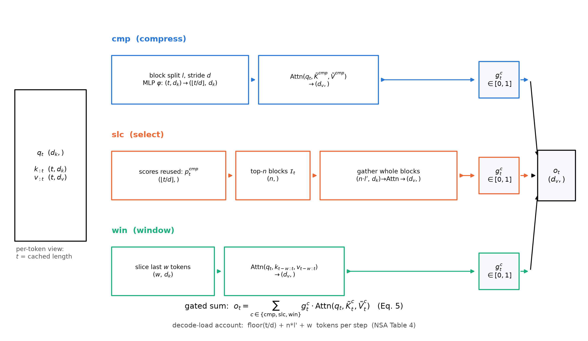
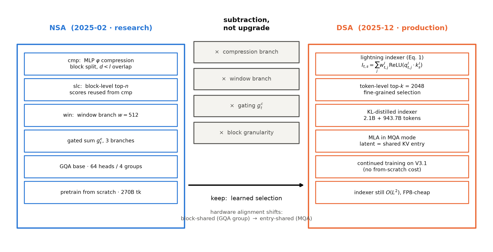
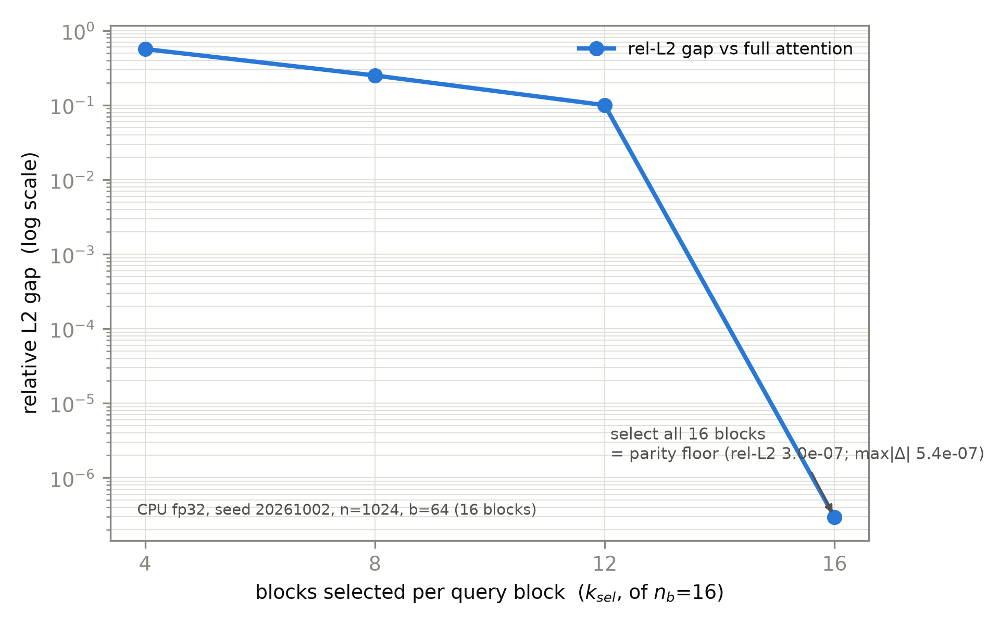

# 第 3 章 路线二：可学习稀疏——NSA 到 DSA

## 3.0 开篇：从全书到这里

上一章我们动了第一刀。滑窗注意力不改算子、只改视野——config 里两行字段，就把一半层的 KV 账从无界压成了有界，配上 attention sink 兜底，窄到 128 也不塌。但章末留了两个不满：其一，交错布局里的全局层还在原样支付 $O(n^2)$ 的账，窗口救的是滑窗层那半；其二，「看多远」仍然是设计师拍板的手工超参——窗宽 128 还是 4096，写死在配置文件里，模型自己没有发言权。这两个不满指向同一件事：参与集合（每个 token 到底看哪些前文）还是先验定死的。

本章动第二刀：改参与集合——让「参与哪些 token」本身变成可学的。这条路线的名字叫可学习稀疏（learnable sparsity）：打分、选择、只对选中的部分做精确注意力。它有一位研究版的开山之作 NSA（Native Sparse Attention，原生稀疏注意力，arXiv:2502.11089v2），和一位把它送上生产的后继者 DSA（DeepSeek Sparse Attention，arXiv:2512.02556v1）——后者已经被装进 DeepSeek-V3.2 与 GLM-5 两台旗舰。本章要回答三个问题：选择这种离散操作怎么进梯度训练？省下的账到底记在哪一本上？以及从研究版到生产版，砍掉了什么、又为什么砍得动？到章末账本会给出这把刀的边界：省下的只记在**访问账**上，全量 KV 的存储账原封未动——这个「没省到」，正是第 4 章把可学习稀疏推上 1M 真机的起点。

这里先回响一句第 1 章立起的通行证：2017 年原典 §6.2 (B) 行写过 *"a more sophisticated compatibility function than dot product may be beneficial"*（比点积更精巧的兼容性函数可能有益）。本章点积不换岗——每次参与的内积仍是精确的 softmax 点积——但它兼了一份新差：兼容性函数（相似度打分）被挪去给「参与集合」当选拔器。全额换岗要等第 5 章。

> **最小背景栏**（只补本章所需，已学指回）：KV 账本与 GQA 分组共享——Book3 第 6 章；打分矩阵随 $n$ 平方增长的账——本书第 1 章 1.2 节；满注意力公式与 softmax 注意力——Book1 第 2 章；MoE 的 top-k 路由（「选一部分、其余不动」的第一次见面）——Book4 第 2 章；滑窗机制与 sink——本书第 2 章。本章新记号一律承 NSA 论文正字，见 3.1 节符号表。

## 3.1 NSA 三分支：让「参与哪些 token」变成可学的

窗口把参与集合定死为「最近 $w$ 个」，可学习稀疏想把它交给模型打分。第一个拦路的问题是：选择是离散的——top-k 挑中的块进、没挑中的出，这个「挑」本身没有梯度。既有方案两路都碰过壁：给选择器单加一套神经预测器，要用辅助损失（auxiliary loss）间接训练，论文的原话是它 "relies on auxiliary loss, which increases operator overhead and often degrades model performance"（依赖辅助损失，增加算子开销且常损伤模型性能）；走免参数的启发式打分，则 "suffer from low recall rates"（召回率低）——两种路线在 3B 模型上的损失曲线都逊于 NSA 与满注意力【证据等级：官方论文 2502.11089v2 §6.1 Figure 7】。NSA 的答案一石二鸟：**不另立预测器，把选择打分挂在压缩分支的注意力分数上**——分数本来就要算，梯度经 softmax 自然回传。这是全章最重要的机关，我们按论文的构造顺序把它立起来。

论文把三个分支记为集合 $\mathcal{C}=\{\mathrm{cmp},\mathrm{slc},\mathrm{win}\}$——压缩（compress）、选择（select）、滑窗（window），总输出是三分支注意力的门控加权和（论文 Eq. 5）：

$$o_t=\sum_{c\in\mathcal{C}} g_t^c\cdot \mathrm{Attn}\big(q_t,\ \tilde K_t^c,\ \tilde V_t^c\big) \tag{3.1}$$

用人话说：每个分支各自构造一份紧凑的键值表示 $\tilde K_t^c/\tilde V_t^c$、各自做一次标准注意力，最后由三个可学标量门 $g_t^c\in[0,1]$（输入特征过 MLP 加 sigmoid）投票合成输出。符号表如下（形状列为单 token 查询视角，批量口径在各量前加 $(B,h)$）：

| 符号 | 含义 | 形状/取值 | 注 |
|---|---|---|---|
| $t$ | 当前查询位置=已缓存长度 | 标量 | 论文解码视角正字；代码里序列长记 $n$ |
| $q_t$ | 当前查询向量 | $(d_k,)$ | 每 token 每头一支 |
| $k_{:t},v_{:t}$ | 前文键/值 | $(t,d_k)/(t,d_v)$ | 全量在场（见 3.2 节账本） |
| $l$ / $d$ | 压缩块长 / 滑距 | 32 / 16 | $d<l$ 相邻块重叠；$d$ 勿与头维 $d_k$ 混 |
| $l'$ / $n$ | 选择块长 / 选中块数 | 64 / 16 | 论文正字；代码记 $k_{sel}$ 避与序列长冲撞 |
| $w$ | 滑窗宽 | 512 | win 分支专属 |
| $g_t^c$ | 分支门控标量 | $(3,)$ | $g$ 只作门，勿与 GQA 组数混 |
| $\tilde K_t^c$ | 分支紧凑键 | 见各行 | 稀疏约束：$\sum_c \mathrm{size}[\tilde K_t^c]\ll t$ |

三个分支是三种粒度：cmp 粗粒度看全局、slc 细粒度挑重点、win 局部保近邻——论文摘要自称动态层级稀疏策略（dynamic hierarchical sparse strategy）。图 3.1 把整机数据流先铺开，下面逐支拆解（拆解时随时回看此图定位）。


图 3.1 NSA 三分支数据流（自绘示意级，单 token 查询视角，张量框与箭头标形状）：cmp 压缩、slc 选择、win 滑窗三泳道各自成注意力后门控求和；底部为解码账本口径。依据 arXiv:2502.11089v2 §3.2-3.3 的机制描述绘制。

**压缩分支 cmp（论文 Eq. 7）**把前文切成重叠块、每块压成一条「摘要键」：

$$\tilde K_t^{\mathrm{cmp}}=\Big\{\varphi\big(k_{id+1:id+l}\big)\ \Big|\ 0\leqslant i\leqslant\Big\lfloor\tfrac{t-l}{d}\Big\rfloor\Big\},\qquad \tilde K_t^{\mathrm{cmp}}\in\mathbb{R}^{\lfloor (t-l)/d\rfloor\times d_k} \tag{3.2}$$

用人话说：以步长 $d$ 滑动一个长 $l$ 的窗口，把窗内 $l$ 个键经可学习 MLP $\varphi$（带块内位置编码）压成一条压缩键，共得约 $t/d$ 条。形状流转：$k_{:t}\ (t,d_k)\to$ 分块 $(\lfloor t/d\rfloor,\,l,\,d_k)\to\varphi\to(\lfloor t/d\rfloor,\,d_k)$。取 $d<l$（滑距小于块长，相邻块重叠）是论文明确的防碎裂设计——"to mitigate information fragmentation"，块边界处不会被切断的信息无人认领。

**选择分支 slc**是灵魂所在。块重要性分数不新算，直接复用 cmp 分支刚算出的注意力分数（论文 Eq. 8）：

$$p_t^{\mathrm{cmp}}=\mathrm{Softmax}\big(q_t^{\top}\tilde K_t^{\mathrm{cmp}}\big)\in\mathbb{R}^{\lfloor (t-l)/d\rfloor+1} \tag{3.3}$$

用人话说：查询对每条压缩键的注意力权重，就是「这个块对我的重要度」——打分是注意力计算的副产品，零额外开销。当压缩块与选择块同网格（$l'=l=d$）时直接使用；网格不同时按空间重叠求和换算（论文 Eq. 9，$l\leqslant l'$、$d\mid l$、$d\mid l'$）：

$$p_t^{\mathrm{slc}}[j]=\sum_{m=0}^{l'/d-1}\sum_{n=0}^{l/d-1} p_t^{\mathrm{cmp}}\big[\tfrac{l'}{d}j-m-n\big] \tag{3.4}$$

随后两步（论文 Eq. 10-12）：GQA 组内把各头分数求和，保证同组各头**选同一批块**——

$$p_t^{\mathrm{slc}\prime}=\sum_{h=1}^{H} p_t^{\mathrm{slc},(h)};\qquad \mathcal{I}_t=\big\{i\ \big|\ \mathrm{rank}\big(p_t^{\mathrm{slc}\prime}[i]\big)\leqslant n\big\},\qquad \tilde K_t^{\mathrm{slc}}=\mathrm{Cat}\big[\{k_{il'+1:(i+1)l'}\mid i\in\mathcal{I}_t\}\big]\in\mathbb{R}^{nl'\times d_k} \tag{3.5}$$

用人话说：按组汇总的块分数取前 $n$ 名，把选中块的**原始**键值整块拼接进来——压缩表示只负责打分，真正参加注意力的还是全精度 token。注意聚合在本设计里发生在三个层面：块内（$\varphi$ 把 $l$ 个 token 压成一条）、块间（式 (3.4) 把压缩网格的分数换算到选择网格）、分支间（式 (3.1) 的门控求和）；组内求和（式 (3.5) 左）则是第四处，但它服务的是硬件而非语义——同组同选，解码时同组 KV 只需搬运一次。

可微性要讲准、不夸大：softmax 分数对 $\varphi$ 与 $q_t$ 可微，「打分从哪来」能被端到端训练；离散的 top-$n$ 本身不可微，是直通式（straight-through 式）的截断。NSA 靠「打分器=压缩分支」免掉了独立预测器与辅助损失——这正是它对自己划界句的兑现：*"Unlike these inference-focused approaches, our NSA incorporates sparsity natively during the training phase."*（不同于这些推理期方案，我们的 NSA 在训练阶段原生引入稀疏）【证据等级：官方论文 2502.11089v2 §7.2，直引】。这也回应了第 1 章那句兼容性函数的通行证：点积 softmax 在这里没被换掉，而是被多派了一份「选拔器」的差事。

选择怎么走，用一个可以手算的小例子过一遍。

> **例 3.1（构造例：块选择 top-k 手算）** 取 $d_k=4$、8 个 token、块长 $l'=2$（4 块），查询 $q=(0.5,-0.3,0.8,0.1)$，$K\in\mathbb{R}^{8\times 4}$（seed 20261002 抽样，数值为本机核验；块分此处以块内 $q\cdot k$ 求和模拟压缩分数——真实 NSA 用压缩分支的 softmax 分数，教学简化）。
> 1. **块打分**：每块内两个 $q^\top k_j$ 求和，输入 $K\ (8,4)\to$ 块分 $(4,)$：$[-1.480,\ 1.368,\ 1.011,\ 0.719]$；
> 2. **top-2 选块**：输入 $(4,)\to$ 选中块号 $(2,)$：选块 $\{1,2\}$（0 起编号）。注意块分数是「块的代言」而非 token 分数：块 3 得分 0.719 并不低，却整块落选；反过来，块 1 里那个权重只有 0.105 的低分 token 搭了整块的便车——选择以块为单位、整进整出；
> 3. **整块 gather**：输入 $K\ (8,4)\to K_{\mathrm{sel}}\ (4,4)$（$n\cdot l'=4$ 个 token，块内保序）；
> 4. **块内注意力**：$\mathrm{softmax}(q^\top K_{\mathrm{sel}}/\sqrt{d_k})$，输入 $(4,4)\times(4,)\to$ 权重 $(4,)$：$[0.105,\ 0.405,\ 0.401,\ 0.089]$。
>
> 这个例子让你看见：预算 $n{=}2$ 定死「看多少」，分数定死「看谁」——选块、重归一、加权，全程对块做决策、对选中的 token 做精确注意力。对应代码件见 3.5 节 [`code/ch03/nsa_block.py`](code/ch03/nsa_block.py#L62)::block_sparse_attention。

**滑窗分支 win（论文 §3.3.3）**最简单：$\tilde K_t^{\mathrm{win}}=k_{t-w:t}$、$\tilde V_t^{\mathrm{win}}=v_{t-w:t}$——最近 $w$ 个 token 原样参加。它存在的理由论文说得直白：局部模式学得快，会 dominate 学习过程、抄近路压制另两分支学全局模式，所以专门隔离一条支路安放局部性，且三分支各配**独立的 K/V 投影**防梯度互扰、开销极小【证据等级：官方论文 2502.11089v2 §3.3.3】。第 2 章的读者应当眼熟：win 分支就是一个可门控的滑窗注意力——路线一的先验被路线二整分支收编（这一收编的谱系后文还会回响：DSA 把它砍掉，DSV4 又以 128 窄窗支路请回来，见第 4 章）。

三分支之外还有一条贯穿的设计线：**为什么选择单位是块而不是散 token**。三层答案：GPU 对连续块访存的吞吐远高于随机索引读取；块状计算对 Tensor Core 友好；以及分布证据——27B 满注意力模型的注意力图本身就呈块状聚类（邻近键分数相近）【证据等级：官方论文 2502.11089v2 §6.2 Figure 8】。硬件与数据在此罕见地投了同一票。同一算法还要同时伺候两个阶段：训练与预填充（prefill）是批量矩阵乘、算力吞吐主导，目标是省乘法次数；自回归解码每步只算一个 token 却要搬运全部历史 KV、带宽主导，目标是省搬运量——NSA 的块对齐两头兼顾（专用 kernel 的三特征——按 GQA 组装载、按选中块连续取 KV、外层循环交给调度器——只到「为什么块对齐」这一层，kernel 工程的展开是推理册的地界）。表 3.1 把三分支的形状账合在一张表里。

表 3.1 NSA 三分支形状流转表（单 token 视角；批量口径各量前加 $(B,h)$，slc 组内求和后为 $(B,h/\text{组内头数},\cdot)$）

| 步骤 | 运算 | 输入形状 | 输出形状 | 说明 |
|---|---|---|---|---|
| 1 | 分块（stride $d$ 重叠滑窗） | $k_{:t}$ $(t,d_k)$ | $(\lfloor t/d\rfloor,\,l,\,d_k)$ | $d<l$ 重叠防碎裂 |
| 2 | $\varphi$ 压缩 | $(\lfloor t/d\rfloor,\,l,\,d_k)$ | $(\lfloor t/d\rfloor,\,d_k)$ | MLP+块内位置编码 |
| 3 | cmp 注意力 | $q_t\,(d_k,)\times(\lfloor t/d\rfloor,d_k)$ | $(d_v,)$ | 粗粒度全局 |
| 4 | 块分数（式 3.3） | $q_t\times\tilde K^{\mathrm{cmp}}$ | $(\lfloor t/d\rfloor,)$ | 打分复用，零新增 |
| 5 | 网格换算+组内求和 | $(\lfloor t/d\rfloor,)$ | $(n_{blk},)$ / 组共享 | 式 (3.4)(3.5) |
| 6 | top-$n$ 选择 | $(n_{blk},)$ | $\mathcal{I}_t$ $(n,)$ | 离散、直通式截断 |
| 7 | 整块 gather | $k_{:t}$ $(t,d_k)$ | $(n l',\,d_k)$ | 连续搬运、块内保序 |
| 8 | slc 注意力（块内因果位） | $q_t\times(nl',d_k)$ | $(d_v,)$ | 对全精度 token |
| 9 | win 切片+注意力 | $k_{:t}$ $(t,d_k)$ | $(w,d_k)\to(d_v,)$ | 最近 $w$ 个 |
| 10 | 门控求和（式 3.1） | $3\times(d_v,),\ g\,(3,)$ | $(d_v,)$ | 三分支投票 |

> **【考据框】记号正字。**社区转述里常见的 $g^{ct}/g^{st}$ 一类分支记法并非论文用语——NSA 论文正字是三分支集合 $\{\mathrm{cmp},\mathrm{slc},\mathrm{win}\}$ 与门控 $g_t^c$，摘要自称 "dynamic hierarchical sparse strategy"（动态层级稀疏策略），全文没有 "macro"（宏间隔）一词。本章记号一律按论文正字（这也是卷级大纲红线①）。

## 3.2 NSA 的实验与解码账本：四列全中的那本账

机构立起来了，先看它在真机上立不立得住，再把省下的账算清楚。实验底座【证据等级：官方论文 2502.11089v2 §4.1】：27B 总参/3B 激活的 MoE 模型（GQA+DeepSeekMoE，30 层，hidden 2560，64 头分 4 个 GQA 组，$d_q=d_k=192$、$d_v=128$，72 路由+2 共享专家 top-6）；NSA 侧超参即符号表里的 $l{=}32$、$d{=}16$、$l'{=}64$、$n{=}16$（含固定激活 1 个首块与 2 个局部块）、$w{=}512$。**训练口径务必读准**（v1.1 勘正后的正身）：两个模型都在 **8k 长度的文本上预训练 270B token**，随后 **YaRN 续训+SFT 至 32k** 完成长上下文适配，训至收敛保证公平对比；64k 干草堆检索是 **YaRN 外推到 64k 后的评测**（全位置检索全对）——不是 64k 训练、更没有 128k 外推【证据等级：官方论文 2502.11089v2 §4.1/§4.4 Figure 5】。

表 3.2 NSA 四张表的关键行（数值逐字转录；benchmark 一律追加厂商自报）

| 表 | 关键读数 | 口径 |
|---|---|---|
| Table 1 通用九项 | NSA 均分 **0.456** vs 满注意力 **0.443**（NSA 胜 7/9；MMLU 0.565/0.567、BBH 0.521/0.497、GSM8K 0.520/0.486、DROP 0.545/0.503、HumanEval 0.348/0.335） | 8k 预训练同预算同收敛【官方论文+厂商自报】 |
| Table 2 LongBench | NSA **0.469** > 满注意力 0.437 > Exact-Top 0.423 > Quest 0.392 > InfLLM 0.383 > 推理期逐出类基线 0.303 | 各法预算对齐 2560 token（含前 128 引导+512 局部，沿用 StreamingLLM 预算口径）【官方论文+厂商自报】 |
| Table 3 AIME24 | NSA-R **0.121/0.146** vs Full-R 0.046/0.092（生成上限 8k/16k） | R1 蒸馏 SFT 10B token 的 32k 数学轨迹；16 采样【官方论文+厂商自报】 |
| Table 4 解码加载 | 8k/16k/32k/64k → NSA **2048/2560/3584/5632** vs 满注意力 8192/16384/32768/65536 → **4×/6.4×/9.1×/11.6×** | 解码每步等效加载 token 数；本机复现见实物 3.1【官方论文】 |

四张表的关键行合并成表 3.2，读表先读对照的结构。Table 1 与 Table 3 的对照组是**满注意力**：native 训练让稀疏不是「推理时打的折」而是「训练时就这么活」——通用能力不掉（0.456>0.443），长思维链推理上反而大胜（0.146 对 0.092，稀疏注意力下的 16k 生成更稳）。Table 2 的对照组换成了**四种推理期稀疏方法**（含精确 top-k 的 Exact-Top 与两种 query 感知打分法）：预算全部对齐到 2560 token 后，学出来的选择仍胜过训练后再打分的选择——总分差 0.032，多跳检索类子集上差距最大（对满注意力 +0.087 与 +0.051）【证据等级：官方论文 2502.11089v2 §4.2】。训练侧可学与训练后替换的差距，就体现在这 0.03-0.09 的分差里。训练侧还有 kernel 级的收益：64k 序列上前向 **9.0×**、反向 **6.0×**（8×A100，对比基线为 Triton 实现的注意力 kernel）【证据等级：官方论文 2502.11089v2 §5 Figure 6+厂商自报】。

真正值得抄进你笔记的是 Table 4 那本解码账。解码每步要搬运的 token 数是三项之和：

$$\mathrm{load}(t)=\Big\lfloor\tfrac{t}{d}\Big\rfloor+n\,l'+w \tag{3.6}$$

用人话说：压缩键 $t/d$ 条 + 选中块 $n\cdot l'$ 个 token + 窗口 $w$ 个。手算 64k：$65536/16=4096$，加 $16\times64=1024$，加 $512$，得 **5632**——正是 Table 4 末列。四档全部如此咬合，见实物 3.1 的双栏对照。

> **实物 3.1（NSA Table 4 原文 × 本机复现对照）**。看什么：左栏论文数字、右栏本机按式 (3.6) 逐档复算——四列**逐位**相同，这就是「账本公式精确复现」的实感。
>
> ```
> Context Length    8192   16384   32768   65536        ← 论文 Table 4（arXiv:2502.11089v2 §5.2）
> Full Attention    8192   16384   32768   65536
> NSA               2048    2560    3584    5632
> Expected Speedup    4x    6.4x    9.1x   11.6x
> 表题：Memory access volume (in equivalent number of tokens) per attention
>       operation during decoding.
> —— 本机复现（log/book5-ch03/nsa_block_fast150.json，seed 20261002）：
> "8192":  {"load_formula": 2048, "table4_nsa": 2048, "match": true, …}
> "65536": {"load_formula": 5632, "table4_nsa": 5632, "match": true, …}
> ```
>
> 【证据等级：官方论文 2502.11089v2 §5.2 Table 4｜本书实验（CPU，2026-10），四列全中断言校验】

账本要分两本读，这是本章最容易被讲错的地方。**存储账没变**：全量 KV 仍完整躺在缓存里——选择需要全量在场，压缩序列可以预计算，但库存一件没少。变的是**访问账**：每步搬运量从 $t$ 压到 $\lfloor t/d\rfloor+nl'+w$，其中随 $t$ 增长的项只剩 $t/d$——斜率从 1 压到 $1/16$，再垫一个 1536 的常数底（$nl'+w$）。接到第 1 章的分类型账本上，这就是 NSA 行：满注意力层每步加载 $t$，NSA 层加载 $\lfloor t/d\rfloor+nl'+w$。64k 处只付原账的 8.6%（5632/65536），且序列越长折扣越深——4× 到 11.6× 的加速比本身就是这个分式。

> **【考据框】两处论文内部的小出入。**其一，式 (3.2)（论文 Eq. 7）的压缩键数按字面算是 $\lfloor(t-l)/d\rfloor$（8k 档 510、64k 档 4094），而 Table 4 的数值与 $t/d$（512、4096）精确一致——账本公式以表格口径 $t/d$ 为准，字面差 1-2 项【证据等级：本书实验复现，见 JSON 的 eq7_literal_compress 字段】。其二，摘要写预训练 260B token、§4.1 写 270B——引用取 §4.1 的 270B 并加此注。两处都不影响结论，但「引用前先复算」的习惯从这类小出入里最养得出来。

## 3.3 DSA：上生产的减法

NSA 证明了可学习稀疏训得动、算得清，但它是研究版的三件套：三分支加门控结构重、三分支独立 K/V 投影参数多、块级粒度落在 MLA 这种「KV 装在压缩箱子里」的架构上如何对接（Book4 第 6 章的箱子：缓存的是潜向量 $\boldsymbol{c}^{KV}$，不是逐头 K/V）——生产版要逐项处置这些包袱。答卷是 DSA，落点干脆得像一句话：相对 V3.1-Terminus（671B，Book4 已拆过），*"the only architectural modification of DeepSeek-V3.2 is the introduction of DeepSeek Sparse Attention (DSA) through continued training"*（V3.2 唯一的架构改动就是通过续训引入 DSA）【证据等级：官方论文 2512.02556v1 §2.1，直引】——整机原封不动，只换注意力这一格。

DSA 的原型就两件套："a lightning indexer and a fine-grained token selection mechanism"（一个闪电索引器、一个细粒度 token 选择机制）【证据等级：官方论文 2512.02556v1 §2.1，直引】。**闪电索引器**（lightning indexer，论文 Eq. 1）给每对查询-前文 token 打一个索引分：

$$I_{t,s}=\sum_{j=1}^{H^{I}} w^{I}_{t,j}\cdot\mathrm{ReLU}\big(\boldsymbol{q}^{I}_{t,j}\cdot\boldsymbol{k}^{I}_{s}\big) \tag{3.7}$$

用人话说：$H^I$ 个索引头各自算查询侧向量 $\boldsymbol{q}^{I}_{t,j}\in\mathbb{R}^{d^I}$（$d^I=128$，GLM-5 config）与前文侧向量 $\boldsymbol{k}^{I}_s\in\mathbb{R}^{d^I}$ 的点积，过 ReLU 后按可学权重 $w^I_{t,j}$（标量，由查询派生）加总——就是一次「没 softmax 的多头注意力打分」。选 ReLU 不选 softmax，论文的理由只有半行："for throughput consideration"（为吞吐计）【证据等级：官方论文 2512.02556v1 §2.1，直引】——没有指数、整段是纯矩阵乘，且头数少、可整个跑在 FP8 里，索引器自身极其便宜。**细粒度 token 选择**（论文 Eq. 2）随后一步到位：

$$u_t=\mathrm{Attn}\Big(h_t,\ \big\{c_s\ \big|\ I_{t,s}\in\mathrm{Top\text{-}k}(I_{t,:})\big\}\Big) \tag{3.8}$$

用人话说：取索引分前 $k$（V3.2 取 $k{=}2048$）的 KV 条目 $\{c_s\}$，查询 token $h_t\in\mathbb{R}^d$ 只对这些条目做标准注意力——**token 级**的选择，不再有块粒度。注意 NSA 与 DSA 的选择单位在这份原型里换了轨：块级 top-$n$ 换成 token 级 top-$k$。为什么敢换、且必须换？因为落点换成了 **MLA 的 MQA 模式**：MLA 的 KV 条目是潜向量 $\boldsymbol{c}_s$，一条条目本来就被该 token 的全部查询头共享——论文写明 "At the kernel level, each key-value entry must be shared across multiple queries for computational efficiency (Yuan et al., 2025)"，引用的正是 NSA 论文【证据等级：官方论文 2512.02556v1 §2.1，直引】。块的硬件收益让位给「共享 KV 条目」的硬件收益：块稀疏对 GQA 组共享友好，条目共享对 MQA「一条 KV 众头共用」友好——各自咬合各自的 kernel 形态。附录 A 还交代了模式分工：V3.1-Terminus 训练与预填充用 MHA 模式、解码用 MQA；短序列预填充专门实现 masked MHA 模式来模拟 DSA（短上下文下更高效）【证据等级：官方论文 2512.02556v1 §2.3/附录 A，本地 PDF 核】。

索引器自己怎么训？答案是两阶段续训（§2.1.1），起点是上下文已扩到 128K 的 V3.1-Terminus。**稠密热身**（dense warm-up）：冻结索引器之外的全部参数、保持稠密注意力；对第 $t$ 个查询，先把主注意力分数跨头求和再沿序列 L1 归一，得到目标分布 $p_{t,:}\in\mathbb{R}^t$，用 KL 损失对齐（论文 Eq. 3）：

$$\mathcal{L}^{I}=\sum_{t} D_{KL}\Big(p_{t,:}\ \Big\|\ \mathrm{Softmax}\big(I_{t,:}\big)\Big) \tag{3.9}$$

用人话说：让索引分经过 softmax 后尽量像「满注意力真正在关注谁」。超参：学习率 $10^{-3}$，1000 步 × 16 序列 × 128K = **2.1B token**，只训索引器。**稀疏训练**随后引入 token 选择、放开全部参数；索引器继续对齐主注意力分布，但只在选中集 $S_t$ 上算（论文 Eq. 4）：

$$\mathcal{L}^{I}=\sum_{t} D_{KL}\Big(p_{t,S_t}\ \Big\|\ \mathrm{Softmax}\big(I_{t,S_t}\big)\Big) \tag{3.10}$$

超参：学习率 $7.3\times10^{-6}$，top-$k{=}2048$，15000 步 × 480 序列 × 128K = **943.7B token**【证据等级：官方论文 2512.02556v1 §2.1.1】。两套损失各喂各的学生——论文的优化隔离句值得直引：*"we detach the indexer input from the computational graph for separate optimization. The training signal of the indexer is from only $\mathcal{L}^I$, while the optimization of the main model is according to only the language modeling loss."*（索引器输入从计算图 detach 以独立优化：索引器只吃 KL，主模型只吃语言建模损失）【证据等级：官方论文 2512.02556v1 §2.1.1，直引】。

把这段与 3.1 节并排看，题眼就浮出来了：**这是两种不同的可训练化路线**。NSA 让打分器兼职（复用压缩分支分数、梯度直通），DSA 让打分器单干（独立轻索引器、KL 蒸馏、输入 detach）——前者省一套参数、后者省两份结构，孰优孰劣不劳裁决，看约束：NSA 从零预训练，兼职顺路；DSA 要续训上生产，单干可控。图 3.2 与表 3.3 把这场「减法」的全貌钉死。


图 3.2 NSA→DSA 减法图（自绘示意级）：左 NSA 三分支+门控+从零预训练，右 DSA 单分支+续训；中间打叉者为被砍项。依据 arXiv:2502.11089v2 与 2512.02556v1 正文归纳。

表 3.3 NSA→DSA 十维差异表（左列出处=NSA 正文、右列=DSA 正文；标 † 者为两文对照后的归纳。须声明：DSA 论文引用了 NSA 但**未逐条列举差异**，本表为本书对照归纳）

| 维度 | NSA（2502.11089v2） | DSA（2512.02556v1） |
|---|---|---|
| 分支数 | 三分支 cmp/slc/win+门控 $g_t^c$（Eq. 5） | **单分支**：索引器 top-k 一条路（Eq. 2）；全文无压缩/滑窗分支、无门控 |
| 选择粒度 | 块级（连续块 $l'{=}64$，top-$n$ 块） | **token 级**（top-$k{=}2048$ 个 KV 条目） |
| 重要性来源 | 复用压缩分支注意力分数（Eq. 8），无独立预测器 | **独立闪电索引器**（Eq. 1），KL 对齐主注意力分布（Eq. 3-4） |
| 可训练化路线 | 打分器兼职、梯度直通，免辅助损失 | 索引器单干：输入 detach、单独优化 |
| 训练形态 | 从零预训练（8k×270B+YaRN 32k） | **续训**：稠密热身 2.1B+稀疏 943.7B |
| 底座注意力 | GQA（64 头 4 组） | **MLA 的 MQA 模式**（潜向量即共享 KV 条目） |
| 数值精度 | 常规精度（论文未标索引路径精度） | 索引器 **FP8**+ReLU |
| 短 prefill 特例 | 无 | masked MHA 模式模拟 DSA（附录 A） |
| † 压缩 MLP $\varphi$ | 有（带块内位置编码） | 无（不做任何压缩） |
| † 滑窗 | 显式分支 $w{=}512$ | 无显式窗口分支 |

一句话收拢这十行：**DSA 不是 NSA 的升级，是 NSA 的减法**——砍三分支、砍压缩、砍滑窗、砍门控、砍块粒度，把「可学习」的全部预算押在一个 KL 监督的轻量索引器上；换来的是 MLA/MQA 兼容、FP8 便宜、续训即可上生产、token 级细粒度保召回。减法划不划算要看疗效：标准基准上 V3.2-Exp 与 V3.1-Terminus 性能相当、长短上下文均无实质退化；第三方长上下文评测 AA-LCR 推理模式 **+4 分**【证据等级：第三方复测（Artificial Analysis）】。复杂度口径则要诚实：核心注意力 $O(L^2)\to O(Lk)$，但**索引器仍是 $O(L^2)$**——只是头少、FP8、无指数，「远廉价于 MLA」【证据等级：官方论文 2512.02556v1 §2.3】。换句话说，$O(n^2)$ 没有消失，只是换了一本便宜许多的账——这笔账在第 4 章的 IndexShare 那里还会再砍一刀（那是后话）。端到端成本在 H800 实际部署上测得，分位置成本曲线在论文 Figure 3 图内、正文未给汇总倍数，本书不引用未经核的倍数。

## 3.4 GLM-5 把 DSA 带上旗舰：第二次投产的读法

一条架构路线上了 DeepSeek 的生产线，故事只讲了一半；另一半是它被别家旗舰整体采购。GLM-5（744B 总参/40B 激活【证据等级：官方论文 2602.15763v2 §2.1】）的模型卡写得直白——见实物 3.2。

> **实物 3.2（GLM-5 卡面直引 × config 字段）**。看什么：一句厂商自报把出处点到了 DeepSeek 名下——「采购」而非「自研变体」这件事，卡面自己作证；config 四行则给出索引器的实配几何。
>
> ```
> "GLM-5 also integrates DeepSeek Sparse Attention (DSA), largely reducing
>  deployment cost while preserving long-context capacity."
>         —— zai-org/GLM-5 模型卡【证据等级：厂商自报（模型卡）】
> config（本地快照原样摘录，log/book5-feasibility/glm5_config.json）：
>   "index_head_dim": 128,
>   "index_n_heads": 32,
>   "index_topk": 2048,
>   "indexer_rope_interleave": true,
>         ——【证据等级：config 逆向】
> ```
>
> 逐行读数：top-k 2048 与 DSV3.2 同值，索引器 32 头（$H^I$）、头维 128（$d^I$）；而 `layer_types` 在 config 里未显式写出——它由 transformers 5.18.0 源码 `__post_init__` 默认展开成 78 层全 `indexed_attention`（第 1 章实物 1.3 的 dump 正是这次展开的产物）。

论文侧同样坐实："We use DSA in our training."（§2.1.1 首句），并给了动机观察——长上下文里 "90% of attention entries in long contexts are indeed redundant"（长上下文中九成注意力条目确实是冗余的）【证据等级：官方论文 2602.15763v2 §2.1.1，直引】。GLM-5 的续训配方值得与 DSV3.2 并排记：热身 1000 步 × 14 序列 × 202,752 token、峰值学习率 $5\times10^{-3}$；稀疏适配段沿用 mid-training 配方再走 **20B token**——对比 DSV3.2 的 943.7B，预算小了 47 倍，论文的判词是 *"we find that it is enough to adapt the DSA model to match the performance of the original MLA model"*（这么点预算就够把 DSA 模型适配到原 MLA 模型的水平）【证据等级：官方论文 2602.15763v2 §2.1.1，直引】。收益口径：长序列的注意力计算量约省 1.5-2×，128K 上下文只需一半 GPU 成本（half the GPU cost）；消融 Table 3 上 MLA 基座与 DSA 基座四项长文指标两升一平一微降（MQ-NIAH 100.0/100.0、MV-NIAH 95.5/97.0、SQuAD 79.7/86.0、HotpotQA 66.3/63.0）【证据等级：官方论文 2602.15763v2 §2.1.1 Table 3+厂商自报】。还有一个只在此一提的适配问题：GLM 发现 MLA 的 576 维潜缓存配 Muon 优化器追不平 GQA-8，靠 Muon Split（把上投影矩阵按头拆小分别正交化）与 MLA-256（头维加宽、头数减 1/3）两次追平——机制与谱系的展开是第 4 章的前菜，此处按下。

> **【实现对照框】top-k 的确定性：一次被 RL 抓包的工程选择。**GLM-5 在 RL 阶段发现：SGLang 的 DSA 索引器用 CUDA top-k，非确定性的选择让训练与推理错配，RL「仅几步就性能骤降、熵急落」；换成略慢但确定的 naive torch.topk 后问题消失，且整个 RL 期默认冻结索引器参数【证据等级：官方论文 2602.15763v2 §3.2，直引级转述】。本书的教学件 `nsa_block.py` 同样用 `torch.topk`——确定性不只是复现友好的美德，在生产线上真金白银地重要。

最后钉一条边界，防两条路线混淆：本章的 NSA/DSA 是**训练侧可学**——选择进训练循环，模型学着与稀疏共存；而推理期 KV 逐出类启发式（NSA §7 分类里的「动态 token 剪枝」一支，代表作 H2O 一类）是**训练后替换**——模型没学过被剪，靠事后打分硬选。两者都在「改参与集合」，但一个是架构、一个是技巧；机制的展开是推理册的地界，此处一句点名即止。

## 3.5 本机块稀疏：BlockSparseAttention 与 gap 阶梯

纸面走完了，轮到我们亲手造一台。教学件 [`code/ch03/nsa_block.py`](code/ch03/nsa_block.py#L135)::BlockSparseAttention(cfg) 实现的是 NSA**选择分支**的教学骨架——块级 top-k 选择加 blockwise gather-scatter；压缩分支用「块均值键」近似（真实 NSA 是 MLP $\varphi$ 加 softmax 分数），滑窗分支不单独实现（第 2 章已拆透）。对拍身份如实声明：transformers 5.18.0 **没有 NSA 正身**（模型目录全文检索 NativeSparse 无命中【证据等级：config/源码】），按卷级对拍规范降级为文献互证——与论文公式逐项静态互证（打分来源、因果方向、归一化位置）后上机；DSA 侧倒有正身（`DeepseekV32Indexer`），那是第 4 章结构对拍的锚。

核心 op 是 `block_sparse_attention(q, k, v, block, n_selected)`，形状流转逐步标注（对拍几何 $B{=}2,h{=}4,n{=}1024,d_k{=}64,b{=}64$，共 16 块）：

1. 投影与块化：$x\ (B,n,d)\to q,k,v\ (B,h,n,d_k)$；`view` 成查询块/键块 $(B,h,n_b,b,d_k)$，块均值 `k_mean` $(B,h,n_b,d_k)$ 充当压缩键——`unfold` 一行就能教「$d<l$ 重叠」，本件取 $d=l$ 简化；
2. 块选择分：查询块 × 压缩键 `einsum` → 选择矩阵 $(B,h,n_b,n_b)$，因果资格用下三角掩码（键块 $j\leq$ 查询块 $i$）；
3. top-k：`torch.topk` → 选中块号 $(B,h,n_b,k_{sel})$；
4. 整块 gather：按选中槽位取整块再拼接 → $(B,h,n_b,k_{sel}\cdot b,d_k)$——**整块搬运、块内保序**，与散 token 索引的差别就在这一步的访存形态；
5. 块内注意力：分数 $(B,h,n_b,b,k_{sel}\cdot b)$，因果位掩码按「键全局位 ≤ 查询全局位」逐元素放行，softmax 后加权 → 输出 $(B,h,n,d_k)$。

正确性的验收标准只有一条硬的：当 $k_{sel}=n_b$（选全块）时，输出必须与满因果注意力**逐位一致**——同一个参与集合，只允许求和顺序差的噪声。实测（CPU fp32，seed 20261002）：$\max|\Delta|=5.36\times10^{-7}$，恰为浮点求和序差量级【证据等级：本书实验（CPU/MPS，2026-10）】。把 $k_{sel}$ 调小，实现的「有损压缩」现场就出来了：与满注意力的 rel-L2 差随预算单调下降——$k_{sel}{=}4\to0.564$、$8\to0.249$、$12\to0.0998$、$16\to3.0\times10^{-7}$（选全即地板，见图 3.3）【证据等级：本书实验（CPU/MPS，2026-10）】。读法要说清：这是**随机权重下的丢块代价上界**——选四分之一的块丢掉一半输出能量；训练的意义恰恰在于让模型学会把重要块放进预算，所以还要看可训性。


图 3.3 块选择预算的近似代价阶梯（自产，log 纵轴）：$k_{sel}$ 从 4 到 16（$n{=}1024$、$b{=}64$ 共 16 块，CPU fp32，seed 20261002），选全块落到对拍地板。数据源：log/book5-ch03/nsa_block_fast150.json。

质量对照（MiniLM 四层、$T{=}1024$、sp-8k 词表 V=8192 语料、fast 150 步档）：满注意力 eval 6.906 / 块稀疏 $k_{sel}{=}8$ 6.912 / $k_{sel}{=}16$ 6.895，训练损失 9.06→7.06/7.09/7.05——三臂同档可比，差距 ≤0.02 nat（$k_{sel}{=}16$ 略优在小档噪声之内，如实报不渲染）【证据等级：本书实验（CPU/MPS，2026-10）】。块稀疏可训，且在 150 步的短窗里不吃亏。

计时要如实报、只做相对比值：教学实现的 gather-scatter 未融合，训练步速 0.126/0.361/0.638 s/step（满/稀 8/稀 16，独占 MPS 窗口实测，慢 2.9×/5.1×）；更早的探针设计记录里 $n{=}2048$ 纯前向为 10.0/37.8/74.1 ms（复现命令指向 `00-feasibility` 探针）【证据等级：本书实验（MPS，2026-10）】。**教学实现比满注意力慢**——这不是块稀疏的失败，而是未融合实现的命：python 循环逐块搬运、块间资料不共享，访存优势无从兑现；工程正解是融合 kernel（泛称，机制是推理册地界）。块稀疏的真实收益记在 Table 4 那本访问账上，不在裸实现的 wall-clock 上——这句话本身，就是「读效率数字先问它在测什么」的一课。顺带一笔几何教训（探针踩坑实录）：首轮实验 $n{=}512,b{=}64$ 只有 8 块，$k_{sel}\geqslant8$ 全被钳到「选全块」、gap 恒零——做 top-k 阶梯实验，块数要预留（本件固定 16 块）。

## 3.6 本章小结

开篇的两个不满都有了着落：式 (3.1)-(3.5) 把「参与哪些 token」从手工窗口变成可学机构——压缩分支打分、top-$n$ 整块选择、滑窗分支保底，门控三分支投票；式 (3.6) 的解码账本四档精确复现（8k→2048 … 64k→5632），斜率压到 $1/16$、垫 1536 常数底；NSA→DSA 的十维减法（表 3.3）把研究版三件套削成单分支轻索引器，KL 蒸馏加两阶段续训（2.1B+943.7B）送上生产线，GLM-5 再以 20B 的适配预算完成第二次投产；本机件在选中块集合上与满注意力逐位对拍（$5.36\times10^{-7}$），gap 阶梯与 150 步可训性同档把「丢块=有损、训练=学会挑块」落到了数字上。

**带走的心智**：忘掉公式后，请留下三幅画。**其一，选择变成参数**：参与集合不再由超参定死——分数定「看谁」、预算 $k$ 定「看多少」、选中部分做精确注意力；这就是「可学习稀疏」四个字的全部含义。**其二，NSA→DSA 是减法不是升级**：生产化的路径不是把机构造得更精巧，而是砍到只剩一个 KL 监督的轻索引器——能砍，是因为「学出来的选择」这个核心资产没丢。**其三，账要分两本**：存储账没变（全量 KV 还在场），变的是访问账（每步搬运 $\lfloor t/d\rfloor+nl'+w$）；而每次内积仍是精确的 softmax 点积——**计算有界了、算子没换**。

镜头拉回全书：三把刀已动两把——第 2 章改视野、本章改参与集合，第 5 章才换算子。本章留下的伏笔在下一章兑现：把可学习稀疏推到 1M 上下文的两台真机（DSV4 的 CSA/HCA 与 GLM-5 的 MLA+DSA 全层化），以及面对预览版论文、厂商自报与 config 三档证据时该怎么读——证据等级制度的实战现场到了。

## 3.7 动手验证

```bash
cd 工作区根目录 && source env.sh

# ① 正式件：全块对拍 + gap 阶梯 + Table 4 账本复现 + 质量对照（对拍 CPU 秒级；质量 MPS ≈3 min）
python [`code/ch03/nsa_block.py`](code/ch03/nsa_block.py) --out-name fast150
#   验收行：[对拍] k_sel=全部块(16) max|Δ|=5.36e-07 | 近似 gap rel-L2 {4: 0.564, 8: 0.249, 12: 0.0998, 16: ~3e-07}
#           [账本] t/d+n·l'+w 四档复现 Table 4：{8192: 2048, 16384: 2560, 32768: 3584, 65536: 5632}（全中）
#           [质量] full eval 6.906 | bs8 6.912 | bs16 6.895（150 步；sp-8k 词表）
#   产物：log/book5-ch03/nsa_block_fast150.json（含 table4_account.eq7_literal_compress 字段=考据框底单）

# ② 本章三图（图 3.1/3.2 示意级；图 3.3 读 ① 的 JSON）
python [`code/ch03/make_figures.py`](code/ch03/make_figures.py)

# ③ 例 3.1 手算核验（numpy，seed 20261002，秒级；块分/选块/权重三步对书）
python - <<'EOF'
import numpy as np, torch, torch.nn.functional as F
np.random.seed(20261002); K = np.random.randn(8, 4)
q = np.array([0.5, -0.3, 0.8, 0.1]); Kb = K.reshape(4, 2, 4)
s = (Kb @ q).sum(1)                                    # 块分 (4,)
idx = sorted(np.argsort(-s)[:2].tolist())              # top-2 选块
w = F.softmax(torch.tensor(Kb[idx].reshape(-1, 4) @ q / 2.0), dim=-1)
print("块分:", s.round(3), "| 选块:", idx, "| 权重:", w.numpy().round(3))
EOF

# ④ 计时设计记录的正身（探针 03；n=2048 前向 full 10.0 / k8 37.8 / k16 74.1 ms 的出处）
python [`code/00-feasibility/03_probe_nsa.py`](code/00-feasibility/03_probe_nsa.py) --out-name timing-rerun
```
