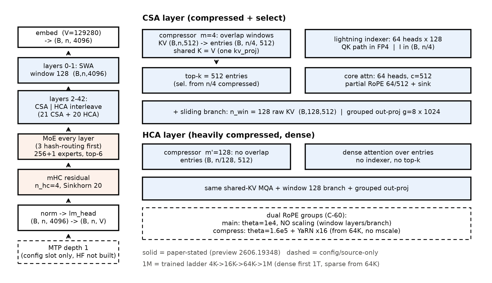
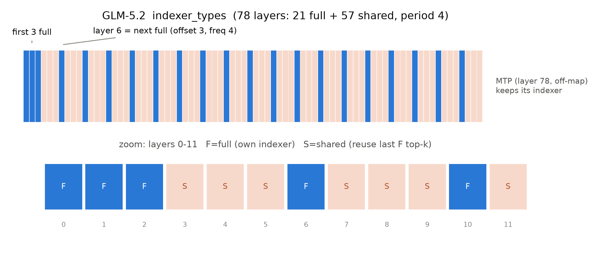

# 第 4 章 路线二续：DSV4 与 GLM-5 的 1M 上下文

## 4.0 开篇：从全书到这里

第 3 章合上时我们手里有一件刚拆完的机器：DSA——把 NSA 三分支砍成单分支、用一个 KL 监督的轻索引器换来「续训即可上生产」。但当时也留了一句话：可学习稀疏的参与集合变小了、计算有界了，这条路线被推到极限时长什么样？1M token 的上下文——$1{,}048{,}576$ 个位置，是 2017 年原典训练窗（512）的 2048 倍——真的能用「每 token 只看 2048 个候选」撑住吗？

本章拿两台 2026 旗舰作答：DeepSeek-V4（下称 DSV4，CSA+HCA 混合注意力）与 GLM-5/5.2（MLA+DSA 全层）。它们是可学习稀疏路线的两端现场——一台把「压缩」捡回来，一台把「索引器」跨层共享。同时本章是**证据等级标注的主场**：DSV4 只有一篇预览版论文加 config，GLM-5 有正式论文加 config，证据条件一薄一厚，正好把第 1 章立的证据等级制度（官方论文 > 官方技术报告 > config 逆向 > 第三方复测 > 厂商自报）拉到旗舰现场实战一遍。产出四样：一张 DSV4 整机结构推断图（图 4.1）、一本 1M 分类型账本横表（表 4.2）、一次「config 与权重逐层互证」的闭环演出（4.4 节），以及一份悬案登记表（表 4.3）。到章末收束时判词会再响一次：可学习稀疏把 $O(n^2)$ 换成了一本便宜许多的账，但算子本体仍未动——第三把刀，在下一章。

> **最小背景栏**（已学指回，本章不重教）：DSA 闪电索引器与两阶段续训＝第 3 章；MLA 的潜在 KV 压缩（$d_c{=}512$ 潜向量 + $d_r{=}64$ 旋转键）＝Book4 第 6 章；config 逆向五步法（认家族→重建图纸→算账对拍→读外围→证据分级+悬案登记）＝Book3 第 5 章立、第 9 章无交叉演练、Book4 第 10 章无论文主场——本章是它第四次整机使用；MXFP4 的 4.25 bits 格式账＝Book4 第 7 章；MTP＝Book4 第 8 章；分类型 KV/状态账本（全局层无界/滑窗层有界/线性层固定，单位=元素数）＝第 1 章。本章出现的两个新名字先挂号：**CSA**（Compressed Sparse Attention，压缩稀疏注意力）与 **HCA**（Heavily Compressed Attention，重压缩注意力），机制在 4.2 节教到「能画出来」。

## 4.1 到期的账：1M 是 2026 旗舰的新门槛

先还一笔旧账。Book1 第 1 章的欠账框里写着：「注意力的发明本来就是为了打破容量的墙；七年后墙换成了上下文长度，武器换成了外推与压缩，但战斗是同一场。」【Book1 ch01 欠账框原文直引】这条线（登记名 F10）经过 Book3 第 7 章的外推工程线（$2\text{k}\to32\text{k}$），在 Book2 卷末被誊成接力棒 N7 时已经点名了本章的地址：「1M 上下文的收束论在 Book5 第 8 章（超长上下文的路线之争在第 4 章铺陈）」【Book2 ch12 成稿直引】。现在铺陈开始：2026 年的旗舰门槛确实抬到了 $2^{20}=1{,}048{,}576$ 个位置——DSV4 全系 config 的 `max_position_embeddings=1048576`、GLM-5.2 同值、K3 同值【证据等级：config 逆向】。但要立刻泼一盆冷水：**并非人手 1M**——GLM-5 停在 198K（202,752）、Qwen3.5 原生 262K（1.01M 是托管服务口径）【证据等级：config 逆向】，「向 1M 收敛」与「人手 1M」是两句话，第 9 章谱系表还要回来算这笔总账。

本章拆的两台机器，证据条件恰好是制度的两档。**DSV4**：有一篇 58 页的论文，但摘要自述 "We present a preview version"——**预览版**，本章引用它的一律带这三个字，且全部数字走本地 PDF（调研期发现 HTML 版在 §5.2.1 处截断，漏掉了整段 MXFP4 明文——这个教训本身就是 4.2 节的考据框素材）【证据等级：官方论文·预览版 2606.19348 v1】。**GLM-5**：有正式论文（arXiv:2602.15763 v2，40 页）加 config 双锚——证据条件 2026 年最好的那一档，但它的 1M 版本 GLM-5.2 又退化到「模型卡+config、无论文」。一台薄一台厚，五步法在两档里各走一遍，读者就能体会：证据面越薄，每一步越要靠 config 与权重自证，悬案登记越厚。

纪律声明（导览 0.6 的落地）：本章是**案例章豁免**的正身位置之一——DSV4（预览版）与 GLM-5 系以「config 逆向+厂商自报核验」的身份进场，一切 benchmark 数字按厂商自报标注；这不是学究气，4.7 节会说明它如何直接决定「你敢信什么」。

## 4.2 DSV4：预览版论文与 config 并读

五步法第一步认家族。`model_type="deepseek_v4"`、`architectures=["DeepseekV4ForCausalLM"]`、`transformers_version="4.57.1"`——第三件是年代学证据：首发转换于 4.57 段（2026 年中），比本册锚定的 5.18.0 早一个版本时代，与 2026-06 的发布窗口吻合【证据等级：config 逆向】。本地 transformers 5.18.0 已有 `deepseek_v4` 目录（权重与代码均 MIT 许可），结构对拍有正身可用——这比 Llama 4 那次的镜像纪律、gpt-oss 那次的参考实现外证都更顺手。

第二步重建图纸，先看整机（图 4.1，总分总的第一步「先整体」）。V4 家族两档：**Flash 284B 总参/13B 激活、43 层、hidden 4096；Pro 1.6T/49B、61 层、hidden 7168**【证据等级：官方论文·预览版 §4.2.1，卡面同值】。层表不是论文给的全表，而是 config 里的一个数组：Flash 的 `compress_ratios` 长 44 项、Pro 长 62 项——本机断言发现长度恰为 `num_hidden_layers + num_nextn_predict_layers`（43+1、61+1），**尾项是 MTP 层的占位**，被 HF 配置的 `layer_types[:n]` 截断规则弃掉（Book3 第 9 章的「config→源码」双跳手法，这里反过来用源码行为反推 config 意图，推断级但双向可验）。截断后的层表（本机实读，[`code/ch04/dsv4_glm5_reverse.py`](code/ch04/dsv4_glm5_reverse.py#L44)::reverse_dsv4`）：

- **Flash：2 层滑窗 + 21 层 CSA + 20 层 HCA**——前 2 层纯滑窗，其后 CSA/HCA 严格交替（约 1:1），末层是 CSA；
- **Pro：0 层滑窗 + 30 层 CSA + 31 层 HCA**——前 2 层换成了 HCA 引导，同样交替。

两档对照读出两条设计事实：其一，滑窗不再承担整层（Pro 干脆一层都不给），它降格为每层内部的「支路」（马上讲到）；其二，CSA 与 HCA 约 1:1 交错——「会选的层」与「不选但看得粗的层」混编，这是本章最重要的结构心智。



图 4.1 DSV4-Flash 整机结构推断图（自绘·示意级，config 驱动）：左列=整机堆叠（层表与全部数值经 config 实读互证），右上=CSA 层内部，右下=HCA 层内部；实线=预览版论文明文（2606.19348），虚线=config/源码证据。出处：[`code/ch04/dsv4_glm5_reverse.py`](code/ch04/dsv4_glm5_reverse.py) --plot-dsv4-map`

现在进入「后局部」，逐组件讲清两台注意力机关（位置都在图 4.1 右栏）。

**CSA：先压缩、再稀疏**。论文的谱系自述一句话讲完："it first compresses the Key-Value (KV) cache of every $m$ tokens into one entry, and then applies DeepSeek Sparse Attention (DSA)"【官方论文·预览版 §2.3.1，直引】。回忆第 3 章：NSA 有个压缩分支 cmp（块聚合出粗表示、只用来打分和做粗注意力），DSA 上生产时把它砍了。CSA 把压缩捡回来，但**身份变了**：压缩条目不再只是打分的中间量，它直接成为注意力的 KV 本体。数据流（Flash 实配，逐运算标形状）：隐状态 $H\in\mathbb{R}^{n\times d}$（$d{=}4096$）经四组投影得 $C^a,C^b,Z^a,Z^b\in\mathbb{R}^{n\times c}$（条目维 $c{=}512$）；a/b 两个长度 $2m$ 的窗口**重叠**滑过序列，对 $[Z^a{+}B^a;\,Z^b{+}B^b]$ 按行 softmax（$B^a,B^b\in\mathbb{R}^{m\times c}$ 是可学习位置偏置）后做加权聚合，得到压缩条目 $C^{\mathrm{Comp}}_i\in\mathbb{R}^{c}$——整条序列的 KV 从 $n$ 条变成

$$n_{\mathrm{cmp}}=\left\lfloor \frac{n}{m}\right\rfloor \tag{4.1}$$

条（实配 $m{=}4$：1M 上下文压成 262,144 条）。用人话说：**每 4 个 token 的记忆打包成 1 张「摘要卡」，往后注意力只对摘要卡做**。然后是第 3 章的闪电索引器原样上岗——$I_{t,s}=\sum_h w^I_{t,h}\,\mathrm{ReLU}(q^I_{t,h}\cdot K^{I\mathrm{Comp}}_s)$（预览版 Eq. 16，与 DSA 的 Eq. 1 同型，打分对象从 $n$ 个 token 换成 $n_{\mathrm{cmp}}$ 张摘要卡），ReLU 打分、无指数；top-k 在摘要卡上取 **512**（Pro 翻倍到 1024）——对比 DSA 的 top-2048 是 *token*，V4 是更小的 512/1024 但单位是*压缩条目*（每条含 $m{=}4$ 个 token 的信息），论文明说这是相对 V3.2 的减法【官方论文·预览版 §2.3.4】。选中的条目进入核心注意力，且**一条条目同时充当 key 与 value**（共享 KV 的 MQA：`num_key_value_heads=1`，HF 源码里同一个 `kv_proj` 张量既当 k 又当 v——存储直接减半的架构级决定）；query 64 头、头维 $c{=}512$，输出侧再走分组低秩投影（$g{=}8$ 组、每组先投到 $d_g{=}1024<c\cdot n_h/g$ 再并投回 $d$）。

**例 4.1（构造例）：CSA 块压缩 mini——4 块压 2 条**。取 8 个 token、$m{=}4$、条目维 $c{=}2$，KV 序列 $k_1{=}(1,0),k_2{=}(0,1),k_3{=}(1,1),k_4{=}(0,0),k_5{=}(2,0),k_6{=}(0,2),k_7{=}(2,2),k_8{=}(1,1)$。
① 压缩（教学简化为等权平均；真实 CSA 是双窗 softmax 加权+可学偏置）：输入 8 条 2 维 KV $(8,2)$ → 输出 2 条摘要卡 $C_1{=}\mathrm{mean}(k_{1:4}){=}(0.5,0.5)$、$C_2{=}\mathrm{mean}(k_{5:8}){=}(1.25,1.25)$，形状 $(2,2)$；
② 打分：query $q{=}(1,0.5)$ 与 2 张卡内积 → 分数 $(0.75,\ 1.875)$，形状 $(2,)$；
③ top-1 选卡：选 $\{C_2\}$（它代言 token 5-8）；
④ 主注意力：只算 $q$ 对 $C_2$ 的一份注意力，输出取 $C_2$ 的 value（共享 K=V）。
效果读法：满注意力要打 8 次分，这里只打 2 次、算 1 次——**压缩条目数少于块数就是省**；代价是若 token 3 其实最相关、但它的「代言卡」$C_1$ 落选，信息就整块丢失——压缩是有损的，这就是 HCA 要与 CSA 混编、且每层都要留一条未压缩滑窗支路的原因。

**实物 4.1**（DSV4 预览版论文 §4.2.1 Model Setups 原样摘录，Flash 段，本地 PDF，中段省略；【证据等级：官方论文·预览版 2606.19348 §4.2.1】）：

```text
DeepSeek-V4-Flash. We set the number of Transformer layers to 43 and the hidden
dimension d to 4096. For the first two layers, we use pure sliding window attention.
For the subsequent layers, CSA and HCA are used in an interleaved manner. For CSA, we
set the compression rate m to 4, the number of indexer query heads to 64, the indexer
head dimension to 128, and the number of KV entries selected for sparse attention
(i.e., attention top-k) to 512. For HCA, we set the compression rate m' to 128. …
```

指名看什么：两处「论文只给半张图纸」。其一，"the number of KV entries selected … (i.e., attention top-k) to 512"——top-k 的单位明写是 **KV entries（压缩条目）**，与 DSA 的 2048 token 不同物；其二，层表只说 "interleaved"、不给逐层排列——逐层的 43 格在 config 的 `compress_ratios` 里，两份半张图纸拼起来才是整机（本节开头正是这么拼的）。

**HCA：重压缩+稠密**。每 $m'{=}128$ 个 token 压成 1 条（单窗 softmax+偏置、不重叠），1M 上下文只剩 8,192 条；然后**不做任何选择**——无索引器、无 top-k，稠密注意力对全部条目做。心智一句话：**CSA 保留「选」的能力（在哪看由内容定），HCA 放弃「选」（全看，但看的对象已被压到 1/128）**——第 2 章「改视野」与第 3 章「改参与集合」两条路线在一种层内合流。两型共有三件小机关，全部与已学章节押韵：每层附带一条 $n_{\mathrm{win}}{=}128$ 的**未压缩滑窗支路**（压缩块的因果掩码会遮住块内 token 顺序，近窗补回局部精度——路线一在 DSA 里被砍掉、在 V4 以支路身份回归，第 2 章的伏笔在此收线）；每头一个可学 **sink** 标量进注意力分母（论文引 gpt-oss 与 StreamingLLM，正是第 2 章 2.3 节的机制）；**partial RoPE** 只对最后 64 维旋转（$64/512{=}12.5\%$，输出侧以位置 $-i$ 补旋恢复块内相对位置——第 8 章 8.5 节「头维净土」的谱系成员）。两档的全部字段对照与结构推断收进表 4.1，后文账本与悬案都从这张表取数。

表 4.1 DSV4 双机型配置表（预览版 §4.2.1 与 config 逐项互证；「读法」列=结构推断；等级未注明者均为【证据等级：config 逆向×预览版论文双锚】）

| 字段 | V4-Flash | V4-Pro | → 部件/读法 |
|---|---|---|---|
| 层数 / hidden | 43 / 4096 | 61 / 7168 | 扩容靠加层加宽（Llama 4 式） |
| 层表（实读） | 2 SWA + 21 CSA + 20 HCA | 30 CSA + 31 HCA（头 2 层 HCA 引导） | CSA:HCA≈1:1 交错 |
| 压缩率 | CSA $m{=}4$ / HCA $m'{=}128$ | 同 | KV 本体压到 1/4 与 1/128 |
| 索引器 | 64 头×128，top-k **512** | 同头数，top-k **1024** | top-k 单位=压缩条目（≠DSA 的 token） |
| 注意力 | 64 头，$c{=}512$，MQA（kv 头=1，K=V 同张量） | 128 头，$c{=}512$，$d_c{=}1536$ | 共享 KV 条目；partial RoPE 64/512 |
| 滑窗支路+sink | $n_{\mathrm{win}}{=}128$ + 每头可学 sink | 同 | 路线一以支路回归 |
| MoE | 256+1 共享、top-6、专家宽 2048、前 3 层 Hash 路由 | 384+1、top-6、宽 3072 | 稀疏度 43:1 / 64:1（第 9 章谱系） |
| 精度 | FP8（e4m3/ue8m0，128×128 块）+ **专家 FP4** | 同 | MXFP4 打点见下方考据框 |
| 位置 | main θ=10000 无缩放；compress θ=160000+YaRN×16；max_position 1M | 同 | 双 rope 组，见下文定谳 |
| 其他 | mHC $n_{hc}{=}4$、MTP 深度 1、vocab 129280 | 同（Sinkhorn 20 迭代同） | mHC 见段末 |

> **【考据框】MXFP4 打点勘误——HTML 截断的一课**。调研期从 arXiv HTML 版读 DSV4，§5.2.1 的量化段落是空的；回本地 PDF 逐字重读，明文是："We apply FP4 (MXFP4) quantization (Rouhani et al., 2023) to two components: (1) MoE expert weights, … (2) the Query-Key (QK) path in the indexer of CSA, where QK activations are cached, loaded, and multiplied entirely in FP4"【官方论文·预览版 §5.2.1，直引】——**MXFP4（QAT）打点=专家权重 + 索引器 QK 路径**两处，不是笼统的「FP4 模型」。这与 K3 的 MXFP4 QAT（第 7 章正菜）同型不同位；两家对照表在第 7 章。另：arXiv 编号 2606.19348 的前缀（六月段）与 v1 提交日期（2026-04-26）不一致，成因不明，连同预览版身份一并如实登记（悬案表 4.3）。

第三步算账对拍延后到 4.5 节（1M 账本是本章正菜），先把 **1M 证据链四层**排开——这是「证据等级实战」的第一场演出：

1. **训练侧**：序列长度阶梯 4K→16K→64K→1M；先稠密注意力热身 1T token，"introduce sparse attention at the sequence length of 64K and keep sparse attention during the rest of the training"【官方论文·预览版 §4.2.2，直引】——1M 长度的数据是真练过的。
2. **位置侧（C-60 定谳）**：预览版论文 58 页全文检索 `YaRN` 零次——单看论文会说「1M 全靠训练、无外推」；但三个 checkpoint 的 config 都带 `rope_scaling={type:yarn, factor:16, original_max_position_embeddings:65536}`。真相不是矛盾，是**双 rope 组分工**：主 rope（θ=10000）无任何缩放，服务滑窗层与滑窗支路——只看 128 个近邻、相对位置极小，天然不需要缩放；压缩 rope（θ=160000）+YaRN×16 只打 CSA/HCA 层，且 $65536\times16=1{,}048{,}576$ 分毫不差、65536 恰是稀疏注意力引入的训练档。数值自洽加上训练-推理一致性论证（若训练 64K→1M 段用未缩放位置、发布才加 YaRN 会造成位置错配），定谳为：**YaRN16 在训练 64K→1M 阶段即启用、checkpoint 忠实携带（推断级）；DSV4 的 1M=「数据真练到 1M」与「压缩域 rope 缩放」并用**，写作时按「rope 组分工」表述，「纯训练无外推」「发布外推补丁」两种读法都禁用。第 8 章的外推哲学表按此口径收录。
3. **效果侧**：1M 档评测选 MRCR（OpenAI 8-needle）与 CorpusQA。引用时要锚定图表号：Table 7 给 DSV4-Pro Max 的 MRCR 1M(MMR)=**83.5**（Flash Max 78.7）【官方论文·预览版 §5.3 Table 7+厂商自报】；而 Fig.9 的 8-needle 曲线在 1M 处只有 0.59——同名 benchmark、同长度档，图与表差 24.6 分，论文未解释聚合口径差异（推测表为多 needle 数平均，未证实）。论文自评的原话值得整句读："retrieval performance remains highly stable within a 128K context window. While a performance degradation becomes visible beyond the 128K mark, the model's retrieval capabilities at 1M tokens remain remarkably strong"【官方论文·预览版 §5.3.2，直引】。
4. **成本侧（厂商自报，4.5 节本机复算）**：1M 单 token 推理，Pro 只需 V3.2 的 27% FLOPs / 10% KV cache，Flash 10% / 7%；KV cache 约为 BF16 GQA8（head dim 128）基线的 2%【官方论文·预览版 §1/§2.3.4+厂商自报】。

机身还有两件承自 Book4 的零件，各一句话。**mHC**（流形约束超连接，Manifold-constrained Hyper-Connections）：残差流展宽到 $n_{hc}{\times}d$（实配 4），把残差混合矩阵约束到双随机矩阵集合（Birkhoff 多面体，谱范数 $\le 1$，Sinkhorn-Knopp 投影 20 迭代）——深栈非扩张、训练稳定；它与 MLA「把大矩阵压进低秩」是同一种「以结构换稳定」的 2026 味道（数学不展开，独立论文 2512.24880）。**Muon 优化器**：因 query 与压缩条目先过 RMSNorm 再进注意力，logit 不再爆炸，**不再需要 QK-Clip**（Book4 第 7 章 MuonClip 的 2026 后续）。

> **【实现对照框】HF 5.18.0 的双 rope 注释（C-60 的源码正身）**。`repos/transformers/src/transformers/models/deepseek_v4/configuration_deepseek_v4.py` L294-321："yarn is applied **ONLY to layers with a compressor** (CSA/HCA); pure sliding-window layers use plain RoPE with `theta=10000` and no scaling"，且参考实现**不乘 YaRN 的 mscale**（强制 `attention_factor=1.0`，注释明言 V4 参考实现如此）。config 源码注释与 checkpoint 数值、论文训练档三源互证——「按 rope 组分工」不是我们的猜测，是官方工件的三方一致。

## 4.3 GLM-5：有论文的旗舰怎么读

换到证据厚的那一档。GLM-5（智谱，2026-02）有正式论文【官方论文 2602.15763 v2】+ config + 权重（MIT，代码 Apache-2.0 双轨），认家族一眼顺：`model_type="glm_moe_dsa"`、78 层 hidden 6144、`first_k_dense_replace=3`（3 稠密 + 75 MoE）、256 专家 top-8 + 1 共享（稀疏度 32:1）、vocab 154,880【证据等级：config 逆向】。注意一段小考据：论文 prose 写 "reduces its layer count to 80"，但**同一论文 Table 10 自己给 3 dense + 75 MoE + 1 MTP**（=78 主干层），config 也是 78，IndexCache 论文附录的层模式串长度还是 78——三证合一，**GLM-5=78 层，prose 的 "80" 与自家表格不自洽**；GLM-5.2 同为 78 层、没动层数（动的是索引器排班与上下文，见 4.4）。

注意力侧一句话：**全层 MLA + DSA**。论文 §1 明文 "we adopt DSA (DeepSeek Sparse Attention)"——这是第 3 章「DSA 上生产」的谱系句正身，config 侧 `layer_types` 未显式写出、由源码 `__post_init__` 填成 78 层全 `indexed_attention` 互证【证据等级：官方论文+config 双锚】。GLM 的贡献不在发明新算子，而在两个「适配」：其一，**Muon Split**——裸用 MLA（576 维潜在 KV）在 Muon 优化器下打不过 GQA-8（2048 维 KV），论文的解法是把上投影矩阵按头拆小分别正交化；9B 档消融里 MLA+Muon Split 追平 GQA-8，再把 head dim 192→256、头数减 1/3（**MLA-256**，训练算力与参数不变、解码算力下降）又追平一次【官方论文 §2.1 Table 1+厂商自报】。这段消融顺便解决了一个「为什么 2024-25 年旗舰多用 GQA」的历史悬案的一半：不是 MLA 不行，是优化器没适配。其二，**DSA 的续训成本骤降**：DSV3.2 用了 943.7B token 稀疏训练（第 3 章），GLM-5 的 DSA 适配只用 **20B** token（warm-up 1000 步×14 序列×202,752 token、LR 5e-3，稀疏段沿用 mid-training 配方），论文自评 "it is enough to adapt the DSA model to match the performance of the original MLA model"；收益口径 "reduces the attention computation by roughly 1.5-2× for long sequences … being able to handle 128K contexts at half the GPU cost"【官方论文 §2.1.1，直引+厂商自报】。128K 四项基座对照（Table 3）：MQ-NIAH 100.0/100.0、MV-NIAH 95.5/**97.0**、SQuAD 79.7/**86.0**、HotpotQA 66.3/63.0（MLA/DSA）——两升一平一微降，「无损」主张的自证数据【官方论文 Table 3+厂商自报】。

论文 §2.1.2 还有一张更野的消融表：在 GLM-9B 基座上把 **SWA（交错/搜索式选层）、GDN、SimpleGDN、DSA** 放在同一场 64K 续训里对比。本章只取一行结论——RULER@128K 相对满注意力的差距：SWA 交错 −30.35（灾难性）、SWA 搜索式 −5.69、GDN −11.28、SimpleGDN −8.25、**DSA 0**——论文的判词是 "DSA is lossless by construction: its lightning indexer achieves token-level sparsity without discarding any long-range dependencies"【官方论文 §2.1.2，直引+厂商自报】。

**实物 4.2**（GLM-5 论文 §2.1.2 Table 5 原样摘录，RULER 列+差距列，其余三基准列略；原文为双列 64K/128K 记法）：

```text
RULER (64K / 128K)            ∆@128K
GLM-9B          85.35 / 75.28        —
SWA Interleave  65.94 / 44.93   (↓30.35)
SWA Pattern     83.72 / 69.59   ( ↓5.69)
GDN             76.76 / 64.00   (↓11.28)
SimpleGDN       81.76 / 67.03   ( ↓8.25)
```

指名看什么：这张表是 2026 年「三条路线同场对照」的官方现场——第 2 章的滑窗、本章的稀疏、下一章的线性（GDN 就是第 5 章的主角，此处只点名不教）在同一基座同一预算下比长上下文。表是 GLM 自家口径、为 DSA 站台的选择性对照（GDN 按 Jet-Nemotron 管线复训），**整表展开与「为什么 GLM 选稀疏不选线性」的论证收拢到第 9 章 9.2 节**——同一张表两章双用，分工在此声明。

最后是参数账，GLM-5 给证据等级制度送上 2026 年最典型的一个案例：**三个参数量同物不同径**——论文写 744B、HF 页面写 754B、GLM-5.2 写 753B。本册前置自算（safetensors 分片头 HTTP Range 逐张量求和，不下权重；方法承 Book3 第 5 章）把三口径全部复算闭合：全量 753.864B；**744B = 全量 − MTP 层（9.953B）= 743.911B 复算命中**；754/753 是 HF 对 GLM-5 / GLM-5.2 全量的自动统计（753.864 / 753.330B）【证据等级：config 逆向·checkpoint 亲算】。更有教学价值的是：论文 Table 10 的口径原句 "we include the parameters of MTP layers but not word embeddings and the output layer" 按字面算出 751.96B，**算不出论文自己的 744B**——口径句与数字矛盾（744B 实际对应「含嵌入/输出层、不含 MTP」）。这不是 GLM 独有，是「论文口径句也要复算」的活标本，第 11 章读厂商自报五步法把它收为主案卷之一。本章只立事实：主数用 744B（40B 激活、预训练 28.5T token），两个 HF 口径入脚注。

## 4.4 GLM-5.2：IndexShare 与「权重级承诺」

GLM-5 的 config 法定上下文停在 202,752（198K）；1M 属于 GLM-5.2（2026-06，MIT）。这一节的正主是 config 里一个 78 项的数组——它也是全书至今**config 逆向最漂亮的一份标本**。

**实物 4.3**（`zai-org/GLM-5.2` config.json 原样摘录，截取 DSA 排班与上下文字段；`indexer_types` 共 78 项，此处只列前 6 项；【证据等级：config 逆向】）：

```json
  "index_topk": 2048,
  "index_topk_freq": 4,
  "index_skip_topk_offset": 3,
  "indexer_types": [
    "full",
    "full",
    "full",
    "shared",
    "shared",
    …（共 78 项：21 个 "full" + 57 个 "shared"）
  ],
  "max_position_embeddings": 1048576,
```

指名看什么：两件事在同几行里同时发生——`max_position_embeddings` 从 5 的 202,752 跳到 1,048,576（`rope_theta` 同步 1e6→8e6，无任何 scaling 字段），而 78 层的索引器排班从「全 full」变成 **21 full + 57 shared**。full 层位号 = $\{0,1,2\}\cup\{6,10,14,\dots,74\}$（config 0 起索引；人读即第 1-3 层全 full，此后每 4 层 1 个 full）——本机断言该展开与 `index_skip_topk_offset=3`、`index_topk_freq=4` 的源码公式逐位一致（`reverse_glm`）。图 4.2 把 78 项画成一条带子，周期 4 的模式一眼可见。



图 4.2 GLM-5.2 IndexShare 层模式图（config 自动绘制）：78 层中 21 层 full（蓝，自跑索引器）+ 57 层 shared（浅色，复用最近前一个 full 层的 top-k）；下排放大前 12 层。出处：[`code/ch04/dsv4_glm5_reverse.py`](code/ch04/dsv4_glm5_reverse.py) --plot-layer-map`

这个排班背后的机制有自己的正身论文——**IndexCache**（arXiv:2603.12201，清华+Z.ai；注意**论文名 IndexCache ≠ 模型卡名 IndexShare**，同一机制两个名字，首现并记）【证据等级：官方论文】。动机有一组扎手的数字：DSA 把核心注意力降到 $O(Lk)$ 之后，**索引器自己仍是每层 $O(L^2)$**——30B DSA 模型的 profiler 里，索引器占总时延的比例随上下文一路暴涨：预填充阶段 10K/60K/120K/200K 时 27%→50%→68%→81%（解码 27%→41%）【官方论文 §1+厂商自报】。砍掉了正菜的费用，配菜反客为主——这是「每一刀都会造出下一个瓶颈」的又一现场。而它的经验依据是一条漂亮的测量：47 层模型上逐层两两 top-k 重叠率，**相邻层 0.7-1.0**、呈块状聚类（Appendix A，768 样本×200K）——大多数层的索引器在算重复的答案。

解法因此朴素到可以用一行式（式 (4.2)）写完（模式串 $c\in\{F,S\}^N$，首层恒 F 播种）：

$$T^{(\ell)}_t \leftarrow T^{(f(\ell))}_t,\qquad f(\ell)=\max\{j<\ell:\ c_j=F\} \tag{4.2}$$

用人话说：**S（shared）层不跑索引器，直接抄最近前面那个 F（full）层的 top-k 索引用**——$T$ 只是单张索引张量、每个 F 层覆写一次，推理循环只多一个条件分支、零额外显存。效果（30B 底座 GLM-4.7-Flash* 续训 DSA）：200K 预填充 19.5s→10.7s=**1.82×**、单请求解码 **1.48×**；1/4 保留的搜索版 Long 均分 49.9 vs 原 DSA 50.2（近似无损），1/8 极端档掉到 46.1（边界如实）【官方论文 §4+厂商自报】。GLM-5（744B）上 training-free 初步确认：1/4 搜索版 Long 78.0 vs 78.4（−0.4 内）、100K 以上「≥1.3×」【官方论文 §4.5+厂商自报】。

配置 F/S 排班有两种路线，且论文自曝一个负结果。**training-free**（免训练，现成 DSA 模型直接用）：贪心逐层搜索——每步把「翻成 S 后校准集 LM loss 最小」的层提交，直到只剩目标份数。关键发现：**均匀交错不行**（1/4 均匀掉 7.2 分），「哪些层保留远比保留多少重要」——早层最敏感（扰动传播路径最长）。**training-aware**（带训练）：保留的索引器不再只对齐本层注意力，而是对齐它服务的 $m{+}1$ 层的**多层蒸馏损失**；论文给了一个小正身命题（Proposition 1）：该损失与「对服务层注意力分布的平均（质心）蒸馏」梯度严格相等。训练之后**模式敏感性消失——均匀交错也能追平**。负结果（Appendix C）：先试过「注意力输出余弦相似度+动态规划选划分」，结果与均匀交错一样差——**局部相似度不预测端到端质量**，必须用端到端 LM loss 搜（第 11 章方法论会再借这条）。

那么 GLM-5.2 的发布 config 是哪条路线？三源拼图：config 是**均匀周期 4**（training-aware 才救得活 uniform）；README 把 IndexShare 链到这篇论文；而最硬的一块来自权重——**534M 差值的精确解剖**。GLM-5 与 5.2 的 checkpoint 全量差 = 753,864,139,008 − 753,329,940,480 = **534,198,528**，而每层索引器参数按 config 几何展开：

$$P_{\mathrm{idx}}=\underbrace{r_q\cdot h_I\cdot d_I}_{wq_b:\,2048\times4096}+\underbrace{d\cdot d_I}_{wk:\,6144\times128}+\underbrace{2\,d_I}_{k\_norm}+\underbrace{d\cdot h_I}_{weights\_proj}=9{,}371{,}904 \tag{4.3}$$

$57\times 9{,}371{,}904=534{,}198{,}528$——**分毫不差**【证据等级：config 逆向·checkpoint 亲算（params_audit 前置版）】。也就是说：**GLM-5.2 的 checkpoint 里，57 个 shared 层的索引器权重物理上不存在**（携带索引器的只有 21 个 full 层 + MTP 层）。这把 IndexShare 从「推理期小技巧」升格为「**权重级承诺**」——training-free 方案不删权重（GLM-5 的每一层都还带着自己的索引器），5.2 删了，所以「5.2 走 training-aware+uniform」从推断级升为**强推断（权重级证据）**，官方仍未明说（悬案表 4.3）。本机两路独立复现了这条证据链：meta device 建模（零分配、只建模块树）数出 GLM-5.2 携带索引器的层恰好 21 个（GLM-5 是 78 个）；微缩整机（8 层、`F,F,F,S,S,S,F,S`）实跑时 state_dict 里只有 4 层有索引器（层 0/1/2/6）、shared 层的 forward 直接复用前一个 full 层的 top-k，损失 6.232≈ln 512 一切健康【证据等级：本书实验（CPU fp32，2026-10）】。

5.2 的 1M 证据链按制度排三层：config 层（`max_position_embeddings=1048576`+θ 8e6）——只能证明「按 1M 声明的位置空间」；官方陈述层——README 卖点措辞是 "**solid 1M-token context** that stably sustains long-horizon work"，IndexShare "reducing per-token FLOPs by **2.9×** at a 1M context length"，MTP 接受长度 "+up to 20%"，主打能力数字换成 SWE-bench Pro **62.1**（注意 5/5.2 主打赛道从 Verified 换成了 Pro，不可跨代直比——第 11 章的口径注记在此挂号）【证据等级：厂商自报（模型卡）】；第三方层——**暂无独立 1M 长文评测可引**（FrontierSWE 等 1M 口径评测是第三方，但非长文检索类）。注意 2.9×@1M 是 README 自报——IndexCache 论文只测到 200K，引用时必须带这个口径差。另有半条悬案如实记：config 上限 1M 与 NVIDIA 开发者论坛「服务端默认 202,752、1M 需 opt-in」两说并存，未定论（表 4.3）。最后送一个 config 防坑：`head_dim` 字段在 GLM-5 写 64（=qk_rope 维）、在 5.2 写 192（=qk_nope 维）——同一物理量两种写法，源码 `__post_init__` 会重算，读 config 时别拿它当头维真相。

## 4.5 1M 账本手算：四台机器一张表

四节拆完两台机器，回到「算账对拍」——用第 1 章立的分类型账本（单位=元素数，batch=1）把 1M 的账一次算清。DSV4 需要把账本公式先扩展一步：它的层既不是全局也不是滑窗，而是「压缩条目层」。由式 (4.1)，CSA 层的 KV 条目数 $\lfloor n/m\rfloor$ 条 + 滑窗支路 $W$ 条，每条 $c{=}512$ 维且 K=V 共享一份；HCA 层同理换 $m'$；滑窗层有界 $\min(n,W)$：

$$\mathrm{KV}_{\mathrm{V4}}(n)=L_{\mathrm{sw}}\cdot\min(n,W)\cdot c+L_{\mathrm{csa}}\cdot\Big(\big\lfloor \tfrac{n}{m}\big\rfloor+W\Big)\cdot c+L_{\mathrm{hca}}\cdot\Big(\big\lfloor \tfrac{n}{m'}\big\rfloor+W\Big)\cdot c \tag{4.4}$$

用人话说：滑窗层封顶 128 条，CSA 层每 token 摊 $1/4$ 条、HCA 层摊 $1/128$ 条，全部乘上条目宽度 512。GLM 线的账则承 Book4 第 6 章：MLA 每层每 token 的 KV = 潜向量 + 旋转键：

$$\mathrm{KV}_{\mathrm{MLA}}/\mathrm{token}/\text{层}=d_c+d_r=512+64=576 \tag{4.5}$$

用人话说：每个 token 在每层只记一份 576 个数的「行李」，但行李数随上下文**无界增长**——DSA 砍的是算的份数（top-k 2048），不砍存的份数。

**符号表**（式 (4.1)/(4.4)/(4.5)；形状列按 batch=1 单序列口径）

| 符号 | 含义 | 形状/取值 |
|---|---|---|
| $H$ | 层输入隐状态 | $(n,\,d)$，Flash $d{=}4096$ / GLM $d{=}6144$ |
| $C^{\mathrm{Comp}}$ | 压缩条目序列 | $(\lfloor n/m\rfloor,\,c)$，$c{=}512$，K=V 共享 |
| $I_{t,:}$ | 索引器对条目的打分 | $(\lfloor n/m\rfloor,\,)$，ReLU 计分 |
| $n,m,m'$ | 上下文长/CSA/HCA 压缩率 | $1{,}048{,}576$ / 4 / 128 |
| $W$ | 滑窗支路宽 | 128 |
| $d_c,d_r$ | MLA 潜向量/旋转键维 | 512 / 64（GLM-5 与 K3 同） |

把式 (4.4) 与式 (4.5) 代入四台机器（K3 与 Qwen3.5 的行是本册谱系的另两路，config 几何直取：K3 = 24 层 Gated MLA（576/token）+ 69 层 KDA 固定状态（96 头×128×128，状态形状的来历是第 5-6 章的正菜）；Qwen3.5-35B = 10 层 GQA 16:2 head_dim 256（$2{\times}2{\times}256{=}1024$/token）+ 30 层 GDN 固定状态（32 头×128×128）【证据等级：config 逆向】）：

表 4.2 1M 上下文分类型 KV/状态账本横表（$n=1{,}048{,}576$，batch=1，元素数；GB 按 BF16 双字节折算，十进制）【证据等级：本书实验手算（`ledger_1m`，CPU，2026-10）+config 逆向】

| 机型（层账） | 无界部分（随 $n$ 涨） | 有界/固定部分 | 1M 合计 | 1M 怎么来（位置档位） |
|---|---|---|---|---|
| DSV4-Flash（2SWA+21CSA+20HCA） | CSA 21×134.3M + HCA 20×4.26M 元素/层 | SWA 2×65,536 封顶 | **29.1 亿元素**（BF16 5.8GB；其 FP8 混存口径 ≈2.9GB；+索引器 K 7.05 亿见注） | 数据真练到 1M + 压缩 rope 组 YaRN×16（64K 起） |
| DSV4-Pro（30CSA+31HCA） | CSA 30×134.3M + HCA 31×4.26M | —（无整层滑窗） | **41.6 亿**（BF16 8.3GB；FP8 混存 ≈4.2GB） | 同上 |
| GLM-5.2（78×MLA+DSA） | $78\times576=44{,}928$/token | —（DSA 只砍计算） | **471.1 亿**（94.2GB；+索引器 K 28.2 亿=+6.0%） | θ 1e6→8e6，无 scaling 字段；1M 进 config |
| K3（24 MLA + 69 KDA） | $24\times576$/token → 145.0 亿（29.0GB） | KDA 固定 1.085 亿（217MB，**0.75%**） | 146.1 亿 | 全 NoPE 位置零缩放直推（第 6 章） |
| Qwen3.5-35B（10 GQA + 30 GDN） | $10\times1024$/token → 107.4 亿（21.5GB） | GDN 固定 1,573 万（31.5MB） | 107.5 亿 | 262K 原生 + 1.01M 托管（扩展法=卡面披露的静态 YaRN×4） |

注：DSV4 的索引器自己也存 K（条目维 128），仅 CSA 层：Flash $21\times\lfloor n/4\rfloor\times128=7.05$ 亿、Pro 10.07 亿，约为主账的 24%——预览版论文的 10%/7% 口径未给账本公式，按式 (4.4) 只计压缩+滑窗条目时得到 **Flash 7.9%、Pro 11.3%**（对 V3.2 基线 368.4 亿=61 层×576×1M），与自报 7%/10% 同档【证据等级：本书实验手算 vs 厂商自报】——复算可算的、登记读不出的，账本口径差入悬案表。

这张横表值得盯三处。**其一，同一张表里三种增长形态共存**：DSV4 的压缩条目账仍在涨（斜率 1/4 与 1/128）、GLM-5.2 的 MLA 账全速涨（每 token 44,928 个元素）、K3 与 Qwen3.5 的线性层状态纹丝不动——第 1 章的「分类型」在这里从公式变成四台真机的合影。**其二，K3 行的 0.75%**（KDA 全部固定状态只有 24 层 MLA 无界账的百分之零点七五）——3:1 混合的账本根据，第 6 章的杀手数字在此预存。**其三，最右列是四档位置哲学的预演**：数据真练+压缩域缩放（DSV4）/外推为主（Qwen3-Next 的 partial RoPE+YaRN×4）/原生+托管（Qwen3.5）/位置零缩放直推（K3 全 NoPE）——GLM-5.2 的 θ×8 是第五种（无缩放字段、直道加 θ）。这张对表第 8 章收束论要正式回收，此处只立账。

账算完顺手交代**算账对拍的本机口径**（大纲钉死的「双口径」纪律）：全尺寸旗舰（284B/1.6T/744B 档）在 48GB 统一内存上**绝不能用随机权重实跑**——构造参数本身就要数百 GB；正解是 meta device：只建模块树、不分配一个字节，参数账照数（`numel` 不需要数据）、state_dict 键名照 dump。本机 meta 建模四机读数：DSV4-Flash **284.332B**、Pro **1572.997B**（卡面 284B/1.6T 复算命中）、GLM-5 **743.911B**（=4.3 节的 744B 口径）、GLM-5.2 743.377B；随机权重的前向实跑只留给 6-8 层微缩机（4.8 节命令）——「大杯走 meta、小杯才实跑」，这与 Book4 第 10 章「分片头审计不下权重」是同一门手艺的两种变体【证据等级：本书实验（CPU meta+fp32，2026-10）】。

## 4.6 悬案登记：config 读不出什么

五步法第五步。证据面再厚，config 与论文也只覆盖「图纸与部分配方」——训练数据构成、后训练链细节、优化器超参之外的东西，一概读不出。如实登记：

表 4.3 悬案登记表（「读不出」登记不猜测；等级=现有最好证据）

| # | 悬案 | 现有证据与边界 |
|---|---|---|
| 1 | DSV4 MRCR 图表口径差（Fig.9 的 0.59 vs Table 6/7 的 83.5@1M，差 24.6 分） | 预览版论文未解释聚合口径；引用必须锚定图表号；完整版发布后回查 |
| 2 | DSV4 的 10%/7% KV 口径公式（是否含索引器 K、按字节还是元素） | 预览版无账本公式；本机元素账 7.9%/11.3% 同档（4.5 节注） |
| 3 | DSV4 语料构成（32T/33T 的数据面）、Hash 路由 3 层的训练动态 | 预览版论文只给总量；「config 读不出数据」通例 |
| 4 | GLM-5.2 的 1M 训练配方（长上下文数据构成、是否分段扩展） | z.ai 博客页渲染为空；README/config/论坛三手之外无正身 |
| 5 | GLM-5.2 服务端默认上下文（config 1M vs NVIDIA 论坛「默认 202,752、1M opt-in」） | 两说并存未定论 |
| 6 | GLM-5.2 走 training-aware 的官方确认 | 强推断（权重级证据 534M 精确闭合）；官方未明说 |
| 7 | GLM-5.2 自 5.1 的升级路径（续训 or 重训） | 未披露 |
| 8 | arXiv 2606.19348 编号前缀与 v1 日期不一致的成因 | 不明；连同预览版身份一并登记 |

冻结线后的两个对象按纪律只入脚注与悬案框。GLM-5.3-Flash（2026-09）一句脚注：它把 **KDA 线性层×3 + DSA 稀疏层×1** 装进同一台机器（45 层=34+11，config 已核）——本册两条突围路线开始在同一台旗舰里混编，谱系收敛的信号；展开归第 9 章谱系表脚注，正文主线仍停在 5(.2)。

> **【悬案框】DSV4.1-Flash（2026-09，冻结线后）**：卡面三大件只有一句话自报+config 字段双锚（无论文）：**CED** 因果编码器-解码器（20 编码+20 解码层，解码器全局 KV 由编码器终态投影——prefill 8B/decode 16B 激活不对称）；**CSA2** 三态索引（Full/Reindex/Reuse）+ **FP4 主 KV 缓存**（E2M1+每 16 通道 E4M3 scale）→ 全局 KV **890 bytes/token**（≈V4-Flash 的 1/4）；**engram** 条件记忆 196B 参数——config 亲核为 $2\times384\text{M}\times256\approx196.6$B 两张 n-gram 嵌入表，独占 552B 骨干的约 36%（显存大头不是 MoE 而是检索表）；另有 DSpark、MTP×3（`num_nextn_predict_layers=3`）。机制文档均未发布——「V4.1 把无界本身也砍了（字节钉死）」是第 9 章 9.4 节账本三档递减的下一档预告，细节全部悬案。

## 4.7 本章小结

开篇的问题——两台 1M 旗舰怎么用可学习稀疏、证据薄厚两档怎么读——本章交出四样产出。DSV4 把第 3 章砍掉的压缩捡回来且升格为 KV 本体（CSA），再配一种放弃选择的重压缩稠密层（HCA），约 1:1 混编加滑窗支路与 sink 兜底，1M 靠「数据真练+压缩 rope 组 YaRN16 分工」；GLM-5 证明 DSA 的适配成本已降到 20B token 量级、MLA 靠 Muon Split 与 MLA-256 在新优化器下翻盘；GLM-5.2 用 IndexShare 砍掉索引器的跨层冗余，且 config、论文、权重三方互证到 534,198,528 分毫不差；1M 账本横表把四种增长形态与五档位置哲学钉进一张表。两台机器、一条路线、两种证据条件——五步法在两边走完，悬案八条如实登记。

**带走的心智**：如果细节都还回去，留三句话。**其一，2026 旗舰的证据格局是「预览版论文、模型卡、config、checkpoint 四层拼图」，没有一层是完整的——读法不是找到最权威的一层，而是让每层互证：config 证论文、权重证 config、复算证口径**；GLM-5.2 的 534M 是范式：一个 config 数组、一条算式、一份分片头，三方咬合时你才真的「拆过」它。**其二，「$O(n^2)$ 没有消失，只是换了更便宜的账」**——DSA 把核心注意力降到 $O(nk)$，索引器自己 $O(n^2)$ 反客为主，IndexShare 再把索引器砍掉 3/4；每一刀都造出下一个瓶颈，也造出下一刀，这是路线二谱系「选择机关越来越便宜」（复用分数→独立索引器→压缩域索引→跨层共享索引）的动力学。**其三，1M 不是一种东西**——同一行 config 数字背后，「真练到/外推到/托管到/直推到」是四种不同的承诺，账本与位置档位要一起读。

镜头拉回全书：路线二的两台旗舰拆完，「改参与集合」这条路已经走到了 2026 年的最远处。但别忘了第 3 章 3.6 节留下的判词——CSA/HCA 再省，每 token 对选中的条目做的仍是**精确 softmax 内积**，算子本体一步没动。下一章换第三把刀，也是改动最大的一把：把点积 softmax 整个换掉，用固定容量的状态取代无界的账本——线性注意力、delta rule 与 Gated DeltaNet，F12 通行证的全额兑现处。

## 4.8 动手验证

- **五步法与账本全数字来源**（CPU 秒-分钟级；表 4.2 与式 (4.3)/(4.4) 的对账数字、mini 实跑全部出自本脚本）：
  ```bash
  cd 工作区根目录 && source env.sh && \
    python "[`code/ch04/dsv4_glm5_reverse.py`](code/ch04/dsv4_glm5_reverse.py)" --out-name run1
  ```
  预期产出：Flash 层表 2/21/20 与尾项 MTP 占位断言、双 rope 组读数（main 1e4 无缩放 / compress 1.6e5+YaRN16）；meta 四机对账（284.332B / 1572.997B / 743.911B=论文 744B / 743.377B，索引器携带层数 21/30/78/21）；534,198,528=57×9,371,904 与 params_audit 亲算差值闭合 `true`；微缩双机实跑（损失 6.255/6.232≈ln 512）；1M 账本横表（Flash 29.1 亿=V3.2 的 7.9%、Pro 41.6 亿=11.3%、GLM-5.2 471.1 亿+6.0%、K3 0.75%、Qwen3.5）；产物 JSON 落 `log/book5-ch04/dsv4_glm5_reverse_run1.json`。
- **两图复绘**（`--plot-layer-map` 出图 4.2；`--plot-dsv4-map` 出图 4.1）：
  ```bash
  python "[`code/ch04/dsv4_glm5_reverse.py`](code/ch04/dsv4_glm5_reverse.py)" --out-name figs \
    --plot-layer-map --plot-dsv4-map
  ```
- 验收点：拿一份陌生旗舰 config 能独立走完五步并给每字段标证据等级；能复述 C-60 定谳的「双 rope 组分工」与两处禁用读法；能手算一台 1M 机器的分类型账并说出 K3 行 0.75% 的来历；能解释「权重级承诺」为什么把 IndexShare 的路线归属升为强推断。
