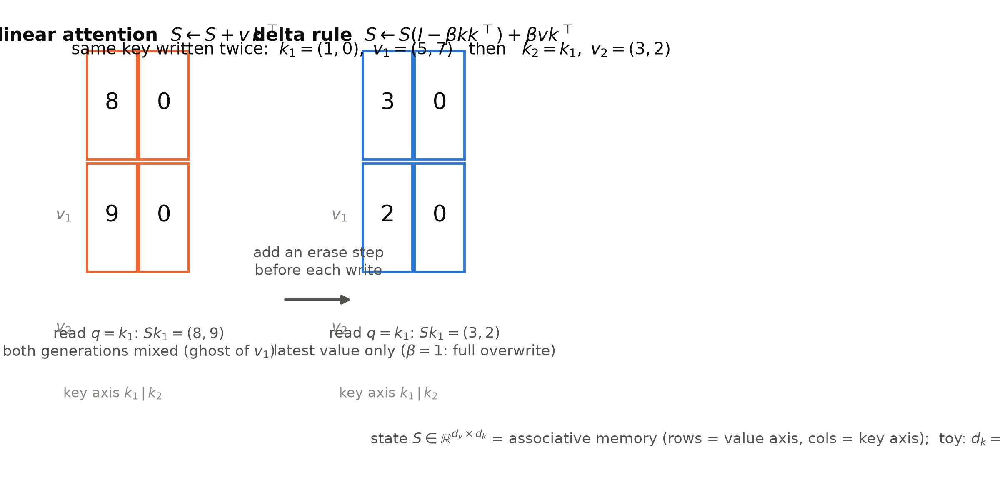
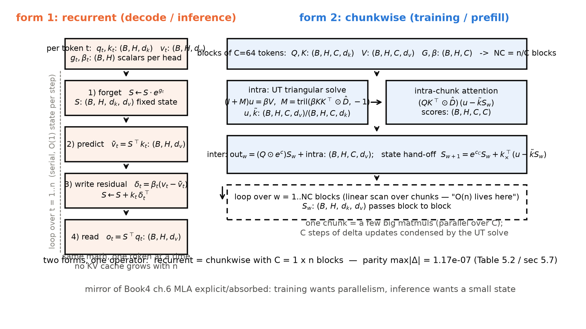
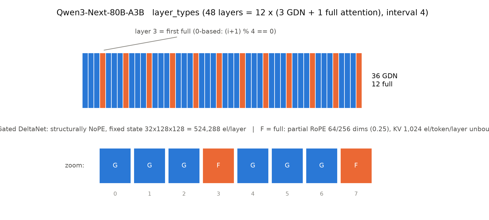
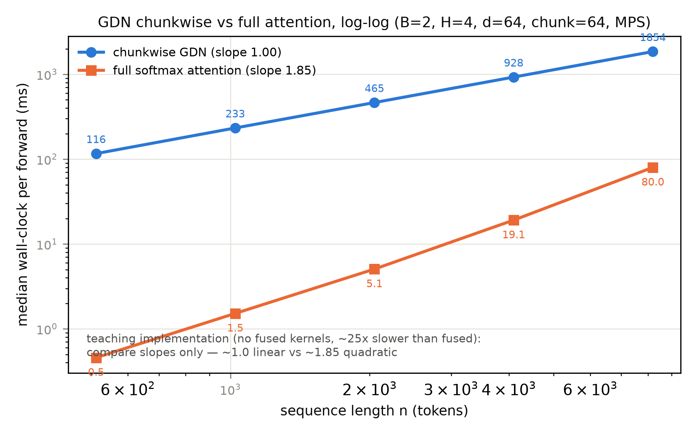

# 第 5 章 路线三：线性注意力——kernel、delta rule 与 Gated DeltaNet

## 5.0 开篇：从全书到这里

第 4 章合上时留了一句判词：「CSA/HCA 再省，每 token 对选中的条目做的仍是**精确 softmax 内积**，算子本体一步没动」。【第 4 章小结直引】三章走完的路线一与路线二，动的其实都是「跟谁比」：窗口裁短名单（第 2 章）、稀疏学出名单（第 3-4 章）——名单怎么来的故事讲完了，可名单上每一对 query 与 key 之间发生的还是 2017 年那场点积。本章动最后一把刀，也是改动最大的一把：**换掉「怎么比相似」本身**。第 1 章立起的通行证在此全额兑现——原典 §6.2 (B) 行那句 *"a more sophisticated compatibility function than dot product may be beneficial"*（比点积更精巧的兼容性函数可能有益），路线三整条路都修在这句口子上【Book1 第 11 章登记，F12】。

要回答的问题一句话：**把点积 softmax 整个换成一个固定维度的特征映射后，注意力还剩多少、省下多少、又欠下什么？**产出四样：一台双形态的 Gated DeltaNet（GDN，门控增量网络）教学件及其与 HF 的三方对拍（5.7 节全绿）、一张三家归一化口径对照表（5.4 节）、一本 Qwen3-Next 80B-A3B 的逐位参数账与状态账（5.5 节），以及一张斜率 1.00 对 1.85 的双对数实测图（5.7 节）。先埋一个贯穿全章的钩子：本书至此的所有 KV 账本都在算「每 token 多少」——本章将第一次出现**不管来多少 token 都只有这么多**的层。

> **最小背景栏**（只补本章所需，已学指回）：kernel 视角预科（相似度函数才是本体、elu+1 核首示）＝第 1 章 1.4 节；打分矩阵的平方账与分类型 KV/状态账本（含交叉点 $n^*$）＝第 1 章 1.2/1.6 节；KV 账本与 GQA＝Book3 第 6 章；MLA 的显式/吸收双形态＝Book4 第 6 章 6.6 节（本章双形态与它押韵，5.4 节点破）；MTP 层＝Book4 第 8 章；超稀疏 MoE 与激活参数口径＝Book4 第 2/1 章。新术语首现处给中英对照。

## 5.1 三刀合流处：换掉兼容性函数

把三把刀放回同一张手术台上看清分野。路线一改**视野**：mask 把参与集合裁成滑动邻域，算子原封不动。路线二改**参与集合**：NSA 三分支也好、DSA 单索引器也好，参与哪些 token 由打分选出——但选完之后，每一对 query-key 做的还是缩放点积加 softmax，精确、逐对、$O(n^2)$ 的那一场。两把刀都没碰过的东西，第 1 章 1.4 节已经命名：**相似度函数 $\kappa$（兼容性函数）才是注意力的本体，softmax 只是它最贵的一个成员**。路线三动本体：把 $\mathrm{softmax}(q^\top k/\sqrt{d_k})$ 这一整件退役，换成先变换、再内积的核 $\kappa(q,k)=\varphi(q)^\top\varphi(k)$。

这一换的机械后果立等可取：$n$ 个 key-value 不再逐对比较，而是**累加进一个固定大小的状态**——第 1 章图 1.1 里那条斜率 0 的账线。代价也直白：状态是压缩过的，精确检索做不到了。收益与代价的账要分开算三遍（复杂度账 5.4 节、参数与状态账 5.5 节、质量负结论 5.2 与 5.6 节）。

本章行进路线：5.2 节把 2020 年的第一批兑现（线性注意力）从 kernel 视角立起来——它解决「怎么省」，但留下一个「只加不减」的病；5.3 节用 delta rule（增量规则）治这个病——记忆变得**可覆写**；5.4 节给覆写记忆装上**遗忘门**并解决「串行没法训」的并行化难题，得到 GDN 的双形态；5.5 节上真机，把 Qwen3-Next 80B-A3B 的 48 层拆开对账；5.6 节一页速览与本路线同台竞争又彼此混编的另一族——SSM/Mamba；5.7 节本机验证。预先声明一条纪律（第 1 章立、本章兑现）：「线性 $O(n)$」这句话必须拆成两口径分报——**训练的并行形态线性于序列长、推理的递归形态每步与序列长无关**——笼统的「$O(n)$ 复杂度」一句话在本书禁用。

## 5.2 kernel 视角：先把「怎么比」换掉

第 1 章 1.4 节留了一扇门，现在走进去。注意力可以写成非参数核平滑（kernel smoother）的形式：输出是值的加权平均，权重由一个相似度核 $\kappa$ 给出——softmax 注意力就是这个家族里取 $\kappa(x,y)\propto e^{x^\top y}$ 的一款。这一视角由 Katharopoulos 等人从跨模态注意力工作（Tsai et al. 2019，MulT）引入后彻底展开【证据等级：官方论文 2006.16236 v3 §3.2；MulT 为转引级】。既然本体是核，就可以换核：取一个特征映射（feature map）$\varphi$，令 $\kappa(x,y)=\varphi(x)^\top\varphi(y)$。论文默认的 $\varphi$ 极朴素：

$$\varphi(x)=\mathrm{elu}(x)+1 \tag{5.1}$$

用人话说：elu 负区输出 $(-1,0)$、加 1 后整体抬进 $(0,\infty)$——一个保证非负的相似度核（论文要求 "a feature map that results in a positive similarity function"；选 elu 不选 ReLU 是为了负区梯度不归零）。接下来是全部复杂度收益的来源——**矩阵乘法结合律**。满注意力算 $(\varphi(Q)\varphi(K)^\top)V$：先展开 $n\times n$ 打分表再乘 $V$。但括号可以换位：

$$(\varphi(Q)\,\varphi(K)^\top)\,V \;=\; \varphi(Q)\,\underbrace{(\varphi(K)^\top V)}_{\text{先算右括号}} \tag{5.2}$$

用人话说：先让全部 key 与 value 互相「结算」成一个固定大小的状态，再让每个 query 去查状态——$n\times n$ 的表从头到尾没有物化过，计算量从 $O(n^2)$ 降到 $O(n\cdot d^2)$（$d$ 固定时线性于 $n$）。因果情形下右括号变成一个递推：每来一个 token，两个累加器各加一笔——

$$S_i=\sum_{j\le i}\varphi(k_j)\,v_j^\top\in\mathbb{R}^{d\times d_v},\qquad Z_i=\sum_{j\le i}\varphi(k_j)\in\mathbb{R}^{d} \tag{5.3}$$

$$o_i=\frac{\varphi(q_i)^\top S_i}{\varphi(q_i)^\top Z_i} \tag{5.4}$$

用人话说：$S$ 攒「键×值」的账、$Z$ 攒「键」本身的量，查询时分子给加权值、分母给总权重——一次地道的加权平均。**特别要盯住分母 $Z_i$：它没有丢**。不少转述把线性注意力写成「无归一化的裸核加权和」——这是常见误述，Katharopoulos 原文的因果递推（Eq.10-12）同时维护 $S_i$ 与 $Z_i$ 两个状态，输出带分母【证据等级：官方论文 2006.16236 v3，Eq.10-12】。分母的去向是本章的一条暗线：三家里谁带分母、分母挪到哪，5.4 节收成一张表。符号与形状：

| 符号 | 含义 | 形状 | 注 |
|---|---|---|---|
| $\varphi(\cdot)$ | 特征映射 | $\mathbb{R}^{d}\to\mathbb{R}^{d}$ | 式 (5.1)；逐元素 |
| $S_i$ | 关联记忆状态 | $(d,\,d_v)$，每头一份 | 与序列长无关 |
| $Z_i$ | 键累加器（分母） | $(d,)$，每头一份 | 与 $S_i$ 同步递推 |
| $q_i,k_j,v_j$ | 查询/键/值 | $(d,)/(d,)/(d_v,)$ | 每头每 token |
| $o_i$ | 输出 | $(d_v,)$ | 加权平均 |

状态与 $n$ 脱钩，是「线性注意力 = RNN」的机制正身——推理期常数内存、逐 token 递推，论文标题 "Transformers are RNNs" 的合法性来源；速度实证也来自论文：自回归生成最长做到约 4000 倍加速（CIFAR-10 上 17.85 对 0.004 张/秒）【证据等级：官方论文 2006.16236 v3，摘要与 Table 2】。

但换核不是免费的。softmax 的核 $e^{x^\top y}$ 对应的特征映射是**无穷维**的——论文原话点死："the exponential kernel's feature map is infinite-dimensional, which makes the linearization of exact softmax attention infeasible"（指数核的特征映射是无穷维的，精确 softmax 注意力的线性化不可行）【证据等级：官方论文 2006.16236 v3】。有限维的 $\varphi$ 必然磨掉 softmax 接近 argmax 的**锐度**：满注意力像显微镜，能把全部权重聚焦到单个细胞；线性注意力像染色剂，整片涂色、浓淡加权。这个直觉有定理级的判决书：固定大小潜在状态的模型族（含一切线性递归，**也含本章后面的 GDN——负结论对 delta 规则同样成立**）在复制任务上被证明劣于 Transformer——Repeat After Me 一文证明两层 Transformer 能复制指数长串而固定状态模型不能，实测 "transformers dramatically outperform state space models at copying and retrieving information from context"【证据等级：官方论文 2402.01032 v2】。加法记忆查不准——这是路线三的原罪；把这块短板任务化、可度量化的是 MQAR 基准（multi-query associative recall，多查询关联召回，Zoology 一文立）【证据等级：官方论文 2312.04927】，5.6 节混合谱系与第 9 章的「为什么旗舰都配全局层」都立在这条负结论上。

## 5.3 delta rule：可覆写的记忆

线性注意力解决了「贵」，但 5.2 节的递推式 (5.3) 有一个更隐蔽的病：**只加不减**。$S\leftarrow S+\varphi(k)v^\top$ 是一本只许往上记的流水账——同一个键写两次，两代的值叠在一起，旧墨迹永远洗不掉。语言任务里这恰恰致命：一个词的用法在上下文里会改写（「苹果」先是水果、后是手机），记忆必须能**更新**而非仅仅**追加**。Fast Weight Programmers（FWP，快速权重编程器）一文把这层批评写成了判词：模型应当 "dynamically interact with the memory contents and selectively decide which key-value associations to keep and which ones to delete"，而 "The purely additive instruction may be inappropriate for this purpose"（纯加法指令对此并不合适）【证据等级：官方论文 2102.11174 v3】。FWP 同时把这套数学与九十年代初 Schmidhuber 的快速权重思想接上血缘——谱系半句即可，正菜是它的更新式。

先把这个病在纸面上走一遍。

> **例 5.1（构造例：同键双写——累加 vs 覆写）** 设 $d_k=d_v=2$、键值归一已含在构造里。第一笔：$k_1=(1,0)$，$v_1=(5,7)$；第二笔：$k_2=k_1$（同一个键又来一次），$v_2=(3,2)$。
> 1. **线性注意力（式 (5.3) 的累加，统一转置到值行键列）**：第一写 $S\leftarrow v_1k_1^\top=\begin{pmatrix}5&0\\7&0\end{pmatrix}$（输入 $S{=}0,v_1,k_1$ → 输出 $S\in\mathbb{R}^{2\times2}$）；第二写 $S\leftarrow S+v_2k_1^\top=\begin{pmatrix}8&0\\9&0\end{pmatrix}$。读：$Sk_1=(8,9)$。
> 2. **delta rule**：第一写同上得 $S=\begin{pmatrix}5&0\\7&0\end{pmatrix}$；第二写**先读后写**——预测 $\bar v=S k_2=(5,7)$（输入 $S,k_2$ → 输出 $(d_v,)$），残差 $\delta=v_2-\bar v=(-2,-5)$，写入 $S\leftarrow S+\delta k_2^\top=\begin{pmatrix}3&0\\2&0\end{pmatrix}$。读：$Sk_1=(3,2)$。
> 3. 对照读法：同一个键、两次不同的值——累加器交出 $(8,9)$（两代混叠），覆写器交出 $(3,2)$（最新值）。「可覆写的记忆」一词之差，全在这两条读数里。（$\beta{=}1$ 的满额覆写；一般 $\beta$ 控制成数。）

图 5.1 把这两条读数画成两张 $2\times2$ 的记忆格。写成一般式（记号从这节起换到 delta 族论文正字：$S\in\mathbb{R}^{d_v\times d_k}$，**行=值、列=键**——与式 (5.3) 的键为行互为转置，同一张记忆的两种摆放）：



图 5.1 线性注意力 vs delta rule 的状态更新对照（自绘，数据=例 5.1）：同一把键写两次，左=累加（两代混叠 $(8,9)$），右=先删旧再写新（最新值 $(3,2)$）。出处：[`code/ch05/fig_ch05.py`](code/ch05/fig_ch05.py)

$$S_t \;=\; S_{t-1}\big(I-\beta_t\, k_t k_t^\top\big)\;+\;\beta_t\, v_t k_t^\top,\qquad \beta_t=\sigma(W_\beta x_t)\in(0,1) \tag{5.5}$$

用人话说：写新行之前，先把**同一把键上的旧行按 $\beta$ 成数划掉**，再记上新的——$\beta$ 是写强度（write strength，新信息按几成入账），FWP 自评「effectively a delta rule with a dynamic learning rate $\beta$」（等效于学习率动态可变的 delta 规则）【证据等级：官方论文 2102.11174 v3，Eq.24 及自评句】。DeltaNet 这个名字就出生在这篇论文里（"We refer to the Linear Transformer with our delta update rule as a Delta Network"），不是后来那篇并行化论文。顺路收下 FWP 给 kernel 菜单添的第二道菜：DPFP 核 $\varphi_i(k)=r([k;-k])_i\cdot r([k;-k])_{i+\nu}$（$r$=ReLU，$\nu\in\{1,2,3\}$ 把状态宽 $d_{\mathrm{dot}}=2\nu d_{\mathrm{key}}$ 抬到 128-384）——F12 通行证的又一张配菜。

覆写治了「洗不掉」，治不了「装不下」。容量上限是维度给的：键落在 $d_{\mathrm{dot}}$ 维空间，正交方向至多 $d_{\mathrm{dot}}$ 个——"With keys embedded in a ddot space, there cannot be more than ddot orthogonal vectors"，存更多关联就会互相污染（过容量态）【证据等级：官方论文 2102.11174 v3】。这与 5.2 节 Repeat After Me 的定理是同一条根的两个证法：一个是容量论证、一个是电路复杂度论证，合起来的判词——**固定状态家族有地板，地板的高度由状态维度决定**。后来 Based 一文把「状态大小换检索能力」做成可度量的权衡前沿，正是这条判词的实验版【证据等级：官方论文 2402.18668 v2，摘要】。

还剩一个工程级的死结：式 (5.5) 没法并行训练。线性注意力的结合律之所以成立，是因为 $\varphi(k)v^\top$ 的增量和 $S$ 之间只有加法——加法有结合律。而 delta 更新每步都带一个**依 token 而变**的删除算子 $I-\beta_tk_tk_t^\top$：$S_T=S_0\prod_t(I-\beta_tk_tk_t^\top)(\cdots)$，乘积里每一项都含数据，没有公因子可提，结合律失效。朴素训练只能逐步递推——序列多长就串行多少步，且逐步是小矩阵外积、喂不饱现代加速器。DeltaNet 并行化一文（2406.06484）给了正解：这类秩一修正的连乘可以打包成低秩表示（WY 表示，Householder 反射的软比例版一族），块内一次矩阵运算解出【证据等级：官方论文 2406.06484 v6，摘要】。推导细节 5.4 节随 GDN 正面展开。收尾前再立一块路标——delta 族在数学上还有一个更深的读法：线性注意力=不做遗忘的在线学习；DeltaNet=对重构损失 $\frac{\beta_t}{2}\lVert \tilde S_{t-1}^\top k_t-v_t\rVert^2$ 做在线梯度下降（式 (5.5) 恰是一步 SGD）；GDN 再加数据依赖的衰减=给快速权重挂 L2 正则【证据等级：官方论文 2510.26692 v2，§2.2 与 Table 7】。「记忆更新=优化器步」这层身份，第 6 章读 K3 报告时还会回来。

## 5.4 Gated DeltaNet：两把旋钮，两种形态

现在把三样零件装成一台整机：线性注意力的固定状态、delta rule 的可覆写、再加一个**遗忘门**——Gated DeltaNet（GDN，arXiv:2412.06464 v3，标题正字 "Gated Delta Networks: Improving Mamba2 with Delta Rule"）。核心更新式（论文 Eq. 10）逐符号过一遍——它维护的还是那张关联矩阵记忆（associative memory）：

$$S_t \;=\; S_{t-1}\big(\alpha_t\,(I-\beta_t\, k_t k_t^\top)\big)\;+\;\beta_t\, v_t k_t^\top \tag{5.6}$$

| 符号 | 含义 | 形状 | 注 |
|---|---|---|---|
| $S_t$ | 关联矩阵记忆 | $(d_v,\,d_k)$，每头一份 | 行=值、列=键；固定大小 |
| $\alpha_t$ | 衰减门（删除门） | 标量，每头每 token | $\in(0,1)$，乘在**整个旧状态**上 |
| $\beta_t$ | 写强度 | 标量，每头每 token | $\in(0,1)$（脚注允许到 2） |
| $k_t,v_t,q_t$ | 键/值/查询 | $(d_k,)/(d_v,)/(d_k,)$ | 论文取向；$o_t=S_tq_t$ |

用人话说：整本记忆先按 $\alpha_t$ 打折——旧的集体淡出；再在 $k_t$ 这个词条上按 $\beta_t$ 冲销重记 $v_t$。与式 (5.5) 相比只多了一个乘在全局的 $\alpha_t$，但它补的正是 delta 族一直缺的**时间方向**的遗忘：$\beta$ 管「这一笔按几成冲销重记」（内容方向），$\alpha$ 管「隔多久整本翻新」（时间方向）——两把旋钮各拧一个轴。论文的互补性判词："gating enables rapid memory erasure while the delta rule facilitates targeted updates"（门控负责快速擦除，delta 规则负责定向更新）【证据等级：官方论文 2412.06464 v3，摘要】。$\alpha$ 的参数化论文只留了句脚注「We use Mamba2's parameterization for α but omit it for brevity」——正身在 Mamba-2 一脉（5.6 节速览）：

$$g_t=-\exp(A_{\log})\cdot\mathrm{softplus}(a_t+\Delta_t)\;\le 0,\qquad \alpha_t=e^{g_t} \tag{5.7}$$

用人话说：衰减率在 log 空间由网络现算、恒非正——保证 $\alpha_t$ 是个 $(0,1)$ 的折扣系数。实装里 $A_{\log}$ 初始化取 $\log U(0.01,16)$，下界离开 0 是防 $\log A$ 掉进 $-\infty$【证据等级：官方论文 2412.06464 v3 脚注 4 + transformers 5.18.0 源码注释】。两把旋钮不是摆设，GDN 论文自己的检索三连表（1.3B、100B token 训练档）把「缺哪把哪边塌」拍在桌上：

| S-NIAH 任务 | DeltaNet（只有 $\beta$） | Mamba2（只有门） | GDN（双旋钮） |
|---|---|---|---|
| 单针 8K | **98.8** | 30.4 | 91.8 |
| 多针 4K | 18.6 | 56.2 | **92.2** |
| 值检索 4K | 22.4 | 4.6 | **27.6** |

【证据等级：官方论文 2412.06464 v3，Table 2】无门控的 DeltaNet 长序列旧账洗不掉、多针崩（18.6）；只有乘性门、无精确改写的 Mamba2 单针就崩（30.4）；两门齐备的 GDN 最均衡。同一张表的更狠一行留给混合：纯 GDN 的真实检索均值 30.6，掺入注意力层的 H1/H2 混合跳到 39.0/40.1——**双旋钮缓解、但不消除固定状态的地板**，这个 +9 分的缺口是「线性层之上为何还要全局层」的第一份论文级证据（5.6 节收链）【证据等级：官方论文 2412.06464 v3，Table 4】。

输出侧只做一件事：$o_t=S_tq_t$——**没有逐 token 的分母**（递推层面不存在式 (5.4) 那样的 $q^\top z$ 项）；归一化与门控挪到**块级输出**处（承 RetNet 一脉的 gated RMSNorm：输出过 RMSNorm 再乘 $\mathrm{silu}(z)$ 门，$z$ 是与 $v$ 同宽的第四路投影）。q/k 另做 L2 归一化稳训练（论文："with L2 normalization applied to q, k for training stability"，$v$ 不归一）【证据等级：官方论文 2412.06464 v3】。至此三家归一化口径可以收成表 5.1——同一条「换核」路线上，分母的处理三家用三种方式，恰是「各论文 kernel 归一化处理不统一」的教材级对照：

表 5.1 三家归一化口径对照（谁在除、在哪除）

| 家族 | 检索时分母 | 归一化落点 | 证据锚 |
|---|---|---|---|
| 线性注意力（Katharopoulos） | **有**：$Z_i=\sum\varphi(k)$，$o=\varphi(q)^\top S/\varphi(q)^\top Z$ | 检索时逐 token（加权平均语义） | 2006.16236 v3 Eq.10-12 |
| GDN | **无** | 块级输出 gated RMSNorm（$z$ 门，SiLU） | 2412.06464 v3 + HF 源码 |
| KDA（第 6 章正身） | **无**（chunkwise 分数是裸的衰减加权内积，不过 softmax） | 输出侧 head-wise RMSNorm + Sigmoid 数据依赖门 | 2510.26692 v2 Eq.9/10 |

（脚注一家：Kimi Linear 参考实现把 $q$ 预乘 $d_k^{-1/2}$——两路输出项都随 $q$ 线性缩放、被输出 RMSNorm 整体吸收，不构成第四种口径【证据等级：官方论文 2510.26692 v2，附录 C】。第三家的「无分母」是批二精读钉死的：chunkwise 分数矩阵是衰减蒙版下的裸内积，与 GDN 同型。）

**双形态**——机制讲完了，回到 5.3 节末尾那个死结：式 (5.6) 串行没法训。GDN 的答案与 DeltaNet 并行化同族：把序列切成宽 $C$（默认 64）的块，**块内并行、块间递推**。块内那一步是全部巧思所在：$C$ 个 token 的 $C$ 次顺序冲销，可以折叠成解一个 $C\times C$ 的单位下三角线性方程组——UT 变换（unit-triangular transform，WY 表示的带门版；谱系四步：WY 表示→UT→DeltaNet 并行化→GDN 门控版，逐环有原文）：

$$(I+M)\,u=\beta V,\qquad M=\mathrm{tril}\big(\beta\,KK^\top\odot\hat D,\,-1\big) \tag{5.8}$$

用人话说：在块内解一个「谁冲销了谁」的三角方程，**一次解出全部 $C$ 步要写的增量** $u$——把逐步递推改写成矩阵乘。$\hat D_{ij}=\exp(c_i-c_j)$ 是块内累积衰减 $c=\mathrm{cumsum}(g)$ 的两两比值（位置 $i$ 的查询看位置 $j$ 的写入时，中间隔着的衰减要补上）；$M$ 是「后面的 token 冲销前面的 token」的强度矩阵，严格下三角=因果。块内输出=跨块读老状态 + 块内小注意力（喂的不是 $V$ 而是**冲销后的新值** $u-\tilde kS_w$），块间把状态 $S_w$ 递推传下去（先忘后写的块级版）：

$$\mathrm{out}_w=(Q\odot e^{c})\,S_w+(\hat D\odot QK^\top)(u-\tilde k\,S_w),\qquad S_{w+1}=e^{c_C}S_w+k_\times^\top(u-\tilde k\,S_w) \tag{5.9}$$

用人话说：每个块的输出=「带着衰减滤镜问上一块传来的老状态」加「块内一场喂着冲销后新值的小注意力」；块与块之间只传那一张 $S$（先整体按 $e^{c_C}$ 打折、再叠本块新写）——递推没有消失，只是从「每 token 一步」变成了「每块一步」，块内那一步是矩阵乘、可以并行。

先在纸面上把 UT 求解跑给你看——它不是抽象，就是例 5.1 的覆写算术批发版：

> **例 5.2（构造例：单块 4-token 的 UT 手算）** 取 $C=4$、$d_k=1$、四把键全同 $k=1$、$g=0$（无衰减，$\hat D$ 全 1）、$\beta=1$、$V=(5,3,8,2)$、初始 $S_0=0$。此时 $M_{ij}=1\,(i{>}j)$，$I+M=\begin{pmatrix}1&0&0&0\\1&1&0&0\\1&1&1&0\\1&1&1&1\end{pmatrix}$。前代法解 $(I+M)u=V$（输入 $M,V$ → 输出 $u\in\mathbb{R}^4$）：$u_1=5$；$u_2=3-5=-2$；$u_3=8-(5-2)=5$；$u_4=2-(5-2+5)=-6$。得 $u=(5,-2,5,-6)$。
> 效果读法：**这四个数恰是逐步递推会写下的四个残差**——串行做时：$S{:}0\to5\to3\to8\to2$，每步残差正是 $(5,-2,5,-6)$；块内读出 $o_i=\sum_{j\le i}u_j$（同键情形）$=(5,3,8,2)$，与串行逐步读数逐位相同。一次三角求解=四步递推，「批发」与「零售」卖的是同一批货。

两种形态于是摆出来了，先看工程正身再上形状表。HF transformers 5.18.0 的 `qwen3_next` 里，双形态是两个纯 torch 参考内核（融合 kernel 可用时自动替换，本机无 FLA 恒走 torch 版——正好可对拍）：

> **实物 5.1（HF 源码摘录，看什么：递推四步的原文——先忘、读、写残差、读出）** transformers 5.18.0 `modeling_qwen3_next.py::torch_recurrent_gated_delta_rule` L557-568（本地浅克隆 `repos/transformers`，与安装版本同源；docstring 自述 "Computes linear attention using the gated delta rule, **by iterating over each token**"；chunkwise 版 L378 起同名 `torch_chunk_gated_delta_rule`，docstring "by **chunking along the sequence dimension**"）：
> ```python
> for i in range(sequence_length):
>     q_t, k_t, v_t = query[:, :, i], key[:, :, i], value[:, :, i]
>     # Decay the recurrent state
>     decay_t = decay[:, :, i].exp()[..., None, None]
>     last_recurrent_state = last_recurrent_state * decay_t
>     # Update the recurrent state with the current token
>     beta_t = beta[:, :, i].unsqueeze(-1)
>     kv_mem = (last_recurrent_state * k_t.unsqueeze(-1)).sum(dim=-2)
>     delta = (v_t - kv_mem) * beta_t
>     last_recurrent_state = last_recurrent_state + k_t.unsqueeze(-1) * delta.unsqueeze(-2)
>     # And use it to compute the attention output for the current token
>     core_attn_out[:, :, i] = (last_recurrent_state * q_t.unsqueeze(-1)).sum(dim=-2)
> ```
> 状态形状 $(B,H_v,d_k,d_v)$（键轴在前——与论文记号互为转置，读写各是一次收缩）；四步与式 (5.6) 逐行对得上：先忘（decay）→读（kv_mem）→写残差（delta）→读出。【证据等级：官方源码（transformers 5.18.0，行级锚）】

层模块的全貌（Qwen3-Next 实装口径，图 5.2 左右两栏即它的两条执行路径）：隐状态 $x\in(B,n,d)$ 经融合投影 `in_proj_qkvz` 得 $q,k,v,z$ 四路（$z$ 专供输出门）、`in_proj_ba` 得 $\beta,\alpha$ 的原始激活，$q/k/v$ 三路过一道**因果短卷积**（核宽 4、depthwise、SiLU——GDN 层唯一的局部窗口，别与路线一的滑窗混），再进双形态内核任一，输出过 gated RMSNorm（$z$ 门）与 `out_proj` 回 $(B,n,d)$。两条路径的形状流转逐行对齐（表 5.2；实现在 MPS/CPU 上的实测与三方对拍见 5.7 节）：

表 5.2 GDN 双形态形状流转表（单头口径，$H{=}h_v$；B=批、n=序列长、NC=n/C 为块数；实现取向 $S:(d_k,d_v)$）

| # | 形态一：recurrent（推理/解码） | 形状 | # | 形态二：chunkwise（训练/prefill） | 形状 |
|---|---|---|---|---|---|
| 1 | 投影+短卷积+GQA 展开 $q,k$（$h_v{:}h_k{=}2{:}1$） | $(B,n,H,d_k)$ | 1 | 同左（形态共享前端） | $(B,n,H,d_k)$ |
| 2 | 门：$g=-e^{A_{\log}}\mathrm{softplus}(a{+}\Delta)$、$\beta=\sigma(b)$ | $(B,n,H)$ | 2 | 同左 | $(B,n,H)$ |
| 3 | 逐步 $t$：先忘 $S\!\cdot\!e^{g_t}$ | $(B,H,d_k,d_v)$ | 3 | 块化 $Q,K,V,\beta,g$（pad 到 $C$ 倍数） | $(B,H,\mathrm{NC},C,d_{k/v})$ |
| 4 | 预读 $\bar v_t=S^\top k_t$ | $(B,H,d_v)$ | 4 | UT 三角求解 $u,\tilde k$（式 (5.8)） | $(B,H,\mathrm{NC},C,d_v)/(…,d_k)$ |
| 5 | 写残差 $S+k_t\delta_t^\top$ | $(B,H,d_k,d_v)$ | 5 | 块内小注意力 $(\hat D\odot QK^\top)(u-\tilde kS_w)$ | $(B,H,C,d_v)$ |
| 6 | 读出 $o_t=S^\top q_t$ | $(B,H,d_v)$ | 6 | 跨块读 $(Q\odot e^c)S_w$ 相加 | $(B,H,C,d_v)$ |
| 7 | 每 token 成本 $O(d_kd_v)$，**状态与 $n$ 无关** | — | 7 | 块间递推 $S_{w+1}=e^{c_C}S_w+k_\times^\top(\cdot)$，扫描 $\mathrm{NC}=n/C$ 步 | $(B,H,d_k,d_v)$ |
| 8 | 输出过 gated RMSNorm（$z$ 门）+ out_proj | $(B,n,d)$ | 8 | 同左（形态共享后端） | $(B,n,d)$ |



图 5.2 GDN 双形态数据流（自绘·示意级，张量框标形状）：左=recurrent 逐步递推（先忘→预读→写残差→读出，状态固定）；右=chunkwise 块内 UT 三角求解并行+块间线性扫描。两形态数学等价（表 5.2 的两条路，5.7 节对拍 1.17e-07）。出处：[`code/ch05/fig_ch05.py`](code/ch05/fig_ch05.py)

这张表必须与 Book4 第 6 章的表 6.1 并排读——**同一种辩证法的两次登场**：MLA 的显式上投影与权重吸收是「同一算子的两种矩阵结合序」（训练物化、推理吸收），GDN 的 recurrent 与 chunkwise 是「同一算子的两种调度」（推理逐步、训练分块）——训练要并行、推理要省，两头都要，于是每个现代线性层都长成双形态。要把三者的等价对象分清（防止糊成一团）：MLA 换的是**结合序**、GDN 换的是**调度**、Mamba 换的是**同一状态方程的解法**（5.6 节）。复杂度账按纪律分两口报：**训练（chunkwise）**每块成本=UT 求解 $O(C^2d)$+块内注意 $O(C^2d_k)$+状态读写 $O(Cd_kd_v)$，全程对 $n$ 线性（$C$ 是常数）；家族 FLOPs 正身 $6Td_h^2+3TCd_h+TC^2$（单头、$C{=}64$）【证据等级：官方论文 2510.26692 v2 §6.3 Eq.13】。**推理（recurrent）**每 token 每头 $O(d_kd_v)$、状态固定 $d_k{\times}d_v$——与满注意力每 token $O(n)$ 读写、$O(n)$ 状态增长对照。「线性 $O(n)$」在两口径下各说各的，不混。

## 5.5 上真机：Qwen3-Next 80B-A3B 的 config 逆向

机制在手，上一台把它装进 80B 的机器。Qwen3-Next（2025-09，Apache-2.0）的 README 用一句话交代整机：**"Hybrid Layout: 12 \* (3 \* (Gated DeltaNet -> MoE) -> 1 \* (Gated Attention -> MoE))"**【证据等级：厂商自报（官方 README 直引）】。config 里没有逐层数组，只有一个整数：`full_attention_interval: 4`——层类型由规则展开，$(i+1)\bmod 4=0$ 的层（0 起索引 3,7,…,47）为全局注意力，48 层由此分成 **36 层 GDN + 12 层全局**（图 5.3；本机断言与 README 的 12 组严格一致）。每格 MoE：512 选 10 加共享专家——2% 激活的超稀疏几何承 Book4 第 2 章，本章只算账。



图 5.3 Qwen3-Next 80B-A3B 层模式图（自绘，config 驱动）：48 层=12×(3 GDN+1 全局)；GDN 层结构级 NoPE、固定状态 524,288 元素/层；全局层 partial RoPE 64/256 维、KV 1,024 元素/token/层无界。出处：[`code/ch05/fig_ch05.py`](code/ch05/fig_ch05.py)

三个层级事实先钉死。**其一，GDN 超参**：`linear_num_key_heads=16`/`linear_num_value_heads=32`——键头 16、值头 32，**V:K 头数比 2:1**（两个值头共享一组 QK，GDN 里的 GQA），$d_k=d_v=128$，每层固定状态 $32\times128\times128=524{,}288$ 元素；前置短卷积核宽 4。chunk 宽 64 不在 config 里——它是 kernel 的调度参数，不是架构参数。**其二，位置编码按层分型（两处易错，先钉死）**：全局层**不是 NoPE**，是 partial RoPE（部分旋转位置编码）——`partial_rotary_factor: 0.25`，256 维头只旋前 64 维、$\theta=10^7$；GDN 层则根本不消费位置输入（源码里 linear_attention 分支不接收 `position_embeddings`）——**结构级 NoPE**。「Qwen3-Next 用 NoPE」的笼统说法两边都错：全局层旋得少、线性层压根不旋；这行事实是第 8 章「位置哲学」双档样本的预存【证据等级：config 逆向 + transformers 5.18.0 源码】。**其三，全局层带门控注意力**：`q_proj` 输出宽 $2\times$（查询+逐维 sigmoid 门），输出乘门后再投影——与 GDN 输出端的 $z$ 门两侧呼应，都承「输出乘性门」一脉。

参数账（表 5.3）——config 公式逐位自算，meta device 双向 assert（全尺寸 80B 只建模块树、零内存分配，Book4 第 10 章手艺）：

表 5.3 Qwen3-Next 80B-A3B 参数账逐项（元素数；本机公式=meta 实测逐位相等，2026-10）

| 部件（×层数） | 逐项（元素数） | 小计/层 |
|---|---|---|
| 全局注意力层 ×12 | q_proj（含输出门，$2{\times}16{\times}256{\times}2048$）16,777,216 + k/v 各 1,048,576 + o_proj 8,388,608 + QK-Norm 512 | 27,263,488 |
| GDN 层 ×36 | in_proj_qkvz 25,165,824 + in_proj_ba 131,072 + conv1d 32,768 + $A_{\log}$/dt 64 + norm 128 + out_proj 8,388,608 | 33,718,464 |
| MoE 层 ×48 | router 1,048,576 + 512 专家×3,145,728 + 共享专家 3,145,728 + sigmoid 门 2,048 | 1,614,809,088 |
| 嵌入（untied 双份）/双 norm+final | $151{,}936{\times}2048{\times}2$ / $48{\times}2{\times}2048{+}2048$ | 622,329,856 / 198,656 |
| **合计（48 层）** | | **79,674,391,296 ≈ 79.67B** |
| checkpoint 的 MTP 模块（config 外） | fc+注意力+norm+MoE | 1,650,471,424 |
| （对账）48 层+MTP = 分片索引 total_size/2 | | **81,324,862,720，逐位闭合** |
| **激活·非嵌入**（每 token 动用） | 12×全局 + 36×GDN + 48×(router+10 专家+共享+门) | **3,252,400,896 ≈ 3.25B** |

【证据等级：本书复算（config 公式+meta device+官方分片索引三向对账）】三口径对平 README：总参 79.67B 对「80B」、非嵌入 79.05B 对「79B non-embedding」、激活 3.25B 对「A3B」（激活只报计算账、嵌入双份归容量账——Book4 第 1 章的单双份判定法再一次使用）。表里那行 MTP 值得多看一眼：HF 的 config 与建模类里**没有** MTP，但 checkpoint 分片索引里躺着整套 `mtp.*` 键——把它按公式补齐后，与索引总账**逐位闭合**到 81,324,862,720。「config 之外的 checkpoint 里还有什么」这门手艺（Book4 第 10 章分片头审计）在这里又一次兑现；MTP 机制指回 Book4 第 8 章，第 6 章会看到 K3 的镜像案例（那边是 config 有、checkpoint 无）。

最后记状态账（第 1 章式 (1.3) 的 Qwen3-Next 行）：GDN 36 层固定 $36\times524{,}288=18{,}874{,}368$ 元素、外加卷积状态 $36\times24{,}576=884{,}736$——两者都与 $n$ 无关；全局层 12 层每 token 增 $1{,}024$ 元素、无界。交叉点（式 (1.4)）：$n^*=36\times524{,}288/(1{,}024\times12)=1{,}536$——上下文一过 1.5K，36 层 GDN 的全部固定状态就开始比 12 层全局层的 KV 少，且差距随 $n$ 线性拉大。效率宣称照例自报口径：对 Qwen3-32B "10 times inference throughput for context over 32K tokens"、训练成本 "10% of the total training cost"，README 自带 caveat "depends highly on the implementation"【证据等级：厂商自报】；原生 262,144 上下文、YaRN×4 外推到 1,010,000——外推机制归第 8 章主场（Book3 第 7 章已教）。

## 5.6 一页速览：SSM 与 Mamba，另一条线性化路径

线性层插槽里还住着另一族：状态空间模型（SSM，state space model）。一页讲清它与本路线的关系。S4（2021）把控制论的状态方程离散化后沿序列演化——结构化状态、HiPPO 类初始化，一句话定位【证据等级：官方论文 2111.00396 v3，谱系级】。Mamba（2023）的关键一步是**选择性**（selectivity）：让状态方程的参数成为输入的函数，模型得以 "selectively propagate or forget information along the sequence length dimension"（沿序列长度方向选择性传递或遗忘信息）【证据等级：官方论文 2312.00752 v2，摘要】——内容相关的门进来了，代价是时不变结构破功、卷积形式失效，训练靠 "hardware-aware parallel algorithm that runs in recurrent mode"（硬件感知的并行算法、以递归模式运行）——**双形态辩证法的第三次登场**（这次换的是同一状态方程的解法）。Mamba-2/SSD 把 SSM 与注意力变体放进同一个「结构半可分矩阵」对偶框架，GDN 的 $\alpha$ 参数化正是从 Mamba-2 直接继承的（式 (5.7)）——GDN 论文标题里 "Improving Mamba2 with Delta Rule" 说的就是这层血缘：**Mamba-2 的门 + DeltaNet 的改写**【证据等级：官方论文 2405.21060 v1；2412.06464 v3】。两族的分野收进表 5.4——一行记住：SSM 是固定演化结构的状态（时间维压缩），DELTA 是内容寻址的关联记忆（键值维压缩），两条线性化路径在 2026 混合架构里同台、层位可互换：

表 5.4 SSM 与 delta rule 族对照（两条线性化路径，在 2026 混合架构里同台可互换位）

| 维度 | SSM/Mamba | 线性注意力/DeltaNet 族 |
|---|---|---|
| 状态 | $N{\times}d$ 通道记忆（对角/结构化 $A$） | $d_k{\times}d_v$ 关联矩阵（全秩可用） |
| 演化 | **固定结构的状态演化**（$A/B/C$ 参数化，内容经选择门调制）——时间维压缩 | **内容寻址的关联记忆**（$k$ 决定写哪、$q$ 决定读哪）——键值维压缩 |
| 写入 | 隐式（状态方程积分） | 显式外积+（delta 族）显式冲销 |
| 位置观 | 递推天然时序 | 核相似度、结构级 NoPE 亲和 |
| 血统 | 控制论/HiPPO（F12 之外的门） | fast weight/kernel smoother（F12 正裔） |

混合架构的线性谱系一行带走：Jamba（AI21，2024-03）是首个大规模商用的 Transformer+Mamba 混合（具体比例与规模数字转引级，引用前需回论文正文核句，此处不引）【证据等级：转引级】；NVIDIA 的 8B 实证研究给出混合配方最强第三方证据——约 6:1 的 Mamba-2 混合在 12 项基准全胜同预算 Transformer（+2.65 分），纯 SSM 则在复制与上下文学习类任务落后【证据等级：官方论文 2406.07887 v1】；Falcon-H1（2025，arXiv:2507.22448）走并联式（注意力头与 Mamba 头同层混编）；**Kimi Linear**（Moonshot，2025-10）是 KDA 的命名出处与首台 48B 整机——注意它与 K3 不是一件东西：Kimi Linear 是 48B-A3B 模型线，K3 是把同一个 KDA 模块装进 2.8T 的整机线，两家论文互证但数字严禁互相挪用（第 6 章展开）。至此「为什么保留全局层」的论文级论证链凑齐：DeltaNet 混合实验超基线 → GDN H1/H2 混合 +9 分 → NVIDIA 6:1 净胜 → Based 权衡前沿——四环都指向同一句：**保留少量注意力层不是妥协，是净胜**；3:1 不是 Qwen 一家的口味，是这条证据链的工程收敛点（第 9 章谱系表总收）。

## 5.7 本机双形态实验：对拍驱动开发

公式写完不算数，上机。[`ch05/gdn.py`](code/ch05/gdn.py) 实现双形态算子（`gdn_recurrent`/`gdn_chunkwise`）与层模块（`GatedDeltaNet`，`forward(path=...)` 一键切形态），[`ch05/qwen3next_mini.py`](code/ch05/qwen3next_mini.py) 实现键位对齐 HF 的整机缩玩具。两件都遵循 Book4 期立的工序（noaux 符号教训）：**先静态互证、再跑数值**——写码前把五条口径与文献/HF 逐项核对（先忘后写的顺序、l2norm 的位置、$\beta$ 乘在 $k$ 与 $v$、UT 解的是 $(I+M)$、块衰减乘三处），落盘后才允许跑对拍。

「对拍驱动开发」不是口号，是被咬过的人才有的纪律。首版 chunkwise 把 UT 系统写成 $(I-M)^{-1}$——三角求解解的是 $(I+M)X=b$，一字之差整个块内冲销方向反了；这个错**看代码看不出来**（形状全对、能跑、不炸），是被与 HF 内核的对拍当场按住的（连同状态更新 einsum 收缩轴的另处笔误，两处都是对拍抓的）。又一次工程课：显式求逆在 MPS 上比三角求解慢约 40 倍，正解是 `solve_triangular(unitriangular=True)`——不显式求逆，前代法直接解。两个教训合并成一句：**读无论文机制的正确姿势是让对拍替你读**（第 11 章方法论还会回收这句话）。

三方两两对拍（CPU fp32、种子 20261002、含非零初始状态与终态状态级对拍，[`gdn.py::parity_hf`](code/ch05/gdn.py#L221)）：

| 对拍项 | max\|Δ\|（输出/状态） |
|---|---|
| 自研 recurrent vs HF `torch_recurrent_gated_delta_rule` | **1.72e-08** / 5.96e-08 |
| 自研 chunkwise vs HF `torch_chunk_gated_delta_rule` | **2.24e-08** / 1.19e-07 |
| 双形态互拍（recurrent vs chunkwise） | **1.17e-07** / 4.47e-07 |
| 层模块 path=chunk vs path=recurrent | 4.84e-08 |

【证据等级：本书实验（CPU fp32，2026-10，`log/book5-ch05/gdn_run1.json`）】四行全绿的含义分层读：前两行是「与 golden truth 逐位」；第三行最有分量——**同一层、同一权重、同一输入，两条调度给出同一个答案**，这就是表 5.2 与图 5.2 声称的「数学等价」的实测版（Book4 第 6 章 MLA 双路径互拍的 GDN 版）。scaling 实测（图 5.4，MPS、$B{=}2/H{=}4/d{=}64/C{=}64$、10 次取中位）：双对数斜率 **chunkwise 1.00、满注意力 1.85**——线性对二次，肉眼证据（调研期探针档 1.02/1.86 复现同结论）。纪律如实报：本机无融合 kernel，教学实现绝对值慢约 25 倍（图内 116 ms 对 0.5 ms 起步），**只看斜率、不下绝对速度结论**；「$O(n)$」按 5.4 节双口径分报。



图 5.4 chunkwise GDN 与满注意力 wall-clock 双对数（自产，MPS 实测；数据=`log/book5-ch05/gdn_run1.json`）：斜率 1.00 对 1.85——训练并行形态线性于 $n$、满注意力二次。出处：[`code/ch05/fig_ch05.py`](code/ch05/fig_ch05.py)

整机这一级是「strict 直搬」考试：自研缩玩具（4 层 [3 GDN+1 全局]、MoE 8 选 2 加共享）与 `Qwen3NextForCausalLM` 同 config 随机权重互相 `load_state_dict(strict=True)`。键位六坑各一行（预研期逐个排掉，`qwen3next_mini.py` 头部有注释正身）：**K1** 交错头排布——HF 的 `in_proj_qkvz` 输出按 K 头交错切 $[q,k,v,z]$，不是连续四段；**K2** 两个 RMSNorm 不同构——层 norm 是 $(1{+}w)$ 缩放、GDN 输出 norm 是 $w{\cdot}\mathrm{silu}(z)$ 门，同文件两个类两种语义；**K3** partial RoPE 只旋前 `rotary_dim` 维、后段直通；**K4** 门控注意力 `q_proj` 宽 $2{\times}$；**K5** 因果短卷积 pad 后取前 $n$ 位；**K6** 门参数 $g$ 全程 fp32 防溢出。考试结果：

> **实物 5.2（整机 strict 对拍终端输出，看什么：missing/unexpected 双空、logits 逐位）** [`qwen3next_mini.py`](code/ch05/qwen3next_mini.py) 运行读数（CPU fp32，`log/book5-ch05/qwen3next_mini_run1.json`）：
> ```text
> [层级 GDN strict] load strict ✓ | max|Δ|=6.11e-07
> [整机 strict] missing=[] unexpected=[] | max|Δlogits|=4.17e-07
> ```
> 层级含 $h_v{=}2h_k$ 的 GQA 比与 K1 交错排布；整机随机权重下 logits 逐位一致（调研期探针档 3.58e-07 同级复现——不同 build 的 RNG 路径差）。【证据等级：本书实验（CPU fp32，2026-10）】

## 5.8 本章小结

开篇的问题——换掉点积 softmax，注意力还剩多少、省下多少、欠下什么——本章分三步回答。先换核：$\kappa\to\varphi(q)^\top\varphi(k)$ 加结合律换位，把 $n\times n$ 的打分表折叠成固定状态（线性注意力，分母 $Z_i$ 保留）；再治「只加不减」：delta rule 先删旧再写新，记忆可覆写（例 5.1 的 $(8,9)$ 对 $(3,2)$）；最后装门并训得动：$\alpha$ 时间方向整本打折、$\beta$ 内容方向按笔冲销，chunkwise 用 UT 三角求解把 $C$ 步递推折叠成矩阵乘（例 5.2 的批发=零售）——GDN 双形态对拍全绿、斜率 1.00 对 1.85 落地，Qwen3-Next 整机账 79,674,391,296 逐位闭合、$n^*=1{,}536$。

**带走的心智**：三句话。**其一，线性注意力把「账本」换成了「记忆」**——KV 缓存是一本随 $n$ 无限增厚的流水账，固定状态 $d_k{\times}d_v$ 是一块写满即覆写的小白板；从本册新账本的视角，线性层是三栏里唯一与长度轴脱钩的一栏。**其二，双形态是同一种辩证法**——训练要并行（chunkwise 分块）、推理要省（recurrent 逐步），GDN 的两条调度与 Book4 MLA 的显式/吸收是同一对矛盾的两个化身（MLA 换结合序、GDN 换调度、Mamba 换解法——三者等价的对象不同）；读任何现代线性层，先找它的两条形态各在哪。**其三，覆写是相对的、容量是绝对的**——delta rule 治了混叠，治不了 $d_{\mathrm{dot}}$ 个正交键的容量上限；Repeat After Me 的定理对整个固定状态家族成立，所以 2026 旗舰无一例外给线性层配上全局层，混合不是折衷、是这条负结论的工程解（第 9 章谱系总收）。

镜头拉回全书：三条突围路线至此走完——裁视野（第 2 章）、改参与集合（第 3-4 章）、换算子（本章）。下一站不再是拆路线，而是读真机：一台把 delta rule 装进 2.8T 参数机器的官方报告正在桌上摊开——K3 的 KDA 把本章每头每 token 一个标量的衰减门 $\alpha_t$ 升级成**每头每通道一个**的遗忘门，Gated MLA 给 Book4 的小箱子装上满秩输出门，69 层线性对 24 层全局的 3:1 配比与 0.75% 的状态账等着逐一核对。本章的手写 GDN 就是那份精读的预科班——第 6 章逐节读报告时，每句机制断言你都已经能在纸面上重算。

> **【欠账】** 我们手写的 GDN 双形态（recurrent 状态 + chunkwise 调度）在真实推理引擎里由专门的线性注意力后端承接——GDN/线性/Mamba 一族与本册架构的后端对应关系，机制的展开地界在推理引擎精读册的注意力后端一章。→ Book7 第 9 章

## 5.9 动手验证

- **GDN 双形态对拍+scaling**（对拍 CPU fp32 秒级、scaling MPS 约 5 分钟；正文表 5.2 等价性、图 5.4 斜率 1.00/1.85 与三方对拍全绿的数据源）：
  ```bash
  cd 工作区根目录 && source env.sh && \
    python "[`code/ch05/gdn.py`](code/ch05/gdn.py)" --out-name run1
  ```
- **整机 strict 直搬 + 80B 参数账**（CPU 分钟级；实物 5.2 与表 5.3 的数据源——`--params-80b` 出三口径账、逐项公式、MTP 补齐闭合与 $n^*$，meta device 零分配秒级）：
  ```bash
  python "[`code/ch05/qwen3next_mini.py`](code/ch05/qwen3next_mini.py)" --out-name run1
  python "[`code/ch05/qwen3next_mini.py`](code/ch05/qwen3next_mini.py)" --params-80b --out-name run1
  ```
- **四图复绘**：`python "[`code/ch05/fig_ch05.py`](code/ch05/fig_ch05.py)"`（图 5.4 需先有 `gdn_run1.json`）。
- 验收点：能手算例 5.1 的同键双写与例 5.2 的 UT 前代；能写出式 (5.5)/(5.6) 并说清 $\alpha$ 与 $\beta$ 各管哪个轴；能解释 chunkwise 为什么能并行、报出 GDN 训练/推理双口径复杂度；能复述 Qwen3-Next 位置编码的按层分型与 $n^*=1{,}536$ 的来历。
