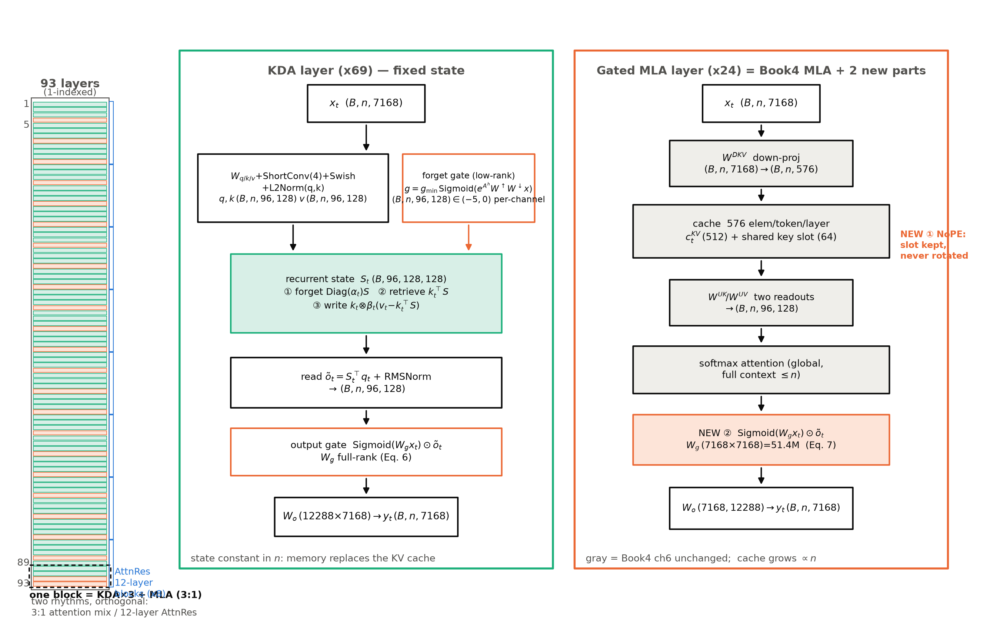
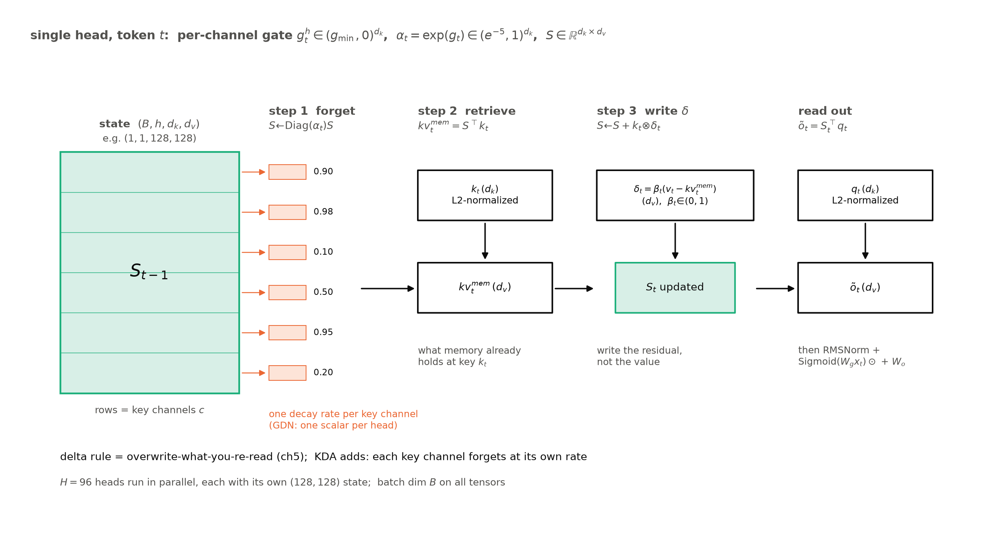
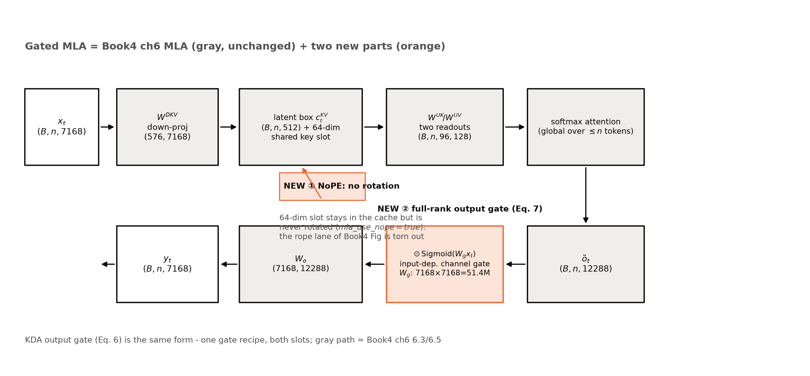
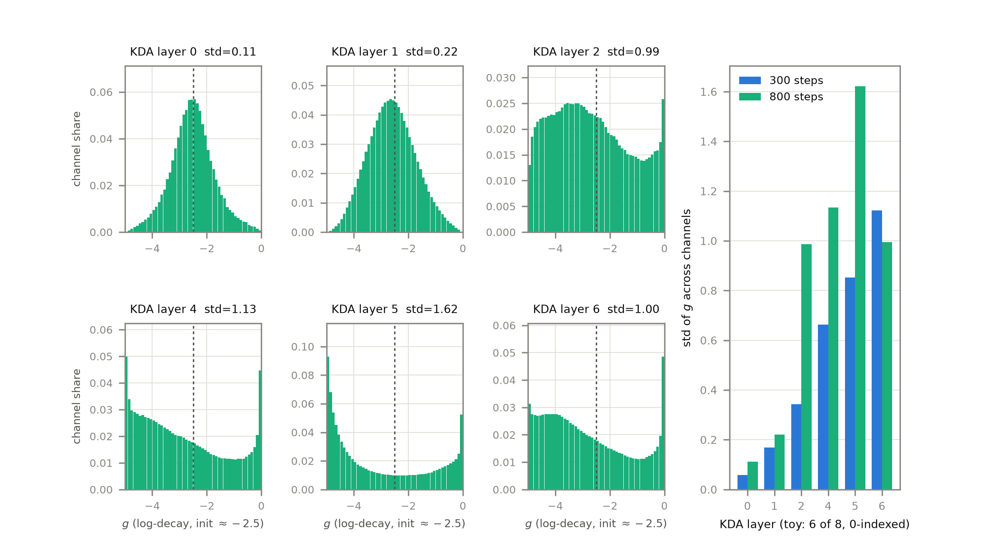

# 第 6 章 Kimi K3 报告精读·上：注意力侧

## 6.0 开篇：从全书到这里

上一章结束时，我们手里有一台自己造的机器：Gated DeltaNet 的双形态教学件——recurrent 与 chunkwise 两条路对拍到 $10^{-8}$ 量级，MPS 上 scaling 斜率 1.00 对 1.85，线性与平方的账肉眼可见。但它是教材级的层模块与缩玩具，GDN 本身也只是 2024 年 12 月的学术件。章末留的那个问题现在到期了：**真有旗舰把 delta rule 装进万亿参数的机器吗？装进去之后改了什么、付了什么代价？**

答案有一份 47 页的官方答卷。Kimi K3——总参 2.8T、激活 104.2B、1M token 上下文【证据等级：官方技术报告 arXiv:2607.24653，摘要，本地 PDF p.1】——把 93 层里的 69 层交给了 Kimi Delta Attention（KDA），24 层留给带门控的多头潜在注意力（Gated MLA，Gated Multi-head Latent Attention），全模型没有任何显式位置编码。它是第 5 章那把「换算子」的刀在 2026 旗舰上最大规模的一次落地。本章与下一章是一对：本章读注意力侧（KDA、Gated MLA、NoPE、AttnRes），第 7 章读效率侧（896 选 16 的 MoE、MXFP4 量化感知训练、原生多模态）；读完两章，你等于亲手拆解完一台 2026 旗舰的全部结构件。

开读前，先把本章的精读纪律钉在门上——这也是本册「读厂商自报」方法论（第 11 章正身）的第一次全章演练。**其一，双锚口径**：K3 报告一律引「arXiv:2607.24653 + 本地 PDF 节号页码」（47 页官方 PDF，页码与内嵌目录一致；arXiv v1 或与本地 8 月版有微差，页码以本地为准）。**其二，逐句带锚**：本章每一句机制断言都附报告节号与页码，你可以逐条回原文核对——这是「精读」二字的全部含义，也是与二手解读文章的本质区别。**其三，边界声明**：报告 §6（评测）我们只精读了摘要级，§6.1/6.2 的具体数字未逐节核过，一律不引；K3 的 benchmark 数字若出现，全部标「厂商自报」。**其四，图源纪律**：K3 报告图为 CC BY-NC-ND 许可，**禁用**——本章四张机制图全部从零自绘（示意级），不描摹任何报告原图。

> **最小背景栏**：本章直接使用四块已学地基，不重教——delta rule 与 GDN 的门控更新三式（第 5 章，$S_t$ 状态、$\beta_t$ 写强度、门控衰减）；MLA 的箱子、双形态与 576 元素缓存账（Book4 第 6 章）；MoE 的共享+路由结构（Book4 第 2-5 章）；MXFP4 格式（Book4 第 7 章）。分类型 KV/状态账本的公式在第 1 章 1.6 节立式，本章 6.6 节给出它迄今最重的一行数字。

## 6.1 报告地形与 config 对账：先看整机

拆机器先看整机图。图 6.1 是本章的自绘版——报告的 Figure 2 被 NC-ND 条款锁着，我们照读它的图注与正文（§2，p.3-4），把同一台机器自己画一遍：93 层的主干，注意力插槽按 3:1 交替——三层 KDA 配一层 Gated MLA，循环 23 次后在末尾额外加一层 Gated MLA；每个注意力层配一个 Stable LatentMoE 前馈；AttnRes 在深度维上另按 12 层一块切分。三种节律（3:1 注意力循环、12 层 AttnRes 块、逐层 MoE）互相独立地叠在同一根主干上。



**图 6.1** K3 注意力侧整机结构与两个插槽的放大（自绘示意级；依据官方技术报告 arXiv:2607.24653 §2.1-2.2 p.4-6 与 config 逆向重制，非报告原图——NC-ND 禁用）。左：93 层层带（层号 1 起），KDA×69（青）与 Gated MLA×24（橙）按 3:1 交替，虚线框出一个循环块，层 93 为末位额外 MLA；蓝色刻度为 AttnRes 的 12 层块边界（6.5 节）。中/右：两个插槽的纵向数据流，张量框标注形状（$B$=批、$n$=序列长）。复现：`python "[`code/ch06/make_figures.py`](code/ch06/make_figures.py)"`。

3:1 的官方定义句值得逐字读：*"Each block contains 3 KDA layers followed by 1 Gated MLA layer, giving a 3:1 mixing ratio… An additional Gated MLA layer is placed at the end of the backbone, ensuring that the final layer always performs global attention."*【官方技术报告（本地 PDF）§2.1，p.4，直引】——每块三层 KDA 加一层 Gated MLA，且**末层必须是全局注意力**。这句话落到 config 上是一个精确到层的清单，见实物 6.1。

> **实物 6.1（K3 config 的 `full_attn_layers` 原文）**。看什么：24 个全局层的层号一个不漏地写在数组里——「3:1」从比例变成逐层事实；注意清单里出现了 93，比 0 起索引的最大层号 92 大 1，这份数组用的是 **1 起层号**（正身口径）。
>
> ```
> "full_attn_layers": [4, 8, 12, 16, 20, 24, 28, 32, 36, 40, 44, 48, 52, 56,
>                      60, 64, 68, 72, 76, 80, 84, 88, 92, 93]
> "gate_lower_bound": -5.0        "use_full_rank_gate": true
> "mla_use_nope": true            "mla_use_output_gate": true
> "attn_res_block_size": 12       "head_dim": 128  "num_heads": 96
> ```
>
> 【证据等级：config 逆向（moonshotai/Kimi-K3 `config.json` 本地落盘摘录；后续字段为 6.2-6.5 节各机制的正身开关，此处先混个脸熟）】

把清单读成账：层 1-92 按 4 层一循环 $(\mathrm{KDA},\mathrm{KDA},\mathrm{KDA},\mathrm{MLA})$，MLA 落在 4, 8, …, 92 共 23 层；层 93 是额外的末位 MLA——23+1=24 个全局层、69 个线性层，与报告 Table 1 的「69 KDA + 24 MLA」自洽（$23\times4+1=93$ ✓）【证据等级：官方技术报告（本地 PDF）Table 1，p.11】。层号口径在此钉死：**正文一律 1 起**（`full_attn_layers` 正身口径）；第 9 章三刀机沿用「人读 1 起、代码注释 0 起」的双口径换算句，两章同款。这份层表也是 K2 到 K3 的架构叙事本身：K2 是 61 层全 MLA，K3 把混合范式整机化——*"MLA was subsequently adopted by Kimi K2 and Kimi K2.5, and Kimi K3 retains it in the periodic global-attention layers."*（MLA 被 K2/K2.5 采用，K3 把它保留在周期性的全局注意力层里）【官方技术报告（本地 PDF）§2.1.2，p.5，直引】。

整机看完，做本书每拆一台新机的第一件事：**config 公式整数精确算，跟官方数字对账**。件目五块：词嵌入与输出层（词表 163,840、untied 两份）、69 个 KDA 层、24 个 Gated MLA 层、92 个 MoE 层加首层稠密 FFN；MTP 层与 ViT 另计（Table 1 自己也把 ViT 401M 单列——官方主数=主模型的口径佐证，承 Book4 的教训）。对账结果见实物 6.2 与表 6.1。

> **实物 6.2（自算对账的终端输出，原样节选）**。看什么：这份 config 公式账的总参与官方 2.78T 只差 0.15%——但激活参差了 2.2B，当时**双报**着写、不粉饰（这笔残差后来在第 11 章案 C 由 checkpoint 分片审计销案：真凶是 config 公式把满秩门记窄了，见本节末与式 (11.2)）；块内「…」为省略号（略去组成明细两行与分类型 KV/状态账段——后者的数字 6.6 节正文自算），块内数字为 config 口径原样、勿作终审。
>
> ```
> === 件目参数账（主模型，不含 MTP/ViT） ===
> embedding 1,174,405,120  lm_head(untied) 1,174,405,120
> KDA/layer = 407,064,672 (~0.4B)  [full-rank gate 51,380,224 vs low-rank 2,490,368]
> Gated-MLA/layer = 195,495,936 (~0.20B)
> MoE/layer: shared 132,120,576 + routed 29,595,009,024 + Wdn/Wup 51,380,224 + router 6,423,424 = 29,784,936,832 (~29.785B)
> 主模型总参 = 2,776,070,367,200 = 2776.0704T   官方 2.78T (Table 1: 2.78T / Δ167% vs K2 1.04T)
> …
> 激活参 = 101,948,568,544 = 101.95B   官方 104.2B (Table 1)
> …
> assert 层排布: layers 4,8,...,92 共 23 层 MLA + 末层 93 = 24
> 69 KDA + 24 MLA = 93 ✓ (与 Table 1 'Attention-Layer Composition' 一致)
> ```
>
> 【证据等级：本书复算（config 公式整数精确算 + 层排布 assert，2026-10，00-feasibility 探针档产物 `log/book5-feasibility/k3_account_out.txt`——调研期 ad-hoc 终端账、无独立脚本；同型「公式=实测逐位 assert」的脚本化正身见 6.9 `k3_toy.py`）】

表 6.1 K3 自算对账表（config 公式账 vs checkpoint 审计账——后者第 11 章案 C 定谳）

| 件目 | config 公式自算（本节） | checkpoint 审计（第 11 章案 C） | 官方（Table 1，p.11） |
|---|---|---|---|
| 总参（文本主干） | 2,776.07B | 2,779.484B | 2.78T（审计命中，差 +0.068B） |
| 激活参（去输出层） | 101.95B | 104.190B | 104.2B（审计命中，差 +0.010B） |
| 层数 / 全局层 | 93 = 69 KDA + 24 MLA | 层型签名 match=True | 同（逐位 ✓） |
| KDA 层 | 407,064,672/层 → 28.09B | 443,740,416/层 → 30.62B | — |
| Gated MLA 层 | 195,495,936/层 → 4.69B | 232,196,096/层 → 5.57B | — |
| MoE 层（92 层+稠密首层） | 2,740.21B + 0.73B | — | — |

总参那 0.15% 的残差在 norms/偏置/口径噪声内闭合，不必追；激活参的 −2.2B 才值得停下来——这正是「**差值先查自家账**」的现场：我的公式里没算什么？当时猜过三个候选（MTP 层的激活部分约 1.2B、ViT 与 projector 约 0.42B、router/norm 的计法口径），哪个也没被官方口径句证实——残差如实双报登记，正文主数永远钉官方 2.78T／104.2B。这笔悬案到第 11 章案 C 由 checkpoint 分片审计销案：真凶在自家公式账里——config 把满秩输出门记作 $7168\times7168$ 方阵，分片头里的真身是 $[12288,7168]$（每层约 +36.7M、93 层合计约 +3.41B），再拆掉 config 误含的输出层 1.17B，$101.95+3.41-1.17\approx104.2$ 恰好命中官方数（式 (11.2)）【证据等级：本书复算 + checkpoint 审计（C-107）+ 官方技术报告 Table 1】。第 11 章的方法论章会把这套「自算—对账—双报」固化为五步法，此处先看它打一次样。

## 6.2 KDA 正身：delta rule 装上通道级遗忘门

整机图里那 69 个青色插槽，现在放大看。官方定位句只有一句话：*"KDA extends the delta-rule recurrence [106, 140] with a channel-wise forget gate [64]."*（KDA 用通道级遗忘门扩展 delta rule 递归）【官方技术报告（本地 PDF）§2.1.1，p.4，直引】——同源的部分是第 5 章手写过的 delta rule 递归（引文 [106]=快权重程序员、[140]=GDN），增量只有一件：**遗忘门从「每头一个标量」变成「每键通道一个系数」**。先立递归，再看这一件增量怎么长出来。

单头视角的递归式（报告 Eq.1）：

$$S_t=\big(I-\beta_t k_t k_t^{\top}\big)\,\mathrm{Diag}(\alpha_t)\,S_{t-1}+\beta_t k_t v_t^{\top},\qquad \tilde{o}_t=S_t^{\top}q_t \tag{6.1}$$

用人话说：先把旧记忆按通道打折，再在「当前键」这个位置上做一次 delta rule 写入，然后沿查询读出。它与第 5 章 GDN 更新式的区别全部藏在 $\alpha_t$ 的形状里——GDN 的 $\alpha_t$ 是每头每步一个标量，KDA 的 $\alpha_t\in(0,1)^{d_k}$ 是每头每步一条 **128 维通道向量**。符号与形状逐个钉死（表内代入 K3 实维）：

| 符号 | 含义 | 形状（单头） | K3 实维 |
|---|---|---|---|
| $x_t$ | 残差流输入 | $(B,n,7168)$ | — |
| $q_t,k_t$ | 查询/键（L2 归一后） | $(B,n,96,128)$ | $d_k{=}128$ |
| $v_t$ | 值 | $(B,n,96,128)$ | $d_v{=}128$ |
| $S_t$ | 递归状态 | $(B,96,128,128)$ | $128{\times}128$/头 |
| $\alpha_t$ | **通道遗忘因子** $\exp(g_t)$ | $(B,n,96,128)$ | $\in(e^{-5},1)$ |
| $\beta_t$ | 写强度 | $(B,n,96)$ | $\in(0,1)$ |

式 (6.1) 左乘展开是矩阵语言，工程实现读成三步更好记——transformers 的 naive 参考实现正是这么写的：① 遗忘 $S\leftarrow\mathrm{Diag}(\alpha_t)S$；② 对齐检索 $kv^{\mathrm{mem}}_t=k_t^{\top}S$（旧记忆在当前键位置上已存了什么）；③ 写差值 $S\leftarrow S+k_t\otimes\big[\beta_t(v_t-kv^{\mathrm{mem}}_t)\big]$（只写「新值减旧记忆」的残差）。代数上与式 (6.1) 逐项等价（$(I-\beta kk^{\top})\mathrm{Diag}(\alpha)S+\beta kv^{\top}=\mathrm{Diag}(\alpha)S+\beta k\big(v-k^{\top}\mathrm{Diag}(\alpha)S\big)^{\top}$ 展开即得）。图 6.2 把三步画成数据流，例 6.1 把它跑给你看。



**图 6.2** KDA 递归三步读法（自绘示意级，单头视角，标形状）：状态 $S\in\mathbb{R}^{d_k\times d_v}$ 的行=键通道；①遗忘——每行乘自己的 $\alpha_c\in(e^{-5},1)$（橙色条，GDN 为每头一个标量）；②对齐检索——沿当前键读旧记忆；③写差值——只写残差；随后读出。96 头并行、各持一份 $(128,128)$ 状态。

> **例 6.1（递归三步手算，构造例）**。取单头、$d_k{=}2$、$d_v{=}2$，初始 $S_0=\begin{bmatrix}1&0\\0&2\end{bmatrix}$，本步 $\alpha=[0.5,\,1.0]$（通道 1 遗忘一半、通道 2 全留），$k=[1,0]$（已单位范数），$v=[3,4]$，$\beta=1$。三步走：① 遗忘——逐行缩放，$S'=\begin{bmatrix}0.5&0\\0&2\end{bmatrix}$（只有第 1 行被 $\alpha_1{=}0.5$ 打折——**通道级**的实感就在这一步：门只动它该动的那行）；② 检索——$kv^{\mathrm{mem}}=S'^{\top}k=[0.5,0]$；③ 写差值——$\delta=v-kv^{\mathrm{mem}}=[2.5,4]$，$S_1=S'+k\otimes\delta=\begin{bmatrix}3&4\\0&2\end{bmatrix}$。读出：$q=[0,1]$ 时 $\tilde{o}=S_1^{\top}q=[0,2]$——通道 2 的旧记忆原样活着。这个例子让你看见：同键重写时新值**覆写**了旧值（$[1,0]\to[3,4]$ 行）、别的通道不受牵连、而「打折多少」每通道各有其主。若换 GDN 的 per-token 门（一个 $\alpha$ 管两行），第 ① 步两行同折——差异就这么大。

三步读法之外的一切输入都由式 (6.2) 的投影组生产（报告 Eq.2 摘要）：

$$q_t,k_t=\mathrm{L2Norm}\big(\mathrm{Swish}(\mathrm{ShortConv}(W_{q/k}x_t))\big),\quad v_t=\mathrm{Swish}(\mathrm{ShortConv}(W_vx_t)) \tag{6.2}$$

$$\beta_t=\mathrm{Sigmoid}(W_\beta x_t),\qquad z_t=W^{\uparrow}_\alpha W^{\downarrow}_\alpha x_t+b_\alpha$$

$(B,n,7168)$ 经三路投影到 $(B,n,96,128)$，拼接后过核宽 4 的因果短卷积（$\mathrm{ShortConv}$，形状 $(B,n,3{\times}96{\times}128)$）再 Swish，$q,k$ 追加 L2 归一——这套「短卷积+Swish+L2Norm」与 GDN 同族（第 5 章已教），KDA 全套照用【官方技术报告（本地 PDF）§2.1.1，p.4】。$z_t$ 是遗忘门的原料：**低秩投影**（$W^{\downarrow}_\alpha$ 把 7168 压到 128、$W^{\uparrow}_\alpha$ 再撑回 $96{\times}128$，加逐通道偏置 $b_\alpha$），秩数的正身在 Kimi Linear 论文里写着 *"with rank equal to the head dimension"*（秩=头维=128）【证据等级：官方论文 arXiv:2510.26692 §4】。

**改动一：下界衰减（$g_{\min}{=}-5$）。** $z_t$ 怎么变成 $\alpha_t$，就是 K3 对 Kimi Linear 的第一处改动。Kimi Linear 沿用 GDN/Mamba-2 一线的负 Softplus 映射 $g=-e^{A}\mathrm{Softplus}(z)\in(-\infty,0)$——没有下界；K3 换成带下界的缩放 Sigmoid（报告 Eq.5）：

$$g^h_t=g_{\min}\,\mathrm{Sigmoid}\big(e^{A^h}z^h_t\big)\in(g_{\min},0)^{d_k},\qquad \alpha^h_t=\exp(g^h_t)\in(e^{g_{\min}},1)^{d_k} \tag{6.3}$$

其中 $A^h$ 是每头可学习 log 尺度（初始化 0），$g_{\min}=-5$ 是 config 里那行 `gate_lower_bound: -5.0`【证据等级：官方技术报告（本地 PDF）§2.1.1 p.5 + config 逆向】。用人话说：**每个键通道的「单步留存率」被钉在 $e^{-5}\approx6.7\times10^{-3}$ 以上——再健忘的通道，一步也忘不掉千分之六点七以下**。为什么肯花一个超参买下界？因为 chunkwise 并行形态要用衰减的倒数重标键（下文 chunkwise 段的 $\Gamma$ 除法），无下界时倒数可以无界增长、在有限精度里溢出——*"this reciprocal can grow without bound and overflow in finite precision"*【官方技术报告（本地 PDF）§2.1.1，p.4，直引】。有了下界，数字链一步接一步：$\alpha>e^{-5}$ ⟹ 16-token 块的累积 log 衰减落在 $(-80,0)$ ⟹ 重标因子 $<e^{80}$，落在 BF16 动态域内——于是 *"both diagonal and off-diagonal tiles [can] use dense Tensor Core matrix multiplications, eliminating the position-pair diagonal path"*（对角与非对角块全部走稠密矩阵乘，逐位置对角路径整个删掉）【官方技术报告（本地 PDF）§2.1.1，p.5，直引】。第 5 章讲过 Kimi Linear 的对策是把逐位置路径压成循环（二级分块）；K3 用一个下界把它**买断**。一个门参数化的改动，直接改写了 kernel 的形态——机制与系统在这里咬合，这是读旗舰报告比读论文更有味道的地方。谱系注：这类有下界的递归门与 HGRN2/Griffin/RWKV-7 同族，报告自己给了这句定位【官方技术报告（本地 PDF）§2.1.1，p.5】。

> **例 6.2（per-channel 对 per-token：两个通道的两种人生，构造例）**。设某头只有 2 个键通道，通道 1 学到 $g\approx-0.1$（$\alpha=e^g\approx0.90$），通道 2 学到 $g\approx-2.3$（$\alpha\approx0.10$）。输入输出走一遍：每来一个 token，通道 1 的记忆打九折、通道 2 打一折。10 步之后：通道 1 留存 $0.9^{10}\approx0.35$（约三分之一还在），通道 2 留存 $0.1^{10}=10^{-10}$（基本清零）。per-token 门（GDN 粒度）则一个 $g$ 管两通道——比如 $g=-0.7$（$\alpha\approx0.5$），10 步后两通道都剩 $0.1\%$：要么语法习惯式的慢变量被过快冲掉，要么最新词的快变量赖着不走。这个例子让你看见 KDA 的卖点：**「哪些通道的信息该多留一会儿」本身成了可学习量**，且 $z_t$ 由 $x_t$ 逐通道算出，是数据依赖的——不是固定的滤波器，是每步现算的遗忘决策。Kimi Linear 论文给过动机句：RoPE 靠每维不同频率获得细粒度，而 per-head 标量衰减缺这种 per-dimensional diversity——*"which motivates us to propose KDA with a learnable channel-wise gate"*【证据等级：官方论文 arXiv:2510.26692 §6.1，直引】。

**改动二：满秩输出门。** 读出之后还有一道门（报告 Eq.6）：

$$y_t=W_o\big[\mathrm{Sigmoid}(W_gx_t)\odot\mathrm{RMSNorm}(\tilde{o}_t)\big] \tag{6.4}$$

先对递归输出做头维 RMSNorm，再与一个**输入依赖的 Sigmoid 门**逐通道相乘。用人话说：模型对「这次从记忆里读出的东西信多少、放行哪些通道」再投一次票。K3 对 Kimi Linear 的改动是把 $W_g$ 从低秩换成**满秩**：*"Kimi K3 changes KDA's output gate from the low-rank parameterization used by Kimi Linear to an input-dependent full-rank projection."*【官方技术报告（本地 PDF）§2.1.1，p.5，直引】。参数代价满秩门 config 账 $7168\times7168=51.4\mathrm{M}$（checkpoint 真身 $[12288,7168]=88.1\mathrm{M}$——6.1 节考据框定谳、第 11 章案 C 销案）对 Kimi Linear 低秩约 2.5M【证据等级：官方技术报告（本地 PDF）+ 本书复算（config 公式＋checkpoint 审计 C-107）】。读法上有个防倒置的细节：Kimi Linear 选低秩不是性能劣势，而是 *"to ensure a fair parameter comparison, while maintaining performance comparable to full-rank gating"*——满秩与低秩它自己比过、性能相当，48B 档为参数对齐公平选了低秩【证据等级：官方论文 arXiv:2510.26692 §4，直引】；K3 没有对齐约束，直接上满秩。6.7 节的玩具会把这个门原样缩微进去。

**KDA 与 GDN 的精确差异**——报告只给了三句定位（上面已引两句，第三句是满秩门段），加上官方生态自己的差分句，凑成四条，见表 6.2。多一句都不写：GDN 侧的公式细节以第 5 章精读为正身，此处不凭印象扩写；「KDA 就是 GDN 换皮」这类说法在证据上站不住——粒度之差是结构差，不是命名差。

表 6.2 KDA 与 Gated DeltaNet 的四条差异（证据=报告三句+官方 docstring）

| # | 维度 | Gated DeltaNet | KDA（Kimi Linear→K3） | 证据 |
|---|---|---|---|---|
| D1 | 遗忘门粒度 | 每头每步 1 个标量 | 每头每步 $d_k{=}128$ 维通道向量 | 报告 §2.1.1 首句 + docstring |
| D2 | 衰减参数化 | 负 Softplus 族（承 Mamba-2 一线，每头标量） | Kimi Linear：负 Softplus 无下界；**K3：$g_{\min}\mathrm{Sigmoid}$ 下界 −5**（式 (6.3)） | 报告 §2.1.1 p.5 |
| D3 | 输出门 | 低秩 z 门（Swish 激活，第 5 章正身） | Kimi Linear 低秩；**K3 满秩 Sigmoid**（式 (6.4)） | 报告 §2.1.1 p.5 |
| D4 | 共同基座 | delta rule 递归 + 短卷积/Swish/L2Norm 前处理 | **同**（式 (6.1)(6.2) 与第 5 章 GDN 同族） | 报告 §2.1.1 Eq.1-2 |

> **实物 6.3（kimi_linear 官方 docstring 直引块）**。看什么：HF 生态自己写的差分句与 NoPE 句——一句话同时给 6.2 节的 D1 与 6.4 节的 NoPE 作证；拼写错误 `essentialy` 系原文如此，照录不改。
>
> ```python
> class KimiLinearDeltaAttention(nn.Module):
>     """Kimi Linear Attention: this is essentialy the same a gated delta net (GDN)
>     but decay is per-channel instead of per-token."""
>
> class KimiLinearAttention(nn.Module):
>     """Multi-headed Latent Attention (MLA) from Deepseek V2 with NoPE, but the
>     part of the keys where RoPE is applied is still shared."""
> ```
>
> 【证据等级：config/源码（transformers 5.18.0 `modeling_kimi_linear.py` L569-571、L190-192，本地浅克隆）】

粒度之差还有一份**权重级证据**。Kimi Linear 48B（注意：它是 KDA 的首台整机，不是 K3——两机数字严禁互挪，见下页考据框）发布了 safetensors 分片，只读第一个分片的头部就能看到两种粒度各自占多少参数：

> **实物 6.4（Kimi-Linear-48B 分片头张量清单摘录）**。看什么：`A_log` 是 32 个数（每头一个 log 尺度）、`dt_bias` 是 4096 个数（$32\text{头}\times128$ 通道，每通道一个偏置）——**per-head 与 per-channel 两种粒度就长在权重的形状里**；顺带看 `f_a/f_b_proj` 的 $2304\to128\to4096$ 低秩链与 `g_a/g_b_proj` 的低秩输出门（K3 换满秩的那个件的前身）。
>
> ```
> model.layers.0.self_attn.A_log           [1, 1, 32, 1]     # per-head（32 头各一个）
> model.layers.0.self_attn.dt_bias         [4096]            # per-channel（32×128）
> model.layers.0.self_attn.f_a_proj.weight [128, 2304]       # 遗忘门低秩 ↓（rank=head_dim）
> model.layers.0.self_attn.f_b_proj.weight [4096, 128]       # 遗忘门低秩 ↑
> model.layers.0.self_attn.g_a_proj.weight [128, 2304]       # 低秩输出门（K3 改满秩）
> model.layers.0.self_attn.g_b_proj.weight [4096, 128]
> ```
>
> 【证据等级：config/源码（MoonshotAI/Kimi-Linear-48B-A3B-Base `model-00001-of-00020.safetensors` 头部 HTTP Range 读取，877 张量清单之一；产物 `log/book5-ch07/kimi_linear_prefetch/kimi_linear_header.json`）】

> **【考据框】Kimi Linear ≠ K3——一条容易被二手文章踩混的模型线。**Kimi Linear（arXiv:2510.26692，2025-10/11）是 **KDA 的命名出处与首台整机**：48B 总参/3B 激活、27 层中 20 层 KDA+7 层满注意力，1.4T token 对照实验验证了 3:1 配方。K3（2026-07）把同一 KDA 模块装进 2.8T 整机，再加两处自家改动（式 (6.3) 下界、式 (6.4) 满秩门）与 AttnRes/Stable LatentMoE 等新件。两文互证但不等同：**Kimi Linear 的数字（48B/3B、RULER 84.3、1M decode 2.3× 等）只属于 Kimi Linear，严禁安到 K3 头上**；反之 $g_{\min}{=}-5$ 与满秩门是 K3 的改动，严禁写成 Kimi Linear 已有。本章凡引 Kimi Linear 论文处均单独标版本锚。

**chunkwise 一页。** 训练与 prefill 不能逐步递归，KDA 与 GDN 同款走「块内并行+块间递推」：块大小 $C$ 下，先做通道累积衰减 $\gamma_{i\to j}=\prod_{r=i}^{j}\alpha_r$（log 空间即 $c=\sum g$，形状 $(B,H,w,C,d_k)$——注意衰减沿**通道**累积，$w$ 为块号），块内的两两衰减矩阵 $D[i,j,c]=e^{c_i[c]-c_j[c]}$ 进入 UT 三角求解（第 5 章已逐步推导，K3 报告自己写明 *"We refer readers to Kimi Linear [64] for the UT transform and the full derivation"*【官方技术报告（本地 PDF）§2.1.1，p.4，直引】），输出拆成跨块读老状态 $(\Gamma\odot Q)S$ 与块内三角注意力 $\mathrm{Tril}[(\Gamma\odot Q)(K/\Gamma)^{\top}]\tilde{V}$ 两项（报告 Eq.3-4）。三个教学点：其一，**对角线保留**——*"the diagonal is retained because each output reads the state after the current-token update"*（对角保留，因为每步输出读的是更新后的状态）【官方技术报告（本地 PDF）§2.1.1，p.4，直引】，与 MTP 的 off-by-one 是同款陷阱；其二，归一化口径——KDA 的 chunkwise 打分是**裸的衰减加权内积，没有分母**（递归定义决定），与 softmax 注意力和第 5 章线性注意力的 $Z_i$ 分母构成三家口径，承第 5 章表 5.1；其三，本册教学件 `kda.py` 的 chunkwise 用「逐对衰减」直接算 $D$（数学上永不溢出的安全形态），K3 的 $g_{\min}$ 是为「因式分解形态」（$k\odot e^{-c}$ 重标）买回 BF16 域——同一数学的两种工程立场，对照着读最能看清那个下界到底买了什么。KDA 层两形态的完整形状流转收进表 6.3。

表 6.3 KDA 层形状流转表（recurrent 形态逐步 + chunkwise 两行；代入 K3 实维 $H{=}96,d_k{=}d_v{=}128$）

| 步骤 | 运算 | 输入形状 | 输出形状 | 说明 |
|---|---|---|---|---|
| 1 | $W_{q/k/v}$ 投影+拼接 | $(B,n,7168)$ | $(B,n,3{\cdot}96{\cdot}128)$ | 三路并一路 |
| 2 | ShortConv(4)+Swish | $(B,n,36864)$ | $(B,n,36864)$ | 因果短卷积 |
| 3 | 切头 + L2Norm($q,k$) | $(B,n,36864)$ | $(B,n,96,128)$×3 | $q,k$ 单位范数 |
| 4 | 遗忘门 $g$（式 (6.3)） | $(B,n,7168)$ | $(B,n,96,128)$ | $z$ 低秩 $7168{\to}128{\to}12288$ |
| 5 | ①遗忘 $\mathrm{Diag}(\alpha)S$ | $(B,96,128,128)$ | $(B,96,128,128)$ | 逐键通道行缩放 |
| 6 | ②检索 $k^{\top}S$ | $(B,96,128)$ | $(B,96,128)$ | $kv^{\mathrm{mem}}$ |
| 7 | ③写差值 $S+k\otimes\delta$ | $(B,96,128)$ | $(B,96,128,128)$ | $\delta=\beta(v-kv^{\mathrm{mem}})$ |
| 8 | 读出 $S^{\top}q$ + RMSNorm | $(B,96,128,128)$ | $(B,n,96,128)$ | $\tilde{o}$ |
| 9 | $\odot\mathrm{Sigmoid}(W_gx)$+$W_o$ | $(B,n,12288)$ | $(B,n,7168)$ | 式 (6.4) |
| 10 | chunkwise：$c{=}\sum g$ 与 $D{=}e^{c_i-c_j}$ | $(B,H,w,C,128)$ | $(B,H,w,C,C,128)$ | 块内逐对衰减 |
| 11 | chunkwise：UT 三角求解+块间递推 | $(B,H,w,C,\cdot)$ | $(B,n,96,128)$ | 与步骤 5-8 等价 |

机制讲完，一句系统侧事实收尾：KDA 用固定状态换掉了 softmax 注意力的增长 KV，*"in exchange for a fixed-size state that is cheap to transfer and reuse"*（换来一个便宜可搬运可复用的定长状态）【官方技术报告（本地 PDF）§5.1，p.17，直引】——而状态转移的仿射可组合性（每步更新都是 $S\mapsto M_tS+N_t$ 形式的仿射映射，映射可结合故可前缀扫描）是它跨设备并行化的数学根据【官方技术报告（本地 PDF）§5.1.2，p.18】。工程展开不出本册；账本侧的收益 6.6 节用数字说话。

## 6.3 Gated MLA：Book4 的箱子加两件新零件

69 个青色插槽看完，看 24 个橙色插槽。Book4 第 6 章章末的欠账框现在到期——原文是：「MLA 把 KV 装进了小箱子，但开箱后的注意力仍是那场 $O(n^2)$ 的精确内积——把注意力算子本身换掉的线性与稀疏算子一族（及其 2025 后的谱系、Gated MLA 等变体）是另一条战线，→ Book5 第 2/6 章；箱子在推理引擎里的落地读取（吸收形态的后端实现）是工程正菜，→ Book7 第 9 章。」【Book4 ch06 章末欠账框原文，L238】这张欠账单上有两笔：**算子那笔由本册兑付**——第 2 章起步了这条战线（这一册开始动算子），本章兑现其中 Gated MLA 变体的正身：K3 给出的答案是**KDA 换掉 69 层的算子，MLA 只守 24 层全局岗哨，且装上两件新零件**；**箱子后端那笔仍挂账**——吸收形态的 serving 实现是 Book7 第 9 章的工程正菜，不在本册任务内（与 ch5 章末 B5-5 的 GDN/线性族后端欠账同址合流）。

骨架没动。报告原句：*"MLA, introduced in DeepSeek-V2 [28], compresses the key–value representation of each token into a low-dimensional latent vector $c_t=W_cx_t$. … MLA caches $c_t$ and reconstructs the content keys and values through learned up-projections."*【官方技术报告（本地 PDF）§2.1.2，p.5，直引】——低秩装箱、缓存潜向量、开箱上投影，与 Book4 第 6 章教的机构一字不差；K3 实维也同款：`kv_lora_rank 512`、`q_lora_rank 1536`、共享键槽 64 维，每 token 每层缓存 576 元素（6.6 节入账）。512+64 的 latent 布局与 DSV2/DSV3 完全同构——骨架承 DeepSeek-V2 一线，config 与 transformers/vLLM 双实现互证【证据等级：config 逆向+transformers 5.18.0/vLLM 0.30.0 源码】。

两件新零件才是 K3 的签名（图 6.3）。**第一件：NoPE（No Position Encoding，无位置编码）**——位置编码整个拆掉，细节归 6.4 节。**第二件：输出门**（报告 Eq.7）：

$$y_t=W_o\big[\mathrm{Sigmoid}(W_gx_t)\odot\tilde{o}_t\big] \tag{6.5}$$

与 KDA 的式 (6.4) **同式同引**（连引文 [100] 门控注意力都同一个）——满秩 $W_g$（config 账 $7168\times7168$=51.4M；checkpoint 真身 $[12288,7168]$=88.1M，见 6.1 考据框）、输入依赖、逐通道。动机句：*"This gate allows each token to modulate the channels read from global attention."*（这个门让每个 token 调制从全局注意力读出的通道）【官方技术报告（本地 PDF）§2.1.2，p.6，直引】。config 双开关正身：`mla_use_output_gate: true`、`use_full_rank_gate: true`【证据等级：config 逆向】。教学上这是卷间契约的标准示范：**先把 Book4 的箱子原样搬来，再装两件新零件**——已知物加局部替换，一台「新」架构就位。两件零件还有个共同去向值得一眼：KDA 与 Gated MLA 用同一个门式，等于 K3 给两种注意力插槽定了同一道「读出前投票」的规矩——满秩门在 48B 档 Kimi Linear 已验证与低秩性能相当（6.2 节），旗舰档多付参数买表达自由。



**图 6.3** Gated MLA=Book4 MLA+两件新零件（自绘示意级 diff 图）：灰=Book4 第 6 章已教且未动的通路（装箱-缓存-两副上投影-softmax）；橙=两处 diff——① NoPE（64 维共享键槽保留在缓存里但永不旋转）；② 满秩输出门（式 (6.5)）。张量框标注形状。复现：`make_figures.py`（同图 6.1）。

> **【考据框】满秩门的宽度：报告公式没写死、checkpoint 一锤定音。**式 (6.4)(6.5) 的逐元素门 $\odot$ 需要两侧同宽，但报告没写 $W_g$ 的输出宽度——两个来源给出两种读法：按 Table 1 对账自洽的 config 口径是 $7168\times7168$（51.4M，6.1 节 config 公式账即按此计入，闭合 +0.15%）；K3 remote 代码的 `g_proj` 实现是 $7168\to12288$（$=h\cdot d_v$，逐头逐维门，88.1M），按此口径总参约 2,778.6B、与 2.78T 闭合到 +0.05%。本册 checkpoint 分片审计（96 个分片头逐张量清点，C-107／第 11 章案 C）定谳：`g_proj` 真身 $[12288,7168]=88{,}080{,}384$，方阵读法作废——6.1 节 config 公式账与 checkpoint 账每层差约 36.7M、总差约 2.5B（0.09%），即式 (11.2) 的 gate 形状项。玩具件按 $h\cdot d_v{=}d$ 的同构口径缩微成 $512\times512$（6.7 节）——「真机 $[12288,7168]$、玩具 $512\times512$，同构缩微、数字勿对号」。

还有一个反直觉的参数账值得一眼看穿（checkpoint 正身口径）：Gated MLA 层 232.2M，KDA 层 443.7M——**全局层反而便宜近一半**。原因不难找：MLA 靠压缩，缓存与投影都过着简日子；KDA 状态虽小，但三路全宽投影（$3\times7168\times12288$）加双门（满秩 $W_g$ 88.1M+低秩遗忘门）把参数吃足。省 KV 的路线不必然省参数——账要分开记。训练侧还有一句精度处理如实记：*"we keep the attention output in FP32 during training"*（训练期注意力输出保 FP32，修偏置舍入误差）【官方技术报告（本地 PDF）§2.1.2，p.6，直引】。

分工的总句报告写得极清楚，值得整句直引：*"The intervening KDA layers provide position-sensitive and recency-aware sequence mixing, while the MLA layers provide unrestricted global content interaction."*（间隔的 KDA 层提供位置敏感、近因感知的序列混合；MLA 层提供不受限的全局内容交互）【官方技术报告（本地 PDF）§2.1.2，p.5，直引】——69 层管「记忆与位置」，24 层管「检索与汇合」。第 5 章问过「为什么混合架构要留全局层」，K3 用机构答了：精确检索这件事，线性状态做不好（第 5 章负结论），就交给少数几层专职做。

## 6.4 NoPE：位置职责整个挪进 KDA

第一件新零件单独成节，因为它是 Book3 就挂账的伏笔。B3-7 登记的是「partial RoPE 与 NoPE 的头维净土」；第 5 章已核死 Qwen3-Next 的答案是**全局层 partial RoPE 0.25**（头维前 25% 旋转、其余不旋——不是 NoPE）；K3 给出另一个极端：**全机 NoPE**。报告两句，一句在架构节、一句在训练节：

> *"Kimi K3 follows the hybrid design of Kimi Linear and applies No Position Encoding (NoPE) to all MLA layers. Consequently, no explicit positional encoding is applied to their queries or keys."*（K3 把 NoPE 用在全部 MLA 层——查询与键都不加任何显式位置编码）【官方技术报告（本地 PDF）§2.1.2，p.5，直引】
>
> *"Kimi K3 uses no explicit positional embedding (NoPE), and instead encodes positional information implicitly through the recurrent gating and decay mechanism of KDA. As a result, the model extrapolates directly to 1M-token contexts without any positional-encoding modification."*（不用显式位置嵌入，位置信息经 KDA 的门控与衰减隐式编码；因而不做任何位置编码改动即直推 1M）【官方技术报告（本地 PDF）§3.4，p.12，直引】

三件事要把精确。**其一，范围是全模型**：config 里没有任何 RoPE 频率字段（无 `rope_theta`/`rope_scaling`），KDA 层同样无旋转——那句 `qk_rope_head_dim: 64` 只是维度槽位名，为共享键缓存保留 64 个位置、其上永不旋转（remote 代码 `rotary_emb=None` 且断言 NoPE-only）【证据等级：config 逆向+K3 remote 代码】。实物 6.3 的第二句 docstring 正是这件事：NoPE 之下「RoPE 作用的那段键仍然共享」。顺手清一笔 Book3 的旧账：NoPE 论文正身是 arXiv:2305.19466（Kazemnejad et al.），Book3 欠账框里的「2405.167?」已证伪（2405.16749 是一篇无关的生成模型论文），此处清账、第 8 章收束时正式回收。**其二，位置没有消失，是换了住址**：分工句（6.3 节）已经说破——KDA 的递归次序、短卷积的局部窗口、通道衰减的数据依赖，合起来把「位置感」搬进了线性层；MLA 变成纯内容注意力，NoPE 是分工的自然结果而非独立的赌博。**其三，防断章**：直推 1M 不等于没练过长文——§3.4 的四阶段课程照走（8K→64K 预训练、256K→1M 冷却段）【官方技术报告（本地 PDF）§3.4，p.12】，「无位置参数改动」省掉的是外推链（PI/NTK/YaRN，Book3 第 7 章那条工程线）的全部麻烦，不是省掉训练。

这个设计在 48B 档有受控实验背书：Kimi Linear 论文 Table 5 同配置对照，NoPE 版短文持平、长文全面领先（RULER 84.3 对 RoPE 版 78.8）——机理解释是 RoPE 版全局层带强显式位置、线性层只余弱隐式偏置，位置偏置跨层不均，长程检索被短程过重拖累【证据等级：官方论文 arXiv:2510.26692 Table 5（48B 档标注）】。NoPE 还有一个架构红利顺路登记：无 rope 维隔离后，MLA 可整体吸收成纯 Multi-Query 形态（*"NoPE enables their conversion to the highly-efficient pure Multi-Query Attention during inference"*）【证据等级：官方论文 arXiv:2510.26692 §4-5.2，直引】——Book4 第 6 章的「权重吸收」在这里走到了尽头形态。位置哲学的完整对表（外推派对状态压缩派、iRoPE 的调和、「为什么旋得少反而好」）是第 8 章的正题，本章只钉事实：**K3 站在了「位置留给数据与状态」的一极**。

## 6.5 AttnRes：深度维的注意力

注意力插槽之外，K3 还动了第三处——残差流本身。先做防望文生义的第一道关：Attention Residuals（AttnRes，注意力残差）**不是**「残差跨层直连」或「跳跃连接加密」，它把深度维的残差流**换成了一次注意力**。动机段值得直引，因为它把 Book1 的老朋友放上了手术台：

> *"Standard residual connections compress all prior information into a single state $h_l$ over depth — a bottleneck reminiscent of RNNs over time. … Attention Residuals applies the same methodology to depth: each layer selectively retrieves representations from all preceding layers rather than accumulating them uniformly."*（标准残差把全部前层信息压进单个状态 $h_l$——一个深度维的 RNN 瓶颈；AttnRes 把同一方法论搬到深度：每层**选择性检索**全部前层表示，而非无差别累加）【官方技术报告（本地 PDF）§2.2，p.6，直引】

对偶轴一摆就懂：时间维上，RNN 的隐状态瓶颈被注意力换成「每步检索全部历史」——这是 2017 年的革命；深度维上，$h_l=h_{l-1}+f_{l-1}(h_{l-1})$ 的加法残差是同一个瓶颈（第 $l$ 层只能见到一个累加和），AttnRes 把它换成「每层检索全部前层」。Book1 第 6 章把残差主干比作「一条恒定宽度 512 的河」——支流只管往里掺修正量、下游只能见到掺完的河水；AttnRes 把这条只进不出的河换成了一座可查询的货架。

机构三件套（报告 Eq.8-9）。**伪查询**：每层一个可学习向量 $q_l=w_l\in\mathbb{R}^{d}$——与输入数据无关，是「这一层想问什么」被直接学进参数；键=值=各层输出（外加第 0 号候选：token embedding 永远在货架最底层）。**核与权重**：

$$\phi(q,k)=\exp\big(q^{\top}\mathrm{RMSNorm}(k)\big),\qquad \alpha_{i\to l}=\frac{\phi(q_l,k_i)}{\sum_{j=0}^{l-1}\phi(q_l,k_j)} \tag{6.6}$$

$$h_l=\sum_{i=0}^{l-1}\alpha_{i\to l}\,v_i \tag{6.7}$$

用人话说：第 $l$ 层的输入不再是「上一层输出加本流」，而是拿自己学好的问句，对 {embedding, 第 1 层输出, …, 第 $l{-}1$ 层输出} 做一次 softmax 加权检索。两个细节：核里 **RMSNorm 压键的量级**、防某几层输出大就霸占权重；报告式**没有 $1/\sqrt{d}$ 缩放因子**——这不是转录省略，AttnRes 专文（arXiv:2603.15031）的 Eq.2 同样无缩放，属原文设计【证据等级：官方论文 2603.15031 v1（批二 C-96 定谳）】。**Block 形态**：全形态每层要对全部前层做注意力，深度 $L$ 上的账是 $O(L^2d)$ 算力加 $O(Ld)$ 显存（要保活所有层输出）——*"Since network depth is modest $(L<100)$, the $O(L^2d)$ arithmetic of this full form is affordable; the practical overhead is the $O(Ld)$ memory"*【官方技术报告（本地 PDF）§2.2，p.6，直引】；K3 实际用的是分块版：每 $S{=}12$ 层攒一个块内部分和，跨块只对块级表示做注意力，显存与通信从 $O(Ld)$ 降到 $O(Nd)$。93 层切成 7 个满块加 1 个 9 层的部分块，连 embedding 源一起共 9 个端点——*"for Kimi K3, we partition its layers into 8 blocks with 12-layer size, giving a partial final block and 9 total blocks when counting the embedding layer."*【官方技术报告（本地 PDF）§2.2，p.6，直引】；config `attn_res_block_size: 12` 正身【证据等级：config 逆向】。回看图 6.1 左侧的蓝色刻度：3:1 注意力节律与 12 层 AttnRes 节律在同一根主干上正交叠加，互不干扰——两个「块」字也不同物（注意力块=4 层，AttnRes 块=12 层），引用时必须消歧。

双锚分工按批二定谳执行：K3 的实例参数（93 层 8 块 12 尺寸、块结构）锚 K3 报告 §2.2；机制细节与「$N\approx8$ 已恢复大部分收益」的块宽消融锚 AttnRes 专文 2603.15031。最后一句工程事实不动机制：EAGLE 式加速的特征抽取恰好取第 1、4、末三个 AttnRes 块的输出——AttnRes 的块结构顺带成了深度维特征的天然取样板【官方技术报告（本地 PDF）§4.1.4，p.14，事实句】。

## 6.6 分类型账的杀手数字：0.75% 从哪来

机制读完，回到本册的叙事主线——那本新账。第 1 章 1.6 节立的分类型 KV/状态账本，第 4 章算过四台机器的 1M 横表，其中 K3 行留了个悬念：「0.75%，第 6 章的杀手数字在此预存」。现在机制全部在手，把这一行算穿。

三栏账（元素口径，BF16 字节×2；公式承第 1 章式 (1.3)-(1.4)）。**全局层栏**：24 个 Gated MLA 层，每 token 每层 576 元素（latent 512+共享键槽 64——6.4 节钉死的口径），1M token 时 $24\times576\times1{,}048{,}576\approx14.50$G 元素 $\approx$ **29.0 GB**，随长度线性、无界。**线性层栏**：69 个 KDA 层，状态 $d_k\times d_v\times H=128\times128\times96=1{,}572{,}864$ 元素/层，共 108.5M 元素 $\approx$ **217 MB**，与长度无关——第 1 个 token 与第 100 万个 token 之间纹丝不动。两栏相除：$217\mathrm{MB}/29.0\mathrm{GB}\approx$ **0.75%**。这个 0.75% 是「3:1 混合」的账本根据：**69 层的记忆 + 24 层的账本**——线性层把全机九成的 KV 账从长度轴上摘掉，只留四分之一层继续付无界账，而这四分之一层的账也比假想的 93 层全 MLA（$93\times576$/token，1M $\approx$ **112 GB**）降到 26%。交叉点 $n^*=69\times1{,}572{,}864\div(576\times24)\approx7{,}851$（承第 1 章 1.6 节）——过了七千九百个 token，69 层 KDA 的全部固定状态就开始「白赚」，而旗舰的工作区间是它的百倍以上。

这笔账报告自己从服务侧又算了一遍，两句事实句读作 6.7 节之前的世界观：*"The MLA KV cache grows with sequence length and is paged per token, whereas the KDA recurrent state is fixed in size with a single copy per request."*（MLA 的 KV 随长度增长、逐 token 分页；KDA 状态定长、每请求一份），以及工程对策 *"we pack KDA states into the same paged block pool as MLA KV, unifying pages to the same byte size"*（把 KDA 状态与 MLA KV 打进同一个分页块池，页面统一到同一字节宽）【官方技术报告（本地 PDF）§5.4.1，p.23，直引】——同一个缓存池里两种生命周期的东西怎么联合管理，是推理系统的正题，本章按下不表（章末欠账框给地址）。

## 6.7 K3 玩具替身·注意力侧：四代组件一台机器

读完真机，造缩微样机——本册从导览就预告的那台 43.9M 机器。它的第一条设计原则写在 import 语句里（承 Book4 第 9 章「改装史写在 import 语句里」的手法）：

> **实物 6.5（K3 玩具的血统：import 语句原文）**。看什么：四代组件各从哪一章进场——没有一行模型代码是本册新造的底盘，全部复用。
>
> ```python
> import moe_mla_slots as m4                    # Book4 00-feasibility：SlotLLaMA 底座 + MLAAttention + 训练环
> fp8 = _load("…/Book4-规模与效率/ch07/fp8_sim.py")   # Book4 ch07：MXFP4 量化模拟
> gdn = _load("…/ch05/gdn.py")     # 本册 ch05：GatedDeltaNet 双形态件
> kda = _load("…/ch06/kda.py")     # 本册 ch06：KimiDeltaAttention 正身件
> ```
>
> 【证据等级：本书代码（[`code/ch06/k3_toy.py`](code/ch06/k3_toy.py#L69)::bootstrap`，toy 实物=真实源码摘录）】

config 定版见表 6.4：8 层 $[\mathrm{kda}\times3,\mathrm{mla}]\times2$（3:1 缩微、末层全局承 K3 惯例）、KDA 插槽 8 头 64 维（状态 $8\times64\times64{=}32{,}768$ 元素/层）、MLA 插槽承 Book4 件几何（缓存 160 元素/token/层）、MoE 64 选 4 加 1 共享（稀疏度 16:1，是 K3 896:16=56:1 的缩微）。参数账走「手算=实测=定版」三方 assert：**43,905,888 总参 / 11,662,176 激活非嵌入**，逐位命中定版账【证据等级：本书实验，`k3_toy.py` assert】。

表 6.4 K3 玩具（toyA）config 定版表

| 插槽 | 几何（缩微口径） | 血统 |
|---|---|---|
| KDA | $h{=}8$，$d_k{=}d_v{=}64$，短卷积 4，chunk 16，低秩门 rank=64，$g_{\min}{=}-5$，满秩门 $512{\times}512$ | 本册 ch06 `kda.py`（K3 同构缩微） |
| Gated MLA | $h{=}8$，kv_lora 128，qk_nope 64，键槽 32，v_head 64（缓存 160/token/层） | Book4 ch06 `mla.py` |
| MoE | E=64 选 4 + 共享 1，$w_e{=}32$（16:1 vs K3 56:1） | Book4 `moe_mla_slots` |
| 底座 | V=8192（sp-8k 语料），$d{=}512$，L=8，$[\mathrm{kda}\times3,\mathrm{mla}]\times2$ | Book4 SlotLLaMA |
| 总账 | **43,905,888 / 激活非嵌入 11,662,176**（gdn_sub 臂）；kda 臂 44,277,936 | assert 双口径 |

「K3 化」是一次单点替换：把 6 个注意力插槽从 ch05 的 GDN 替身件换成 ch06 的 KDA 正身件，其余一切不动。替换的参数代价精确可算：kda 臂总参 44,277,936，比 gdn_sub 臂多 **+372,048 = 6 层 $\times$ 62,008/层**。逐层看这笔账（KDA 插槽 1,387,080 对 GDN 替身 1,325,072）：新增满秩门 $+262{,}144$、低秩遗忘门组 $+66{,}056$（$f\_a\ 32{,}768+f\_b\ 32{,}768+\mathrm{dt\_bias}\ 512+A\_log\ 8$），省回的是 GDN 的 qkvz 联合投影瘦身 $-262{,}144$（$1{,}048{,}576\to$ 三路分立 $786{,}432$——**换门的钱大部分从拆掉 z 通道里省出来**）与 ba 投影 $-8{,}192$；$\beta$ 投影 $+4{,}096$、o_norm $+64$ 与两侧 A_log/dt_bias 的小差额 $-16$ 把账找齐到 $+62{,}008$。大纲口径照录：K3 化换装**另报参数账，主账仍是 toyA 定版账**【证据等级：本书实验，逐项 assert】。

机制件先对拍再上机（Book4 noaux 教训的纪律）。`kda.py` 的对拍锚是 transformers 5.18.0 `kimi_linear` 的 torch 参考双 kernel，CPU fp32 正档：自研 recurrent 对 HF **2.98e-08**、chunkwise 对 HF **4.47e-08**、双形态互拍 **8.38e-08**、层模块双形态 5.96e-08——全部低于门槛（1e-4）至少三个数量级；同权重直搬下 per-token 与 per-channel 两读法输出差 7.91e-04（显著非零=粒度真的生效，且参数逐位相同——单变量成立）【证据等级：本书实验，`log/book5-ch06/kda_run1.json`】。对拍还抓出过两个实现 bug，都值得记成「对拍驱动开发」的账：其一，**掩蔽顺序坑**——上三角掩蔽先 `masked_fill(0)` 再 `exp()`，把掩蔽位变成 $e^0=1$（GDN 版是填 $-\infty$ 再 exp），单块对拍 state 对、out 错 0.63，手工 4-token 逐位复现才定位到块内项；其二，**漏 exp 坑**——状态更新处注释写 $e^{c_{\mathrm{last}}}$ 代码没 `.exp()`，现象是 **out 全对、state 错**：错误藏在状态里不显形，等跨块读老状态时才爆——「输出对不等于实现对」的教学级案例。

正菜实验是**门粒度双臂**（判据与结果分支跑前预注册，承丛书纪律）。两臂同一 `KimiDeltaAttention`、同参数 44,277,936 逐位相同，唯一变量是门的读出粒度：kda 臂 per-channel（K3 正身），gdn 臂把 $z$ 沿 $d_k$ 取均值后广播（每头每步一个标量，GDN 粒度）。fast 300 步：loss 9.103→6.187（min 5.847）对 9.103→6.160（min 5.849）；full 800 步：9.103→**5.491**（min 5.014）对 9.103→**5.500**（min 5.012），2.27 s/步（MPS bf16，sp-8k 语料）——**预注册分支③命中：玩具档 loss 无显著差**，如实写「门粒度的 loss 收益在 44M/数百步档不可分辨」，不做任何规模外推。正档读数换成了另一个：**$g$ 分布的分化本身**。图 6.4 左侧是 800 步后 6 个 KDA 层的逐通道 $g$ 直方图——初始化时所有通道挤在 $g{=}-5\times\mathrm{Sigmoid}(0){=}-2.5$ 一点，训练后分布逐层拉开；右侧的 std-across-channels 从 300 步的 $[0.059,\dots,1.123]$ 增至 800 步的 $[0.111, 0.221, 0.987, 1.135, 1.622, 0.996]$——浅层门近均匀（接近「整体打折」的 GDN 行为），深层学出每通道各异的速度。**「每通道学出了不同的遗忘速度」从报告的机制断言变成了第一手实测**【证据等级：本书实验，`log/book5-ch06/train_k3toy_{kda,gdn}_{fast,full}.json`】。



**图 6.4** 玩具 KDA 遗忘门分布实测（自产）：左=800 步后 6 个 KDA 层的逐通道 $g\in(-5,0)$ 直方图（虚线=初始化值 −2.5，标题 std=层内跨通道标准差）；右=同一统计量在 300 步与 800 步的对照——分布随训练加深而拉开，深层尤甚。数据源：`train_k3toy_kda_{fast,full}.json` 的 g_stats（种子 20261002）。

玩具的状态账顺路入册：6 个 KDA 层核心状态 $6\times32{,}768=196{,}608$ 元素（加短卷积状态 $6\times4{,}608$），2 个 MLA 层 160 元素/token——交叉点 $n^*=196{,}608\div320\approx614$（核心状态口径；含卷积 701）。第 1 章 1.6 节预存句里的 219 是调研探针期的预算值（当时全局插槽按 GQA 1,024 元素/token 计），toyA 定版为 MLA 插槽后以本节 614 为正身，第 8 章统一回看时同表对照。最后照例立边界：玩具外推声明（红线登记）——K3 报告的失效模式与收益绑定 2.8T/896 专家/低精度算术的规模，43.9M 玩具的结果只证明「机制件可组装、可训练、门行为可观测」，**不证明 K3 的行为**；机制与规模的分工，正是第 7 章要接着拆的故事。

## 6.8 本章小结

开篇的问题——真有旗舰把 delta rule 装进万亿机器吗——本章交出了完整的上半场答案。K3 用 93 层给了机构：69 层 KDA 把第 5 章的 delta rule 装上**通道级遗忘门**（$g=g_{\min}\mathrm{Sigmoid}(e^Az)$，$g_{\min}{=}-5$ 买回 BF16 域与整条 Tensor Core 路径）与**满秩输出门**；24 层 Gated MLA 是 Book4 的箱子加 NoPE 与输出门两件新零件；位置职责整个挪进 KDA 的门控与衰减（全机 NoPE 直推 1M）；AttnRes 把残差流的加法换成深度维注意力（8 块×12 层）。方法上走了一遍 config 对账（2,776.07B 对 2.78T；激活 −2.2B 残差当时双报、第 11 章案 C checkpoint 审计销案）、KDA 对 Kimi Linear 的 GDN 三句定位+docstring 四条差异、以及一台血统写在 import 语句里的 43.9M 玩具——对拍全绿、门粒度双臂分支③如实判读、$g$ 分布分化第一手入袋。

**带走的心智**：忘掉公式后，请留下三幅画。**其一，两个插槽是一道互补的对偶**：KDA 层是「会遗忘的记忆」——固定容量的状态、每键通道自己的折扣率、写残差不写值；Gated MLA 层是「不遗忘的账本」——逐 token 记账、纯内容检索。3:1 不是折中，是分工：九成的层管记忆与位置，一成的层管精确检索，0.75% 这个数字就是分工的账本表达。**其二，改动是有分辨率的**：从 GDN 到 KDA，动的只是遗忘门的粒度（每头一个标量→每通道一个向量）；从 Kimi Linear 到 K3，动的只是衰减的下界（无界→$-5$）与门的秩（低秩→满秩）。旗舰架构的演化不是推倒重来，是把「分辨率」一格一格拧细——读懂粒度，就读懂了谱系。**其三，读报告要双手都动**：左手逐句对节号页码（机制断言必须能回锚），右手拿 config 复算（每个数字都要过「差值先查自家账」）——本章的 −2.2B 残差与考据框里的门宽两口径就是双锚纪律的标本。

镜头拉回全书：路线三的刀已经拆到旗舰真机里最深的一层。但 K3 还有另一半没读——69 层 KDA 省下的注意力账，是被另一头更极端的东西吃掉的：896 个专家里每次只激活 16 个的 Stable LatentMoE、从 SFT 起就全程在场的 MXFP4 量化感知训练、还有原生长在主干上的视觉。那些「效率侧的极限运动」是下一章的正菜；注意力侧这台机器上每一处我们停手不表的工程账（两种生命周期怎么同池共管），也都在后续册里等着收。

> **【欠账】** K3 报告 §5.4.1 给了混合缓存的官方定义句——MLA KV 逐 token 分页增长、KDA 状态每请求定长一份、两者打进同一分页块池统一页宽。同一个池子里「无界账本」与「定长记忆」的联合管理（谁付费、何时淘汰、状态怎么存取），是混合架构交给推理系统的下一战。→ Book8 第 1 章

## 6.9 动手验证

- **KDA 正身件与对拍**（CPU 秒级；6.2 节全部对拍数字与层模块双形态自洽的来源）：
  ```bash
  cd 工作区根目录 && source env.sh && \
    python "[`code/ch06/kda.py`](code/ch06/kda.py)" --out-name run1
  ```
  预期：recurrent/chunk 对 HF kimi_linear 双 kernel max|Δ| = 2.98e-08 / 4.47e-08（out），双形态互拍 8.38e-08；per_token 对 per_channel 同权重直搬差 7.91e-04（粒度生效）；产物 `log/book5-ch06/kda_run1.json`。
- **K3 玩具参数账与冒烟**（CPU+MPS <2 分钟；表 6.4 与 6.7 节两口径账）：
  ```bash
  python "[`code/ch06/k3_toy.py`](code/ch06/k3_toy.py)" --out-name run1
  ```
  预期：gdn_sub 臂 43,905,888/11,662,176 与 kda 臂 44,277,936/12,034,224 双双 assert 通过；3 步冒烟 loss≈9.1（≈ln 8192）、MXFP4 钩子换 1,536 个 Linear 且参数账不变。
- **门粒度双臂短训**（MPS，fast 300 步 ≈11 分钟/臂；图 6.4 与 6.7 节判读的数据源——已有 full 800 正档时直接读 JSON 复绘）：
  ```bash
  python "[`code/ch06/train_k3toy.py`](code/ch06/train_k3toy.py)" --arm kda --steps 300 --out-name fast
  python "[`code/ch06/train_k3toy.py`](code/ch06/train_k3toy.py)" --arm gdn --steps 300 --out-name fast
  ```
  预期：两臂 loss 打平（分支③）；kda 臂 g_stats 的逐层 std-across-channels 随深度上升（300 步档 0.06→1.12）。
- **四图复绘**（秒级）：
  ```bash
  python "[`code/ch06/make_figures.py`](code/ch06/make_figures.py)"
  ```
- 验收点：能写出式 (6.1) 的三步读法并指出 KDA 对 GDN 的核心差异（decay per-channel 对 per-token）；能把 0.75% 从 576/1,572,864/69/24 四个数现推出来；能说出 Gated MLA 相对 Book4 MLA 的两处 diff 与它们的 config 开关；能对任意一句机制断言回手翻到报告的节号与页码。
