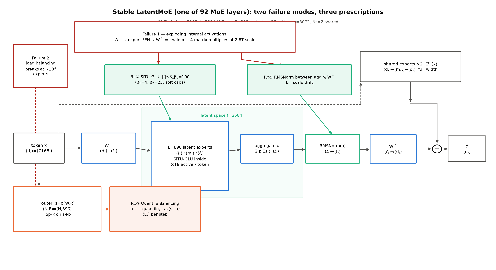
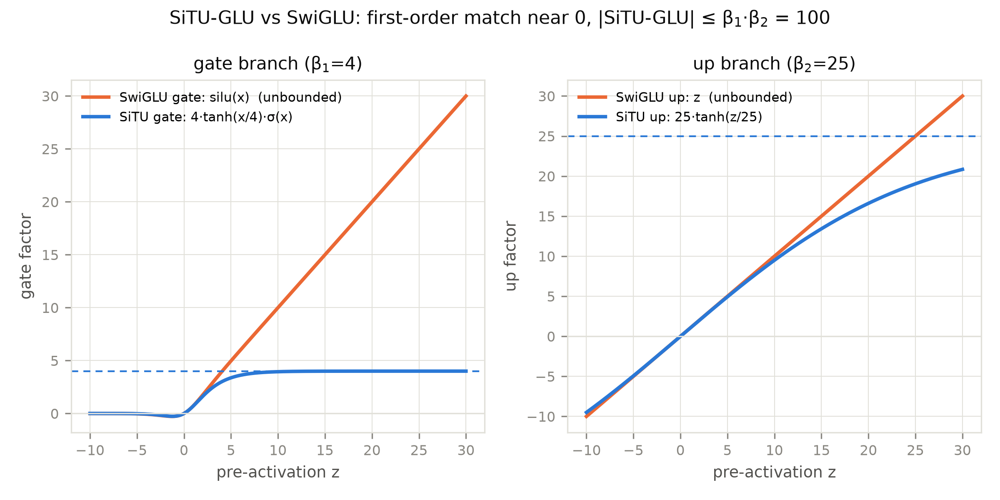
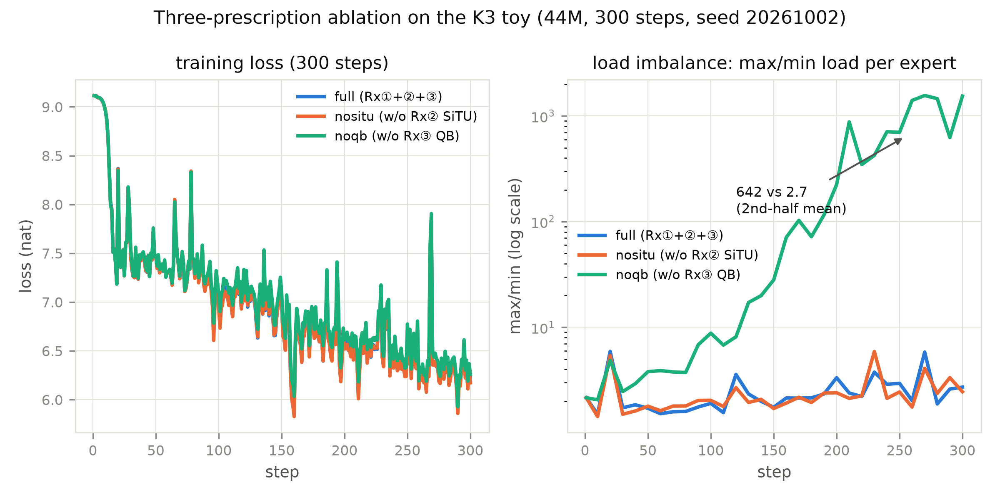

# 第 7 章 Kimi K3 报告精读·下：Stable LatentMoE、MXFP4 QAT 与原生多模态

## 7.0 开篇：从全书到这里

上一章我们把 K3 报告的注意力侧逐节读完：KDA 用每通道自己的遗忘速度改写 delta rule、Gated MLA 给 Book4 的箱子装上满秩输出门、AttnRes 把深度维的残差流换成一次检索——末了还给 43.9M 玩具装好了注意力插槽，跑通了数百步短训。注意力侧读完，K3 的故事才讲了一半：报告里真正没有先例的部分其实在**效率侧**。93 层里 92 层的前馈插槽装的是一种 2026 年才量产的东西——Stable LatentMoE，896 个路由专家里每 token 只激活 16 个（稀疏度 56:1）；权重以 MXFP4（4.25 bit）发布，而量化感知训练（quantization-aware training，QAT）从 SFT 起一路罩到 RL 结束；外加一座从头联训的视觉塔。这三件事的共同底色是**把某个维度推到极端，再用工程处方把极端变得可训**——这正是上一册留账时点名的话题。Book4 第 11 章讲 LatentMoE 机构时欠账框原话是：「Stable LatentMoE 的三件稳定化处方（聚合后 RMSNorm／SiTU-GLU 限幅／Quantile Balancing）各自怎么工作、为什么在『896 选 16』的极端稀疏下缺一不可——那才是它的正菜，→ **Book5 第 7 章**」【Book4 ch11 欠账框原文直引】。这张欠账单现在到期了，本章逐件回答。

按旅程地图，本章是 K3 精读的下半场，也是「真机精读」一段的收官站。要回答三个问题：896 选 16 的 MoE 为什么不训崩（三处方各治哪种死法）？QAT 是从哪一步开始量化的（边界逐字核死）？原生多模态与 LLaVA 式后接差在哪（官方原句为准）？产出四样：一张失效模式↔处方一一对应表（表 7.1，B4-6 的机制答案）、一张 QAT 谱系对照表（表 7.2，B4-3 的兑现）、一本潜空间几何账（$k\times$宽度守恒）、以及玩具效率侧的三处方消融与量化双臂实验。到章末，K3 的注意力侧与效率侧合璧，2026 旗舰的完整配方预演完毕——下一章收束到长上下文的两条哲学。

> **最小背景栏**（已学指回，本章不重教）：LatentMoE 机构（下投影电梯 $W^{\downarrow}$、潜宽 $\ell$、扩群、共享专家不搬家）＝Book4 第 11 章式 (11.1)/(11.2)——本章只教 K3 的 diff 与稳定化件；MoE 四步机构与 DeepSeekMoE 细粒度、共享专家、免损失均衡（noaux）＝Book4 第 2/5 章；MXFP4 格式课（块 32、E8M0 共享指数、4.25 bit/参数）与 gpt-oss 的 post-trained 量化＝Book4 第 7 章式 (7.2) 与考据框；MTP＝Book4 第 8 章；ViT（patch 化＋注意力编码器）＝Book4 第 7 章 ViT-22B 一句带过，多模态正身在下一站第 10 章 10.2（卷级大纲已将 ViT 速览挪往彼处）；K3 整机、3:1 层带与分类型账本＝第 6 章（上一章）。引用纪律承 6.0 开篇：K3 每句机制断言带报告节号＋页码，双锚口径「arXiv:2607.24653＋本地 PDF」；报告图 CC BY-NC-ND，本章三图全部从零原创。

## 7.1 Stable LatentMoE：极端稀疏下的三张处方

先把部件放回整机。K3 共 93 层：第 1 层是 dense 前馈，其余 92 层每一层的前馈插槽都是一台 Stable LatentMoE——上一章图 6.1 里每个注意力层旁边配的那台 FFN 就是它。config 一侧的字段与报告 Table 1 逐位互证【证据等级：config 逆向 + 官方技术报告 arXiv:2607.24653（本地 PDF）§3.2 Table 1 p11】：隐维 $d{=}7168$ 不变，潜宽 $\ell{=}3584$（Table 1 原文标注 "(0.5×)"）、每专家中间宽 $m{=}3072$、路由专家 384→896、每 token 激活 8→16、共享专家 1→2、激活函数 SwiGLU→SiTU-GLU。报告总述句值得逐字看：LatentMoE "separating the full model width from the routed-expert width: shared experts retain a full-width path… whereas specialized routed experts operate in a compact latent space of width $\ell$"，由此 "scale channel mixing to 896 routed experts with 16 active experts per token, corresponding to a sparsity of 56"【证据等级：官方技术报告（本地 PDF）§2.3 p6】。机构承 Book4 第 11 章——门口下投影、专家住潜空间、出口上投影、共享专家不搬家——K3 的整机公式是（报告 Eq. 11，本章记作式 (7.1)）：

$$u=\sum_{i\in T_k(x)} p_i\, E_i^{\text{routed}}\big(W^{\downarrow}x\big),\qquad y=\sum_{j=1}^{N_s} E_j^{\text{shared}}(x)\;+\;W^{\uparrow}\,\mathrm{RMSNorm}(u) \tag{7.1}$$

用人话说：路由支路先把 token 压进 $\ell$ 宽的潜楼层、被选中的 16 个专家各自算一遍再按门控加权并成 $u$，然后**先归一、再升维**回全宽，与两个全宽共享专家的输出相加。与 Book4 式 (11.1) 逐项对照，diff 只有一处显式新件——聚合与上投影之间的那个 RMSNorm（处方一，马上讲）；符号表与形状流转如下（$N$ 为展平 token 数）。

| 符号 | 含义 | 形状 |
|---|---|---|
| $x$ | 进入该层的隐状态 | $(B,n,d)$，$d{=}7168$ |
| $W^{\downarrow}$ / $W^{\uparrow}$ | 潜下/上投影（两部电梯，全层共享） | $(\ell,d)$ / $(d,\ell)$，$\ell{=}3584$ |
| $E_i^{\text{routed}}$ | 潜宽专家（SiTU-GLU，中间宽 $m$） | $(N_i,\ell)\to(N_i,m)\to(N_i,\ell)$，$m{=}3072$ |
| $p_i$ / $T_k(x)$ | 门控权重 / 选中专家集（QB 规则定，式 (7.3)） | 每 token $k{=}16$ 个 |
| $u$、$\mathrm{RMSNorm}(u)$ | 聚合量 / 处方一的归一化 | $(N,\ell)$ |
| $E_j^{\text{shared}}$ | 全宽共享专家 ×2 | $(N,d)\to(N,m_s)\to(N,d)$（$m_s$ 未披露） |

单 token 走一遍：$(1,7168)$ 过 $W^{\downarrow}$ 压成 $(1,3584)$，寄往 16 个专家各算一遍 $(1,3584)\to(1,3072)\to(1,3584)$，加权并成 $(1,3584)$，归一后过 $W^{\uparrow}$ 回 $(1,7168)$，与共享支路相加写回残差河。

**几何账：通信不动，产能三倍。** Book4 第 11 章的扩群配方 $E'=E\cdot d/\ell$ 在 K3 身上给出 $384\times2=768$，实配 896（$\times2.33$）——比配方更激进，如实登记、不硬凑。真正逐位闭合的是**每 token 激活潜预算**（$k\times$宽度）：K2 全宽 $8\times7168=57{,}344$，K3 潜宽 $16\times3584=57{,}344$——分毫不差【证据等级：config 逆向（自算，输入=Table 1）】。激活份数翻倍、专家宽度减半，逐 token 的派发载荷一动不动；而按「产能 $\propto k\times m$」的口径，非线性预算从 $8\times2048=16{,}384$ 涨到 $16\times3072=49{,}152$（3.0 倍）——通信持平、产能三倍。零钱两笔：单专家权重读取 $3\ell m=33.0\text{M}$（K2 全宽 $3dm=44.0\text{M}$ 的 0.75 倍——潜宽减半被 $m$ 增 1.5 倍吃回一部分）；路由专家群仓库 $896\times33.0\text{M}=29.6\text{B}$/层、92 层约 2.72T，占官方总参 2.78T 的绝对大头【证据等级：config 逆向（自算）】。

> **【考据框】跨册口径 W10：「薄四倍」是 Nemotron 3 的几何，不是 K3 的。**Book4 第 11 章收束句把 Nemotron 3 的比喻（$\ell=d/4$「薄四倍、多开四倍分店」）延续到了 K3 句上；K3 自己的 Table 1 是 $\ell=0.5\times d$（薄两倍）、专家数 2.33 倍、激活数 2 倍。本册一律钉 K3 口径（0.5×/2.33×/2×/$k\times$宽度守恒），Book4 成稿不回改——对读时以本框为准。

机构讲完，病灶登场。报告把「为什么缺一不可」的病根写成两句原话，逐字照录：极端稀疏放大了原始设计的两种失效——路由支路把 $W^{\downarrow}$、门控多分支专家网络与 $W^{\uparrow}$ 串成「**近四次连续矩阵乘的链**」，这一病态结构叠加 2.8 万亿参数规模，「**produces exploding internal activations in the routed branch**」；而对近千个专家做负载均衡，「**exceeds the regime in which existing auxiliary-loss-free bias updates remain well behaved**」【证据等级：官方技术报告（本地 PDF）§2.3 p6-7】。一句话拆开：**病①是激活爆炸**（长乘法链在 2.8T 规模上失控），**病②是均衡失灵**（免损失偏置更新在近 $10^3$ 专家档位出格）。三张处方与两处病灶一一对应（图 7.1、表 7.1）：处方一、二治病①，处方三治病②。



图 7.1 Stable LatentMoE 三处方分工（自绘——报告图 CC BY-NC-ND 禁用，从零原创；数值取 Table 1）。路由支路 $W^{\downarrow}\to$ 潜专家 $\to u\to$ RMSNorm $\to W^{\uparrow}$ 与全宽共享支路并排；两张失效模式笺（红）挂在病灶上、三张处方笺（青）各指其处；每个张量框标形状。复现：`python "[`code/ch07/fig_ch07.py`](code/ch07/fig_ch07.py)" --which rx`（秒级）。

**处方一：聚合后 RMSNorm（Normalized LatentMoE）。**$u$ 的尺度天生不安分——「which can vary with the selected experts and their routing weights」：这次选中哪 16 个专家、门控多大，$u$ 的整体幅度就漂一次。原始 LatentMoE 直接拿这个漂移的 $u$ 过 $W^{\uparrow}$；K3 在两者之间插一道 RMSNorm（式 (7.1) 已含），报告的机制句是这「**reduces the sensitivity of the routed branch to scale variation before it is combined with the full-width shared branch**」【证据等级：官方技术报告（本地 PDF）§2.3.1 p7】。用人话说：路由支路先把自己的尺度「忘掉」，再与量纲稳定的全宽共享支路相加。诚实条款：报告对处方一只有定性句「consistently improves validation loss and downstream benchmarks」，全报告**没有三处方的分项消融数字**——量化演示只能靠本册玩具实验补（7.6 节），引用时勿虚构精度。

**处方二：SiTU-GLU（Sigmoid Tanh Unit GLU，报告命名）——有界的 SwiGLU。**病①的另一半在专家内部。SwiGLU 的两个乘性因子都无界，"coincident large coordinates can produce activation outliers and increase overflow risk in **low-precision arithmetic**"【§2.3.2 p7】——注意这句话直接与 7.2 节的 MXFP4 咬合：限幅是为低精度算术铺路的。SiTU-GLU 的做法是给两支各加一顶**软盖**（softcap）：

$$\mathrm{softcap}(x,\beta)=\beta\tanh\!\Big(\tfrac{x}{\beta}\Big),\qquad \mathrm{SiTU}\text{-}\mathrm{GLU}(x)=\Big[\beta_1\tanh\!\Big(\tfrac{W_g x}{\beta_1}\Big)\odot\mathrm{Sigmoid}(W_g x)\Big]\odot\Big[\beta_2\tanh\!\Big(\tfrac{W_u x}{\beta_2}\Big)\Big] \tag{7.2}$$

用人话说：gate 支与 up 支的线性因子各被 $\tanh$ 压进 $[-\beta_1,\beta_1]$ 与 $[-\beta_2,\beta_2]$（$\beta_1{=}4$、$\beta_2{=}25$【§2.3.2 p8；config `activation_situ_beta=4.0/linear 25.0` 互证】），于是整个乘积 $|f|\le\beta_1\beta_2=100$（报告 Eq. 19）。附录 B 给了三条数学性质【App B p43】：其一，$\beta\tanh(z/\beta)=z+\mathcal{O}(z^3/\beta^2)$，原点附近**一阶贴合 SwiGLU**——限幅不改变常规区间的行为；其二，$\beta_1,\beta_2\to\infty$ 时逐点回收 SwiGLU——它是 SwiGLU 的有界化，不是新激活函数；其三，与硬裁剪不同，"the smooth cap preserves nonzero gradients away from saturation boundaries"——饱和区外梯度不死。最后这条与 gpt-oss 形成对照：gpt-oss 对专家 SwiGLU 用的是 gate 7.0/up ±7.0 的**硬 clamp**（Book4 第 7 章表 7.3 已核），K3 用软盖换训练行为——同一病灶、两种刀法（图 7.2）。



图 7.2 SiTU-GLU vs SwiGLU 的标量响应（自产，CPU 秒级）：gate 支 $4\tanh(z/4)\cdot\sigma(z)$ 封顶 $\pm4$、up 支 $25\tanh(z/25)$ 封顶 $\pm25$，近原点与 SwiGLU 几乎重合（一阶贴合），远端封顶——$|{\rm SiTU}|\le\beta_1\beta_2=100$。复现：`python "[`code/ch07/fig_ch07.py`](code/ch07/fig_ch07.py)" --which situ`。

**例 7.1（构造例）** 取 gate 预激活 $z_g{=}8$、up 预激活 $z_u{=}50$——一组「恰好同大」的坐标，看限幅怎么夹住输出。三步走：

1. SwiGLU：$\mathrm{silu}(8)\times50\approx 8.00\times50\approx 400$——两支无界，乘积随坐标一起起飞。
2. SiTU gate 支：$4\tanh(8/4)\cdot\sigma(8)=3.856\times0.9997=3.855$（$\le\beta_1{=}4$）。
3. SiTU up 支：$25\tanh(50/25)=25\times0.964=24.10$（$\le\beta_2{=}25$）；乘积 $3.855\times24.10=92.9\le100$。

效果读法：同一组输入，SwiGLU 给 400、SiTU 给 93——盖子不在常规区间碍事（$|z|\le1$ 内偏差 $\le0.02$，Eq. 18 余项），只在乘积将要冲出百位时把它按住。低精度算术里最怕的就是这种偶发大坐标。

**处方三：Quantile Balancing（分位数均衡）——均衡问题变成求分位数。**病②要先看旧药为什么失灵。K3 承 DeepSeek-V3 一线的免损失路由（Book4 第 5 章 noaux 阀门）：router 打分 $s_i=\mathrm{Sigmoid}(W_r x_i)$，派发按加偏置的分、混合权重按裸分归一（报告 Eq. 13，本章式 (7.3)）：

$$T_i=\mathrm{argtopk}_k\big(s_i+b\big),\qquad p_{i,j}=\frac{s_{i,j}}{\sum_{r\in T_i}s_{i,r}},\ j\in T_i \tag{7.3}$$

用人话说：$b$ 只决定「派不派」，不进权重也不进梯度——"it regulates dispatch without altering the mixture weights or the gradient-based optimization of the router"【§2.3.3 p8】。旧药是固定步长的符号更新 $b^{(t+1)}_j=b^{(t)}_j+\gamma\,\mathrm{sign}(\bar\ell-\ell^{(t)}_j)$，报告点破它的两难：$\gamma$ 大了负载震荡、小了追不上——"trades off slow adaptation against load oscillation"；专家池扩到 896 个后，不均衡既拖慢训练又让部分专家欠训【§2.3.3 p8】。QB 的换法是把「调偏置」从梯度式的试探改成**一步到位的闭式解**：一批 $m$ 个 token、$n$ 个专家、每人选 $k$ 个，目标负载 $q:=mk/n$；单次前向顺带取每个 token 的第 $(k{+}1)$ 名作截止线 $\alpha_i$（Top-$(k{+}1)$ 路由白送，不必另算 token 侧分位数）；令专家 $j$ 的过线数恰等于 $q$，单调性给出闭合解（报告 Eq. 14）：

$$\hat b_j\;\leftarrow\;-\,\mathrm{quantile}_{1-k/n}\big(s_{:,j}-\alpha\big),\qquad b\;\leftarrow\;\hat b-\mathrm{mean}(\hat b)\,\mathbf 1 \tag{7.4}$$

用人话说：把专家 $j$ 全批打分减去各 token 的截止线，取 $(1-k/n)$ 分位数取负——这个偏置恰好让第 $q{+}1$ 名压线，负载一步配平；第二行去公共偏移（不改 Top-k），且偏置只影响下一批——「a batch is never routed with a bias derived from itself」【§2.3.3 p8】。直觉例子里数字最小，先跑给你看。

**例 7.2（构造例）** $m{=}8$ 个 token、$n{=}4$ 个专家、$k{=}1$（每人只选 1 个），则 $q=mk/n=2$——每专家该接 2 单。打分矩阵自造（近缝翻转设计，与报告 Fig. 5 同构；本册 `latentmoe_parts.py::qb_small_example` 可逐步复算），无偏 top-1 负载是 $(4,3,1,0)$：专家 0 接 4 单爆仓、专家 3 颗粒无收。三步走：

1. **算截止**：对每行取 biased 分的第 2 大（$k{+}1{=}2$）作 $\alpha_i$——每个 token「差一点没进」的那条线。
2. **交替取分位数**：沿专家轴对 $s_{:,j}-\alpha$ 取 $(1-k/n){=}0.75$ 分位数（降序第 $q{+}1{=}3$ 大）、再沿 token 轴回代，数步后对偶解收敛到 $\beta=[+0.030,\,+0.020,\,-0.008,\,-0.006]$——派发分 $=s-\beta$：热门专家 0/1 被罚约 0.03/0.02，冷门专家 2/3 得约 0.006-0.008 的补贴。
3. **重派发**：按 $s-\beta$ 重新 top-1——两行从专家 0 翻到专家 3（缝只 0.02，一推就翻）、一行从专家 1 翻到专家 2，负载 $(2,2,2,2)$，**一步配平**。

效果读法：偏置只有百分位的量级（缝宽 0.02-0.03），翻的恰恰是「本来就犹豫」的边缘 token——赢者通吃被三记轻推拆掉，而每个 token 的选择仍由打分说了算。

这套更新为什么「快而无超参」？附录 C 给出深层结构：QB 是**最大分数均衡指派**线性规划的**对偶坐标最优解**——对偶变量 $\alpha_i$（token 侧）与 $\beta_j$（专家侧，$b=-\beta$）沿两个轴交替取同一种分位数闭合解，"the same quantile along the token and expert axes, which gives the method its name"【App C p43-44】。旧的符号更新在这个视角下只是同一对偶目标的一步 SignSGD——它只保留负载误差的方向，"whereas QB jumps directly to the exact coordinate minimizer of the same dual objective"——无学习率型超参、且 "equilibrates within a few update steps even for nearly $10^3$ experts" 两件事由此同时得解【App C p44】。规模化落地靠附录 D 的直方图：全训练步 gather $O(mn)$ 个 margin 不可行，改为对 required bias $r_{i,j}:=\alpha_i-s_{i,j}$ 做 per-expert 直方图累积（$B{=}1000$ 箱、每步一次整数 all-reduce），误差以箱宽为界、实测 "a few $10^{-3}$" 且 "no measurable residual load imbalance"，通信量低于逐 margin 交换的 1%，估的是池化全局分位数而非各 rank 分位数的平均【App D p44-45】。部署侧最干净：偏置冻结即可——"at deployment, routing is a fixed Top-k selection with a frozen bias, and no quantile computation is needed"【App C p44】。谱系一句：指派视角上承 BASE 与 BIP（BIP 只能压过热、不能扶过冷），出发点与苏剑林 2026 年 2 月的中文先行讨论同路【App C p44；报告引文 [68][118][113]】。

**实物 7.1**（按报告 Alg. 1 思想自写的 toy 版伪代码，$m{=}8,n{=}4,k{=}1$ 参数版；看什么——「报告给了完整可照写实现的算法」长什么样：两个分位数、一个 argtopk，再无其他；报告锚=App C p44 Alg. 1，此处为自写实现、非直译原文框——文字源纪律）

```text
输入: 打分矩阵 s ∈ (0,1)^{m×n}（本例 8×4，Sigmoid 打分）；k=1；q = m·k/n = 2
初始化: β = 0 ∈ R^n
重复 T 次（本例 T=8，两三步即收敛）:
    α_i ← s 第 i 行按 s_i − β 降序的第 (k+1)=2 大值      # token 侧截止线, ∀i ∈ [m]
    β_j ← s 第 j 列按 s_{:,j} − α 降序的第 (q+1)=3 大值    # 专家侧分位数, ∀j ∈ [n]
输出: 派发 = argtopk_k(s − β)（逐 token）；负载 (2,2,2,2) ✓   # 部署时 β 冻结，仅此一行
```

三张处方合起来，就是 B4-6 那句「缺一不可」的机制答案——表 7.1 收拢。

**表 7.1** 失效模式↔处方一一对应（报告锚均为 arXiv:2607.24653 本地 PDF）

| 病灶 | 症状 | 处方 | 机制一句话 | 报告锚 |
|---|---|---|---|---|
| 病①a 尺度漂移 | $u$ 幅度随选中专家组漂移 | ①聚合后 RMSNorm | 升维前先归一，路由支路对尺度失忆 | §2.3.1 p7 |
| 病①b 激活尖峰 | 无界乘积偶发大坐标→低精度溢出 | ②SiTU-GLU（$\beta_1{=}4,\beta_2{=}25$，$\lvert f\rvert\le100$） | 软盖封顶、原点一阶贴合、梯度不死 | §2.3.2 p7-8＋App B p43 |
| 病② 均衡失灵 | 近 $10^3$ 专家下 sign 更新震荡/过慢 | ③Quantile Balancing | 分位数闭式解一步跳到对偶坐标最优 | §2.3.3 p8＋App C/D p43-45 |

## 7.2 MXFP4 QAT：量化感知训练伸进全后训练

第二件事兑另一笔账。Book4 第 7 章讲 gpt-oss 的 MXFP4 时留了半句：「低精度训练的下一站（K3 的 MXFP4 QAT 路线）→ **Book5 第 7 章**」【Book4 ch07 欠账框原文直引（后半句）】。现在逐字核死这一站。报告两处原句互证：SFT 侧（§4.1.1 p12）"we apply quantization-aware training (QAT) from the SFT stage onward, with MXFP4 weights and MXFP8 activations"；部署侧正身段（§4.1.4 p14）说得更全——MoE 专家权重（占参数内存大头）量化到 MXFP4、激活按 MXFP8 计算，"while all non-expert components (attention projections, **latent MoE projections**, shared experts, and MoE routers) remain in higher precision"，并且 "quantization-aware training throughout the entire post-training stage, covering both SFT and RL"；RL 期间 "rollout and training share the same quantization scheme — eliminating the train–inference mismatch"【证据等级：官方技术报告（本地 PDF）§4.1.1/§4.1.4 p12/p14】。三件事从原句立起来。**其一，边界**：QAT 起于 SFT、覆盖整个后训练——不是从头（预训练配方 §3.3 无任何量化字样，训练加速用的激活侧分块 FP8 是 Book4 已教的另一码事），也非仅预训练；写作时勿写成「全程 QAT」。**其二，分区**：量化只落在路由专家内部的三矩阵上，而 $W^{\downarrow}/W^{\uparrow}$ 等**潜投影明确写进保精度名单**——7.1 节刚讲过那条「近四次矩阵乘」的病态链，病链上不叠加量化噪声，这正是处方①②与量化分区的互相咬合。**其三，负结论如实记**：QAT 前后的掉点数字报告**未披露**（模型卡也只有同一句口径），任何精度声明都无处对账。

config 与卡面双双落地：`quantization_config` 为 compressed-tensors 的 mxfp4、group 32【证据等级：config 逆向】，模型卡第 4 节原文 "Kimi K3 applies quantization-aware training from the SFT stage onward, using MXFP4 weights with MXFP8 activations for broad hardware compatibility"【证据等级：厂商自报】。放进谱系表（表 7.2）看更清楚——K3 是本册旗舰里**官方明写 QAT 的第一家**，与 gpt-oss 的「post-trained…quantization」（Book4 考据框核过：通篇无 QAT 字样）构成两条路线，DSV4 则居中（也压专家与索引器 QK 路径，预览版论文口径）。

**表 7.2** 训练侧低精度谱系：三家对照（格式课统一指回 Book4 第 7 章）

| 维度 | gpt-oss | Kimi K3 | DSV4（预览版） |
|---|---|---|---|
| 官方措辞 | "post-trained…quantization"（无 QAT 字样） | "quantization-aware training (QAT)" | MXFP4 QAT 打点=专家权重＋索引器 QK 路径 |
| 覆盖阶段 | 后训练阶段带量化（预训练循环未说） | **SFT 起、覆盖 SFT+RL，rollout 同方案** | 预览版论文（引用一律走本地 PDF） |
| 部署激活 | BF16 | **MXFP8** | FP8 |
| 保精度件 | embedding/attention/router/norm/头 | ＋**latent MoE 投影**、共享专家 | 索引器非 QK 路径等 |
| 掉点数字 | 未报 | **未报** | 未报 |

【证据等级：官方论文 2508.10925 §2.1；官方技术报告 arXiv:2607.24653 §4.1.4；官方论文·预览版 2606.19348】

## 7.3 原生多模态：MoonViT-V2 一瞥

第三件事只讲事实级——多模态的正身在下一站。先挂号术语：**原生多模态**（native multimodality，语言与视觉从头联合训练）对**后接式**（先训好语言模型、再缝合视觉编码器）。视觉塔 MoonViT-V2 是一座 27 层、约 0.4B 参数的 ViT 变体（Table 1：401M、patch 14、12 头；采用 RMSNorm 并去掉全部 bias 项），图像与视频**共享全部参数**，注意力按「帧内空间＋帧间时间」分解，时间池化再压 token；进投影器之前先做 $2\times2$ pixel-shuffle 下采样，把视觉 token 数砍到四分之一【证据等级：官方技术报告（本地 PDF）§2.4 p9-10】。这笔账可以自算：一张 $3584\times3584$ 的图按 patch $14^2$ 切出 $256\times256=65{,}536$ 个 patch，除以 4 得 **16,384 个视觉 token/图**——约占 1M 窗口的 1.6%【证据等级：config 逆向（自算）】。「一张图≈一万六千个词」，这是留给第 10 章 prefill 账的半句预热（F13）。

真正值得逐字的是训练范式。报告 §3.3 原句：K3 采用 "a native multimodal training strategy in which language and vision are jointly optimized **from the start of training**"，而非 "**grafting** a vision encoder onto a pre-trained language model through a **post-hoc alignment stage**"；图文 token 交错进同一个下一 token 预测目标【§3.3 p11】。这就是 LLaVA 式「后接」路线的官方否定句——但注意否定的是「预训练后再缝合」这个**阶段**，不是 projector 部件本身：MoonViT-V2 之后仍有一座轻量 MLP 投影器把视觉特征送进共享嵌入空间【§2.4 p10】。为什么敢从头联训？报告给了消融（Fig. 6）：从 SigLIP 对比预训练初始化的编码器在联合优化下梯度范数持续偏高且频繁尖峰，from-scratch 的 MoonViT-V2 全程稳定；且下一 token 目标直接塑造表征，而不被「偏全局语义」的对比损失带偏。结论句带反直觉：「MoonViT-V2 matches the SigLIP-initialized baseline across vision evaluations, indicating that **contrastive pre-training is unnecessary as an initialization** for multimodal language models at scale」【§2.4 p9，厂商自报】。原生与后接两条路线的完整对照留给第 10 章 10.3，此处只立事实。

## 7.4 推理范式与长上下文：1M 档位与一笔 nuance

效率侧读完，长上下文的档位归属在这里补最后一块事实（两条哲学的收束归下一章）。K3 的窗口课程是四段渐进：预训练 8K→64K，cooldown 阶段 256K→1M——「Concentrating the costly long-sequence computation within a small fraction of the overall training budget keeps the curriculum economical」【§3.4 p12】；配合全模型无显式位置编码直推 1M（机制与 B3-7 的落点在上一章 6.4，哲学收束在下一章）。1M 的实用性有一笔值得记录的 nuance：BrowseComp 评测采用 300K token 触发的上下文压缩策略时得 **91.2%**，而 "evaluated with the full 1M-token context window and no context management, Kimi K3 achieves **90.4%**"【§6.1.3 p26，§6.1 主表 p27——厂商自报＋摘要级标注（评测章本册只摘要级引用；该句已回读本地 PDF p26 销项）】。压缩前后差 0.8 个点——「1M 窗口」与「1M 窗口的日常用法」是两个工程命题。评测口径一句：全部 K3 评测用 reasoning effort max、温度 1.0【§6.1.3 p26】；三域×三档共九个推理努力专家与预算课程是能力侧话题，第 10 章 10.4 展开。

部署侧还有两件与后训练咬合的事实，只登记不展开。其一，MTP 层的归宿：报告说 K3 预训练带一个镜像骨干块结构的 MTP 层、后训练中 "fine-tune the pre-trained MTP layer into an EAGLE-3-style draft model"（LK 损失直击接受率，Eq. 16），且草稿层微调沿用同一量化配置【§4.1.4 p14】；而发布权重的 config `num_nextn_predict_layers=0`——**不带 MTP 层**。config 与报告的这条差异按纪律作事实句记下（勿写「K3 无 MTP」）。其二，KDA 的循环状态在服务侧与验证回滚存在张力（"cannot be trivially rolled back"，解法=只缓存投影输入、片上重建状态）【§5.4.2 p24】。

> **【欠账】** K3 报告的 MTP→EAGLE-3 合流与 KDA 状态回滚张力——两个「训练线与推理栈合流」的报告事实句，机制与系统侧展开 → **Book6 第 10 章**。

## 7.5 训练 infra 速览（半页）

infra 一节按大纲压成速览，三件事实带走。其一，**2.5× 是效率口径**：相对 K2 的整体缩放效率提升约 2.5 倍（同验证损失下 FLOPs 轴的差距，Fig. 7）【§3.2 p10-11，厂商自报】——而绝对算力账（训练 token 总量、集群规模、MFU）报告全部未披露，第 11 章「读厂商自报」章会拿它当「不披露也是信息」的案例。其二，优化器延续 K2 线：Per-Head Muon（Newton–Schulz 正交化沿头维切分、逐头做——大梯度头不再主导共享更新方向）＋K2 的 weight-clipping 机制原样保留，cosine 学习率＋1% warmup、weight decay 0.1【§2.5 p10、§3.3 p11；Muon 承 Book4 第 7 章】。其三，报告 §7 的三个案例是本书方法论的绝佳呼应：24 小时预算内自主优化 GPU kernel（AttnRes 路径时延 283.6→114.4 ms）、从零写出 MiniTriton 编译器、48 小时自主设计推理芯片原型——芯片规格是**同架构缩微**：hybrid KDA＋NoPE-MLA、Block AttnRes 块大小 2、sigmoid MoE 路由＋1 共享专家、group-wise INT4（组 128），4 mm² @ 100 MHz、仿真解码 8,700 token/s【§7 p33-34，厂商自报】。K3 在 48 小时里给自己造了个玩具替身——「把要造的机器缩微成自己能造的版本」，正是本册从 43.9M 玩具到三刀机一直在做的事。并行与内存侧的工程件（MoonEP 等）已开源，此处只挂名。

## 7.6 K3 玩具·效率侧：三处方换装与量化双臂

玩具底盘是上一章的 K3Toy（44,277,936 总参的 kda 臂）；本章把它的 8 层 MoE 插槽逐层换成三处方合一的 `StableLatentMoE`——几何取 K3 同构缩微：$d{=}512$、$\ell{=}256$（0.5×d）、$m{=}256$、$E{=}64$、top-4、全宽共享专家，三开关 `use_rmsnorm/use_situ/use_qb` 就是三张处方（[`code/ch07/latentmoe_parts.py`](code/ch07/latentmoe_parts.py)，与 Book4 `moe_mla_slots` 训练环同配方）。先跑秒级单元件：QB 小例（例 7.2 的正身）无偏负载 $(4,3,1,0)$ **一步交替即 $(2,2,2,2)$**（$\beta$ 取值与手算一致）【本书实验，CPU fp32】；SiTU 四断言全过——$|{\rm softcap}|\le\beta_1$、$|z|\le1$ 区一阶贴合最大偏差 $2.03\times10^{-2}$、$\beta\to\infty$ 回收偏差 $9.5\times10^{-7}$、软盖梯度非零存活；部署一致性断言（冻结 $\beta$＋argtopk 与 QB 指派逐行集合相等）也写成单元测试过掉。

> **【考据框】QB 的适用域（玩具边界教训）。**「few steps equilibrate」对**训练态近均匀的 Sigmoid 打分**成立；缝宽任意的构造矩阵下，交替 QB 可停在**对偶不动点而非逐位配平**——实测一例停在 $(3,3,1,1)$，$\beta$ 已收敛不动，但 greedy argtopk 在近缝/平局处的取整残留不均。本册口径：QB 保证对偶最优，不保证 greedy 取整逐位配平【本书实验；报告适用域声明见 App C p44】。

换档实验兑现「$k\times$宽度守恒」的玩具同构：主档 $E{=}64$/top-4/$\ell{=}256$ 与换档 $E{=}256$/top-8/$\ell{=}128$，激活潜预算 $4\times256=8\times128=1024$ 逐位相等；参数账另报（主档 MoE 插槽 13,271,296/层、换档 13,041,792/层——大纲口径：换档另报账、主账仍 toyA）。对照 K3 的 $16\times3584=8\times7168$：**扩专家数、减专家宽、激活潜预算不动**这行等式，在 43.9M 与 2.8T 两档都成立。

**三处方 ablation（判据预注册跑在前头）。**三臂同参（②是激活换装、③是路由规则换装，参数全同；①只差 $\ell$ 个 RMSNorm 权重，<0.002%）：full／去②（SwiGLU）／去③（偏置恒零的裸 sigmoid topk），各 300 步（seed 20261002）。结果对号入座【本书实验，MPS bf16 autocast】：

- **处方③强复现（分支 A）**：去③ 臂专家负载 max/min 后半程均值 **642**（轨迹 300→880 震荡上行）对 full 臂 **2.7**——差 238 倍；前两名专家负载份额 0.153 对 0.045（3.4 倍），无均衡的 sigmoid topk 向赢者通吃滑去，loss 同步最差（6.259 对 6.193）。「③治塌缩」在玩具档成立——图 7.3 右 panel 的 log 轴就是这条 642 对 2.7 的裂口。
- **处方②方向命中、幅度不足（分支 B，规模绑定声明）**：去② 臂激活峰值均值 15.6 对 full 12.8（比率 1.22，未达预注册的 2× 门槛），两臂都远离危险区（有界臂到 300 步也只长到 23<100）。按预注册如实写：**失效模式绑定 2.8T/896 专家/低精度算术的规模（报告原口径），玩具 44M/300 步/bf16 不复现爆炸≠处方无效**；本册演示的是机制件与测量口径本身。零钱一笔：SiTU 的 tanh 带来约 12% 前向开销（2.72 对 2.43 s/step）——限幅是为稳定性付费、不是为 loss。
- **处方①的对象存在**：聚合量 $u$ 的 rms 沿训练从 0.0017 漂到 0.69——尺度漂移是真的，处方①有的放矢；本批未排去①臂（报告只有定性句，预期最弱）。



图 7.3 三处方 ablation 三臂（自产，数据=实物 7.2 的 JSON）：左=loss 曲线（300 步，三臂几乎重合、去③ 最差）；右=专家负载 max/min 轨迹（log 轴）——去③ 臂 642 对 full 臂 2.7，「治塌缩」的肉眼证据。复现：`python "[`code/ch07/fig_ch07.py`](code/ch07/fig_ch07.py)" --which ablate`。

**实物 7.2**（三臂 ablation 的 JSON 读数摘录；看什么——「去③=负载塌缩」的两个量级与「去②=方向对幅度不足」的原始数字）

```text
# log/book5-ch07/train_ablate_{arm}_fast.json（每 10 步 stats_trace 的后半程均值）
full   (①+②+③): act_max 12.82 | load_max/min 2.69 | top2_share 0.045 | loss 9.115→6.193
nositu (去②)   : act_max 15.63（峰值 36.0）         | load_max/min 2.58 | top2_share 0.045 | loss 9.114→6.173
noqb   (去③)   : act_max 11.63 | load_max/min 642.1 | top2_share 0.153 | loss 9.115→6.259
# 全程 u_rms（①症状）：full 0.0017 → 0.69（聚合尺度随训练漂移——处方①的对象存在）
```

**量化双臂（qat_sim.py）。**分区照抄 7.2 节清单：只压路由专家——权重 MXFP4（STE，块 32/E8M0，复用 Book4 `fp8_sim.mxfp4_rt`）＋专家输入激活 MXFP8（E4M3＋E8M0 块 32；报告未指名 E4M3/E5M2，本件选 E4M3 并在此声明），潜投影/router/共享专家/注意力全部高精度；口径承 Book4 第 7 章：本机无原生 FP4/FP8 计算，**模拟量化**=量化-反量化 round-trip 嵌入训练循环、反传恒等（STE）。两臂谱系对照——`qat` 臂从第 1 步起量化在场（「SFT 起量化感知」的玩具模拟），`ptq` 臂全程高精度、训完一次性套量化（gpt-oss 谱系）。读数见实物 7.3。

**实物 7.3**（量化双臂读数；看什么——两件事：量化噪声在场时的可训性，与训后直接量化的跳变对照；官方掉点数字未披露，玩具读数是「本册自产＋官方无数字」的诚实组合）

```text
# log/book5-ch07/qat_sim_{qat,ptq}_fast.json（300 步，seed 20261002；分区 1536 权重 Linear＋512 专家输入）
qat 臂：loss 9.10→6.24 | 2.75 s/step（量化钩子开销 ×1.18——探针06 实测 ×1.19 同档复现）
ptq 臂：loss 9.10→6.18 | 2.33 s/step；训后一次性套量化：eval 跳变 +0.0002 nat（clean 6.2906 → quantized 6.2908）
```

两行对照的读法：**训后套量化的跳变在玩具档不可分辨**——ptq 臂训完一次性换上量化马甲，eval 只挪 0.0002 nat（6.2906→6.2908）；qat 臂从第一步就带着噪声练，收敛慢半拍（loss 6.24 对 6.18、2.75 对 2.33 s/step），量化态 eval（6.33）也未见优势。按判据预注册的纪律如实写：这是处方②同款的**规模绑定声明**——44M/300 步/bf16 模拟量化档复现不出「训后量化掉点」的失效模式，K3 把 QAT 从 SFT 起罩到 RL 的收益绑定 2.8T 参数与 MXFP4 原生算术的规模（报告失效模式明确绑定规模）；本册双臂演示的是分区与口径本身——量化钩子怎么嵌进训练循环（×1.18 开销）、「SFT 起量化」与「训后量化」两条谱系怎么落成两条 CLI。「发布格式即训练格式、mismatch 在源头消掉」是 K3 在那个规模上的动机，玩具档只立机制、不立数字；44M/bf16 模拟量化的读数不可外推到 2.8T/MXFP4 原生算术。

## 7.7 本章小结

开篇的问题逐一作答。「三处方为什么缺一不可」——因为它们治的是三种不同的死法：聚合后 RMSNorm 治尺度漂移（升维前先归一）、SiTU-GLU 治激活尖峰（软盖封顶 $\beta_1\beta_2{=}100$、原点一阶贴合、梯度不死）、Quantile Balancing 治负载塌缩（分位数闭式解一步跳到对偶坐标最优，无超参、近千专家几步配平、部署时冻结偏置零开销）——表 7.1 就是 B4-6 的完卷。QAT 的边界逐字核死：起于 SFT、覆盖 SFT＋RL、rollout 同方案；分区只压路由专家、潜投影保精度；掉点数字官方未披露。MoonViT-V2 立了原生联训的事实与「对比预训练初始化不必要」的反直觉结论。玩具侧交付了 QB 一步配平、换档守恒、三臂 ablation（③强复现、②规模绑定、①对象存在）与量化双臂。

**带走的心智**：如果细节都还回去，留三句话。**其一，读到任何「稳定化组件」，先问它治哪种死法——极端稀疏不是免费的：896 选 16 把路由支路推成近四次矩阵乘的病态长链、把均衡问题推出旧算法的适用域，三张处方各堵一个洞，缺任何一个洞都会漏**。**其二，LatentMoE 的几何账记一行等式：$16\times3584=8\times7168$——扩专家数、减专家宽，每 token 的通信不动、非线性预算三倍；「作坊变窄、多开分店」的图像承 Book4，数字一律用 K3 自己的**。**其三，量化的下一站是后训练：QAT 从 SFT 起罩到 RL、发布格式即训练格式——mismatch 在源头消掉，比训后补救便宜**。

镜头拉回全书：K3 的注意力侧（上一章）与效率侧（本章）合起来，就是 2026 旗舰配方的一次完整预演——3:1 混合注意力压上下文账、超稀疏 LatentMoE 压每 token 账、QAT 压部署账。但 K3 只是四种选法之一：位置信息「装进架构还是留给数据」这笔哲学账，GLM、Qwen、DeepSeek 各持一端——下一章把三条路线的机器放到同一张桌上，收束长上下文的两条哲学。

## 7.8 动手验证

- **三处方单元件与 QB 小例**（CPU 秒级——例 7.1/7.2、SiTU 四断言、换档守恒账、部署一致性的数字源）：
  ```bash
  cd 工作区根目录 && source env.sh && \
    python "[`code/ch07/latentmoe_parts.py`](code/ch07/latentmoe_parts.py)" --mode units --out-name run1
  ```
- **三臂 ablation**（MPS，300 步×3 臂约 25 min；图 7.3/实物 7.2 数据源；判据与结果分支预注册全文=工作区 `notes/07` §4.2，跑前落盘）：
  ```bash
  python "[`code/ch07/latentmoe_parts.py`](code/ch07/latentmoe_parts.py)" --mode ablate --arm full  --steps 300
  python "[`code/ch07/latentmoe_parts.py`](code/ch07/latentmoe_parts.py)" --mode ablate --arm nositu --steps 300
  python "[`code/ch07/latentmoe_parts.py`](code/ch07/latentmoe_parts.py)" --mode ablate --arm noqb  --steps 300
  ```
- **量化双臂**（MPS，各约 12-14 min；实物 7.3 数据源）：
  ```bash
  python "[`code/ch07/qat_sim.py`](code/ch07/qat_sim.py)" --arm qat --steps 300 --out-name fast
  python "[`code/ch07/qat_sim.py`](code/ch07/qat_sim.py)" --arm ptq --steps 300 --out-name fast
  ```
- **三图复绘**：`python "[`code/ch07/fig_ch07.py`](code/ch07/fig_ch07.py)"`（图 7.1 机制图／图 7.2 SiTU 曲线／图 7.3 ablation；秒级）。
- 验收点：能说出三处方各治哪种死法并给出报告锚；能手算 QB 小例的一步配平与 SiTU 的限幅乘积；能复述 K3 QAT 的覆盖边界与官方未披露项；能写出一档自己的 $k\times$宽度守恒换档账。
