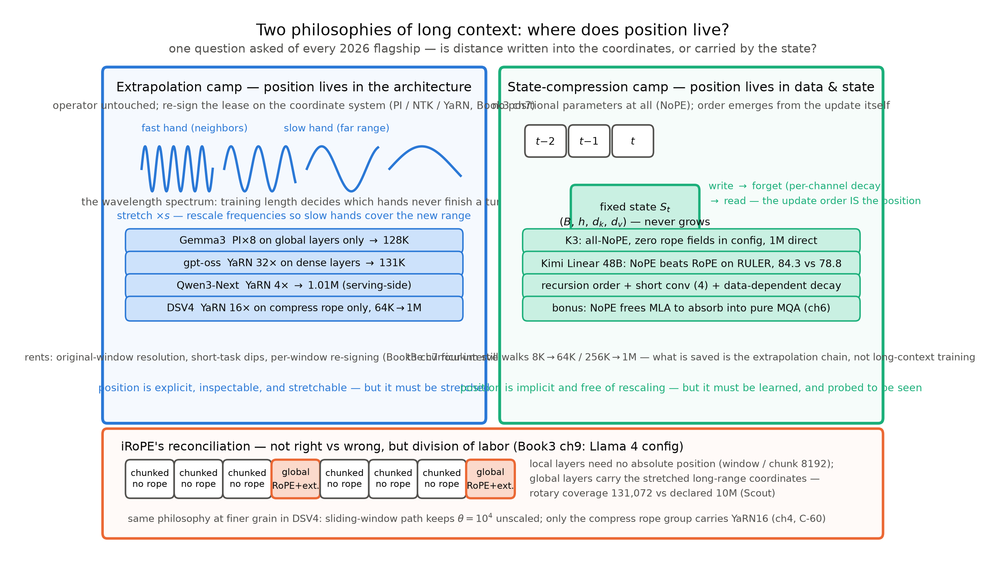
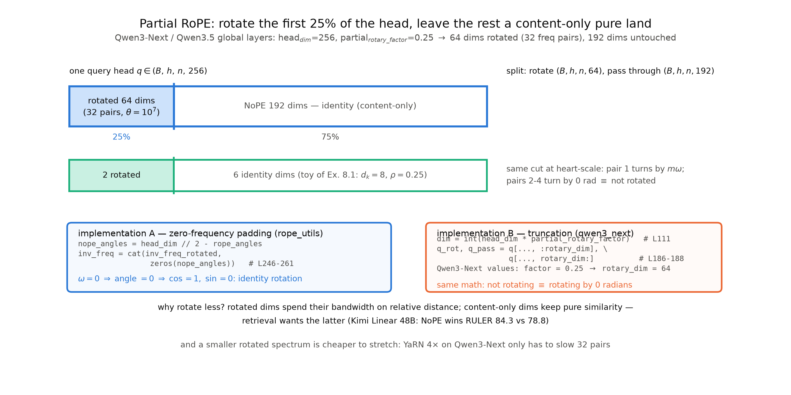

# 第 8 章 长上下文收束论：外推与状态压缩两条哲学

## 8.0 开篇：从全书到这里

上一章合上时，K3 的效率侧刚拆完，章末把话头留给了本章：『位置信息「装进架构还是留给数据」这笔哲学账，GLM、Qwen、DeepSeek 各持一端——下一章把三条路线的机器放到同一张桌上，收束长上下文的两条哲学。』【证据等级：Book5 第 7 章章末直引】这不是一句过渡客套：三条突围路线（窗口、稀疏、线性）与四台旗舰（DSV4、GLM-5(.2)、K3、Qwen3-Next）拆到此处，「注意力怎么算」的问题已经答完，而「位置信息住在哪里」这个问题，是从 Book3 就挂起、越挂越重的那笔账。Book3 第 7 章讲外推工程线时的章末欠账框写得清楚：

> 「外推不是唯一的路：把远处的信息压进固定容量的状态，是另一条哲学。两条路怎么在 2026 年的旗舰里合流（外推与状态压缩的官方调和，config 事实见第 9 章），收束论在 Book5。」【证据等级：Book3 第 7 章章末欠账框原文直引（L213）】

本章就是这张欠账单的兑付处，登记名 B3-3。连同它一起到期的还有四笔：B3-7（partial RoPE 的头维净土——「为什么旋得少反而好」）、F6（位置编码外推，2017 年的半句话承诺）、F10 与 N7（容量焦虑到上下文长度的接力棒，本章 8.6 节的档位横表是它的 1M 终局）。本章是收束论章（原理章）：不造新零件、不跑新实验——把第 1 章立的账本、第 2-5 章拆的三把刀、第 6-7 章精读的 K3、第 4 章定谳的 DSV4 全部摆上同一张桌，回答一个问题：**长上下文的两条哲学各自拿什么当证据，2026 年的旗舰各自站在哪里。**

> **最小背景栏**：本章默认你已读过 Book3 第 4 章（RoPE 机制：旋转角、波长谱）与第 7 章（外推链 PI/NTK/YaRN——「一排表针」与「租窗」两幅画是本章反复调用的图像）、第 9 章（Llama 4 config 逆向与 iRoPE 身世）；本册第 1 章 1.6 节（分类型 KV/状态账本与交叉点 $n^*$，式 (1.4)）、第 2 章 2.4 节（Gemma3/gpt-oss 的「按层分工」预告）、第 5 章 5.5 节（Qwen3-Next 整机 config）、第 6 章 6.4 节（K3 全机 NoPE（No Position Encoding，无位置编码）的双直引与 config 正身）。符号沿用：上下文长度 $n$、头维 $d_k$、RoPE 基座 $\theta$（`rope_theta`）、缩放因子 $s$、partial 比例 $\rho$（`partial_rotary_factor`）。

## 8.1 一笔挂了三册的账：位置信息到底该怎么装

把账取回来要从 2017 年说起。原典选正弦位置编码时给过一个理由，全书引过一次、这里必须再引一次，因为它是两条哲学共同的起点：

> *"We chose the sinusoidal version because it may allow the model to extrapolate to sequence lengths longer than the ones encountered during training."*（我们选正弦版本，是因为它**可能**让模型外推到训练中未见过的更长序列。）【证据等级：官方论文 v7 §3.5，承 Book1 第 11 章直引】

一个 hypothesized 级的「可能」。Book1 清算时把它登记为 F6（「位置编码外推：2017 年的半句话承诺」），并写明了大规模清偿的地址——『Book5 第 8 章收到 1M 上下文并给出「外推 vs 压缩」两条哲学的收束论』【证据等级：Book1 第 11 章成稿直引】；Book2 卷末把上下文长度立为 F10 的接力棒 N7 时，抄送了同一地址：「1M 上下文的收束论在 Book5 第 8 章（超长上下文的路线之争在第 4 章铺陈）」【证据等级：Book2 第 12 章成稿直引】。到 Book3 第 7 章，外推这一侧被打磨成完整的工程学：$2\text{k}\to32\text{k}$ 的四干预对照证明「租窗」可行但有三笔租金；章末欠账框顺手立起了「另一条哲学」这个名字。之后本册七章把另一侧的材料一点点集齐：第 5 章的 GDN 让「固定容量的状态」从概念变成可对拍的组件，第 6 章的 K3 把它推到 1M，第 2 章的 Gemma3/gpt-oss 与第 4 章的 DSV4 则演示了「按层分工」的中间形态。材料齐了，对决可以开场。

先立定义。**外推派（extrapolation camp）**：位置信息**装进架构**——模型里有一组显式的位置参数（RoPE 的频率表），每个 query/key 的距离写在坐标系的旋转角里；上下文变长，就**把坐标系拉宽**：PI 压全谱、NTK 降转速、YaRN 按快慢分工加温度（Book3 第 7 章三代配方），机器的权重一动不动。**状态压缩派（state-compression camp）**：位置信息**留给数据与状态**——模型里没有任何位置参数，次序不是被编码的、而是由「状态如何更新」**隐式承载**的：递归有先后（第 $t$ 步只能用前 $t{-}1$ 步攒下的状态）、卷积有窗口（短卷积核 4 只让近邻先行）、衰减有新近度（写得越早、留存越少）。固定状态本来就与 $n$ 无关，于是「外推」这个问题对它**根本不成立**——没有坐标系，就无需拉宽。

判别的方法简单到可以写进肌肉记忆：**拿一台机器的 config，问「位置住在哪个张量里」**。外推派的回答是一串字段（`rope_theta`、`rope_scaling`），状态压缩派的回答是「什么都没有」（K3 的 config 里连 `rope_theta` 都不存在，第 6 章 6.4 节核过）。两条哲学的正面对决见图 8.1——左边的动作对象是波长谱（拉宽），右边的动作对象是状态（写入-遗忘-读出），底带是后面 8.4 节要讲的调和。



图 8.1 两条哲学对决（自绘示意级）：左=外推派——位置装进架构，长上下文=把波长谱拉宽（PI/NTK/YaRN，表针隐喻承 Book3 第 7 章），四台代表机型与各自的缩放打法；右=状态压缩派——位置留给数据与状态（递归次序+短卷积+数据依赖衰减），K3 全 NoPE 与 Kimi Linear 受控证据；底带=iRoPE 的按层分工（Llama 4 层带 `[1,1,1,0]`×12）与 DSV4 的按 rope 组分工。数字出处见正文 8.2/8.3/8.4 节与表 8.2。

## 8.2 外推派：把坐标系拉宽

对决先从人多势众的一派开始。外推派的家底 Book3 第 7 章已经教透，这里只用一句话回炉：**外推配方全是对同一张波长谱的不同调法**——快针管近邻、慢针管远方，训练窗的长度决定哪些针从未转完一圈；PI 全谱按比例压慢、NTK 统一降转速让快针无感、YaRN 按快慢明文分工再乘温度。2026 年的新东西不在配方，而在**打到谁身上、打到多重**——按缩放的「档位」从轻到重排过去，恰好排出一条谱。

最轻的一档是 Gemma3：预训练 32K，之后用线性缩放（factor 8，PI 同族）扩到 128K，报告的原话只有一个数——"a scaling factor of 8"【证据等级：官方技术报告 2503.19786 §5.3】。关键是打的位置：**缩放只作用全局层**（10 个全局层，RoPE 基座 $10^6$），52 个滑窗层保持 $\theta=10^4$ 原样（第 2 章 2.4 节已引）——滑窗层只看 1,024 个近邻、相对位置极小，天然不需要外推。gpt-oss 同款思路换了配方：YaRN 32×，把稠密层从 4,096 拉到 131,072，原话是「extend the context length of dense layers to 131,072 tokens using YaRN」【证据等级：官方论文 2508.10925 §2.2，承 Book4 第 10 章直引】——滑窗层照样不外推；顺带还记得那个「缩放常数住实现里」的坑：YaRN 的温度 $\approx1.3466$ 不在 config 字段里，在参考实现的代码里（Book4 第 10 章已核）。

重一档的是 Qwen3-Next：$\theta=10^7$ 原生扛到 262,144，README 写明 "Context Length: 262,144 natively and extensible up to 1,010,000 tokens"——扩展靠 YaRN factor 4.0，"validated ... up to 1 million tokens"【证据等级：厂商自报（README）】。注意这个 1.01M 的身份：config 里**没有** `rope_scaling` 字段，扩展是服务口径（托管部署时启用），这与 8.6 节档位表里 Qwen3.5 的「托管」同款——**「原生」与「托管」两个词在 Qwen 系必须分开说**。

最重也最有教训的一档是 DSV4——它正是 C-60 定谳的主角。第 4 章 4.2 节给过完整判决，本章只取哲学面的结论：单看论文会说「1M 全靠训练」（58 页全文检索 `YaRN` 零次），但三个 checkpoint 的 config 都带着 `rope_scaling={type:yarn, factor:16, original_max_position_embeddings:65536}`。调和的答案是**双 rope 组分工**：主 rope（$\theta=10^4$）无任何缩放，服务滑窗层与滑窗支路；压缩 rope（$\theta=1.6\times10^5$）+YaRN×16 只打 CSA/HCA 层，且 $65536\times16=1{,}048{,}576$ 分毫不差、65536 恰是稀疏注意力引入的训练档【证据等级：config 逆向+transformers 5.18.0 `configuration_deepseek_v4.py` L294-321 源码注释+预览版论文 2606.19348 训练节三方互证；「YaRN16 在训练 64K→1M 阶段即启用」为推断级，论证见第 4 章 4.2 节】。训练阶梯 4K→16K→64K→1M 真把数据练到了 1M——所以 DSV4 的正确读法是「**数据真练到 1M**」与「**压缩域 rope 从 64K 起缩放**」并用：它不是外推派的极端样本，也不是纯训练样本，「训练 vs 外推」的二分在它身上失效。与 Gemma3/gpt-oss/Qwen 放回同一条谱上看：四家都是「都练+都缩」，差别只在档位与落点——Gemma3 轻缩（×8）只打全局层，DSV4 重缩（×16）只打压缩组。

谱上还有第五种姿势：GLM-5(.2) 干脆**没有 scaling 字段，直道加大 $\theta$**——GLM-5 是 $\theta=10^6$ 配 198K，GLM-5.2 把 $\theta$ 提到 $8\times10^6$、`max_position_embeddings` 同步跳到 1M【证据等级：config 逆向】。这正是 Book3 第 7 章 7.8 节代际账的结论在 2026 的延续：Llama 3.1 用六阶段 800B token 换 128k，走到底也是「加大 base」这一个动作——外推派各家配方再花哨，最后都在改同一件事：**让慢针在训练见过的时间内多转几圈**。

外推派的公共姿势可以一句话收拢：**位置参数是一份可以单独重签的租约**——不动权重（或只动位置参数）、把现有波长谱拉伸，就换来更大的窗。但 Book3 第 7 章的四干预对照也量过租金：2k 窗模型直测 16k 是 +1.14 nat 的软墙，PI/NTK/YaRN 分别压到 +0.44/+0.28/+0.24，且 16k 二次越界时全体再退化——**租约要按窗重签，且每次重签都付原窗分辨率与短任务的税**。位置是显式的、可检查的、可拉伸的，这是外推派的全部优点；「必须被拉伸」，是它的全部代价。

## 8.3 状态压缩派：位置不进架构

外推派的一切动作都发生在「位置参数」上；状态压缩派的第一个动作，是把这个参数本身拆掉。旗舰级的正身就是 K3：全模型没有任何显式位置编码，报告训练节的那句话是这一派的宣言：

> *"Kimi K3 uses no explicit positional embedding (NoPE), and instead encodes positional information implicitly through the recurrent gating and decay mechanism of KDA. As a result, the model extrapolates directly to 1M-token contexts without any positional-encoding modification …"*（不用显式位置嵌入，位置信息经 KDA 的门控与衰减隐式编码；因而不做任何位置编码改动即直推 1M。）【证据等级：官方技术报告（本地 PDF）§3.4，p.12，直引（截尾处省略 "such as RoPE rescaling or interpolation" 从句）】

第 6 章 6.4 节已经逐句精读过这两句话（连同架构节的姊妹句），本章不复读，收束三点。**其一，位置没有消失，是换了住址**：递归的次序（第 $t$ 步的状态只能由前 $t{-}1$ 步写成——因果序）、短卷积的窗口（核 4，只有最近邻先行——局部序）、通道衰减的数据依赖（越早写入留存越少——新近度），三件合起来把「位置感」搬进了线性层；24 层 Gated MLA 于是变成纯内容检索，NoPE 不是独立的赌博，是分工的自然结果。**其二，防断章**：直推 1M 不等于没练过长文——四阶段课程照走，"The window grows from 8K to 64K tokens during pre-training, and from 256K to 1M tokens during the cooldown phase"【证据等级：官方技术报告（本地 PDF）§3.4，p.12，直引】；省掉的是外推链（PI/NTK/YaRN 那套重签租约的手艺）的全部麻烦，不是省掉训练。**其三，「外推」这个词在这里失效**：没有坐标系就无所谓拉宽，1M 与 8K 对位置参数来说是同一台机器——这是「状态压缩」四个字的字面含义。

一个激进的设计要有证据阶梯才敢上旗舰，这一派的阶梯恰好三级。**第一级，论文级**：NoPE 的正身是 arXiv:2305.19466（Kazemnejad et al., 2023，《The Impact of Positional Encoding on Length Generalization in Transformers》，CC BY 4.0 可引）——Book3 欠账框里那个「2405.167?」的存疑 ID 已在调研期证伪销项（2405.16749 是无关论文），第 6 章 6.4 节清账、本章正式回收。它的定性结论是：去掉显式位置编码的因果模型**也能隐式学出位置表达**——softmax 注意力与因果掩码本身就携带次序信息；但按本册证据纪律必须同时记住边界：这些证据来自当时的中小规模受控任务，「NoPE 能用」与「NoPE 在旗舰规模能用」之间隔着好几个数量级。**第二级，工程受控级**：Kimi Linear 论文 Table 5 在 48B 档做了同配置对照，NoPE 版短文持平、长文全面领先（RULER 84.3 对 RoPE 版 78.8）【证据等级：官方论文 arXiv:2510.26692 Table 5】——机理解释是 RoPE 版全局层带强显式位置、线性层只余弱隐式偏置，**位置偏置跨层不均，长程检索被短程过重拖累**；这份对照是「混合架构里该不该显式编码位置」目前最硬的受控证据。**第三级，旗舰全量级**：K3 以 2.8T 参数全 NoPE 直推 1M（声明为厂商自报口径）。三级递进的读法：论文级证明「能学」，受控级证明「在 3:1 混合里反而更好」，旗舰级证明「敢扛 1M」——每一级都比上一级多付了一层规模作抵押。

顺路两笔。其一，NoPE 还有一个第 6 章引过的架构红利：无 rope 维隔离后，MLA 可整体吸收成纯 Multi-Query 形态——Book4 第 6 章的「权重吸收」走到尽头形态。其二，谱系在冻结线后继续延伸：GLM-5.3-Flash 的 DSA 层 MLA 全 NoPE（`qk_rope_head_dim=0`）【证据等级：config 逆向；冻结线后，正文一句带过，谱系展开见第 9 章】——位置职责让给 KDA 线性层的配方，正在跨厂商复现。

红线再钉一次（第 5 章 5.5 节的教训）：**partial RoPE 不是 NoPE**。Qwen3-Next 的全局层是旋 25% 维度的 partial RoPE，GDN 层才是结构级 NoPE（不消费任何位置输入）——「Qwen3-Next 用 NoPE」的笼统说法禁用。头维上「旋多少」的完整谱系，正是下一节的主角。

## 8.4 iRoPE 的调和：两种哲学按层分工

两派各有旗舰压阵，看起来该分胜负了——但 2025-2026 最有意思的机器偏偏是「两派同机」。这份 config Book3 第 9 章已经交货过，收束论里要把它重新读一遍：Llama 4 Scout，`no_rope_layers=[1,1,1,0]` 重复十二遍——48 层里 36 层**不旋**（`chunked_attention`，分块宽 8,192），每 4 层里的第 4 层**旋**（`full_attention`，$\theta=5\times10^5$，配 llama3 型缩放 factor 16、orig 8192）【证据等级：config 逆向，Book3 第 9 章成稿】。两个数字并置就是全部戏剧：声明上下文 `max_position_embeddings=10,485,760`（10M），而旋转的覆盖半径只有 $8192\times16=131{,}072$——**80 倍的缺口，由那 36 层不旋的分块注意力顶着**。

机制逻辑第 2 章 2.4 节预告过，此处正面展开：**局部层不需要绝对位置**。分块层每块只看 8,192 个近邻，滑窗层只看 $W$ 个近邻——相对位置范围极小，块内次序用因果掩码就够，绝对坐标系在此没有用武之地（Gemma3 滑窗层 $\theta=10^4$ 原样、gpt-oss 滑窗层不外推，都是同一句话的 config 写法）；**全局层负责远程**，跨块、跨窗的检索需要「距离」这个量，于是外推的坐标系只装在它们身上。这就是 iRoPE 的调和：**两种哲学不是对错，是分工——按层分工**。状态压缩（或至少「不编码」）管局部，外推管全局，同一台机器里 3:1 地轮换。名字本身是社区起的（官方博客原页已下线，经多源转述一致；Book3 第 9 章按纪律只认 config 签名）——名分是虚的，字段是实的。

> **【考据框】iRoPE 的身世**。「interleaved RoPE」这个名字不出自任何 Meta 论文：官方博客下线后，它经第三方解读文章流传，transformers 的 config 里也没有这个字段——正身就是 `no_rope_layers` 与 `layer_types` 的组合本身。Book3 第 9 章拆 Llama 4 时已按「config→源码」双跳钉死；本册沿用其口径：**叫它 iRoPE 是方便，读它要读字段**。顺带一笔：它的 `chunked_attention` 与第 2 章的滑窗、第 3 章的块稀疏都不同物——分块是「块内满注意力+块间截断」的窗口几何（Book4 第 10 章考据框），别把三家的「块」混用。

DSV4 把同一个哲学拧到了更细的刻度：不是按层带分工（滑窗层对全局层），而是**按 rope 组分工**——同一层内部，滑窗支路走不缩放的主 rope、压缩域走 YaRN16 的压缩 rope（8.2 节 C-60 定谳）。于是「分工」在 2026 有了三个粒度：按层（Gemma3、gpt-oss、Llama 4）、按 rope 组（DSV4）、按插槽类型（Qwen3-Next/K3——线性层天然无位置、全局层 partial RoPE 或 NoPE）。粒度越细，越说明工程界已经不把两派当路线之争，而当**同一台机器里的两份职责**。

## 8.5 为什么旋得少反而好：头维净土的谱系

按层分工讲完，头维分工登场——这是 B3-7 的正题。Book3 第 4 章的实现对照框留过一句后世注记：

> 『现代检索系模型偏爱只旋头维前一段、留一段不旋的「净土」（partial RoPE，GPT-NeoX/Gemma 系 0.25 档），以及干脆不编码位置的研究（NoPE）——为什么旋得少反而好，账记在 Book5 第 8 章。』【证据等级：Book3 第 4 章实现对照框原文直引（L238）】

把「旋的比例」排成谱系，方向一目了然：GPT-NeoX/Gemma 系历史档 25%（Book3 时代已见）→ Qwen3-Next / Qwen3.5 全局层 25%（$\theta=10^7$，`partial_rotary_factor=0.25`：头维 256 只旋前 64 维、32 对频率）→ K3 全机 0%（连 MLA 层共享键槽的 64 维也只留槽位不旋转，第 6 章核过）→ 冻结线后的 GLM-5.3 在 DSA 层走到同一端。从满旋到四分之一再到零，2026 的旗舰在头维这条轴上集体向「少」移动。

先把机制写精确，再回答为什么。partial RoPE（部分旋转位置编码）的频率表是这样定义的（旋转对的记号承 Book3 第 4 章）：

$$
\omega_j=\theta^{-2(j-1)/d_k},\qquad
\Theta_\rho(m)=\big(m\omega_1,\ \dots,\ m\omega_r,\ \underbrace{0,\ \dots,\ 0}_{\frac{d_k}{2}-r\ \text{个}}\big),\qquad r=\Big\lfloor \rho\cdot\frac{d_k}{2}\Big\rfloor
\tag{8.1}
$$

| 符号 | 含义 | 取值示例（Qwen3-Next） |
|---|---|---|
| $d_k$ | 头维 | 256（全局层 `head_dim`） |
| $\rho$ | partial 比例（`partial_rotary_factor`） | 0.25 |
| $r$ | 实际旋转的频率对数 | $\lfloor0.25\times128\rfloor=32$ 对（64 维） |
| $\omega_j$ | 第 $j$ 对维度的角频率 | $\theta=10^7$ 的频率阶梯前 32 档 |
| $m$ | token 位置 | $0,\dots,n-1$ |

用人话说：**位置 $m$ 在头维里逐对转角——前 $r$ 对按真实频率转，后面各对的频率被置成零，于是永远转 0 弧度**；0 弧度的旋转是恒等变换，这些维度上 $q\cdot k$ 只剩纯内容相似度，位置进不来。

**例 8.1（构造例：8 维头只旋前 2 维）** 取 $d_k=8$（4 个共轭对）、$\rho=0.25\Rightarrow r=1$，构造 $\omega_1=\pi/6$，位置 $m=2$。四个步骤：
① 频率表（式 (8.1) 的零频率补齐形态）：输入 $d_k{=}8,\rho{=}0.25,\omega_1$，输出 4 个频率 $[\omega_1,0,0,0]=[\pi/6,0,0,0]$；
② 逐对转角：输入 4 个频率与位置 $m{=}2$，输出 4 个角度 $[2\cdot\pi/6,0,0,0]=[\pi/3,0,0,0]$；
③ 查三角函数：$\cos=[1/2,1,1,1]$，$\sin=[\sqrt{3}/2,0,0,0]$；
④ 旋转：输入 $q=[1,0,\ 3,-2,\ 5,1,\ 0,-4]\in\mathbb{R}^{8}$，第 1 对 $(1,0)$ 按二维旋转阵转 $\pi/3$ 得 $(1/2,\sqrt{3}/2)$，第 2-4 对转 0 弧度、原样通过——输出 $q'=[0.5,0.87,\ 3,-2,\ 5,1,\ 0,-4]$。
效果读法：**同一个头里，位置只占了 2 维、内容占了 6 维**；这就是 Qwen3-Next「256 维旋 64 维」的心算同构版（$\rho$ 同为 0.25，只是维数缩小 32 倍）。「不旋」与「旋 0」在数学上是同一件事——而这句话在工程里是真的有源码正身的。

> **实物 8.1（HF 源码行，看什么：NoPE 半边=零频率补齐）** `repos/transformers/src/transformers/modeling_rope_utils.py`，`_compute_proportional_rope_parameters`（5.18.0）：
> ```python
> rope_angles = int(rope_proportion * head_dim // 2)          # L246
> ...
> nope_angles = head_dim // 2 - rope_angles                    # L253
> if nope_angles > 0:
>     inv_freq = torch.cat(
>         (inv_freq_rotated,
>          torch.zeros(nope_angles, dtype=torch.float32, ...)), # L258
> ```
> 指名看什么：`nope_angles` 个**零频率**被拼进频率表——NoPE 半边的 $\omega=0$，位置 $m$ 乘上去角度恒为 0，$\cos=1,\sin=0$，旋转阵退化成恒等阵。「不编码位置」在实现里就是「以零频率编码位置」。【证据等级：官方参考源码（transformers 5.18.0，本地浅克隆）】

> **【实现对照框】同一定义的两种实现**。上面是「零频率补齐式」（proportional 型，返回全宽频率表）；Qwen3-Next/Qwen3.5 走的是「截断式」：`modeling_qwen3_next.py::compute_default_rope_parameters` 里 `dim = int(head_dim * partial_rotary_factor)`（L111，Qwen3-Next/Qwen3.5 该值=0.25）只算 64 维的频率阶梯，`apply_rotary_pos_emb` 里 `q_rot, q_pass = q[..., :rotary_dim], q[..., rotary_dim:]`（L186-188，该值=64）——后 192 维**根本不进旋转函数**。两种实现对 NoPE 半边殊途同归：要么不旋转，要么以零频率转 0 弧度。（非论文内容；以本机源码为准。）头维切分的全貌——真机 256 维、玩具 8 维与源码两实现的三层对照——见图 8.2。



图 8.2 partial RoPE 头维切分（自绘示意级）：上=真机 256 维头（旋 64 维/32 对频率+$\theta=10^7$，恒等 192 维；标注形状切分 $(B,h,n,256)\to(B,h,n,64)+(B,h,n,192)$）；中=例 8.1 的 8 维玩具同构；下=源码两实现（rope_utils 零频率补齐 L246-261 / qwen3_next 截断式 L111、L186-188）。复现：`python "[`code/ch08/make_figures.py`](code/ch08/make_figures.py)"`。

那么，为什么旋得少**反而好**？三条论证，各标证据等级。**其一，带宽论证（有受控证据）**：旋过的维度上，$q\cdot k$ 测的是「内容像不像 × 距离多远」的混合信号；检索型任务要的是前者，位置分量在这里是噪声。旋得少，就是给纯内容相似度留带宽。Kimi Linear 48B 的受控对照（8.3 节）是这条论证最硬的证据——满旋 RoPE 版输在长文，论文的归因正是「位置偏置跨层不均、长程被短程拖累」；注意这归因是论文解释，随证据标为论文级。**其二，外推面论证（结构直觉）**：旋的维度少，波长谱上要拉的表针就少。Qwen3-Next 全局层只有 32 对表针，YaRN×4 只需慢这 32 对；K3 干脆没有表针可拉。这解释了为什么 partial RoPE 是两派的中间形态——**外推派内部也在「旋得少」**，头维净土与按层分工是同一个哲学在两个正交轴上的投影。**其三，工程红利（第 6 章已引）**：无 rope 维隔离让 MLA 吸收成纯 Multi-Query——少旋的尽头连缓存形态都换了。

把三条合起来，反直觉就解开了：**位置信息是必要的，但「显式编码位置」不是必要的**——需要的是「模型能区分远近」，而不是「存在一组位置参数」。旋得少，是把「区分远近」这件事交给最便宜的载体：局部交给卷积与窗口，新近度交给衰减，只有真正需要远程坐标的那一小段维度（或那一小撮层）才付出「显式位置+外推租金」的代价。

## 8.6 分类型账本统一回看：交叉点、档位横表与 1M 的日常

哲学收束完，回到本册的叙事主线——那本账。第 1 章 1.6 节立式、第 6 章 6.7 节定过玩具正身的**交叉点** $n^*$（式 (1.4)：全局层无界 KV 追平线性层固定状态所需的 token 数），现在把三档机器放进同一张表（表 8.1）。

表 8.1 交叉点 $n^*$ 三档对照（元素口径；$\dfrac{\text{工作区间}}{n^*}$ 为倍数）

| 机器（层配比） | 线性层固定状态 | 全局层每 token 增量 | $n^*$ | 工作区间 vs $n^*$ |
|---|---|---|---|---|
| K3 玩具 toyA（L=8：6 KDA+2 MLA） | $6\times32{,}768=196{,}608$（+卷积 $27{,}648$） | $2\times160=320$ | **614**（含卷积 701） | 训练窗 512——**尚未过 $n^*$** |
| Qwen3-Next（36 GDN+12 全局） | $36\times524{,}288=18{,}874{,}368$ | $12\times1{,}024=12{,}288$ | **1,536** | 262,144 $\approx$ **171×** |
| Kimi K3（69 KDA+24 MLA） | $69\times1{,}572{,}864=108{,}527{,}616$ | $24\times576=13{,}824$ | **7,851** | 1,048,576 $\approx$ **134×** |

【证据等级：本书复算（config 公式整数精确；玩具档承第 6 章 6.7 节正身——第 1 章预存句里的 219 是调研期预算值，toyA 定版 MLA 插槽后作废）】

表 8.1 的读法有两层。第一层顺着第 1 章的判词：$n^*$ 不是「要不要用线性」的判据，是**度量尺**——真机的工作区间是 $n^*$ 的百倍以上，线性层全程处在「白赚」的一侧；过了 $n^*$，固定状态一次付清、无界账继续涨，差距随 $n$ 线性拉大（K3 的 0.75% 就是拉到 1M 时的读数，第 6 章 6.6 节）。第二层是诚实边界：玩具 toyA 的训练窗 512 还没过自己的 $n^*$（614/701）——它在「还没开始赚」的一侧训练，真机在「全程白赚」的一侧工作；同表对照正好把玩具外推声明（红线登记）变成看得见的数字：**43.9M 玩具的账本结构与 K3 同构，账本的读数不可外推**。顺路把第 4 章 4.5 节的 1M 横表也回收一眼：全速涨（GLM-5.2 的 MLA 账）、斜率减半（DSV4 压缩域 1/4 与 1/128）、纹丝不动（K3/Qwen3.5 的线性状态）——三条增长形态与位置哲学在同一批机器上正交叠加，第 9 章 9.4 节会把它们收进「账本三档递减」的总口。

第二张表是本章的正主：**各家上下文档位与位置方案横表**（表 8.2）——F10/N7 接力棒的 1M 终局落在这里。先看原料（实物 8.2），再看归纳。

> **实物 8.2（config 原样摘录，看什么：有没有 rope 字段、缩放打在谁身上）**
> ```text
> Kimi K3        max_position_embeddings=1048576   （无 rope_theta、无 rope_scaling——位置字段整个缺席）
> DSV4-Flash     max_position_embeddings=1048576   rope_theta=10000（无 scaling）
>                compress_rope_theta=160000  rope_scaling={type:yarn, factor:16, original_max_position_embeddings:65536}
> Qwen3-Next     max_position_embeddings=262144    rope_theta=10000000  partial_rotary_factor=0.25（无 rope_scaling）
> Qwen3.5-4B     max_position_embeddings=262144    rope_parameters={rope_type:default, rope_theta:10000000,
>                                                 partial_rotary_factor:0.25, mrope_interleaved:true}
> GLM-5          max_position_embeddings=202752    rope_theta=1000000（无 scaling）
> GLM-5.2        max_position_embeddings=1048576   rope_theta=8000000（无 scaling）
> Llama-4-Scout  max_position_embeddings=10485760  rope_scaling={type:llama3, factor:16, original_max_position_embeddings:8192}
>                                                 no_rope_layers=[1,1,1,0]×12
> ```
> 指名看什么：三台 1M 机器的位置字段长得毫无相似之处——K3 空白、DSV4 双组带 YaRN16、GLM-5.2 只有一个大 $\theta$；「1M」三个字背后是三种完全不同的承诺。【证据等级：config 逆向（各家官方 config/checkpoint 亲核；Qwen3.5-4B 为本地 dump `log/book5-ch09/qwen35_4b_config_dump.json`）】

表 8.2 各家上下文档位与位置方案横表（按声明档位升序）

| 机型（年） | 声明档位 | 位置方案 | 哲学归类 | 证据等级 |
|---|---|---|---|---|
| Gemma3-27B（2025-03） | 128K | 预训练 32K；全局层线性缩放×8（$\theta=10^6$）、滑窗层 $\theta=10^4$ 原样 | 外推（按层分工） | 官方报告 §5.3+config |
| gpt-oss-20b（2025-08） | 131K | 稠密层 YaRN 32×（4096→131072）、滑窗层不外推 | 外推（按层分工） | 官方论文+config（Book4 ch10） |
| Llama 4 Scout（2025） | 10M | 36 层不旋（chunk 8192）+12 层旋（llama3×16，覆盖 131K） | 调和（按层分工） | config 逆向（Book3 ch9） |
| Qwen3-Next（2025-09） | 262K 原生 / 1.01M 托管 | 全局层 partial RoPE 0.25+YaRN×4（README 口径）；GDN 层无位置 | 外推为主+头维净土 | config/源码+README 自报 |
| Qwen3.5（2026） | 262K 原生 / 1.01M 托管 | 同族 partial 0.25+θ=10⁷+mrope；托管扩展=静态 YaRN×4（卡面披露，同 Qwen3-Next） | 原生+托管 | config 亲核+卡面 |
| GLM-5（2026-02） | 198K | $\theta=10^6$ 无 scaling | 外推（直道加 θ） | config 逆向 |
| GLM-5.2（2026） | 1M | $\theta=8\times10^6$ 无 scaling | 外推（直道加 θ） | config+卡面（1M 实效厂商自报） |
| DSV4（2026-06 预览） | 1M | 数据真练到 1M+压缩 rope 组 YaRN16（64K 起）并用 | 外推+真练并用（按 rope 组分工） | 预览版论文+config+源码注释（C-60 定谳） |
| Kimi K3（2026） | 1M | 全机 NoPE，四阶段课程直推 | 状态压缩（位置零缩放） | 官方技术报告+config |

表 8.2 先横读档位：**「向 1M 收敛」是对的，「人手 1M」是错的**——GLM-5 停在 198K、Qwen 系原生 262K（1.01M 是托管口径，红线钉死：**「原生 1M」禁写**），DSV4/K3/GLM-5.2 才是真 1M；Llama 4 Scout 的 10M 又是另一种东西——config 声明档位与旋转覆盖（131K）差 80 倍，「10M」里有多少是分块层与数据扛的、有多少是营销，config 读不出来（Book3 第 9 章悬案原样保留）。再竖读哲学列：九台机器没有两行相同——这正是 8.7 节要收拢的判词「没有标准答案」。而把表 8.2 与表 8.1 叠起来读还有一层：**位置哲学与账本形态是同一次决策的两面**——选了状态压缩的机器（K3），账本里九成层自动变成常数；选了外推的机器（GLM-5.2），全层账本继续随 $n$ 涨，1M 的缓存压力全靠 MLA 压缩去扛（第 4 章表 4.2 的 94.2GB 对 29.0GB）。

最后是 1M 的日常——一笔必须摘要级引用的 nuance。K3 在 BrowseComp 上采用 300K token 触发的上下文压缩策略时得 **91.2%**，而 "evaluated with the full 1M-token context window and no context management, Kimi K3 achieves **90.4%**"【证据等级：官方技术报告（本地 PDF）§6.1.3 p26+§6.1 主表 p27；厂商自报＋摘要级标注（评测章本册只摘要级引用，该句回读销项承第 7 章 7.4 节）】。压缩前后差 0.8 个点——**「1M 窗口」与「1M 窗口的日常用法」是两个工程命题**：旗舰把窗做到 1M，日常用法却可能是「300K 一压」；1M 的意义或许主要在于给压缩与检索策略留余量，而不是每条请求都真灌满。而这扇 1M 的窗一旦真开起来，服务侧自有一本新账——那已经是推理系统的正题了。

## 8.7 本章小结

开篇挂出的五笔账，逐一交卷。B3-3 的两条哲学正面比过了：外推派（Gemma3 的 PI×8、gpt-oss 的 YaRN32、Qwen 的 YaRN×4、GLM 的直道加 θ、DSV4 的真练+压缩域 YaRN16 并用）把位置装进架构，换来可检查、可拉伸的坐标系，代价是每次扩窗都要重签租约；状态压缩派（Kimi Linear 受控对照、K3 旗舰直推）把位置交给递归次序、短卷积与数据依赖衰减，外推问题对它不成立，代价是要靠三级证据阶梯（论文级→工程受控级→旗舰级）抵押规模。iRoPE 与 DSV4 证明这不是路线之争而是分工——按层、按 rope 组、按插槽，三个粒度都在生产。B3-7 的「为什么旋得少反而好」有了机制答案：零频率源码正身（不旋=旋 0）+三条论证（内容带宽、外推面、吸收红利），头维从满旋到 25% 再到 0% 的谱系方向一致。F10/N7 的接力棒落在表 8.2：九台机器、档位非齐步、哲学列无一重复；交叉点 $n^*$ 三档（614/1,536/7,851）统一回看了账本——真机全程在「白赚」区，玩具还在「未回本」区。

**带走的心智**：忘掉所有 config 字段后，请留下一个问题习惯——**读到任何长上下文模型，先问「位置住在哪里」：有一组可拉伸的坐标（rope 字段），还是有一个会记顺序的状态（线性层）？**这个问题的答案同时决定这台机器的两件事：扩窗时付不付「重签租约」的税，以及账本里有多大比例的层与长度脱钩。**位置信息是设计自由度，不是必答题——2026 年的旗舰没有收敛到唯一解，而是各自选边或分工；外推链（Book3 第 7 章）与状态压缩（本册）在表 8.2 这张桌上会师，谁也没吃掉谁。**

镜头拉回全书：到这里，「先拆路线、后读真机、再收哲学」的下半场收束完毕——三把刀都拆过、四台旗舰都读过、两条哲学各自有了旗舰背书。但本书是构造的逻辑，不是评论的逻辑：哲学表回答「别人怎么选」，下一章回到我们自己的车间——把 2026 年的菜谱写成一张谱系总表，再把 Book4 的两刀机送上第三刀（注意力插槽 9 层换 GDN 的三刀机），单轨主线在本册的演化段就此收官。

> **【欠账】** 长上下文的收束不是终点：1M 窗口在服务侧的账——谁付 prefill、谁管淘汰、无界 KV 与定长状态两类生命周期怎么联合管理——是混合架构交给推理系统的下一战。→ Book8 第 1 章（Book6 先教引擎无关的推理物理学）

## 8.8 动手验证

- **交叉点与五机型账本速算**（CPU 秒级；表 8.1 真机两行与表 8.2 档位数字的正身来源，第 1 章脚本参数化复用）：
  ```bash
  cd 工作区根目录 && source env.sh && \
    python "[`code/ch01/context_account.py`](code/ch01/context_account.py)" --out-name run1
  ```
  预期：五机型速算表含 Qwen3-Next $n^*=1{,}536$、K3 $n^*\approx7{,}851$ 与 K3 行 0.75% 读数；产物 JSON 落 `log/book5-ch01/`（`--out-name` 防覆写）。
- **两图复绘**（秒级；图 8.1/8.2，本章唯一新增脚本）：
  ```bash
  python "[`code/ch08/make_figures.py`](code/ch08/make_figures.py)"
  ```
- 验收点：能说出两条哲学各自的代表机型与证据形态（外推派的租约图像、状态压缩派的三级证据阶梯）；能用 `no_rope_layers` 与「双 rope 组」两个 config 事实讲清 iRoPE 的调和与 DSV4 的更细粒度；能把式 (8.1) 代入 $d_k=8$ 手算例 8.1，并指出「不旋=旋 0」的源码正身在哪两行。
