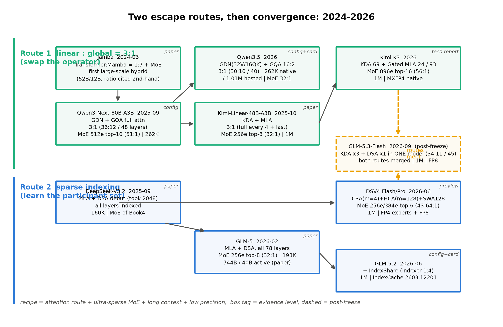
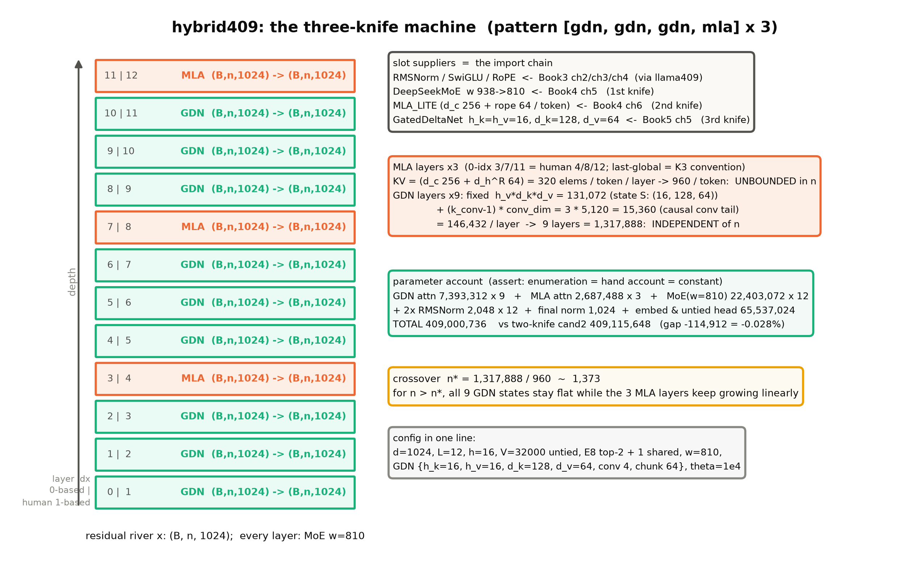
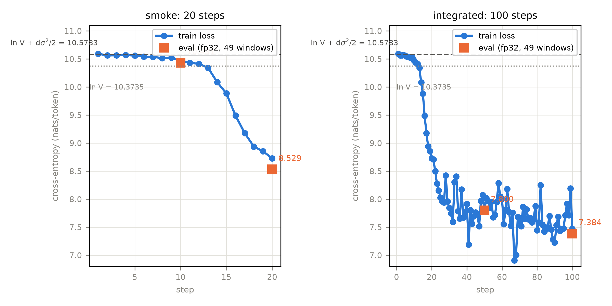
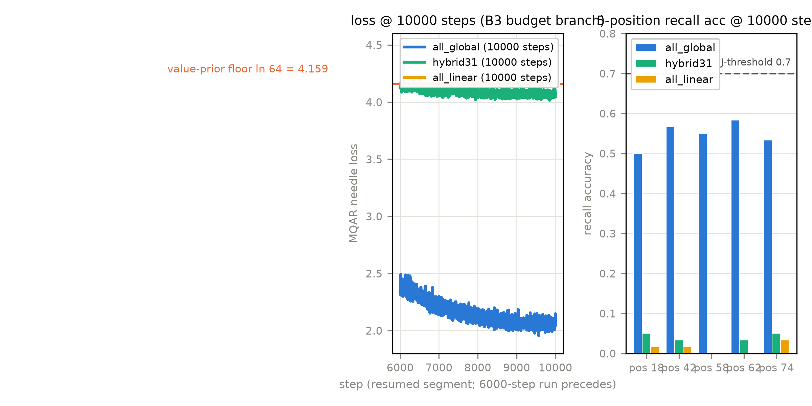

# 第 9 章 2026 混合配方谱系与三刀机

## 9.0 开篇：从全书到这里

三条路线走完了：第 2 章裁视野、第 3-4 章改参与集合、第 5 章换算子；四台真机读完了：K3 拆了两章（KDA/Gated MLA 与三处方/QAT）、DSV4 与 GLM-5(.2) 各拆一节；上一章又把位置信息的两条哲学——装进架构（外推）还是留给数据（状态压缩）——收拢成一张对表。至此你手里其实已经握着 2026 年全部旗舰的零件清单，只是它们散在七章里。本章第一件事，是把这张清单拼成**一张谱系总表**：哪些机器同属「线性:全局 3:1」路线、哪些同属「稀疏索引」路线，把它们并排放好、逐行标证据等级、再用第 1 章的分类型账本把两路线的缓存签名各自读一遍——共性是什么、分歧在哪、谱系正往哪里收敛。第二个问题关乎我们自己：单轨代码主线在本册还欠最后一站。Book3 造了 207M 稠密四插槽、Book4 动两刀得到 409M 两刀机，本册教完第三把刀（第 5 章的 GDN）却还没有把它装上整机——本章选做段收官：把两刀机的 9 层注意力插槽换成 GDN，做一台与它**等总参**的三刀机，交付四件套（整合代码、冒烟、整合短训、设计文档）。

先给一个值得单独一瞥的信号：2026 年 9 月，GLM-5.3-Flash 发布，45 层里 34 层 KDA 线性层、11 层稀疏索引层——**两条突围路线第一次装进了同一台机器**[^glm53]。谱系正在收敛的信号，本章末尾回看时它会是那个句号。

[^glm53]: GLM-5.3-Flash（`glm5_next` 家族）：`layer_types` 字面写着 34 层 KDA + 11 层 `deepseek_sparse_attention`（3:1 排班，第 4/8/…/44 层全局，1 起口径）、DSA 层 MLA 全 NoPE、1M 上下文、原生 FP8；其 `swiglu_limit=10` 与 DSV4 的激活限幅同款、MHC 超连接（hc_mult 4、Sinkhorn 20 迭代）与 DSV4 的 mHC 同族——9.3 次级共性两处「冻结线后一家」的佐证即此【证据等级：config 逆向】。它在本册冻结线（2026 旗舰世代）之后，只入脚注与悬案登记、不进正文主线——细节见第 4 章悬案框。

按旅程地图，本章是「哲学与谱系」一段的第二站、也是全书的倒数第四章。要回答的问题有两个：**2026 年的混合配方收敛了吗？**（9.1-9.4：谱系表、正面对照、共性三件、账本三档递减）；**我们的三刀机造得出来吗？**（9.5-9.6：四件套与混合比例消融）。产出五样：一张谱系总表（表 9.1）、一张共性证据表（表 9.2）、一本账本三档的收口账（9.4 节）、一台 409,000,736 参的三刀机（四件套）、一组等参三臂的召回消融读数（负结论照报）。到章末，架构侧与代码主线的本册段同时到站——接下来两章换个方向：看这些机器能做什么（第 10 章能力扩展）、以及厂商的数字该怎么读（第 11 章方法论）。

> **最小背景栏**（已学指回，本章不重教）：分类型 KV/状态账本三栏与交叉点 $n^*$＝第 1 章式 (1.3)/(1.4)；GDN 双形态与固定状态＝第 5 章（本章整机直接 `import` 该件）；KDA/Gated MLA/3:1 层带＝第 6 章；DSA/CSA/IndexShare＝第 3-4 章；GLM-5 参数三口径案卷＝第 4 章 4.3（第 11 章主案卷）；两刀机 cand2 与四件套先例＝Book4 第 9 章；MoE 激活参数口径＝Book4 第 1 章。MQAR 式 needle 召回（多查询关联召回，multi-query associative recall）＝第 2 章同款任务管道。

## 9.1 两路线谱系表：2026 年的家谱

拼总表之前先说拼法。谱系表要能回答三个问题才算合格：每台机器**选了哪条主刀**（路线归属）、**配了什么套餐**（MoE/上下文/精度）、**凭什么信**（证据等级）——第三列最容易漏也最要紧：这一代的机器有的有正式论文（GLM-5、Kimi Linear、K3 报告）、有的只有预览版（DSV4）、有的连论文都没有只有 config 与模型卡（Qwen3.5），同一张表里它们不是同等公民。表 9.1 按此拼成，图 9.1 是它的时间轴形态。

**表 9.1** 2026 混合配方谱系总表（注意力路线 × 套餐 × 证据等级；上下文档位均为 config 口径，预训练/评测数字见第 4 章 4.5 横表）

| 机型（年月） | 注意力配方 | 层排班 | MoE（稀疏度） | 上下文 | 权重精度 | 证据等级 |
|---|---|---|---|---|---|---|
| **路线一：线性 : 全局 3:1** |
| Qwen3-Next-80B-A3B（2025-09） | GDN + GQA 满注意力 | 3:1（36:12/48 层） | 512 选 10（51:1） | 262K | BF16 | config/源码+README |
| Kimi-Linear-48B-A3B（2025-10） | KDA + MLA | 3:1（每 4 层+末层） | 256 选 8（32:1） | 1M | BF16 | 论文 2510.26692+config |
| Qwen3.5（2026） | GDN(32V/16QK) + GQA | 3:1（30:10/40 层等） | 256 选 8（32:1） | 262K 原生／1.01M 托管 | BF16 | config/checkpoint+卡面 |
| Kimi K3（2026） | KDA 69 + Gated MLA 24（NoPE+AttnRes） | 3:1（69:24/93 层） | 896 选 16（56:1）+2 共享 | 1M | MXFP4 原生 | 官方技术报告 2607.24653+config |
| **路线二：稀疏索引（可学习 top-k）** |
| DeepSeek-V3.2（2025-09） | MLA + DSA（topk 2048） | 全层 DSA | （DSV3 MoE） | 160K 级 | BF16/FP8 | 论文 2512.02556（Book4 已核） |
| GLM-5（2026-02） | MLA + DSA | 全层 DSA（78 层） | 256 选 8（32:1） | 198K | BF16（+官方 FP8 档） | 论文 2602.15763+config |
| GLM-5.2（2026-06） | MLA + DSA + IndexShare | 全层 DSA（索引器 1:4 复用） | 同上 | 1M | BF16 | config+博客+论文 2603.12201 |
| DSV4-Flash/Pro（2026-06 预览） | CSA(m=4)+HCA(m=128)+SWA128 | 头 2 滑窗 + 1:1 交错 | 256/384 选 6（43:1-64:1） | 1M | FP4 专家+FP8 | 预览版报告 2606.19348+config |

注三行。其一，GLM-5 引用时主数用论文口径 **744B 总/40B 激活**；HF 页面自动统计为 754B（全量 753.864B）、GLM-5.2 同口径 753B（753.330B）——三数并存是「论文口径句字面算不出自家 744B」那桩复算案的入口，第 4 章 4.3 已立案、第 11 章收为主案卷，此处不重述【证据等级：config 逆向·checkpoint 亲算】。其二，Qwen3.5 的「262K 原生／1.01M 托管」必须并排写：config 的 `max_position_embeddings=262,144` 且**无任何 rope_scaling 字段**，1.01M 是托管服务口径、扩展配方已由卡面披露——静态 YaRN×4（`original_max_position_embeddings=262,144`，与 Qwen3-Next 同款；config 不预置、由部署端 override），托管服务端是否同款未单独说明——「原生 1M」四个字在本书禁写。其三，DSV4 一律带「预览版」标签。谱系表上端还有一位不必进表的祖先：Jamba（2024-03）是大规模商用混合的首例，其比例与规模数字在本书维持转引级（第 5 章 5.6 已按同款处理，回正文核验前不引具体值）。



图 9.1 2026 两路线谱系图（自绘）：上泳道＝路线一（线性:全局 3:1，青色系），下泳道＝路线二（稀疏索引，蓝色系）；每框右上角斜体＝证据等级标签；黄色虚线框＝冻结线后的合流信号。复现：`python "[`code/ch09/fig_ch09.py`](code/ch09/fig_ch09.py)" --which 1`

这张表里读得出两条路线各自的演化句。路线二的演化我们在第 3-4 章逐站拆过，这里可以收成一句谱系判词：**选择机关越来越便宜**——NSA 复用压缩分支的注意力分数去选**块**、DSA 自带一个 KL 蒸馏的轻索引器去选 **token**、CSA 把打分对象换成 $m{=}4$ 压缩后的**条目**（选择预算从 2048 token 降到 512/1024 条目）、IndexShare 干脆让 57 层**不选**、直接复用每 4 层一次的同一份选择（config 里 21 层 `full` + 57 层 `shared`，权重侧 57 层连索引器参数都不存在——534,198,528 的差值分毫不差，第 4 章 4.4 的杀手展品）。选择的对象从块到 token 到压缩条目，选择这个动作本身从「每 token 每层算一遍」降到「四层才算一次」。路线一的演化句则是**状态机关越来越强**：线性注意力只加不减，delta rule 让记忆可覆写，GDN 装上遗忘门，KDA 把遗忘门拧到每头每通道一颗旋钮（第 5-6 章的三级跳）——固定状态的「内存」被一代代擦得更亮。

谱系表最怕空口：路线一的「3:1」需要一份**真权重正身**来压舱。批一夜间预取的 Qwen3.5-4B（8.69 GiB，Apache-2.0）正是为此：把它加载起来，config 承诺的 `layer_types` 与真权重的逐层类名互证，分类型账本逐层实测，再看两条生成样例。本机实测（MPS bf16，权重在盘、系统缓存热，全程 6.2 s；首次冷加载显著更长；加载失败的降级链 2B→0.8B→随机已预登记，本轮未触发）：

**实物 9.1**（Qwen3.5-4B config `layer_types` 原样摘录（32 项取前 4 项+省略）与真权重加载终端读数原文；【证据等级：config 逆向 + 本机真权重实测】，产物 `log/book5-ch09/qwen35_consume_run1.json`；2026-10-09 脚本 interval 打印修复后 `--out-name run2` 复跑，账本/层对账/贪心样例与 run1 逐位一致——终端行照 run2 原文，`qwen35_consume_run2_console.log`）：

```text
"layer_types": ["linear_attention", "linear_attention", "linear_attention",
                "full_attention", …]        # 共 24 linear + 8 full（config.json 原文为 32 项数组）
[config] layer_types：{'full_attention': 8, 'linear_attention': 24}（full_attention_interval=4）
         | 全局层每 token 16,384 元素（无界）| 线性层固定 13,172,736（每层 548,864，与 n 无关）| 交叉 n* = 804
[对账] 32 层 isinstance 与 config layer_types 逐层一致 | 全局层（人读 1 起）=[4, 8, 12, 16, 20, 24, 28, 32]
[样例] 问：为什么混合架构要在大部分层用线性注意力、少量层保留全局注意力？
       答：「混合架构在大部分层使用线性注意力以显著降低计算复杂度并提升训练效率，
            同时保留少量层的全局注意力以维持模型对长距离依赖的捕捉能力……」（真权重贪心解码）
```

指名看三处。第一，32 层的逐层对账全中：第 4/8/12/…/32 层（人读 1 起）是 `Qwen3_5Attention` 满注意力，其余 24 层是 `Qwen3_5GatedDeltaNet`——config 里一行字符串数组，在真权重里是两类真实存在的模块，谱系表第一列至此有了实物。第二，分类型账本逐层实测与手算逐位一致：8 个全局层每 token 记 $8\times 2\times 4\times 256=16{,}384$ 元素的无界账，24 个线性层的全部状态钉死在 $24\times(524{,}288+24{,}576)=13{,}172{,}736$（递归状态 524,288 + 卷积滞留 24,576，第 1 章式 (1.3) 第三栏），交叉点 $n^*=804$——上下文一过 804，这台 4B 机器的缓存增长就只剩那 8 层的线性斜率。第三，样例是这台 3:1 机器在**解释自己为什么是 3:1**——第 5-6 章的全部论证（固定状态省、全局层兜检索）被它一句话复述，能力侧的正身留待第 10 章，这里只当一份会说话的展品。

还有一个此前没有点破的 config 事实值得放进谱系：Qwen3.5 有一条 27B **稠密**线（无 MoE），`layer_types` 同款 3:1【证据等级：config/源码默认】。3:1 与 MoE 是解耦的两件事——注意力层怎么排班是一层决策、前馈插槽装不装 MoE 是另一层；这也侧面回答了「混合配方是不是堆料竞赛」：27B 稠密线证明这套注意力排班在中等规模就成立。

## 9.2 正面对照：稀疏还是线性

谱系表把机器分了家，但两家并非老死不相往来——2026 年恰好有一张把两条路线拉进同一场考试的成绩单，第 4 章只取了一行结论、整表按约定收拢到此。GLM-5 论文 §2.1.2 在 GLM-9B 基座上做了一场 190B token、64K 续训的对照：满注意力基线之外，SWA（交错排布）、SWA（搜索式选层）、GDN、SimpleGDN（免参数极简线性化）、DSA 五种变体同场，RULER@128K 相对满注意力的差距依次为 $-30.35$、$-5.69$、$-11.28$、$-8.25$、$0$；论文判词是 "DSA is lossless by construction: its lightning indexer achieves token-level sparsity without discarding any long-range dependencies …"（DSA 在构建上无损：闪电索引器做到 token 级稀疏而不丢弃任何长程依赖）【证据等级：官方论文 2602.15763 §2.1.2，数字厂商自报】。原表全文见第 4 章实物 4.2。

这张表必须**并排标注**：它是 GLM 自家口径、为 DSA 站台的选择性对照——基座是 GLM 自家的 9B、续训管线是自家的、DSA 是亲儿子，GDN 臂按第三方管线（Jet-Nemotron 式）复训。拿自家主场成绩单给竞品路线打分，数字照录、权重自酌。但剥掉立场，表里仍有三个信号是硬的。其一，**SWA 交错 $-30.35$ 的灾难性对搜索式 $-5.69$**：同样滑窗，「哪些层保留全局」由搜索定还是由固定交错定，差出 25 分——层排班本身就是一等变量（论文正文里印着搜索出的逐层模式串），这个信号与路线一的立场完全同向。其二，**GDN $-11.28$ 与 SimpleGDN $-8.25$ 的倒挂**：更简单的免参数线性化反而得分更高——复训管线对线性层的影响大到能淹没一次「升级」，这正是选择性对照最该打折的地方。其三，**DSA 的 $0$ 有构建性论证背书**（判词前半句），不是测量运气。

那 GLM 为什么选稀疏不选线性？把论文判词与账本并排，答案其实是一次干净的交换。路线二全层保留精确检索（每个 token 对选中的条目做精确 softmax 内积，第 3 章 3.6 的判词），代价是**全层 KV 无界**——GLM-5 是 78 层 $\times$ 576 元素/token 的线性增长账；换来的是计算被 topk 截断（DSA 2048、CSA 512-1024），论文自报长序列注意力计算约降 1.5-2×、DSA 适配只要 20B token（第 4 章已核）。路线一反过来：**存储先钉死**——3/4 的层进入与 $n$ 无关的固定状态（K3 的 0.75% 账，第 6 章 6.6），代价是固定状态家族有检索地板（第 5 章 5.2 的定理与实证），全局层必须留着兜底。Kimi Linear 论文 §7.1 对这两家各给了一句自评，转述如下：稀疏注意力更擅长检索细粒度的历史信息，但要为选择存住整份 KV，理论上界仍是满注意力；线性注意力走「压缩即智能」的路，配 delta rule 后理论表达力可以更强；两者并不互斥，未来工作可以探索融合双方之长的混合模型【证据等级：官方论文 2510.26692 §7.1 转述（文字源纪律：不成段翻译）】。最后那句预言，正是本章开篇脚注里 GLM-5.3-Flash 的 KDA×3+DSA×1——谱系收敛不是我们的臆测，是论文白纸黑字的下一站。

路线一自己「为什么留全局层」的证据链，第 5 章 5.6 已排好前四环（DeltaNet 混合实验超基线 → GDN H1/H2 混合再抬约 9 分 → NVIDIA 6:1 十二项净胜 → Based 的状态×召回权衡前沿），此处不重列，只补上当时还没有的**第五环——Kimi Linear 的等参比例消融**（arXiv:2510.26692，Table 1，48B 同构缩档、等 FLOPs）：3:1 训练/验证损失 9.23/5.65 **最优**；纯满注意力 0:1 **垫底**（9.45/5.77）；1:1 验证持平但推理开销上升；7:1 与 15:1 均略差【证据等级：官方论文】。这一环的特殊价值在「等参」二字：它不是「混合快一些但差一点」的权衡叙事，而是**同预算下纯满注意力最差**——保留线性层不是花质量买速度，是质量与速度双收。至此五环闭合，配上 Qwen3-Next/Qwen3.5/K3 的生产配置（存在性证明），3:1 从「拍脑袋的超参」变成了有证据链的工程定式。这条链也标好了第 5 章负结论的地界：固定状态的地板是真的，全局层的兜底也是真的——两边都真，所以才有混合。

## 9.3 共性三件逐项核：什么敢说「都有」

谱系表分了家，但 2026 旗舰显然共享着一些东西。候选有三件，每一件都必须逐机型核过才敢说「共性」——防以偏概全是本册立过的纪律（共性三件最容易以两个极端冒充全谱带）。

**表 9.2** 共性三件证据表（逐机型核验；证据等级逐格标）

| 共性件 | 核验结果 | 谱带读法 | 证据等级 |
|---|---|---|---|
| 超稀疏 MoE | K3 56:1、DSV4-Pro/V4.1 64:1、DSV4-Flash 43:1、GLM-5(.2) 32:1、Qwen3.5 32:1 | 「32:1 起步、56-64:1 为顶」，**并非普遍再稀疏化**（2025 主流 DSV3 已是 32:1、Qwen3-Next 51:1） | config 逆向（五家全核） |
| 原生长上下文 | DSV4 全系 1M、GLM-5.2 1M、K3 1M；**GLM-5 只有 198K**；**Qwen3.5 原生 262K**、1.01M 托管 | 「向 1M 收敛」对，「人手 1M」错——Qwen 走了「262K 原生+服务端扩展」的另一档 | config+卡面（各家分标） |
| FP4 级低精度 | 仅 **K3**（MXFP4 原生 QAT）与 **DSV4**（FP4 专家+FP8 其余）坐实；GLM-5(.2) 与 Qwen3.5 发布 BF16 | 「FP4 级」是 Kimi 与 DeepSeek 的共同押注，**不是世代共识** | config/checkpoint+官方文档 |

三件的读法已经写在表里，此处只加两笔。第一笔是口径教训的复用：第一件的「稀疏度」是总专家:激活专家的比（K3 的 896:16=56:1 含 2 个全宽共享专家不计入分母——第 7 章 7.1 的口径），第三件的「FP4 级」只算权重精度、不含训练配方（K3 是 SFT 起的 QAT、DSV4 是打点式 FP4——两家谱系勿串，第 7 章 7.2 已核）。第二笔是表外的**次级共性**，config 可证、一笔带过：MTP 几乎人手一份（GLM-5/5.2 一层、DSV4 一层、Qwen3.5 一层；K3 发布权重 $0$ 层——第 7 章 7.4 已立案的事实句）；noaux 路由三家共用（GLM/DSV4/K3）、Qwen 不用；激活限幅两家（DSV4 `swiglu_limit=10`、K3 SiTU $\beta_1\beta_2{=}100$；冻结线后还有一家同款 limit——佐证见脚注 glm53）；超连接（hyper-connection）两家（DSV4 的 mHC 与一家冻结线后机型——同脚注 glm53）。这些次级件没有一条敢升格成「共性」——单件证据的机型数都不满半桌，恰与三件主栏形成对照：**说「都有」之前先数人头，是谱系章的第一纪律**。

## 9.4 账本三档递减：从「涨得慢」到「不涨」

第 1 章立的分类型账本，此后每拆一台机器都掏出来算过一遍；现在把它举到谱系表上方，会看见一条清晰的递减链——2026 配方对「随 $n$ 增长」这件事的围剿，分三档完成，一档比一档狠。

**第一档：计算有界。**超稀疏 MoE 把每 token 的前馈计算砍到总参数的百分之几（K3 激活 104B 对总参 2.8T，约 3.8%【证据等级：官方技术报告】），注意力侧路线二用 topk 截断（DSA 2048、CSA 512-1024）。这一档 Book4 整册在算、路线二的检索章复核过——它砍的是**每 token 的算力账**，KV 账一分没动：GLM-5 仍是 78 层 $\times$ 576 元素/token 的无界线性增长。

**第二档：KV 压缩。**MLA 把每 token 每层的账从 GQA 的 $2h_{kv}d_k$ 压到潜在向量 $d_c+d_h^R$（576 对两千起，Book4 第 6 章）；滑窗层封顶 $\min(n,W)$（第 2 章）；CSA 更进一步把 KV 本体压成 $1/4$ 与 $1/128$ 的压缩条目（第 4 章）。斜率被一刀刀砍下来——但只要还剩全局层，账仍然随 $n$ 涨：Qwen3.5-4B 砍到只剩 8 层、每 token 仍涨 16,384 个元素（实物 9.1 第二行）。

**第三档：字节钉死。**路线一的线性层把「随 $n$ 涨」本身拿掉——KDA/GDN 层的状态是与 $n$ 无关的常数（我们马上要造的三刀机：9 层合计 1,317,888 个元素，写满即覆写）。路线二也摸到了这一档的门：DSV4.1-Flash 宣称 FP4 主 KV 缓存把全局 KV 钉到 **890 bytes/token**（约 V4-Flash 的四分之一）【证据等级：厂商自报（卡面一句话+config 字段双锚）】——冻结线后的悬案，第 4 章表 4.3 已登记，此处只作「第三档不止一条实现路径」的旁证。

三档递减的收口一句话：**第一档砍计算不砍存储，第二档砍斜率不砍增长，第三档把增长本身取消**——从「涨得快」到「涨得慢」再到「不涨」。这就是本册账本的总收口：两条路线的分歧只是走到了第几档（路线二停在第二档+计算截断、路线一停进第三档），**方向完全一致**。谱系没有收敛到唯一解，但所有机器都在同一条下降的通道里。

## 9.5 我们的三刀机：四件套

轮到自己的机器了。先把一笔跨册的账对清楚——Book4 第 9 章卷末写道：

> 「往后的分岔也登记清楚：Book5 的 3:1 混合改装是选做支线（注意力手术的另一片战场），本册两刀机不参与。」【Book4 第 9 章卷末直引】

这句「不参与」是 Book4 册内的岔路登记：那一册不做此改装，机器封存待用（第 0 章 0.3 已把两册对读口径钉死）。本节正是以它为底座的演化线续章：**两刀机的 409,115,648 参原封不动作起点，只动注意力插槽**——12 层里留 3 层 MLA，其余 9 层换成第 5 章的 GDN，得到与两刀机等总参的三刀机。按作者决策（2026-10-05），全量长训暂缓、以四件套形态交付：整合代码（参数逐项账 assert）、分钟级冒烟、一次 ≤30 分钟的整合短训、完整设计文档与重启手册（`code/ch09/DESIGN-3TO1.md`，含消费线衔接声明与 B5-8 文档锚，见该文档）。

动手之前有一道排布题要手排，它就是本章的玩具例子。

**例 9.1（构造例）**：给 12 个空层格排 3:1。输入：12 格空位；两条约束——周期约束「每 4 层一层全局」（interval=4）与惯例约束「末层必全局」（K3 在 92 层循环之外**再额外**压第 93 层 MLA、Qwen3.5 的第 32 层恰落在周期位上——两家殊途同归于「末层全局」，第 6 章 6.1 已核）。步骤：① 按周期约束，0 起索引 $3,7,11$ 三格放 MLA（换算句：config 与代码注释一律 0 起，行文与例题固定人读 1 起——第 4/8/12 层）；② 检查惯例约束：0 起索引 11 既是末层又是周期层，两条约束在这**一点会合**、不额外占格（与 Qwen3.5 的 32 层同款会合；K3 则是循环走完再补一层——两种实现、同一条惯例）；③ 其余 9 格填 GDN；④ 输出：$[\mathrm{gdn},\mathrm{gdn},\mathrm{gdn},\mathrm{mla}]\times3$，逐格即 `ThreeKnifeConfig.layer_types`。排布自由度一瞥：若把周期改 3，全局层变 4 层（33%），参数账立刻不守恒、$w$ 要重磨——「3:1」不是孤立超参，它拴着等总参补偿。对照路线二的镜像答案也有趣：GLM-5.2 把 21 个真索引器放在**头部**（层 0,1,2）+周期 4，路线一把全局层放在每个周期**末**——「全局信息放哪」两家给了不同解，但「末层全局」是共识。这个例子让你看见：一个「3:1」数字背后是两条约束的合成，层排布是离散的小自由度、不是连续大空间。

排布定了，参数账要重新配平——换 9 层注意力必然改变总参，等总参要靠前馈插槽补偿：

$$\Delta_{\mathrm{attn}} = 9\times(7{,}393{,}312 - 2{,}687{,}488) = 42{,}352{,}416,\qquad \Delta_{\mathrm{MoE}} = 12\times(E{+}N_s)\cdot 3d\,(938-810) = 42{,}467{,}328$$

$$\text{三刀总参} = 409{,}115{,}648 - (\Delta_{\mathrm{MoE}} - \Delta_{\mathrm{attn}}) = 409{,}115{,}648 - 114{,}912 = 409{,}000{,}736 \tag{9.1}$$

用人话说：9 层注意力从 MLA（每层 2,687,488）换成更宽的 GDN（每层 7,393,312），多花 4,235 万参数；这笔钱从 12 层 MoE 里扣——专家宽 $w$ 从 938 磨到 810，省回 4,247 万；两抵之后还多省 114,912 个（0.028%），三刀机以 409,000,736 与两刀机「≈等总参」【证据等级：本书实验，`hybrid409.py` assert 逐位】。式 (9.1) 的符号表如下（$E{=}8$ 路由专家、$N_s{=}1$ 共享专家、$d{=}1024$）：

| 符号 | 含义 | 数值/形状 |
|---|---|---|
| $7{,}393{,}312$ | GDN 插槽层参（$d{=}1024$，$h_k{=}h_v{=}16$、$d_k{=}128$、$d_v{=}64$、conv 4） | in_qkvz 6,291,456 + in_ba 32,768 + conv 20,480 + 门 32 + out_proj 1,048,576 |
| $2{,}687{,}488$ | MLA_LITE 插槽层参（含 $q_a$/$kv_a$ 两枚潜向量 RMSNorm 各 256） | Book4 第 6 章件原样 |
| $\Delta_{\mathrm{MoE}}$ | 专家宽 938→810 的每层省额 $9\times 3dw$ 之差 | $3{,}538{,}944\times 12$ |

一笔规划勘误随式勘正：卷级大纲的规划稿曾按 2,687,232 计 MLA 层参（漏计一枚潜向量 RMSNorm 的 256），式 (9.1) 与正文一律用正身 2,687,488——规划稿自己也预留了「精确值以代码 assert 为正身」的口径，此处照办。另有一处偏离如实声明：真机 GDN 的头几何是 $h_v{=}2h_k$ 的 GQA 比（Qwen3.5 为 32V/16QK），三刀机取 $h_k{=}h_v{=}16$ 的教学简化——两种几何 GDN 件都支持（第 5 章 5.7 的对拍臂验过 $h_v\ne h_k$ 分支），选对称几何是为了让「第三刀」的参数账一眼可比。

**表 9.3** 三刀机 config 定版表（正身＝`hybrid409.py::ThreeKnifeConfig`；底座字段全承 Book4 cand2）

| 字段 | 值 | 依据 |
|---|---|---|
| $d$/$L$/$V$/$h$ | 1024/12/32000（untied）/16 | Book3 207M 骨架不动（残差河恒宽） |
| `layer_types` | $[\mathrm{gdn}\times3,\mathrm{mla}]\times3$（0 起；MLA@3/7/11＝人读 4/8/12） | 例 9.1 双约束合成；末层全局承 K3 惯例 |
| GDN 插槽 | $h_k{=}h_v{=}16$、$d_k{=}128$、$d_v{=}64$、conv 4、chunk 64 | 第 5 章正身件原样（教学几何，偏离已声明） |
| MLA 插槽 | MLA_LITE（$d_c{=}256$、$d_c'{=}256$、nope/rope/v=64/64/64） | Book4 cand2 原样 |
| MoE | $E{=}8$ top-2 + 1 共享、$w{=}810$ | 式 (9.1) 等总参补偿 |
| 其余 | theta 1e4、eps 1e-5、init 0.02、`first_k_dense_replace`=0 | 承 cand2 定版 |

整机长什么样、每一格零件从哪来，图 9.2 一图说尽——「三刀改装史写在 import 语句里」：归一化/位置/稠密件来自 Book3（经由 llama409），MoE 与 MLA 两刀来自 Book4 第 5/6 章，第三刀 GDN 来自本册第 5 章。这也决定了对拍口径：三刀机**没有整机正身可 strict 直搬**（不存在「ThreeKnifeForCausalLM」这种机器），正确性由三层证据拼成——GDN 件层级已与 HF 双 kernel 对拍到 $10^{-8}$ 级（第 5 章 5.7）、线性层机构与 Qwen3-Next/Kimi Linear 文献互证、MLA/MoE 件承 Book4 的 DeepseekV2 strict 对拍资产；整机另有 mini 复核臂（4 层小几何，枚举=手算逐位）兜住层循环与账本函数本身。



图 9.2 三刀机结构与插槽来源（自绘）：左＝12 层栈（0 起索引｜人读 1 起双口径；橙=MLA 全局层、青=GDN 线性层；残差河 $(B,n,1024)$ 恒宽）；右＝import 供货方、双类层的 KV/状态面、参数账与交叉点。出处：[`code/ch09/fig_ch09.py`](code/ch09/fig_ch09.py) --which 2`

三刀机的分类型状态账，是这台机器的「体检单」，也把第 1 章式 (1.3) 落到自家机器上：

$$\mathrm{KV}_{3:1}(n) = \underbrace{3\,(d_c + d_h^R)\cdot n}_{\text{MLA 无界}} \;+\; \underbrace{9\,\big(h_v d_k d_v + (k_{\mathrm{conv}}-1)\cdot \mathrm{conv\_dim}\big)}_{\text{GDN 固定}} = 960\,n + 1{,}317{,}888 \tag{9.2}$$

用人话说：3 层 MLA 每来一个 token 记 960 个元素的账、一直涨；9 层 GDN 的记忆本加起来 1,317,888 格（每层递归状态 $16\times128\times64=131{,}072$ + 卷积滞留 $3\times5{,}120=15{,}360$），写满即覆写、永远这么大。式 (9.2) 的符号与形状：$d_c{=}256$/$d_h^R{=}64$＝MLA 潜向量与解耦键宽（Book4 第 6 章记号）；递归状态 $S\in\mathbb{R}^{(B,h_v,d_k,d_v)}$（每层 $(16,128,64)$）；$\mathrm{conv\_dim}=2h_kd_k+h_vd_v=5{,}120$＝因果短卷积的通道数（$q/k/v$ 三段同卷，第 5 章同款）。交叉点 $n^*=1{,}317{,}888/960\approx 1{,}373$：上下文过 1.4K，三刀机的缓存账就只剩 3 层 MLA 的线性斜率——与真机 Qwen3.5-4B 的 $n^*=804$ 同构，只是我们的 MLA 占比（3/12）比真机（8/32）更低、无界斜率更缓。$n{=}262{,}144$（Qwen3.5 原生档位）时：MLA 账 251,658,240 元素对 GDN 固定账 1,317,888——**固定部分只占总账的 0.52%**，与 K3 的 0.75%（第 6 章 6.6）同一量级，三刀机把真机的账本比例缩微了下来。

四件套的实测记录如下（全部产物带 JSON 落 `log/book5-ch09/`）。**件一**：自测 8.2 s（CPU fp32），双口径 assert 三方一致——枚举=手算=定版常数；**件二**：冒烟 20 步（MPS bf16），初始 loss 10.5916 对预言 $\ln V + d\sigma^2/2 = 10.5783$（$\ln 32000=10.3735$，untied 无自泄漏，承 Book3/4 判据），训练损失降至 8.7265、eval@20 8.5287（49 窗 401,408 token fp32）、无 NaN；**件三**：整合短训——这里有一笔必须如实登记的降档：大纲按 2-3 s/step 推算的「600-900 步」**作废**，冒烟实测稳态 11.715 s/step（一次性诊断 `chunk_bench`：单个 GDN 层前向+反向 0.677 s，9 层共 6.1 s——chunkwise 块循环在 MPS 无融合 kernel，第 5 章已实录慢约 25×；块循环之外 MoE+MLA+嵌入头+优化器本体约 5.6 s；chunk 加宽到 128/256 收益不足 20%，且排程等价性 $5.4\times10^{-6}$，不动正身件的默认 chunk=64）。一窗 30 分钟定版 **100 步**：训练损失 10.5916→7.4708（cosine 途中、非收敛档），eval@50 7.7997→@100 **7.3838**，步时漂移 10.1→15.3 s（持续负载热节流，Book4 的 +12% 余量档被超，如实报），wall 28.6 min、MPS 峰值 7.77 GB，判定 PASS——**三刀协同无冲突的真凭据**（管道验收口径，非效果训练；距 Chinchilla 档差三个数量级，重启预算表见 DESIGN）。**件四**：`DESIGN-3TO1.md` 十一节（依赖清单与三候选 bootstrap、暂缓声明、config 逐字段与双口径账、数据配方、预算表含 A100/H100 档、验收、风险、重启 checklist、消费线衔接声明与 B5-8 文档锚、文献锚）——重启即可执行。



图 9.3 三刀机冒烟与整合短训（自产）：左＝smoke 20 步、右＝integrated 100 步；蓝点＝训练损失、橙方＝eval（49 窗 fp32）；虚线＝预言 $\ln V + d\sigma^2/2=10.5783$、点线＝$\ln V=10.3735$。数据源：`log/book5-ch09/curve_{smoke_s1,integrated_run1}.csv`

最后把三台机器并排放好——这是单轨主线在本册段的总决算。**实物 9.2**（三代自测 assert 读数行并列；三行分别出自三章自测正档的终端读数，格式归并、数值照录；【证据等级：本书实验】）：

```text
Book3 ch10 稠密四插槽   总参 207,119,360（手算=实测=探针锁定数，逐位）           # GQA + 稠密 FFN
Book4 ch09 两刀机 cand2 总参 409,115,648（手算=实测=探针 F 锁定数，逐位）         # + MoE(E8 t2 s1 w938) + MLA_LITE
Book5 ch09 三刀机       总参 409,000,736（枚举=手算=定版，逐位一致；vs cand2 差 -114,912，-0.028%）
```

**表 9.4** 等参三形态对照链（同预算三代架构——单轨主线的架构侧总决算）

| 形态 | 注意力 | 前馈 | 总参 | KV/状态账（元素/token） | 章号 |
|---|---|---|---|---|---|
| Book3 稠密 | GQA 满注意力一色 | 稠密 FFN | 207,119,360 | 无界：12,288·$n$ | Book3 第 10 章 |
| Book4 两刀 | MLA 满注意力一色（KV 压箱） | MoE | 409,115,648 | 无界：3,840·$n$（−68.75%） | Book4 第 9 章 |
| Book5 三刀 | 9 GDN + 3 MLA | MoE（$w$ 810） | 409,000,736 | 无界 960·$n$ ＋ 固定 1,317,888（$n^*\approx1{,}373$） | 本章 |

三行并排，本丛书「架构修改=对已知物的局部替换」这条主线走完了它在架构侧的全部三步：同一副骨架、同一份预算，注意力插槽从满注意力一色，到压箱（MLA），再到 3:1 混装。207M 那一代的无界斜率是 12,288；两刀砍到 3,840；三刀砍到 960、外加一份与 $n$ 无关的固定记忆——账本三档递减（9.4 节）在我们自己的三代机器上同样成立。

## 9.6 混合比例消融：三臂等参对打

机器造出来了，还剩一个本章必须用实验回答的问题：3:1 这个比例，在我们的玩具尺度上**代价与收益各是什么**？第 5 章 5.2 的负结论（固定状态检索地板）预言过方向，现在把它任务化：MQAR 式 needle 召回（第 2 章同族管道：$T{=}96$、$B{=}32$、监督 8 个查询位、needle 训练分布 50% 远端+50% 窗内，五个位置 {18, 42, 58, 62, 74} 上评估精确召回率），三臂等参对打——全全局（L=4 全满注意力）、3:1（3 GDN + 1 满注意力@第 4 层）、全线性（L=4 全 GDN）。

等参对齐有一笔勘正随文落定：大纲曾写「全全局臂以加宽 FFN 补偿」，方向记反了——本几何下满注意力插槽（393,216 参）比 GDN 插槽（332,808 参）**更贵**，全全局臂其实是**减** FFN（704→645）对齐；全线性臂加 FFN（704→724）。三臂总参 7,750,912 / 7,750,936（锚，调研期消融管道探针臂原封不动）/ 7,751,968，最大互差 1,056 参（0.0136%，assert 上限）；三臂均无 MoE，等总参即等激活。判据与结果分支**跑前预注册**（全文留档 `hybrid_recall.py` 文件头与 `notes/08` §3.1）：J1 全全局五位置全 $\geq 0.7$；J2 3:1 臂远端三位置（18/42/58）全 $\geq 0.7$（Qwen3-Next/K3 配方的存在性证据）；J3 全线性远端均值比 3:1 低 $\geq 0.3$；分支 B1 若 3:1 意外垫底＝「recall 靠全局层」的谱系证据、B2 若全线性远端也 $\geq 0.7$＝推翻固定状态预期、B3 若全全局未达 J1＝预算不足信号、补 10000 步再判。

结果是一场教科书级的负结论。6000 步正档触发 B3（全全局远端均值仅 0.17），按预注册补档 10000 步（各臂自 ckpt 续跑、cosine 重算，`resumed_from_step=6001` 留痕）：

**实物 9.3**（recall 三臂终值 JSON 摘录（键值照录、行序归并），@10000 步；【证据等级：本书实验】，`log/book5-ch09/recall3_run1.json`）：

```json
"all_global": {"d_ff": 645, "params": 7750912, "far_mean_18_42_58": 0.5389, "train": {"loss_last_20_mean": 2.0606}},
"hybrid31":   {"d_ff": 704, "params": 7750936, "far_mean_18_42_58": 0.0278, "train": {"loss_last_20_mean": 4.0699}},
"all_linear": {"d_ff": 724, "params": 7751968, "far_mean_18_42_58": 0.0111, "train": {"loss_last_20_mean": 4.1590}},
"prereg_verdict": {"J1_all_global_all_positions": false, "J2_hybrid31_far_positions": false,
                   "J3_all_linear_far_gap": false, "B1_hybrid31_bottom": false,
                   "B2_all_linear_far_learned": false, "B3_budget_short": true}
```



图 9.4 recall 等参三臂（自产）：左＝续跑段（6001-10000 步）三臂损失曲线，橙色虚线＝值先验地板 $\ln 64=4.159$；右＝@10000 步五位置召回率三臂条形（灰色虚线＝判据阈值 0.7）。数据源：`log/book5-ch09/recall3_{arm}_run1.json` 与 `recall_ckpt_{arm}.pt`

读数分四层，每层都要说透。**第一层，两个含 GDN 的臂钉死在 $\ln 64=4.159$**——这不是随机数：64 正是应答表的值 token 数，损失恰为「只学会应答 ∈ 64 个值 token 的边缘分布、完全不含查询信息」的熵。调研期的消融管道探针曾以 300 步预演过同款平台（4.18），本实验以 6000/10000 两档独立复现——不是管道 bug（GDN 件本身第 5 章对拍 $10^{-8}$ 级）。**第二层，末层全局也救不回**：3:1 臂唯一的满注意力层在第 4 层（末层），但归纳头电路要求检索所需的 **key 身份信息先穿过 3 层 GDN** 才能到达全局层——玩具档的 GDN 层还没学会保持 token 身份，信息到不了检索层，电路不成形。这正是「末层全局」真机惯例的隐藏前提：它买的是**深度方向的信息保真**，而这在 7.75M 玩具档是买不起的。**第三层，全全局臂在成形但预算不足**：远端均值 0.17（6000 步）→0.54（10000 步，正档 0.539），第 2 章先例（L=2 最小电路 8000 步到 0.83）提示 L=4 需要更多步——B3 判「预算不足信号、不据此下结论」是预注册的克制。**第四层，B1 未触发**：3:1 臂五位置均值 0.033 略高于全线性 0.013，没有垫底——「3:1 若垫底＝recall 靠全局层」的谱系证据这条分支没有兑现，两臂同钉地板、差值在噪声内。

负结论的红线必须画清楚：本读数**不支持**「线性层学不会召回」的终局结论——真机 Qwen3-Next/K3 的召回成绩来自大几个数量级的训练预算与容量（真机 GDN 几何 $h_v{=}32$、$d_v{=}128$ 对玩具 $h_v{=}4$、$d_v{=}64$；状态容量差一个数量级以上）。正确表述收窄为：**等参玩具档、6000-10000 步预算内，含 GDN 的臂不破值先验平台**——规模与预算绑定声明，与第 7 章三处方消融的分支②同款纪律。长度外推的苗头一并只报方向（次判据 ruler-mini，训练只见 $T{=}96$）：全全局臂在 $T\in\{96,128,160,224\}$ 全网格 0.38-0.65、随 $T$ 缓降但不崩；两个含 GDN 臂全网格 $\leq 0.07$——未破平台则无从谈外推。

## 9.7 本章小结

开篇的两问都有了答案。谱系侧：表 9.1 把 2026 旗舰排进两条路线——线性:全局 3:1（Qwen 系与 Kimi 系）与稀疏索引（DeepSeek 系与 GLM 系），每行带证据等级；GLM-5 §2.1.2 的同场对照（并排标注「GLM 自家口径、为 DSA 站台的选择性对照」）与论文级证据链（第 5 章 5.6 的四环＋本章补的 Kimi Linear 等参第五环）把两家的交换摆上了台——稀疏拿计算截断换全层精确检索、线性拿固定状态换 3/4 的无界账；共性三件逐项核完（32:1 起步 56-64:1 封顶的超稀疏、非齐步的长上下文、仅两家的 FP4 级）；账本三档递减收口：计算有界→KV 压缩→字节钉死。机器侧：三刀机四件套交付——409,000,736 参逐位 assert、冒烟健康（10.5916 对预言 10.5783）、整合短训 100 步 eval 降至 7.3838（降档留痕）、DESIGN 重启手册在档；等参三形态对照链（207M→409M→409M）收官；recall 三臂以预注册的克制给出负结论——玩具档的 GDN 含层臂钉在值先验平台、末层全局的前提是深度方向的信息保真。

**带走的心智**：细节都还回去，留三句话。**其一，读任何 2026 旗舰，先看 config 里 `layer_types` 那一行再翻账本——层类型数组是这台机器的配方指纹，分类型账本是它的体检验单；指纹告诉你它选了哪条主刀，账单告诉你它的缓存会不会随长度失控**（960·$n$+1,317,888 与 44,928·$n$ 是两种完全不同的人生）。**其二，2026 配方没有收敛到唯一解，但所有机器都在同一条下降通道里——计算有界、KV 压缩、字节钉死，一档比一档狠；分歧只是走到了第几档**。**其三，等参对照是架构演化唯一的公平秤**——同预算三代机器（207M 稠密/409M 两刀/409M 三刀）的无界斜率 12,288→3,840→960，比任何 benchmark 都更直接地度量了「改装换来什么」；而三刀机的改装史写在 import 语句里，零件的来历就是知识的来历。

镜头拉回全书：机器造完了。本册的架构主线（三条路线→真机→哲学→谱系→整机）与单轨代码主线（Book3 四插槽→Book4 两刀→本册三刀）同时到站。但一台机器的价值不止于架构——它能看图吗？它会「思考」吗？那些能力是怎么长上去的？下一章浅尝能力扩展的边界；再下一章回头补一门更急的手艺：这一整册我们反复被迫面对厂商自报、预览版论文与 config 三档证据，读数字的防身术该系统化一次了。

## 9.8 动手验证

- **三刀机自测**（CPU fp32，约 8 s——实物 9.2 第三行与表 9.3/式 (9.2) 的数字源）：
  ```bash
  cd 工作区根目录 && source env.sh && \
    python "[`code/ch09/hybrid409.py`](code/ch09/hybrid409.py)" --out-name run1
  ```
- **冒烟**（MPS bf16，20 步约 11 min）：`python "[`code/ch09/train_hybrid.py`](code/ch09/train_hybrid.py)" --task smoke --out-name s1`
- **整合短训**（MPS，100 步约 29 min 一窗；超窗同命令自动续跑补齐）：`python "[`code/ch09/train_hybrid.py`](code/ch09/train_hybrid.py)" --task integrated --out-name run1`
- **recall 等参三臂**（MPS，6000 步三臂串行约 55 min；补档 `--steps 10000` 自 ckpt 续跑；判据预注册全文＝`hybrid_recall.py` 文件头）：
  ```bash
  python "[`code/ch09/hybrid_recall.py`](code/ch09/hybrid_recall.py)" --out-name run1
  python "[`code/ch09/hybrid_recall.py`](code/ch09/hybrid_recall.py)" --eval ruler-mini --out-name run1   # 从 ckpt 只评估
  ```
- **Qwen3.5-4B 真权重消费点**（MPS，权重在盘分钟级；实物 9.1 数据源）：`python "[`code/ch09/qwen35_consume.py`](code/ch09/qwen35_consume.py)" --out-name run1`
- **四图复绘**：`python "[`code/ch09/fig_ch09.py`](code/ch09/fig_ch09.py)"`（谱系/结构/训练/消融，秒级-分钟级）
- **设计文档**：`code/ch09/DESIGN-3TO1.md`（重启手册+消费线衔接声明+B5-8 文档锚）
- 验收点：三刀机 assert 三方一致且能说出 MLA 保留层的人读/config 双口径；能对任一 2026 旗舰归入路线并报证据等级；能复述账本三档递减与等参三形态链的无界斜率序列；能说出 recall 三臂负结论的正确表述边界（规模/预算绑定声明）。
