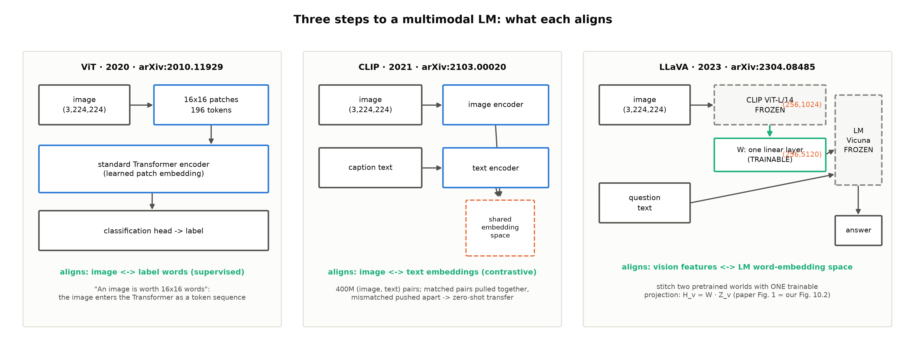
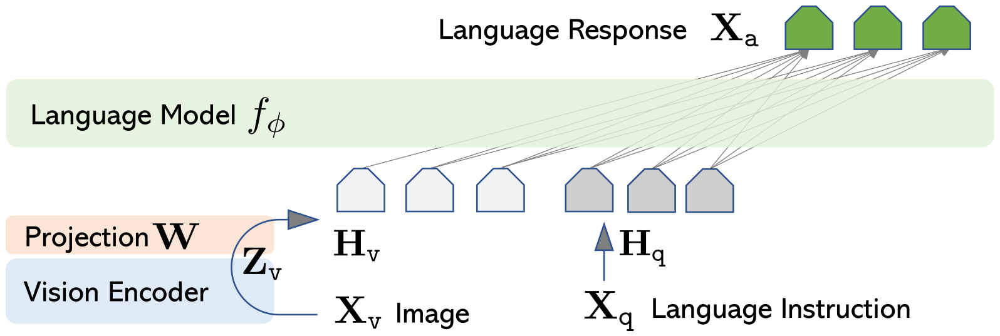
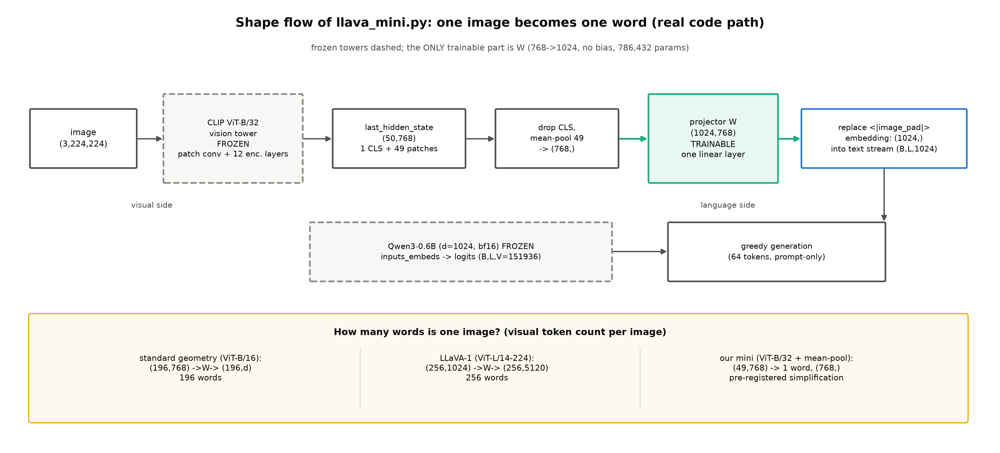
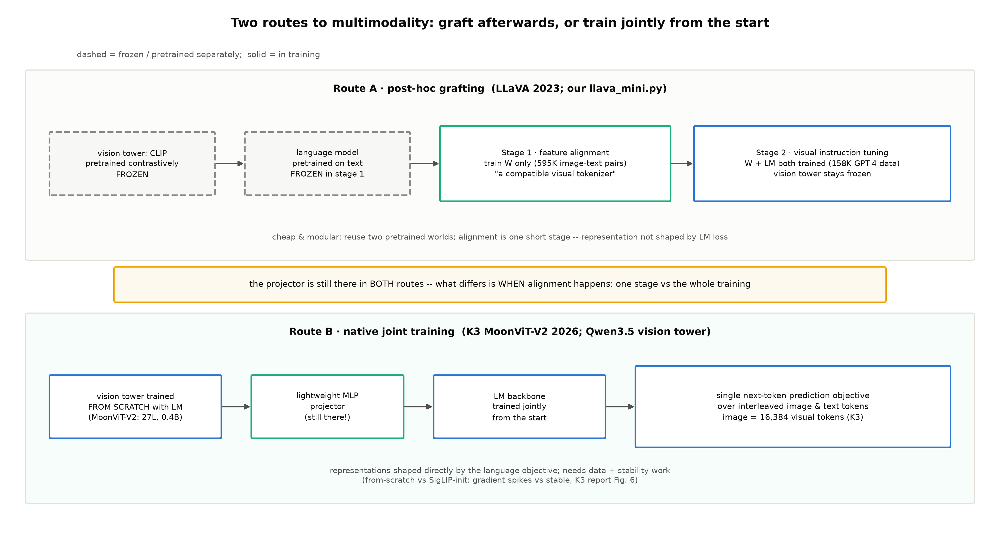

# 第 10 章 能力扩展专题：多模态与推理范式

## 10.0 开篇：从全书到这里

上一章收官了本册的架构主线：2026 年的菜谱写成了谱系总表，我们的三刀机连同设计文档交付了四件套——单轨演化线在这册的架构侧与代码线都到了终点站，**机器造完了**。全书的注意力至此都在「机器是什么」上：三条路线怎么动注意力、K3 怎么把 delta rule 装进 1T 机身、位置信息装进架构还是留给数据。但一台机器造出来是为了做事的，而 2026 年的旗舰有两类能力明显越过了「机器」本身的边界：它们看得见图（K3 与 Qwen3.5 出厂带视觉塔），它们会在答题前先思考一长串再落笔（推理范式）。这两类能力怎么来的？本章回答——这正是 Book1 在 2017 年原论文里就登记的一笔最老的欠账：§7 的 future work 三件事里的第一件，*"We plan to extend the Transformer to problems involving input and output modalities other than text…"*（我们计划把 Transformer 推向文本之外模态的问题）【证据等级：官方论文 v7 §7，直引】——原话登记句是「这条不多展开，登记为 F13，回收在 Book5 第 10 章的多模态三步曲」（Book1 第 11 章）。九年到期，本章兑付：F13 的多模态正身、B3-4 的后训练链概览、N6 的 few-shot 能力侧、F9 的检索余脉，四笔账一次收拢。

按旅程地图，本章与下一章是「扩展与方法论」一段的两站：机器有了（ch9），本章先看它能做什么、能力从哪里长出来，下一章再教「厂商报的数字怎么读」。本章要回答三个问题：一个只会处理词元序列的模型，怎么「看见」图像（多模态三步曲）？旗舰为什么有两种接法——先训好再缝合、还是从头一起训（原生 vs 后接）？「先思考再作答」的推理范式与支撑它的后训练链，演进到 2026 年是什么形状？产出四样：一张三步曲演进图、一台可跑的 LLaVA mini（冻结双塔＋一层可学投影）、一张两路线对照表、一张后训练链四代速览表。

> **最小背景栏**（已学指回，本章不重教）：ViT（把图切成 patch、当词元序列喂标准 Transformer 编码器）＝Book4 第 7 章 ViT-22B 在 QK-Norm 采纳链里一句带过——本章 10.2 给它一页速览；K3 原生多模态的事实（MoonViT-V2 结构、官方否定句、from-scratch 消融）＝第 7 章 7.3 已逐句立过，本章交叉引用不重教；RLHF/DPO 的流程图级概念与 Llama 2-Chat／Llama 3 案例＝Book3 第 8 章；few-shot「无梯度更新却像学了一样」＝Book2 第 11 章在官方权重上的实测；K3 报告引用纪律承 6.0 开篇（每句机制断言带节号＋页码，双锚口径 arXiv:2607.24653＋本地 PDF）；Qwen3.5 权重与 config dump＝第 9 章 9.1 的真权重正身实测（`log/book5-ch09/qwen35_4b_config_dump.json`）。

## 10.1 本章的边界：架构册的一张能力地图

先把疆界画清楚，这是一张什么地图、不是什么专著。本册是架构册——前四册讲机器怎么长成，本册讲注意力怎么挨三刀；能力侧（多模态、后训练、推理范式）每一项都是独立且滚烫的赛道，各自养活着成山的教程与专著。本书的战略是明确的让渡：不与它们竞争深度，只搭一张「知道它在整机的哪里」的地图。具体到机制深度：多模态讲到 **projector（投影器）与联训方式**为止——projector 是什么形状、怎么把两个世界缝起来、原生与后接差在哪，讲到能画出为止；视觉塔内部的检测头、分割头、视频时间维工程不进本书。后训练链讲到**流程图**为止——四代方法各自「奖励从哪来、直接优化什么、省了什么」，一段一代；PPO 的裁剪目标、GRPO 的优势估计细节、奖励模型的训练配方，全部只引用不教。评测数字的读法（口径、harness、自报与第三方）是下一章方法论的正题，本章凡引 benchmark 一律带证据等级。这张地图的用处在 10.5 收拢：能力侧不是架构册的装饰——**架构决定能力的天花板，后训练决定够到几分**，而 2026 年的能力需求正反过来给架构出题。

## 10.2 多模态三步曲：从「图像怎么进机」到「缝合两个世界」

地图从最早的一步走起。让语言模型看见图，历史上要跨三道坎，恰好对应三篇论文的一小步一小步（图 10.1）——每一步都在回答同一个问题：**拿什么跟什么对齐**。



图 10.1 多模态三步曲（自绘）：ViT 对齐「图像 ↔ 标签词」、CLIP 对齐「图像 ↔ 文本嵌入」、LLaVA 对齐「视觉特征 ↔ 语言模型的词嵌入空间」——被对齐的两侧逐级靠近语言建模本身。复现：`python "[`code/ch10/fig_ch10.py`](code/ch10/fig_ch10.py)" --which steps`（秒级）。

**第一步：ViT（2020）——把图切成词。**这一步解决「图像怎么进 Transformer」：把 $224\times224$ 的图切成 $16\times16$ 像素的方块（patch），每个 patch 线性投影成一个向量，整张图就成了一条词元序列，喂给标准的 Transformer 编码器【官方论文 2010.11929 v2】。原论文标题就是这个机制——*"An Image is Worth 16x16 Words"*；摘要的机制句是 "a pure transformer applied directly to sequences of image patches can perform very well on image classification tasks"，且与最强的卷积网络相比 "requiring substantially fewer computational resources"【证据等级：官方论文 2010.11929 v2 摘要，直引】。注意 ViT 对齐的是什么：图像与**标签词**——它是一个分类器，监督信号是离散类别，输出端没有句子。架构细节 Book4 第 7 章已教（ViT-22B 出场过），此处只记一句：**patch 化之后，图像在本册的账本里就正式成了「一串词元」**——此后所有多模态问题都部分地变回了已知的序列问题。

**第二步：CLIP（2021）——两个编码器，一个共享空间。**分类器只认识训练见过的标签，OpenAI 的 CLIP 把监督信号换成自然语言本身：用互联网上的 "400 million (image, text) pairs"，做 "the simple pre-training task of predicting which caption goes with which image"【证据等级：官方论文 2103.00020 v1 摘要，直引】。结构是双塔：一座图像编码器（也是 ViT）、一座文本编码器，各自把输入映射进同一个嵌入空间；训练目标是对比式的——配对的图与文在这个空间里互相靠近，错配的互相推开。用人话说：给「这张图配哪句话」做四亿道选择题，做完之后两个世界共享了同一套坐标系。收益是零样本迁移（"enabling zero-shot transfer of the model to downstream tasks"【同上】）——没见过的分类任务，把类别名写成一句提示就能直接判。但 CLIP 也只到「配对」为止：对比损失塑造的是**全局语义**的对应，它不会生成一句话——这正是第 7 章 7.3 引过的 K3 报告对 SigLIP 初始化的批评原话（对比损失 "favors global semantics over fine-grained textual and structural cues"），此处先按下，10.3 会回来。

**第三步：LLaVA（2023）——用一层投影缝合两个已训世界。**前两步攒下了两件现成的资产：一座会看图但不会说话的 CLIP、一群会说话但没见过图的语言模型。LLaVA（论文正名 *Visual Instruction Tuning*）的方案直白到令人怀疑：两座预训练的塔搬来，中间只放一个可训练的投影矩阵 $W$，把视觉特征译成语言模型的词嵌入（论文原图即本章图 10.2；两座塔何时解冻，两阶段训练里马上讲）：

$$H_v = W \cdot Z_v \tag{10.1}$$

| 符号 | 含义 | 形状 |
|---|---|---|
| $X_v$ | 输入图像 | $(3,224,224)$ |
| $Z_v = g(X_v)$ | 冻结视觉塔（CLIP ViT-L/14）输出的视觉特征 | $(256,1024)$ |
| $W$ | 唯一新部件：一层线性投影（无更多结构） | $(5120,1024)$ |
| $H_v$ | 视觉词元——与 LM 词嵌入同维，直接拼进输入序列 | $(256,5120)$ |

用人话说：把一张图译成 256 个「词」，语言模型照常做下一词预测——它甚至不需要知道自己读到的词来自图片。论文对这个设计的自我定位值得逐字（实物 10.1）。



图 10.2 LLaVA 网络结构（**原图引用**：arXiv:2304.08485 v2 Figure 1，许可 CC BY 4.0；仅作 SVG→PNG 格式转换，内容未改动）。$X_v$ 经视觉编码器 $g(\cdot)$ 得 $Z_v$，投影 $W$ 译成 $H_v$ 与问题词元 $H_q$ 拼接，语言模型 $f_\phi(\cdot)$ 生成答案 $X_a$（两塔的冻结策略见两阶段训练）。

**实物 10.1**（LLaVA 论文 §4.1/§4.2 原句直引；看什么——两件事：投影被明确压到「一层线性」，以及作者把「为冻结 LM 训一个兼容的视觉 token 化器」当作阶段一的自我定义）

```text
§4.1 "We consider a simple linear layer to connect image features into the word
      embedding space. Specifically, we apply a trainable projection matrix W to
      convert Z_v into language embedding tokens H_v, which have the same
      dimensionality as the word embedding space in the language model"
§4.1 "Note that our simple projection scheme is lightweight, which allows us to
      iterate data centric experiments quickly. More sophisticated schemes…can
      also be considered, such as gated cross-attention in Flamingo and Q-former
      in BLIP-2." (更复杂连接件点名后留作 future work——一层线性是刻意选简)
§4.2 "… we keep both the visual encoder and LLM weights frozen" (阶段一：只训 W；原句起于 "In training,"，节录自后半句)
§4.2 "This stage can be understood as training a compatible visual tokenizer
      for the frozen LLM." (阶段一的自我定义句)
```

【证据等级：官方论文 2304.08485 v2 §4.1/§4.2，直引（省略号处省略从句，节选不全文）】

训练只有两个阶段：阶段一「特征对齐」用 595K 图文对、只训 $W$（双塔冻结）；阶段二「视觉指令微调」用 GPT-4 生成的 158K 条多模态指令数据，视觉塔恒冻、$W$ 与语言模型一起更新【证据等级：官方论文 2304.08485 v2 §3/§4.2】。数据侧的巧劲在「用语言-only 的 GPT-4 生成图文指令数据」——摘要自称 "the first attempt to use language-only GPT-4 to generate multimodal language-image instruction-following data"【v2 摘要，直引】；效果侧两个数：自建多模态指令基准上取得对 GPT-4 的 **85.1%** 相对得分；Science QA 上与 GPT-4 协同达 **92.53%** 的当时最高准确率【证据等级：官方论文 2304.08485 v2 摘要】。VQA（视觉问答）速览到此：一条「看图答题」的评测线在 2023 年被一层线性投影接通——这就是「用一层投影缝合两个已训世界」的全部含义。K3 会在 2026 年反驳其中的「阶段」二字（10.3），但**projector 这个部件谁也没扔掉**。

**例 10.1（projector 形状流转——CLIP-base 标准几何，非构造例）**取 CLIP-base 家族的标准几何（patch 16），跟一张图走完全程：

| 步骤 | 运算 | 输入形状 | 输出形状 | 说明 |
|---|---|---|---|---|
| 1 | 切 patch（$16\times16$ 像素/块） | $(3,224,224)$ | $(196,768)$ | $(224/16)^2=196$ 个 patch，每块线性嵌入成 768 维 |
| 2 | 视觉塔前向（冻结） | $(196,768)$ | $(196,768)$ | 12 层 Transformer 编码器，逐 patch 上下文混合 |
| 3 | 投影 $W$（一层线性，唯一可学件） | $(196,768)$ | $(196,d)$ | $W$ 形状 $(d,768)$；LLaVA-1 真机 $d{=}5120$ |
| 4 | 拼进输入序列 | $(196,d)$ + 文本 $(L_{txt},d)$ | $(196{+}L_{txt},d)$ | 语言模型照常下一词预测 |

效果读法：**一张图=196 个「词」**——projector 一动不动架构，只改「词从哪来」。换 patch 14（LLaVA-1 的 ViT-L/14）同式得 $(256,1024)\to(256,5120)$；这一层 $W$ 在 LLaVA-1 上是 $1024\times5120=5{,}242{,}880$ 参【证据等级：config 逆向（自算，输入=§4.1 组件几何）】。



图 10.3 `llava_mini.py` 的 projector 形状流转（自绘，标形状——**真实代码路径**）：冻结 CLIP ViT-B/32 出 $(50,768)$（1 CLS＋49 patch），均值池化成单 token $(768,)$，一层可学 $W(1024,768)$ 译成 $(1024,)$ 替换 `<|image_pad|>` 嵌入进 Qwen3-0.6B；底轨是「一张图=多少个词」三档对照。复现：`python "[`code/ch10/fig_ch10.py`](code/ch10/fig_ch10.py)" --which proj`（秒级）。

**mini 实操：我们自己缝一次。**教学自证照例动手：[`code/ch10/llava_mini.py`](code/ch10/llava_mini.py) 把 LLaVA 阶段一（特征对齐——双塔恒冻、只训投影）复刻到本机。先声明两处**选型偏离**（卷级大纲 v1.1 授权）：其一，粗纲原写「小 CLIP＋Book2 小 LM」，实配改为 **CLIP ViT-B/32＋冻结 Qwen3-0.6B**（Apache-2.0）——projector 微调的验收需要可读的生成样例，Book2 的 GPT-2 124M 出不了可读英文；其二，几何再退半步：patch 32 视觉塔只出 49 个 patch 隐状态，本件进一步**均值池化成单 token**（图 10.3 主轨）——真实 LLaVA 是 256-576 token 序列，单 token 是「把图像特征推进语言空间」的最小形态，偏离预登记、代价在样例里直读。参数账：冻结 CLIP 87,456,000＋冻结 Qwen3-0.6B 596,049,920＋可学 projector **786,432**（$768\times1024$，无 bias）——可学件仅占全系统约 0.1%，与 LLaVA「轻量缝合」的精神同构【本书实验，MPS bf16 语言塔，seed 20261002】。

数据用 Visual Genome（VG）子集 340 图（train 320／holdout 20，29.0 MB，下载失败 0、小图跳过 27）——标注源是 region_descriptions 的 108,077 图区域描述，指令三模板轮换、应答取最长区域描述（caption 自造，不复刻 LLaVA 的 GPT-4 指令数据——合规裁定，articles/01）。跑读数（判据预注册跑在前头）：smoke 20 步 loss 6.60→4.06、projector 梯度有限；formal 800 步（约 0.37 s/step，wall 5.0 min）loss 曲线持续下降——见实物 10.2。

**实物 10.2**（llava_mini formal 读数与生成样例；**toy 实物（schema 同真实）**——真实 LLaVA 的对应产物在论文附录与本机体量不可比；看什么——两件事：初始 loss 为什么不是 $\ln V$，以及样例里「场景级对齐已现、细粒度未到」）

```text
# log/book5-ch10/llava_mini_formal_run1.json（800 步，seed 20261002，MPS）
loss 6.5696 → 0.7620（last10 均值 0.7629；320 图×40 epoch——过拟合口径：读数意义在「投影学得动」，数百图小样本谈不了泛化）
params: 冻结 CLIP 87,456,000 + 冻结 Qwen3-0.6B 596,049,920 + 可学 projector 786,432（768→1024，无 bias）
样例 348.jpg：VG 参考 "Wood paneling around patterned wall covering." → 生成 "Table with dishes and chairs."
样例 349.jpg：VG 参考 "Conference room with horse shape table."  → 生成 "Pots on each side of table."
```

三个读法。第一，初始 loss 6.57 远低于 $\ln V=\ln 151{,}936\approx11.93$——语言塔本来就会说话，它只是看不见；监督的只是应答段，指令文本＋语言先验扛掉了大半不确定性，留给投影的活是「把图变得可读」而不是「教模型说话」。这与 Book2 教过的 $\ln V$ 预言是两种口径：那个预言假设模型对输出一无所知，这里输出侧先验早就在场。第二，loss 降到 0.76 是 320 张图过 40 遍的**过拟合口径**——数百图小样本必然记图，判据预注册写明读数意义在「投影学得动」不在泛化；真正给泛化背书的是 LLaVA 原文的 158K 数据与 92.53% 实测。第三，两条样例是**单 token 瓶颈的活证据**：两图的场景级内容（桌、椅、餐具）命中了，但 "wood paneling" 与 "horse shape" 这类细粒度全丢——均值池化把 49 个 patch 压成一个向量，细节无处安放；真实 LLaVA 用 256-576 token 序列装下细粒度，正是本件预登记偏离所对照的正身。零钱一笔教训（判据预注册与事故登记里的原话）：**多模态生成的对照样例必须与参考应答严格隔离**——smoke 首版曾把 VG 参考应答误拼进生成前缀，样例看似高度贴合、实为假阳性；正式跑的样例走 prompt-only 独立路径。

**实物 10.3**（VG 子集配对的文本形态实物；零图像红线——VG 图像只落 `log/book5-ch10/vg/` 不入书仓、不印书稿，此处以 JSON 摘录替代；看什么——指令配对的三字段齐全与逐图许可行）

```json
{"image_id": 1, "file": "1.jpg", "url": "cs.stanford.edu/VG_100K*/1.jpg",
 "instruction": "Describe this image.", "response": "A brown building opposite were the men are standing.",
 "license": "Visual Genome image, CC BY 4.0 (http://visualgenome.org/license)", "split": "train"}
{"image_id": 2, "file": "2.jpg", "url": "cs.stanford.edu/VG_100K*/2.jpg",
 "instruction": "What is in this image?", "response": "Part of the road is red marked with white stripes.",
 "license": "Visual Genome image, CC BY 4.0 (http://visualgenome.org/license)", "split": "train"}
```

【证据等级：本书实验产物（`log/book5-ch10/vg/manifest.json` 原样摘录前两行）；复现：`python "[`code/ch10/llava_mini.py`](code/ch10/llava_mini.py)" --task prep`——下载样例图落 log/】

三步曲走完，后接路线的全部秘密就在式 (10.1) 里：**架构零改动，只改「词从哪来」**。但「先各自预训练、再缝合」并不是唯一的路——第 7 章读 K3 时已经见过另一条。下一节把两条路线摆上同一张桌。

## 10.3 原生多模态一瞥：缝合与联训的两条路线

上一节的后接路线把「对齐」压成一个便宜的阶段；原生路线（native multimodality）问的是：为什么不从头一起训？两条路线的事实基础第 7 章 7.3 已经逐句立过，此处只摆要点、不重教：K3 报告 §3.3 的官方否定句——语言与视觉 "jointly optimized **from the start of training**"，而非 "**grafting** a vision encoder onto a pre-trained language model through a **post-hoc alignment stage**"，图文词元交错进同一个下一词预测目标【证据等级：官方技术报告（本地 PDF）§3.3 p11，直引承 7.3】；视觉塔 MoonViT-V2 是 27 层、401M 参数的 ViT 变体，$2\times2$ pixel-shuffle 把视觉 token 砍到四分之一，一张 $3584^2$ 的图=**16,384 个视觉词元**（约占 1M 窗口的 1.6%）【§2.4 p9-10；token 账=config 逆向（自算）】；以及那个反直觉消融——SigLIP（对比预训练）初始化的编码器在联合优化下梯度尖峰频发，from-scratch 的 MoonViT-V2 全程稳定，且视觉评测打平，结论是 "contrastive pre-training is unnecessary as an initialization"【§2.4 p9，厂商自报】。

谱系上给这条路线补两个 2024 年的先声（各一句、不引数字）：Meta 的 **Chameleon**（arXiv:2405.09818）把图与文都离散化成统一词元序列、单一 Transformer 从头联训——早期原生多模态的代表，即本册玩具与三刀机都在用的「图文同序列」思想的放大版；DeepSeek 的 **Janus**（arXiv:2410.13848）则把理解与生成两条视觉编码路径**解耦**、下接统一 Transformer【两文 ID 已三查，notes/06 §5；摘要级】。到 2026 年，K3 与 Qwen3.5 的联训已是这条路线的成熟形态。值得一提的是：本册四台主角机里 K3 与 Qwen3.5 出厂带视觉塔，GLM-5 与 DSV4 是纯文本——多模态不是旗舰标配，是各家按产品形态选装（Book4 第 10 章表注里那句「视觉侧与能力扩展是 Book5 第 10 章的地界」，指的正是 Gemma3 视觉塔那行 config——同一现象）。

Qwen3.5 的视觉塔正好拿 config 说话（第 9 章 9.1 已真权重实测、config dump 落盘）：`vision_config` 给出 depth 24／hidden 1024／patch 16／`spatial_merge_size` 2／`out_hidden_size` 2560，位置表 `num_position_embeddings`=2,304，另有 `image_token_id` 248056 等 4 枚视觉词元 id（`Qwen3_5ForConditionalGeneration`，原生 VLM）【证据等级：config 逆向（checkpoint config dump）】。两个读法。其一，token 账可以自算：位置表 $2304=48\times48$ 个格点，每格覆盖 patch $16\times$ merge $2=32^2$ 像素——视觉词元上限 **2,304 个/图**（config 逆向（自算））。与 K3 的 16,384、LLaVA 系的 256-576 并排，就是「一张图=多少个词」的三档答案——同一个问题，三家在「细粒度／窗口预算」之间各自选点，与本册全文的「账本思维」一脉。其二，`spatial_merge` 的机制一句话：相邻 $2\times2$ patch 拼接后投影进语言维——**又是一次投影缝合**。原生路线的 projector（K3 的轻量 MLP、Qwen3.5 的 merge 投影）一个都没少；被否定的是「预训练之后再对齐」的**阶段**，不是这个**部件**。位置侧补一句 config 事实：Qwen3.5 用分节的多模态 RoPE（mrope 三节 11-11-10，对应时间／高／宽三个坐标轴）——视觉位置这样进 RoPE，机制承 Book3 第 4 章，此处点到为止。



图 10.4 后接与原生两路线对照（自绘）：上轨=LLaVA 式——两座预训练世界＋两阶段对齐（先只训 $W$、再连语言模型一起微调）；下轨=原生联训——视觉塔从头与语言骨干一起训、图文词元同一目标；中条判词=**projector 两条路线都在，差别在对齐发生在「一个阶段」还是「训练全程」**。复现：`python "[`code/ch10/fig_ch10.py`](code/ch10/fig_ch10.py)" --which routes`（秒级）。

两条路线各自的账记进表 10.1，全景对照见图 10.4。「何时选谁」的判断力一句话版：资源与迭代速度优先、或要把现成 LM 快速上身→后接（对齐是一个便宜的阶段，我们的 mini 用 5 分钟就跑完了它的玩具版）；数据与算力充裕、且要细粒度视觉能力与联训自由度→原生（表征直接被语言目标塑造，但要付从头联训的数据配方与稳定性工程——K3 的梯度尖峰消融就是那张账单）。

| 维度 | 后接式（LLaVA 系） | 原生联训（K3／Qwen3.5） |
|---|---|---|
| 对齐发生在哪 | 预训练后的一个（或两个）阶段 | 训练全程（from the start） |
| projector | 一层线性／轻量 MLP——**在** | 轻量 MLP／merge 投影——**同样在** |
| 视觉表征由谁塑造 | 对比预训练（CLIP 系）；阶段一起微调 LM | 语言建模目标直接塑造（细粒度友好） |
| 视觉 token 量级 | 256-576/图（LLaVA-1→1.5） | 2,304/图上限（Qwen3.5）；16,384/图（K3） |
| 成本 | 双塔可复用现成权重；对齐阶段便宜 | 从头联训：数据配方＋稳定性工程＋全程算力 |
| 代表 | LLaVA-1/1.5（2304.08485） | K3 MoonViT-V2（2607.24653）、Qwen3.5 视觉塔 |

表 10.1 后接与原生两路线对照（自排；证据等级=官方论文／官方技术报告／config 逆向，逐行见上文标注）

能力侧的账本面还有半句要立起来（第 7 章 7.3 预热的回收）：一张图=16,384 个视觉词元意味着什么？对 1M 窗口是 1.6%，对服务却是「一张图要先付一万六千词元的预填充账」——这本账谁付、怎么付，是服务侧的正题，本册只立需求（章末欠账框给地址）。

## 10.4 推理范式与后训练链：把思考搬到推理期

多模态管「输入的模态」，能力侧的另一半管「答题的方式」——2026 年的旗舰答题前会先思考一长串。这半张地图从后训练链讲起，因为推理范式是从这条链上长出来的。Book3 第 8 章的欠账框原话是：「把预训练模型雕成对话助手的整套后训练工艺——Llama 2-Chat 的监督微调加五版 RLHF 迭代、Llama 3 的六轮 SFT＋DPO——本册只到流程图一级，机制与安全对齐细节全数后置。→ **Book5 第 10 章**」（B3-4 到期）。本章兑现后半句，把整条链补到 2026 年：四代速览（表 10.2）——Book3 已见过的 RLHF／DPO 各一段带过，重心在 GRPO 与 RLVR 这两代新件，它们正是推理范式转折的引擎。

**RLHF（2022）——奖励模型＋强化学习两步走。**InstructGPT 立的范式：SFT 起步，然后用人偏好数据（哪个回答更好）训一个**奖励模型**，再用强化学习（PPO）让语言模型最大化这个奖励——摘要定位句 "fine-tuning with human feedback is a promising direction for aligning language models with human intent"【证据等级：官方论文 2203.02155 v1 摘要，直引】。痛点也从此定型：奖励模型要单独训、RL 阶段要从模型里采样（贵）、学歪了会被钻空（reward hacking）。

**DPO（2023）——把 RLHF 变成一次分类。**关键观察：RLHF 的最优策略对偏好数据有闭式解，于是可以跳过奖励模型与 RL 采样，"solve the standard RLHF problem with only a simple classification loss"【证据等级：官方论文 2305.18290 v3 摘要，直引】。用人话说：拿「回答 A 好于回答 B」的偏好对直接当监督信号训——稳定、轻量、省一整条 RL 流水线。Llama 3 用的就是它（Book3 已见）。

**GRPO（2024）——组内相对，免 critic。**DeepSeekMath 提出的 "a variant of Proximal Policy Optimization (PPO)"，一边提升数学推理、一边 "optimizing the memory usage of PPO"【证据等级：官方论文 2402.03300 v3 摘要，直引】。机制到流程图级一句话：同一道题采样一组回答、**组内互为基线**算相对优势——不用再养一个价值网络（critic），采样开销换掉了 critic 的显存与训练开销。这一步为推理范式备好了引擎。

**RLVR（2024-2025）——奖励换成可验证的规则。**数学答案对不对、代码过不过测试，规则就能判分——「可验证奖励」（RLVR）把奖励模型整个换掉，让 RL 直接在可判分任务上大规模跑。它与 GRPO 的组合就是下一站的主角。

| 代 | 奖励从哪来 | 直接优化什么 | 省了什么 | 锚 |
|---|---|---|---|---|
| RLHF | 人工偏好训出的奖励模型 | 奖励模型＋RL（PPO）两步走 | ——（基准范式） | 2203.02155 |
| DPO | 偏好对本身（闭式解） | 一次分类损失 | 奖励模型、RL 采样 | 2305.18290 |
| GRPO | 环境奖励（组内相对优势） | PPO 变体、免 critic | 价值网络的显存与训练 | 2402.03300 |
| RLVR | 可验证规则（对错自动判分） | GRPO 系 RL 直接上大规模 | 奖励模型（连同它的偏差与被钻空风险） | R1 2501.12948 |

表 10.2 后训练链四代速览（自排；流程图级——训练细节仅引用，每行锚给 arXiv ID；「省了什么」一列读法=每一代都在拆上一代最贵的部件）

**o1→R1：思考链是被 RL 激发的。**2024 年 9 月 OpenAI 的 o1 把「先思考再作答」搬进推理期：答前生成一长串推理、再落笔——思考长度本身成了可花的预算（test-time compute，测试时算力；o1 无论文，官方发布口径）。分水岭在 DeepSeek-R1（2025-01）：它证明**纯强化学习**即可激发这种能力——R1-Zero 不用任何人工标注的推理轨迹，"the reasoning abilities of LLMs can be incentivized through pure reinforcement learning (RL), obviating the need for human-labeled reasoning trajectories"，且推理模式随之涌现（"the emergent development of advanced reasoning patterns, such as self-reflection, verification, and dynamic strategy adaptation"）【证据等级：官方论文 2501.12948 v2 摘要，直引】。范式转折点读法：**思考链不是提示词的技巧，是被 RL 训出来的策略**——能力从权重里长出来，不在 prompt 里。（R1 完整版加回了 SFT 冷启动与多阶段管线，细节超出本章地图。）

**K3 的 2026 形态：推理努力是被训出来的档位。**这条链走到本册主角机上的样子，报告 §4.1 写得非常具体——全部按报告事实句引（§6 评测数字则守住摘要级纪律）：三域专家（通用／通用 agent／编码 agent）×三档推理努力 {low, high, max} 交叉，"yields a total of nine expert models"——**九个推理努力专家**是被分别训出来的模型，不是同一模型的九个采样开关【证据等级：官方技术报告（本地 PDF）§4.1.2 p12，直引】。预算怎么控：每题先冷启动估一个 token 预算 $b_0(x)$，累计思考超过 $\tau\cdot b_0(x)$ 则该题奖励直接置 $-1$；课程先放大 $\tau$ 把 max 档训出来（仍封顶防 overthinking）、再退火 $\tau$ 得到 high/low 档，agentic 任务按累计输出 token（含推理与工具调用）计账【§4.1.2-4.1.3 p12-13】。用人话说：先给每题估个「合理思考长度」，超时 $\tau$ 倍判负——模型学会在预算内把话想完。评测口径一句（承 7.4 已引）：全部 K3 评测用 reasoning effort max、温度 1.0【§6.1.3 p26，摘要级】。谱系池挂名不展开：MOPD（九专家当 teacher 的逐 token 蒸馏）、GRM（锦标赛式生成奖励＋强制 rubric 协议）、XTML 聊天模板（think/response/tools 三通道、低对齐税）——名字与地址在此，机制留待专门赛道【§4.1.3/§5/App F】。

## 10.5 能力侧给架构册的回望

四笔账到这里都能合拢了，最后一节把能力侧放回本册的机器上。N6（Book2 第 11 章欠账框：「『无梯度更新却像学了一样』这个现象的能力侧（指令遵循、推理范式、test-time compute）见 Book5 第 10 章」）的答案是：few-shot 摸到的那块地面，向上通到的正是本章的整条链——in-context learning 给了「读一段上下文再答题」的原型，后训练链把它雕成指令遵循，RL 把「答题前先想」也变成了训出来的行为。三个台阶全立在同一个架构资产上：**足够长的窗口与够便宜的注意力，才有地方展开 few-shot 前缀与思考链**。K3 的九专家是这个逻辑的极端形态——同一张图纸（3:1 混合机身），九种后训练。

F9 的主场句在此落笔。Book1 的翻译机里，decoder 看 encoder 靠的是一座 cross-attention 桥；Book2 把桥拆了——GPT 单塔把「读外部世界」折叠进自注意力。LLaVA 是这座桥的**和平版回归**：第二个世界（视觉）的信息重新要流进来，但没有人加一层注意力、没有人动机身——projector 把视觉特征**译成词**，从输入嵌入这道门走进来。信息还是从另一个模态流到语言模型，走的却是「变成词」而不是「加一层桥」的路（Book2 第 3 章欠账框预告的「折叠思想的更远后世」，地址即本章）。本册的三条路线改的都是文本世界**内部**的注意力；多模态提醒我们还有第二个设计自由度——**世界怎么进机器**。2026 年的答案分两派：门开在输入侧（后接），或从第一块砖就一起砌（原生）——10.3 的表 10.1。

两句收束，也是本章真正要留下的判断力。**架构决定能力的天花板，后训练决定够到几分**：1M 窗口（第 8 章）是思考链能展开的物理上限，3:1 混合与固定状态（第 5-7、9 章）把每 token 与每缓存词元的成本压下来，长思考在经济上才成立；反过来，能力侧的需求——一张图 16,384 词元、一道题几万 token 的推理——把账单推回架构侧，本册账本三档递减的动机一半来自这里。最后一句声明：本专题是这套丛书**唯一**的能力侧正身——多模态与后训练的深水区各留给专门的赛道，本书从下一章起回到主线（读数字的方法论），之后各册只在「服务」的意义上与能力侧重逢。

## 10.6 本章小结

开篇的问题逐一作答。「模型怎么看见图」——三步曲：ViT 把图切成词（图像进入词元序列的账本）、CLIP 用四亿图文对把两个世界拉进同一坐标系、LLaVA 用一层可训练投影把视觉特征译成词嵌入——式 (10.1) 的 $H_v=W\cdot Z_v$ 就是「缝合两个已训世界」的全部数学；我们的 mini 用冻结双塔＋786,432 参数的投影复刻了它的对齐阶段，loss 6.57→0.76、样例场景级对齐。「两条接法怎么选」——后接把对齐压成一个便宜阶段、原生把对齐摊进训练全程，projector 两边都在，分歧只在「何时对齐」；判断力是资源与迭代速度对细粒度与联训自由度的权衡。「推理范式是什么形状」——后训练链四代各拆上一代最贵的部件（奖励模型→RL 采样→critic→奖励模型本身），o1 把思考搬进推理期、R1 证明纯 RL 就能激发思考链，K3 把「推理努力」训成了九个专家档位。F13 全额兑付，B3-4、N6、F9 各就各位。

**带走的心智**：忘掉细节，留三句话。**其一，多模态的枢纽是一个 translator 而非一座桥——projector 是最小的那根针，「缝合或联训」的分歧不在有没有针、在什么时候缝：一个便宜的阶段，还是训练全程本身。其二，一张图=多少个词（196／576／2,304／16,384）是多模态的第一本账——细粒度与窗口预算的选点问题，与本册的 KV 账本是同一种思维。其三，思考链是被 RL 训出来的策略、推理努力是被训出来的档位——而「想多久」要有地方想：架构定天花板，后训练定够到几分，能力侧的需求最终变成架构侧的账单。**

镜头拉回全书：机器（三刀机）与能力地图（本章）都齐了。下一章是全书最后一门手艺——厂商报的数字怎么读：config 逆向五步法在 Book3 立过、无论文模型在 Book4 拆过，2026 年的新局面（预览版论文、SPA 博客、托管口径、双数字打架）需要一套更严的读法。读完那一章，这套书的「造机器」与「读机器」两门手艺就都交付了——收束在即。

> **【欠账】** 视觉词元进服务是另一本账——一张图=一万六千词元的预填充（K3 口径），原生 VLM 的请求形态与多模态、LoRA 的服务路径 → **Book8 第 4 章**。

## 10.7 动手验证

- **VG 子集准备**（网络约 5 min；实物 10.3 的数据源；图像一律落 `log/book5-ch10/vg/`，零图像入书仓）：
  ```bash
  cd 工作区根目录 && source env.sh && \
    python "[`code/ch10/llava_mini.py`](code/ch10/llava_mini.py)" --task prep --out-name run1
  ```
- **冒烟与正式微调**（MPS：smoke 20 步秒级；formal 800 步 ≈5 min——实物 10.2 数据源；判据预注册=脚本文件头）：
  ```bash
  python "[`code/ch10/llava_mini.py`](code/ch10/llava_mini.py)" --task smoke  --out-name s3
  python "[`code/ch10/llava_mini.py`](code/ch10/llava_mini.py)" --task formal --out-name run1
  ```
- **三图复绘**（图 10.2 为 LLaVA 原图引用、非脚本产物）：`python "[`code/ch10/fig_ch10.py`](code/ch10/fig_ch10.py)"`（图 10.1／10.3／10.4，秒级）。
- 验收点：能画出 LLaVA 结构并写出 projector 的形状账（例 10.1）；能说出后接与原生各自「对齐发生在哪、projector 在不在」，并给一个选型判断；能复述后训练链四代各省了什么；能解释为什么 llava_mini 的初始 loss 远低于 $\ln V$。
