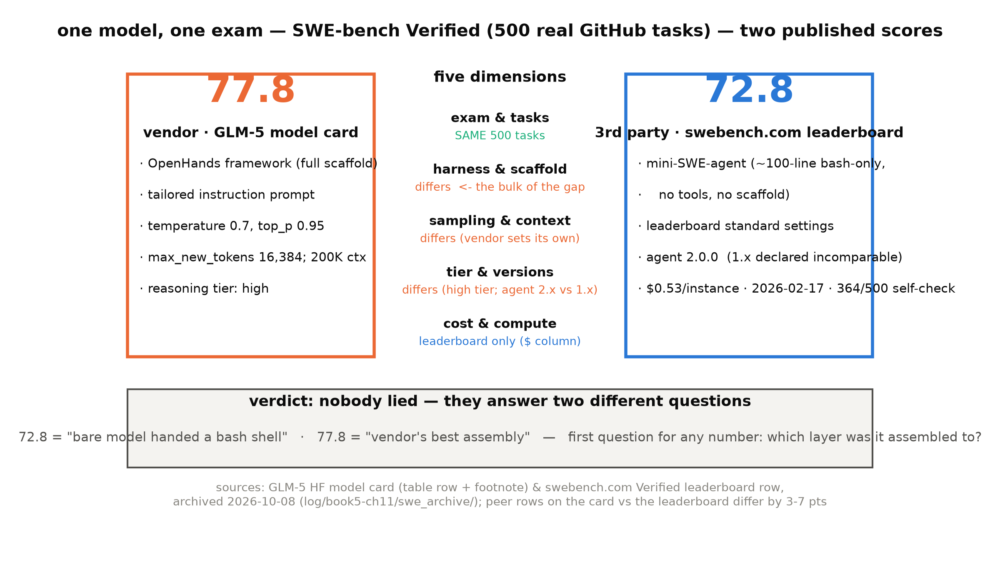
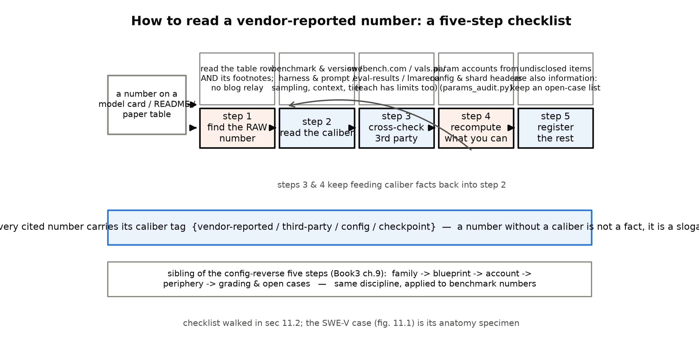

# 第 11 章 方法论：如何读厂商自报与预览版时代的模型

## 11.0 开篇：从全书到这里

上一章收束时把接力棒递了过来：「机器（三刀机）与能力地图（本章）都齐了。下一章是全书最后一门手艺——厂商报的数字怎么读」，并点名 2026 年的新局面「预览版论文、SPA 博客、托管口径、双数字打架」需要一套更严的读法【第 10 章 10.6 原文直引】。这门手艺从 Book3 就欠着。Book3 第 9 章的章末欠账框里写着：「本章练成的『config → 架构图 → 参数 assert → 证据分级 → 悬案登记』程序，下一册拆旗舰（精拆与各家 config 速览）时是日用工具；读厂商自报数字的操作手册另见后续册。→ Book4 第 10 章 / Book5 第 11 章」【Book3 第 9 章章末欠账框原文直引】。前半句在 Book4 第 10 章兑过一次——拆完 gpt-oss，收尾处还专门留了句地址：「而 Book3 那笔欠账的另一半『读厂商自报数字的操作手册』，地址仍在 Book5 第 11 章，原表保留」【Book4 第 10 章原文直引】。三次记账，本章一次清偿：B3-5 到期，「双数字打架」的案子也接下了。

这门课为什么单独成章，还放在倒数第二章？因为 2026 年的证据面在变薄，本册拆过的机器已经把三种新困难摆上桌。**预览版论文**：DSV4 的卡面自己写着 "We present a preview version of the DeepSeek-V4 series"，正文与数字都可能随正式版滚动【证据等级：厂商自报（模型卡）】。**官方博客正文不可达**：Qwen3-Next 的博客是动态渲染页，调研期抓不到正文，架构事实只能靠 config＋源码＋README 三方拼出（canonical 表登记在案）。**托管口径**：Qwen3.5 的 config 写着原生 262,144，「1.01M」是托管扩展的口径——「原生 1M」四个字从此不许写（第 9 章 9.1 注二的红线）。论文可以只有半版、博客可以下线、口径可以藏在服务端，而 benchmark 数字每天在你眼前滚动。拆机五步法教你读「架构是什么」，本章教你读「数字是什么」——这是同一门手艺的另一半。

本章产出四件：一个解剖到脚注的**主案卷**——GLM-5 在 SWE-bench Verified 上的双数字 77.8 对 72.8（11.1 节，图 11.1）；一套**读自报数字五步法**（11.2 节，图 11.2）加随身姊妹件**五问**；四个小案配额（11.3 节）——诚实自报、沉默不披露、口径自相矛盾、预览版定谳，四种「厂商与读者的关系」各配一案；工程侧的**键位对撞六坑**（11.4 节）——读无论文模型的最后一课是让对拍替你读。工具只有一件，但已经跑过三仓真账：[`ch11/params_audit.py`](code/ch11/params_audit.py)。

> **最小背景栏**（已学指回，本章不重教）：config 逆向五步法（认家族→重建图纸→算账对拍→读外围→证据分级＋悬案登记）＝Book3 第 9 章；无架构论文的旗舰拆解与「config 是厂商不得不诚实的地方」＝Book4 第 10 章；证据等级标注制度与预览版纪律＝第 4 章（案例章豁免主场）；K3 报告精读四纪律（双锚／逐句带锚／边界声明／图源）＝第 6 章 6.0 开篇；「差值先查自家账」＝Book4 教训、第 6 章 6.1 打过一次样。GLM-5 参数三口径的事实在 4.3 立过，本章 11.3 案 C 收进手册并加一件新证据——checkpoint 审计。

## 11.1 主案卷：同一张考卷，两个分数

先用两行把考卷说清。SWE-bench（软件工程基准）的题目取自真实开源仓库的 GitHub issue：给模型一份代码库和一段问题报告，让它自己定位、改代码、提交补丁；补丁能通过仓库自带的回归测试，记一次「解决」（resolved）。SWE-bench Verified（SWE-V）是经人工核验的 500 题子集，2026 年旗舰代码能力的主赛道。关键在于：模型自己不会逛仓库——得有人把它装进一个外壳里跑分。这个外壳，评测 harness（harness，评测装配框架：agent 框架、指令、工具、采样参数的总和），才是分数的另一半作者。**benchmark 数字测的从来不是模型，是「模型×装配」这台整机组**。记住这一点，案卷可以开了。

案情一句话：同一个 GLM-5，同一张 500 题的卷子，两处官方级数字——模型卡写 77.8，SWE-bench 官方榜写 72.8，整整差 5 分。两处原文见实物 11.1。

> **实物 11.1（SWE-V 双数字的三处原始记录）**。看什么：块 A 是厂商自己写下的口径（表行＋脚注原文，注意 "tailored instruction prompt" 就住在脚注里）；块 B 是第三方榜那一行的完整字段（成本与日期都在）；块 C 是加码发现——同一张 HF 卡的 eval-results 元数据层里，双数字并存、各带出处，「谁也没撒谎」的机器可读版。
>
> 块 A（GLM-5 模型卡基准表行与脚注，原文）：
> ```
> SWE-bench Verified | 77.8 | 73.8 | 73.1 | 76.8 | 80.9 | 76.2 | 80.0
> *We run the SWE-bench suite with OpenHands using a tailored instruction
>  prompt. Settings: temperature=0.7, top_p=0.95, max_new_tokens=16384,
>  with a 200K context window.
> ```
> 块 B（swebench.com Verified 榜 GLM 5 (high) 行，一手存档解析）：
> ```
> name=GLM 5 (high) | agent=mini-SWE-agent | resolved=72.8 | instance_cost=$0.53438913622
> date=2026-02-17 | mini-swe-agent_version=2.0.0 | model_org=Z-AI | os_model=True | os_system=True
> ```
> 块 C（HF eval-results 元数据层，两条并存；「…」=省略 dataset／url／filename 等字段）：
> ```
> {"value": 72.8, "source_name": "SWE-Bench official evaluation", "isExternal": true, …
>  "notes": "high reasoning, official"}
> {"value": 77.8, "source_name": "Model card", "isExternal": false, …
>  "notes": "Z.ai reported number"}
> ```
> 【证据等级：块 A 厂商自报（zai-org/GLM-5 模型卡，2026-10-08 一手存档）；块 B 第三方复测（swebench.com，2026-10-08 一手存档；存档含 500 题 per-instance 明细，自校验 364/500=72.80% 与榜分逐位一致）；块 C 厂商自报（HF 页面元数据层，一手存档）】

块 C 值得多看一眼：连官方页面自己都把两个数并排登记、各贴出处标签——这不是谁抄错了谁，是两个口径在同一张卡上合法共存。那 5 分差到哪去了？把两个口径拆到五个维度上（图 11.1），一维一维对：

**第一维，考卷。**这一维恰好相同：都是 SWE-V 的 500 题，分差不是换卷子考出来的。换卷子的案子本册也见过——GLM-5.2 的主打赛道从 Verified 换成 Pro，62.1 分与 77.8 分不可跨代直比（第 4 章 4.4 挂过号）；SWE-V、SWE-Pro、SWE-Multilingual 是三张卷，报名字时必须带后缀。

**第二维，装配。**77.8 的跑分装在 OpenHands 里——带完整脚手架的成熟 agent 框架，外加定制指令（脚注自曝 "tailored instruction prompt"）；72.8 的榜行用 mini-SWE-agent——约百行、只给一个 bash 的裸 agent，官方榜默认档自述 "no tools, no special scaffold structure"【证据等级：第三方复测（swebench.com 榜单方法论页）】。这是五维里的大头：一份趁手的工具链对真实工程任务值几分，不用猜，11.1 末尾的榜首语境会给出量级。

**第三维，采样与上下文。**官方跑分自设 temperature 0.7、top_p 0.95、最多 16,384 个新 token、200K 上下文窗；榜单侧用榜单统一设定（mini-SWE-agent 2.x 不设温度）。两边都是合法口径，但不是同一口径——采样参数这位隐形参与者，在脚注与榜单方法论页里各写了一半。

**第四维，档位与版本。**进榜的是 "GLM 5 (high)"——推理档位写进榜名；agent 版本 2.0.0，而官方榜明言 1.x 与 2.x 不可比（2.x 走工具调用，1.x 从输出串解析动作）【证据等级：第三方复测（swebench.com 榜单方法论页）】。比对任何两个 benchmark 数字，模型版本与 agent 版本两个号都要抄。

**第五维，钱与算力。**榜单独有成本列：$0.53 一题【证据等级：第三方复测（swebench.com，一手存档）】；厂商自报从来不带钱，也不带跑批用的算力、并行度、重复采样次数——这些一律不披露（11.3 案 B 专门讨论）。同是 72.8 分，$0.53 与 $0.47 在榜上是两行。

判词可以落锤了：**谁也没撒谎——两个数回答的是两个问题**。72.8 答「把裸模型丢给一个 bash 会怎么样」；77.8 答「厂商的最佳装配能到哪」。读自报数字的第一问永远是：它装配到哪一层？

两条补证把判词钉死。其一，5 分差是口径差的常态量级，不是 GLM 一家的异常。实物 11.1 块 A 的对照列里，Claude Opus 4.5 写 80.9、Kimi K2.5 写 76.8、DeepSeek-V3.2 写 73.1——都是各家的自报数；它们在 swebench.com 裸 agent 榜上分别是 76.8、70.8、70.0【证据等级：第三方复测（swebench.com，一手存档）】。对照列与第三方榜的同模型差距 3-7 分——**每一家自报时都站在自己的最佳装配上**，这是行业的默认姿势，不是某一家的修辞。其二，第三方也不是一块铁板：vals.ai 用同一个 mini-SWE-agent 复测 GLM-5 得 71.40，与 swebench.com 的 72.8 仍差 1.4 分【证据等级：第三方复测（vals.ai，2026-10-08 直核存档）】——跑批日期与采样不同，同为第三方也有自己的口径层。「找第三方交叉」这一步，本身也要核口径。

引 72.8 还有最后一条语境限定：带脚手架的系统行占据榜首（79.2 档）【证据等级：第三方复测（swebench.com，一手存档）】，72.8 是「裸 agent 档」内的并列第一梯队（与 GPT-5.2 high 同分，$0.53 对 $0.47），不是全榜第一。截一行数字发新闻稿时，最容易丢的就是这层档位限定——本册引用 72.8 一律带「mini-SWE-agent 裸档」前缀（卷级大纲红线㉕：2026 benchmark 双数字并标）。



图 11.1 GLM-5 SWE-V 双数字五维口径解剖（自绘示意级；数字=2026-10-08 一手存档 `log/book5-ch11/swe_archive/`，证据等级随行标注于图内）。出处：[`code/ch11/fig_ch11.py`](code/ch11/fig_ch11.py)

## 11.2 五步法：把读数变成操作手册

主案卷的手感可以固化成程序了。Book3 第 9 章给「拆机器」立过五步：认家族→重建图纸→算账对拍→读外围→证据分级＋悬案登记。本章给它立姊妹篇——**读自报数字五步法**（图 11.2），每一步在主案卷里都已经用过一遍：

**第一步，找到 raw 数字。**到 config、README、论文表的原件里把数字连同脚注一起抄回来，不接受转述。理由主案卷已经给过：口径住在脚注里——"tailored instruction prompt" 五个字只在脚注出现，只抄表行的转述永远看不到它。转述丢的不只是精度，是口径。

**第二步，核口径。**benchmark 名与版本（Verified 不是 Pro 不是 Multilingual）、harness 与 prompt（OpenHands 还是裸 agent）、采样与上下文（温度、次数、窗口）、推理档位（high/max/xhigh）、agent 与模型版本。11.1 的五维清单在这一步逐项过——第一维「考卷相同」也要显式确认过才算数。

**第三步，找第三方交叉。**swebench.com、vals.ai、HF eval-results、lmarena 各有各的局限（表 11.1），交叉时把局限连同数字一起抄回来。交叉命中是强证据——72.8 与 77.8 的并置本身就是完整信息；交叉不命中先问口径再怀疑数字（vals 的 71.40 对榜的 72.8）。

**第四步，复算可算的。**参数账、KV/状态账本——本书从 Book3 起的招牌动作。能力数字大多复算不了，但「这台机器有多少参数、多少层、什么排布」永远可复算，而且复算常能反过来裁决书面数字（11.3 案 C 全程演示）。能力数字复算不了时，退而求其次的是代理指标，而代理指标与端到端质量的裂缝要如实标注——IndexCache 附录 C 的负结果（注意力输出的余弦相似度不预测端到端效果，第 4 章 4.4 借过一次）与第 2 章「PPL 不塌≠长程任务不塌」是同一条纪律的两处落地。

**第五步，悬案登记。**读不出来的东西列成清单，不猜。「不披露也是信息」——但信息只能登记到事实为止，11.3 案 B 给出边界。



图 11.2 读自报数字五步法流程图（自绘示意级）：与 config 逆向五步法（Book3 第 9 章）逐级对应的同构姊妹篇。出处：[`code/ch11/fig_ch11.py`](code/ch11/fig_ch11.py)

表 11.1 第三方复测源清单与局限（读法：数字与局限必须一起抄回）

| 源 | 性质 | 局限 |
|---|---|---|
| swebench.com 官方榜 | SWE-bench 团队自营；mini-SWE-agent 裸档；成本／日期／agent 版本列齐 | 动态渲染、数字会滚动——引用前重验存档；1.x/2.x 不可比 |
| vals.ai | 独立评测机构；mini-SWE-agent；带成本列 | 跑批日期与采样自成一套——同模型与官方榜可差 1 分级 |
| Artificial Analysis | 商业评测站（质量指数、Terminal-Bench 等） | 商业口径自定，部分内容需订阅（K3 卡面自己引它的数） |
| DeepSWE 榜／FrontierSWE／SWE-Marathon | 社区与企业专项榜 | 专项域窄；复测也有再加工（K3 脚注：FrontierSWE 分数用官方脚本重算） |
| lmarena 等 | 人评 Elo | 多版本投放污染史（2025 前科）——方向参考，不作定数 |

【证据等级：各源页面性质为公开事实；局限列=调研期逐源一手核验】

五步之外，再发一件随身工具：**五问**。任何一个自报数字贴到脸上，先过这五道闸——谁跑的？哪张卷？装配到哪层？怎么采的样？跟谁比、对手的数是谁跑的？例 11.1 拿一个构造的数字走给你看。

> **例 11.1（构造例：五问拆一个虚构的自报数字）** 设想某模型卡写着「XX-Bench 89.1」，脚注一行小字：「v2-revised，自家 agent 框架，temperature 0.7；对照组数字取自各家官方发布」。
> 1. 第一问·谁跑的：输入＝表格落款与脚注（无第三方标记）→ 输出＝厂商自跑——证据等级先降一档，登记「厂商自报」。
> 2. 第二问·哪张卷：输入＝脚注 "v2-revised" → 输出＝不是公开 v2，是厂商自建的修订版考卷——版本口径登记「自建分支」。
> 3. 第三问·装配到哪层：输入＝「自家 agent 框架」 → 输出＝满装档（带工具与脚手架）——89.1 回答「最佳装配」，不是「模型本身」。
> 4. 第四问·怎么采的样：输入＝「temperature 0.7」，无次数声明 → 输出＝单次高温采样，未声明是否多次取优——采样口径半开。
> 5. 第五问·跟谁比：输入＝「对照组取自各家官方发布」 → 输出＝对照列是别家的自报数，与本家自跑数同台——两种口径互比。
>
> 效果读法：五问走完，「89.1」从一句口号变成一条带档案的记录——{厂商自跑 · 自建修订卷 · 满装 · 单次采样 · 对照为转引}。数字一个没改，你能问出的问题已经全变了。（本例五问的答案在真实世界里各有一个正主：自建修订卷=GLM-5 Terminal-Bench 的 † 分支、自家 harness 双数=K3 DeepSWE、对照转引=各家卡面常态——见下面几行。）

真实世界的口径花样，五家巡礼一遍：GLM-5 的 Terminal-Bench 2.0 报「56.2 / 60.7†」双数，† 脚注自曝修订版是 zai 自建并发布的 terminal-bench-2-verified 数据集（修「歧义指令」）——厂商改考卷再报分的边界案例【证据等级：厂商自报（模型卡）】；K3 卡面对照列声明对竞品取 "best score across harnesses"（跨 harness 取各家最高），自家 DeepSWE 双数并报 67.5（自家 harness）与 67.3（mini-SWE-agent 榜）【证据等级：厂商自报（模型卡脚注）】；DSV4 全表按 Non-Think／High／Max 三档报分，推理档位成了表格的一等列【证据等级：厂商自报（预览版材料）】；Qwen3.5 的 MathVision 脚注声明对竞品取带与不带 \boxed{} 两次跑分中的较高者【证据等级：厂商自报（模型卡脚注，调研期转录）】；跨卡混装则是 2026 常态——GLM-5.2 表内的 DSV4-Pro 列引 DeepSeek 自报、K3 表内的 GLM-5.2 列引 z.ai 博客，表里每个竞品数字都要单独问一句是谁跑的。五种花样一个共同点：**它们全部写在原文里**——第一步抄全 raw、第二步核口径就能全部捕获。读不到口径，不是因为藏得深，是因为没读到脚注。

## 11.3 四个小案：诚实、沉默、矛盾与预览版

主案卷演示的是「两个口径都合法」。四小案补齐另外四种厂商与读者的关系——方法论的成色不在解剖对手，在于四种关系用同一套程序。

**案 A·诚实自报：一张战了 235B 的表。**Qwen3-Next 的 README 宣传句只说："not only surpassing Qwen3-30B-A3B-Thinking-2507 and Qwen3-32B-Thinking, but also outperforming the proprietary model Gemini-2.5-Flash-Thinking across multiple benchmarks"【证据等级：厂商自报（官方 README，2026-10-08 抓取直引；快照一手存档 `log/book5-ch11/qwen3next_readme/`，2026-10-09 补档）】。对照组名单里没有自家旗舰 Qwen3-235B-A22B-Thinking-2507——但紧挨着的基准表诚实地把它摆进了对比列（实物 11.2）。本书逐行清点的结果：23 个数据行里，Qwen3-Next 对 235B 列 18 行落败、5 行小胜（最大分差 +3.0），表内加粗（行最优）只拿了 2 行【证据等级：本书清点（README 原表逐行，抓取 2026-10-08）】。宣传句没有撒谎——它超越的确实是 30B/32B 与 Gemini-2.5-Flash；表格也没有粉饰——它把打不过的老大哥完整陈列了。这张表还有一处口径透明值得点名：Arena-Hard v2 的脚注声明胜率由 GPT-4.1 评审（评审模型披露）【证据等级：厂商自报（模型卡脚注）】。方法论不是教人怀疑一切——**五步法同样能把「诚实」验证出来**，而验证过的诚实才敢信。

> **实物 11.2（Qwen3-Next 自报表原样三行）**。看什么：第 4 列就是 235B——宣传句没提的名字在表格里全程在场；两行 TAU 一胜一败，胜差 +1.8、败差 −4.1，胜的恰好是宣传句主打的 agent 类任务。
> ```
> |  | Qwen3-30B-A3B | Qwen3-32B | Qwen3-235B-A22B | Gemini-2.5-Flash | Qwen3-Next-80B |
> | TAU1-Retail | 67.8 | 52.8 | 67.8 | 65.2 | **69.6** |
> | TAU2-Retail | 58.8 | 49.7 | **71.9** | 66.7 | 67.8 |
> ```
> 【证据等级：厂商自报（Qwen/Qwen3-Next-80B-A3B-Thinking README 原表，2026-10-08 抓取；列名截短，数值未动）】

**案 B·沉默不披露：K3 的未披露清单。**第 7 章读 K3 报告时登记过：训练 token 总量、集群规模、MFU——绝对算力账全部未披露；披露的 "2.5×" 是同验证损失下 FLOPs 轴相对 K2 的效率口径（第 7 章 7.5 已读），分母不可查；MXFP4 QAT 的掉点数字同样未披露（第 7 章 7.2 如实记）【证据等级：负结果——官方技术报告（arXiv:2607.24653）与模型卡全文检索，缺席项逐条回查过】。读法分两层：事实层，缺项列清单、登记为悬案；判断层，**不披露也是信息**——一家把架构细节写到逐式逐页的厂商唯独不给绝对账，更可能是竞争考虑而非不知情。但判断只能登记到「动机可疑」为止，不进正文当论据；正文引用 2.5× 时保留原句、不加解读（canonical 表的处置）。「不披露也是信息」的正确用法是指导你下一步去哪找（第三步交叉、第四步复算），不是替你脑补数字。

**案 C·口径自相矛盾：GLM-5 的三本账与 K3 的残差销案。**这是第④步「复算可算的」的招牌标本，4.3 立过事实，这里收进手册。GLM-5 的参数量有三处官方级写法：论文 Table 10 写 744B、HF 页面写 754B、GLM-5.2 写 753B。本册前置自算（safetensors 分片头逐张量求和，不下载权重）把三本账全部复算闭合，一台机器 753,864,139,008 个参数，两种拆法：

$$\underbrace{753.864}_{N_{\text{全量}}}\;=\;\underbrace{743.911}_{N_{\text{论文}}\ (\approx 744\text{B})}\;+\;\underbrace{9.953}_{N_{\text{MTP}}}\;=\;\underbrace{751.961}_{N_{\text{口径句}}}\;+\;\underbrace{1.903}_{N_{\text{嵌入}}+N_{\text{输出}}}\qquad(\text{B}=10^{9}) \tag{11.1}$$

| 符号 | 含义 | 单位／形状 |
|---|---|---|
| $N_{\text{全量}}$ | checkpoint 全部张量的逻辑元素和 | 标量（B=$10^9$） |
| $N_{\text{MTP}}$ | 第 79 层 MTP 层参数（GLM 惯例 `layers.78`，9,952,920,576） | 标量 |
| $N_{\text{嵌入}},\,N_{\text{输出}}$ | 词嵌入与 untied 输出层（各 951,582,720） | 标量 |
| $N_{\text{论文}}$ / $N_{\text{口径句}}$ | 论文 Table 10 口径／口径句字面（含 MTP、不含嵌入输出层） | 标量 |

用人话说：744B 不是 754B 的四舍五入，是另一本账——全量拆掉 MTP 层得到论文的 744B，拆掉嵌入与输出层得到 751.96B；而论文的口径原句偏偏声明的是后一种拆法（"we include the parameters of MTP layers but not word embeddings and the output layer"，4.3 直引过），字面算不出自家数字。**口径句与自家数字矛盾——复算才能抓到的矛盾，如实写、不猜作者意图**【证据等级：官方论文 2602.15763 v2 Table 10 + checkpoint 亲算（2026-10-05/10-08 两轮）】。

同一件工具这回把第 6 章的旧悬案也销了。第 6 章 6.1 自算 K3 激活参 101.95B，与官方 Table 1 的 104.2B 差 −2.2B，双报登记、候选猜了三个（MTP 激活、ViT、router 口径）都没证实。本册 checkpoint 审计（96 个分片头、497,220 个张量）给出终审：全家族含 ViT 共 2,779.932B、文本主干 2,779.484B——官方 2.78T 命中（差 +0.068B）；激活参去输出层 104,189,615,872——官方 104.2B 命中（差 +0.010B）【证据等级：checkpoint 亲算（`log/book5-ch11/params_audit/Kimi-K3.json`）】。那 2.2B 的残差销案：

$$\underbrace{101.95}_{\text{config 公式（第 6 章）}}\;+\;\underbrace{3.41}_{\text{gate 形状}}\;-\;\underbrace{1.17}_{\text{输出层口径}}\;=\;104.19\;\approx\;\underbrace{104.2}_{\text{官方 Table 1}}\qquad(\text{B}=10^{9}) \tag{11.2}$$

用人话说：第 6 章差的那笔账，两笔小账就配平——满秩输出门的形状按 checkpoint 实测加回、官方激活口径不含的输出层减掉，正好落在官方数上。真凶不在第 6 章猜的候选里，在自家公式账里：config 公式把门记作 $7168\times7168$ 的方阵（51,380,224），分片头里它的真身是 $[12288,7168]$（88,080,384，$12288=96\times128$ 个头位）——门作用在输出投影之前的头空间，比模型维宽；每层多 36,700,160、93 层合计约 +3.41B（另有零头）。**「差值先查自家账」查到 checkpoint 层才真正水落石出——官方数字没藏，自家的公式先错了**【证据等级：checkpoint 亲算（C-107 定谳；正文主数仍钉官方 2.78T／104.2B）】。审计顺手还交了三张副产品：层型签名与 config 层表逐层互证（match=True——`full_attn_layers` 的 1 起层号减一恰好等于 checkpoint 签名层号，第 6 章 6.1 层号口径的权重级佐证；`kv_a` 形状 576 的三源定谳也在此添了第四证）；MXFP4 打包按「每字节两个 FP4」解包、组标度不计参数（`w1.weight_packed` 形状 $[3072,1792]$ 的 U8＝逻辑 $[3072,3584]$）；存储字节和与 index 的 total_size 逐字节相等（1,560,860,324,864）——让工件自证读对了账。

> **实物 11.3（params_audit 产物 JSON 原样节选）**。看什么：GLM-5 块的三个 calibers 就是式 (11.1) 的机器版——`C_backbone_only` 命中论文 744B（差 +0.089B=舍入）、`B_paper` 是口径句字面的 751.961B（不命中自家 744B）；K3 块的 `text_minus_lm_head` 就是式 (11.2) 的右端。
> ```
> "calibers": {                                    ← GLM-5.json（282 分片）
>  "A_total_safetensors(全量)": 753.864,
>  "B_paper(全量-嵌入-输出层, 含MTP)": 751.961,
>  "C_backbone_only(全量-MTP)": 743.911
> },
> "_raw": { "total": 753864139008, "embed_lmhead": 1903165440, "mtp": 9952920576 },
> "calibers": {                                    ← Kimi-K3.json（96 分片）
>  "B_logical_total(全家族含ViT+projector)": 2779.932,
>  "C_logical_text_backbone(官方2.78T主数域)": 2779.484
> },
> "text_minus_lm_head": 104189615872,  "B_minus_lm_head": 104.1896,
> ```
> 【证据等级：本书实验（checkpoint 亲算；GLM-5=2026-10-05 批一轮、K3=2026-10-08 批三轮；「←」注为本书所加、JSON 键值未动；复现命令见 11.6）】

**案 D·预览版读法：C-60 定谳全程。**预览版论文的证据等级要降一档，且要预设它会滚动——但降一档不等于不可用，第 4 章的 C-60 悬案走到定谳的全过程就是活教材。案情：DSV4 预览版论文讲「训练阶梯 4K→1M 真练」，行文里读不出任何外推组件；checkpoint 的 config 却白纸黑字写着 `rope_scaling` 的 YaRN 因子 16——两说并立，一度登记为悬案。定谳走的就是五步：①找 raw——两处原文并置（论文行文句＋config 三字段 `rope_theta 10000`／`compress_rope_theta 160000`／`rope_scaling YaRN16 original 65536`【证据等级：config 逆向】）；②核口径——论文行文讲的是「训练故事」，config 字段是「部署事实」，两者可以同时为真；③交叉——本地源码默认值与 V4.1 卡面 "sparse attention trained at 64K, context extended to 1M" 互证【证据等级：厂商自报（模型卡）】；④复算——$65536\times16\approx1.05\text{M}$，因子 16 恰是从 64K 到 1M 的桥，且只挂在压缩 rope 组（$\theta=1.6\times10^5$）上；⑤登记升级——悬案变判决：**双 rope 组分工**（main 组 $\theta=10^4$ 不缩放、滑窗层原样；compress 组 64K 起 YaRN16、无 mscale）。「发布外推补丁」「纯训练无外推」两句读法从此禁用（第 4 章 4.2 的判决书）。教学点在收尾：**预览版的正确姿势不是不信，是「降一档＋预设滚动＋正式版出来后重走五步」**——定谳写进悬案册、地址可回查，「改判」是程序的正常动作而不是丢脸的事。

> **【考据框】「无论文案例」改配声明。**大纲期预设「GLM-5 无论文」，调研证伪——GLM-5 有正式论文（arXiv:2602.15763 v2，第 4 章起即按「论文＋自报并读」执行）。因此本册的无论文读法案例改配为：DSV4 预览版（近无论文——只有预览版论文＋config）与 gpt-oss（真无论文，Book4 第 10 章正身）；GLM-5 降格为「论文＋自报并读」案例（本案 C）。方法论不变，案例的难度梯度反而更完整：无论文→预览版→有论文，三级证据面各有一章正身。

许可也是自报信息，照五步法逐仓核——本册三处任务预设被勘正的活例：DeepSeek V3.2/V4 线权重是 MIT（不再是 Model License v1.0）、K3 是自定义 Kimi K3 License（不是 K2 的 Modified MIT）、GLM-5 是「权重 MIT＋代码 Apache-2.0」双轨（不是智谱自定义条款）【证据等级：各仓 LICENSE/yaml 逐字核（调研 articles/01）】。图源同查：GLM-5 论文图 CC BY 可引，K3 报告图 CC BY-NC-ND 禁用——第 6/7 章七张机制图全部从零自绘，就是这条核验的直接后果。

四案收拢：诚实、沉默、矛盾、预览——四种关系，同一套程序。五步法不是怀疑论，是把「信什么、信到哪」写成可复现的动作。

## 11.4 键位对撞六坑：让对拍替你读

方法论的正门在数字，侧门在工程：读无论文或论文不齐的模型，除了读 config 还要读键位——state_dict 的张量名与形状是厂商不得不诚实的**第二现场**（权重要能被加载器读起来，键位就必须说真话——「config 原理」的键位版）。第 5 章整机 strict 直搬时逐个排掉六个坑，表 11.2 收账；本章的 checkpoint 审计把它们从「坑」翻成了「产能」。

表 11.2 键位对撞六坑（实测版；正身=[`ch05/qwen3next_mini.py`](code/ch05/qwen3next_mini.py) 头部注释，strict 直搬逐位对拍验证）

| 坑 | 内容 | 抓法 |
|---|---|---|
| K1 交错头排布 | `in_proj_qkvz` 输出按 K 头交错切 $[q,k,v,z]$，不是连续四段 | strict 直搬：键名对上、数值全错 |
| K2 双 RMSNorm 不同构 | 层 norm 是 $(1{+}w)$ 缩放，GDN 输出 norm 是 $w{\cdot}\mathrm{silu}(z)$ 门——同文件两个类两种语义 | 逐位对拍抓出 |
| K3 partial RoPE 只旋前段 | 只旋前 `rotary_dim` 维、后段直通（第 8 章式 (8.1) 的实现真相） | 位置敏感性对拍 |
| K4 门控注意力 q_proj 宽 $2{\times}$ | query gate 与 q 同投影输出，宽度即证据 | 键位形状对账 |
| K5 因果短卷积取前段 | pad 后取前 $n$ 位，不是取中段 | 逐位对拍抓出 |
| K6 门参数 g 全程 fp32 | 防溢出的 dtype 约定——dtype 也是键位的一部分 | 对拍数值漂移 |

六坑的共同点：没有一个是「看文档能看出来的」——当时根本没有文档可看（Qwen3-Next 博客正文不可达，11.0 的第二种困难）。它们全部是 `load_state_dict(strict=True)` 与逐位对差这类**机械动作**抓出来的。六坑之上还有更险的一档：公式读错。第 5 章首版 chunkwise 把 UT 系统写成 $(I-M)^{-1}$——正身是 $(I+M)X=b$；一字之差，块内冲销方向全反，而这个错**看代码看不出来**：形状全对、能跑、不炸，是被与 HF 内核的对拍当场按住的。那句行规值得原文回收——**「读无论文机制的正确姿势是让对拍替你读」**【第 5 章 5.7 原文直引】。

本章把这条行规用到了数字侧。params_audit 读的就是 497,220 个张量名与形状：K3 的 MoE 模块叫 `block_sparse_moe` 而不是 `mlp`（`mlp` 只在首层稠密 FFN 出现）、AttnRes 的伪查询住在 `res_proj`；GLM-5 侧 `layers.78` 是 78 层主干之外那格 MTP 层——审计的每个桶怎么分，靠的全是键位阅读；而「存储字节和与 index 的 total_size 逐字节相等」这类自校验，就是对拍思想在审计里的形态：让工件替你验证你读对了。数字侧与工程侧由此合流成两律：**差值先查自家账**（复算不合时，嫌疑最大的永远是自己公式里漏算或错算的那一项——案 C 的 gate 形状是最新一例）；**让对拍替你读**（读得对不对，由 strict 直搬与逐位对差裁决，不由自信裁决）。第 5 章 K1-K6 是这两律在整机上的第一次全章演练，本章是它们在旗舰数字上的收官。

## 11.5 本章小结

开篇的欠账清了。Book3 第 9 章许下的「读厂商自报数字的操作手册」，本章兑成正身：主案卷把 GLM-5 的 77.8 对 72.8 拆到五维（考卷／装配／采样／档位版本／成本算力），判词「谁也没撒谎」；五步法（raw→口径→交叉→复算→登记）与五问把解剖固化成程序；四个小案覆盖诚实（Qwen3-Next 的 18 败表）、沉默（K3 未披露清单）、矛盾（GLM-5 三本账＋K3 残差销案）、预览版（C-60 定谳全程）四种关系；工程侧键位六坑与 UT 实录把「读」的验证交给对拍；[`params_audit.py`](code/ch11/params_audit.py) 用三仓真账（GLM-5／5.2／K3，分片头 KB-MB 级读取、不下权重）给第④步当了工具正身。

**带走的心智**：把案例都还回去，留三句话。**其一，benchmark 数字没有「真假」，只有「口径」——它测的是「模型×装配×采样」这台整机组，不是模型本身；问口径永远先于问大小，77.8 与 72.8 都是真数，因为它们根本不是同一个数。其二，证据有信任序——先信 config、再信代码、最后才信形容词；config 与 checkpoint 是厂商不得不诚实的两处（权重要能加载、要能复现，它们就必须说真话），宣传句只是口径的广告位。其三，复算与对拍是你自己能做的唯一实验——差值先查自家账（K3 的 2.2B 残差销在自家公式账里），悬案登记不是认输，是把「不知道」钉成可以回查的事实。**

镜头拉回全书：本册的三样东西至此齐了——机器（第 2-9 章：三条路线、两台精读、一台三刀机）、能力（第 10 章的能力地图）、读数的手艺（本章）。下一章收束全书：三条路线的判决、十一钩的总决算、新账本的移交。这套读数方法还有一处原样适用：给推理引擎选型时读厂商吞吐曲线与自报服务指标，是同一个「口径先行、复算可算的、交叉第三方」的程序——那是 Book8 第 11 章的正题。

## 11.6 动手验证

- **三仓参数口径审计**（CPU＋网络分钟级；K3 侧 96 个分片头合计约 77 MB Range 读取，不下载 1.56 TB 权重本体；分片头落缓存，重跑秒级）：
  ```bash
  cd 工作区根目录 && source env.sh && \
    python "[`code/ch11/params_audit.py`](code/ch11/params_audit.py)" --repo zai-org/GLM-5 \
        --repo zai-org/GLM-5.2 --out log/book5-ch11/params_audit
  python "[`code/ch11/params_audit.py`](code/ch11/params_audit.py)" --repo moonshotai/Kimi-K3 \
      --out log/book5-ch11/params_audit
  ```
  预期产出：GLM-5 三口径 753.864／751.961／743.911（744B=全量−MTP 复算命中、HF 754B=全量、口径句字面 751.96B 不命中）；GLM-5.2 全量 753.330B；K3 三读数 2,779.932／2,779.484／激活去输出层 104.1896B（官方 2.78T／104.2B 双命中）＋ 存储自校验 1,560,860,324,864 逐字节相等；产物 JSON 落 `log/book5-ch11/params_audit/`（2026-10-08 复跑一轮与正档逐位一致，复跑档存 `params_audit_verify/`）。
- **SWE-V 双数字一手存档复验**（动态榜单，正式引用前重跑核对时间戳）：
  ```bash
  cd log/book5-ch11/swe_archive && \
    curl -sL -A "Mozilla/5.0" https://www.swebench.com/ -o recheck.html && \
    grep -c '"name": "GLM 5 (high)"' recheck.html
  ```
  预期：命中 1（榜行仍在）；若数字滚动，按存档内 `ARCHIVE-README.md` §五 的流程登记新旧差。
- **两图复绘**：`python "[`code/ch11/fig_ch11.py`](code/ch11/fig_ch11.py)"`（图 11.1 SWE-V 解剖／图 11.2 五步法流程；秒级）。
- 验收点：能对任一自报数字独立走完五步法并写出口径标签与证据等级；能复述 SWE-V 双数字的五维差异与判词「谁也没撒谎」；能说出键位六坑中至少三坑与 UT 实录里「对拍抓错」的原理；能用 params_audit 对一台陌生旗舰复算三口径并判断哪本账对哪句口径句。
