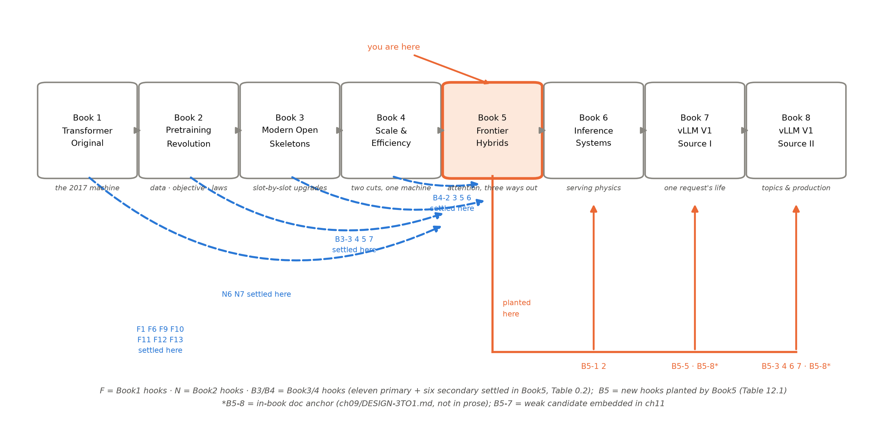
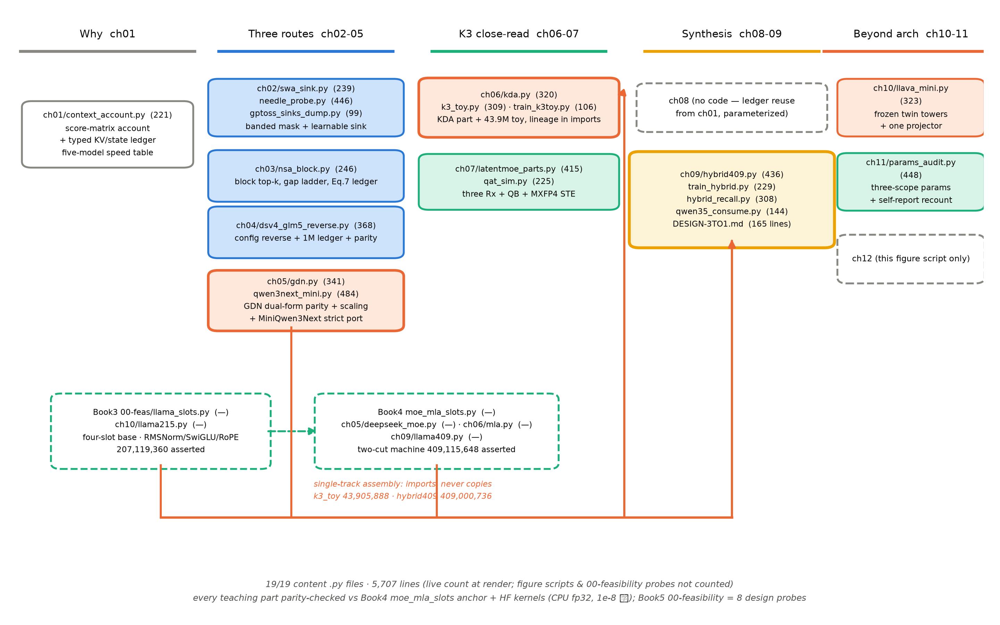

# 第 12 章 收束：满注意力不再是唯一解

> 本章是全书级「总-下」：没有新实验、没有新零件、没有新术语——全部数字在前十一章带证据等级出现过，此处只做四件事：判决（12.1）、回望与对账（12.2-12.3）、移交（12.4）、清点（12.5）。图 12.1/12.2 的复现命令见各自图注；术语表为首现章程序化核对版。

## 12.0 开篇：从全书到这里

导览开篇抄下过 Book4 卷末那句重话：「一条通往 Book5，注意力本体还在 $O(n^2)$ 里等着动手术，2026 旗舰的精读挂了账」【Book4 第 12 章成稿直引】。本册十二章走完，这句话的两个承诺都兑了现：手术做了三刀（第 2-5 章），旗舰精读了（第 6-7 章 K3 报告逐节、第 4/9 章四家 config 与谱系）；上一章合上最后一页装备——读厂商自报数字的五步法与五问，把「先信 config、再信代码、最后才信形容词」立成了防身术，章末把话递了过来：「下一章收束全书：三条路线的判决、十一钩的总决算、新账本的移交」【第 11 章成稿直引】。现在兑现这句交棒，回答四个问题。其一，**判决**：满注意力还是唯一解吗——三条路线各自的适用地界在哪，2026 年收敛了吗（12.1）？其二，**回望**：我们亲手造的两台机器——43.9M 的 K3 玩具与 ≈409M 的三刀机——证据链是否闭合（12.2）？其三，**对账**：前四册挂来的十一笔主钩、六笔次级钩，本册埋下的 B5-1~8，是否笔笔有下落（12.3）？其四，**移交**：本册立的那本新账交给谁、瓶颈正在移向哪里（12.4）——最后清点代码与词汇两份可带走的资产（12.5）。这是出发去后面三册前的装备清点。

> **最小背景栏**：本章没有新的前置知识，全部调用已教内容——三笔旧账与分类型账本（第 1 章）、滑窗与汇聚（第 2 章）、NSA→DSA（第 3 章）、两台 1M 真机与证据等级（第 4 章）、线性注意力与 GDN（第 5 章）、K3 注意力侧与玩具（第 6 章）、效率侧与三处方（第 7 章）、两条哲学（第 8 章）、谱系与三刀机（第 9 章）、能力地图（第 10 章）、读数方法论（第 11 章）。数字一律指回原处，不重新论证。

## 12.1 三条路线的判决：没有唯一解，也没有唯一替代

先判总命题。导览埋的那句总纲——**满注意力不再是唯一解**——现在可以连同它的下半句一起交卷：**但也没有唯一的替代**。证据不是我们偏好哪条路线，而是 2026 年四家旗舰在同一格插槽上各自选了不同的刀：Qwen3-Next 与 K3 选线性（3 GDN/KDA : 1 全局），GLM-5 选可学习稀疏（MLA+DSA 全层），DSV4 在稀疏路线里再造压缩（CSA+HCA 约 1:1），Gemma3 与 gpt-oss 留在窗口路线（5:1 与 1:1 窄窗 128）【证据等级：config 逆向（Gemma3/gpt-oss 两家=第 2 章表 2.1，其余=第 9 章表 9.1）】。把四家排成两路对照更清楚：一路是 **3:1 线性家族**（Qwen3-Next→Qwen3.5→K3，KDA+Gated MLA），一路是**稀疏索引家族**（GLM-5 MLA+DSA→GLM-5.2 IndexShare→DSV4 CSA+HCA）——两路都保留全局/精确成分，分歧只在「省的方式」：线性把九成的层换成固定状态，稀疏把每步访问钉到 $k$ 个条目。有没有哪家的消融敢说自己的路线全面胜出？最接近的是 GLM-5 §2.1.2 那张 SWA/GDN/DSA 同场对照表——但读它要用第 9 章钉死的并排标注：**GLM 自家口径、为 DSA 站台的选择性对照**（同一团队、同套预算、自家候选全数参赛）【证据等级：官方论文 2602.15763 v2 §2.1.2】。谱系没有收敛到唯一解——GLM-5.3 把 KDA×3+DSA×1 混进同一台机器（冻结线后，一句带过）倒是两条路线开始混编、收敛正在发生的信号。而配方层的三公约数也要按第 9 章的防以偏概全清单读：超稀疏 MoE 是谱带（32:1-64:1）不是定值、原生长上下文并不同步（Qwen 262K/GLM-5 198K 对其余三家的 1M）、FP4 级低精度只有 K3 与 DSV4 坐实——「2026 配方」是一张带着证据等级的菜单，不是一张海报。既然如此，选型的判断力比站队重要。三把刀各自的「什么时候选它」：

**窗口：最便宜的一刀，改视野不改算子。**两行 config 字段就把滑窗层的 KV 从无界钉到 $\min(n,W)$（Gemma3-27B 的滑窗层只占全机 KV 的 3.9%、gpt-oss 仅 0.10%），mask 是免费的几何；代价有二：账本渐近斜率只由全局层占比决定（Gemma3 全局层仍占 96.1%），无界的根还在；且「看多远」是手工超参——我们的 needle 复现把窗外位置几何钉死在随机（可达性决定论）。什么时候选它：上下文压力主要来自中段堆量、任务以局部语言学为主、且你只想动 config 不想动算子——它是唯一不用重训架构认知的一刀。

**稀疏：可控参与，计算有界、算子没换。**参与集合从超参变成参数（分数定「看谁」、预算 $k$ 定「看多少」、选中部分仍做精确 softmax 内积），访问账压到 $\lfloor t/d\rfloor+nl'+w$（NSA Eq.7 四档复现：8k→2048、64k→5632）；生产化是一部减法史——NSA 三分支→DSA 单索引器→CSA 压缩域→IndexShare 跨层共享，「选择机关越来越便宜」。代价：存储账没变（全量 KV 还在场），索引与检索的精确性押在学出来的选择上。什么时候选它：任务需要精确检索（问答、代码、长档比对——GLM-5 的选择动因），又要在 1M 档把每步访问量钉住。

**线性：固定状态，换掉算子本体。**打分表不再物化，$n\times n$ 折叠成与长度无关的状态（K3 的杀手数字：69 层 KDA 固定状态 217 MB 对 24 层 MLA 的 1M 账 29.0 GB，0.75%）；交叉点很小（Qwen3-Next $n^*=1{,}536$、K3 $\approx7{,}851$——真机工作区间全程在「赚」的一侧）。代价是两笔硬账：固定状态不做精确检索（Repeat After Me 的定理对整个固定状态家族成立），且容量有 $d_{\mathrm{dot}}$ 上限——所以 2026 无一例外给线性层配全局层，混合不是折衷、是负结论的工程解；我们的等参三臂在玩具档也如实复现了这一面（6000-10000 步预算内 GDN 含层臂钉在值先验平台 $\ln 64=4.159$，全全局臂 acc 0.54 电路成形中——规模/预算绑定声明，第 9 章 9.6）。什么时候选它：上下文极长且以「记得住、跟得上」为主，检索需求可以交给那一成的全局层。

三句话合起来就是选型判断力：**按检索需求选刀的深浅，按上下文档位选刀的组合，按分类型账本三栏（无界/封顶/固定）验预算**——2026 的答案几乎都是混装，纯血满注意力只在最小的机器上还经济。而四家虽未收敛到唯一解，第 9 章那张谱系表读出来的方向却一致：所有机器都走在同一条下降通道里——计算有界（超稀疏 MoE 砍每 token 的 FLOPs）、KV 压缩（MLA/滑窗/压缩条目砍缓存斜率）、字节钉死（固定状态与 FP4 级格式）——一档比一档狠，分歧只是各自走到了第几档。判词由此可以写准：**这不是「谁赢了注意力」的世代，是「注意力从必选件变成选装件」的世代**——选装件没有唯一型号，只有随任务与账本更新的菜单。

## 12.2 我们的机器回望：两台机器与三代血统

判决之后看机器。本册单轨主线交付两台：第 6 章的 **K3 玩具**（toyA，总参 43,905,888、激活非嵌入 11,662,176，assert 双口径）与第 9 章选做的**三刀机**（409,000,736，枚举=手算=定版常数逐位一致）。玩具的血统写在 import 语句里：Book3 的 RMSNorm 与 RoPE、Book4 的 MLA 与 DeepSeekMoE、本册的 KDA——四代组件一台机器；它的两个正档读数值得带走：门粒度双臂在 800 步 loss 打平（5.491 对 5.500，预注册分支③命中——粒度的 loss 收益在玩具档不可分辨），但 $g$ 分布自己分了化，跨通道 std 从初始化的一点 $-2.5$ 拉开到深层 1.62——「每通道学出了不同的遗忘速度」从报告断言变成第一手实测；K3 化换装（per-channel 门+满秩输出门）单点替换账 +372,048（44,277,936），逐项闭合。三刀机则以两刀机为底座：9 层注意力插槽换 GDN（层 7,393,312）、MLA 保留人读第 4/8/12 层（config 0 起 3/7/11，末层全局承 K3 惯例）、$w_{\text{expert}}$ 938→810 等总参补偿——冒烟初始 loss 10.5916 贴预言 10.5783，一窗 100 步整合短训 train 降至 7.4708、eval 7.3838，无 NaN（12.824 s/step 热漂移如实报，超窗 ckpt 续跑）。它的分类型状态账是三栏账本的教学版：MLA 3 层 960 元素/token 无界+GDN 9 层固定 1,317,888，交叉点 $n^*\approx1{,}373$。

两台机器再往前接两代，就是单轨主线的架构侧总决算——**等参三形态链**：Book3 稠密 207M、Book4 两刀 409M、Book5 三刀 409M（第 9 章表 9.4）。同一副骨架、同一份预算，注意力插槽从满注意力一色，到压箱（MLA），再到 3:1 混装——每一代的 assert 都在本机跑过，每一代的无界斜率同步递减：12,288→3,840→960（元素/token），外加三刀机那份与 $n$ 无关的固定记忆。「架构修改=对已知物的局部替换」这条主线在架构侧走完三步，账本给出了最直接的度量。实物 12.1 把三代总参并列（看什么：三个数逐位出自三份自测脚本，「同预算三代架构」不是修辞，是三行可以复跑的输出）：

```text
[参数账] 手算 = 207,119,360   实测 = 207,119,360   non-emb = 141,583,360
[cand2] 等激活·轻 MLA（主臂，409M 两刀机）：总参 409,115,648（手算=实测=探针 F 锁定数，逐位）| 激活 non-emb 136,109,056 …（双份口径续行略）
[三刀机] 总参 409,000,736（枚举=手算=定版，逐位一致）| GDN 层 7,393,312 × 9 + MLA 层 2,687,488 × 3 | vs cand2 两刀 409,115,648：差 -114,912（-0.028%——等总参补偿 w 938→810 的净残差）
```

实物 12.1 三台机器自测终端输出并列（2026-10-08 本机复跑原样摘录；依次=Book3 `llama215.py`、Book4 `llama409.py` cand2 主臂、本册 `hybrid409.py`）【证据等级：本书实验（CPU fp32，seed 20261002）】

把三刀机的证据链压成一张表，如表 12.1——它是 Book3 表 10.3 与 Book4 表 12.1 插槽证据链的第三代：那一册动两格，本册在它的底座上只动一格的**排布节律**。

表 12.1 三刀证据链表（插槽｜旧件→新件｜动刀章｜本机证据｜文献锚——Book3 表 10.3/Book4 表 12.1 同款第三代；读数均单种子趋势级、判据预注册）

| 插槽 | 旧件 → 新件 | 动刀章 | 本机证据 | 文献锚 |
|---|---|---|---|---|
| 归一化 | pre-RMSNorm（不动） | —（Book3 第 2 章） | 等价买简（Book3 消融指回） | Book3 表 10.3 |
| 前馈 | dense SwiGLU → MoE（$E$=8/top-2/共享 1；$w$ 938→810 等总参补偿） | Book4 第 2-5 章（本册只调 $w$） | 两代消融与 noaux 账承 Book4 指回 | 2401.06066（Book4 已核） |
| 位置 | RoPE 解耦车道承 MLA 层；GDN 层结构级 NoPE（真机 NoPE/partial RoPE 谱系见第 8 章） | —（Book4 第 6 章） | —（机制不变，只改层的归属） | Book4 表 12.1（车道）＋第 5 章 5.5（结构级 NoPE 口径） |
| 注意力 | 满注意力 MLA 一色 → $[\mathrm{GDN}\times3,\mathrm{MLA}]\times3$（MLA=人读第 4/8/12 层） | 第 5 章（GDN 件）+第 9 章（整机） | GDN 双形态对拍 1e-8 级+chunk 排程等价 5.38e-06；整机 assert 409,000,736 逐位；冒烟/短训见上文 | 2412.06464 v3（GDN）+ K3 报告 2607.24653（3:1 与末层惯例） |
| 出入口 | untied、$V$=32000（不动） | —（Book3 第 5 章） | —（口径开关承 Book3） | Book3 表 10.3 |

## 12.3 十一钩总决算：台账闭环与 B5 新钩地图

现在摊开对账页。导览表 0.2 预告过的台账，表 12.2 是回执：上十一行是本册接走的主钩，中六行是次级钩，下八行是本册埋下的新钩（B5-1~8，沿用登记纪律：显式地址、最小披露、不硬造）。

表 12.2 十一钩+次级六钩总决算与 B5 新钩地图（与导览表 0.2 逐行对应；回收落点与各章开篇回收句、章末欠账框对账）

| # | 钩子（一句话） | 本册兑现（回收章·摘要） | 状态 / 后续去向 |
|---|---|---|---|
| F11 | 原典 restricted attention 的占位 | 第 2 章开篇即兑——2017 future work 原句与 2026 config 两行字段并置 | 本册清账 |
| F12 | 「比点积更复杂的兼容性函数」通行证 | 第 1 章立、第 3 章选择打分复用 cmp、第 5 章 elu+1 核全额兑现、第 6 章 KDA/AttnRes 回响 | 本册清账 |
| F13 | 文本之外的模态 | 第 10 章三步曲+原生多模态一瞥（Book4 半句已兑） | 本册清账 |
| B3-3 | 外推 vs 状态压缩两条哲学 | 第 8 章主场——对决+iRoPE 调和+档位对表 | 本册清账 |
| B3-4 | 后训练链 | 第 10 章 10.4 概览（流程图级） | 本册清账 |
| B3-5 | 读厂商自报数字手册 | 第 11 章正身——五步法+五问（Book4 半句已兑） | 本册清账 |
| B3-7 | partial RoPE / NoPE 头维净土 | 第 6 章 K3 MLA 层 NoPE 落点+第 8 章「为什么旋得少反而好」收束 | 本册清账 |
| B4-2 | MLA 开箱后的换算子战线；Gated MLA | 第 2 章前半句开章+第 6 章 Gated MLA 正身（两处 diff） | 本册清账；Book7 第 9 章半句保留不动 |
| B4-3 | K3 的 MXFP4 量化感知训练 | 第 7 章逐字核死——SFT 起覆盖全后训练 | 半句清账；主落点 Book6 第 11 章／Book8 第 8 章 |
| B4-5 | 窄窗与汇聚元的机制与收益 | 第 2 章主场——banded mask+sink 正身+needle 复现+账本首算 | 本册清账 |
| B4-6 | Stable LatentMoE 三处方 | 第 7 章正菜——逐件+失效模式对应+玩具三臂 ablation | 本册清账 |
| F1 | $O(n^2)$ 旧账 | 第 1 章开题——两本账算到 1M 档（1T 格、14,901×） | 本册清账 |
| F6 | 位置外推 | 第 8 章——外推链 2026 现状（Gemma/gpt-oss/Qwen/GLM/DSV4 五家分列） | 本册清账 |
| F9 | 检索与注意力本体的余脉 | 第 10 章 10.5——projector=cross-attn 的和平版 | 本册清账 |
| F10 | 容量→上下文长度接力棒 | 第 4 章 1M 横表+第 8 章档位对表 | 本册清账 |
| N6 | few-shot 的能力侧 | 第 10 章能力地图归位 | 本册清账 |
| N7 | 上下文长度主线 | 第 4 章+第 8 章——1M 终局四档 | 本册清账 |
| B5-1 | 分类型账本的服务侧语义（滚动淘汰 vs 全保） | 第 2 章末埋（欠账框） | → Book6 第 5 章（第 3 章架构侧串联） |
| B5-2 | K3 的 MTP→EAGLE-3 合流与 KDA 回滚张力 | 第 7 章 7.4 埋（报告事实句） | → Book6 第 10 章 |
| B5-3 | 1M 长上下文的服务侧账 | 第 8 章末埋（展望句+欠账框） | → Book8 第 1 章（Book6 预告一句） |
| B5-4 | K3 报告 KV/状态联合管理官方定义句 | 第 6 章末埋（欠账框） | → Book8 第 1 章 |
| B5-5 | GDN/线性层的引擎后端 | 第 5 章末埋（欠账框） | → Book7 第 9 章 |
| B5-6 | 多模态服务路径（16,384 token/图） | 第 10 章末埋（欠账框） | → Book8 第 4 章 |
| B5-7 | 读数方法论的引擎选型复用 | 第 11 章末埋（弱候选——并句不设框） | → Book8 第 11 章 |
| B5-8 | 3:1 整机=混合 KV 布局的账本算例 | 第 9 章 DESIGN-3TO1.md 内登记（文档锚，正文零占位） | → Book7 第 6 章+Book8 第 1 章 |

一笔审计结论照例登记：十七笔旧钩的回收落点全部落在第 1-11 章内，登记地址与成稿零回改（导览表 0.2 因此与本章决算严格同构）；B4-2 的 Book7 半句与 B4-3 的主落点均未吞并——本册只回收指向自己的那半句，原址保留。图 12.1 把这张双栏账放上八册地图：第五站高亮在正中，左侧四支蓝色虚线是四册旧账在本册汇清，右侧橙色总线是八笔 B5 钩流向 Book6/7/8 的去向——有借有还、无地址的许诺一条没有。



图 12.1 八册地图（自绘，沿用 Book1-4 图式）：丛书八册的阅读路径，Book5《前沿混合架构》高亮（you are here）；左侧四支蓝色虚线=Book1 的 F1/F6/F9/F10/F11/F12/F13、Book2 的 N6/N7、Book3 的 B3-3/4/5/7、Book4 的 B4-2/3/5/6 在本册结清，橙色总线=本册埋设的 B5-1~B5-8 流向 Book6（B5-1/2）、Book7（B5-5、B5-8*）、Book8（B5-3/4/6/7、B5-8*）——与表 12.2 逐行对应（*B5-8 为文档锚——册内 `ch09/DESIGN-3TO1.md`；B5-7 为弱候选）。复现：`python "[`code/ch12/make_figures.py`](code/ch12/make_figures.py)" --only 1`（秒级）

## 12.4 新账移交与瓶颈转移

清点完钩子，移交账本。本册立起的分类型 KV/状态账本是最大的一笔资产，去向有三扇门：**Book6 第 3 章**收它的架构侧串联（GQA/MLA/混合层怎么排进压缩全景）、**Book6 第 5 章**收它的服务侧语义（滑窗层滚动淘汰、全局层全保——同一个池子两类生命周期，B5-1 的地界）、**Book8 第 1 章**收它的终局形态（KDA 状态与 MLA KV 同池联合管理，B5-4 的地界）。第二笔是后端：我们手写的 GDN 双形态与 Book4 的 MLA 箱子，在真实引擎里都由专门的注意力后端承接——linear/gdn/mamba 一族与 MLA 系的读取，合流在 **Book7 第 9 章**（B5-5 与 B4-2 的 Book7 半句同章不同面）。第三笔是机器本身：三刀机以账本算例身份锁进设计文档（B5-8），Book7-8 算混合 KV 布局时不必回读本册正文，凭 `DESIGN-3TO1.md` 的工程参数（409,000,736 参数、MLA 960 元素/token 无界+GDN 固定 1,317,888）即可开工；mini 引擎的默认服务对象仍是 Book3 终态小模型——消费线不断链。

三笔移交背后是同一个结构性判断，也是本册收束最想留下的展望：**训练省钱（Book2-4）、架构省钱（本册）——架构侧的省至此接近收口，下一站是把这些架构伺候好：怎么伺候，是推理系统的正题。**这不是一句修辞：本册每一件套的收益兑现处都不在架构图里——超稀疏 MoE 砍了每 token 的账，派发与专家通信是系统侧的新开销；线性层把 KV 换成状态，状态的存取、检查点与回滚是引擎的新活；1M 上下文把 prefill 的账推给谁付、淘汰归谁管，全是服务侧的问题（B5-3）。「瓶颈转移」在本册因此有两层，与 Book4 卷末的两层同构而更彻底：微观一层，在架构内部从「计算有界」搬到「KV 压缩」再搬到「字节钉死」，每一档省下的钱都造出下一档的新问题（选择机关要越来越便宜、索引器要跨层共享、状态要同池共管）；宏观一层，效率的战场从架构侧整体搬进服务侧——两层搬家是同一个故事：**责任与账单，总是搬向离兑现更近的地方**。第 4 章那句心智在此升格为本册与下一册的接口：每一刀都造出下一个瓶颈，也造出下一刀——而下一个瓶颈，长在了服务侧。导览 0.6 点名冻结的那批推理系统名词，此刻应该已经在读者脑中自动对号入座：它们就是下两册的目录页 → **Book6**（引擎无关的推理物理学）与 **Book7-8**（vLLM V1 源码）。

## 12.5 册末清点：代码资产与术语表

最后清点两份可带走的资产。**第一份是代码**——图 12.2 是本册代码资产的总览，按导览 0.4 的五段旅程排布。这张图的明星是底部那条橙色组装总线：Book3 的四插槽底座与 207M 整机、Book4 的两刀件与 409M 整机、本册第 5 章的 GDN 件，三股下行汇进一条总线，再上行注入本册两台整机——第 6 章的 K3 玩具（43,905,888）与第 9 章的三刀机（409,000,736）。**丛书的代码史写在 import 语句里**：不复制、只复用，依赖永远单向，旅程停在任何一站，你手里都是一台当下完整、能跑的机器；各章教学件一律先与正身（HF 双 kernel、kimi_linear kernel、Book4 组件锚）逐位对拍再入正文，对拍全绿是入册门槛；正文数字背后的设计底稿在 `00-feasibility` 的八枚探针（调研期定档：needle 几何、GDN 对拍、K3 玩具、recall 管道……总机时约半小时），谱系表还有一份真权重压舱——Qwen3.5-4B（8.69 GiB，Apache-2.0）的 `layer_types` 逐层对账与分类型账本实测（第 9 章实物 9.1）。正文代码 19 件、总行数 5,707（`wc -l` 定版计数，2026-10-09 批三处置终刷——ch09 激活参 assert 扩写与 qwen35 消费件打印修复后复计；与图 12.2 底部实时计数同口径——不含各章图脚本、`DESIGN-3TO1.md`（165 行，另计）与 `00-feasibility` 探针底座）。



图 12.2 本册代码资产总览·import 血统图（自绘）：五列对应导览 0.4 的五段旅程；底部橙色总线=单轨组装段（Book3 底座/Book4 两刀件/本册 GDN 件→K3 玩具与三刀机两台整机——「imports, never copies」），青虚框=跨册遗产（Book3 四插槽底座与 207M、Book4 两刀件与 409M——行数实时读取），橙框=被整机 import 的正件、黄框=选做整机四件套（含 DESIGN-3TO1.md）、蓝框=三条路线教学件、青实框=K3 效率侧与能力/方法论件、灰虚框=无代码章；框内括号为行数（`wc -l`，渲染时实时读取，定版计数）。复现：`python "[`code/ch12/make_figures.py`](code/ch12/make_figures.py)" --only 2`（秒级）

**第二份是词汇**。汇总第 0-11 章术语首现处（首现列=对成稿 grep 的程序化核对结果：路标式提及标「（预告）」、与正菜章不同时以双址并列；「本书用语」为本册自创、无通行英译；个别归纳词按定义章登记、原样字串未必在登记章逐字出现——检索以首现为入口、以定义处为准），沿前四册册末术语表格式列于下方，按章序与概念主线排列——它同时是全书索引的骨架，共 67 条（2026-10-09 批三处置程序化重刷＋终校补一处预告标：67 个数据行逐条对成稿 grep 复核，首现章零错位）。

| 术语 | 英文 | 首现 | 一句话定义 |
|---|---|---|---|
| 三条突围路线 | （本书用语） | 导览 | 满注意力之后的三条出路：改视野（滑窗）→改参与集合（稀疏）→换算子（线性） |
| 满注意力 | full attention | 导览 | 2017 原典的逐对精确打分注意力——本册手术台上的本体 |
| 打分矩阵 | score matrix | 导览 | $QK^{\top}$ 的 $(B,h,n,n)$ 作业面——三把刀共同动的那张表 |
| 分类型 KV/状态账本 | typed KV/state ledger | 导览（预告）／第 1 章 | 按层型分三栏的上下文成本账：全局无界/滑窗封顶/线性固定 |
| 交叉点 | crossover point $n^*$ | 导览（预告）／第 1 章 | 全局层无界 KV 追平线性层固定状态所需的 token 数 |
| 混合架构 | hybrid architecture | 导览 | 一台机器多种层型混排（如 3:1）——2026 旗舰的出厂形态 |
| 层类型词表 | layer types | 导览（预告）／第 1 章 | config 里逐层写注意力形态的字段——三条路线的工程收编 |
| 兼容性函数 | compatibility function | 导览（预告）／第 1 章 | 「怎么比相似度」的那个函数——F12 通行证的落点 |
| kernel 视角 | kernel smoother | 第 1 章 | 注意力=核平滑；点积 softmax 只是核菜单的一款 |
| elu+1 核 | elu+1 kernel | 第 1 章 | $\varphi(x)=\mathrm{elu}(x)+1$——保证非负的最简特征映射 |
| 滑窗注意力 | sliding window attention, SWA | 导览（预告）／第 2 章 | 每 token 只看最近 $W$ 个邻居——改视野的第一刀 |
| banded 掩码 | banded causal mask | 第 1 章（预告）／第 2 章 | 窗口的静态几何：带宽 $W$ 的带状因果掩码 |
| attention sink（汇聚元） | attention sink | 导览（预告）／第 2 章 | softmax 多余概率质量的去处；gpt-oss 做成每头一枚可学标量 |
| 两说之争 | （本书用语） | 第 2 章 | sink 为什么存在：softmax 副产物 vs 全局信息枢纽——并陈不裁决 |
| 窄窗三件套 | （本书用语） | 第 2 章 | 窄窗不塌的三个兜底：sink 兜底+交错全局层+语言局部性 |
| lost in the middle | lost in the middle | 导览（预告）／第 2 章 | 长上下文中段检索塌陷的现象——needle 位置扫描的靶子 |
| 可达性决定论 | （本书用语） | 第 2 章 | 窗外位置几何上不可达则学不到——负结论的机制名 |
| 滚动淘汰 | rolling eviction | 导览（预告）／第 2 章 | 滑窗层缓存只保窗内的服务侧需求（B5-1） |
| 原生稀疏注意力 | Native Sparse Attention, NSA | 导览（预告）／第 3 章 | 压缩/选择/滑窗三分支的可学习稀疏注意力 |
| 三分支记号 | cmp/slc/win | 第 3 章 | NSA 论文正字的压缩/选择/滑窗分支记法 |
| 块稀疏 | block sparse | 导览 | 参与集合按块选择——访存友好的稀疏形 |
| 闪电索引器 | lightning indexer | 第 3 章 | DSA 的单分支轻索引器：ReLU 打分选 top-$k$ |
| KL 蒸馏 | KL distillation | 第 3 章 | DSA 从满注意力教师续训选择的迁移方式 |
| 解码账本 | decoding ledger | 第 3 章 | NSA Eq.7 的每步访问账 $\lfloor t/d\rfloor+nl'+w$ |
| DeepSeek 稀疏注意力 | DeepSeek Sparse Attention, DSA | 导览（预告）／第 3 章 | NSA 的生产化减法；GLM-5 全层装机 |
| CSA | Compressed Sparse Attention | 第 1 章（预告）／第 4 章 | DSV4 的「块压缩+DSA」支路——KV 本体换成压缩条目 |
| HCA | Heavily Compressed Attention | 第 3 章（预告）／第 4 章 | DSV4 的重压缩稠密注意力层（$m'{=}128$，放弃选择） |
| IndexShare（IndexCache） | （模型卡名/论文名） | 第 3 章（预告）／第 4 章 | GLM-5.2 跨层共享索引器：57 shared 层共用 21 套（差 534M 权重级互证） |
| 权重级承诺 | （本书用语） | 第 4 章 | config 字段与 checkpoint 权重逐层互证的读法 |
| 参数三口径 | （本书用语） | 第 4 章 | GLM-5 的 744B（论文）/754B（HF）/753B（5.2）——引用必标 |
| 1M 四档 | （本书用语） | 第 4 章 | 真练到/外推到/托管到/直推到——同一行 config 数字的四种承诺 |
| 线性注意力 | linear attention | 导览（预告）／第 5 章 | $\varphi(q)^{\top}\varphi(k)$ 换核+固定状态——换算子的第三刀 |
| delta rule | delta rule | 导览（预告）／第 5 章 | 先删旧再写新的可覆写关联记忆 |
| 固定状态 | fixed state $S$ | 导览 | 与长度无关的状态 $(B,h,d_k,d_v)$——「记忆」取代「账本」 |
| 归一化分母 | normalizer $Z_i$ | 第 5 章 | 线性注意力保留的 $\sum_t\varphi(k_t)$——三家归一化口径之一 |
| 门控 Delta 网络 | Gated DeltaNet, GDN | 导览（预告）／第 5 章 | $\alpha$ 删除门+$\beta$ 写强度+chunkwise 并行的 delta rule 层 |
| 双形态 | recurrent / chunkwise | 导览（预告）／第 5 章 | 推理逐步递推/训练分块并行的同一数学两套调度（与 MLA 显式/吸收押韵） |
| UT 三角求解 | UT transform | 第 5 章 | 把块内递推折叠成一次三角方程组求解的矩阵化写法 |
| 容量上限 | $d_{\mathrm{dot}}$ capacity | 第 5 章 | delta 记忆能精确存约 $d$ 组正交键值——超了就糊 |
| partial RoPE | partial rotary position embedding | 导览（预告）／第 5 章·第 8 章 | 只旋头维前一段（Qwen3-Next 25%）——旋得少给内容留带宽 |
| KDA | Kimi Delta Attention | 导览（预告）／第 6 章 | delta rule+每头每通道遗忘门的线性层（K3 正身） |
| 通道级遗忘门 | per-channel decay gate | 第 6 章 | $g^h_t=g_{\min}\mathrm{Sigmoid}(e^{A^h}z^h_t)$——每通道自己的遗忘速度 |
| Gated MLA | Gated MLA | 导览（预告）／第 6 章 | Book4 MLA+两件新零件：NoPE 与满秩输出门 |
| 满秩输出门 | full-rank output gate | 第 5 章（预告）／第 6 章 | $\mathrm{Sigmoid}(W_g x)\odot\mathrm{RMSNorm}(\tilde{o})$——KDA/Gated MLA 同式 |
| NoPE | NoPE | 导览（预告）／第 6 章 | 不用显式位置编码——位置由数据与状态自己学 |
| AttnRes | Attention Residuals | 导览（预告）／第 6 章 | 深度维注意力替换残差流加法（非跨层直连） |
| K3 玩具替身 | toyA | 导览（预告）／第 6 章 | 43.9M 的 K3 缩微同构样机——血统写在 import 语句里 |
| Stable LatentMoE | Stable LatentMoE | 导览（预告）／第 7 章 | 896 选 16 超稀疏潜空间 MoE+三张稳定化处方 |
| 三处方 | （本书用语） | 导览（预告）／第 7 章 | 聚合后 RMSNorm/SiTU-GLU/Quantile Balancing——各治一种死法 |
| SiTU-GLU | SiTU-GLU | 第 7 章 | $\beta_1\beta_2{=}100$ 软限幅的有界 SwiGLU（原点一阶贴合） |
| Quantile Balancing | Quantile Balancing, QB | 第 7 章 | 按专家得分分位数配额的负载均衡闭式解（无超参） |
| MXFP4 QAT | quantization-aware training | 导览（预告）／第 7 章 | 从 SFT 起覆盖全后训练的量化感知训练（K3 口径） |
| 原生多模态 | native multimodal | 导览（预告）／第 7/10 章 | 视觉塔与主干联训长在一起（vs LLaVA 式后接） |
| 两条哲学 | （本书用语） | 导览（预告）／第 8 章 | 位置信息装进架构（外推）还是留给数据（状态压缩）——不是对错是分工 |
| iRoPE | interleaved RoPE | 导览（承 Book3）／第 8 章 | 滑窗层不外推+全局层 YaRN——两种哲学按层分工（承 Book3） |
| 头维净土 | （Book3 用语） | 导览（预告）／第 8 章 | 头维里不旋的那段——partial RoPE 的 NoPE 半边谱系 |
| 零频率机制 | zero-frequency | 第 8 章 | partial RoPE 的 NoPE 半边=旋转 0 弧度——「不旋=旋 0」的实现真相 |
| 三刀机 | （本书用语） | 导览（预告）／第 9 章 | 两刀机 9 层注意力插槽换 GDN 的 3:1 整机（409,000,736） |
| 等参三形态链 | （本书用语） | 导览（预告）／第 9 章 | Book3 207M→Book4 409M→Book5 409M——同预算三代架构 |
| 共性三件 | （本书用语） | 第 9 章 | 超稀疏 MoE/原生长上下文/FP4 级低精度——2026 配方三公约数（防以偏概全） |
| 多模态三步曲 | ViT–CLIP–LLaVA | 导览（预告）／第 10 章 | 视觉编码→对齐两界→一层投影缝合两个已训世界 |
| projector（投影层） | projector | 第 6 章（预告）／第 10 章 | 冻结双塔间唯一可学的一层映射（768→1024，786,432 参） |
| 后训练链 | post-training chain | 导览（预告）／第 10 章 | RLHF→DPO→GRPO/RLVR 的能力雕琢链（流程图级） |
| 读厂商自报数字五步法 | （本书用语） | 导览（预告）／第 11 章 | 找 raw→核口径→找第三方→复算可算的→悬案登记 |
| SWE-V 双数字 | （本书用语） | 第 11 章 | 77.8 官方 OpenHands 口径 vs 72.8 第三方 swebench.com——谁也没撒谎 |
| 键位对撞六坑 | （本书用语） | 第 5 章（预告）／第 11 章 | strict 直搬踩过的键名/嵌套/枚举坑——让对拍替你读 |
| 值先验平台 | （本书用语） | 第 9 章 | loss 钉在 $\ln(\text{值表})$ 的地板——「只会答边缘分布、不含查询信息」的失败形态 |

## 12.6 本章小结：合上这本书

开篇的四问，逐一交卷。**判决**：满注意力不再是唯一解——三条路线各有一本算得清的账（窗口封顶滑窗层、稀疏钉住访问量、线性换固定状态），但也没有唯一替代，2026 四家旗舰四种选法、谱系未收敛；选型判断力=按检索需求选刀的深浅、按上下文档位选刀的组合、按三栏账验预算。**回望**：两台机器证据链闭合——K3 玩具对拍全绿+门控分布第一手，三刀机 assert 逐位+冒烟短训健康，等参三形态链 207M→409M→409M 三行 assert 可复跑。**对账**：十七笔旧钩笔笔落地、八笔新钩全部带显式地址（表 12.2 与导览表 0.2 同构闭环）。**移交**：分类型账本三扇门（Book6 第 3/5 章、Book8 第 1 章）、后端合流 Book7 第 9 章、三刀机锁进设计文档——瓶颈移向服务侧。

**带走的心智**（全书级）：如果整册书只允许你带走三件，请带这三件。第一件，**打分矩阵是作业面，三栏账本是判决书**——读任何 2026 机器先看 `layer_types` 那一行：每一层挨的是哪把刀、它的上下文成本落在无界/封顶/固定哪一栏，逐层算清，发布新闻就读不出意外。第二件，**改动是有分辨率的**——从 GDN 到 KDA 只是遗忘门的粒度拧细一格，从 NSA 到 IndexShare 只是选择机关再便宜一级；旗舰演化不是推倒重来，读懂粒度与分辨率，就读懂了整个谱系。第三件，**选型不是对错题，是算术题**——窗口、稀疏、线性各自买什么、付什么，第 9 章谱系表与你的等参三臂就是两张底稿；连我们自己的玩具负结论（值先验平台）也预注册在案——账算到哪里，话就说到哪里。

合上这本书，回到图 12.1 的八册地图看一眼：第五站走完了。你已经会拆 2026 旗舰的注意力插槽、会算一台机器的分类型账、会读预览版时代的证据——而 Book4 卷末那句预告的另一半，此刻轮到我们自己说：架构侧能省的，本册省到了交叉点以远；省下来的每一分钱，都在服务侧等着被收账——把三把刀伺候好，是推理系统的正题。深呼吸。手术灯熄了，引擎房亮了。

## 12.7 动手验证（本章图表与台账自测）

- **复现本章两图**（秒级，CPU；行数在渲染时实时读取，重跑脚本即定版）：
  ```bash
  cd 工作区根目录 && source env.sh && \
    python "[`code/ch12/make_figures.py`](code/ch12/make_figures.py)" --only 1,2
  ```
  验收点：图 12.1 中 Book5 高亮、四支蓝色虚线自 Book1/Book2/Book3/Book4 汇入、橙色总线三支与表 12.2 的 B5 去向逐行对得上（B5-8 文档锚以 * 注记）；图 12.2 中橙色组装总线自 Book3 底座/Book4 两刀件/ch05 GDN 件汇入 K3 玩具与三刀机两框，各框行数与 `wc -l` 实测一致。
- **三代整机 assert 复跑**（CPU 秒-分钟级；实物 12.1 的正身）：
  ```bash
  python "code/Book3-现代开源骨架/ch10/llama215.py" --out-name recap
  python "code/Book4-规模与效率/ch09/llama409.py" --out-name recap
  python "[`code/ch09/hybrid409.py`](code/ch09/hybrid409.py)" --out-name recap
  ```
- **台账审计**（十分钟，对照阅读）：把导览表 0.2 与本章表 12.2 并排逐行对读，核对每笔钩子的「本册兑现」与对应章开篇回收句、章末欠账框的实际表述一致——这套首尾对账，就是这套书的结构课。
- **复述自测**（本章验收标准）：①能否不看书画出三条路线的选型判断（各自买什么/付什么/什么时候选它）；②能否复述等参三形态链与三刀机的分类型状态账；③能否说出分类型账本的三扇去向、B5 钩子的回收册章、下一册的两个入口各在等什么。
