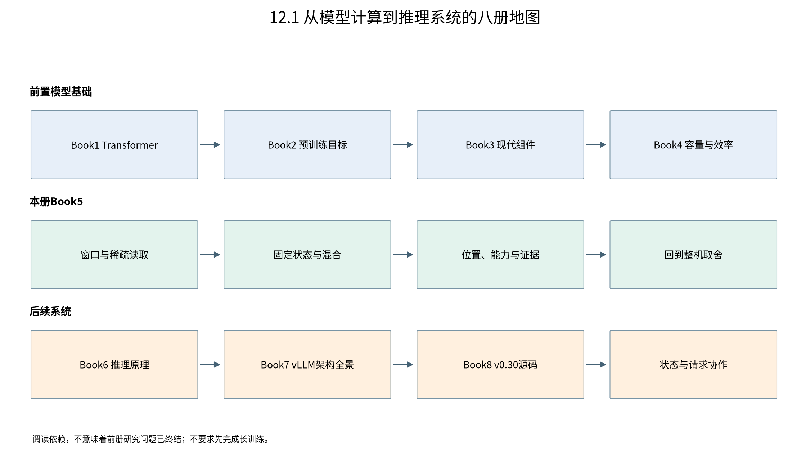
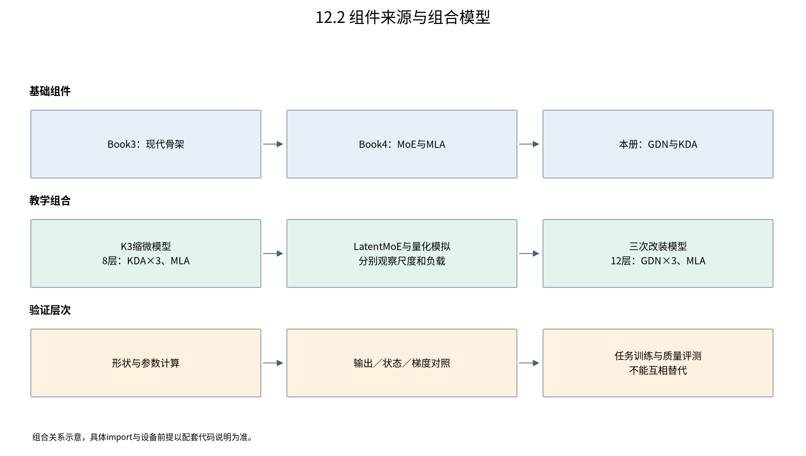

# 第 12 章 收束：满注意力不再是唯一解

## 12.0 从五册的模型演进回到整体

Transformer 给本系列提供了一个可持续改造的蓝本。预训练改变学习目标与使用方式，现代开源骨架改进归一化、门控、位置与 KV 共享，MoE 和 MLA 分别改变参数参与方式与历史表示。本册再把注意力拆成三个可以重新选择的问题：看哪些位置，精细读取哪些历史，用什么状态保存过去。

收束时不必记住全部型号，而应能面对一个新结构，指出它改了蓝本的哪里、解决哪项成本、保留了什么能力，以及证据尚未覆盖什么。本章回顾三条路线、两台教学模型、贯穿五册的知识关系，并将状态和计算问题接到后续推理系统。

## 12.1 三条路线：不同的成本，也有不同的信息限制

**窗口改变直接可见范围。**同一层只访问最近 $W$ 个位置，缓存可以封顶为 $\min(n,W)$，主注意力工作也随窗口受限。但掩码本身不会让稠密实现自动省下计算，需要相应内核和缓存策略。跨层传播可以扩大可达范围，却不保证信息已经学会传递；在全注意力预训练模型上直接裁窗，与从头训练原生窗口模型也不是同一干预。Gemma3、gpt-oss 保留部分全局层，因此整机缓存仍有随长度增长的项。

**稀疏改变读取集合。**NSA 按块组织，DSA 用索引器选 token，CSA 在压缩条目上选择，IndexShare 复用部分层的选择结果。被选集合上的 softmax 可以精确计算，但相对全历史的结果通常是近似的，误差与遗漏的注意力质量和对应值向量有关。索引器本身的工作不能从成本账里消失，DSA 的选择也不自动减少全部历史存储。GLM-5 的不同适配实验分属不同底座和表格，不构成稀疏路线普遍优于线性的证明。

**线性递推改变记忆形式。**线性核注意力把前缀和合并进矩阵与归一化向量；Delta rule 用预测残差修正关联记忆；GDN 先衰减再定向更新；KDA 进一步让各键通道有不同遗忘率。固定状态的大小与长度无关，但在有限精度、有限容量条件下无法无条件保存任意长历史的全部独立信息。它仍然可以在适当任务和键结构上精确召回，不能笼统说“固定状态不做检索”。混合模型保留显式历史通路，是对这些需求的一种回应，比例与层位置需要实验选择。

K3 的 69 个 KDA 层约占四分之三，而不是九成；24 个 MLA 层仍保留逐条历史。其约 0.75% 的数字比较的是指定 1M 长度下固定矩阵状态与主潜在 KV 的元素量，使用同字节宽度时才可直接换成字节比例，并未覆盖全部运行缓存。交叉点也只比较同一模型的两类存储项，不能推出速度或质量的“免费收益”。

因此选型要联合检查：任务要保留哪些细节、状态如何更新、每一步读取多少、实现怎样执行，以及训练和评测是否覆盖目标长度。低位宽压低每条记录的字节数，固定状态改变记录方式，两者不是同一种“存储不增长”。这些方案可以组合，也都仍有继续改进的空间。

## 12.2 我们的机器回望：两台机器与三代血统

判决之后看机器。本册单轨主线交付两台：第 6 章的 **K3 玩具**（toyA，总参 43,905,888、激活非嵌入 11,662,176，assert 双口径）与第 9 章选做的**三刀机**（409,000,736，枚举=手算=定版常数逐位一致）。玩具的血统写在 import 语句里：Book3 的 RMSNorm 与 RoPE、Book4 的 MLA 与 DeepSeekMoE、本册的 KDA——四代组件一台机器；它的两个正档读数值得带走：门粒度双臂在 800 步 loss 打平（5.491 对 5.500，预注册分支③命中——粒度的 loss 收益在玩具档不可分辨），但 $g$ 分布自己分了化，跨通道 std 从初始化的一点 $-2.5$ 拉开到深层 1.62——「每通道学出了不同的遗忘速度」从报告断言变成第一手实测；K3 化换装（per-channel 门+直接投影输出门）单点替换账 +372,048（44,277,936），逐项闭合。三刀机则以两刀机为底座：9 层注意力插槽换 GDN（层 7,393,312）、MLA 保留人读第 4/8/12 层（config 0 起 3/7/11，末层全局承 K3 惯例）、$w_{\text{expert}}$ 938→810 等总参补偿——冒烟初始 loss 10.5916 贴预言 10.5783，一窗 100 步整合短训 train 降至 7.4708、eval 7.3838，无 NaN（12.824 s/step 热漂移如实报，超窗 ckpt 续跑）。它的分类型状态账是三栏账本的教学版：MLA 3 层 960 元素/token 无界+GDN 9 层固定 1,317,888，交叉点 $n^*\approx1{,}373$。

两台机器再往前接两代，就是单轨主线的架构侧总决算——**三代结构对照链**：Book3 稠密 207M、Book4 两刀 409M、Book5 三刀 409M（第 9 章表 9.4）。同一副残差骨架，后两代总参数近似相同，注意力插槽从满注意力一色，到压箱（MLA），再到 3:1 混装——每一代的 assert 都在本机跑过，每一代的无界斜率同步递减：12,288→3,840→960（元素/token），外加三刀机那份与 $n$ 无关的固定记忆。「架构修改=对已知物的局部替换」这条主线在架构侧走完三步，账本给出了最直接的度量。实物 12.1 把三代总参并列（看什么：三个数逐位出自三份自测脚本，输出记录三个不同模型的参数；第一代 207M 与后两代约 409M 不能称为等总参）：

```text
[参数账] 手算 = 207,119,360   实测 = 207,119,360   non-emb = 141,583,360
[cand2] 等激活·轻 MLA（主臂，409M 两刀机）：总参 409,115,648（手算=实测=探针 F 锁定数，逐位）| 激活 non-emb 136,109,056 …（双份口径续行略）
[三刀机] 总参 409,000,736（枚举=手算=定版，逐位一致）| GDN 层 7,393,312 × 9 + MLA 层 2,687,488 × 3 | vs cand2 两刀 409,115,648：差 -114,912（-0.028%——等总参补偿 w 938→810 的净残差）
```

实物 12.1 三台机器自测终端输出并列（2026-10-08 历史复跑原样摘录；依次=Book3 `llama215.py`、Book4 `llama409.py` cand2 主臂、本册 `hybrid409.py`）【证据等级：本书实验（CPU fp32，seed 20261002）】

把三刀机的证据链压成一张表，如表 12.1——它是 Book3 表 10.3 与 Book4 表 12.1 插槽证据链的第三代：那一册动两格，本册在它的底座上只动一格的**排布节律**。

表 12.1 三刀证据链表（插槽｜旧件→新件｜动刀章｜本机证据｜文献锚——Book3 表 10.3/Book4 表 12.1 同款第三代；读数均单种子趋势级、判据预注册）

| 插槽 | 旧件 → 新件 | 动刀章 | 本机证据 | 文献锚 |
|---|---|---|---|---|
| 归一化 | pre-RMSNorm（不动） | —（Book3 第 2 章） | 改变归一化性质与成本（Book3 消融指回） | Book3 表 10.3 |
| 前馈 | dense SwiGLU → MoE（$E$=8/top-2/共享 1；$w$ 938→810 等总参补偿） | Book4 第 2-5 章（本册只调 $w$） | 两代消融与 noaux 账承 Book4 指回 | 2401.06066（Book4 已核） |
| 位置 | RoPE 解耦车道承 MLA 层；GDN 层结构级 NoPE（真机 NoPE/partial RoPE 谱系见第 8 章） | —（Book4 第 6 章） | —（机制不变，只改层的归属） | Book4 表 12.1（车道）＋第 5 章 5.13（结构级 NoPE 口径） |
| 注意力 | 满注意力 MLA 一色 → $[\mathrm{GDN}\times3,\mathrm{MLA}]\times3$（MLA=人读第 4/8/12 层） | 第 5 章（GDN 件）+第 9 章（整机） | GDN 双形态对拍 1e-8 级+chunk 排程等价 5.38e-06；整机 assert 409,000,736 逐位；冒烟/短训见上文 | 2412.06464 v3（GDN）+ K3 报告 2607.24653（3:1 与末层惯例） |
| 出入口 | untied、$V$=32000（不动） | —（Book3 第 5 章） | —（口径开关承 Book3） | Book3 表 10.3 |

## 12.3 将新部件接回前四册的知识地图

本册的新机制不是彼此孤立的论文摘要。下面按设计问题回看它们怎样修改前面的蓝本；读者可以用这张表寻找先修知识，也可以反向检查自己是否理解了改造理由。

| 前面的设计问题 | 本册如何继续解决 | 应能解释的关系 |
|---|---|---|
| Book1 的全注意力逐对计算与受限注意力设想 | 第 1–3 章的窗口、选择与成本 | 减少可见范围、减少读取集合与改变内核是不同改动 |
| Book1 的兼容性函数与加权读取 | 第 5 章核形式、关联记忆与 Delta rule | 换核改变相似度定义；矩阵结合律改变计算组织 |
| Book1 的编码器与解码器信息接口 | 第 10 章视觉编码器与投影器 | 外部表示可经输入前缀或交叉注意力进入骨干；接口不只一种 |
| Book2 的条件概率、预训练和上下文学习 | 第 10 章偏好优化、相对奖励和推理预算 | 同一骨干可以用不同目标与推理协议学习、调用不同能力 |
| Book3 的 RoPE 与扩窗 | 第 8 章位置和存储两条设计轴 | 无显式位置不等于无顺序，也不等于没有长度泛化问题 |
| Book3 的配置与张量形状 | 第 11 章版本、参数口径和结果核对 | 配置、权重、执行分支与评测各能证明什么 |
| Book4 的 MLA | 第 4、6 章压缩历史和 Gated MLA | 低秩参数化、代数吸收、条目压缩与输出门分别作用在哪 |
| Book4 的 LatentMoE | 第 7 章聚合归一化、SiTU 和 QB | 表示宽度、激活尺度、负载和通信为何要分别处理 |
| Book4 的低精度与多 token 预测 | 第 7、10 章量化感知训练及后训练 | 训练目标、数值表示与部署验证之间存在接口约束 |



图 12.1 从左到右读取知识依赖，再进入下一行。本册把模型状态交给系统讨论，系统收益仍须具体执行和测量。

## 12.4 从模型状态到推理系统

模型公式只规定每次输入和状态更新，服务系统还必须决定何时为哪条请求执行这些计算。全局 KV 保留逐条历史，窗口 KV 可以滚动淘汰，GDN/KDA 状态不断被更新；请求暂停、取消、复用前缀或验证投机 token 时，三者的生命周期并不相同。固定容量也不等于可以随意回滚，旧状态可能已经被覆盖。

阅读路线因此分为三个层次：[Book6](../book6-inference-systems-intro/README.md)先讨论推理的成本和方法；[Book7 的状态管理](../book7-vllm-v1-architecture/ch06-KV状态的管理与复用.md)与[模型硬件边界](../book7-vllm-v1-architecture/ch08-模型与硬件的适配边界.md)解释架构职责；[Book8 的混合状态](../book8-vllm-v1-source-code/ch25-混合模型的状态类型与恢复边界.md)、[投机验证](../book8-vllm-v1-source-code/ch20-投机解码的候选验证与状态修正.md)和[多模态特征](../book8-vllm-v1-source-code/ch22-多模态特征的位置调度与缓存.md)进一步进入对象和源码。它们不会假设所有状态都是同一种 KV。

本册三次改装模型提供了一个具体输入：总参数 409,000,736，主潜在 KV 为每 token 960 元素，GDN 固定状态合计 1,317,888 元素。系统可以据此估算资源，但真实容量还取决于批量、数据类型、内核工作区和状态保存策略。MoE 的专家通信、稀疏选择的索引成本、长图像前缀的预填充，也都需要实现层的验证。架构优化与系统优化会继续互相提出问题。

## 12.5 册末清点：代码资产与术语表

配套代码按章保留。从窗口与稀疏的教学实现，到 GDN 两种计算形式、KDA 和 LatentMoE，再到整机与多模态投影，均可沿相应正文找到输入、输出和历史实验条件。第 5 章的数学例子适合先在 CPU 检验；整机训练和真实权重加载需要另行准备数据、模型及兼容设备。数值对照、冒烟、短训和大模型质量不是同一等级的证据。



图 12.2 组件复用使改造位置清楚，验证层次使结论范围清楚。数值等价检查不直接证明大模型质量或性能。

下表保留本册术语，定义优先说明对象及适用条件。它也可以作为查阅目录。

| 术语 | 英文 | 首现 | 一句话定义 |
|---|---|---|---|
| 三条突围路线 | （本书用语） | 导览 | 满注意力之后的三条出路：改视野（滑窗）→改参与集合（稀疏）→换算子（线性） |
| 满注意力 | full attention | 导览 | 2017 原典的逐对精确打分注意力——本册手术台上的本体 |
| 打分矩阵 | score matrix | 导览 | $QK^{\top}$ 的 $(B,h,n,n)$ 作业面——三把刀共同动的那张表 |
| 分类型 KV/状态账本 | typed KV/state ledger | 导览（预告）／第 1 章 | 按层型分三栏的上下文成本账：全局无界/滑窗封顶/线性固定 |
| 交叉点 | crossover point $n^*$ | 导览（预告）／第 1 章 | 全局层无界 KV 追平线性层固定状态所需的 token 数 |
| 混合架构 | hybrid architecture | 导览 | 一台机器多种层型混排（如 3:1）——2026 旗舰的出厂形态 |
| 层类型词表 | layer types | 导览（预告）／第 1 章 | config 里逐层写注意力形态的字段——三条路线的工程收编 |
| 兼容性函数 | compatibility function | 导览（预告）／第 1 章 | 「怎么比相似度」的那个函数 |
| kernel 视角 | kernel smoother | 第 1 章 | 注意力=核平滑；点积 softmax 只是核菜单的一款 |
| elu+1 核 | elu+1 kernel | 第 1 章 | $\varphi(x)=\mathrm{elu}(x)+1$——保证非负的最简特征映射 |
| 滑窗注意力 | sliding window attention, SWA | 导览（预告）／第 2 章 | 每 token 只看最近 $W$ 个邻居——改视野的第一刀 |
| banded 掩码 | banded causal mask | 第 1 章（预告）／第 2 章 | 窗口的静态几何：带宽 $W$ 的带状因果掩码 |
| attention sink（汇聚元） | attention sink | 导览（预告）／第 2 章 | softmax 多余概率质量的去处；gpt-oss 做成每头一枚可学标量 |
| 两说之争 | （本书用语） | 第 2 章 | sink 为什么存在：softmax 副产物 vs 全局信息枢纽——并陈不裁决 |
| 窄窗三件套 | （本书用语） | 第 2 章 | 窄窗不塌的三个兜底：sink 兜底+交错全局层+语言局部性 |
| lost in the middle | lost in the middle | 导览（预告）／第 2 章 | 长上下文中段检索塌陷的现象——needle 位置扫描的靶子 |
| 信息可达性 | （本书用语） | 第 2 章 | 不存在输入到输出的路径时无法依赖该输入；可达并不保证学会 |
| 滚动淘汰 | rolling eviction | 导览（预告）／第 2 章 | 滑窗层缓存只保窗内的服务侧需求 |
| 原生稀疏注意力 | Native Sparse Attention, NSA | 导览（预告）／第 3 章 | 压缩/选择/滑窗三分支的可学习稀疏注意力 |
| 三分支记号 | cmp/slc/win | 第 3 章 | NSA 论文正字的压缩/选择/滑窗分支记法 |
| 块稀疏 | block sparse | 导览 | 参与集合按块选择——访存友好的稀疏形 |
| 闪电索引器 | lightning indexer | 第 3 章 | DSA 的单分支轻索引器：ReLU 打分选 top-$k$ |
| KL 蒸馏 | KL distillation | 第 3 章 | DSA 从满注意力教师续训选择的迁移方式 |
| 解码账本 | decoding ledger | 第 3 章 | NSA Eq.7 的每步访问账 $\lfloor t/d\rfloor+nl'+w$ |
| DeepSeek 稀疏注意力 | DeepSeek Sparse Attention, DSA | 导览（预告）／第 3 章 | NSA 的生产化减法；GLM-5 全层装机 |
| CSA | Compressed Sparse Attention | 第 1 章（预告）／第 4 章 | DSV4 的「块压缩+DSA」支路——KV 本体换成压缩条目 |
| HCA | Heavily Compressed Attention | 第 3 章（预告）／第 4 章 | DSV4 的重压缩稠密注意力层（$m'{=}128$，放弃选择） |
| IndexShare（IndexCache） | （模型卡名/论文名） | 第 3 章（预告）／第 4 章 | GLM-5.2 跨层共享索引器：57 shared 层共用 21 套（差 534M 权重级互证） |
| 权重级承诺 | （本书用语） | 第 4 章 | config 字段与 checkpoint 权重逐层互证的读法 |
| 参数三口径 | （本书用语） | 第 4 章 | GLM-5 的 744B（论文）/754B（HF）/753B（5.2）——引用必标 |
| 1M 四档 | （本书用语） | 第 4 章 | 真练到/外推到/托管到/直推到——同一行 config 数字的四种承诺 |
| 线性注意力 | linear attention | 导览（预告）／第 5 章 | $\varphi(q)^{\top}\varphi(k)$ 换核+固定状态——换算子的第三刀 |
| delta rule | delta rule | 导览（预告）／第 5 章 | 沿键方向按预测残差更新的关联记忆 |
| 固定状态 | fixed state $S$ | 导览 | 与长度无关的状态 $(B,h,d_k,d_v)$——「记忆」取代「账本」 |
| 归一化分母 | normalizer $Z_i$ | 第 5 章 | 线性注意力保留的 $\sum_t\varphi(k_t)$——三家归一化口径之一 |
| 门控 Delta 网络 | Gated DeltaNet, GDN | 导览（预告）／第 5 章 | $\alpha$ 删除门+$\beta$ 写强度+chunkwise 并行的 delta rule 层 |
| 双形态 | recurrent / chunkwise | 导览（预告）／第 5 章 | 推理逐步递推/训练分块并行的同一数学两套调度（与 MLA 显式/吸收押韵） |
| UT 三角求解 | UT transform | 第 5 章 | 把块内递推折叠成一次三角方程组求解的矩阵化写法 |
| 容量上限 | $d_{\mathrm{dot}}$ capacity | 第 5 章 | $d$ 维空间至多有 $d$ 个非零两两正交键；一般检索能力还取决于键值结构与任务 |
| partial RoPE | partial rotary position embedding | 导览（预告）／第 5 章·第 8 章 | 只旋头维前一段（Qwen3-Next 25%）——旋得少给内容留带宽 |
| KDA | Kimi Delta Attention | 导览（预告）／第 6 章 | delta rule+每头每通道遗忘门的线性层（K3 参考对象） |
| 通道级遗忘门 | per-channel decay gate | 第 6 章 | $g^h_t=g_{\min}\mathrm{Sigmoid}(e^{A^h}z^h_t)$——每通道自己的遗忘速度 |
| Gated MLA | Gated MLA | 导览（预告）／第 6 章 | Book4 MLA+两件新零件：NoPE 与直接投影输出门 |
| 直接投影输出门 | full-rank output gate | 第 5 章（预告）／第 6 章 | 逐输出通道的可学习门；KDA 的输出归一化与 MLA 不能混为同一公式 |
| NoPE | NoPE | 导览（预告）／第 6 章 | 不用显式位置编码——位置由数据与状态自己学 |
| AttnRes | Attention Residuals | 导览（预告）／第 6 章 | 用内容相关权重聚合前面层或块的输出，形成深度维信息通路 |
| K3 玩具替身 | toyA | 导览（预告）／第 6 章 | 43.9M 的 K3 缩微同构样机——血统写在 import 语句里 |
| Stable LatentMoE | Stable LatentMoE | 导览（预告）／第 7 章 | 896 选 16 超稀疏潜空间 MoE+三张稳定化处方 |
| 三处方 | （本书用语） | 导览（预告）／第 7 章 | 聚合后 RMSNorm/SiTU-GLU/Quantile Balancing——分别控制聚合尺度、激活幅度与路由负载 |
| SiTU-GLU | SiTU-GLU | 第 7 章 | $\beta_1\beta_2{=}100$ 软限幅的有界 SwiGLU（原点一阶贴合） |
| Quantile Balancing | Quantile Balancing, QB | 第 7 章 | 固定 token 截止线时的专家偏置坐标解；在线更新不保证一次全局均衡 |
| MXFP4 QAT | quantization-aware training | 导览（预告）／第 7 章 | 从 SFT 起覆盖全后训练的量化感知训练（K3 口径） |
| 原生多模态 | native multimodal | 导览（预告）／第 7/10 章 | 视觉塔与主干联训长在一起（vs LLaVA 式后接） |
| 位置与状态两条设计线 | （本书用语） | 导览（预告）／第 8 章 | 位置表示与历史存储两条相互关联、不可合并的设计维度 |
| iRoPE | interleaved RoPE | 导览（承 Book3）／第 8 章 | 交错使用 RoPE 与 NoPE；Llama 4 的分块层使用 RoPE、全局层使用 NoPE |
| 头维净土 | （Book3 用语） | 导览（预告）／第 8 章 | 头维里不旋的那段——partial RoPE 的 NoPE 半边谱系 |
| 零频率机制 | zero-frequency | 第 8 章 | partial RoPE 的 NoPE 半边=旋转 0 弧度——「不旋=旋 0」的实现真相 |
| 三刀机 | （本书用语） | 导览（预告）／第 9 章 | 两刀机 9 层注意力插槽换 GDN 的 3:1 整机（409,000,736） |
| 三代结构对照链 | （本书用语） | 导览（预告）／第 9 章 | Book3 207M→Book4 409M→Book5 409M——只有后两代近似等总参 |
| 共性三件 | （本书用语） | 第 9 章 | 超稀疏 MoE/原生长上下文/FP4 级低精度——代表模型的比较维度，不是所有模型的共同配置 |
| 多模态三步曲 | ViT–CLIP–LLaVA | 导览（预告）／第 10 章 | 视觉编码→对齐两界→一层投影缝合两个已训世界 |
| projector（投影层） | projector | 第 6 章（预告）／第 10 章 | 冻结双塔间唯一可学的一层映射（768→1024，786,432 参） |
| 后训练链 | post-training chain | 导览（预告）／第 10 章 | 偏好反馈、直接偏好损失、组相对优化与可验证奖励等可组合方法 |
| 读厂商自报数字五步法 | （本书用语） | 导览（预告）／第 11 章 | 找 raw→核口径→找第三方→复算可算的→悬案登记 |
| SWE-V 双数字 | （本书用语） | 第 11 章 | 77.8 官方 OpenHands 口径 vs 72.8 第三方 swebench.com——协议不同，不能只凭分差判定矛盾 |
| 键位对撞六坑 | （本书用语） | 第 5 章（预告）／第 11 章 | strict 直搬踩过的键名/嵌套/枚举坑——让对拍替你读 |
| 值先验平台 | （本书用语） | 第 9 章 | loss 钉在 $\ln(\text{值表})$ 的地板——与近似均匀预测相容的观察；不能仅凭均值断言完全未利用查询 |

## 12.6 合上这本书之前

五册一直在做同一件事：保留能工作的蓝本，找出新任务与预算带来的限制，再逐项修改。真正可迁移的知识不是“哪一家用了哪个组件”，而是能说明改造位置、推理依据、信息代价与实验证据。

先看信息：哪些历史可被直接读取，哪些已经被压缩到状态？再看计算：矩阵和向量的形状是什么，哪些计算重复，哪些可以合并？最后看条件：等参数、等算力、相同数据与相同硬件是否真的成立，观察到了什么，尚不能断言什么？这三组问题能让公式、图和实验始终回到同一台模型上。

下一册继续使用这些状态和计算对象，讨论它们如何在推理系统中高效协作。

## 12.7 自测与实践

- 为同一请求分别画出全局 KV、滑窗 KV 和固定递推状态，解释每次新增 token 改变哪些部分。
- 不看公式，说明 Delta rule 与加法记忆的区别，再从预测残差恢复更新式。
- 给定混合层序列、各头维和数据类型，逐项计算存储；说明交叉点为什么不是质量回本点。
- 比较 Book3、Book4、本册三台模型，指出哪些预算相同、哪些不同，不能只看总参数。
- 用一个论文表格练习：写出模型、数据、训练量、评测协议、结果与结论边界。
- 按第 5 章运行 CPU 数学例子；按第 9 章说明检查整机参数。长训练与真实权重实验保持各自的设备和数据前提。
