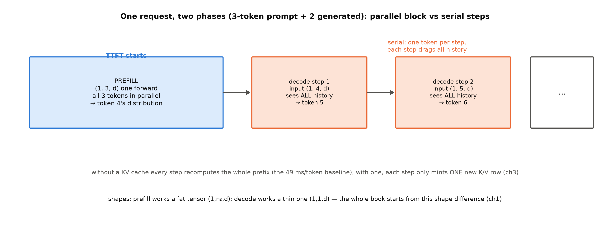
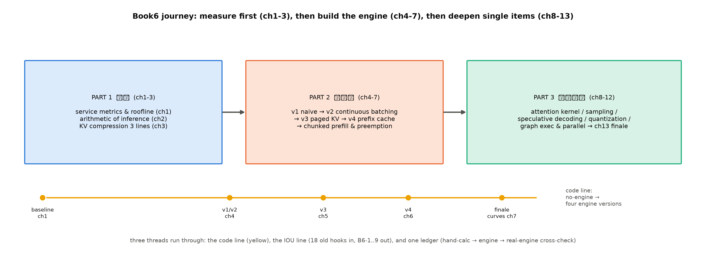

# 第 0 章 导览：模型变成 workload

## 0.1 读完这本书你会拥有什么

五册下来，我们造过很多东西：一台 2017 年的原版 Transformer、一台从零预训练的 GPT-2、一台逐插槽改装的 LLaMA 式 207M、一台换了 MoE 和 MLA 的两刀机、一台把注意力换成 3:1 混合的三刀机。它们都是**模型**——我们一直站在「造模型的人」这边。

这一册换边。你将站在「伺候模型的人」这边——服务端的工程师面对的不是一台待造的机器，而是一个已经造好、每天要回答几百万个请求的模型。在他眼里，模型不再是架构图，而是三样东西：一组固定的权重（多大、多少字节）、一本随请求生长的 KV 账（每 token 多少开销）、一串停不下来的自回归 token 流（一步接一步，谁也替不了谁）。**模型变成了 workload（工作负载）**——这句宣告就是本册的立足点。

这个转身为什么放在五册架构之后、而不是更早？因为系统视角的全部趣味，恰恰建立在「模型已经足够好」之上：正因为架构侧把每 token 的账单压了又压（MoE 砍激活、MLA 压 KV、混合层换固定状态），剩下的开销才几乎全部长在**系统侧**——怎么搬权重、怎么排请求、怎么复用缓存。如果模型本身还在漏水，没人有心思优化水泵。而前几册的卷末，其实都把手指向了这扇门：Book2 收束章说「预填充与解码的两阶段拆分、以及『先猜后验』类解码加速，是 Book6 的正题——机制一个字不提前讲，那是推理册的开场白」【Book2 ch12 卷末 L57，直引】；Book4 收束章的判断更斩钉截铁：「训练侧省钱、服务侧收账——**瓶颈移向 serving**」【Book4 ch12 卷末 L87，直引】；Book5 收束章则补上混合架构的那笔——「每一刀都造出下一个瓶颈，也造出下一刀——而下一个瓶颈，长在了服务侧」【Book5 ch12 卷末 L93，直引】。三册的卷末移交在本册到期，入场券就是这三句话。

读完这本书，你会拥有四样东西：一套推理物理学的手算账本——拿到任何一个模型，你能在一页纸上算出它每 token 的算力账、显存账、时延下限；一台亲手写出的四版进化的 mini 推理引擎——从最笨的逐请求串行，一路改到连续批处理、分页 KV、前缀缓存；一张属于你自己硬件的 roofline（屋顶线）地图——标着实测的算力峰值、带宽与脊点；以及一份对真实引擎行为的对拍判断力——看到任何引擎的吞吐数字，你能说出它合理不合理、卡在哪。

## 0.2 卷间契约三栏

要用新眼光，先清点旧行囊——三栏契约把「带什么进来、学什么新的、改什么」一次说清（表 0.1）。

**表 0.1 卷间契约（前五册 → 本册）**

| 栏 | 内容 |
|---|---|
| 已知基础（指回前五册，零新架构） | $O(n^2)$ 二次律与自回归串行（Book1 第 11 章三大欠账中的 F1/F2——借据立于 Book1 第 2、7 章，本册清算地址见表 0.2）、KV cache 账本 $2Lh_{kv}d_k$ 与 GQA（Book3 第 6 章）、外推链（Book3 第 7 章）、四插槽整机 207M（Book3 第 10 章——本册默认服务对象）、MoE 与激活参数口径（Book4 第 2-5 章）、MLA 与 −93.3%（Book4 第 6 章）、FP8/MXFP4 格式课（Book4 第 7 章）、MTP（Book4 第 8 章）、gpt-oss 精拆（Book4 第 10 章）、分类型 KV/状态账本（Book5 第 1 章）、GDN/KDA 与 chunkwise（Book5 第 5-6 章）、temperature/top-k 初见（Book2 第 11 章——彼时只借方法，系统拆解归本册） |
| 本册新增知识 | 服务指标（TTFT/TPOT）与推理算术体系、KV 压缩三线全景、批处理五部曲（静态之弊→连续批处理 continuous batching→分页 KV→前缀缓存 prefix caching→分块预填充 chunked prefill）、注意力 kernel、采样管线、投机解码、量化推理、图执行与并行拓扑 |
| 架构修改 | **无**——八册里唯一不动架构的一册：架构冻结，模型变成 workload；前五册的每一刀手术，本册以「这笔账在服务端怎么付」重新对账 |

## 0.3 先看一眼我们要伺候的机器

清点完行囊，先看这台机器此刻跑成什么样。本册所有实验的默认服务对象，是 Book3 第 10 章亲手训出的 207M（设计名 215M——训练 config 的档位名；实参 207,119,360，全书统一简称 207M；稠密 + GQA，NPU 重训版）。它的服务账速览（三笔账各有出处）：权重 414 MB（bf16，$=2\times$ 实参字节，设计文档推导）；fp32 加载则 828 MB（基线实验两种口径都跑，本章冒烟档用 fp32）；KV 账每 token 24 KiB（$2\times12$ 层$\times8$ 个 kv 头$\times64$ 维$\times2$ 字节——Book3 第 6 章式 (6.2) 正身），一条 2048 token 的请求光 KV 就要 48 MiB。

而它此刻的「服务水平」如何？我们在没有引擎的条件下实测了一把：贪心逐 token 生成，每一步都把整段序列重新过一遍模型（无 KV cache 的全量重算口径）——

**实物 0.1**（服务前基线终端读数；出处：本机探针 P4（`code/00-feasibility/04_probe_serving_smoke.py`），Atlas 910B3、fp32 全量重算口径【证据等级：本机实测】）

```text
[P4 生成] prompt 来源：tokens32k.bin 首 24 token（真实语料） | 贪心 20 token，每步全量重算（无 KV cache）
[P4 结果] 首步后均值 49.0 ms/token（含全量重算；n: 24->44）| 吞吐 20.42 tok/s
```

看什么：注意「每步全量重算（无 KV cache）」这个括号——本册第 3 章起，这个括号里的每一项都会被逐个拆掉。没有引擎的生活是这一切的起点，也是衡量一切改进的基线。

这台 207M 在真实世界里只是个玩具：生产级模型动辄几十 B 参数（权重以百 GB 计），一条长请求的 KV 也是 GB 级。但正因为它小，一切账都能在一张卡上亲手算清、亲手测出——本册选它当服务对象，就是要让每个数字都来自你自己的机器，而不是论文里的别人家。真实世界的数我们也会引用（标好证据等级），但**课本的每一行账，都以「自己算得出、自己测得到」为标准**。

**例 0.1（构造例：3 token 请求的 prefill/decode 时间线手画——两阶段的第一次见面）** 设 prompt 3 个 token、生成 3 个。**第 0 步（prefill）**：输入 $(1,3,d)$ 的并行块，一次前向同时算 3 个位置——输出第 4 个 token 的分布（耗时记入 TTFT）。**decode 第 1 步**：输入 $(1,4,d)$（3 个旧的+刚生成的 1 个）——输出第 5 个 token。**decode 第 2 步**：输入 $(1,5,d)$——输出第 6 个（生成的最后一个）。输入每步长一格、真正新算的每步只有 1 个位置；全量重算口径下每步都把全部历史重过一遍——P4 读数的 49 ms 里，绝大部分就在付这笔「重复看历史」的钱。输出读法：**并行段一次算完、串行段一步一格**——本册的一切故事都从这个形状差异开始（图 0.1）。



图 0.1 一条请求的两阶段时间线（自绘示意级）：prefill 并行块 $(1,n_0,d)$ 对 decode 串行步——与例 0.1 的 token 序号逐步对应；形状口径注意：图中 decode 标 $(1,1,d)$ 是「真正新算一个位置」的理想口径，例文的 $(1,4,d)$、$(1,5,d)$ 是 P4 的全量重算口径（第 3 章 KV cache 让两者合一）；资源画像版见第 1 章图 1.1。

49 毫秒一个 token、每秒 20 个 token——这就是没有引擎的生活。它慢在哪？能救多少？救下来的钱从哪里来？这是本册全书的账。

四版引擎的草图也在此先立一笔（每版从上一版的账本里长出什么）：**v1 naive**——逐请求串行+全量重算，浪费摆在台面上（时隙空转）；**v2 连续批处理**——消灭时隙空转（请求到点就走）；**v3 分页 KV**——消灭显存碎片（块为分配单位）；**v4 前缀缓存**——消灭重复 prefill（相同前缀只算一次）。每解决一项就用压测数字核销一笔——这正是第二段旅程的主干。

## 0.4 旅程地图：先立账、再造引擎、后深化

带着「慢在哪/能救多少/钱从哪来」三问，本册十四章走三段（图 0.2）。

**第一段「立账」（第 1-3 章）**：先把度量衡立好——不立账就动手造引擎，等于不懂电路图就焊主板：你将无法判断任何一次改动是进步还是噪声。第 1 章切换视角——服务指标 TTFT/TPOT 与一条请求的两阶段（prefill 算力受限、decode 访存受限），补 roofline 模型与算术强度这门度量衡课；第 2 章把手算方法学练成本能——每 token FLOPs、字节账、利用率，一直算到「没有引擎的价格」这笔账（第 2 章算清：bf16 口径 72 倍、fp32 口径 36 倍）；第 3 章立全书最大的一本账——KV cache 压缩三线全景（架构侧、量化侧、淘汰侧），前五册攒下的 KV 知识在此合流成一张决策树。

**第二段「造引擎」（第 4-7 章）**：账立完了，动手。四版引擎是本册大项目的主干——每一版都从上一章的账本里长出一个「必须解决的开销」（0.3 的四行草图），每解决一项就用压测数字核销一笔。第 4 章从静态批处理的时隙浪费走到连续批处理——大项目 v1、v2 两版引擎在此落地；第 5 章把操作系统分页思想搬进 KV 管理——v3；第 6 章让前缀可以被缓存复用——v4；第 7 章解决长 prefill 与 decode 的干扰，并以四版引擎的吞吐-延迟总曲线收官。

**第三段「单项深化」（第 8-12 章）**：引擎的骨架立起来后，逐个榨单项——这五章的共同点是各自独立成艺、都能单独写成一本书，本册各取其「任何引擎都必须回答的问题」那一层：第 8 章注意力 kernel（online softmax 从零推导）；第 9 章采样全家福；第 10 章投机解码（自回归串行这笔 2017 年的欠账在此交货）；第 11 章量化推理（低精度接力棒从训练侧传到推理侧）；第 12 章图执行与并行拓扑。第 13 章收束全书、移交下两册。



图 0.2 本册旅程地图（自绘示意级）：三段十四章+代码线（黄）——从第 1 章基线到第 7 章收官曲线；伏笔线与一本账线是文字线（见 0.5），不进图。

## 0.5 三条贯穿线索

地图之外还有三条纵向线。**代码线**：一条从「没有引擎」到「四版引擎」的进化链——第 1 章的基线实测是它的起点，第 7 章的收官曲线是它的终点。**一本账**：推理算术账从手算（第 2 章）到引擎实测（第 4-7 章）再到真实引擎对拍（各章对照框）——三层对拍是本册实验的主形态。**伏笔线**：五册埋向本册的十八笔旧账逐章兑现，本册再向 Book7/8 埋新账——台账预览见表 0.2（上半：进账；下半：出账；收束章总决算）。

**表 0.2 伏笔台账预览（上半=五册埋向本册的十八笔旧账，下半=本册埋向 Book7/8 的 B6 系新钩）**

| 钩 | 内容一句话 | 回收/去处 |
|---|---|---|
| F1 显存半句 | O(n²) 的显存面长在 KV 上 | ch3（kernel 半句 ch8） |
| F2 串行税 | 自回归因果链的并行禁区 | ch1 立账、ch10 投机交货 |
| F4 KV 账本 | 三线压缩的分册决策 | ch3/5/7 |
| F8 长度惩罚+一次验证多条 | 采样侧的两笔旧账 | ch9/ch10 |
| F10 上下文终点 | 上下文长度主线的服务侧终点：多轮对话/重复前缀的缓存经济学 | ch6 |
| F17 FA 谱系 | attention 工业的谱系 | ch8 |
| F18 低精度接力 | GNMT 定点到 MXFP4 | ch11（半句→Book8） |
| N6/N7 | 前缀缓存场景（Book5）/缓存经济学与 KV 三线压缩的账半句（Book2） | ch6、ch3/6 |
| N5（软） | 多卡切分账移驻系统侧 | ch12 |
| B3-1/B3-6 | KV 三股省法/消费线衔接（207M 默认服务对象+重启锚） | ch3/5、全册 |
| B4-3/B4-4/B4-7 | 量化、MTP 数字、两刀机账 | ch11、ch10、ch2/3 |
| B5-1/B5-2/B5-3 | 分类型两类生命周期（滚动淘汰 vs 全保）、K3 的 MTP→draft 合流、混合 KV 终局 | ch5（串联半句 ch3）、ch10、ch0/3（半句→Book8） |
| B6-1 | 指标的手写测量→真实引擎 bench 三件套 | Book7 第 12 章 |
| B6-2 | KV 三线之外的第四种省法：offload/tiering | Book8 第 9 章 |
| B6-3 | 哈希前缀 vs radix 之争的引擎答案 | Book7 第 6 章 |
| B6-4 | 调度折中的引擎正身（决策循环） | Book7 第 5 章 |
| B6-5 | 五型 proposer 的统一接口落地 | Book8 第 2 章 |
| B6-6 | 图执行原理层的源码与 NPU 对照 | Book7 第 8 章 |
| B6-7 | 并行拓扑与 PD 分离的工程落地 | Book8 第 6/7 章 |
| B6-9 | mini 引擎与真实引擎的终局对照（注册大作业） | Book7 第 10 章 |

（B6-8 弱候选经卷级大纲裁定不埋；另有五册旧钩中的 Book7/8 半句十余处保持原址不吞——逐条清单见调研底单 notes/05-伏笔回收清单.md（收束章同指此档）。）

## 0.6 纪律与约定

先把三条贯穿线索再拧一遍，因为它们是检验学习成果的探针：读完全书，你应该能把**代码线**的每一版引擎为什么比上一版快说成一句账（v2 快在摊薄了什么、v3 省在了哪里）；能把**伏笔线**的旧账按册数清（Book1 的两大遗产怎么还的、Book4 的 MTP 怎么变成 draft 的）；能拿**算术线**给一台没见过的模型当场估出 decode 下限与容量上限。三线皆通，这本册子就装进口袋了。

本册冻结在推理系统知识 2025-2026（以 vLLM v0.30.0 时代的引擎生态为准）。本册**引擎无关**：讲的是任何推理引擎都必须回答的问题——vLLM、SGLang、TensorRT-LLM 的实现层专有物（引擎源码里的调度器、块池、进程模型）是 Book7/8 的地界，本册一切机制以算法与论文身份出现；真实引擎只以黑盒对拍身份登场，读数标注运行栈版本。举一个分界的实例：分页 KV 的「块表」这个数据结构，会以论文算法的身份在本册第 5 章被从零造出来；而某引擎源码里管块的那个类叫什么、内部怎么加锁，一个字都不会出现——前者是物理，后者是一家工厂的图纸。**纪律的另一面是换血**：Book5 期我们刻意冻结了一批推理系统名词（TTFT/TPOT、roofline、连续批处理、PagedAttention、投机解码……）——按 Book5 收束章的原话，这批「此刻应该已经在读者脑中自动对号入座」的词，本册全部开闸为正菜：从上一册顺读而来的读者会看到冻住的词一个个解冻成章名。

硬件主线为昇腾 NPU（Atlas 910B3）——本册一切性能数字本机实测，官方标称与实测可达分列双口径，这也是中文推理教学书里第一份 NPU 口径的手算账本。本册大项目四版引擎全程交付、贯穿第 4-7 章。证据等级制度沿用：引擎官方博客的吞吐数字一律厂商自报标注。两件全册制度在此宣告（随后各章常态化出现）：**玩具级例子**（关键知识点配小数字、步骤化、标明输入输出的构造例——例 0.1 是第一个）与**产物实物**（关键读数/配置原文/源码行以原样块呈现并配读法导引——实物 0.1 是第一个）。

也照例说明我们在市场中的位置（证据等级：出版社页面/豆瓣/京东直读+课程大纲调研，notes/02）：2026 年 8 月中文世界出现了第一本推理引擎书——但它是一本 V0 时代（v0.8.x）的双引擎使用手册；英文世界的 MLSys 课中 serving 至多占两讲。三轴对照我们的差异：**使用 vs 造物**（它是引擎用法手册，本册从物理原理到自建引擎）、**V0 vs V1**（它锚定 v0.8.x 的双引擎架构，本册以 V1 时代的引擎无关物理为主轴）、**CUDA vs NPU**（它全 CUDA 口径，本册 NPU 实测双口径）。引擎无关的推理物理学 + 亲手造引擎 + 中文系统性成书，这个组合仍然空着——本册就站在这里。

最后兑现一句上一册的承诺。Book5 长上下文收束章的章末欠账框里写着：「1M 窗口在服务侧的账——谁付 prefill、谁管淘汰、无界 KV 与定长状态两类生命周期怎么联合管理——是混合架构交给推理系统的下一战。→ Book8 第 1 章（Book6 先教引擎无关的推理物理学）」。括号里那句就是本册的自我定位——我们先教物理，混合架构那本服务侧的细账（无界 KV 与定长状态怎么同池共管）留待 Book8 第 1 章清算。

## 0.7 本章小结

这一章没有知识，只有一次转身：从造模型的人，变成伺候模型的人。0.1 承诺的四样东西，分别在三段旅程里兑现——手算账本与 roofline 地图在第 1-3 章一起立起（「慢在哪/能救多少」两问从此可答）、四版引擎在第 4-7 章造出（「钱从哪来」的正答）、对拍判断力在三层对拍里逐章练成（随赠的第四样，读任何引擎数字都用得上）。带走的心智一句：**模型是 workload：权重是固定账，KV 是流水账，自回归是串行税——引擎的全部工作，就是把这三笔账付得尽量便宜**；三笔账的长法各不相同——固定账按 dtype 折、流水账按 token 长、串行税按步收——三笔账的收法（摊薄、分页、缓存、压缩、批发）就是本册的目录。下一章从度量衡开始：一条请求的时间都花在哪、用什么指标衡量、由硬件的哪条律决定。

## 动手验证

- P4 冒烟复现（实物 0.1 来源）：`source env.sh && ASCEND_RT_VISIBLE_DEVICES=<空闲卡> python code/00-feasibility/04_probe_serving_smoke.py`（先 `npu-smi info` 选卡；环境与更多复现见第 1 章动手验证）
- 本章两图：`python code/ch00/fig_ch00.py`

> **【欠账】** 指标测量的手艺本册只到自写压测为止——真实引擎的 bench 工具与参数扫描 → **Book7 第 12 章**；本册一切机制的源码正身 → **Book7 全册主链路 / Book8 生产化专题**
