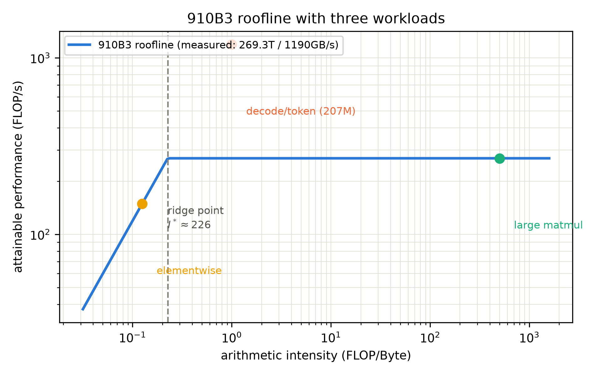

# 第 1 章 视角切换与服务指标：TTFT、TPOT 与两阶段

> **最小背景栏**：本章只需要两样前置——Book1 第 2 章的缩放点积注意力（$QK^\top$ 打分矩阵的形状）与 Book1 第 11 章「三大欠账」中的两笔（自回归串行与 $O(n^2)$，见第 2、7 章）；加上 Book3 第 6 章的 KV cache 概念（本章只用「它能省掉重复计算」这一句直觉，账本第 3 章展开）。矩阵乘的 FLOPs 怎么数（$2 \times$ 行 $\times$ 列 $\times$ 内维）你已经在 Book2 的大项目里算熟了。

## 1.1 一句等了四册的开场白

Book2 收束整册 GPT-2 大项目时，我们留下过一句话：「预填充与解码的两阶段拆分、以及『先猜后验』类解码加速，是 Book6 的正题——机制一个字不提前讲，那是推理册的开场白。」（原文见 Book2 第 12 章，写作时按成稿逐字核对。）现在到了兑现的时候。

还有一笔更老的账。Book1 第 7 章算过自回归的冗余比：生成 $T$ 个 token，naive 实现要做 $\frac{T(T+1)}{2}$ 次 token 级前向——$T{=}9$ 时就有 5 倍冗余。当时我们把它登记为「三大欠账」的第二笔：**自回归串行**，训练侧的解法（Book4 第 8 章的 MTP）已经教过，推理侧的还法（投机解码）留到本册第 10 章。但「串行」只是表象；表象之下，推理请求有一套自己的物理规律——这一章就把它们立起来：一条请求的时间花在哪（1.2）、它分哪两个阶段、各受什么资源限制（1.3）、用什么模型预判快慢（1.4）、以及我们自己的 207M 在裸奔状态下实测如何（1.5）。

## 1.2 服务指标：把「快」拆成三把尺子

训练册里的「性能」只有一个数：loss 降没降、多久降到位。服务端的「性能」必须先拆解才能谈论——不同角色关心的根本不是同一个数：用户关心「等多久见第一个字」「读起来卡不卡」，运营方关心「一台机器一天伺候多少请求」「每百万 token 成本多少」——两者经常打架，而一切打架都源于同一份物理资源被两种方式瓜分。

对一个人说话，「快」是一个字；对一个服务，「快」至少是三件不同的事。

**首 token 时间（TTFT，Time To First Token）**：从请求发出到第一个 token 亮出来的延迟。它决定「首字等待」的体感——你敲下回车，屏幕转多久才有第一个字。$$\mathrm{TTFT} = t_{\text{queue}} + t_{\text{prefill}}$$用人话说：排队时间加一次 prefill 前向的时间（排队是服务侧概念，第 4 章入场；单请求语境下 $t_{\text{queue}}=0$）。

**每输出 token 时间（TPOT，Time Per Output Token）**：首 token 之后，平均每个后续 token 的间隔。它决定「阅读流畅」的体感——按阅读速度约 5-7 token/秒算，TPOT 超过 150-200 ms 就会觉得「卡」。$$\mathrm{TPOT} = \frac{t_{\text{decode 总时长}}}{N_{\text{gen}} - 1}$$（分母减一：首 token 已计入 TTFT。）

**吞吐（throughput）**：整个系统每秒产出的 token 总数（tok/s），或折算为每天处理的请求数。**关键区分**：TTFT/TPOT 是**延迟型**指标（每条请求各自的体感），吞吐是**系统型**指标（运营者的产能）——而两者天然打架：把一百条请求塞进同一批并行处理，吞吐暴涨，但每条的 TPOT 未必不变（资源被分摊）。**这个打架贯穿本册第二段全部四章——批处理的一切设计，都是在吞吐与延迟之间找更好的折中**。此外还有成本（每百万 token 的钱），它是算力账折成钱的口径，第 2 章把账算清后自然导出。工程上这三把尺子常被捆成**服务等级目标**（SLO，Service Level Objective）写进合同——例如「P99 TTFT < 800 ms、P99 TPOT < 120 ms」：注意指标要以分位数（P50/P99）而非平均值陈述——平均值会被长尾掩盖，而用户流失恰恰发生在长尾那 1% 的请求上。本册的压测读数将一律同时报均值与 P99，这个习惯从此章养成。

**表 1.1 服务指标速览**

| 指标 | 定义式 | 量纲 | 体感对应 | 主要由谁决定 |
|---|---|---|---|---|
| TTFT | 排队 + 一次 prefill | s | 首字等待 | prefill 速度 + 排队（ch4/7） |
| TPOT | decode 总时长 ÷ (N−1) | s/token | 阅读流畅 | decode 速度（ch3/5/8/12） |
| 吞吐 | 系统 token 产出率 | tok/s | 产能/成本 | 批处理与缓存（ch4-7） |

拿一个具体场景把这对矛盾走一遍。假设服务里来了一百条请求。方案 A「来一个伺候一个」：每条请求独占机器跑完——TTFT 与 TPOT 都最优（每条都享受第 1 章基线的单请求待遇），但吞吐停在 20 tok/s，一百条请求排队排到天荒地老，第 100 条的**实际** TTFT 变成了 99 条的生成时间——延迟指标在排队面前全军覆没。方案 B「攒齐一百条一起算」：一次前向同时推进一百个序列，吞吐可能翻几十倍——但每条的 TPOT 变差了（算力被分摊），而且必须等凑批（TTFT 又涨回去）。真实引擎的全部调度工艺——批多大、等多久凑批、谁先谁后——就是在这对矛盾里找特定负载下的最优折中；第 4 章造到第二版引擎时，你会亲手触到这个折中的旋钮。

另一个口径提醒：吞吐有两种数法——**系统吞吐**（全系统每秒 token 总产出）与**单请求吞吐**（一条请求自己每秒出几个 token，即 TPOT 的倒数）。媒体上厂商报的多是前者，用户体感的多是后者；看到「10× 吞吐提升」时先问哪一种、什么负载、谁买单——证据等级制度在引擎数字上从本册开始就要咬紧。

## 1.3 一条请求的两阶段：compute-bound 对 memory-bound

为什么指标要按「首 token」划线？因为一条请求的性命被自回归切成性质完全不同的两段。

**prefill 段（提示处理）**：prompt 的 $n_0$ 个 token **互相之间没有依赖**——它们是同时已知的。一次前向就能全部算完：输入 $(1, n_0, d)$ 的大张量，走完全部 $L$ 层。这是一场大规模矩阵乘的盛宴——序列越长，矩阵越大，算力吃得越满。

**decode 段（逐 token 生成）**：从第一个新 token 起，每步只新增 1 个 token，但注意力要「看」全部历史。每一步的前向输入是 $(1, n, d)$——其中 $n-1$ 个位置的历史**这一步并没有变化**，却没有 KV cache 时被迫全部重算；即便有了 KV cache（第 3 章正身登场），每一步仍然要把**全部权重**从显存搬一遍，只为算出一个 token 的输出。

先把两段的张量形状钉死（本册尺寸流转标注的第一次全员亮相）。prefill：输入查表后 $(1, n_0, d)$，逐层走到出口 $(1, n_0, V)$——一次前向，批量维被序列维 $n_0$ 占满。decode 第 $t$ 步：输入 $(1, 1, d)$（只有新 token），出口 $(1, 1, V)$ 再取最后一个分布——每步的批量维是**1**。同一个模型、同一组权重，prefill 的每步是大胖张量、decode 的每步是瘦长条——这个形状差异就是两段资源画像相反的物质根源，也是后文一切「把两类活拼着算」的调度设计的出发点（第 7 章 chunked prefill 的拼批正是让胖的和瘦的搭伙，各取所需）。

指标与两段的对应关系就此钉死：**TTFT 由 prefill 付**（首 token 诞生的那次并行前向，外加排队）、**TPOT 由 decode 付**（此后每步的串行前向）——一个用户可感的「卡」，必须先翻译成「哪一段的什么资源」才可优化。这句话看似平常，却是推理服务排障的第一反应训练：首字慢查 prefill 与排队（第 4/7 章的机制），读着慢查 decode 与 KV（第 3/5/8 章的机制）——本册的全部章节，其实都是这句分诊的展开。

两段的资源画像因此截然相反。Sarathi-Serve 的论文（OSDI 2024）里有一句被业界广泛引用的概括：「memory bound decodes along with compute bound prefills」——访存受限的解码，与算力受限的预填充，跑在同一条请求上。

**例 1.1（构造例：4 token 的 prefill 与 decode 手算）**：设 207M 模型，看三种活：
- **prefill 一次算 4 个 token**：FLOPs $\approx 2 \times 207\text{M} \times 4 = 1.66$ GFLOP（每个 token 过全部参数一次）；权重搬运 $414\text{MB}$（bf16）——**4 个 token 摊一份权重**，算力密度高。
- **decode 第 1 步（无 KV）**：为算 1 个 token 重算全部 5 个位置 $\approx 2 \times 207\text{M} \times 5$；权重照搬 $414\text{MB}$——**1 个 token 独扛整份权重**。
- **decode 第 1 步（有 KV）**：只前向新 token 的 1 个位置 $\approx 2 \times 207\text{M} \times 1$，但权重还是要搬 $414\text{MB}$——计算量降了 5 倍，**带宽一两也没少**。

这个例子让你看见：prefill 的账单主要记在算力栏（FLOPs 多、权重被摊薄），decode 的账单主要记在带宽栏（FLOPs 极少、权重却要整个搬）。同一个模型、同一条请求，两段受制于两种完全不同的资源——这就是两阶段拆分的物理本质，也是第 12 章 PD 分离（把两段拆到不同机器）的全部动机。

## 1.4 roofline：一张图预判快慢

既然有的活吃算力、有的活吃带宽，就需要一个模型告诉你：**给定的硬件上，一段计算到底受哪个限制、最快能到多少**。这就是 roofline 模型（屋顶线模型）——出自 Berkeley 的 Williams、Waterman 与 Patterson 之作（通行引用版为 CACM 2009；更早的 2008 年 Berkeley 技术报告是它的前身——版本故事收进考据框，正文引 CACM 版）。

**算术强度**（arithmetic intensity，记 $I$）：每搬 1 字节显存数据，能做多少次浮点运算——$I = \frac{\mathrm{FLOPs}}{\mathrm{bytes}}$，单位 FLOP/Byte。用人话说：这是计算的「密度」——密度高的活划算（算得多搬得少），密度低的活吃亏（搬半天算一下）。

**屋顶线**：硬件给两条上限——算力峰值 $\pi$（FLOP/s）与带宽 $\beta$（Byte/s）。一段计算的可达性能 $P$ 满足：$$P \leq \min\left(\pi,\; I \times \beta\right) \tag{1.1}$$用人话说：强度低的活被带宽限死（每秒搬 $\beta$ 字节、每字节赚 $I$ 次运算，$P = I\beta$，线性爬坡）；强度高的活被算力限死（平台期 $\pi$）；两线的交点叫**脊点**（ridge point）$I^* = \pi / \beta$——强度过了这个点，再往上加密度也不涨性能了。式子里那个 min 为什么成立？一段计算要么被「每秒能搬多少字节」卡住（算力再强，数据供不上），要么被「每秒能算多少次」卡住（带宽再宽，活就这么点）——受制于更紧的那条，故取 min。至于对数坐标：算术强度跨越三四个数量级（矩阵乘几百、向量运算个位数），线性坐标下斜坡段会被压成看不见的一小段——对数轴让「爬坡-到顶」的整条曲线在一张图里可读。

算术强度本身怎么算？给两个本册反复用到的式子。大方阵 matmul（$n \times n$ 输入两个）：FLOPs $\approx 2n^3$、bytes $\approx 8n^2$（读两个写一个，各 $n^2$ 元素），故 $I \approx n/3$——**矩阵越大强度越高**（n=2048 时 I≈683）。而 decode 每 token 前向：FLOPs $\approx 2N$、bytes $\approx 2N$（每参数读一个 bf16 字节对的量级）——**I 天生约等于 1**，与模型大小无关。这两个「I 的来历」记住，任何负载都能三十秒定位它在屋顶的哪一段。

**例 1.2（构造例：三种活上屋顶）**：拿三个负载上 910B3 的屋顶（$\pi{=}269.3$ TFLOPS、$\beta{=}1190$ GB/s、$I^*{\approx}226$）：①大矩阵乘（$I{\approx}500$ FLOP/Byte）：过了脊点，性能钉在 269 T——算力受限；②我们的 decode 每 token（$I \approx 0.41\text{G}/395\text{M} \approx 1$ FLOP/Byte）：深陷斜坡，理论上限 $1 \times 1190\text{G} \approx 1.19$ TFLOPS——带宽受限；③逐元素激活函数（$I \approx 0.125$，读 8 字节算一次）：同样在斜坡且更低。三个点连起来就是屋顶的轮廓——**判断一段计算卡在哪，只需把它的 $I$ 与 $I^*$ 比一比**。

> **【考据框】roofline 的两个版本**：这套模型最早出现在 2008 年 10 月的 Berkeley 技术报告（UCB/EECS-2008-134，标题里多了「Floating-Point Programs」字样），次年 4 月的精修版登在《Communications of the ACM》52 卷 4 期——通行引用是 CACM 版。它出生的年代背景是多核 CPU（作者之一 Patterson 是 RISC 之父），后来被 GPU/NPU 时代原样继承——**「算力墙与带宽墙之间的取舍」是跨架构的永恒问题**，这也是本册在 NPU 上讲它毫不违和的原因。

现在把我们的硬件放上去。本册的实验主线是昇腾 Atlas 910B3——这有一个必须如实交代的麻烦：**华为没有公开 910B3 的芯片级规格页**，官方口径只到整机/板卡级。找数过程本身就是一堂证据等级课：算力的官方口径藏在 Atlas 800T A2 整机用户手册里（整机 2.504 PFLOPS@FP16，除以 8 卡得单卡 313 TFLOPS——「厂商口径换算」）；带宽连这样的口径都没有，只能靠本机 microbench（微基准——只测单一硬件能力的最小程序）实测（1190 GB/s，拷贝稳态口径）与一篇学术拆解的旁注（1.6 TB/s，arXiv:2507.23387）互相参照。社区流传的「392 GB/s」实为卡间互连带宽、与 HBM 无关——查规格时的张冠李戴比没有规格更危险。我们用双口径处理，两套数字都标清出处：

**表 1.2 910B3 双口径规格表**

| 指标 | 官方标称 | 本机实测 | 证据等级 |
|---|---|---|---|
| FP16 峰值算力 | 313 TFLOPS（Atlas 800T A2 整机 2.504 PFLOPS ÷ 8 卡换算；BF16 同速为社区推断——官方未单独披露） | 269.3 TFLOPS（bf16 方阵 matmul，n=6144 稳态；n=2048 仅 140.6） | 厂商口径换算 / 本机实测（notes/04 P2） |
| HBM 带宽 | 无官方公开数 | 1190 GB/s（D2D 拷贝稳态，读写双计口径；学术拆解口径 1.6 TB/s 仅作旁注） | 本机实测（官方缺位如实声明） |
| 显存 | 64 GB（本机 npu-smi 实证 65,536 MB） | 同左 | 官方+本机双证 |
| 脊点 $I^*$ | —（由上两行推出） | $\approx 226$ FLOP/Byte（269.3 T ÷ 1190 GB/s） | 本机实测推导 |

实物 1.1 给出这张表背后的两行原始读数（`02_probe_roofline.py` 实测，复现命令见本章动手验证）：

```text
[P2-算力] bf16 matmul 峰值 269.3 TFLOPS（n=6144 median）；n=2048 仅 140.6——尺寸→饱和度
[P2-带宽] D2D 拷贝有效带宽稳态 1190 GB/s（≥256MiB 档中位；纯读规约 1047 GB/s）
```

请注意算力行里那个括号：**n=2048 只有 140.6 TFLOPS，n=6144 才到 269.3**——矩阵不够大时，算力根本打不满。这条「尺寸→饱和度」曲线是本册反复回访的证据：小 kernel（算子，一次提交给硬件执行的最小计算单元）是真实处境，峰值是大 matrix 的特权；decode 的每步前向恰恰是一堆小 kernel（第 12 章的伏笔）。脊点 $I^* \approx 226$ FLOP/Byte 介于 A100（156）与 H100（295）之间（两者按公开规格复算的约数：312÷2032 与 990÷3350 GB/s）——910B3 的「屋顶」形状与主流训练卡同族，推理物理学的课在这里讲和在那里讲是同一套。把例 1.2 的三个负载画上屋顶，就是图 1.2（）。

拿 roofline 给两阶段定位：prefill 的大矩阵乘强度高（几百 FLOP/Byte），落在屋顶平台段附近——算力受限；decode 的每 token 前向要搬 414MB 权重只做 0.41 GFLOP，强度 $I \approx 1$ FLOP/Byte 上下——远远落在斜坡底端，**带宽受限到骨子里**。理论与两阶段画像在此合榫。

## 1.5 服务前基线实测：一个意外的发现

理论说完，上机。我们给 207M 做了裸奔体检（`serve_baseline.py`，无 KV cache、贪心、单请求，fp32/bf16 双口径、三种 prompt 长度）：

**实物 1.2（serve_baseline 正式档读数，Atlas 910B3）**

```text
[float32 n0= 24]   57.51 ms/token | 17.39 tok/s | 手算 13.3 GFLOP/步 · 权重 790 MiB（终端读数为 MiB 二进制口径；正文叙述用十进制 MB：790 MiB=828 MB）
[float32 n0=128]   22.94 ms/token | 43.59 tok/s | 手算 56.3 GFLOP/步 · 权重 790 MiB
[float32 n0=512]   25.05 ms/token | 39.92 tok/s | 手算 215.4 GFLOP/步 · 权重 790 MiB
[bfloat16 n0= 24]   29.28 ms/token | 34.16 tok/s | 手算 13.3 GFLOP/步 · 权重 395 MiB
[bfloat16 n0=128]   25.07 ms/token | 39.88 tok/s | 手算 56.3 GFLOP/步 · 权重 395 MiB
[bfloat16 n0=512]   25.15 ms/token | 39.77 tok/s | 手算 215.4 GFLOP/步 · 权重 395 MiB
```

把六档读数整理成一张「25 ms 与 dtype、n0 无关」的证据表——launch 主导的论断不是叙述，是实测：

| dtype\n0 | 24 | 128 | 512 |
|---|---|---|---|
| fp32 | 57.5（冷启动重） | 22.9 | 25.1 |
| bf16 | 29.3 | 25.1 | 25.2 |

读法导引：bf16 的权重字节只有 fp32 一半、n0=512 的 FLOPs 是 n0=128 的四倍——但稳态时延全是 25 ms 上下。**「与 dtype 无关、与算力无关、与带宽无关」三连**，只剩一个解释。

（n0=24 档明显偏慢是首步冷启动摊薄；第 0 章那个 49 ms 读数是「首步后均值」（19 步）的口径，比正式档 n0=24 档（57.5，含首步冷启动）略轻——两处一致量级（口径差=首步冷启动的摊法）。）

逐项对 roofline 账，出现了一个**我们没有预料到的结果**：拿 bf16 稳态档（25.15 ms/token）算——算力利用率：$0.41\text{GFLOP} \div 25.15\text{ms} \approx 0.0165$ TFLOPS，是峰值的 **0.006%**；带宽利用率：$414\text{MB} \div 25.15\text{ms} \approx 16.5$ GB/s，是实测带宽的 **1.38%**。**两个上限都没碰到——连零头都没用到。**

先把 launch 这个词第一次讲全（本册后面反复用它，此处是它的教学位）。一次「前向」在硬件视角不是一次调用，而是**几百个 kernel 的接力**：矩阵乘是一个 kernel、偏置加法是一个、RMSNorm 是、RoPE 旋转是、softmax 是——12 层模型每层十几个算子、加上首尾，一次前向两百个上下。每个 kernel 都要被「发射」（launch）：把算什么、数据在哪、写到哪这串指令送进硬件队列——动作本身耗微秒级。B=1 时两百个 kernel 串行接力，哪怕每个纯计算只花几十微秒、发射开销一百微秒上下，总账就是每步 20-30 毫秒的地板——与矩阵多大多没多大关系。这不是某家硬件独有的问题：任何芯片上单请求裸跑都吃同一道亏（各家开销量级不同），「把两百次发射合并成一次」的图执行技术正是为此而生（第 12 章正身登场）。

既不是算力受限，也不是带宽受限，那 25 毫秒花在哪了？先把账摆出来：

| 开销项 | 量级（207M 每步 decode） | 依据 |
|---|---|---|
| 权重搬运（带宽下限） | 0.35 ms | 414 MB ÷ 1190 GB/s |
| 计算本体（算力下限） | ≈0.002 ms | 0.41 GFLOP ÷ 269 TFLOPS |
| **实测每步** | **25.15 ms** | serve_baseline |
| **未解释差额** | **≈24.8 ms（99%）** | 两者都解释不了它 |

答案是第三种开销：207M 的一次前向要发射约两百个kernel（12 层 × 每层十几个算子），每个 kernel 的**启动/下发**（launch）都有微秒级的固定成本，串在一起就是毫秒级的地板。换句话说：**单请求裸跑的 decode，是 launch 开销受限**——它甚至还没资格谈「带宽受限」。这恰好给全书加了一个新台阶：宏观叙事里「decode 是 memory-bound」是**引擎批量摊薄之后**的画像（一百条请求分摊 launch、把带宽吃满）；没有批处理时，你连 bandwidth-bound 的门槛都摸不到。「没有引擎的生活」比理论预言的还要差一层——而把它一层层救回来的路线，就是本册的目录：批处理救摊薄（第 4 章）、分页救显存（第 5 章）、缓存救重算（第 6 章）、图执行救 launch（第 12 章）。

还有一条边界情况值得钉死，免得两阶段图景被绝对化：**n0=0 的续写请求**没有 prefill 段，TTFT 与 TPOT 合并为同一个数；**极长 prompt + 一个字的回答**（文档判分类比）则几乎全是 prefill——TTFT 独大、TPOT 无从谈起。两阶段是请求结构的谱系两端，指标选取要跟着负载形态走——第 6 章会看到多轮对话负载如何几乎全落在 prefill 侧，那正是前缀缓存的用武之地。

## 1.6 本章小结

回到开篇的问题：一条请求的时间花在哪、由什么决定。我们交出的答卷分三层。**指标层**：TTFT 管首字、TPOT 管流畅、吞吐管产能，延迟与吞吐的矛盾是引擎存在的理由。**物理层**：一条请求被自回归切成 prefill（算力受限、权重摊薄）与 decode（强度极低、名义带宽受限）两段——Sarathi-Serve 那句「memory bound decodes along with compute bound prefills」是两段的墓志铭。**实测层**：我们的 207M 裸跑 25 ms/token，算力带宽双不足 2%——真相是 launch 开销受限，「没有引擎」比理论下限差着两个数量级。

带走的心智：**模型大小决定 decode 的账单下限，序列长度决定 prefill 的账单规模；但引擎缺位时，你离这两个下限都远得很——推理性能的大头不在模型里，在系统里**。下一章把这套直觉锻造成可以复用的手艺：一套拿到任何 config 就能算的推理算术体系。

> **【欠账】** 本章的指标全靠自写压测落纸——真实引擎的 bench 三件套（serve/latency/throughput）与 `max-num-batched-tokens` 等参数扫描出的 TTFT/TPOT 曲线，是另一套手艺 → Book7 第 12 章

## 动手验证

- 基线实测：`source env.sh && ASCEND_RT_VISIBLE_DEVICES=<空闲卡> python code/ch01/serve_baseline.py`（读数落 `log/book6-ch01/serve_baseline_base.json`）
- roofline 锚点：`python code/00-feasibility/02_probe_roofline.py`（269.3 TFLOPS / 1190 GB/s 复测，notes/04 P2）
- 复现环境：Atlas 910B3 / torch 2.10.0 + torch-npu 2.10.0.post4 / 运行时栈版本以 `python -c "import torch;print(torch.__version__)"` 为准
