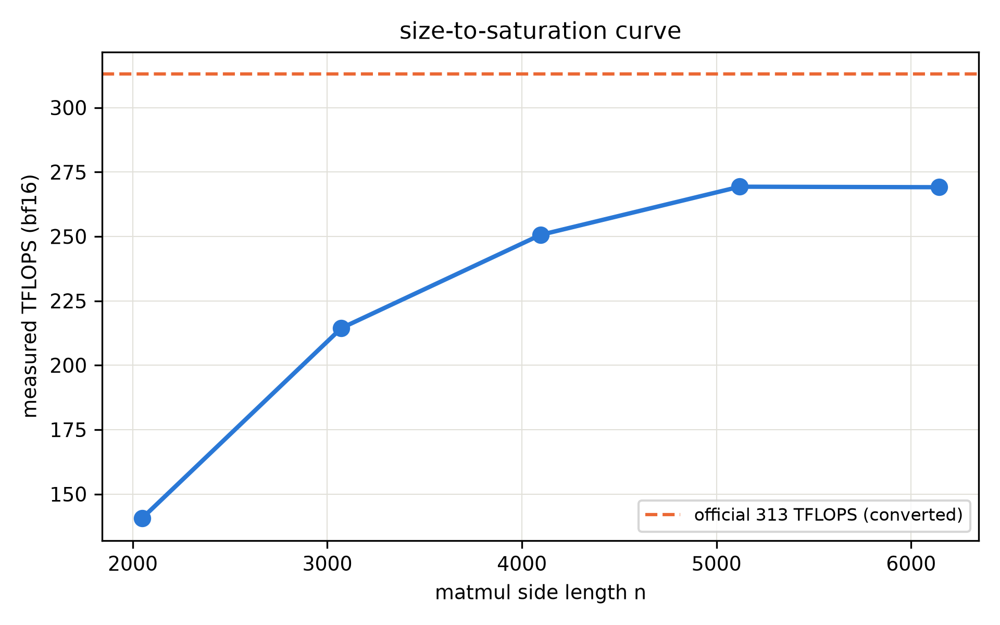

# 第 2 章 推理算术体系：FLOPs、带宽与利用率的手算方法学

> **最小背景栏**：本章只用乘加计数（$2 \times$ 行 $\times$ 列 $\times$ 内维，Book2 大项目练熟）与第 1 章的 roofline。涉及的前五册模型只引用 config 与账本结论（GPT-2 124M=Book2 第 10 章、207M=Book3 第 10 章、两刀机=Book4 第 9 章），不重教任何架构。

## 2.1 方法论总纲：三层对拍

上一章以实测收尾，这一章把「算」变成系统手艺。本册实验的主形态叫**三层对拍**：**手算**（纸面账本——本章的方法学）→ **mini 引擎实测**（第 4-7 章的四版进化）→ **真实引擎实测**（vllm 运行栈黑盒读数，各章对照框）。三层各答各的问题：手算答「物理下限在哪」，引擎答「工程离下限多远」，真实引擎答「工业界做到了什么水平」。层与层之间的差距不是误差，是**待解释的对象**——每一次对拍都要回答「差在哪、为什么」。

手算层的纪律先立三条：其一，一切公式可从 config 逐项推出（本章 2.2 就是逐项推导的全程演示），不接受「背常数」；其二，量纲随身（每个数标清 FLOP、Byte、s）；其三，口径显式（稠密还是 MoE 激活、bf16 还是 fp32、单请求还是批量——口径一换数字就换）。

三层对拍各举一个先例立信。手算层：本章 2.4 节将算出 207M 的 decode 下限 0.348 ms——一个纯纸面数；引擎层：第 7 章收官时四版引擎的实测曲线拿它当纵轴的物理参照；真实引擎层：vllm 运行栈跑同模型的黑盒读数（实现对照框，第 4 章起登场）给工业水位线。三层对上，方法学闭环；对不上——那就是最有教学价值的时刻，1.5 节的 launch bound 发现正是「手算与实测对不上」逼出来的。

## 2.2 每 token 的 FLOPs 账：$2N$ 不是魔法是加法

推理界最常用的速算式：每 token 前向 FLOPs $\approx 2N$（$N$ 为参数量）。它为什么成立？因为一次前向就是让这个 token 穿过全部参数各一次，而每次穿越一个 $(a, b)$ 的矩阵乘做 $2ab$ 次浮点运算——把所有矩阵的 $2ab$ 加起来，恰好 $2 \times$ 总参数。

拿 207M 逐项过一遍（`arithmetic.py` 的逐层账，config=llama215 cand1：$d{=}1024$、$L{=}12$、$h{=}16$、$h_{kv}{=}8$、$d_{ff}{=}2816$、$V{=}32000$、untied）：

- **注意力投影**（每层）：$W_q$ 把 $d$ 投到 $h \cdot d_k = 16 \times 64$：$2 \times 1024 \times 1024$；$W_k, W_v$ 各投到 $h_{kv} \cdot d_k = 8 \times 64$（GQA 的窄投影）：$2 \times 1024 \times 512$ 每个；$W_o$ 投回 $d$：$2 \times 1024 \times 1024$。合计参数 $3{,}145{,}728$。
- **FFN**（SwiGLU 三矩阵）：$3 \times 1024 \times 2816$，参数 $8{,}650{,}752$。
- 每层小计 $11{,}798{,}528$，12 层 $141{,}582{,}336$；加 embedding $32{,}768{,}000$、终态 norm $1{,}024$、untied 出口 $32{,}768{,}000$——总参 $207{,}119{,}360$（与 Book3 的 `hand_account` 逐位一致，这是账本正确性的 assert）。
- 于是每 token FLOPs $\approx 2 \times 207{,}119{,}360 = 414{,}238{,}720 \approx 0.41$ GFLOP。

同一套加法换个形状对照一遍更有意思——GPT-2 124M（Book2 大项目的老朋友，$d{=}768$、$L{=}12$、MHA 12 头、FFN 两矩阵 $4d{=}3072$、tied）：每层注意力是 c_attn（$768 \o 2304$，Q/K/V 一次算）加 c_proj（$768 \o 768$），参数 $768 \times 3072 = 2{,}359{,}296$；FFN 两矩阵 $2 \times 768 \times 3072 = 4{,}718{,}592$——没有门控的旧世界三件套（ReLU 时代）比 SwiGLU 少一个矩阵，但 FFN 宽度是 $4d$ 而非 LLaMA 凑整的 $\frac{8}{3}d$，每层账反而更大。12 层加 tied 词表，主项 $124{,}356{,}864$（官方全量 124,439,808 与主项的差 82,944 = 12 层 Conv1D 投影的 bias 之和——每层 6,912；LayerNorm 的仿射参数已计入主项）。两种形状、一套加法——**$2N$ 速算式对任何形状成立，因为它数的是「参数被穿越的次数」，与形状无关**。

两个口径提醒。第一，注意力打分与 softmax 本身还有随 $n$ 增长的开销：打分矩阵每个头每层是 $(n, d_k) \times (d_k, n)$ 的乘加，全模型合计约 $2 L h n^2 d_k$ FLOPs——短序列时（n=128 对 207M：$2 \times 12 \times 16 \times 128^2 \times 64 \approx 0.4$ GFLOP，与 $2N$ 同量级）是零头，长序列时（n=8192：平方增长 4096 倍）它反客为主——**这就是 $O(n^2)$ 账在算术体系里的精确形态**，第 8 章会把它单独拎出来算（kernel 侧的正身）。第二，**MoE 机型「参数量」有两个**：总参数与每 token 激活参数——MoE 每 token 只过被选中的专家，算 FLOPs 用**激活侧**。我们的两刀机（Book4 第 9 章）正是现成算例：总参 $409{,}115{,}648$，每 token 激活 $168{,}877{,}056$（含 untied 出口；top-2 专家只算被选中的）——它的 FLOPs 账按 $2 \times 1.69\text{e}8 \approx 0.34$ GFLOP/token 记，与 207M 同量级而总参翻倍。**「总参数定显存、激活参数定算力」**——这是 Book4 第 1 章立的效率悖论在算术体系里的精确表达。

**实物 2.1**（207M state_dict 键名与参数量摘录——权重账的实物底单，`arithmetic.py` 逐层账打印）：

```text
[llama215 逐层账]  {'attn_per_layer': '3,145,728', 'mlp_per_layer': '8,650,752',
                    'norms': '2,048', 'per_layer': '11,798,528', 'layers': '141,582,336',
                    'embedding': '32,768,000', 'final_norm': '1,024',
                    'lm_head_untied': '32,768,000'}
```

读法导引：一张表就是一次前向的「收费站清单」——每个 token 依次过 12 个 11.8M 的层收费站、入口交 32.8M（embedding）、出口再交 32.8M（untied 出口），$2N$ 公式的每一项都能在这张清单上点名。

**例 2.1（构造例：玩具模型的 $2N$ 手算）**：设 2 层玩具机，每层 $d{=}8$、单头 $d_k{=}8$、FFN $d_{ff}{=}16$（SwiGLU）、词表 $V{=}50$：每层参数 $=$ 注意力 $(8{\times}8){\times}4$ 组投影 $= 256$……不忙背公式，直接加：$W_q, W_k, W_v, W_o$ 各 $8 \times 8=64$，计 $256$；FFN 三矩阵各 $8 \times 16=128$，计 $384$；每层 $640$，两层 $1280$；embedding $50 \times 8=400$，出口 tied 计 $0$；总 $N=1680$。每 token FLOPs $= 2 \times 1680 = 3360$。**用 5 分钟逐项加出来的这个数，与「$2N$」速算严丝合缝——速算式没有魔法，它只是把这张加法表折成了两倍总参。**

## 2.3 字节账：权重是固定账，KV 是流水账

FLOPs 之外的第二本账是字节（bytes）——第 1 章已经证明，decode 的名义上限卡在带宽上，而带宽上的开销以字节计。

**权重账**（固定账）：$N \times$ 每参数字节数。207M：bf16 每参数 2 字节 → 414 MB（=395 MiB，本册正文叙述统一用十进制 MB，终端原样读数保留 MiB 并随注）；fp32 → 828 MB。第 11 章量化推理的主线就是把每参数字节数往下砍（2 字节→1 字节→0.5 字节），权重账直接减半再减半——账本在此先立好，收益到时直接读。整份权重在每一步 decode 前向中都要从 HBM 搬进计算单元——**不管这条请求只算 1 个 token**。这就是「权重不摊薄」的物理：单请求时它决定了 decode 的带宽下限；批处理时 $B$ 条请求分摊同一次搬运——第 4 章的吞吐红利从这行字里长出来。

**KV 账**（流水账）：每 token 新增 $2 L h_{kv} d_k$ 个元素（K 与 V 各一份；元素口径是 Book3 第 6 章立的账本，服务侧换成字节：$\times$ 每元素字节数）。207M（GQA $h_{kv}{=}8$）：每 token $2 \times 12 \times 8 \times 64 = 12{,}288$ 元素，bf16 下 **24 KiB/token**——一条 2048 token 的请求攒下 48 MiB，一万条并发请求就是近半 TB：KV 账随请求数与序列长**无界增长**，是服务侧独有的显存压力（权重大小与负载无关，KV 不会停）。为什么 K 和 V 要各存一份？因为注意力每步要拿**新查询**去和**全部历史的 K** 算打分（K 的角色是「索引」），再用打分加权**全部历史的 V**（V 的角色是「内容」）——两者都被反复重读，所以都必须驻留；而每来一个新 token，它的 K/V 各长一行，缓存就各付一份。元素账因此带系数 2：$2 \times L \times h_{kv} \times d_k$——207M 代入 $2 \times 12 \times 8 \times 64 = 12{,}288$ 元素，bf16 下 24 KiB。

部署一台引擎的显存全景式顺手立在这里：**显存 = 权重 + 每条活跃请求的 KV + 运行缓冲**。第一项固定、第三项零头、第二项是变量——它随并发数与序列长**乘积**增长，是容量规划的主项。第 5 章会看到碎片如何让这本账隐性膨胀、分页如何把它管住。

两本账合在一起就能做**容量速算**——运维最常被问的问题「一张卡能带几个并发」：可用 KV 显存 = 64 GB − 权重 0.4 GB（bf16）− 运行缓冲（估 2 GB）≈ 61.6 GB；每条 1024 token 请求的 KV = 24 KiB × 1024 = 24 MiB；理论上限 ≈ 61.6 GB ÷ 24 MiB ≈ **2,600 条并发**。三个注意：碎片会打折（第 5 章实测打几折）、长请求按比例涨、真实引擎还要留 batch 前向的激活缓冲。**容量规划=一本除法**——这就是手算方法学在运营问题上的第一次兑现。

两刀机的 MLA 把这笔账压到每 token 3,840 元素（latent 缓存口径，对同形状 GQA 的 12,288 降 68.75%——Book4 第 6 章的 −93.3% 是对 DSV3 原装 MHA 的口径，两码事）——第 3 章三线全景的第一线就从这本账讲起。

## 2.4 decode 时延第一算：72 倍的价格

现在把两本账合上：decode 每 token 要搬 414 MB 权重、做 0.41 GFLOP。拿本机实测带宽 1190 GB/s 除：

$$t_{\text{decode 下限}} \geq \frac{W_{\text{激活字节}}}{\beta} = \frac{414\text{MB}}{1190\text{GB/s}} \approx 0.348 \text{ ms/token} \tag{2.1}$$

用人话说：哪怕别的什么都不干、纯粹把权重从显存搬到算子上，207M 的 decode 也至少要三分之一毫秒一个 token——这是**带宽写下的物理下限**（roofline 斜坡段的读数）。而第 1 章实测裸跑是 25.15 ms/token。$$\frac{25.15}{0.348} \approx 72 \times \tag{2.2}$$

**没有引擎的价格，是 72 倍**。这个数的口径要钉死：分子是 bf16 稳态实测（25.15 ms）、分母是同一 dtype 的带宽下限（0.348 ms）——同口径相除才是「价差」；若拿 fp32 去比 bf16 的下限（49÷0.35≈140），那是口径错配的虚高。这笔差距的分解清单现在可以写全了：launch 开销主导（25 ms 与 dtype、序列长几乎无关——第 1 章 1.5 的发现）、无批处理（权重搬运无从摊薄）、fp32 路径（部分档位）。把还账路线立成一张表——它是本册第二、三段的导航图，每一行都会在对应章末被回访核销：

**表 2.1 「72 倍价差」的还账路线**（本表先于账本矩阵出现，故编号 2.1）

| 价差来源 | 定性 | 还账机制 | 章 |
|---|---|---|---|
| launch 开销（两百算子串行发射） | 主导 | 图执行：录一次放一次 | 第 12 章 |
| 权重不摊薄（B=1 独扛 395MB） | 分母项 | 批处理：B 条共担一次搬运 | 第 4 章 |
| 无 KV 的重复前向（基线口径自带） | 基线的一部分 | KV 账本与三线压缩 | 第 3 章 |
| 精度路径（fp32 档） | 部分档位 | 量化推理 | 第 11 章 |

注意各行的**相乘关系**：这些机制作用于价差的不同因子，理论上可叠乘；实际能收回多少，每一章都拿实测说话——这正是三层对拍的用武之地。**手算的意义正在于此：它不是练习题，是后面每一章改进幅度的标尺**——第 7 章四版引擎收官时，我们会拿同一把尺子量出每一版还了多少倍。

顺带把上一章的「意外」补完：既然下限是带宽写的，为什么裸跑时带宽利用率只有 1.38%？因为 launch 开销把每步时间撑大 72 倍，带宽自然闲着——**下限是给「已经在正确瓶颈上跑」的实现准备的**。先解决「在哪个瓶颈上」，再谈「离瓶颈多近」——这是 roofline 使用的第二条纪律。

## 2.5 利用率：从 microbench 到真实负载

「峰值」本身也需要体检。第 1 章表 1.2 那条尺寸→饱和度曲线（n=2048 → 140.6 TFLOPS、n=6144 → 269.3）说明：**峰值算力是大矩阵的特权**。于是「利用率」必须问三层：

1. **microbench 饱和度**：能写出多大的矩阵，实际拿到峰值的几成——本机 269.3 实测对 313 官方换算，约 86%（剩余差距来自调度与访存的常规损耗）。
2. **负载形态因子**：你的负载是不是大矩阵——decode 每步是几十上百个小算子，形态因子趋近零。
3. **MFU**（Model FLOPs Utilization）：模型吞吐折算的 FLOP/s ÷ 峰值——裸跑 207M：$0.41\text{GFLOP} \times 39.77\text{tok/s} \approx 0.0165$ TFLOPS，MFU $= 0.006\%$。

逐层展开看它们各自怎么测。先给 **microbench** 的完整证据（尺寸→饱和度五点，notes/04 P2 原始读数——「峰值是大矩阵的特权」的实物）：

| 方阵边长 n | 2048 | 3072 | 4096 | 5120 | 6144 |
|---|---|---|---|---|---|
| 实测 TFLOPS | 140.6 | 214.4 | 250.6 | 269.3 | 269.1 |

读法导引（图 1.3 的尺寸→饱和度曲线，）：从 2048 到 6144 算力翻近一倍——小矩阵喂不饱计算单元（乘法还没铺满，访存与调度先到顶）；「峰值」的完整条件是大矩阵加稳态。回到三层问法。**microbench**：写一个尽可能大的纯矩阵乘循环（排除一切别开销），稳定后读到的就是「这块卡在最佳形态下的底子」——我们的 269.3 TFLOPS 是 n=6144 方阵的稳态中位数；官方 313 是换算口径，两者 86% 的比值说明底子健康。**形态因子**：真实负载的每步计算很少是大方阵——decode 的逐层投影是 $(1, 1, 1024) \times (1024, 1024)$ 级的瘦条乘法，天然打不满；这不是实现的错，是负载与硬件的错配。**MFU**：把前两者合起来算总账——裸跑 207M 的 $0.006\%$ 之所以惨，是形态因子（瘦条）与系统开销（launch）的叠加；批处理引擎能把瘦条拼成胖块（一百条请求的 decode 拼成一个大批量矩阵乘），形态因子就救回来了大半——这正是第 4 章要亲手验证的第一笔引擎红利。

三层一层比一层残酷，但每一层都有用：microbench 告诉你硬件底子（86% 是好底子）；形态因子告诉你负载与硬件的错配（decode 天生小 kernel——第 8/12 章正是改形态的两种手术）；MFU 是最终成绩单（引擎的全部工作就是把它从 0.006% 往上拉几个数量级——第 7 章收官曲线的纵轴就是它）。

## 2.6 三机型算例矩阵：一张反复回查的底表

把方法学叠成一张表（`arithmetic.py` 产出，本册后续章节反复引用）：

**表 2.2 三机型推理账本矩阵（bf16 口径；带宽按本机实测 1190 GB/s）**

| 机型 | 总参 | 激活/token | FLOP/token | 权重 | KV 元素/token | decode 带宽下限 |
|---|---|---|---|---|---|---|
| GPT-2 124M（tied，MHA） | 124,356,864* | 同左 | 0.25 G | 237 MB | 18,432 | 0.209 ms |
| llama215 207M（untied，GQA） | 207,119,360 | 同左 | 0.41 G | 395 MB | 12,288 | 0.348 ms |
| 两刀机 409M（MoE+MLA） | 409,115,648 | 168,877,056 | 0.34 G | 780 MB | 3,840 | 0.284 ms |

\* GPT-2 主项口径（矩阵权重）；官方全量 124,439,808 另含 bias 82,944（Conv1D 与 LayerNorm 的偏置项——正文引用 GPT-2 参数时注明口径）。

逐行把表读透。第一行 GPT-2 124M：KV 最贵（18,432）因为 MHA 不分组，同时它又是「权重最轻」的机型（tied 出口省下 38M 参数）——一个模型两笔账方向相反，恰好证明**权重账与 KV 账必须分开管**。第二行 207M：GQA 把 KV 降到 12,288、untied 又把权重抬到 395MB——现代骨架在两本账之间走钢丝的真实样本。第三行两刀机：总参最大、FLOP/token 反而居中（MoE 算力看激活）、KV 最便宜（MLA latent 账 3,840）——一行浓缩 Book4 全册的效率悖论。

三行对照三个教学点：**其一**，GPT-2 的 KV 最贵（MHA 全头缓存 18,432 元素/token）——GQA 一行降到 12,288、MLA 一行降到 3,840，KV 账的三级台阶正是第 3 章架构侧压缩线的预告。**其二**，两刀机「总参最大、FLOP/token 却不是最大」——MoE 的每 token 账只看激活侧，效率悖论的算术表达。**其三**，decode 下限与权重（激活）正相关而与 KV 无关——KV 是显存账不是带宽账（decode 每步读 KV 的量远小于权重；长上下文时例外，第 3 章再细化）。Book5 侧的 GDN/KDA 固定状态机型不入此表——它们的账本形态（固定状态、无 KV 增长）属第 3 章架构侧线的地界。

## 2.7 本章小结

开篇问的是「把手算变成手艺」，收卷时它长这样：**每 token FLOPs $\approx 2 \times$ 激活参数**（逐项加法推出，MoE 看激活侧）；**权重是固定账、KV 是流水账**（前者定 decode 带宽下限，后者定显存压力与并发上限）；**利用率三层问法**（底子、形态、MFU）。把这些数字代入 207M：下限 0.348 ms、实测 25.15 ms、72 倍价差、MFU 0.006%——「没有引擎的生活」至此完成了从现象到账目的建档。

带走的心智：**推理性能问题的标准姿势是三问——物理下限在哪（roofline 手算）、现在离下限多远（实测对拍）、差价的每一项记在哪个机制头上（差距分解）**。下一章就带着这套姿势去看全书最大的一笔账：KV cache 的三线压缩全景——那里手算、实测与架构史将在同一张决策树上会师。

## 动手验证

- 账本矩阵与 72 倍账：`source env.sh && python code/ch02/arithmetic.py`（产物 `log/book6-ch02/arithmetic_base.json`；逐层账 assert 与 Book3 `hand_account` 逐位对齐）
- 三机型参数正身：GPT-2 见 Book2 第 10 章（124M）；207M 见 `code/Book3-现代开源骨架/ch10/DESIGN-215M.md`；两刀机激活/KV 见 `code/Book4-规模与效率/ch09/DESIGN-409M.md` §3/§10（本表 3,840 元素/token 的出处）
