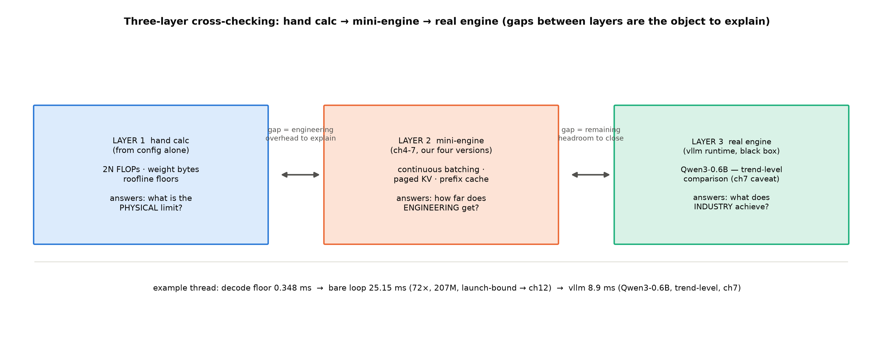
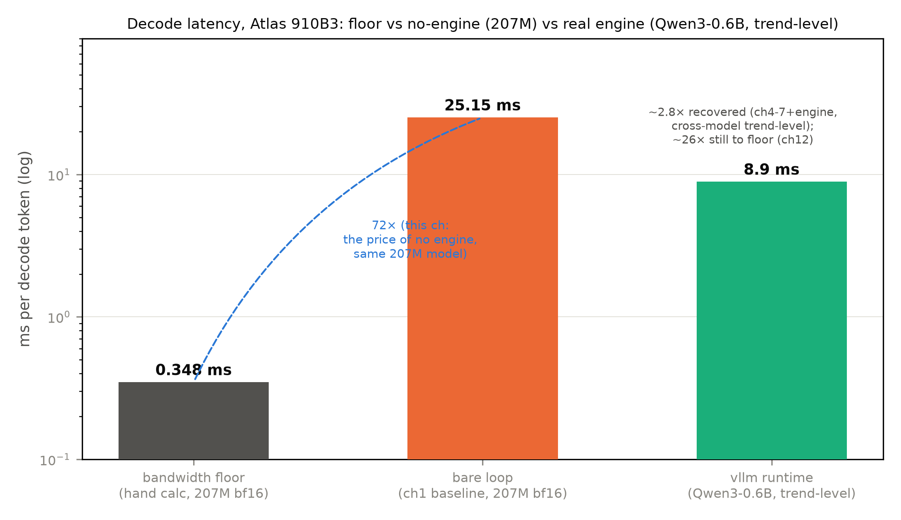

# 第 2 章 推理算术体系：FLOPs、带宽与利用率的手算方法学

> **最小背景栏**：本章只用乘加计数（$2 \times$ 行 $\times$ 列 $\times$ 内维，Book2 大项目练熟）与第 1 章的 roofline。涉及的前五册模型只引用 config 与账本结论（GPT-2 124M=Book2 第 10 章、207M=Book3 第 10 章、两刀机=Book4 第 9 章），不重教任何架构。

## 2.1 方法论总纲：三层对拍

上一章留下三个悬案收进本章的问题链：其一，裸跑 25 ms 对不上算力、带宽两个理论下限，96% 的差额指向 launch 开销（反推约 125 µs/算子——第 1 章的估计，第 12 章裸发射实测 11 µs 做差还债）——这笔账要建成本册反复引用的**价差账本**；其二，基线读数散着几把尺子（dtype 与上下文长度各档不同数），哪把尺子配哪个读数需要定谳；其三，roofline 的脊点告诉我们峰值是大矩阵的特权——「利用率」因此不是一个数而是三层问法。三案共通的一个动作：把手算变成系统手艺。本册实验的主形态叫**三层对拍**（图 2.1）：**手算**（纸面账本——本章的方法学）→ **mini 引擎实测**（第 4-7 章的四版进化）→ **真实引擎实测**（vllm 运行栈黑盒读数，各章对照框）。三层各答各的问题：手算答「物理下限在哪」，引擎答「工程离下限多远」，真实引擎答「工业界做到了什么水平」。



图 2.1 三层对拍（自绘示意级）：三层各答各的问题，层与层之间的差距不是误差、是待解释的对象；底部一条实例线（0.348 → 25.15 → 8.9 ms）贯穿本册。

为什么手算先行、而不是直接上引擎实测？三个理由。其一，**手算是唯一不依赖实现的预言**：引擎各有各的工程取舍，实测只能告诉你「这家做到了多少」，手算告诉你「物理上最多多少」——没有上界的测量是盲测。其二，手算可迁移：换一台卡、换一个模型，公式照样用（把 910B3 的带宽换成别的卡，本章每个数字都能重算）；实测读数只属于当时当刻的那台机器。其三，手算是排障的解剖刀：实测与手算对不上时，差额就是「工程开销」的藏身处——第 1 章 launch bound 的发现正是这么逼出来的。这条路线不是我们的发明：Google 的 500B 级推理论文（Pope et al., MLSys 2023）通篇先立解析账（算力/访存/通信三本）再谈并行策略，本章手算是同款方法学的单卡版【证据等级：官方论文 2211.05102】。反过来，只会手算不会实测是纸上谈兵，只会实测不会手算是玄学——层与层之间的差距不是误差，是**待解释的对象**。

手算层的纪律先立三条：其一，一切公式可从 config 逐项推出（本章 2.2 就是逐项推导的全程演示），不接受「背常数」；其二，量纲随身（每个数标清 FLOP、Byte、s）；其三，**口径显式**（稠密还是 MoE 激活、bf16 还是 fp32、含不含 embedding 查表、单请求还是批量——口径一换数字就换，本章 2.2 会当场撞上一次）。

## 2.2 每 token 的 FLOPs 账：$2N$ 不是魔法是加法

推理界最常用的速算式：每 token 前向 FLOPs $\approx 2N$（$N$ 为参数量）。论文级的正身先落位（Pope et al.）：**"An $N$-parameter decoder-only model requires $2N$ matmul FLOPs in the forward pass per token seen because each matmul performs one multiplication and one addition per pair of input token and parameter values"**——每个 matmul 对每对（输入元素，参数元素）做一次乘一次加；这个约定他们归功于 Kaplan et al.（Scaling Laws）【证据等级：官方论文 2211.05102 §2 分析模型，直引】。把它从断言变成你会推的两步：一个 $(a,b)$ 矩阵乘 $(n,a)\cdot(a,b)\to(n,b)$，输出每个元素是**一次长度 $a$ 的内积**（$a$ 次乘 $+a$ 次加 $=2a$ FLOP），输出共 $b$ 个元素——合计 $2ab$；一次前向 = 全部矩阵各乘一次，把所有 $2ab$ 加起来 $= 2\times$（被穿越的参数总量）。**速算式没有魔法，它只是把逐矩阵的加法表折成了两倍总参**。

拿 207M 逐项过一遍（表 2.1，`arithmetic.py` 逐层账的排版版；config=Book3 `DESIGN-215M.md` 定版（llama215）：$d{=}1024$、$L{=}12$、$h{=}16$、$h_{kv}{=}8$、$d_k{=}64$、$d_{ff}{=}2816$、$V{=}32000$、untied）：

表 2.1 207M 每 token 前向 FLOPs 逐层推导表（形状列=本表灵魂；参数列即「收费站」）**

| 步骤 | 运算（形状流转） | 参数量 | 乘加账 |
|---|---|---|---|
| 入口查表 | $(n,V)$ 索引 $\to(n,d)$ | 32,768,000 | **0**（查表无乘加） |
| $W_q$（每层） | $(n,d)\cdot(d,h{\cdot}d_k)\to(n,1024)$ | 1,048,576 | $2\times1024\times1024$ |
| $W_k,W_v$（每层，GQA 窄投影） | $(n,d)\cdot(d,512)\to(n,512)$ 各一 | 524,288×2 | $2\times1024\times512$ 每个 |
| $W_o$（每层） | $(n,1024)\cdot(1024,d)\to(n,d)$ | 1,048,576 | $2\times1024\times1024$ |
| 注意力打分+加权（每层） | $(h,n,d_k)\cdot(h,d_k,n)\to(h,n,n)$ | 0（无参数） | $2hn^2d_k$（每层；全模型合计 $2Lhn^2d_k$，随 $n$ 涨，单列） |
| FFN SwiGLU 三矩阵（每层） | $(n,d)\cdot(d,d_{ff})$ ×3 | 8,650,752 | $3\times2\times1024\times2816$ |
| 层内 RMSNorm ×2（每层） | $(n,d)\to(n,d)$ ×2 | 2,048 | $\approx0$（逐元素） |
| 每层小计 | — | 11,798,528 | — |
| 12 层 | — | 141,582,336 | — |
| 终态 norm | $(n,d)\to(n,d)$ | 1,024 | $\approx0$（逐元素） |
| 出口 $W_e$（untied） | $(n,d)\cdot(d,V)\to(n,V)$ | 32,768,000 | $2\times1024\times32000$ |
| **合计** | — | **207,119,360** | **$\approx2N$**（查表行除外） |

最后一列加总与 Book3 的 `hand_account` 逐位一致——账本正确性的 assert。这里当场撞上口径问题：**入口是查表（0 FLOP）、出口是矩阵乘**——不对称的机制原因一句话：入口拿 token id 直接**索引**出行向量（$O(1)$ 取一行），出口的隐状态要与**全部 $V$ 个词表行**逐一算内积竞争相似度（一次 $(n,d)\cdot(d,V)$ 的完整矩阵乘）——一个取货、一个打擂——那「$2N$」到底算不算入口的 32.8M 参数？两个口径都要会：全参口径 $2\times207{,}119{,}360=414.2$ M FLOP/token（速算式的直读）；矩阵侧口径 $2\times(207{,}119{,}360-32{,}768{,}000)=348.7$ M（去掉查表行——与两刀机设计文档的激活参数口径同构：**不含输入 embedding lookup、含 lm_head、含路由门**，`code/Book4-规模与效率/ch09/DESIGN-409M.md` §3）。两数差 18.8%——「口径显式」这条纪律的第一课就在自家账上。【证据等级：本机手算+DESIGN 文档，`arithmetic.py` 双口径打印】

同一套加法换个形状对照一遍——GPT-2 124M（Book2 大项目的老朋友，$d{=}768$、$L{=}12$、MHA 12 头、FFN 两矩阵 $4d{=}3072$、tied）：每层注意力是 c_attn（$768\times2304$，Q/K/V 一次算）加 c_proj（$768\times768$）；FFN 两矩阵 $2\times768\times3072$——没有门控的旧世界两件套比 SwiGLU 少一个矩阵、但 FFN 宽度 $4d$ 比 LLaMA 凑整的 $\frac{8}{3}d$ 宽——两项恰好抵消（$2\times4d=3\times\frac{8}{3}d=8$，每层 FFN 参数同为 $8d^2$；d=768 时两边都算出 4,718,592），LLaMA 凑整到 2816 后反而略大。12 层、tied 词表、学习式位置表 wpe（0.79M）与终态 ln_f 都计入，主项 124,356,864（官方全量 124,439,808 与主项的差 82,944 = Conv1D 投影的 bias 之和；LayerNorm 仿射参数已计入主项）。两种形状、一套加法——**$2N$ 对任何形状成立，因为它数的是「参数被穿越的次数」**。

两刀机（Book4 第 9 章的 409M：207M 骨架上 FFN→MoE、GQA→MLA 两刀）的**激活账**值得单独走一遍——它是「总参与激活分离」的完整标本，此处只算 FLOPs 侧（latent 机制让位第 3 章）。注意力侧：12 层全部 MLA（设计文档正身，无混排层），投影参数每层 2,686,976——比 GQA 的 3,145,728 还略低，注意力槽在本尺度不贵。FFN 侧：每层 MoE = 路由门 $E\cdot d=8{,}192$ + 8 个路由专家（每个 $3dw{=}2{,}881{,}536$，$w{=}938$）+ 1 个共享专家 $2{,}881{,}536$；**每 token 激活的 FFN = 路由门 + top-2 被选专家 + 共享 = $8{,}192+3\times2{,}881{,}536=8{,}652{,}800$**——与稠密 SwiGLU 的 8,650,752 几乎分毫不差，这不是巧合：$w{=}938$ 正是按「每 token 计算量与稠密基线持平」反解出来的（等激活设计，$\lfloor 2816/3\rfloor$）。激活账逐层走一遍才见口径的作用：每层 $=$ MLA 2,686,976 $+$ 潜向量 norm 512 $+$ 层内 norm 2,048 $+$ MoE 激活 8,652,800 $=11{,}342{,}336$；12 层 136,108,032；加出口 32,768,000 与终态 norm 1,024——**每 token 激活 $168{,}877{,}056$**（含 untied 出口、含路由门、不含查表，逐位对上设计文档）；总参则按整栋楼记 $409{,}115{,}648$——FLOPs 账按 $2\times1.69\text{e}8\approx0.34$ GFLOP/token 记，与 207M 同量级而总参翻倍。**「FLOPs 按门算、显存按整栋楼算」**——这就是激活参数的物理含义，也是 Book4 第 1 章效率悖论在算术体系里的精确表达。

两个口径提醒收尾。其一，注意力打分与 softmax 本身还有随 $n$ 增长的开销（表 2.1 单列那行）：全模型合计约 $2Lhn^2d_k$——短序列时是零头，长序列时平方反客为主，第 8 章把它单独拎出来算 kernel 侧正身。其二，MoE 机型「参数量」有两个：算 FLOPs 用激活侧、算显存用总参侧——表 2.3 的两列分立就是为此。

**实物 2.1**（逐层账终端输出原文——`arithmetic.py` 的打印，权重账的实物底单；看什么：一行排版里藏着表 2.1 的每一项）

```text
[llama215 逐层账]  {'attn_per_layer': '3,145,728', 'mlp_per_layer': '8,650,752', 'norms': '2,048',
                    'per_layer': '11,798,528', 'layers': '141,582,336', 'embedding': '32,768,000',
                    'final_norm': '1,024', 'lm_head_untied': '32,768,000'}
[2N 双口径] 全参 2×207,119,360=414,238,720 | 矩阵侧(去 embedding 查表) 348,702,720——差 18.8%
```

**例 2.1（构造例：玩具模型的 $2N$ 手算——速算式的一次亲手验证）** 设 2 层玩具机：每层 $d{=}8$、单头 $d_k{=}8$、FFN $d_{ff}{=}16$（SwiGLU）、词表 $V{=}50$、出口 tied。逐项加：$W_q,W_k,W_v,W_o$ 各 $(8,8)\cdot(8,8)\to(8,8)$，参数 $64$ ×4 = 256；FFN 三矩阵各 $(n,8)\cdot(8,16)\to(n,16)$，参数 $128$ ×3 = 384；每层 640、两层 1,280；入口查表 $50\times8=400$（tied 出口复用它，0 增量）；总 $N=1{,}680$。每 token FLOPs $=2\times1{,}680=3{,}360$。输出读法：五分钟加出来的数与速算式严丝合缝——**$2N$ 是这张加法表的折叠**；也顺手看清查表行占 400/1680（24%），玩具尺度上口径差比大模型更显眼。

## 2.3 字节账：权重是固定账，KV 是流水账

FLOPs 之外的第二本账是字节（bytes）——第 1 章已经证明，decode 的名义上限卡在带宽上，而带宽上的开销以字节计。

**权重账**（固定账）：$N\times$ 每参数字节数。207M：bf16 每参数 2 字节 → 414 MB（十进制；终端原样读数 395 MiB 随注）；fp32 → 828 MB。第 11 章量化推理的主线就是把每参数字节数往下砍（2→1→0.5），权重账直接减半再减半——账本在此先立好。整份权重在每一步 decode 前向中都要从 HBM 搬进计算单元——**不管这条请求只算 1 个 token**。这就是「权重不摊薄」的物理：单请求时它决定了 decode 的带宽下限；批处理时 $B$ 条请求分摊同一次搬运——每 token 的权重字节账直接 $\div B$（414 MB 搬一次出 $B$ 个 token——式 (2.1) 的分子被摊薄，等价于分母乘 $B$），第 4 章的吞吐红利从这行算术里长出来。

**KV 账**（流水账）：注意力要求每步拿**新查询**去和**全部历史的 K** 算打分（K 的角色是「索引」），再用打分加权**全部历史的 V**（V 的角色是「内容」）——两者都被反复重读，所以每来一个新 token，它的 K/V 各存一行、缓存各付一份：每 token 新增 $2Lh_{kv}d_k$ 元素（K、V 各 $Lh_{kv}d_k$；公式正身是 Book3 第 6 章的元素账，服务侧乘每元素字节数）。207M（GQA $h_{kv}{=}8$、$d_k{=}64$）：每层 $2\times8\times64=1{,}024$ 元素，12 层 $12{,}288$ 元素，bf16 下 $12{,}288\times2\text{ B}=24{,}576\text{ B}$——**24 KiB/token**（K 与 V 各占一半，缺谁都算不了注意力）——一条 2048 token 请求攒 48 MiB，一万条并发就是近半 TB。这本账的量级有论文级家族对照：Pope et al. 对 500B+ 模型的账单——batch 512、上下文 2048 时 **KV 合计 3 TB，是模型参数的 3 倍**（"the KV cache totals 3TB, which is 3 times the size of the model's parameters"）【证据等级：官方论文 2211.05102 §2.1，直引】。**权重账与负载无关、KV 账随请求数与序列长无界增长**——这是服务侧独有的显存压力。

部署一台引擎的显存全景式顺手立在这里：**显存 = 权重 + 每条活跃请求的 KV + 运行缓冲**。第一项固定、第三项零头（激活工作区+框架常驻的经验估，第 5 章引擎侧会给实测口径）、第二项是变量——它随并发数与序列长**乘积**增长，是容量规划的主项。第 5 章会看到碎片如何让这本账隐性膨胀、分页如何把它管住。

**例 2.2（真实数走查：一张 64 GB 卡能带几条并发——容量速算的第一次兑现）** 输入：910B3 单卡进程可见 60.96 GiB（notes/04 P2 定版口径——标称 64 GB，运行时上下文占去约 3.4 GiB）、207M bf16 权重 0.4 GB、运行缓冲估 2 GB（经验值，真实引擎的激活缓冲与其配置相关）。步骤：可用 KV 显存 $\approx 60.96-0.4-2\approx58.6$ GiB；每条 1024 token 请求的 KV $=24\text{ KiB}\times1024=24$ MiB；理论上限 $=58.6\text{ GiB}\div24\text{ MiB}\approx2{,}500$ 条。输出读法：这是一本除法——分子是「卡减固定开销」、分母是「每条请求的流水账」；三个折扣要心里有数：碎片会打折（第 5 章实测打几折）、长请求按比例涨、真实引擎还要留 batch 前向的激活缓冲。**容量规划=一本除法**，手算方法学在运营问题上的第一次兑现。

并发上限还有一层「KV 的复利」值得点破：第 3 章的三线压缩每压一档，例 2.2 的商就涨一档——GQA 的 12,288 到 MLA 的 3,840 是 3.2×，再叠 2bit 量化又是数倍——**KV 压缩比直接乘进并发容量**。前五册架构侧省下的钱，就是在这里按汇率兑成服务侧的并发额度；两刀机的 MLA 已把每 token 压到 3,840 元素（latent 缓存口径，对同形状 GQA 12,288 降 68.75%——Book4 第 6 章的 −93.3% 是 DSV2 摘要的部署口径（对 67B 的 bf16 GQA-8、含 6bit 量化与层数差三因素复合；对同构 MHA 反事实的架构口径是 −98.24%），两码事）。第 3 章三线全景的第一线就从这本账讲起。

## 2.4 decode 时延第一算：没有引擎的价格

现在把两本账合上：decode 每 token 要搬 414 MB 权重、做 0.41 GFLOP。拿本机实测带宽 1190 GB/s 除【证据等级：本机实测，notes/04 P2 D2D 稳态】：

$$t_{\text{decode 下限}} \geq \frac{W_{\text{激活字节}}}{\beta} = \frac{414\text{MB}}{1190\text{GB/s}} \approx 0.348 \text{ ms/token} \tag{2.1}$$

| 符号 | 含义 | 量纲 |
|---|---|---|
| $W_{\text{激活字节}}$ | 每 token 前向必须搬运的激活权重字节（MoE 取激活侧） | Byte |
| $\beta$ | 显存有效带宽（本机实测稳态） | Byte/s |
| $t_{\text{decode 下限}}$ | 单条请求 decode 每 token 的时延下限 | s |

用人话说：把每 token 必须搬的家底（字节）除以搬运速度（带宽），就是单 token 时延的物理下限——再快的引擎也快不过这一除。

这个下限公式有两个常被问的细节。**其一，为什么分母只有权重、没有 KV？**decode 每步读 KV 的量是 $2Lh_{kv}d_k\times n$ 字节——n=512 时对 207M 是 12 MiB，对 414 MB 的权重是零头；但 n 涨到交叉点就反超：令 $24\text{ KiB}\times n=414\text{ MB}$，解得 $n\approx1.7$ 万 token——再往上 KV 读取超过权重（n=32k 时 768 MiB 对 414 MB），长上下文的下限要改写成「（权重+KV）÷带宽」（KV 不只吃显存，长上下文时还吃 decode 时延——第 3 章 KV 压缩的性能动机又一条线）。**其二，为什么激活不算？**中间激活是算完即弃的片上量，不驻留 HBM 主回路——严格说有部分溢写，教学口径略计。

价差要**同 dtype 相除**（口径纪律第二次上桌）：bf16 档实测 25.15 ms 对下限 0.348 ms、fp32 档 25.05 ms 对下限 0.696 ms（fp32 权重 828 MB ÷1190——表 2.3 的「fp32 档权重×2、下限×2」注即此；两个实测都取 ch1 稳态档 n0=512，`serve_baseline_base.json`）【证据等级：本机实测，Atlas 910B3】：

$$\frac{25.15}{0.348}\approx72\times\ (\text{bf16})\qquad \frac{25.05}{0.696}\approx36\times\ (\text{fp32}) \tag{2.2}$$

**没有引擎的价格，bf16 口径 72 倍、fp32 口径 36 倍**。两个 dtype 落在几乎同一条 25 ms 上——这本身就是 launch 主导的实证：dtype 把带宽账差出一倍，wall-clock 却纹丝不动（时间花在发射上，不在搬运上）。卷级大纲设计期曾引「70-140 倍」，那是把 fp32 实测对 bf16 下限跨口径相除的混算——本章按「同 dtype 相除」纪律定谳如上（大纲已同步更正）。至于「哪把尺子配哪个读数」：**稳态档（n0=512）是正身**——三次重复档 25.7-27.2 ms 验证其稳定；fp32 短档 n0=24 的 57.5 ms 是真实的档型效应（三次重复同样稳定在 57 上下，疑因超短序列的 kernel 选路/tile 适配，如实登记不作正身、机制归因留给第 12 章的算子级探针）。

差距的分解清单现在可以写全了——它是本册第二、三段的导航图，每一行都会在对应章末被回访核销：

表 2.2 「72 倍价差」的还账路线**（机制作用于不同因子，理论上可叠乘；实际收回多少每章拿实测说话）

| 价差来源 | 定性 | 还账机制 | 章 |
|---|---|---|---|
| launch 开销（两百算子串行发射） | 主导 | 图执行：录一次放一次 | 第 12 章 |
| 权重不摊薄（B=1 独扛 414MB） | 分母项 | 批处理：B 条共担一次搬运 | 第 4 章 |
| 无 KV 的重复前向（基线口径自带） | 基线的一部分 | KV 账本与三线压缩 | 第 3 章 |
| 精度路径（fp32 档的 36×） | 部分档位 | 量化推理 | 第 11 章 |

表 2.2 各行作用于价差的**不同因子**：launch 作用于「每步固定开销」、批处理作用于「权重摊薄」、KV 与量化作用于「搬运内容本身」——作用于不同因子的机制理论上可叠乘，实际收回多少每章拿实测说话。三档读数放在一起看（图 2.2）：下限 0.348、裸跑 25.15、真实引擎档 8.9 ms/token（vllm 运行栈跑 **Qwen3-0.6B** 单请求——模型不同，**趋势级对照、绝对数不可比**（第 7 章登记口径）【证据等级：本机实测，Atlas 910B3，运行栈 0.27.1+vllm-ascend 0.27.1rc1】）。引擎把裸跑的 25.15 ms 还到 8.9 ms 量级（回收约 2.8×，跨模型趋势级）；离 0.348 ms 的带宽下限仍差约 26×——这段差距的多数仍归 launch 与调度（第 12 章）。



图 2.2 decode 时延三档（自产；数据源 `arithmetic_base.json` + 第 7 章 vllm 实测；log 轴；第三档为 Qwen3-0.6B 口径、趋势级对照）：0.348 → 25.15 是本章的 72×（207M 同模型口径），25.15 → 8.9 是引擎的还账（跨模型趋势级）。

顺带把上一章的「意外」补完：既然下限是带宽写的，为什么裸跑时带宽利用率只有 1.38%？因为 launch 开销把每步时间撑大 72 倍，带宽自然闲着——**下限是给「已经在正确瓶颈上跑」的实现准备的**。先解决「在哪个瓶颈上」，再谈「离瓶颈多近」——这是 roofline 使用的第二条纪律。

## 2.5 利用率：从 microbench 到真实负载

「峰值」本身也需要体检。第 1 章那条尺寸→饱和度曲线的五点完整读数（notes/04 P2 正身，表列与正文口径统一；图 1.3 的曲线版在第 1 章）：

| 方阵边长 n | 2048 | 3072 | 4096 | 6144 | 8192 |
|---|---|---|---|---|---|
| 实测 TFLOPS | 140.6 | 214.4 | 250.6 | 269.3 | 269.1 |

读法：从 2048 到 6144 算力翻了 92%（小矩阵喂不饱计算单元——乘法还没铺满，访存与调度先到顶），**6144 已饱和、8192 持平微降**（平台段的正常抖动；microbench 取 6144 正因它是平台起点的最小档——再大只是再验证一次平台）——「峰值」的完整条件是大矩阵加稳态。于是「利用率」必须问三层：

1. **microbench 饱和度**：本机 269.3 实测【证据等级：本机实测】对 313 官方换算【证据等级：厂商口径换算，Atlas 800T A2 ÷8】，约 86%——底子健康。
2. **负载形态因子**：你的负载是不是大矩阵——decode 每步是几十上百个小算子（$(1,1,1024)\times(1024,1024)$ 级瘦条），形态因子趋近零；这不是实现的错，是负载与硬件的错配。
3. **MFU**（Model FLOPs Utilization）：模型吞吐折算的 FLOP/s ÷ 峰值。定义引 Pope et al. 的原话：**"The model FLOPS utilization (MFU) is the ratio of the observed throughput to the theoretical maximum throughput if the benchmarked hardware setup were operating at peak FLOPS with no memory or communication overhead."**【证据等级：官方论文 2211.05102 §2（Inference Cost Tradeoffs 指标定义段），直引】——裸跑 207M：$0.41\text{G}\times39.77\text{ tok/s}\approx0.0165$ TFLOPS，MFU $=0.0165/269.3\approx0.006\%$（分母声明：本机实测 269.3 口径；换官方 313 则 0.005%——量级不变）。

**例 2.3（真实数走查：0.006% 的因式分解——三层问法第一次合账）** 拿第 1 章的脊点算术强度 $I^\*\approx226$ FLOP/Byte 做解剖刀。若系统开销全消（decode 稳稳跑在带宽下限 0.348 ms/token）：吞吐 $=1/0.348\text{ ms}\approx2{,}870$ tok/s，MFU $=0.41\text{G}\times2{,}870/269.3\text{T}\approx0.44\%$——**这个 0.44% 正是带宽受限负载的 MFU 天花板**（$=1/I^\*$：每搬一字节最多换 226 次浮点，而 decode 只换约 1）。而实测 0.006% 对天花板 0.44% 又差 72 倍——**正是式 (2.2) 的系统开销**。输出读法：$0.006\%\approx0.44\%\div72$——「decode 是带宽生意」定下天花板（算力本来就该闲着），launch 定下现实离天花板多远；读任何 MFU 数字前先问这两层。

家族对照把这三层放进业界坐标系：训练侧，PaLM 540B 报过 46.2% MFU【证据等级：官方技术报告 2204.02311】——大矩阵批次的健康区间；推理侧，Pope et al. 的优化实现在大 batch **prefill** 档拿到 76% MFU、decode 档 29 ms/token（int8 权重量化下，540B 模型 64 芯）【证据等级：官方论文 2211.05102 摘要+§1】——prefill 能摸到训练级、decode 天然低一到两个数量级，与我们的三层问法互相印证。另有一个口径区分值得立住：**算力 MFU 与带宽 MBU**（memory bandwidth utilization）——同一次裸跑，算力用了 0.006%（有用功口径=理想账；无 KV 重算的实测账是 3.2%——第 1 章两本账）、带宽用了 1.38%【证据等级：本机实测，`arithmetic_base.json`】；decode 是带宽生意，**带宽利用率才是它的主指标**，算力 MFU 只是陪衬（第 7 章引擎读数会反过来：带宽吃满、算力仍闲）。还有一层预告：批处理能把瘦条拼成胖块（一百条请求的 decode 拼成一个大批量矩阵乘）——形态因子是三成里唯一能被引擎亲手救回的一成，第 4 章的第一笔引擎红利正是它。

## 2.6 三机型算例矩阵：一张反复回查的底表

把方法学叠成一张表（`arithmetic.py` 产出，本册后续章节反复引用）：

表 2.3 三机型推理账本矩阵（bf16；带宽按本机实测 1190 GB/s；fp32 档权重×2、下限×2）**

| 机型 | 总参 | 激活/token | FLOP/token | 权重 bf16 | KV 元素/token | decode 带宽下限 | prefill 算力下限† |
|---|---|---|---|---|---|---|---|
| GPT-2 124M（tied，MHA） | 124,356,864* | 同左 | 0.25 G | 249 MB | 18,432 | 0.209 ms | 0.92 µs |
| llama215 207M（untied，GQA） | 207,119,360 | 同左 | 0.41 G | 414 MB | 12,288 | 0.348 ms | 1.54 µs |
| 两刀机 409M（MoE+MLA） | 409,115,648 | 168,877,056‡ | 0.34 G | 818 MB‡ | 3,840 | 0.284 ms‡ | 1.25 µs |

\* GPT-2 主项口径（矩阵权重）；官方全量 124,439,808 另含 bias 82,944。† prefill 每 token 算力下限 $=2\times$激活参$/269.3$ TFLOPS——两阶段画像的定量版：**prefill 是算力生意（µs 级算力账）、decode 是带宽生意（ms 级带宽账）**，同一台机器两本账差两个多数量级（226×——恰是脊点）；但别把 µs/token 误读成 TTFT——一次 prefill 要把 $n_0$ 个 token 全过一遍（$1.54\text{ µs}\times n_0$）再叠 $O(n^2)$ 注意力项与启动开销，这正是第 1 章 TTFT 账的分解。‡ 两刀机行：FLOP/下限按**激活参**算（338 MB 激活权重 ÷1190）、权重列按总参（全楼都得驻显存）——「算力看激活、显存看总参」在一行里的双口径；KV=MLA latent 3,840（对退役 GQA 12,288 −68.75%）。

**实物 2.2**（三机型矩阵终端输出原文，`arithmetic.py`；看什么：一行一个机型，五列对五问）

```text
[            GPT-2 124M] 总参 124,356,864 | 激活/token 124,356,864 | FLOP/token 248,713,728 | bf16 权重 249MB | KV 18,432 元素/token | decode 下限 0.209 ms
[         llama215 207M] 总参 207,119,360 | 激活/token 207,119,360 | FLOP/token 414,238,720 | bf16 权重 414MB | KV 12,288 元素/token | decode 下限 0.348 ms
[         两刀机 409M（激活侧）] 总参 409,115,648 | 激活/token 168,877,056 | FLOP/token 337,754,112 | bf16 权重 818MB | KV 3,840 元素/token | decode 下限 0.284 ms
[双口径价格] bf16: 实测 25.15 ms / 下限 0.348 ms ≈ 72.2× | fp32: 25.05 / 0.696 ≈ 36.0×（同 dtype 相除）
```

这张底表怎么用：第 3 章回查 KV 列的三级台阶、第 11 章回查权重列的量化三档（414→104 MB 的账在此立）、第 4-7 章的引擎实测全部以第二行（207M）为 workload——**一张底表是全册的回查锚**。逐行读透三个教学点。第一行 GPT-2：KV 最贵——MHA 不分组，每层每头都存：$2\times12\times12\times64=18{,}432$ 元素/token（对 207M 的 GQA 差 1.5 倍），同时它又是权重最轻的机型（tied 出口省 38M）——一个模型两笔账方向相反，**权重账与 KV 账必须分开管**。第二行 207M：GQA 把 KV 压到 12,288、untied 又把权重抬到 414 MB——现代骨架在两本账之间走钢丝。第三行两刀机：总参最大、FLOP/token 反而居中、KV 最便宜——一行浓缩 Book4 全册的效率悖论。KV 列的 18,432→12,288→3,840 三级台阶正是第 3 章架构侧压缩线的预告；Book5 侧 GDN/KDA 固定状态机型不入此表（固定状态、无 KV 增长的账本形态）属第 3 章地界。

## 2.7 本章小结

开篇三悬案逐一收账：launch bound 的差额建成了 72×（bf16）/36×（fp32）价差账本，四个来源各记一行、各待一章（表 2.2）；读数尺子定谳为「稳态档正身+短档档型效应如实登记」；峰值体检长成利用率三层问法（底子 86%、形态瘦条、成绩单 0.006% $=0.44\%$ 天花板 $\div72$ 系统开销）。本章立起的账本四件套：**每 token FLOPs $\approx2\times$激活参数**（逐项加法推出、双口径显式）；**权重是固定账、KV 是流水账**（前者定 decode 带宽下限，后者定显存压力与并发上限——例 2.2 的除法）；**decode 时延下限 $=$ 激活权重字节 ÷ 带宽**；**利用率三层问法**（microbench/形态/MFU，配带宽 MBU 主指标）。

带走的心智：**推理性能问题的标准姿势是三问——物理下限在哪（roofline 手算）、现在离下限多远（实测对拍）、差价的每一项记在哪个机制头上（差距分解）**；外加一条纪律——**口径显式**（同 dtype 相除、激活对激活、查表算不算——本章两次当场演练）。能力自检：拿任意一份 config 五分钟走完表 2.1 的推导——以 LLaMA-7B（$d{=}4096$、$L{=}32$、MHA 32 头、$d_{ff}{=}11008$、$V{=}32000$）为例给个对答案的锚：每 token $\approx2N\approx13.5$ GFLOP、KV $=2\times32\times32\times128=262{,}144$ 元素 $=$ **512 KiB/token**（MHA 全头缓存的贵账——恰好是表 2.3 第一行 GPT-2 的 14 倍），权重 bf16 $\approx13.5$ GB、decode 带宽下限（1190 GB/s 口径）$\approx11$ ms。本章教的正是这台「手算机器」的用法。下一章带着这套姿势去看全书最大的一笔账：KV cache 的三线压缩全景——表 2.3 的 KV 列（18,432→12,288→3,840）就是那张地图上已走过的三格。

## 动手验证

- 账本矩阵与双口径价格：`source env.sh && python code/ch02/arithmetic.py`（CPU 秒级；产物 `log/book6-ch02/arithmetic_base.json`，逐层账 assert 与 Book3 `hand_account` 逐位对齐）
- NPU 复算一处（表 2.3 两个分母的自证）：`python code/00-feasibility/02_probe_roofline.py`（269.3 TFLOPS / 1190 GB/s 复测；先 npu-smi 选卡）
- 本章两图：`python code/ch02/fig_ch02.py`
- 三机型参数正身：GPT-2 见 Book2 第 10 章；207M 见 `code/Book3-现代开源骨架/ch10/DESIGN-215M.md`；两刀机激活/KV 见 `code/Book4-规模与效率/ch09/DESIGN-409M.md` §3/§10（3,840 与 168,877,056 的出处）
- 正主：Pope et al. 2211.05102（MLSys 2023——$2N$ 约定与 MFU 定义的直引出处、KV 3TB 家族锚）；PaLM 2204.02311（训练侧 46.2% MFU 锚）
