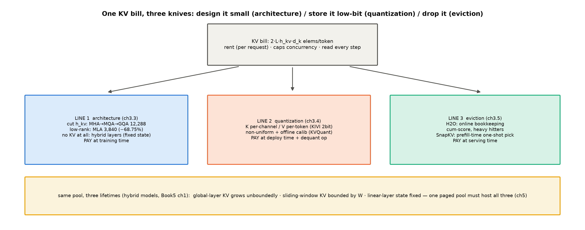
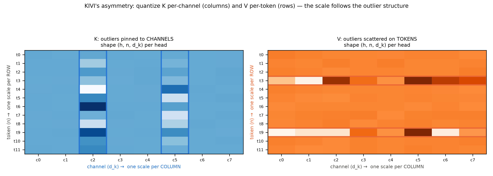
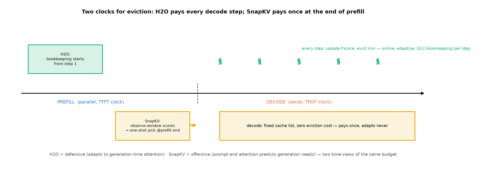

# 第 3 章 KV cache 压缩全景：三线合流

> **最小背景栏**：本章站在三册的账本上——GQA 的分组缓存（Book3 第 6 章，KV 元素账 $2Lh_{kv}d_k$）、MLA 的低秩压缩与吸收（Book4 第 6 章）、分类型 KV/状态账本（Book5 第 1 章：全局层无界/滑窗层有界/线性层固定状态）。量化只需「每通道缩放的量化-反量化」这一层直觉（格式细节 Book4 第 7 章已教）。三篇本章正菜论文（KIVI/H2O/SnapKV）的原文已逐篇核过（调研底单 papers/02）。

## 3.1 两册前立下的欠条

Book3 第 6 章第一次手算 KV 账时，章末欠账框里写着：「三股怎么拧、各值多少钱是 Book6 第 3/5 章的正题。」——三股者，架构、精度、淘汰也。这句欠条等了一整册混合架构，现在到期。

还有更老的一笔。Book1 第 2 章测打分矩阵膨胀时（0.320 ms → 18.172 ms 的那个实验），我们说系统侧的还法在推理册——$O(n^2)$ 的显存面就长在 KV 上：KV 随序列长线性增长，而读取它的注意力开销随长度平方增长。两笔账在此合流：**KV 是推理侧最大的显存开销，也是长上下文一切麻烦的物质基础**。

在展开三线之前，先把**零号线**立正——KV cache 本身就是一次压缩。没有它，每步 decode 要重算全部历史（Book1 第 7 章的 $\frac{T(T+1)}{2}$ 冗余）；有了它，历史只算一次、此后只读。第 1 章基线的 25 ms/token 正是「连零号线都没有」的生活，而 207M 一个 512 token 请求的全量重算开销约 0.21 TFLOP/步（即第 1 章实物 1.2 的 215 GFLOP 口径）——KV cache 把这笔账直接划掉。三线压缩的对象，是零号线之后**仍然在涨**的那本账。这个「先有缓存、再谈压缩」的次序，也解释了为什么三线论文全部诞生于 2023 年之后——KV cache 是 2019 年前后随 GPT-2/GPT-3 服务化才成为主要矛盾的。

本章路线图（与图 3.1 互指）：3.2 先把账本在服务台前重立（三个新性质）；3.3-3.5 三线各走一线——架构侧把 KV **设计小**（造模型时）、量化侧把 KV **存低**（部署时）、淘汰侧把 KV **扔掉**（服务时）；3.6 合流成一张决策树，并把「三线不连乘」的边界立碑。读的时候始终带着那行账式：$2Lh_{kv}d_k$ 个元素/token——三把刀各动其中不同的因子。



图 3.1 三线路线图（自绘示意级）：一份 KV 账单、三把刀各动哪一维；底部黄条=混合架构的三类生命周期同池面板（3.3 台阶三，第 5 章兑现）。

## 3.2 账本重立：服务侧视角下的 KV

第 2 章把 KV 记作「流水账」。换到服务台前，这本流水账有三个此前没显形的性质。**其一，它是租约不是资产**：权重买断（部署时一次付清），KV 按请求分期（每 token 付一次），请求走了账才销——引擎必须管理「分配-增长-回收」的全生命周期（第 5 章块管理的地界）。拿 207M 的 24 KiB/token 走一遍租约时间线：一条生成 512 token 的请求，租约从 0 涨到 12 MiB；若它中途被抢占（preemption——第 7 章的调度现实），租约是保留还是清退、清退后重来要重付多少 prefill——这些在「权重世界」里不存在的问题，全是 KV 租约带来的新活。**其二，它决定并发上限**：显存 = 权重 + 全部活跃请求的 KV 之和，KV 人均占用直接折算成「同时能伺候几条请求」——207M 的 24 KiB/token 看似不大，64 GB 显存刨掉权重后，1024 token 的请求也就两三千条封顶（第 2 章 2.3 节速算约 2,500 条）；换 MHA 的 GPT-2 则每请求再贵一半（18,432 对 12,288 元素/token）。**其三，它的读取语义决定 kernel 形态**：decode 每步的注意力要读「全部历史的 K/V」——KV 的字节数直接进 attention kernel 的访存账（第 8 章的地界）。压缩 KV，因此同时省三样：显存、并发容量、注意力访存。三线压缩的全部动机，就是这一段的三句话。

## 3.3 第一线·架构侧：把 KV 设计小

第一线的思路在架构期就把 KV 设计小——前五册恰好攒齐了它的三级台阶。

**台阶一：分组（MHA→MQA→GQA）**。先把 KV 张量的形状摆出来：$(h_{kv}, n, d_k)$——头维、序列维、头内维。MHA 反事实的 $h_{kv} = h = 16$（每头私藏，24,576 元素/token）；这条轴的极限是 **MQA**（multi-query，$h_{kv}{=}1$——全部头共享一份 KV，账砍到 1/16）；**GQA** 取中间档（分组查询，$h/2$、$h/4$……两两或四四共享）：207M 用的 $16{:}8$ 组把账降到 12,288。MQA 这个极限档先在此记名——3.4 节 Falcon 案例与 3.6 的递减边界都落在它身上（架构把 KV 压到头，量化线就难再做功）。代价：键值头少了，各查询头不再各有私钥——检索表达力换显存。

**台阶二：低秩（MLA）**。不存投影后的 K/V，存压缩向量，用时再上投影展开（权重可吸收进查询投影）——两刀机每 token 3,840 元素（对同形状 GQA 12,288 降 68.75%）。这是**Book4 第 9 章两刀机的现成账**：它的工程参数（总参 409M、激活 168.9M、KV 3,840 元素/token）就是本册账本矩阵的第三行——设计文档 `DESIGN-409M.md` 登记在案，算例身份直接引用（摘录见下）。选做侧还有一格台阶：Book5 的三刀机（MLA 之上再换线性层）把账压到 960 元素/token（B5-8 的选做算例，本表不入）。另一个衔接顺手立住：Book4 第 6 章讲过「KV 缓存的 6bit 精度工程」——那正是第二线的正菜在架构册投下的影子，3.4 节从量化侧正面进场。

**实物 3.2**（两刀机 MLA vs GQA 元素账——设计文档等宽块摘录，出处 `code/Book4-规模与效率/ch09/DESIGN-409M.md` §3/§10；看什么——一行读出 −68.75% 与口径）

```text
| KV/token | L(d_c+d_h^R)=12×320 | 3,840 元素（vs 退役 GQA 2Lh_kv·d_k=12,288，−68.75%；bf16 7.5 KiB/token） |
（数学记号按等宽块转写；原行 LaTeX：$L(d_c+d_h^R)=12\times320$、$2Lh_{kv}d_k$、**−68.75%**）
```

【证据等级：本书设计文档（Book4 定稿正身）】注意口径括号：−68.75% 是「同形状 GQA 对 MLA latent」；Book4 第 6 章的 −93.3% 是部署口径（DSV2「MLA+6bit、60 层」对 67B「bf16 GQA、95 层」的复合）——两个数都对，比的 thing 不同。
Book4 第 6 章那个「−93.3%」是部署口径（DSV2「MLA+6bit、60 层」对 DeepSeek 67B「bf16 GQA、95 层」的复合比，含层数差与缓存精度；同构 MHA 反事实的架构口径是 −98.24%）——引用时各归各口径，这是跨册口径纪律。

**台阶三：换状态（混合层）**。线性注意力层干脆不存 KV——Book5 第 1 章立的分类型账本给了三类生命周期的全景：全局层 KV 无界增长、滑窗层有界（窗宽 $W$ 封顶 $\min(n, W)$）、线性层固定状态（与序列长无关）。**同一台混合架构机器上，三类生命周期同池共处**——这个「同池两类命」的服务侧语义（滑窗层要滚动淘汰、全局层要全保、线性层状态要在解码步间原地更新）是 Book5 第 2 章埋给本册的正账，它的引擎侧展开在第 5 章（块管理怎么处理「有的块到期、有的块永驻」）；而统一分页池的终局设计，唯一归属 Book8 第 1 章——本册只把「引擎必须回答这个问题」立起来，不展开实现。架构侧三级的共同点：**都在改模型**——这与后两线（模型不动、改缓存本身）划清了界。

## 3.4 第二线·量化侧：KIVI 的非对称 2bit

第二线不动架构，把已存的 KV 从 fp16/bf16 压到低比特。正菜是 KIVI（ICML 2024，arXiv:2402.02750）——它教的第一课是观察：**K 和 V 的数值分布长得不一样**。K 的少数通道（channel，即 $d_k$ 维上的固定坐标）在所有 token 上都是离群大值（离群通道，outlier channel）、且位置稳定；V 没有这种通道结构，离群散在各 token 上。这一观察直接推出**非对称方案**：K 按通道量化（每通道一个缩放，离群通道各自兜住）、V 按 token 量化（每 token 一个缩放）。

**例 3.1（构造例：4 通道 K 的两种量化方向手算）**：设 3 个 token、4 个通道的 K 值如下（通道 3 是离群通道——每 token 都在 ±60 量级，其余通道 ±1 量级）：

| | c0 | c1 | c2 | c3 |
|---|---|---|---|---|
| t0 | +0.8 | −0.6 | +0.9 | **+58** |
| t1 | −0.7 | +0.5 | −0.8 | **−61** |
| t2 | +0.6 | −0.9 | +0.7 | **+59** |

**per-token 量化**（每行一个缩放，4 档对称网格、step=max/2）：t0 行的缩放被 58 拉大（step=58/2=29）——c0 的 0.8 量化后是 0（0.8÷29 不足半档）、c2 的 0.9 也是 0：**正常通道全被抹平，只剩离群通道自己活着**。**per-channel 量化**（每列一个缩放）：c3 列用大缩放（step≈30）、c0-c2 各用小缩放（step≈0.5）——0.8 量化成 1.0（四舍五入到最近的 0.5 档）、误差 0.2；各通道保全。论文的实测误差背书（Table 2 口径）：K 侧 per-token 的注意力分数相对误差 47.00%，per-channel 仅 9.60%。**V 的情形相反**（无离群通道、某 token 整行偏大）：per-token 行缩放恰好兜住偏大行、其他行不受牵连；per-channel 反而让一个偏大 token 污染所在通道的全部 token（实测 V 侧 per-token 3.55% 对 per-channel 49.89%）。**方向的选取跟着离群结构走——KIVI 的全部巧思就在这一对「顺毛捋」。**

这一对「顺毛捋」画成图（图 3.2）：离群长在哪、缩放就分到哪。KIVI 论文的配置矩阵把这件事量化成了铁证（Table 1，CoQA 任务）：2bit 下唯一可用的组合是 (K 按通道, V 按 token)=63.53 分（16bit 基线 66.37）；**V 的方向不可选错**——V 按通道的两种组合直接崩到 2.88/2.80（随机水平）；只把 K 反过来（按 token）掉到 52.93——重伤未崩。原文摘录见实物 3.1。

**实物 3.1（KIVI 配置矩阵摘录，Table 1 CoQA 列）**

```text
                V per-token   V per-channel
K per-channel      63.53           2.88
K per-token        52.93           2.80        （16bit 基线 66.37；模拟量化 fake quant——逐组 round-to-nearest，G=32）
```

读法导引：对角线外的两个格子（2.88/2.80）是「方向选错」的下场——不是掉几个点，是直接崩到随机水平。一张 2×2 表讲完「观察→方向→后果」的完整故事——读法的钥匙在不对称性：V 错是灾难、K 错是重伤，因为离群通道长在 K 上、而 V 的行结构只有 per-token 抓得住——这是本章选它当实物的理由。



图 3.2 KIVI 的非对称分组（自绘示意级，据 2402.02750 Fig 1/2 语义）：K 的离群钉在通道列上（蓝框）→按列分组每列一 scale；V 的离群散在 token 行上（橙框）→按行分组每行一 scale；每头一张 $(h,n,d_k)$。为什么 K 会离群、而且钉在固定通道上？论文的口径要忠实转述：它只给了**观察**（离群通道固定、跨 token 持续）并引 activation outlier 文献（Dettmers et al. 2022、Lin et al. 2023）作旁证——**机制假说论文没有下结论**。本书给你一个自己的抓手（明确标注为本书视角）：回想 Book3 第 4 章的 RoPE——位置编码乘在 K 的头维前若干维上，这些建制化通道天然带结构性大值；「K 的离群与位置信息相关」的直觉有了一手工程旁证：KVQuant 的 **Pre-RoPE Key Quantization**（在 RoPE 作用**前**量化 K、以避开旋转混合对通道幅度一致性的破坏——摘要原文 "(ii) Pre-RoPE Key Quantization, where we quantize Key activations before the rotary positional embedding"）正是把这一直觉用作工程设计【证据等级：官方论文 2401.18079 摘要，直引】——机制级解释仍未钉死，如实记为开放问题。

工程细节两件，各有一手证据群。**分组大小 $G{=}32$**：Table 5 消融（Llama-2-13B、GSM8K 精度口径——注意不是 PPL）：G=32/64/128 → 20.77/21.00/**17.29**——128 档显著劣化，32 是「组内离群还没混进来」的甜点。**全精度残差窗 $R{=}128$**（最近 128 个 token 保 fp16 不压）：它不止是保险，是救命——GSM8K 这类难生成任务上，模拟 2bit 直接崩到 5.76（16bit 基线 13.50），带上残差窗的 KIVI-2 拉回 12.74（距基线仅 −0.76——三数出自 Table 3 的 Llama-2-7B 行）；论文原话说 fake 2bit 在 hard generation tasks 上 "significantly worse"【证据等级：官方论文 Table 5/§4.2.1，直引】。收益（A100、Llama-2-7B 口径，官方论文）：峰值显存降 2.6×（含模型权重的峰值口径）、可并发 batch 至多 4×、吞吐 2.35-3.47×。

还有一个量化方法学的正身问题值得立住：KIVI 用的是**模拟量化**（fake quant——round-to-nearest，逐组缩放，无任何优化搜索）。为什么不用 GPTQ 那类优化法？论文直引："KV cache functions as a streaming data structure, where the new tensor arrives sequentially. Thus, optimization-based methods like GPTQ … are unsuitable for quantizing KV cache"——**KV 是流式结构**（token 一个个到、没有「先看全量再压」的离线时刻），GPTQ 类需要离线全量的二阶信息用不上，只能在线 RTN due to the overhead"【证据等级：官方论文 §3.1，直引（含因果限定）】——这与权重量化（部署时全量在手的离线世界）是方法学上的分水岭，第 11 章 GPTQ 的全部工程正是反过来吃「离线全量」这碗饭。

量化线的谱系不止 KIVI 一家（表 3.2a）：

**表 3.2a 量化线谱系（时机=在线/离线是第一分水岭）**

| 方法 | ID/发表 | 时机 | 机制一句话 | 代表数字 |
|---|---|---|---|---|
| KIVI | 2402.02750, ICML'24 | 在线免调优 | K-C/V-T 非对称 2bit+残差窗 | 显存 2.6×、吞吐 2.35-3.47× |
| KVQuant | 2401.18079, NeurIPS'24 | 离线标定 | 逐层灵敏度加权**非均匀**格式+Fisher+离群 dense-sparse 分储 | 3bit PPL 退化 <0.1；7B 单卡 1M 上下文 |
| GEAR | 2403.05527, ICML'24 | 在线无标定 | 量化+低秩补误差+稀疏补离群三件套 | 近无损 2bit：峰值显存 −2.39×、吞吐 2.1-5.07×（PDF v4 直读口径） |
| SKVQ | 2405.06219, COLM'24 | 在线 | 滑窗分组+离群 fp16 分离 | 2bit K/1.5bit V |
| QAQ | 2403.04643 | 在线 | K/V 敏感度自适应异 bit | 检索级 |
| KVTuner | ICML'25 | 离线 | 层间敏感度混合精度 | 检索级 |

【表内前四行官方论文级；QAQ/KVTuner 检索级（abs 页/ACM DL 三查，数字未逐页核）】第二代的看点一行总结：KVQuant 与 KIVI 的分野就是「离线能买到什么」——非均匀码本与逐层灵敏度都要预标定（Fisher 计算与 k-means 均分钟级/层），换来均匀量化做不到的 3bit 近无损（fp16 的约 1/5 位宽）与百万级上下文；GEAR 则证明在线路线也能用「低秩+稀疏」补误差逼近近无损。注意它与淘汰线暗同构：KIVI（全层统一 2bit）对 KVQuant（逐层灵敏度）之争，正是下文淘汰线「统一预算对逐层预算」之争的量化版。

还有一个反直觉的注脚值得先记下：**三线不是连乘关系**。KIVI 论文自己的 Falcon-7B 实验（§4.2.2）——Falcon 是 MQA 架构（$h_{kv}{=}1$，架构侧已压到极限），论文原话："Since Falcon-7B adopts multi-query attention and only has one head for KV cache, it is already highly compressed compared to Llama-based models."【官方论文，直引】。量化代价逐任务细看（16bit→KIVI-4→KIVI-2）：CoQA 59.83→59.67→57.48（2bit 掉 2.35）；GSM8K 4.55→4.47→3.41（相对 −25%，最疼）；LongBench 8.71→8.78→7.95；**TruthfulQA 23.20→22.58→24.98 反而上升**——「逐任务大掉」并不成立，掉点集中在需要精确数值检索的任务上，如实分开记【证据等级：官方论文 Table 3/4（Table 3=LM-Eval 主表、Table 4=LongBench）】。结论仍是：MQA 之上 2bit 伤得重、升 4bit 基本保住——**架构侧压过的 KV 再量化更伤**，第一线走得越远第二线空间越小（机制因果链 3.6 展开）。选型时三线要当一盘棋下，这是 3.6 节决策树的第一根枝。

## 3.5 第三线·淘汰侧：H2O 与 SnapKV

第三线最激进：KV 可以**扔**。依据是注意力分布的极度不均——H2O 论文把现象层量化成三笔：**注意力打分稀疏度超过 95%**（长上下文里绝大部分位置的权重可忽略）、累计注意力分数呈**幂律分布**（少数位置拿走大头）、且「累计分高的位置在后续步仍高」（**局部分数预示未来分数**——这条是在线记账可行的关键，因为它让「拿历史功劳簿预测未来贡献」成立）。这一线全部工艺在于：**扔谁、留谁、什么时候决定**（图 3.3 的两条时间线）。

**H2O**（NeurIPS 2023，arXiv:2306.14048）的答案：在线维护「Heavy Hitter」（重击者）集合——H2O 全称 Heavy-Hitter Oracle。预算固定为 $k$ 条：每步算完注意力，把**累计注意力分数**当作 token 的重要性记账（Fscore：该 token 历来被所有查询位置加过的分之和），集合满员后每步踢掉累计分最低者：$$S_i \leftarrow (S_{i-1} \cup \{i\}) \setminus \{u\}, \quad u = \arg\min_{v \in S_{i-1} \cup \{i\}} \mathrm{Fscore}(v) \tag{3.1}$$（用人话说：新人进门，把历史功劳簿上最没贡献的老人请出去。）

| 符号 | 含义 | 量纲/形状 |
|---|---|---|
| $S_i$ | 第 $i$ 步解码后的缓存位置集合 | 集合，$\lvert S_i\rvert=k$ |
| $u$ | 本步被淘汰的位置 | 标量 |
| $\mathrm{Fscore}(v)$ | 位置 $v$ 的累计注意力分数 | 分数和（随步累加） |
| $k$ | 缓存预算 | token 数 |预算分配上 H2O 对半劈：一半给 Heavy Hitter、一半给最近的 token——**既要老人（长期依赖）也要新人（局部上下文）**。它的证据群有三层。**现象层**：见上三笔数字。**对照层**（OPT-30B，Table 2）：20% 预算下，纯「只留最近」（strided/local 式）COPA 从 85.00 崩到 48.00，经典稀疏注意力的 strided/fixed 两个变体同样崩——**不是「稀疏」就行，是 H2O 的「功劳簿」选择才行**；加回 H2O 成分恢复 84.00。**消融层**（Q4）：只留 Heavy Hitter 或只留局部，各任务掉 2.85%-22.75%——**只留局部或只留重要都不行，两者都要**。另有一笔理论结果用一句话立住分量与边界：注意力分数满足次模性（submodularity）的假设下，贪心 Heavy Hitter 对最优缓存选择有 $(1-\alpha)(1-1/e)$ 因子（另带加性误差项）的近似保证（论文 Theorem 4.4 的非正式转述）——注意这是「缓存选择」的最优性保证而非精度保证，且次模假设在真实模型上只是近似成立：**理论给工程直觉壮胆，但不背书**。

H2O 还有两个值得记的延伸。其一，与流式长输入的缝合：借 attention sink（保留开头几个 token——Book5 第 2 章你见过它的架构侧身份）加位置滚动，H2O 能处理**四百万 token 的流式输入**，且同预算下困惑度优于 StreamLLM（StreamingLLM 的 PPL 对照，Fig 5，定性结论）【证据等级：官方论文 §5.3 Q1】——sink 现象从架构册的观察变成了缓存策略的零件。其二，吞吐面它报过 29×——这个数要带口径读：对照基线是非批式、重卸载的实现（算法收益+系统收益+batch 放大的合成），**读任何「加速 N 倍」先问基线是什么**——这条纪律第 1 章立过，此处是它第一次在论文数字上实战。

**例 3.2（构造例：5 token 的 H2O 两步走查）**：预算 $k{=}3$，前 3 步照单全收（$S=\{1,2,3\}$，累计分设为 5/1/4）。**第 4 步**：token 4 进门（分 6），候选分数表 $\{1{:}5,\ 2{:}1,\ 3{:}4,\ 4{:}6\}$——超员，踢分最低的 token 2，$S=\{1,3,4\}$。**第 5 步**：token 5 进门（分 3），候选 $\{1{:}5,\ 3{:}4,\ 4{:}6,\ 5{:}3\}$——按纯贪心该踢分最低的 token 5 自己（新人进门即出门，$S$ 不变）；H2O 的实际实现把预算对半分给「Heavy Hitter + 最近 token」，最近的 token 5 受这半边预算保护，于是从老人里踢分最低的 token 3，$S=\{1,4,5\}$。两种口径都写给你看，是想让你看见这个机制的脾气：**功劳簿不认资历也不认新旧——贪心只看分数，是「对半预算」在保最近的历史**。

**SnapKV**（NeurIPS 2024，arXiv:2404.14469）换了个问法：**prefill 结束时就决定**。观察：prompt 末尾一小段「观察窗」对 prompt 前文的注意力分布，**预告了生成期真正会用到的位置**（「模型在开始生成前就知道你要什么」——这是它论文标题「LLM Knows What You are Looking for Before Generation」的直译，也是它全部立足点）。于是做法四步：①取观察窗的打分矩阵 $(w, n)$（$w$ 行查询 × $n$ 列位置）；②**沿查询维投票求和**——把 $w$ 行加成每位置一分 $(n,)$（窗内每个查询给各位置投票）；③**沿位置维做一维最大池化**（max pooling，窗口几格）——把相邻的高分位置连成簇（裸 top-$k$ 只会捡到孤立的碎片，池化保的是「簇头连同邻域」）；④按池化分选 top-$k$ 位置，并与观察窗本身拼接——只这些位置的 KV 进 decode 缓存，其余全弃。这套选择是**每个头各自做**的（不同头关注的位置不同），实现细节各家有别（如何对齐各头的选择结果）。另外它的选择发生在 prefill 末尾、一次付清，decode 期间不再有淘汰成本——**用一次选择换全程零记账**，与 H2O 的「全程记账换在线适应」是两种时间观上的取舍。

**例 3.3（构造例：SnapKV 的四步走查）**：12 token 的 prompt（位置 0-11），观察窗取末 4 个位置（8-11），预算保留 5 个位置（预算只作用于 prompt 侧的选位，观察窗本身恒保全——所以最终缓存=选中位∪观察窗）。**①打分**：观察窗 4 个查询对全部 12 个位置各有一列注意力分（每头一张 (4,12) 矩阵，数值随意设定——注意力越集中越好看：查询 9、10 对位置 2、3 打了高分、查询 11 对位置 2 也高）。**②投票**：沿查询维求和——位置 2 得 3 票高分、位置 3 得 2 票、位置 9 得 1 票、其余零星——压成 (12,) 的分数向量。**③池化**：以窗口 3 做一维最大池化——位置 2、3 连成的高分簇被保住并外扩到位置 1-4 的邻域；孤立的分数 9 若真高也会带动 8-10。**④选位**：按池化分取 top-5，设为位置 1-4 加 8，再并上观察窗 8-11——最终缓存位置 {1,2,3,4,8,9,10,11}，位置 0、5、6、7 的 KV 全弃。换一个问句（不同的观察窗打分），选出的位置集不同——论文 Fig 4 把这件事画成了实证（同一文档换指令，选位分布显著变）——**这就是「模型在生成前就知道你要什么」的可操作形态：你的问题决定你带走哪些记忆**。

淘汰线的谱系一张表收拢（表 3.2b）：

**表 3.2b 淘汰线谱系（时机与预算口径是第一分水岭）**

| 方法 | 发表 | 时机 | 预算口径 | 代表数字 |
|---|---|---|---|---|
| H2O | NeurIPS'23 | decode 逐步 | 全局 k 对半（HH+recent） | 20% 预算保精度 |
| Scissorhands | NeurIPS'23 | decode 逐步 | 固定 buffer 满员触发；历史窗 w=400 聚合影响力、recent r=10 恒保 | 显存 5×（叠 4bit 权重 20×） |
| StreamingLLM | ICLR'24 | 滑窗+sink | sink+窗 W | 流式 4M+、对重算基线 22.2× |
| SnapKV | NeurIPS'24 | prefill 末一次 | 逐头 top-k（prompt 侧） | 3.6×/8.2×/380K |
| PyramidKV | 2024 | prefill 末一次 | **逐层异额**（金字塔） | 12% KV 对平 FullKV |
| PyramidInfer | ACL'24 | prefill 进行中逐层级联（层层算层层省——唯一省计算档） | 逐层异额 | 吞吐 2.2×（对 HF Accelerate 基线）、显存 >54% |
| DMC（Dynamic Memory Compression） | ICML'24 | 学习式（需继续预训练——与免训练淘汰的界线） | 端到端训练门 | 检索级 |

【表内数字各论文官方级，DMC 检索级】

> **【考据框】逐层预算的两派之争（不裁决）**。淘汰线暗藏一条「预算逐层化」的暗线，且两派证据直接冲突：Scissorhands 的经验法则是**后层多留**（依据：persistence ratio 随层降低——深层的重要性信号更弱、更易失稳，故按经验法则多给预算补偿）；PyramidKV/PyramidInfer 一致主张**浅层多留、深层少留**（依据：信息漏斗——关键 KV 随层数递减）。两派各有原文、各有实验【证据等级：均为官方论文】，本书如实并列不裁决——量化的同构之争（KIVI 全层统一 2bit 对 KVQuant 逐层灵敏度）提示这可能不是对错问题，而是「任务分布决定哪派占优」的开放问题。

与 H2O 的对照因此清晰（图 3.3）：**H2O 是 decode 期在线淘汰（边走边扔，防御性），SnapKV 是 prefill 期一次性选择（开局定名单，进攻性）**——两者位置不同、成本不同（H2O 每步都要记账，SnapKV 只付一次选择成本）、适合的负载也不同；两家还有一个实质分歧藏在「扔哪段」：H2O 的记账只在 decode 侧起作用（prefill KV 它不挑选、按预算全局管理），SnapKV 批评的正是这一点——**真实负载的 KV 大头在 prompt**，prefill 期不选、等于没选主战场。



图 3.3 淘汰时机的两条时间线（自绘示意级）：H2O 全程逐步记账（每步更新 Fscore+踢最低）；SnapKV 在 prefill 末尾一次付清（观察窗投票→定名单），decode 期零淘汰成本。

SnapKV 的效果实证：**生成加速 3.6×**（16K 输入下 >100 ms/token 压到 <40）、**内存效率 8.2×**（基线 16K 即 OOM 的卡跑到 131K 上下文）、**380K token 压力测试**通过（KV 预算 1024）；精度面 LongBench 系任务近无损、与 H2O 同台对比：SnapKV@1024 对 H2O@4096（论文为公平给 H2O 四倍容量）仍于 11/16 数据集胜出（Mistral 行）【证据等级：官方论文 §5】。池化那一步（③）有机制与实证两层故事。机制层是论文的假想反例（§4.3）：裸 top-k 容易选中「电话号码的国家码」这类高频碎片、真正的号码串被扔——因为 induction heads 的复制机制需要**上下文完整性**，孤点选位会切断它；实证层是 §5.2 的消融（LongEval-Lines 键值对检索，Mistral-7B-Instruct）：无池化显著劣化、带池化 16K 输入前保持正确，而 max/average 两种池化无显著差异——**池化保的是「簇头连同邻域」，不是选分最高的孤点**。

## 3.6 三线合流：一张决策树与收益的边界

三线摆完，合到一张决策树上。**第一线（架构）**：换模型时才可用——从 GQA 到 MLA 到混合层，三级台阶各自把 KV 账压一个量级，但都是「造模型的人」的决策（前五册的功课）；**第二线（量化）**：部署期可用、模型不动——KIVI 式 2bit 非对称是代表，省显存 2.6×（7B 口径）；**第三线（淘汰）**：服务期可用、模型与权重都不动——H2O 用 20% 预算、SnapKV 用千级固定容量档保住多数任务精度。

三线的**成本账**也值得并排一列——省显存不是免费的，各家付账的地点不同：架构侧在**训练期**付（换模型重训）、推理侧零改动；量化侧在**部署期**付一次标定、外加每步反量化算子开销；淘汰侧在**服务期**持续付（H2O 每步记账、SnapKV 付一次选择）并承担精度风险。三线的选择因此不只是「压多小」，还是「你愿意在哪个阶段付钱」。

把三线合起来看，选型其实是三问三答。**问一：你能换模型吗？**能——架构侧三级台阶摆在造模型的人面前（这是前五册的功课，收益最大、改动最深）；不能——只剩两线。**问二：你的负载怕什么错？**怕长程检索精度——量化侧保守（4bit 或带残差窗的 2bit）；怕召回类任务——淘汰侧保守（预算放宽或只在 prefill 期选择）。**问三：你在哪个阶段付得起钱？**训练期、部署期、服务期各对应一线（成本账见上文）。三问过完，三线的组合基本被约束住——这就是 3.6 节承诺的那张决策树，它长在读者脑子里，比画在纸上耐用。

**交叉算例**把「显存连乘、精度不连乘」一次算清（表 3.3——验收点「能算 MLA+2bit 交叉账」的载体；MHA/GQA/MQA 三行由账式 $2Lh_{kv}d_k\times$ 每元素字节推出、MLA 行由 $L(d_c{+}d_h^R)\times$ 每元素字节推出——K/V 共享 latent、无式首的 2）：

**表 3.3 三线交叉账：架构档位 × 缓存精度（每 token KV 字节；括号=对 fp16 MHA 基线的总压缩）**

| 档位 | fp16 (2B/元素) | 2bit (0.25B/元素) | 精度面（2bit 叠加） |
|---|---|---|---|
| MHA 24,576 元素 | 48 KiB | 6 KiB（8×） | 基线档：多数量化论文的默认起点，稳 |
| GQA 12,288 | 24 KiB | 3 KiB（16×） | 常见且稳（KVQuant/GEAR 都在 GQA 模型上近无损） |
| MLA 3,840 | 7.5 KiB（6.4×） | 0.94 KiB（51×） | 论文级直接证据缺——见下段 |
| MQA 1,536 | 3 KiB（16×） | 0.375 KiB（128×） | **KIVI Falcon：2bit 伤、4bit 保**（3.4 节） |

几何注记：MHA/GQA/MQA 行为 207M 同构反事实（$L{=}12$、$d_k{=}64$、$h_{kv}{=}16/8/1$），MLA 行为两刀机实配；MQA 行精度列借 Falcon-7B 的证据只取其 MQA 身份（$h_{kv}{=}1$——Falcon 是 $L{=}32$，元素账 4,096/token，非同几何）。读法两笔：**显存面连乘**（架构压缩 ×8 与量化压缩 ×8 直接相乘，MQA+2bit 对 MHA+fp16 是 128×——这就是「三线合用」的容量想象空间）；**精度面不连乘**（越往下越脆，且脆得有结构）。递减的**机制因果链**按证据强度分层写：**实证层**只有 KIVI 的 Falcon 段（MQA 单 KV 头之上 2bit 掉点集中、升 4bit 保住）；**本书视角的解释层**（标明非论文原话）：架构压缩是把 KV 里的**冗余**先抽走——GQA 抽的是头间冗余、MLA 抽的是通道冗余；冗余少的表征「每个比特都在干活」，量化的舍入误差无处可藏。**证据现状如实报**：对「MLA/GQA 已压缩 KV 再量化更脆弱」，KVQuant 与 GEAR 全文并无直接表述（KVQuant 唯一的 GQA 字样是「KIVI 代码当时不支持 GQA 故不比较」的工程旁注）；反例 nuance 也要记——KVQuant 3-bit 在 Mistral/LLaMA-3（GQA，$h_{kv}{=}8$ 档）上 PPL 退化 <0.1、GEAR 2bit 也评测 GQA 模型——**GQA 档（中等压缩）的脆弱性证据弱，MQA 极端档证据强，MLA 档论文级直接表述尚未找到**；工程旁证两条见本章实现对照框（vllm-ascend 对 MiniMax-M3 的 GQA 层在 fp8 KV 路径保 bf16；vLLM 文档明言滑窗层对 KV 量化更敏感、提供逐层跳过旗标）【证据等级：论文级负结果+工程旁证，如实分层】。

四个边界必须如实立碑。**其一，收益不连乘**（表 3.3 的精度列+3.4 节 Falcon 教训）。**其二，三线的精度风险落在不同任务上**：量化伤长程检索精度（KIVI 靠残差窗缓解）、淘汰伤低频回忆（「大海捞针」里被扔掉的那根针——H2O 论文用 5× 内存压缩的口径报多数任务不掉分，但社区复测对召回类任务的脆弱性有共识，证据等级：第三方复测）。**其三，正交可组合**（防从「不连乘」滑向「不能组合」的反向误读）：H2O 的 Table 6 实测「量化+淘汰」组合（OPT-30B，COPA：全精度 85.00 / H2O 84.00 / 4bit 量化 84.00 / H2O+4bit 84.00——组合几乎不丢）；KIVI 论文也自证与淘汰线正交（直引："This line of work is orthogonal to ours, as they can also be combined together"）——**维度正交故组合有价值，同维度冗余被预消耗故边际递减**，两面合起来才是完整的边界。**其四，三线与第 5 章的分页管理正交**：块管理不关心块里装的是 fp16 还是 2bit、是要全保还是要滚动淘汰——但「同池两类命」的生命周期管理（滑窗块的滚动淘汰）是分页系统必须回应的新需求（Book5 第 2 章埋给本册的正账，第 5 章兑现）。

> **【实现对照框】KV 量化的引擎落地面（源码一手，黑白盒口径）**。vLLM（v0.30.0 阅读锚）的 `kv_cache_dtype` 全表 18 档【本机源码，`vllm/config/cache.py#L40-L115`】：fp8 双 scheme（per-tensor/per-head，后者仅 FlashAttention 后端+标定）、int8 系（int8_per_token_head 等，走 Triton 后端）、turboquant 码本（codebook）式 3/4bit（k8v4/k3v4）、MLA 专属 fp8_ds_mla/nvfp4_ds_mla；另有 `--kv-cache-dtype-skip-layers` 逐层跳过——文档明言滑窗层对 KV 量化更敏感（递减边界的工程回应）。vllm-ascend（运行栈 0.27.1rc1）的 int8 KV 不走 `kv_cache_dtype`，而由 ModelSlim C8 检查点逐层激活【本机源码，`modelslim_config.py#L804-L808`】——int8 入缓存与算子内反量化的机制细节是 Book7 第 9 章的地界，此处点到参数级；一条精度差顺手校正：`npu_quant_fusion_attention` 算子在 torch_npu 面上存在，但 vllm-ascend 0.27.1rc1 全仓零引用，实际消费的是 npu_fused_infer_attention_score（含 _v2 变体）的 antiquant 通道（源码阅读口径）。淘汰线在主流引擎的落地则是**社区事实级**（2026-10 检索时点）：vLLM/SGLang 核心均未内置 H2O/SnapKV 类 token 级淘汰（原生逐出仅块级 LRU），生态载体是 NVIDIA kvpress 库与论文系的 SGLang 移植（R-KV 等）——「论文先行、引擎观望」本身就是一个值得记的工程现状。

表 3.4 三线速览（小结的数字底座；压缩比均注口径）

| 线 | 代表 | 压缩比量级 | 精度代价 | 付账时机 |
|---|---|---|---|---|
| 架构 | GQA→MLA→混合 | 3.2×/4×/∞（对上一档台阶；对 GQA 基线累计 12.8×） | 训练期定 | 训练期 |
| 量化 | KIVI 2bit / KVQuant 3bit | 8×/5.3×（均对 fp16） | 数值检索类任务（残差窗救） | 部署期+每步反量化 |
| 淘汰 | H2O/SnapKV/PyramidKV | 5-20×（预算 5-20%） | 低频回忆（大海捞针） | 服务期 |

## 3.7 本章小结

三线的价，表 3.4 一张收拢。回到开篇的两笔欠账。Book3 问「三股怎么拧、各值多少钱」：架构侧三级台阶（12,288 → 3,840 → 固定状态，第 2 章矩阵的三行台阶）、量化侧 2bit 非对称（省 2.6×）、淘汰侧 20% 预算保精度——三股的「价」都有了着落，且三股不连乘、边界各立（Falcon 教训与召回脆弱性如实入账）。Book1 问的 $O(n^2)$ 显存面：KV 三线压缩是它的第一层还法，第二层还法（注意力 kernel 不再铺开打分矩阵）在第 8 章。F4 的读取语义、B3-1 的三股省法、N7 的上下文账半句——这几册的账目在此合销。

还有一个工程读者关心的实际问题在此顺带回答：三线能叠吗？能，但按 3.4 节 Falcon 教训——叠前先查第一线走到了哪级台阶：GQA 之上叠 2bit 常见且稳（多数论文默认配置）；MLA 之上叠要谨慎（本书视角+工程旁证；论文级直接表述尚未找到，见 3.6）；混合层之上淘汰线要避开线性层（人家的状态本来就固定，淘汰无从谈起）、滑窗层自带「天然淘汰」（窗口滑出即弃）——H2O 式主动淘汰主要服务全局层。三线组合的棋盘，读者可以拿本章的账本自己摆。

带走的心智：**KV 账本的三线压缩，本质是三个不同的人生阶段各答一次「怎么把缓存变小」——造模型时选小（架构）、部署时压低（量化）、服务时扔掉（淘汰）；三线不连乘、且每线都在换一种精度风险**。下一章开始造引擎：先从最原始的形态下手——把多条请求拼成一批，看「没有批处理」的最后一笔浪费怎么消。

> **【欠账】** 三线拧完，KV 还能整个搬走——卸载到主机内存与分层缓存（tiering）是系统层的第四种省法，本册只立概念 → Book8 第 9 章

## 动手验证

- 三篇正菜论文 PDF 与逐篇精读笔记：`research/Book6-推理系统导论/papers/02-KV压缩三线核原文.md`（KIVI 2402.02750 / H2O 2306.14048 / SnapKV 2404.14469——引用数字出处逐条在档）
- 账本矩阵（三机型 KV 台阶）：`python code/ch02/arithmetic.py::machine_rows`（表 2.3 的机器可读版）
- 两刀机 MLA 算例正身：`code/Book4-规模与效率/ch09/DESIGN-409M.md` §3/§10（3,840 元素/token 的出处）
