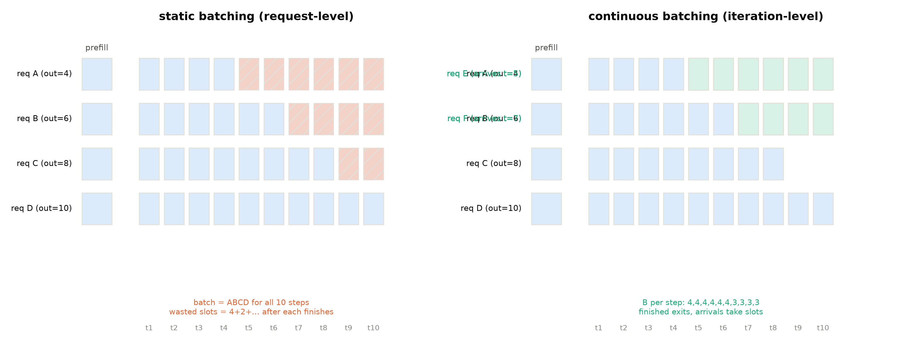
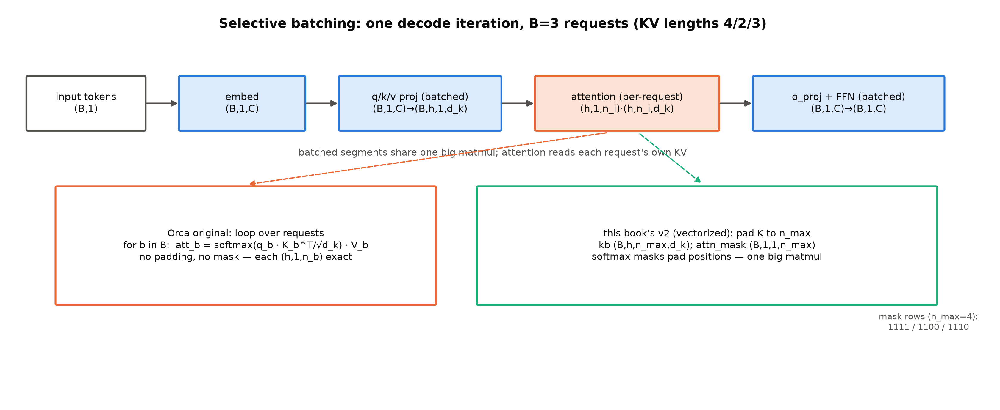
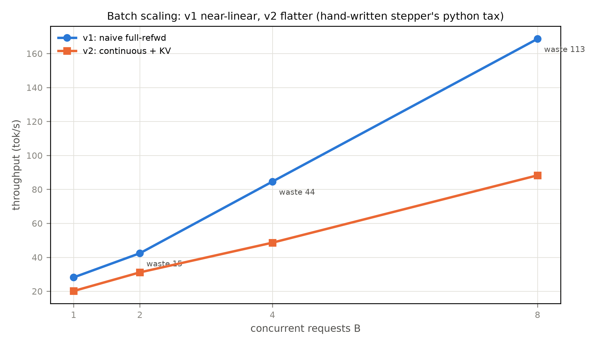

# 第 4 章 静态批处理之弊与连续批处理（大项目 v1→v2）

## 4.1 开始造引擎：第一版引擎的唯一使命

账立完了——第 1 章把一条请求拆成两阶段画像、第 2 章立了 FLOPs/带宽/KV 三本手算账、第 3 章把 KV 压缩的三条线走了一遍。现在开始还账，而第一笔的欠条其实两册前就写好了。Book2 第 10 章在大项目收尾时把「故意留笨」写成了明文口径：

> 「本章与全书的生成实现一律按**全量重算**口径（每生成一个 token 重跑整段前向，本册边界内『故意留笨』的一处）——省下的工程（KV 缓存的账本）自 Book3 第 6 章开立、Book6 第 3/6 章展开，本册只登记不实现（第 11 章 11.3 节按此口径引用）。」
> 【Book2 ch10 明文口径，经 Book3 第 6 章转引逐字核对】

Book3 第 6 章开立了 KV 的账本、顺手把这套笨办法传了下来；Book2 收束时又补了半句地址——「预填充与解码的两阶段拆分、以及『先猜后验』类解码加速，是 Book6 的正题……那是推理册的开场白」【Book2 ch12 卷末，直引】。今天开场白念完，轮到我们把训练时代欠下的服务侧工程一行行写出来。

但第一版引擎（v1）不是来解决任何问题的——**它的唯一使命是当反面教材**：把「没有引擎」的三宗罪原样代码化，让每一宗都变成可测量的数字。三宗罪：**静态批**（static batching，一批算到全批完成为止，先完成的请求空转陪跑）；**无 KV cache**（每步全量重算，$O(n^2)$ 的账原样保留）；**逐批串行**（批间无重叠）。v1 的每一行代码都在为 v2 的偿还做对照基线——这也是本章的写法：先让病灶现形，再动刀。

workload 的设计是教学引擎与玩具 demo 的分界，值得先交代：负载从真实语料（sp-32k tokens 流）切出，8 条请求、prompt 各 128 token **等长**——把 prefill 的拼批干扰摘干净，教学焦点集中在 decode 期的浪费上——输出长度 16 到 64 token **不齐**（制造静态批的经典困境）。测量口径与第 1-2 章一致：wall-clock、有效 token 数（扣除空转）、显存峰值；种子固定 20261002——浪费位/步数/有效 token 等确定性读数逐位可复现，wall 与吞吐类读数有运行间方差（同配置两跑可差 ~20%，后文并引两档时再注）。

本章要回答两个问题：**静态批到底浪费多少、浪费的结构长什么样？**（4.2）**把调度粒度从「批」降到「步」，机制上要付什么、又能拿回什么？**（4.3-4.6）产出四样：一笔可手算的时隙账公式、v1/v2 两台引擎（同一骨架的增量重构——文件头注明版本契约）、一组「机制红利与工程红利」的对照读数、以及 2022 年那篇论文的完整机制课。

> **最小背景栏**：本章只需要第 1-2 章的账本（两阶段画像、launch 开销、带宽下限）与第 3 章的 KV 账本概念（$2Lh_{kv}d_k$ 元素/token）。GQA 的投影形状（Book3 第 6 章）会在手写执行层复现——权重键位 `q/k/v/o_proj` 你已认识。排队论不需要——这里明确一句：本章的账全是算术，用不到排队论。

## 4.2 静态批处理的时隙账

静态批的做法朴素到不需要解释：把 8 条请求拼成一个批张量，prefill 一次算完，然后逐步 decode——直到**最后一条**请求完成（Anyscale 的博客给这个传统起了正式名字并下了定义句："static batching, because the size of the batch remains constant until the inference is complete"——批的大小保持恒定直到推理完成【证据等级：官方技术博客，Anyscale 2023-06-22，直引】）。浪费就藏在这个「恒定」里，而且它的结构比「有浪费」三个字更值得看：**浪费不是均匀散布的，而是集中在批尾**——最短的请求完成前人人有活干（采样区间 16-64、本种子实际抽到最短 29），第 30 步起最短的请求开始空转，空转的批位随步数单调增加，到最后几步可能只剩一条请求在干活、其他七条全程陪跑（图 4.1 左联的打叉格子）。

把这笔账公式化。设批内 $B$ 条请求、第 $i$ 条的输出长度为 $\ell_i$、批的节奏被最长者锁定为 $L=\max_i \ell_i$ 步，则：

$$
\text{浪费率}\;=\;\frac{B\cdot L-\sum_{i=1}^{B}\ell_i}{B\cdot L}
\tag{4.1}
$$

| 符号 | 含义 | 量纲 |
|---|---|---|
| $B$ | 批大小（静态批：终身不变） | 条 |
| $\ell_i$ | 第 $i$ 条请求的输出长度 | token |
| $L=\max_i\ell_i$ | 批的节奏（最长者的输出长；本章 KV 形状里的 $L$=层数，承第 2 章记号） | token |

用人话说式 (4.1)：分母是全批实际占用的「批位 $\times$ 步」格子数，分子是其中**空转的格子**——为已完成请求白算的位置。这个式子最要紧的读法在它的因子里：**浪费率由长度的方差（而不只是均值）决定**——长短越悬殊、批越大，$\sum\ell_i$ 相对 $B\cdot L$ 的占比越低。Orca 论文对当时业界的观察更狠一句：即便不谈输出，这种浪费**连输入等长都逃不掉**——它的 Fig 3 画了两条输入长度完全相同的请求，短的那条两步完成，剩下的步数照样全程陪跑，图注把打叉格称为「extra computation imposed by the scheduling」【证据等级：官方论文，OSDI 2022 Fig 3】。

**例 4.1（构造例：3 条请求的静态批时隙账）** 设 3 条请求输出长度 $\ell=2,3,5$（$B=3$、$L=5$）。逐步走：

| 步 $t$ | 批组成 | 干活的位 | 空转的位 |
|---|---|---|---|
| 1-2 | 3 条全在 | 3 | 0 |
| 3 | 请求 1 已完成 | 2 | **1**（请求 1 的位） |
| 4 | 请求 1、2 已完成 | 1 | **2** |
| 5 | 同上 | 1 | **2** |

输出读法：总批位 $3\times5=15$、有效 $2+3+5=10$——浪费 $\frac{15-10}{15}=33\%$，与式 (4.1) 逐格对上；且空转位从第 3 步起**单调上涨**（1→2→2），浪费累积在批尾的形状肉眼可见。（把 $\ell$ 换成 $2,3,50$：浪费率跳到 $\frac{150-55}{150}=63\%$——方差才是那个旋钮。）

v1 的实测把这笔画在真实负载上：

**实物 4.1**（v1 静态批读数；看什么——三个数：62 步、113 个浪费位、22.8%）

```text
[v1] 8 条请求 × p_len 128 | decode 62 步 | wall 2.76s
     吞吐 138.99 tok/s | 浪费位 113/496（22.8%） | 峰值 665.7 MiB
```

【证据等级：本机实测，Atlas 910B3，bf16，`log/book6-ch04/engine_v1_base.json`】三个数各停一秒：decode 62 步=最长请求的输出长（它锁定全批节奏——式 (4.1) 的 $L$）；496 个批位（$8\times62$）里只有 383 个有效——**113 个批位在为已经完成的请求空转**，占 22.8%（式 (4.1) 的实测值；与例 4.1 的 toy 数字同源，教学负载的长度分布温和，真实服务的长尾分布只会更惨）。Anyscale 博客把这幅图叫「白格子」（white squares）：EOS（end-of-sequence，序列终止符）之后的格子全部刷白——「With static batching, variance in generation output could cause massive underutilization of GPUs」【证据等级：官方技术博客，Anyscale 2023-06-22，直引】。这个「浪费由长度方差决定」的读法还埋着一条服务运营的伏笔：**负载画像**（统计输出长度分布）从此成为引擎调参的输入——第 7 章收官时它还会回来。



图 4.1 静态 vs 连续批处理的时间线（自绘示意级；依据 Orca 论文 Fig 3 的「输入等长仍陪跑」机制与 Anyscale 博客 cb_02/03 的白格子/插位意象——两家原图均不拷贝）：左联静态批（浪费位打叉），右联连续批（完成即出、新请求腾位即入，B 逐步变化）。

## 4.3 Orca 的答案：调度粒度从「批」降到「步」

2022 年，OSDI 会刊上的一篇论文把这个问题连根拔起。Orca（Yu et al., OSDI 2022——该文**没有 arXiv 版本**，引用挂 USENIX 官方页，我们的调研底单存有官方 PDF）先立了一个后来成为全行业词汇的定义：「We define the run of all layers as an iteration of the model」——**iteration（迭代）= 全部层跑一遍**；首迭代吃进全部输入 token（论文叫 initiation phase），此后每迭代吃一个 token 再生一个（increment phase）——这正是我们 prefill/decode 的 2022 年前身【证据等级：官方论文 §2，直引】。然后是核心一击：

**iteration-level scheduling（迭代级调度）**——调度的粒度不再是一批，而是一个迭代。调度器的主循环论文给了三步原文：「(1) selects requests to run next; (2) invokes the engine to execute one iteration for the selected requests; and (3) receives execution results for the scheduled iteration」【证据等级：官方论文 §3 S1，直引】。三步派生出三笔清算：**完成即出**——「Since the scheduler receives a return on every iteration, it can detect the completion of a request and immediately return its generated tokens to the client」；**插队**——新到的请求只需等一个迭代（大模型上一个迭代常在百毫秒量级——Orca 175B 的对齐点即 190 ms/token【官方论文 §6.2】）就能进批，而不是等整批结束；**批成分自由**——每步选谁进批完全由调度器决定。§6.2 还给了一句口语化的画面：晚到的请求「hitch a ride with the current ongoing batch」——搭上正在跑的批的便车【证据等级：官方论文 §6.2】。静态批里「先到的等后到的、先完的陪没完的」两笔冤枉账同时清零——4.1 的三宗罪，第一宗有了正解。

值得把两幅架构图并排看一眼，因为改动的位置出乎直觉地小。Orca 论文 Fig 2 画的现有系统：Endpoint→请求队列→调度器→执行引擎，调度器把整批**一次性**派给引擎、引擎在黑盒里跑完所有迭代、再把整批**一次性**送回——两层之间只在批的头尾各握一次手。Fig 4 画的 Orca：同一套四件套，队列换成**请求池**（在途请求逐个住着），调度器与引擎之间改成了**每迭代一次**的交互（图里的虚线）——引擎跑完一步就交回每请求一个新 token，完成者由池中移除、新来者随时入住。两图对照的读法：**Orca 改的不是引擎、是两层之间的交互协议**——执行引擎照样一层层跑前向，变的是「谁在哪一刻说话」。这个视角对读第 7 章的调度器与 Book7 的源码都通用：引擎的聪明，一半长在协议里。选批策略论文给的是迭代级 FCFS（先到者已跑的迭代数不少于后到者）加上限 $B\le$ max batch size——这个旋钮有实验撑腰：迭代级调度解决早完成/晚到之后，增大 max_bs 吞吐升而延迟几乎不变【证据等级：官方论文 §4.2+§6.2】。**调度参数化**（批上限、预算、抢占）自此起步——第 7 章的折中三角。

但把粒度降到步，马上撞上第二问：**同一个批里混着「刚 prefill 完的长请求」和「decode 到一半的短请求」，张量形状怎么对齐？**Orca 把困难讲得很诚实（§3 C2）：批处理要求批内请求的每步运算「吃同样形状的张量」，而任意两条请求至少有三种情形对不上——两条都在 initiation 但输入长度不同；两条都在 increment 但各自 token 序号不同；一条在 initiation 一条在 increment。Orca 的第二件武器 **selective batching（选择性批处理）** 就是为这个：**能拼批的算子拼批，不能拼的各自算**。机制正身比口号精妙：把批内的当前 token **摊平**成 $[\sum L_i, H]$ 的一张表（Orca 记号 $H$=本书的 $C$；其 Fig 5 示例批共 7 个当前 token；没有显式批维！），Linear/LayerNorm/Add/GeLU 这些「token 各过各的」算子直接吃这张表——一次大矩阵乘，权重读一遍服务全部请求；唯独 **Attention 按请求切开各自算**（它需要「哪些 token 属于谁」的概念，且各请求的历史长度不同）——批-拆-批三明治结构（图 4.2）。为什么不批 Attention 损失不大？论文的论证一针见血：「the Attention operation is not associated with any model parameters, applying batching to Attention has no benefit of reducing the amount of GPU memory reads」——**Attention 没有参数，批它省不了任何权重搬运**【证据等级：官方论文 §1，直引】。设计原则被 §7 升华成一句值得抄在引擎设计手册扉页的话：**每读一轮参数，尽可能多地干活**——管这些 token 能不能批（非 Attention 算子）还是不能批（Attention 算子）。



图 4.2 selective batching 的分段结构（自绘示意级；对齐 Orca Fig 5 的算子分段：QKV Linear 批/Attention 各自/Attn Out Linear 批）：投影与 FFN 段真拼批 $(B,1,C)$；attention 段按请求各自算（Orca 正身）或 pad+mask 向量化（本册 v2 的合法降档）——下排两框对照，形状逐段标注。

效果值多少钱？Orca 报的头条是 36.9×，这个数字要拆开读才不负它：

**实物 4.2**（Orca 的数字链；看什么——三行三层：头条数、正文支撑数、引擎微基准）

```text
"36.9× throughput improvement at the same level of latency"  (vs FasterTransformer, GPT-3 175B)
"FasterTransformer provides a throughput of 0.185 req/s whereas Orca provides 6.81 req/s,
 which is a 36.9× speedup."                                    (§6.2, 175B 同延迟点取数)
引擎微基准（剥离调度、纯引擎对比）: 13B/101B 相当或略差; 175B 快至 47%
```

【证据等级：官方论文，摘要/§6.2/§6.1 逐字，本地 PDF 双路复核】三行的读法是一堂证据课：**引擎本身几乎没有变快**（微基准相当或略差——Attention 不批的小代价如实可见；该基准用同输入、同生成长、同时起止的同构批、关掉流水线，正是「纯引擎对比」该有的控制变量）；36.9× **几乎全部来自调度层**（同延迟点 6.81 对 0.185 req/s——引擎侧 175B 档另有至多 47% 的控制面分离收益，大头在调度）；而对照基线 FasterTransformer 自己还背着静态世界的包袱——它按最大序列长 2048 固定预分配 KV，13B 模型批大小 $\ge8$ 直接 OOM【官方论文 §6.1】。诚实的边界论文也给了：全同构请求（输入输出都等长）的 trace 下早完成问题消失，FT 的批大小旋钮重新见效，Orca(max_bs=1) 甚至退化为无批流水线而落败——**收益确系异构负载的调度红利**【官方论文 §6.2】。社区侧的量级可以用 Anyscale 博客的自拆补一层：纯连续批处理（不含内存优化）对 naive 静态批 8×（Ray Serve/TGI 两实现）、优化过的静态实现（FasterTransformer）4×、vLLM（连续批+分页内存）再翻倍以上——头条 23× 是三层复合【证据等级：官方技术博客（Anyscale，第三方实测口径），2023-06-22，OPT-13B/A100-40GB，输出长度 mean=128 指数分布四档截断，23×=最高方差档】。

> **【考据框】同一个机制的三个名字。**Orca 论文全文**零次**出现 continuous batching——它用的始终是 iteration-level scheduling + selective batching（对本地 PDF 全文 grep 复核）。这个名字是 Anyscale 的博客（2023-06-22，Cade Daniel 等）起的，起名理由自己写了：「We feel that iteration-level scheduling is descriptive of the scheduling mechanism but not the process as a whole.」（意即：只描述调度机制、不描述整个过程）；vLLM 的 SOSP 论文也不用这个词（相关工作里提的是 cellular batching，EuroSys'18 的 RNN 前身——Transformer 的 KV 逐位置不同让那套 cell 粒度调度退化，Orca 才是正身）。NVIDIA 的 TensorRT-LLM 叫 **in-flight batching**，其 v0.12.0 文档亲口承认社区名："also known in the community as continuous batching"【证据等级：厂商文档，TensorRT-LLM v0.12.0 tag 版本冻结锚】。本册正文用业界通名「连续批处理」，三个名字的出身钉在此处——读文献时不至于以为是三个东西。

## 4.4 v1 的代码走读：三宗罪的现场

机制课听完，回来看我们自己的病号——v1 的每一行罪都对着刚才那笔账。`code/ch04/engine_v1.py`（一百多行——因为笨得很诚实）的主循环是它的全部（形状标注在注释里）：

```python
while not done.all():
    logits = model(gen)[0][:, -1]        # (B,n,V) 取末位 -> (B,V)——罪②：无 KV cache
    nxt = multinomial(softmax(logits))   # (B, 1) 采样
    gen = cat([gen, nxt], 1)             # (B, n+1) 序列只增不减
    done |= (n_steps >= max_new)         # 完成的请求置位——但没有退出批：罪①
```

三宗罪在代码里一眼可辨：`model(gen)` 每步对整个 $(B,n)$ 重算（无 KV）；`done` 只置位不摘除（静态批）；批间没有重叠（串行）。值得用**请求级口径**盯一秒 `gen` 的形状演化：$(8,128)\to(8,129)\to\cdots\to(8,190)$——B 维从头到尾是 8（**请求级 batch：B=批内请求数，终身不变**），而序列维每步 +1。这就是无 KV 的 $O(n^2)$ 账在张量形状上的直接可视化：第 $t$ 步的计算量正比于 $128+t$，全批锁在同一条增长率上。**记住这个口径**——v2 的对照口径（iteration 级 batch：B=当前活跃请求数，每步可变）马上登场，B 维怎么动，是这一章真正的主角。

## 4.5 v2 的两把刀：连续批处理与 KV cache

`engine_v2.py`（核心类 `engine_v2.py::Stepper`）把两把刀同时落下。先看设计对照（表 4.1），再逐刀走读。

表 4.1 v1→v2 设计对照（「B 维语义」一栏是两版引擎的分水岭）

| 维度 | v1 naive | v2 连续批处理 |
|---|---|---|
| 调度粒度 | 请求级（一批到底） | **iteration 级**（每步重组） |
| B 维语义 | $B=$ 批内请求数，**终身不变** | $B=$ 当前活跃请求数，**每步可变**（完成即减、腾位即加） |
| 批组成 | 静态拼张量 $(B, n)$，pad 到最长 | 活跃集重组，异长共存（pad+mask 向量化） |
| KV 存放 | 无（`gen` 全量重算） | `engine_v2.py::KVCache`：每请求连续预分配 $(L,2,h_{kv},n_{cap},d_k)$（此 $L$=层数）——第 5 章分页改造的对象 |
| 浪费位 | 113/496（22.8%） | **0**（记账科目取消） |

**第一把刀：iteration 级调度。**主循环的形状彻底变了——不再是「一个批张量跑到底」，而是维护一个**活跃集**。核心六行（`engine_v2.py` 主循环）：

```python
while pending or active:
    while pending and len(active) < a.max_batch:   # 腾位即入（iteration 级）
        batch_in = [...]; pending.pop(0)
        logits = st.prefill_batch(prompts, caches) # 新请求 prefill 即刻进池
    ...
    if s["produced"] >= max_new[rid]:              # 完成即出（iteration 级）
        finished[rid] = ...; del active[rid]       # KV 缓存与批位即刻回收
```

**例 4.2（构造例：B 维的逐步走查）** 设活跃集上限 3，当前在途 3 条请求（输出余量 1/2/3 步），第 4 条新请求在第 2 步到达。逐步走（每步先看批组成、再看形状）：

| 步 | 事件 | B（iteration 级） | 拼批段形状 | 各请求 KV 长度 |
|---|---|---|---|---|
| 1 | 三条各自 decode | 3 | $(3,1,C)$ | $n_1{+}1,n_2{+}1,n_3{+}1$ |
| 2 | **请求 1 完成（出）；请求 4 到达（入：本迭代另跑其 prefill 段 $(1,n_4,C)$ 入缓存）** | 3 | $(3,1,C)$ | $n_2{+}1,n_3{+}1,n_4{+}1$（$n_i$=第 $i$ 条的 prompt 长；请求 4 首个采样 token 已入 decode 段） |
| 3 | 三条 decode | 3 | $(3,1,C)$ | … |

输出读法：B 维在「一出一进」的对冲下保持 3——但**批里的成员换了**。v1 的世界里这一步不可能发生（请求 1 得陪跑到第 3 步、请求 4 得等全批结束）；更重要的是每步的拼批段形状 $(B,1,C)$ 里 $B$ 是**变量**——张量每步重新组织，这就是「调度粒度从批到步」落到代码上的样子。若无新请求到达，B 就逐步递减（3→2→1），权重摊薄的基数同步缩水——**空转位变成了「位」的消失**，这笔账的科目被整个取消。

**第二把刀：KV cache。**机制账先算清：decode 第 $t$ 步的 naive 前向要把 $n_0+t$ 个 token 全部过一遍模型——其中 $n_0+t-1$ 个的 K/V 昨步就算过、今天原样不变；只有新 token 的 K/V 是新的。KV cache 把「算过的」存下来：每层每请求 K/V 两张表，每步只前向新 token——每步计算量从 $O(n)$ 降到 $O(1)$，代价是显存里多了这张随长度生长的表（第 3 章的账本：24 KiB/token）。空间换时间的最古典形态，省的正是 Book1 就立过的那笔 $\frac{T(T+1)}{2}$ 冗余账。Orca 其实也带了这把刀——它的「Attention K/V Manager」逐请求维护历史键值、请求完成才释放【证据等级：官方论文 §3 S2】；但它的**存放方式**是预留式的：首次调度时按该请求的 max_tokens 属性预留槽位，预留不够还会死锁（论文自己披露 naive 实现的坑【官方论文 §4.2】）；对照 FasterTransformer 按 2048 最大序列长固定预留、13B 批 $\ge8$ 即 OOM【官方论文 §6.1】——**预留式管理是那个时代的默认，也是下一章分页要消灭的对象**（v2 的 `--n-cap` 买断同款，第 5 章 5.1 已按代码正身交底）。v2 手写了带缓存的步进执行层（本册大项目最重的一块代码）：prefill 段一次前向把整段 prompt 的 K/V 存入该请求缓存（每层 $(h_{kv},n_0,d_k)$）；decode 段每步只前向新 token 的一个位置。与 llama215 原版 forward 的数值对拍（CPU fp32）三路全绿：prefill、两步 decode、**异长批**（同批混合缓存长度 12 与 13 的请求）的 max|Δ| 均为 0.00e+00——步进执行层与全量重算在数学上等价，这是后面一切改造的地基（`--self-test` 可复验）。

批化的关键在**异长共存**——正是 4.3 三种不可批情形的第 2 种（记号：下文 $C$=隐藏维，即第 2 章的 $d$；$n_0$=prompt 长）。v2 的答案是 pad+mask 向量化（Orca 正身「attention 逐请求」的合法降档，图 4.2 下排右框）：

表 4.2 `engine_v2.py::Stepper.step_batch` 一步的形状流转（decode 一步，B 条异长请求）

| 步骤 | 运算 | 输入形状 | 输出形状 | 说明 |
|---|---|---|---|---|
| 1 | embed+投影（真拼批） | $(B,1)$ | $(B,h,1,d_k)$ / $(B,h_{kv},1,d_k)$ | embed 得 $(B,1,C)$ 再投影；token 各过各的——4.3 的「摊平」等价物 |
| 2 | 各请求 K/V 入各自缓存 | $(B,h_{kv},1,d_k)$ | 缓存第 $n_i$ 槽 | 逐请求写入 |
| 3 | 收集+pad | 各 $(h_{kv},n_i{+}1,d_k)$ | $(B,h_{kv},n_{max},d_k)$ | 短的补零到最长 |
| 4 | 打分+mask | $(B,h,1,n_{max})$ | 同形 | pad 位掩为 $-\infty$ |
| 5 | softmax·V+合并头+输出投影 | $(B,h,1,n_{max})\cdot(B,h,n_{max},d_k)$ | $(B,h,1,d_k)$→合并头→$(B,1,C)$ | FFN 段回到真拼批 |

**例 4.3（构造例：pad+mask 的一行 softmax）** 3 条请求的 K 长分别为 4/2/3，pad 到 $n_{max}=4$；attn_mask 三行为 `1111/1100/1110`。设请求 2 某头某 query 对四个 key 位（两真两 pad）的打分为 $[2,1,0,0]$。**掩码后**：$[2,1,-\infty,-\infty]$，softmax 只在真 key 上归一——$e^2{:}e^1\approx[0.73,0.27]$。**若不掩**：四个位一起归一，$[0.61,0.22,0.08,0.08]$——第一位从 0.73 被稀释到 0.61（降约六分之一）、两位 pad 平白分走约 17% 的概率质量，注意力「看」的对象从此错了。**mask 不是装饰，是语义**——pad+mask 拼批的正确性就系在这一个 $-\infty$ 上（三路对拍的「异长批」一臂验的正是这件事）。

## 4.6 实测对照：一个必须诚实面对的反直觉

v2 的实测（同 workload、同种子）：

**实物 4.3**（v1/v2 对照读数；看什么——浪费位归零、峰值降 25%、**吞吐反而更低**）

```text
[v2] 8 条 | wall 4.50s | 吞吐 85.09 tok/s | TPOT 均 58.98 ms | 峰值 498.2 MiB | 浪费位 0
[v1] 8 条 | wall 2.76s | 吞吐 138.99 tok/s | （全批锁定节奏）  | 峰值 665.7 MiB | 浪费位 113
```

【证据等级：本机实测，Atlas 910B3，bf16，同 workload 同种子，`log/book6-ch04/engine_v{1,2}_base.json`】浪费位 113→0、显存峰值降 25%（KV 缓存替代了不断膨胀的 gen 张量）——但**吞吐反而更低**（85 对 139；口径注：图 4.3 的扫描档同配置跑出 169/88——wall 类读数的运行间方差，两档结论同向）。并发扫描把这层账摊得更开（图 4.3）：$B{=}1$ 时 v1 28.2 对 v2 20.1 tok/s、$B{=}2$ 时 42.4 对 31.1、$B{=}4$ 时 84.6 对 48.6、$B{=}8$ 时 168.7 对 88.3——全档 v1 占优，v2/v1 比值从约 0.72 整体滑到 0.52（B=2 持平微升后下坠）。**差距随 B 扩大**这个斜率本身就是归因证据：v1 每步是一次 $(B,n)$ 的整图前向（一条大 kernel 链，批维摊得越好越划算）；v2 每步是手写层循环（12 层 × 逐请求缓存读写 + python 循环开销，随批内请求数线性涨）——省掉的 FLOPs 在 NPU 上本来就不值钱（第 2 章的账：207M 全量重算的算力占用只是峰值的百分之几；第 1 章立的 launch bound（两百个 kernel 串行发射）与第 12 章实测的裸发射 10.6-11.3 µs/kernel——才是这台机器的主导成本），而 python 循环的每层开销是新增的。**省计算不省时间的条件是「计算在瓶颈上」**——roofline 的教训在引擎上原样重演。第 12 章的图执行与真实的工程优化（kernel 融合、C++ 调度循环）才是让 v2 的机制红利兑现成时延红利的最后一公里；也正因如此，工业引擎从不做这种对比——它们的前提（融合 kernel、图执行）早已铺好（TensorRT-LLM 文档对调度循环的表述即「multiple independent requests can be batched together at every iteration of the main execution loop」【证据等级：厂商文档，TensorRT-LLM Executor API，版本冻结锚】）。



图 4.3 v1/v2 并发扫描（自产，喂 `engine_v{1,2}_sweep_b{1,2,4,8}.json`）：v1 近线性、v2 斜率缓——每点差距=手写执行层的 python 税；v1 各点标注浪费位。

v2 真正的胜利在语义层，三笔都值得点名。**TTFT 不再等凑批**：排队账可以粗算——静态批世界里一条新请求的等待上界=当前批剩余时长 $\approx$（$L-$已进行步数）$\times$ 步时延（本 workload 最坏 $62\times44.5\,\text{ms}\approx2.8$ 秒，批已过半也还有秒级），连续批世界里它是一个迭代（$\approx$59 ms）——**一到两个数量级的准入差**，聊天产品的「首字等待」就卡在这（Anyscale 的延迟实验同样显示连续批处理改善中位延迟）。**TPOT 不再被最长请求锁定**：节奏从 $L=\max\ell_i$ 变成各请求自己的步长。**浪费位的记账科目取消**。吞吐的绝对值是执行层工程的问题，机制的账要这样读才公平——机制红利与工程红利是两层账，教学引擎拿到前者、工业引擎补齐后者。

还有一笔账本章先立不展开：连续批处理解决了「批内」的问题，但**长 prefill 与 decode 同池的干扰**是新问题——Anyscale 博客讲完连续批处理立刻自己泼了冷水："since the prefill phase takes compute and has a different computational pattern than generation, it cannot be easily batched with the generation of tokens"【证据等级：官方技术博客，Anyscale 2023-06-22，直引】，并记录了当时 TGI 用 waiting_served_ratio（等待 prefill 与等待 EOS 的请求比）硬扛这个折中。这条线第 7 章正面强攻（chunked prefill）。

## 4.7 本章小结

开篇的两笔欠条此刻都清了：v1 把三宗罪代码化，每宗都拿到了实测数字——静态批浪费 22.8%（式 (4.1) 可算、例 4.1 可走）、无 KV 的张量形状逐步膨胀（$(8,128)\to(8,190)$）、批间串行兑现为准入差（静态批最坏等 2.8 秒对连续批一个迭代 59 ms）。v2 两把刀落下：iteration 级调度（Orca 的机制正身，三名考据钉死）取消浪费位科目、KV cache 步进执行层（对拍逐位一致）清偿 $O(n^2)$。反直觉的吞吐对照不是失败，是「优化必须先在正确瓶颈上」的一课——这堂课第 7 章收官时还会再上一遍。

**带走的心智**：两幅画。**其一，调度粒度从批到步，改变的不是数字、是账目的结构**——静态批的世界里「浪费位」是一笔要优化的科目，iteration 级的世界里这个科目被整个取消（B 维从常量变成每步重组的变量）；判断一项优化时先问它是在**降低**一笔账还是**取消**一笔账，后者的世界往往长得不一样。**其二，机制红利与工程红利是两层账**——Orca 的 36.9× 里引擎微基准几乎为零（红利全在调度语义），我们的 v2 机制全对但吞吐倒退（缺的是 kernel/图执行那层）；读任何引擎对比数字，先拆它是哪一层的账。

镜头拉回全书：引擎会动了，但每一份 KV 还躺在各自的连续段落里——买断的押金、形状不齐的洞、以及 Book5 留下的「三类住客」问题，都押在下一次改造上。下一章，操作系统的老智慧进场。

## 动手验证

```bash
cd 工作区根目录 && source env.sh
# ① v1/v2 引擎与读数（实物 4.1/4.3 数据源；NPU 分钟级，先 npu-smi 选卡）
ASCEND_RT_VISIBLE_DEVICES=<卡> python "code/ch04/engine_v1.py"
ASCEND_RT_VISIBLE_DEVICES=<卡> python "code/ch04/engine_v2.py"
#   验收行：[v1] 浪费位 113/496（22.8%） | [v2] 浪费位 0、TPOT 58.98 ms
# ② 数值对拍（表 4.2 的语义保障；CPU fp32 秒级）
python "code/ch04/engine_v2.py" --self-test
#   验收行：prefill/step/异长批 max|Δ| 全 0.00e+00
# ③ 并发扫描（图 4.3 数据源；fast 档 B∈{1,4}、full 档 B∈{1,2,4,8}）
ASCEND_RT_VISIBLE_DEVICES=<卡> python "code/ch07/bench_sweep.py" --fast-scan
# ④ 本章三图（图 4.1/4.2/4.3）
python "code/ch04/fig_ch04.py"
# ⑤ Orca 原文（无 arXiv——USENIX 正身）：research/Book6-推理系统导论/sources/osdi22-yu.pdf（txt 同目录可 grep）
```
