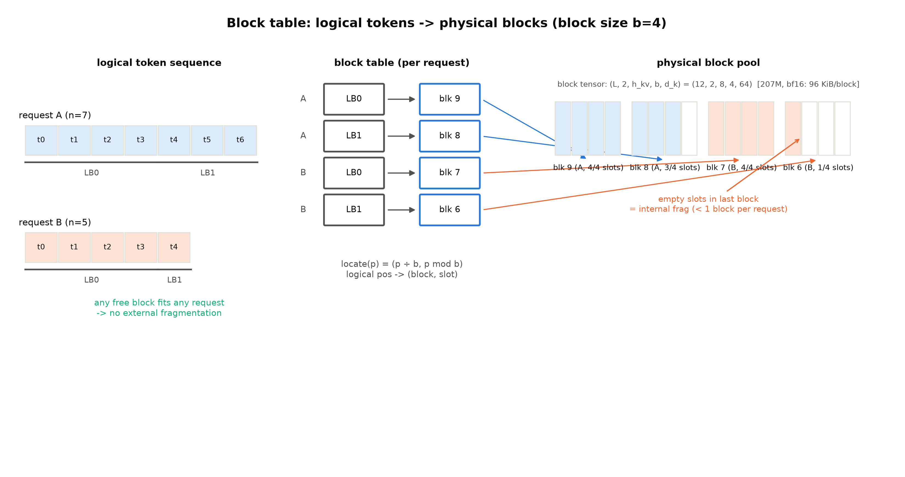
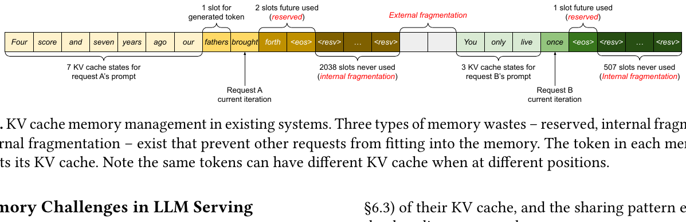
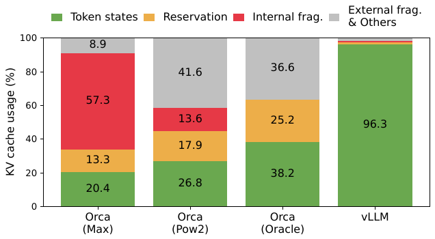
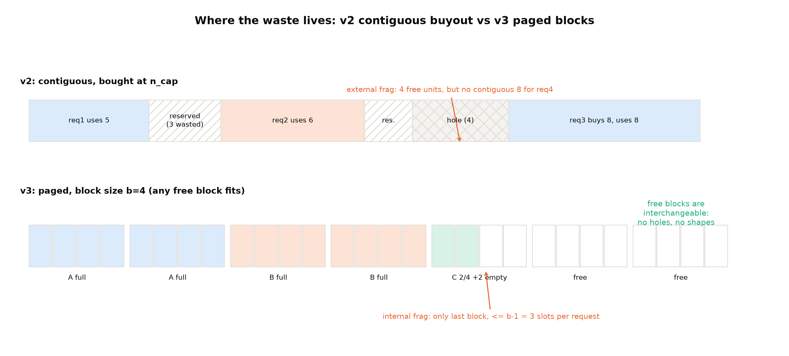
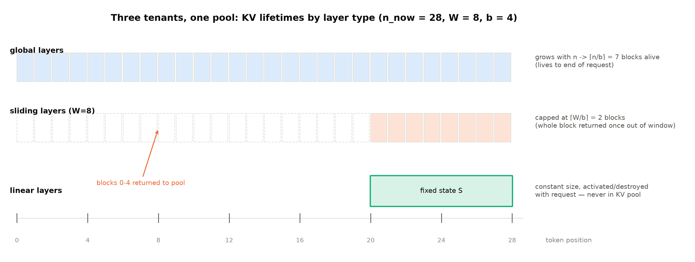
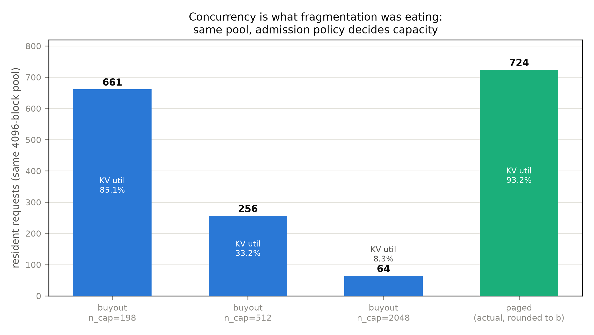

# 第 5 章 PagedAttention：分页 KV 与碎片消解（大项目 v3）

## 5.1 连续缓存的三宗罪

上一章结尾，v2 引擎刚学会让批「动起来」：iteration 级重组、完成即出、新请求即入——时隙的账结清了。但每一条请求的 KV 缓存，从生到死还是**一段按上限一次性买断的连续显存**。这本账有多粗？v2 给每条请求按一个固定的安全上限整段买断（教学档 `--n-cap` 默认 256 位，`engine_v2.py::KVCache`——v3 分页改造的正身对象），每位 24 KiB（207M 的 KV 账，第 2 章表 2.2）——一条请求进门就先交 6 MiB 的「整租押金」，8 条共 48 MiB；而它们实际住多久，这次实测是 157-190 位、合计约 33 MiB【证据等级：本机实测，`engine_v2_base.json`】——**近三成押金白交，且进门时并不知道会白交多少**。

而 Book5 留给本章的那笔正账，现在也到期了。第 2 章章末欠账框写道：

> 「分类型 KV 账本立起了一个服务侧需求：滑窗层要『滚动淘汰』（只保窗内、逐 token 驱逐窗外），全局层全保——同一个缓存池里两类层两种生命周期，逐块记账与淘汰给 prefill/decode 带来的不对称是推理系统的正菜。→ Book6 第 5 章（第 3 章架构侧串联）」
> 【Book5 ch02 章末欠账框原文】

两笔账合起来读，本章要回答的问题是：**KV 这本「随请求生长的账」，怎么存放才不浪费、才能在一个池子里伺候不同寿命的住客？**这个问题在连续缓存的世界里有两个解不开的死结——先把它们的名字钉在墙上，本章结束时逐个回来销账：

- **买断浪费**：按最坏情况预留，请求提前结束，押金不退；
- **外部碎片**（external fragmentation）：连续段必须整段找空位，请求进出几个回合后显存里满是「总量够、形状不对」的洞。

第三个死结要等 5.6 节才显形（滚动淘汰在连续缓存上是一笔搬运账），先按下。

> **最小背景栏**：读懂本章需要三件旧资产——KV 账本公式 $2Lh_{kv}d_k\cdot b$（第 2 章表 2.2，207M 每 token 24 KiB）；v2 引擎的连续 KV 存放与 Stepper 结构（第 4 章 4.5-4.6 节）；分类型 KV/状态账本的三类生命周期（Book5 第 1 章式 (1.3)——全局无界/滑窗封顶/线性固定）。操作系统的虚拟内存**不需要**前置——5.2 节从零教起，教到你能画出地址翻译为止。

本章的路线一节一问：操作系统六十多年前怎么解过这道题（5.2）→ 把解法搬进 KV 管理长什么样（5.3）→ 浪费到底省了多少、论文怎么量的（5.4）→ 分页顺手送的那件礼物——共享（5.5）→ 三类住客怎么同池（5.6）→ v3 引擎的三笔实测账（5.7）。产出三样：一套块池+块表+按页借还的机制、一台 v3 引擎、一份「碎片换并发」的量化读数。

## 5.2 分页：操作系统六十多年前的一堂课

先在自己的引擎上把两宗罪量出来。**例 5.1（构造例：外部碎片的诞生）**：设显存里先后住过三段连续 KV（各 40 MiB），中间那段的主人先走了——留下一个 40 MiB 的洞。新来的请求要 60 MiB 连续段：洞太小，剩下的空闲又散在别处——**明明总空闲超过 60 MiB，分配却失败**。连续分配的失败条件不是「空间不够」，而是「形状不齐」：空闲量是标量，需求是形状，标量满足不了形状。买断浪费则是另一个方向的形状病：v2 按 256 位买断、实际用 157-190 位，教学负载里就浪费了 26%-39%；把买断上限拉到真实服务的口径（2048——聊天产品按最大上下文留位），浪费率立刻到九成上下——**请求长度越不可预测，买断越亏**。

这两个病，操作系统在 1960 年代初就生过一遍，而且病程记录完整，值得整段看一下——因为 KV 管理今天用的药，就是当年那张药方。

**第一代：整段搬入。**每个进程的整个地址空间作为一整块连续区放进物理内存。浪费一望便知：地址空间中间从堆顶到栈底的大片留白也得占着物理内存——32 位空间 4 GB，程序实占几 MB，其余全是陪葬【证据等级：标准教科书口径，OSTEP（Operating Systems: Three Easy Pieces）ch.14-16】。

**第二代：分段。**既然浪费在「整段连续」，就按逻辑意义切开：代码一段、堆一段、栈一段，各配一对 base/bounds 寄存器，各放各处。留白不再占内存，还白送一件礼（代码段标只读后可多进程共享——这件礼 5.5 节回来领）。但分段把一个旧病放大成了绝症：**段是变长的**。变长单元进出内存几十个回合后，空闲区被切成大小不一的洞——这就是外部碎片。对症的两条药都不行：定期**压实**（compaction，停下进程、把段搬到一起、改寄存器）贵到离谱——搬数据吃带宽又吃 CPU，搬完还可能马上又碎；换分配算法（first-fit、best-fit、buddy……文献数以百计）只能减小不能根除，教材的原话是「无论算法多聪明，外部碎片依然存在」【证据等级：标准教科书口径，OSTEP ch.16】。**病根在「变长」二字。**

**第三代：分页（paging，1962，曼彻斯特大学 Atlas 机器首倡）。**那就让单元不变长：把地址空间切成定长的**页**（page），物理内存切成同尺寸的**页框**（frame，下文简称帧），一页住一框，框框等价。变长段的形状病、压实账、算法军备竞赛，一刀全免。

机制三件套，一件不能少地立起来（判据：你应该能凭这三件画出一次地址翻译）。

**其一，地址的位划分。**虚拟地址不是一个整数，是两截拼的：高段=**页号**（VPN），低段=**页内偏移**。**其二，页表**（page table）。每个进程一张，以页号为下标的数组；每项（PTE）记录两件事——这页住几号帧、以及权限位（有效/只读/可写——只读位 5.5 节有大用）。**其三，翻译。**访存时硬件拆地址、查页表、把「页号」换成「帧号」、偏移原样抄下。

**例 5.2（构造例：把 21 翻译成 117）** 地址空间 64 字节、页 16 字节——$64=2^6$，虚拟地址 6 位；$16=2^4$，低 4 位是偏移、高 2 位是页号。某进程此刻的页表：页 0→帧 3、页 1→帧 7、页 2→帧 5、页 3→帧 2。现在读虚拟地址 21：

| 步 | 动作 | 输入 | 输出 |
|---|---|---|---|
| 1 | 写成二进制并拆位 | $21=010101_2$ | 页号 $01_2=1$，偏移 $0101_2=5$ |
| 2 | 拿页号查页表 | 页 1 的 PTE | 帧号 $111_2=7$（有效） |
| 3 | 帧号拼偏移 | $[111][0101]$ | 物理地址 $117$ |

自检一条：帧 7 覆盖物理内存 112-127 字节，$117-112=5$——正是偏移 5。翻译没有丢也没有造任何一位，只把高段的名字空间换掉了；**偏移一位不动，因为「页内第几格」在页和帧里是同一个意思；翻译的全部工作只是换掉「哪一页」**。（数字取自 OSTEP 第 18 章原例【证据等级：经典教材口径】。）判据自查随之升级：给你 VA=21 和那张 4 项页表，你能画出物理地址的每一位吗？

分页的浪费账也换了科目。**内部碎片**（internal fragmentation）：给了 16 字节的页只写 3 字节，13 字节锁死在已分配单元内部——外面看不见、也救不回来（按「页内随机停位」估，平均浪费约半页）。**外部碎片：没有了**——不是被治好了，是被设计取消了：OSTEP 的总结句是「分页（从设计上）把内存划分成定长单元」，而「管理定长单元的空闲空间是容易的：维护一张单元清单，来一个请求就从头上取一个」【证据等级：标准教科书口径，OSTEP ch.17-18，直引】。机制拆到底只有一步：**等尺寸 ⇒ 任何空闲页框对任何页都等价**——「形状」这个属性从分配的输入里消失了，分配器不再问「多长？接得上吗？」，只数数「还剩几个？要几个？」。变长世界里「总量够、形状不齐」的失败，在定长世界里收紧为「数量真不够」——**失败变得诚实**。

页的大小本身是一堂权衡课，两条标准论据要立对称（KV 块的类比 5.3 节展开，此处只立 OS 侧）：**大页**——页表项数=地址空间÷页大小，页每翻倍项数减半（32 位空间配 4 KiB 页 ≈ 100 万项 × 4 B ≈ 每进程 4 MiB 页表，100 个进程光页表就吃 400 MiB【证据等级：标准教科书口径，OSTEP ch.18 数字】）；**小页**——内部碎片小（最坏整页减一字节，平均约半页）。x86 家族数十年落在 4 KiB——折中点随硬件时代移动，不是物理常数。

> **【考据框】教学顺序 ≠ 编年顺序。**本节按「整段→分段→分页」的构造逻辑讲，但历史上三者几乎同期：早期分段系统 1961-62 年，Atlas 分页 1962 年（Kilburn et al., *One-level Storage System*），Multics 则两者兼用（段之下再分页）。「fragmentation」作为术语的系统讨论可追到 Randell 1969（CACM 12:7）。别把「分段比分页早发明二十年」这类硬编年断言写进笔记。

## 5.3 block table：KV 的页表

把这张药方搬进 KV 管理。v3 引擎（`code/ch05/engine_v3.py`）把 v2 的连续缓存换成三件套，与 OS 的三件套逐一对应（术语桥：**页↔逻辑块、帧（页框）↔物理块、页表↔块表、页内偏移↔块内槽位**）：

- **物理块池**（`BlockFreeList`——自有类名，与任何引擎源码类名刻意区分，本册「论文概念可用、实现类名不碰」纪律的操作面）：一个大张量堆 $(N_{blocks},\,L,\,2,\,h_{kv},\,b,\,d_k)$——207M 实参即 $(4096,\,12,\,2,\,8,\,32,\,64)$，$b$=块大小（每块装 $b$ 个 token 的 K 与 V），bf16 下每块 $32\times24\text{ KiB}=768\text{ KiB}$，整池 4096 块 = 3.0 GiB；配一张空闲块号栈，分配=栈顶弹一个，回收=压回去。
- **块表**（`engine_v3.py::BlockTable`，论文数据结构身份）：每请求一张，逻辑块序 → 物理块号。逻辑 token 位置 $p$ 的定位就一行——$p\div b$ 得逻辑块号、查表得物理块、$p\bmod b$ 得槽位：
  $$\mathrm{locate}(p)=\big(\,\underbrace{p\div b}_{\text{逻辑块}},\ \underbrace{p\bmod b}_{\text{槽位}}\,\big)\ \mapsto\ \text{物理块}[\,p\div b\,]\tag{5.1}$$

  | 符号 | 含义 | 量纲/形状 |
  |---|---|---|
  | $p$ | 逻辑 token 位置 | token 序号（标量） |
  | $b$ | 块大小（每块 token 数） | token/块 |
  | $\text{物理块}[\cdot]$ | 块表数组（逻辑块号→物理块号） | $N_{req}$ 项 |

  用人话说：这就是例 5.2 的位划分——(页号, 偏移) 的推广。硬件地址是二进制，页大小取 2 的幂、除法退化成移位；引擎里 token 位置是逻辑序号，整除取模直接可用，$b$ 连 2 的幂都不必是。
- **按页借还**：请求每长满 $b$ 个 token 申请一块；请求结束（或滑窗滚出，5.6 节）即刻还块入栈。

**例 5.3（构造例：两条请求的块表建立与回收走查）** 块大小 $b=4$，请求 A 长 7（prompt 5 + 已生成 2）、请求 B 长 5。空闲栈顶依次弹出 9、8、7、6。逐步走：

表 5.1 块布局与地址流转表（$b=4$；物理块号与 `alloc` 栈序一致）

| 逻辑位置 $p$ | 逻辑块:槽位 | 物理块号 | 落位说明 |
|---|---|---|---|
| A：0-3 | 0:0-3 | **9** | 满块（prompt 前 4 token） |
| A：4-6 | 1:0-2 | **8** | 3 槽用 1 槽空——**内部碎片 1 槽** |
| B：0-3 | 0:0-3 | **7** | 满块 |
| B：4 | 1:0 | **6** | 1 槽用 3 槽空——内部碎片 3 槽 |

四个要点各停一秒。**其一**，任何未来请求都能拿到整块——例 5.1 那个 40 MiB 的洞，在分页世界（设块 4 MiB：40 MiB=10 块、60 MiB=15 块）等于十个空块，要 60 MiB 的请求拿走任意 15 个空块即可：**形状需求消失了，只剩数量需求**，外部碎片归零。**其二**，浪费被关进了笼子：每条请求的浪费 ≤ 最后一块内的空槽，至多 $b-1$ 个（A 为 1、B 为 3）——「浪费限于一块以内」，5.4 节论文的账正是这句的形式化。**其三**，A 结束：块 9、8 压回栈顶，即刻可被下一条请求复用——按页借还让「退房」变成 O(1) 的记账。**其四**，块张量形状 $(12,2,8,4,64)$ 在 $b=4$ 档即每块 $4\times24=96$ KiB——例中的 4 个物理块就是从这么大的格子里借的（图 5.1）。



图 5.1 逻辑-物理映射与 block table（自绘示意级）：两请求逻辑序列→各自块表→物理块池；块表每行箭头指向对应物理块（A 蓝/B 橙），池内标槽位占用与空槽（=内部碎片）；块张量形状 $(L,2,h_{kv},b,d_k)$ 标注在池上方。

机制立完，还有一笔「读」的账要算——**收集（gather）**。注意力每步要读全部历史的 K/V：连续缓存是一次切片（$[:n]$ 一刀），分页后历史散在多个物理块，要按表逐块拼回逻辑序。走一遍 `engine_v3.py::gather_layer` 的形状流转（表 5.2）：

表 5.2 gather 的形状流转（对每层 $l$，逐步骤）

| 步骤 | 运算 | 输入形状 | 输出形状 | 说明 |
|---|---|---|---|---|
| 1 | 取池切片 | 池 $(N{,}L{,}2{,}h_{kv}{,}b{,}d_k)$ 的 $[\mathrm{phys},l,0,:,:\mathrm{take}]$ | $(h_{kv},\mathrm{take},d_k)$ | 末块 $\mathrm{take}<b$ 截断 |
| 2 | 逐块 `torch.cat` | $\lceil n/b\rceil$ 个 $(h_{kv},\mathrm{take},d_k)$ | $(h_{kv},n,d_k)$ | 按逻辑块序拼 |
| 3 | `repeat_interleave` | $(h_{kv},n,d_k)$ | $(h,n,d_k)$ | GQA 组内广播 |

**这就是分页的访存税：逻辑连续变物理离散，读取从一次访存变成 $\lceil n/b\rceil$ 次。**论文的 PagedAttention kernel 干的是同一件事——按块表逐块取 KV 做注意力（块级公式 $A_{ij}=\mathrm{softmax}(q_i\cdot K_j/\sqrt{d})$，$K_j$ 为第 $j$ 块的键组；prefill 仍走常规注意力、decode 才走分块路径【证据等级：官方论文 2309.06180 §4.1+Fig 5】；kernel 侧每 GPU warp 读一块、保证访存合并【证据等级：官方论文 §5.1】）——与我们的 `gather_layer` 同构，只是工业版把它揉进了注意力 kernel 里、我们在外面拼。这笔税多大、工业版怎么把它压回去，5.7 节量、第 8 章算。

块大小 $b$ 是这套机制的旋钮，论文把它扫了个遍（Fig 18(b)：1-256 全程扫描，ShareGPT 负载 16-128 表现最好，短序列的 Alpaca 在 ≥64 显著恶化——「序列变得比块还短」；块太小 kernel 并行度吃不满，块太大内部碎片回潮+共享粒度变粗）【证据等级：官方论文 §7.2】。vLLM 落在 16，原文的理由是「大到足以高效利用 GPU、小到在多数负载下避免显著内部碎片」【证据等级：官方论文 §7.2】。v3 教学档取 32——每块 768 KiB、4096 块恰成 3.0 GiB 整池，账好算（5.7 节实测它的账）。

> **【实现对照框】** 块大小的平台口径：CUDA 阅读锚（v0.30.0）默认块 16 token；NPU 运行栈（vllm 0.27.1+vllm-ascend）默认粒度 128【证据等级：本机源码/运行栈口径，sources/01——观测实验按 128 报数】。同一家思想、两个硬件两套旋钮——块大小是「碎片 vs kernel 效率」的权衡点，不是常数。

## 5.4 论文的账：六成浪费从哪来、分页值多少钱

5.2 的手算只算了自己一亩三分地。真实服务的账有多惨？先看论文立的显存局（§3）：OPT-13B 每 token KV $=2\times5120\times40\times2\text{ B}=800\text{ KB}$，序列上限 2048 ⇒ 单条请求 KV 至多 **1.6 GB**；单张 A100-40GB 上参数 26 GB 已占 65%，KV 预算只剩 12 GB——**15.7K 个 token 槽**【证据等级：官方论文 2309.06180 §3+Table 1】。也就是说，13B 模型满打满算同时伺候七条长请求——**能并发几条，由 KV 管理方式决定**；而算力还在涨、显存容量不涨，这个瓶颈只会更紧。

浪费分三类，论文的区分标准是「**什么时候知道它浪费了**」（§3.1）：**预留**（reserved）——最终会用，但从进门前就全程独占（「订了包间等人来」）；**内部碎片**（internal fragmentation）——请求结束时才知道白占（「菜上齐了才发现点多了」）；**外部碎片**（external fragmentation）——服务开始前就知道永远用不上（「过道，谁也坐不下」）。

**实物 5.1**（现有系统的 KV 管理：论文 Fig 3 原图；看什么——三件事：数 A 条的槽、认三类浪费、记一句反直觉）



【证据等级：官方论文 2309.06180 Fig 3，arXiv 版 license=CC BY 4.0（abs 页图标复核），原样引用含原图注】指名看三处。**其一**，数请求 A 的内存条：10 个槽在用（7 prompt「Four score and seven years ago our」+3 已生成），却按最大长度 2048 预留——末端大括号「2038 slots never used」；B 条 5 槽在用、507 槽白占。**其二**，三类浪费在这张图里各就各位：影线槽=预留、大括号=内部碎片、两条之外的散块=外部碎片。**其三**，图注里那句反直觉的话：「the same tokens can have different KV cache when at different positions」——同一个词在不同位置的 KV 不同（KV 依赖整条前缀经注意力逐层传播），**所以缓存不能按「词」去重、只能按「块/前缀」共享**——这是 5.5 节与第 6 章的地基。

定量版是 Fig 2（图 5.2）。三根 Orca 柱值得逐柱读（表 5.3）——它们是三种预留策略的「病理解剖」：



图 5.2 现有系统 KV 显存都浪费在哪（引自 vLLM 论文 Fig 2，arXiv:2309.06180，CC BY 4.0；柱内构成经 PDF 词坐标解算复核【证据等级：官方论文 §6.2】）。

表 5.3 Fig 2 四柱构成（按「什么时候知道浪费了」分类）

| 系统（策略） | 有效利用 | 预留 | 内部碎片 | 外部碎片等 | 主罪 |
|---|---|---|---|---|---|
| Orca (Max)：总按最大长度 2048 预留 | 20.4% | 13.3% | **57.3%** | 8.9% | 均匀大块→内部碎片巨大 |
| Orca (Pow2)：按下一个 2 的幂预留 | 26.8% | 17.9% | 13.6% | **41.6%** | 尺寸参差→buddy 分配外碎片爆表 |
| Orca (Oracle)：假设预知真实输出长度 | 38.2% | 25.2% | ≈0 | 36.6% | 开天眼仍浪费六成 |
| vLLM (PagedAttention) | **96.3%** | — | ≤1 块 | — | 浪费合计 3.7% |

【证据等级：官方论文 Fig 2，§6.2（OPT-13B/66B/175B，ShareGPT+Alpaca trace）】最值得盯的是 **Oracle 柱**：即便预知每条请求的真实长度（实践中不可达的性能上界），连续分配仍留下 25.2% 预留 + 36.6% 外碎片——**问题不在预估不准，在连续分配本身**。这句是分页必要性的论文级论据（5.7 节的准入实验会在自家 3 GiB 池上复现「开天眼仍输」这半边——机制界定也见 5.7）。而 vLLM 柱的 96.3% 对应浪费 3.7%：机制来源正是表 5.1 的「浪费限于一块以内」（$\le b-1$ 槽/请求）。顺带把口径钉死（表 5.4 一并钉）：论文自己的表述是摘要的「near-zero waste」与 §4.2 的「within one block」；那个流传更广的「waste of under 4%」**出自 vLLM 官方博客（2023-06-20）而非论文**——数值与 Fig 2 的 3.7% 互证，但引用必须分列出处（本册纪律：引擎博客数字一律标厂商自报）。

分页值多少钱？论文的效果证据群，按「机制链」读：

- **显存利用→并发→吞吐**：同延迟水平下吞吐 2-4×（摘要口径，vs FasterTransformer 与 Orca）【证据等级：官方论文，Abstract】；拆开看，vs Orca(Oracle) 可持续请求率高 1.7-2.7×、vs Orca(Max) 2.7-8×、vs FasterTransformer 最高 22×【证据等级：官方论文 §6.2】；ShareGPT trace 下平均批大小 7.00/9.81/13.62（Orca 三变体）→ **30.42**（vLLM）——省下的每一块显存都变成了并发位【证据等级：官方论文 Fig 13】。
- **官方博客侧**：vs HuggingFace Transformers 最高 24×、vs TGI 3.5×（LLaMA-13B、单卡 A100-40GB，另有 LLaMA-7B/A10G 档、2023-06 口径）【证据等级：厂商自报，vLLM 博客 2023-06-20】。
- **诚实的代价披露**：PagedAttention kernel 本身比 FasterTransformer 的 attention kernel **慢 20-26%**（查块表的额外开销），但只影响注意力算子、不影响 Linear 等，端到端仍大幅胜出【证据等级：官方论文 §7.1+Fig 18(a)】——分页不是免费的午餐，是拿 kernel 的小税换显存的大账。
- **边界**：175B/8×A100-80GB 档 KV 预算 264 GB，Oracle/Pow2 也能批大量请求、系统变为 compute-bound——vLLM 的优势明显收窄（论文未给倍数）【证据等级：官方论文 §6.2 例外讨论】。**分页的本质是解 memory-bound**；显存不紧张的部署，这笔账本来就不大。

表 5.4 vLLM 论文/博客关键数字双口径（引用纪律：两列出处分列，不得互串）

| 数字 | 出处 | 口径 |
|---|---|---|
| 浪费 near-zero / within one block | 论文 Abstract / §4.2 | 官方论文 |
| 有效利用 20.4%-38.2%（现有系统） | 论文 §1+Fig 2 | 官方论文 |
| vLLM 有效利用 96.3% | 论文 Fig 2 | 官方论文 |
| 吞吐 2-4×（同延迟） | 论文 Abstract | 官方论文 |
| 「a mere waste of under 4%」 | vLLM 博客 2023-06-20 | 厂商自报 |
| 最高 24×（vs HF）/3.5×（vs TGI） | vLLM 博客 2023-06-20（LLaMA-13B/A100-40GB，另含 LLaMA-7B/A10G 档） | 厂商自报 |

最后把自家的对照画出来收束（图 5.3）：v2 的浪费长在「预留段」和「洞」上，v3 的浪费被关进「最后一块」——位置之别正是机制之别。



图 5.3 浪费的位置：v2 连续买断（预留+外部洞）vs v3 分页（内部碎片封顶 $b-1$，空闲块等价可互换）（自绘示意级）。

## 5.5 写时复制：分页顺手送的礼物

分页还送了一件当时没下单的东西：**共享**。但要把这件礼物讲准，得先回 OS 把它的原型看清楚——因为「写时复制」（copy-on-write, COW）这四个字，经常被讲成半句。

OS 的原型在 `fork`：造一个和自己一模一样的子进程。朴素实现是全量复制——把父进程的每一页都抄一遍。但典型子进程 fork 之后要么很快 `exec`（换掉整个地址空间，刚才的复制全白费）、要么只碰少数几页——**全量复制是为可能永不发生的写入预付全款**。COW 把付款改成记账：fork 时一页都不复制，只复制页表本身；两套页表指向同一批物理帧，帧在两边都标成**只读**（5.2 节埋的那枚 PTE 权限位，在这里兑现）。此后谁先写共享页，硬件在这一页上触发保护异常、陷入内核；内核这时才分配新帧、把这一页抄过去、把写方的 PTE 改回可写、让写指令重新执行。Linux 的手册原话可以直引：**「Under Linux, fork() is implemented using copy-on-write pages, so the only penalty that it incurs is the time and memory required to duplicate the parent's page tables」**【证据等级：开源权威文档，fork(2) man page（man7.org）】——代价只剩复制页表本身。

搬进引擎，场景正身先摆对。论文 §4.4 讲了**三种**共享，本章聚焦前两种——**同一条请求 fork 出的多条序列**：并行采样（parallel sampling，一个问题要 k 个答案，k 条序列共享同一段 prompt KV）与 beam search（k 条候选路径，随解码推进分分合合）；第三种是服务方**预定义的跨请求共享前缀**——为系统提示/few-shot 预留物理块，「如同操作系统处理跨进程的共享库」，带该前缀的请求直接映射进来【证据等级：官方论文 §4.4】——它的**自动发现**版（引擎怎么自己认出「这个前缀我算过了」）是第 6 章前缀缓存的正题，本章末留伏笔。机制：多条序列的块表把逻辑块指向**同一批物理块**，每块配一个引用计数（refcount）；prompt 的满块全程只读共享，**真正发生「写时复制」的精确场景是未满的尾块**——两条序列共享一个只装了半截的尾块，其中一条要续写下一格时不能污染另一条看到的块，引擎此时分配新块、把尾块抄过去、在副本上续写（refcount 减一）。

**例 5.4（构造例：并行采样两路的复制账）** $b=4$，一条 prompt 长 6：满块 P7（4 token）+ 尾块 P1（2/4 满）。采样 fork 出两路 S1、S2：块表同指 P7、P1，refcount 各为 2。输入两步：

| 步 | 事件 | refcount/动作 | 复制量 |
|---|---|---|---|
| 1 | S1 生成第 7 个 token，要写尾块 | P1 refcount=2>1 → 分配新块 P9，抄 P1 两格，P9 写入新 token；P1 refcount 2→1 | **1 块（4 槽中 2 槽有效）** |
| 2 | S2 生成第 7 个 token，要写尾块 | P1 refcount=1 → 直接写入 | 0 |

输出读法：无共享时两路各存 2 块=4 块；COW 后全程只多付 1 块的复制——**且被复制的只有尾块，满块从头到尾零复制**。长 prompt（几十上百块）场景下，省的比例逼近「只付尾部」。论文的走查同构：7-token prompt 的逻辑块 0、1 映射物理块 7、1，两路 sample 共享（refcount=2），A1 写尾块时新分配物理块 3 复制、A2 再写时原块 refcount 已归 1 直接写【证据等级：官方论文 §4.3-4.4+Fig 8】。

> **【实现对照框】** 这条「尾块才复制」的边界在阅读锚（v0.30.0=ced6857）里有句现成的注释：「Partial hit: redirect the shared tail to a private CoW block」（部分命中的共享尾块被重定向到一块私有 CoW 块；文件位于 vllm/v1/core/ 下，机制地界 Book7）。本册点到为止——但「写进新块≠写时复制、尾块续写才是」这个分界，读者现在能自己说清了。

beam search 的共享更活：不止共享首块，中间块也随解码推进动态分叉合流（原文类比 OS 里 fork 出的进程树）——k=4 的例子里，四条候选共享块 0（prompt），候选 3 在第二块处就分出去，候选 0-2 继续共享前三个块、到第四块才分道；某轮 top-4 全部出自候选 1、2，则候选 0/3 的独占块 refcount 归零、即刻归还，新块照常分配【证据等级：官方论文 §4.4+Fig 9】。对照现有系统在 beam 间频繁大段拷贝 KV，这笔开销整个消失。收益量级（OPT-13B）【证据等级：官方论文 §6.3+Fig 15】：并行采样省显存 6.1%-9.8%（2-6 路，Alpaca）——prompt 只占总 KV 的 12%，天花板本来不高；beam search 省 37.6%-55.2%（宽 2-6，Alpaca）、44.3%-66.3%（ShareGPT 长序列）——共享随序列变长放大，beam 宽 6 时对 Orca(Oracle) 的吞吐优势从基础采样的 1.3× 涨到 **2.3×**。工业侧还有一条：CoW 的块拷贝物理上不连续，逐次搬运会碎——vLLM 把它融合成单个 kernel 提交【证据等级：官方论文 §5.1】，这是「分页税」在工程侧被压回去的又一例。

此伏笔先记下（也是本章留给下一章的门）：**块可以被多条序列共享**——那么跨请求、跨时间的共享（同一段系统提示被千百条请求反复计算）呢？怎么知道「这个块我算过了」？第 6 章的前缀缓存只剩这一个问题。

> **【考据框】借的是三件，不是一整套虚存。**论文自述「an attention algorithm inspired by the classical virtual memory and paging techniques in operating systems」【证据等级：官方论文，Abstract 直引】。借的精确清单：**定长单元**（块）、**映射表**（块表）、**只读位与引用计数**（共享/COW 的地基）。没借的：按需调页（demand paging——没有磁盘这一层，KV 块全驻留显存；显存压力下的换出/重算只是抢占的后备路径，第 7 章地界）、TLB 类硬件翻译（引擎的「地址翻译」就是式 (5.1) 的一次除法取模，没有硬件查表器）。类比讲过了头，读者会以为 KV 管理还有缺页中断——把借条边界写清，这个类比才经得起对抗性追问。

## 5.6 分类型生命周期的块管理（B5-1 兑现）

现在接 5.1 的第二笔账。分类型账本（Book5 第 1 章式 (1.3)）说混合架构的机器上有三类 KV/状态。在块管理眼里它们是**三类住客**，借还节奏各不相同：

- **全局层的块——「全保」**：随请求增长逐块申请，活到请求结束才整批归还。
- **滑窗层的块——「滚动淘汰」**：窗口滑过 $W$ 之后最老的块整块出窗、还块入池。这里藏着分页送的第二件礼：**淘汰从搬运降级为记账**。连续缓存上滚动窗口每进一步要 memmove 掉最老一格、整段前移（几 MB 的搬运）；块粒度上它是 O(1)——还一块、进一块。滑窗层的占用量恒定在 $\lceil W/b\rceil$ 块——Book4 第 10 章那个「gpt-oss 滑窗层 KV 是否被窗口 128 封顶」的问题，块账一口答出：封顶在 $W$，以块为单位取整。
- **线性层——「不进池」**：GDN/KDA 的状态是固定形状的张量，随请求激活/销毁，根本不是 KV（统一分页池如何同时容纳 KV 与定长状态，是 Book8 第 1 章的终局课题——本册只立问题）。

这里有一个论文脚注级的实现自由度要交底：块的管辖范围可以全部层共管一块，也可以**按层（组）各配独立块表**——论文选了后者【证据等级：官方论文 §4.1 脚注】。分类型生命周期要的正是这个自由度：滑窗层那张表才能独立地「整块出窗就还」，不被同一块里的全局层拖住不放（后文按此口径记账）。

**例 5.5（构造例：滑窗 $W{=}8$ 的环形块账——三类住客同池并排读）** 块大小 4。**第 9 个 token 到来**：输入=当前 8 个 token 的窗口与一个新 token。滑窗层：窗口覆盖 token 1-8（块 A=1-4、块 B=5-8），新 token 9 进新块 C，token 1 滑出窗口但块 A 里 token 2-4 还在窗内——**块 A 不能整块还**。并排看另外两类：全局层的账单此刻涨到 $\lceil9/4\rceil=3$ 块（A、B、C 全保、继续生长），线性层还是那 1 份固定状态（恒定）。**到 token 12**：滑窗层窗口 5-12，块 A 整块出窗——还块（滑窗层从此稳定在 2 块）；全局层涨到 3 块、线性层纹丝不动。输出读法：**滚动淘汰的粒度是块、节奏是「整块出窗才还」**（块大小决定淘汰的响应延迟，最坏多留 $b-1$ 个过期 token 的 KV）——同一时刻三类住客的账单各走各的节奏，同池不同命。

三类住客在容量规划上合成一本「分类型并发账」。设全局层 $L_g$ 层、滑窗层 $L_s$ 层、每层每 token KV 元素 $2h_{kv}d_k$，则每请求的 KV 峰值（元素数）：

$$
\mathrm{KV}_{\text{req}}(n)\;=\;2h_{kv}d_k\big(L_g\cdot n+L_s\cdot\min(n,W)\big)
\tag{5.2}
$$

| 符号 | 含义 | 量纲 |
|---|---|---|
| $L_g,\,L_s$ | 全局/滑窗层数（$L_g{+}L_s{=}L$） | 层 |
| $2h_{kv}d_k$ | 每层每 token KV 元素 | 元素/token |
| $\min(n,W)$ | 滑窗层的有效长度 | token |

用人话说：**并发上限的弹性部分由全局层付**（每条请求线性吃满 $L_g\cdot n$），滑窗层只贡献封顶部分（$\lceil W/b\rceil$ 块，与长度无关），线性层只付常数——一台混合架构机器能同时伺候多少条百万 token 的请求，取决于全局层那本无界账。代一组数（207M 口径、$b{=}32$）：一条 128K 上下文的请求要 $\lceil131072/32\rceil=4096$ 块——**恰好把 3.0 GiB 教学池一口吃空**；换成 gpt-oss 式一半层滑窗（$W{=}128$）的机器，滑窗那半封顶在 $\lceil128/32\rceil=4$ 块、全局那半照旧线性——**天花板钉死在全局层的无界账上**，式 (5.2) 的两个乘子各管一头。Book5 的账本公式至此从「描述模型」推进到了「规划容量」（图 5.4 把三条生命线并排画出）。



图 5.4 三类住客的时间线（自绘示意级，$n_{now}{=}28,\ W{=}8,\ b{=}4$）：全局层 7 块全活到请求结束；滑窗层只保最近 2 块、块 0-4 已还池；线性层是定长状态、不入池。

## 5.7 v3 实测：碎片账、并发账与代价账

`engine_v3.py` 在与 v2 相同的 workload 上跑分页版。先过数值关：分页路径 vs 全量重算，CPU fp32 对拍 max|Δ|=0.00e+00——**分页只改存放、不改数学**。然后是三笔账。

**实物 5.2**（v3 块表 dump：8 行原文；看什么——三件事：数块数、看栈序、抓复用）

```text
[块表] 请求: 终长/块数/逻辑块序->物理块号
  req0: n_final=174 blocks=6 -> [4095, 4094, 4093, 4092, 4063, 4062]
  req1: n_final=159 blocks=5 -> [4091, 4090, 4089, 4088, 4062]
  req2: n_final=172 blocks=6 -> [4087, 4086, 4085, 4084, 4061, 4088]
  req3: n_final=183 blocks=6 -> [4083, 4082, 4081, 4080, 4060, 4089]
  ...（共 8 行；req7: n_final=190 blocks=6 -> [4067, 4066, 4065, 4064, 4056, 4057]）
```

【证据等级：本机实测，Atlas 910B3，bf16，$b{=}32$，`--dump-tables` 档（同种子同 workload）——`log/book6-ch05/engine_v3_tables.json`】指名看三处。**其一**，数块数对公式：174 token → $\lceil174/32\rceil=6$ 块、157 → 5 块，表 5.1 的算式在真机上逐条成立。**其二**，看块号方向：从 4095 往下走——空闲栈后进先出，最先入场的请求拿栈顶（最大号）。**其三，抓块复用**：req1 只生成 31 个 token、在第 31 步先结束，五块按序压回栈顶（4062 最后进、排最前）；第 33 步，还在生长的 req0 要第六块（token 161 越过 160 的五块边界）——从栈顶弹出的正是 4062；req2 同一步要第六块，拿到下一个栈顶 4088。**方向要看清：是先结束的 req1 把块让给了还在跑的 req0/req2**——分配-回收-复用在 dump 里是看得见的活证据，这正是「按页借还」四个字的运行时形态。

**碎片账**：同一 workload 两个引擎的实跑 KV 账——v2 按上限买断 48 MiB（256 位 × 8 条），v3 按需取整到块共 34.5 MiB，**省 28.1%**【证据等级：本机实测，`engine_v2_base.json` + `engine_v3_base.json` 双底档】。净额拆开读：实际占用 33 MiB（1407 位 × 24 KiB）+ 内部碎片 1.5 MiB（8 条各留至多 31 个空槽，$b-1$）——买断浪费消掉了 15 MiB，分页自己引入了 1.5 MiB。`engine_v3_base.json` 里另有一行「省 7.1%」：那是脚本按「乐观上限 198 位」做的同口径会计（假设 v2 把买断压到盖住本次最长生成再留 8 位余量：$128+62+8=198$）——**参照的买断策略不同，省的幅度就不同**，这本身就是「分页赢在不确定上」的注脚：买断越保守、上限越高，浪费越大。把不确定性推到真实服务口径，账就翻天了——这正是第二笔实测要量的。

**并发账**（新实验，`--admission`）：固定同一个 3.0 GiB 池（4096 块），只改准入规则，问「能同时驻留多少条请求」（分配器级对照，不加载模型、同种子同长度分布）。**实物 5.3**（准入对照读数；看什么——四行的「驻留数」与「利用率」两列，重点对比 n198 与 paged 两行）：

```text
[admission] contig_n198  驻留 661/1000 条 | 占用 130878 槽 | 实际 KV 111553 tok | 利用率 85.1%
[admission] contig_n512  驻留 256/1000 条 | 占用 131072 槽 | 实际 KV  43467 tok | 利用率 33.2%
[admission] contig_n2048 驻留  64/1000 条 | 占用 131072 槽 | 实际 KV  10859 tok | 利用率  8.3%
[admission] paged        驻留 724/1000 条 | 占用 131072 槽 | 实际 KV 122094 tok | 利用率 93.2%
```

【证据等级：本机实测（分配器级模拟），`log/book6-ch05/engine_v3_admission.json`】四行读出三个结论（图 5.5）。**其一**，不确定性是买断的放大器：同样的池，按 198 买断驻留 661 条、按真实上限 2048 买断只剩 64 条——分页 724 条，**11.3 倍的并发差**，正是 5.4 节论文那根「显存→并发→吞吐」机制链的教学版。**其二**，n198 这档的「天眼」要看精确：它只预知了**全局最长生成**（62），对每条请求仍一律按 198 买断——是 Orca(Max) 的开天眼版，不是论文的 Oracle（后者逐请求按真实长度分配）。它输给分页（661 对 724、85.1% 对 93.2%）的差额来自均匀预留（短请求也按 198 交租）与最后一块取整；这与 5.4 的 Oracle 柱**同向而不同机制**——论文 Oracle 输的主要是外碎片，而外碎片的显形需要请求交错进出；本模拟没有退场，若真按逐请求真实长度买断、又无外碎片，连续分配在这个模拟里反而能略胜分页（手算：平均长 168.5 token、池 131,072 槽 ≈ 778 条对 724）。**外碎片的杀伤要靠时间积累**——Fig 2 是一小时真实 trace 的账；模拟与实测各管半边，合起来才是全账。**其三**，分页自己也到不了 100%：93.2% 里缺的那 6.8% 就是内部碎片（每请求平均半块），与 OS 的「平均浪费约半页」同款。



图 5.5 同一 3.0 GiB 池、四种准入政策的驻留请求数与 KV 利用率（自产，喂 `engine_v3_admission.json`）：不确定性越大买断越亏；「开天眼」的 n198 档仍输给分页——差在取整与最后一块。

**代价账**：吞吐 40.52 tok/s，比 v2 的 85.09 明显回退【证据等级：本机实测，同 workload】。归因要分解而不能含糊：其一，**块收集税**——每层每步 `gather_layer` 逐块 cat，逻辑连续变物理离散的 $\lceil n/b\rceil$ 次访存（5.3 节立过账）；其二，**逐 token 入块的 python 开销**——教学版 prefill 逐 token 写块（代码注释自承「生产版按块批写」）。论文交的是同一份税的工业版：PagedAttention kernel 比 FT 慢 20-26%（5.4 节引过），而工程用三个融合 kernel（新 KV 切块落位/按块表取数算注意力/CoW 块拷贝）把税压回去【证据等级：官方论文 §5.1】——我们的税怎么在 kernel 侧被压回去，第 8 章正面算。另有一笔峰值口径要摆正：v3 峰值 3494 MiB 里有池预分配的 3.0 GiB（4096 块一步到位，生产引擎按需增长）、权重 414 MB 与激活若干——**峰值高于 v2 的 498 MiB 是教学版口径，不是分页更费显存**；读显存账先读构成。

## 5.8 本章小结

开篇钉在墙上的三宗罪，逐个销账：**买断浪费**——按页借还，进门不再交整租押金（实跑 48→34.5 MiB；同池并发 724 对 64，5.7 的准入账）；**外部碎片**——定长块让「形状」从分配输入里消失（Oracle 柱证明：问题不在预估、在连续分配本身）；**淘汰搬运**——滑窗层的滚动淘汰降级为还一块进一块的记账。三笔旧账在同一处合流：**F4 的读取语义**（Book1 起的 KV 账，经第 2 章立到服务侧）、**B3-1 的第三股**（存放方式的省法——分页不压 KV 一个字节，只消灭「放不下」的浪费）、**B5-1 的两类生命周期**（全保与滚动淘汰在同一池子的块粒度统一管理）。

**带走的心智**：分页把 KV 管理从「找房」变成「登记」。连续分配时代你要找一整段合适的显存——找不到不是空间不够而是形状不齐，失败是含糊的；分页时代你只需要记账（哪页在哪个块），失败条件收紧为「数量真不够」——**失败变得诚实**。以后看到任何一个内存管理器，先问三句：**单元定长吗？映射在哪记账？浪费关在哪个笼子里？**——第三问的答案决定了它的并发上限（Fig 2 的四根柱就是四种笼子）。

镜头拉回全书：引擎至此会三件事——批会动（v2）、KV 会借还（v3）、住客能同池（分类型生命周期）。但 5.5 埋的门还关着：块既然能共享，「算过的前缀」能不能跨请求复用？下一章兑现。而分页自己欠的那笔 gather 税，记在第 8 章的账上——工业 kernel 会用融合把它压回去，我们把机制留到那里拆。

> **【欠账】** 块表/块池/写时复制在真实引擎（vLLM）里的实现正身与 NPU 侧等价口径——阅读锚 v0.30.0 的 block 管理与 CoW 注释已在此埋点。→ Book7 第 6 章

## 动手验证

```bash
cd 工作区根目录 && source env.sh
# ① v3 引擎：对拍+碎片账+块表 dump（实物 5.2 数据源；NPU 分钟级，先 npu-smi 选卡）
ASCEND_RT_VISIBLE_DEVICES=<卡> python "code/ch05/engine_v3.py" --dump-tables --out-name tables
#   验收行：[对拍] max|Δ|=0.00e+00 | [v3] 8 条 … 省 7.1% | [块表] 8 行 dump
# ② 准入对照（分配器级，CPU 秒级；图 5.5 数据源）
python "code/ch05/engine_v3.py" --admission 1000
#   验收行：contig_n2048 驻留 64 条 8.3% vs paged 724 条 93.2%
# ③ 本章四张自绘图（图 5.1/5.3/5.4/5.5）
python "code/ch05/fig_ch05.py"
# ④ 正主：arXiv:2309.06180——Fig 2 逐柱（对照表 5.3/5.4）、Fig 3（实物 5.1）、Fig 18(b) 块大小消融、Fig 19 swap vs recompute
```
