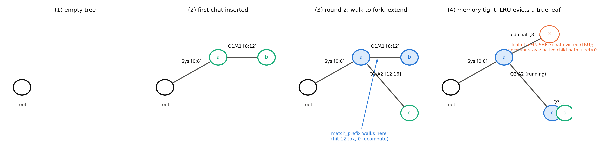
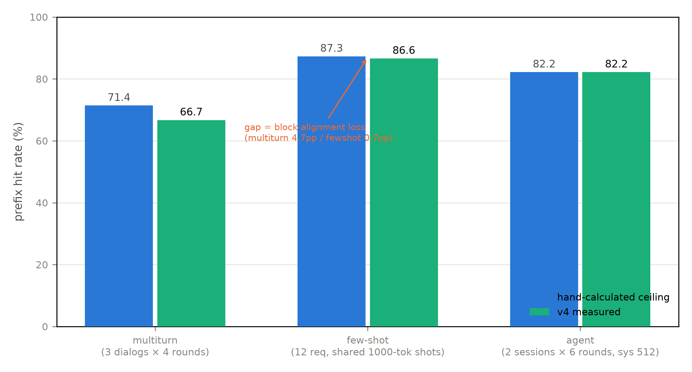
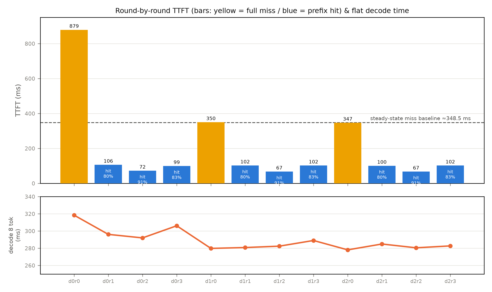

# 第 6 章 Prefix caching：前缀复用的经济学（大项目 v4）

## 6.1 三本旧账，一个问题

第 5 章收尾留了一扇门：块可以被多条序列共享——那么**怎么知道「这个块我算过了」？**这个问题值多少钱，先数三本旧账。**第一本，few-shot 的账（N6）**：Book2 第 11 章做 in-context learning 探针时给 K 条示范再提问，章末欠账框写明「它的长 prompt 在服务侧的经济学（前缀缓存）见 Book6 第 6 章」——对话服务里，同一组示范被**成千上万个请求原样重复**，每个请求都从头 prefill 一遍同样的内容，是纯粹的重复劳动。**第二本，多轮对话的账**：聊到第 $r$ 轮时，prompt=系统提示+前 $r-1$ 轮全部历史+新问题——历史部分**逐轮原样重发**，而它的 KV 昨天就算过、如果没被丢掉的话今天还躺在显存里。这本账随深度越滚越重：第 2 轮重发的可能只有一两百 token，到第 10 轮，一条千 token 的历史整段重算只为在尾部生成几十个新 token——**对话越深，prefill 里「旧账」的占比越大**。**第三本，上下文主线的终点账（F10/N7）**：Book2 收束时点名「缓存经济学与 KV 三线压缩在 Book6 第 6/3 章」【Book2 ch12 卷末，直引】——长上下文的账单里大部分是重复前缀的账单，**前缀缓存的命中率，就是这份账单的折扣率**。

SGLang 论文（arXiv:2312.07104，正题 *SGLang: Efficient Execution of Structured Language Model Programs*）把问题陈述成了一句可以直引的话：「In existing inference engines, the KV cache of a request is discarded after processing is completed, preventing the KV cache from being reused across multiple calls...Instead, our system maintains an LRU cache of the KV cache for all requests within a radix tree」——现有引擎请求完成即丢弃 KV、跨调用无法复用；它的答案是**把全部请求的 KV 当一份传统缓存来经营**【证据等级：官方论文 §1，直引】。这句话里藏着本章的全部剧情：把 KV 从「请求的私产」改成「缓存的公共资产」，要回答三个问题——**怎么认块（两派设计，6.3）、值多少钱（三场景的折扣账，6.2）、怎么经营（驱逐与调度，6.4）**。产出：一台 v4 引擎（v3 块池之上加哈希与共享）、三场景的命中率实测、一份逐轮 TTFT 折扣明细。

共享的机会长什么样，论文 Fig 9 给了一幅分类学（一图 (a)-(d) 四面板），四种真实 workload 各画一格：**few-shot**——多条请求共享同一段示例前缀，之后各奔各的问题（共享是「一把扇面」）；**self-consistency**——同一个问题采样 k 路回答，问题段共享后**多路分叉**（共享是「一株倒垂的树枝」）；**多轮对话**——历史逐轮增长、整段可共享，每轮只在尾部添新（共享是「一条不断加长的主干」）；**tree-of-thought**——搜索树的分支各自带着搜索历史、又会在父节点汇合（共享是「整棵树」）。四种形状递进的关键在后两种：**分了又合、合了又分——它们不是「一段共享前缀」能描述的，是一棵树**。这个形状直觉记住，6.3 的两派之争从它讲起。

> **最小背景栏**：本章站在 v3 的块池与块表上（第 5 章），新前置只有哈希函数（任意数据→短指纹的常识级理解）。Book2 第 11 章 few-shot 探针的账在 6.1 回收；第 5 章的 COW 与共享块（refcount）是 v4 的直接地基。

## 6.2 先算值多少钱：三场景的折扣账

前缀缓存（prefix caching）不创造任何新计算——它只是不再重复旧计算。所以收益的天花板由**负载形状**封顶，先手算三个代表场景（v4 的 workload 参数就按这三笔账设计，6.5 实测对拍）。

**few-shot 服务**：$K$ 条示范共 1000 token 全局共享、各异的问题 50 token。12 条请求的总 prefill $=12\times1050=12600$ token；首条请求全算（示范入缓存），其余 11 条各免算示范段——命中率天花板 $=\frac{11\times1000}{12600}=87.3\%$。**Agent 服务**：长系统提示 512 token 跨会话共享（2 会话）+会话内每轮增量 128 token（6 轮）。推导两行：每轮命中=（首项）$+640+768+896+1024+1152$——会话 1 是开荒者、首项为 0，合计 $4480$；会话 2 连系统提示都是命中（跨会话/跨用户命中——首项 512），合计 $4992$；总计 $\frac{4480+4992}{11520}=82.2\%$。**多轮对话**：第 $r$ 轮的命中占比有个递推式——设系统提示 $s$、每轮新增 $c$（问+答），则第 $r$ 轮 prompt 长 $s+rc$、命中段 $\text{hit}_r=s+(r-1)c$（首轮 $\text{hit}_1=0$，冷缓存）：

$$
\text{命中率}=\frac{\sum_{r}\big(s+(r-1)c\big)}{\sum_{r}(s+rc)}
\tag{6.1}
$$

| 符号 | 含义 | 量纲 |
|---|---|---|
| $s$ | 系统提示长 | token |
| $c$ | 每轮新增（问+答） | token |
| $r$ | 轮序（从 1 起） | — |

用人话说式 (6.1)：分子是「已经算过的」，分母是「本次要算的」——轮数越深分子占比越大，**折扣随对话深度复利**（首轮 $\text{hit}_1=0$：对话自己的缓存也是冷的）。代入 v4 参数（$s{=}128$、$c{=}16$、4 轮、3 对话）：未对齐天花板 $=\frac{3\times(0+144+160+176)}{2016}=\frac{1440}{2016}=71.4\%$；块对齐截断后（144→128、176→160 两处）实得 $\frac{1344}{2016}=$ **66.7%**——手算与 6.5 实测逐位互证的锚点，且多轮场景自己的 4.7 个点块对齐损耗与 few-shot 的 0.7 个点同因。

第四种形状是**反例**：一次性长文分析——没有重复前缀，命中率趋近零，纯付缓存开销。这个反例值多少钱 SGLang 量过：无复用机会的 ShareGPT 负载上，树管理开销 100 请求 74.3 秒里只占 0.2 秒（$<0.3\%$）——所以它敢默认开启【证据等级：官方论文 §6.3】。还有一个诚实边界：多轮对话若**输出很长**（256-512 token），加速几乎消失（almost no speedup）——KV 复用省的是 prefill 段，长输出的 decode 时间占主导（一笔粗账：prefill 1000 token 的一次前向与 decode 300 token 的三百步，后者按第 2 章的带宽账要贵一个量级）【证据等级：官方论文 §6.2】。**前缀缓存是 TTFT 与 prefill 算力的折扣券，不是全能券**——这句到 6.5 还要用实测钉一遍。

## 6.3 两派设计：认块的两条路

共享的物理基础第 5 章已铺好（块可共享+refcount），剩下的问题是**怎么认块**。两条路，先各自立正身，再对照。

**哈希前缀派**（vLLM 路线）。给每个块发一张指纹，查表认块。指纹怎么设计才**合法**？这里要把因果链推对（推错了会得出「随便哈希就行」的危险结论）：一个块的 KV 不是它自己那 16 个 token 的函数——**因果注意力逐层传播**意味着第 8 层的 K 依赖整条前缀经前 7 层加工后的隐状态，加上 RoPE 把位置乘进了每一层的 K。所以严格地说：$\mathrm{KV}(\text{块}_i)=f(\text{token}_{0..(i+1)b-1},\ \text{权重})$——**块的 KV 依赖全前缀**。用人话说：前缀就是身份——一个块算出什么 KV，由从序列开头到它的全部 token 唯一决定。裸的「块内容哈希」之所以在 v4 教学版里安全，靠的是一个隐含语义：`engine_v4.py::prefill_cached` 的查找从块 0 开始**逐块走查、断链即停**——命中块 3 隐含着块 0-2 全部命中过，前缀走查替内容键补上了「全前缀」这半个身份。生产实现把这半个身份直接写进键里：**块的键=哈希链**——

$$
h_i=H\big(h_{i-1}\,\Vert\,\mathrm{tok}_{ib..(i+1)b-1}\,\Vert\,h_{\mathrm{extra}}\big)
\tag{6.2}
$$

| 符号 | 含义 | 量纲 |
|---|---|---|
| $h_i$ | 第 $i$ 块的哈希键 | 十六进制串 |
| $h_{i-1}$ | 父块键（$h_{-1}=\bot$） | 同型 |
| $h_{\mathrm{extra}}$ | 附加哈希（LoRA 标识/多模态输入等） | 同型 |

用人话说：每块的键=「父键+本块内容」的指纹，而父键又是祖父键的指纹——**键链天然编码了从序列开头到本块的全部内容**（前缀任何一处不同，后续所有块的键全部改变）。阅读锚的设计文档把三字段列得很清楚（父哈希/本块 token/附加哈希——附加位容纳 LoRA 标识、多模态输入哈希等）【证据等级：本机源码口径，v0.30.0 docs/design/prefix_caching.md，版本框注（阅读锚 v0.30.0）】。注意这个结构意味着什么：**哈希派的键链，悄悄长成了一棵树**（每个键的父键就是它的树边）——两派在实现底层已经合流。

**例 6.1（构造例：3 轮对话的键链走查）** 块大小 4；3 轮对话的 prompt 长 8/12/16 token（系统 4+每轮 4——与式 (6.1) 的 $s{=}4,c{=}4$ 同参数族）。键从块 0 起链式生成：$h_0=H(\text{tok}_{0..3})$、$h_1=H(h_0\Vert\text{tok}_{4..7})$、$h_2=H(h_1\Vert\text{tok}_{8..11})$……第 1 轮：查 $h_0$——miss、算 8 token 并入表（$h_0,h_1$ 注册）；第 2 轮：查 $h_0$✓、$h_1$✓、$h_2$——miss，只算 4 个新 token；第 3 轮：$h_0,h_1,h_2$ 全✓、$h_3$ miss——又只算 4 个。输出读法：命中 $\frac{0+8+12}{8+12+16}=55.6\%$，与式 (6.1) 同构；且**键链的传递性**就是「命中隐含全前缀匹配」——若第 2 轮的开头改了一个字，$h_0$ 即 miss、整条链全部作废，绝无「中段命中」的错误共享。

**RadixAttention 派**（SGLang 论文的运行时组件）。既然键链已经是树，干脆把基数树（radix tree）当一等公民：「A radix tree is a data structure that serves as a space-efficient alternative to a classical trie (prefix tree)...the edges of a radix tree can be labeled not just with single elements but also with sequences of elements of varying lengths」（基数树是经典前缀树的空间高效变体——边可以不标单个元素、而标**变长的元素序列**）【证据等级：官方论文 §3，直引】。用人话说：一条边一段前缀，省掉单 token 一层的稀疏。新请求到达，`match_prefix` 从根沿边逐 token 对齐下行——走不动的那一点就是**最长匹配**（与已有路径的最长公共前缀；其树论正身是最近公共祖先，LCA），路径上的 KV 即命中段；新后缀作为新边插入，分叉点落在原边中间就把边**分裂**成两条。树的驱逐有句漂亮的机制句：「By evicting leaves first, we enable the re-use of their common ancestors until those ancestors become leaves and are also evicted」——**叶子先走、祖先留守复用、直到祖先自己变成叶子**【证据等级：官方论文 §3，直引】；运行中的请求钉住自己路径上的节点（引用计数），且**缓存与运行请求共用同一个内存池、不预分配**——等待请求足够多时宁可驱逐全部缓存换更大的批【证据等级：官方论文 §3，直引】。

**例 6.2（构造例：树的命中、分裂与驱逐走查）** 配图 6.1 的四个时间点逐步走：①树空；②首条对话入住——系统提示 $[0{:}8]$ 与第 1 轮问答 $[8{:}12]$ 两条边挂到根（新节点绿）；③第 2 轮到达（prompt 长 16），`match_prefix` 沿 $[0{:}8]$、$[8{:}12]$ 两边下行——**命中到分叉点**（蓝，命中 12 token），新轮次 $[12{:}16]$ 作为新边接上（绿）；④显存吃紧——LRU 挑最久未用的**叶子**（一条已结束对话的尾节点）驱逐（红×）；它的祖先（系统提示节点）还挂着在途对话的分支、引用未清——**既非叶、亦不可驱逐**；待其下后代尽数被逐，它自己才成为新的叶子、进入下一轮驱逐候选。输出读法：**命中=走到分叉点、共享=共享树干、驱逐=从叶尖剪**——三个动词就是 RadixAttention 的全部操作语义。还有第四个动词用在这里正合适：**分裂**——若两条对话只在系统提示的**中间**某处不同（提示被改了一句），分叉点落在原边中间，那条边分裂成两条、共享前半段——树对「部分共享」的表达是原生的。



图 6.1 基数树的四个时间点（自绘示意级；依据 SGLang 论文 Fig 3 机制裁剪——版权档：SGLang 图需改绘）：绿=新增节点、蓝=命中（KV 复用）、红×=LRU 驱逐的叶；边标签为 token 段。

值得把「为什么必须是树」再问一层，因为哈希派的键链其实已经隐含了树结构。答案藏在 6.1 那幅分类学的后两种形态里：self-consistency 与 tree-of-thought 的共享是**多路分叉、分了又合**的——哈希表按块也能表达前缀共享（键链即边），但**树把「同一前缀的多路分叉后代」组织成显式结构**：驱逐语义（叶先走、祖先留守）与共享结构同构——剪掉一条分支不伤树干，树干的热度由全部后代累积；调度器还能直接在树上做最长匹配排序（下一节的定理）。这不是玄学：SGLang 的消融实验里有专门一档「No Tree Structure」——拿掉树、换成简单表缓存——性能显著下降，是「树 vs 表」之辩的唯一直接实验读数【证据等级：官方论文 §6.3+Fig 8(c)】。

两派的对照收进表 6.1：

表 6.1 两派设计对照（粒度一行有三档真值——见平台框注）

| 维度 | 哈希前缀派（vLLM APC） | RadixAttention 派（SGLang） |
|---|---|---|
| 元数据 | 哈希表（键链=隐式树） | 显式基数树（CPU 侧全局一棵） |
| 命中粒度 | 满块对齐（16/128 token，见框注） | **1 token**（论文页大小原句） |
| 命中语义 | 逐块查键、断链即停 | match_prefix 走到分叉点（LCA） |
| 驱逐 | free 队列逐块 LRU | 叶先驱逐+祖先复用+引用计数 |
| 调度 | 不感知前缀 | **cache-aware**（最长共享前缀优先） |

【证据等级：官方论文 §3 页大小句「the size of each page is equivalent to one token」逐字；vLLM 侧为设计文档黑盒口径】谱系上两派不是平地起跳：vLLM 论文版（SOSP'23）的共享是**服务方预定义前缀**的显式机制（第 5 章 5.5 已采——为系统提示预留块），SGLang 的相关工作把它归为「simple reuse cases (e.g., system prompt sharing)」、不覆盖多级树状共享【证据等级：官方论文 §7，直引】——从「手工登记的共享」到「自动发现的树」，中间隔着的正是本章的机制课。

SGLang 的数字群按证据纪律列：端到端吞吐 up to 6.4×、延迟降 up to 3.7×（vs Guidance/vLLM/LMQL 三基线，11 个 workload）——**但必须带条件框注：其中的 vLLM 是 v0.2.5 旧版**，脚注原文自陈因最新 vLLM 已部分集成实验性同类特性而退版本【证据等级：官方论文 Abstract+§6.1 脚注】。命中率本身：11 个 benchmark 实测 50%-99%；生产部署（Chatbot Arena 真实流量一个月）命中率 52.4%（LLaVA-NeXT-34B）/74.1%（Vicuna-33B）、首 token 延迟平均降 1.7×【证据等级：官方论文 §6.2】。这些数字的口径都是「命中率→免算→加速」，与 6.2 的手算账同构。这条因果链还有一版更干净的实验证据（Fig 8a/b）：在 tree-of-thought 负载上人为禁用不同比例的匹配 token、制造从 0 到 100% 的命中率梯度——首 token 延迟与总延迟随命中率单调下降、**批大小与吞吐单调上升**（省下的显存换成了并发位，第 5 章准入账的镜像）【证据等级：官方论文 §6.3+Fig 8(a)(b)】。

> **【实现对照框】** 块粒度与开关的平台口径，三层分清：本章 v4 教学块=32、池 8192 块 = 6.0 GiB（比 v3 的 3.0 GiB 加大一倍——共享块驻留留余量）；CUDA 阅读锚默认块 16（CacheConfig 平台口径——设计文档里的 16 只是示例假设）；NPU 运行栈默认 **128**（`vllm_ascend/utils.py` 的 refresh_block_size【证据等级：本机源码/运行栈口径，sources/01】——粒度粗 8 倍：共享前缀须凑满 128 的整数倍才命中，块表/哈希元数据省 8 倍）。前缀缓存在 V1 与 vllm-ascend 侧**默认开**（`vllm/config/cache.py` enable_prefix_caching=True，运行栈 0.27.1 实证）；观测指标名 `vllm:prefix_cache_queries`/`vllm:prefix_cache_hits`（loggers.py 行锚，sources/01——黑盒口径，机制地界 Book7）。B6-3 的钩挂在这：两派之争在真实引擎的最终答案（块多大、怎么驱逐）→ Book7 第 6 章。

## 6.4 命中率的经营学：驱逐时机与调度

命中率不是装好缓存就到手的——它有两个隐形敌人。**其一，驱逐时机**：显存有限，缓存块不能无限驻留；LRU 策略决定「下一条请求来的时候它的前缀还在不在」。**其二，调度顺序**：等待队列长时，执行顺序显著影响命中率——频繁切换不相关请求会把缓存**抖动**（thrashing）干净。

「前缀感知调度」（cache-aware scheduling）有个玩具级的直觉：三条等待请求，A 与 B 共享一段长前缀 $P$、C 完全独立。按到达序跑 C→A→B：$P$ 要算两遍（C 的无关计算还可能把 A 刚算的前缀挤掉）；按「最长共享前缀优先」跑 A→B→C：$P$ 只算一遍、B 免算入场——**沿树深挖（DFS）优于横着跳**。SGLang 把这个直觉做成了定理：等待请求按匹配前缀长度排序、优先执行最长者；Theorem 3.1 证明（缓存≥最长请求时）该顺序等价于深度优先搜索、达到**离线最优命中率**——下界论证很直白：每条边的 KV 至少要算一次（$\sum|e|$），DFS 序恰使每边只算一次【证据等级：官方论文 §3 Theorem 3.1（译述）】。在线情形（新请求随时到）实测达到最优的 **96%**【证据等级：官方论文 §6.2+Fig 13】——定理不是摆设的实证。调度循环本身（论文 Alg 1）六步成环，值得念一遍因为它把「缓存与批共用预算」的动态取舍代码化了：逐请求 `match_prefix`→按匹配长度排序→组批（预算=**可驱逐量+池空闲量**——命中释放的显存即时扩批）→不够则驱逐再试→运行中逐节点加引用→完成后减引用并把完整序列**插回树**（生成结果也进缓存——下一轮的命中段）。诚实披露也有：贪婪的 cache-aware 调度可能饥饿某些请求，与公平调度的整合论文自认留作 future work。**前缀感知调度**由此进入引擎的决策面——相似前缀的请求聚批处理（提升命中时的驻留概率+批内前缀对齐），「哪些请求的前缀在缓存里」从此是调度的输入之一。这是第 7 章调度折中的新维度，也是 B6-4 钩的底座。

多租户还有一笔安全账：用户 A 的前缀不该被用户 B「撞键命中」——信息泄露面。运行栈的做法是 **cache_salt**：盐只注入首块哈希、经父链传导隔离整条链——小例：A 与 B 发了一字不差的 prompt 但盐不同，A 的首块键 $H(\text{salt}_A\Vert\text{tok})$ 与 B 的 $H(\text{salt}_B\Vert\text{tok})$ 首块即分叉、全链互不命中；同盐信任组内照常共享。官方定位是防时序侧信道（观察延迟差推断缓存内容——「这条 prompt 我这边快、说明有人替我算过」本身就是信息）【证据等级：本机源码口径，v0.30.0 设计文档 cache_salt 节，版本框注（阅读锚 v0.30.0）】。缓存把「谁能看到什么」变成了新问题——性能机制长出安全边界，这是第 5 章租户视角的续篇。

## 6.5 v4 实测：命中率、TTFT 折扣与两笔诚实账

`code/ch06/engine_v4.py` 在 v3 块池之上加两件东西：**块级内容哈希表**（`engine_v4.py::PrefixCache`：键→[物理块, refcount]，命中即挂块免算）与**增量前向**（`engine_v4.py::prefill_incremental`——第 4 章 Orca increment phase（每迭代只前向新 token）的推广：新段从一个 token 变成一段，attention 读全历史）。核心八行（命中走查循环）值得摘出来看：

```python
for lb in range(nb):                       # nb = 整块数（尾块不共享——教学简化，见本节末交代）
    key = block_key(tuple(ids_list[lb*bs:(lb+1)*bs]))
    phys = pcache.lookup(key)
    if phys is not None:
        table.blocks[lb] = phys            # 命中：挂共享块（refcount 已 +1）
        hit_blocks += 1
    else:
        break                              # 断链即停——前缀走查语义
```

增量前向的形状流转收进表 6.2（mask 的「梯形」一栏是它的签名——新 token $i$ 可见 $[0,\text{hit}+i]$，历史读取与新段计算在此分离）：

表 6.2 `prefill_incremental` 的形状流转（输入整段 $(1,n)$、命中段 $[0,\text{hit})$）

| 步骤 | 运算 | 输入形状 | 输出形状 | 说明 |
|---|---|---|---|---|
| 1 | embed 新段 | $(1,\text{new}_n)$ | $(1,\text{new}_n,C)$ | 只嵌 $[\text{hit},n)$ |
| 2 | 投影+RoPE | $(1,\text{new}_n,C)$ | $(h,\text{new}_n,d_k)$ 等 | 位置取 $[\text{hit},n)$ 段 |
| 3 | 新 token 逐位入块 | $(h_{kv},\text{new}_n,d_k)$ | 块槽写入 | 沿块表落位 |
| 4 | 打分（**梯形 mask**） | $(h,\text{new}_n,n)$ | 同形 | 第 $i$ 行可见 $[0,\text{hit}+i]$ |
| 5 | softmax·V（全历史 gather） | $(h,\text{new}_n,n)\cdot(h,n,d_k)$ | $(1,\text{new}_n,C)$ | 命中段 KV 从块池 gather |

**实物 6.1**（三场景命中率；看什么——三行实测对三行手算，fewshot 的差=块对齐损耗）

```text
[v4:multiturn] 12 任务 | prefill 2016 tok（免算 1344 = 66.7%）| TTFT 首任务 732 ms → 末任务 89 ms
[v4:fewshot]   12 任务 | prefill 12600 tok（免算 10912 = 86.6%）| TTFT 首任务 2484 ms → 末任务 187 ms
[v4:agent]     12 任务 | prefill 11520 tok（免算 9472 = 82.2%）| TTFT 首任务 1682 ms → 末任务 297 ms
```

【证据等级：本机实测，Atlas 910B3，bf16，块 32，`log/book6-ch06/engine_v4_{multiturn-check,fewshot,agent}.json`（命中率预注册于脚本头：66.7/86.6/82.2——三行全部命中）】三行读三层。**其一**，手算层与实测层逐位互证——式 (6.1) 类的折扣账不是纸上谈兵。**其二**，fewshot 的 86.6% 对天花板 87.3% 差的 0.7 个百分点是**块对齐损耗**：示范段 1000 token 对不齐 32 的倍数（$\lfloor1000/32\rfloor=31$ 块=992 token 命中、余 8 token 混入问题块作废）——哈希派「只在块边界命中」的代价在真实数字里看得见（图 6.2；多轮场景的同一损耗是 4.7 个点：两处历史边界 144/176 被截到 128/160）。**其三**，TTFT 的「首→末」对照别急着读——里面有口径陷阱，下一笔账拆开。

**实物 6.2**（多轮 12 轮逐轮明细节选；看什么——三处：冷启动格、稳态 miss 基线、dec 的平坦）

```text
dialog0: r0 prompt 144 hit   0 ttft 878.8 ms | r1 hit 128 ttft 106.3 | r2 hit 160 ttft 72.5 | r3 hit 160 ttft 99.3
dialog1: r0 prompt 144 hit   0 ttft 350.0 ms | r1 hit 128 ttft 102.1 | r2 hit 160 ttft  67.4 | r3 hit 160 ttft 101.9
dialog2: r0 prompt 144 hit   0 ttft 347.1 ms | r2 hit 160 ttft  67.3 | r3 hit 160 ttft 101.9   dec 278-318 ms 全程平坦
```

【证据等级：本机实测，同上，`engine_v4_base.json` rounds_detail 全 12 行——multiturn 的另一次独立运行即实物 6.1 的 `multiturn-check` 档（冷启动抖动各异：首轮 732 对 878.8；命中明细两次完全一致）】TTFT 折扣要**分冷热两层读**（图 6.3 上幅）：首轮 878.8 ms 混着引擎冷启动（首次前向的编译/分配暖机）——看后两个对话的首轮：350.0/347.1 ms，这才是**稳态全 miss 的基线**；对照末轮 101.9 ms（命中 160/192）与最深命中档 67.3 ms（hit 160/176），真实折扣是 **3.4-5.2×**，而「878.8/101.9=8.6×」把暖机算成了缓存功劳。**读数要分冷/热**——这是三层对拍方法学在证据纪律上的又一条。顺带两个小读数：round 2（72.5）比 round 3（99.3）快——命中段相同（160，块对齐截断）、但 round 3 的新段更长（32 对 16 token），增量前向的成本跟着新段走；dec_ms 全程 278-318 ms 平坦（图 6.3 下幅）——**TPOT 一分不省**的实证，命中只打折 prefill 段的账。

最后一笔偏差分解把三层对拍补全：末轮命中 83%（160/192）、线性预期 TTFT 折扣 $\approx6\times$，实测 3.4×——差额来自增量前向的非零成本（新段前向+全历史 gather）与查键开销（workload 级的 66.7% 免算对应 $\approx3\times$，逐轮实测 3.4-5.2× 在两个口径的预期之间浮动——开销吃掉了哪一半，一目了然）。v4 的两处教学简化也如实交代：尾块不入缓存（命中对齐到整块——正因如此 round 3 的命中停在 160 而非 176）、对话级块回收略（跨任务命中依赖块驻留——显存预算充足口径，生产档要配驱逐）。两笔诚实账收尾：显存多付的是共享块驻留（块数×768 KiB=32 token×24 KiB/token，第 2 章的账——三场景驻留约 13.5/33/48 MiB，均不足池的 1%，教学档可忽略；生产档要进容量规划；哈希表本身在 CPU 侧内存、按条目计费）；无重复负载时纯付查键开销（$<0.3\%$，SGLang 的数）——**开，默认开**。



图 6.2 三场景命中率：v4 实测对手算天花板（自产，喂三 workload JSON）——fewshot 的差距=块对齐损耗（1000 token 示范段 → 31 个满块=992 token）。



图 6.3 多轮对话 12 轮（自产，数据源 `log/book6-ch06/engine_v4_base.json` rounds_detail【证据等级：本机实测】）：上幅 TTFT 逐轮（黄=全 miss、蓝=命中；虚线=稳态 miss 基线 ≈348.5 ms——首轮 878.8 含冷启动），下幅 decode 8 token 用时全程平坦（TPOT 不省的实证）。

## 6.6 本章小结

三本旧账在此合销——F10 的上下文主线到服务端以「折扣率」收尾（长上下文的账单=重复前缀的账单）、N6 的 few-shot 经济学兑现成跨用户命中（86.6%）、N7 的账半句落定（6.1 直引回收）。**带走的心智**：两幅画。**其一，前缀缓存把「历史的计算」变成「历史的登记」**——哈希派按块发指纹（键链悄悄长成树），radix 派按树认亲缘（命中=走到分叉点、驱逐=从叶尖剪）；两派在「前缀的传递性编码」上殊途同归。**其二，命中率是负载形状的函数，引擎的手艺只决定你离天花板多近**——few-shot 87% 的天花板摆在那，块对齐让你付 0.7 个点；多轮对话的折扣随深度复利、一次性负载分文无收还倒贴查键——**先读负载画像，再谈缓存配置**，这个判断力比任何一家的实现细节都值钱。

批处理五部曲至此四部完成，只剩最后一把火：长 prefill 与 decode 同池的干扰账——那是调度章的收官戏，B6-4 的钩已经在 6.4 埋好。

> **【欠账】** 哈希前缀与 radix 之争在真实引擎的最终答案（块粒度 16/128 的取舍、驱逐与调度的工程化）落在引擎配置层——机制本册已教完。→ Book7 第 6 章

## 动手验证

```bash
cd 工作区根目录 && source env.sh
# ① v4 三场景（实物 6.1 数据源；NPU 分钟级，先 npu-smi 选卡；命中率预注册见脚本头；
#    fast 档=--smoke（2 对话×3 轮/4 请求/短参数），full 档=正档默认参数）
ASCEND_RT_VISIBLE_DEVICES=<卡> python "code/ch06/engine_v4.py" --workload multiturn --out-name mt
ASCEND_RT_VISIBLE_DEVICES=<卡> python "code/ch06/engine_v4.py" --workload fewshot
ASCEND_RT_VISIBLE_DEVICES=<卡> python "code/ch06/engine_v4.py" --workload agent
#   验收行：66.7% / 86.6% / 82.2%（与预注册逐位一致）
# ② 逐轮明细与图（实物 6.2/图 6.3 数据源；正档名=base）
ASCEND_RT_VISIBLE_DEVICES=<卡> python "code/ch06/engine_v4.py" --workload multiturn --out-name base
#   （①的存档名为 multiturn-check/fewshot/agent——复跑自选新名即可，验收看命中率三行）
python "code/ch06/fig_ch06.py"
# ③ 正主：arXiv:2312.07104（正题 SGLang: Efficient Execution of Structured Language Model Programs；
#    v2 6.4×/v1 5× 版本考古；图需改绘——版权与引用口径档）
```
