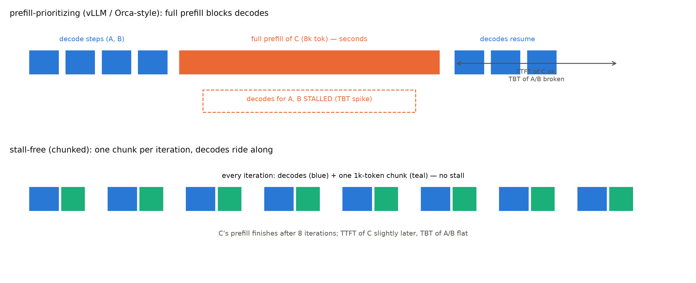
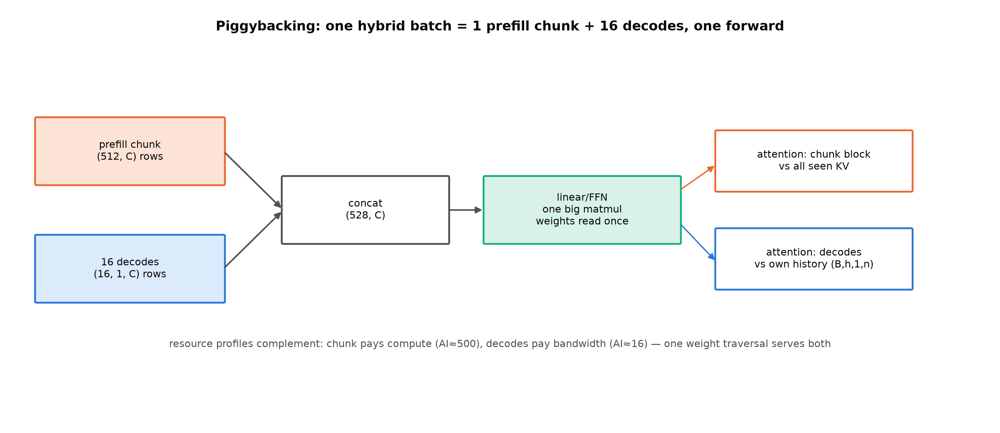
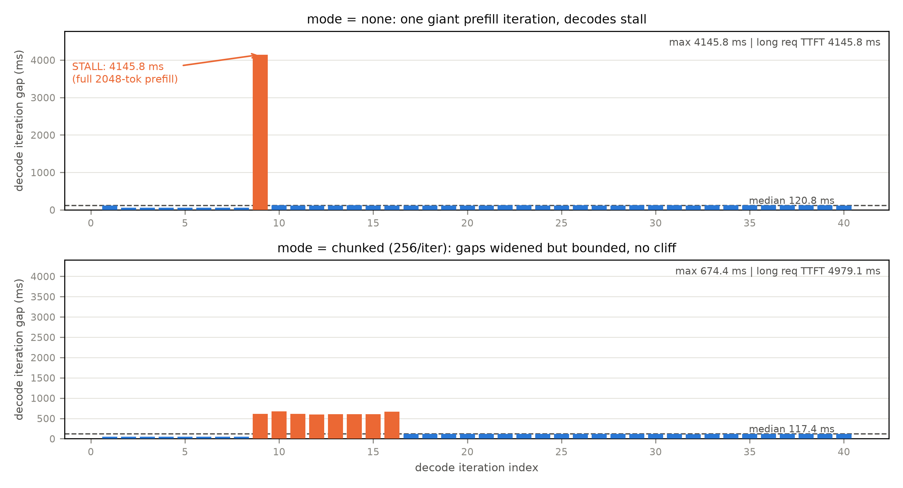
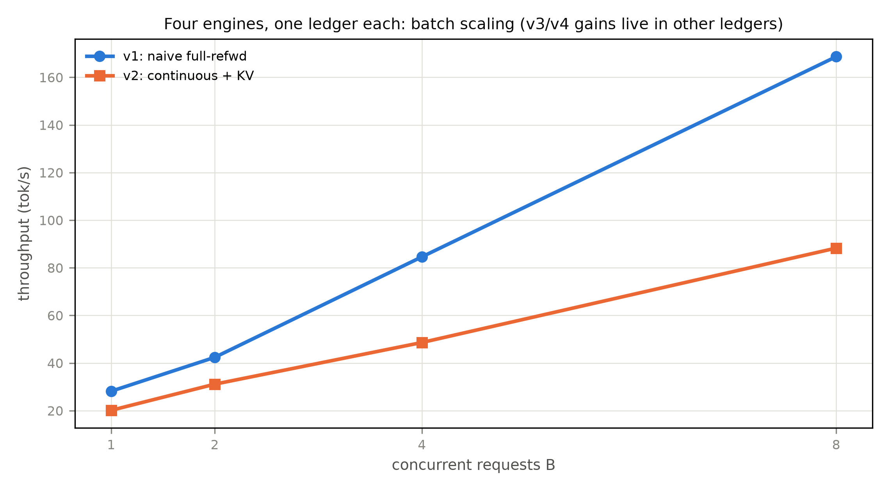

# 第 7 章 分块预填充（chunked prefill）与调度折中（压测收官）

> **最小背景栏**：本章只依赖本册自己的账本——第 1 章的两阶段资源画像（prefill 算力受限/decode 访存受限）与第 4-6 章的四版引擎（v4 的增量前向 `prefill_incremental` 在本章复用为 chunk 化 prefill 的执行机构）。SARATHI/Sarathi-Serve 的引用口径见 notes/03（前者为 arXiv 预印本、无正会版；会议定版是后者，OSDI 2024）。

## 7.1 干扰账：当长 prefill 闯进 decode 的池子

四版引擎各治一病，但还有一个场景谁都没管：批里正安稳地 decode 着，忽然来了一条 8k token 的长 prompt。Sarathi-Serve 给这个现象起了名字——生成停顿（generation stall）——并给了严格定义：「A generation stall occurs when one or more prefills are scheduled in between consecutive decode iterations of a request」——**一个或多个 prefill 被排进某请求相邻两个 decode 迭代之间**【证据等级：官方论文 2403.02310 Fig 7 图注，直引】。论文开篇的实测画像更直观（Fig 1）：Yi-34B 双 A100、128 请求的 arxiv 摘要 trace 下，vLLM 的累计生成曲线多次出现**持续数秒的水平平台**——生成中的请求集体停顿（图 7.1 上轨画的正是它）；同一负载下 P99 TBT 随 QPS 从 ~0.3 秒陡升到 ~1.2 秒【证据等级：官方论文 Fig 1】。对用户这是「卡了一下」——聊天场景里几百毫秒的停顿就能被感知，秒级不可接受。本章要回答的问题是**怎么让长 prefill 与 decode 同池而不互相伤害**，产出三样：一台调度扩展（`sched_v4.py`）、五部曲的全书压测总决算、第三层对拍的工业水位线读数——「造引擎」段在本章收官。顺带钉一个口径：后文的 TBT（time between tokens，相邻两 decode 迭代的间隔）即第 1 章 TPOT 的逐样本口径——SLO 里取它的 P99。

这笔干扰账要**算**出来，不能只引数字（验收点在此）。第 1 章的两阶段画像说：prefill 与 decode 是两种成本结构的活——论文侧的量级（LLaMA-13B/A6000、序列 1024、batch=1）：prefill 每 token 约 0.23 ms（**batch=1 即算力饱和**，加到 batch 18 也几乎不变）、decode 每 token 约 46 ms——「at small batch sizes, the decode cost per token can be as high as ∼200 times the prefill cost per token」【证据等级：官方论文 2308.16369 §1，直引；条件 batch=1，batch 2/18 时 100×/16.7×】。这个 200× 的谱系正是第 1-2 章 roofline 账的实测版：论文 Fig 4b 的算术强度柱状图里，prefill 各算子 batch=1 即达 80-100 FLOPs/byte（屋顶平台段）、decode 的算子只有 2-10（斜坡段，差两个数量级）——**同一个前向，两种成本结构**，200× 就是两段之间的距离。Fig 3 的柱状图还有个视觉细节值得转述：decode 的 batch=1 柱顶超出了 40 ms 的坐标轴顶（被截断）——论文用一根画不下的柱子告诉你差距有多悬殊。200× 反过来读才是干扰账的形状：**一场 8k token 的 prefill 是一个「大迭代」，期间 iteration 级调度器没法插入 decode 步**——设备被计算饱和的活占满，细水长流的 decode 只能等。Sarathi-Serve 还给了一笔好用的换算：一个 decode token 的线性算子成本 $\approx$ 128 个 prefill token 的线性算子成本（Mistral-7B/A100，线性算子占运行时 >80%）【证据等级：官方论文 §3.1+Fig 4 图注】——**decode 是零售价、prefill 是批发价**，混池时批发车堵住零售柜台。我们自己的机器上这笔账同样成立（形态不同）：sched_v4 实测（7.5 节）一场 2048-token 的整段 prefill 让 decode 停摆 4.15 秒——**一个 prefill 迭代 ≈ 34 个 decode 迭代的时长**（$4145.8\div120.8\approx34$，除法亮出来）（教学引擎的 prefill 迭代长在 python 逐 token 税上、工业引擎长在算力饱和上，机制同构、成因各异——7.5 节归因）。TTFT 与 TPOT 此消彼长的根源就在这：**prefill 抢算力则 TPOT 涨（decode 停摆）、保 decode 则 TTFT 涨（prefill 排队）**。第 1 章埋的「指标打架」，到调度层成了具体的工程取舍。



图 7.1 generation stall 机制（自绘示意级；依据 Sarathi-Serve Fig 7 机制改绘——版权档：Sarathi 系图不拷贝）：上轨 prefill 优先调度——整段 prefill 期间 decode 停摆（TBT 尖刺）；下轨 stall-free——每迭代一块 prefill 搭全部 decode。

## 7.2 SARATHI 的切法：把 prefill 切成块、让 decode 搭车

SARATHI（arXiv:2308.16369，预印本——无正会版，会议定版是 Sarathi-Serve）的解法建立在两条实测洞察上：其一，**prefill 吞吐有饱和点**——LLaMA-13B/A6000 上 $B\times L\ge512$ 个 token 即达峰值（~180 tokens/ms），切到 256 一块只边际损失 12.5%；其二，**生产负载的 prefill 够长**（1K-4K token，长文摘要 trace 的中位到 7K）——有得切【证据等级：官方论文 §4.2】。于是定义句：「SARATHI employs chunked-prefills, which splits a prefill request into equal sized chunks, and decode-maximal batching, which constructs a batch using a single prefill chunk and populates the remaining slots with decodes」——**把 prefill 切成等大的块，一块一块地喂；每块与在途 decode 拼批同跑**（搭车，piggybacking——马上展开）【证据等级：官方论文摘要，直引】。

**切开之后，attention 看见什么？**这是机制内核，值得推到「能画出来」。设 20 token 的 prompt 切成 13+7 两块：第一块的 query（第 0-12 位）只看 key 0-12（块内因果掩码）；第二块的 query（第 13-19 位）看 key 0-19——**先前块的 KV 已在第一块执行时写入缓存，本块照读，加上块内因果**。论文的原话给足了底气：「each query token $q_i$ can peek into the keys (and values) of all the tokens preceding it, but not the ones that follow. Setting the attention mask this way ensures that chunked-prefills computation is **mathematically equivalent to the full prefill**」——这样设 mask，切块计算与整段 prefill **数学等价**【证据等级：官方论文 §4.2，直引】。读者应该已经认出来了：这正是第 6 章 `prefill_incremental` 的那把刀——梯形 mask（新 token $i$ 可见 $[0,\text{hit}+i]$）、KV 逐块增量写入、attention 读全历史——**命中免算与 chunked prefill 是同一个机制的两副面孔**（一个的「已算段」来自缓存命中、一个来自先前块），我们的 sched_v4 直接复用它作 chunk 化执行机构。这也是 F4 那笔旧账（KV 侧动因）的血肉：分块之所以可能，正因为 KV 是可增量写入、可按段读取的账本。

**例 7.1（构造例：20 token 切 13+7 的两步走查）** 块大小无约束（末块为余数——Sarathi-Serve 措辞 near equal sized chunks）。**第 1 步**：输入=块 1 的 13 个 token；mask 13×13 块内下三角；执行后位置 0-12 的 K/V 全部在缓存。**第 2 步**：输入=块 2 的 7 个 token（位置 13-19）；mask 7×20——每行可见 $[0, 13{+}i]$（先前块全可见+块内因果）；执行后 20 个位置齐了，末位出 logits。输出读法：两步的打分矩阵拼起来=整段 prefill 的下三角矩阵（可逐格验证）；代价是**第 2 步要重读块 1 的 KV**——prompt 切 $N$ 块时，第一块的 KV 被后续块重读（SARATHI 记 $N$ 次、Sarathi-Serve 记 $N{-}1$ 次——口径差在是否计入本块自身那遍，考据框素材；attention 占前向时间比例小（LLaMA-13B 实测线性段 224.8 ms 对注意力段 10 ms），端到端影响有限【证据等级：官方论文 Table 2+两论文 §4】）。

**拼批怎么拼？**（构造见图 7.2）decode-maximal batching 的构造：一个混合批=单个 prefill 块+用 decode 填满剩余槽位，decode 上限 $B-1$（prefill 块自己的 KV 也要占显存）。执行上线性算子（投影/FFN）把块与全部 decode token **融成单次矩阵乘**——块 $(1{,}512,d)$ 与 16 条 decode 的 $(16{,}1,d)$ 在 token 维拼成 $(528,d)$ 一次过（$d$=隐藏维，第 2 章正身），权重读一遍、decode 白搭车；attention 分开算（decode 们的 attention 互相批、块的 attention 单独跑——第 4 章 selective batching 的老结构）。论文的提炼值得直引：「This hybrid batch provides us with units of work that are both **compute saturating and uniform**」——计算饱和且均匀的工作单元【证据等级：官方论文 §4.3.1，直引】。收益的实物账论文给了一张三行表（LLaMA-13B/A6000 一次迭代）：

**实物 7.1**（piggyback 的账；看什么——decode 每 token 从 12.49 到 1.2 ms，混合批总时间只多 3.6 ms）

```text
prefill-only (4×1024 tok):        234.8 ms   (线性 224.8 + 注意力 10.0)   0.229 ms / prefill token
decode-only  (bs=4, seq 1024):     49.96 ms                              12.49 ms / decode token
decode-maximal (1021 tok 块 + 3 decode): 238.4 ms   0.229 ms/token;  1.2 ms / decode token
```

【证据等级：官方论文 SARATHI Table 2，逐字段直录】三个读数各停一秒：搭车后 **decode 每 token 12.49→1.2 ms（约 10×）**；代价只是混合批比纯 prefill 批多 3.6 ms（decode 的边际成本几乎只剩 attention）；1021=1024−3 不是笔误——块取 1021 恰好让「块+3 个 decode」凑成 tile（128）的整倍数，**tile 量化**的活例（跨过 tile 边界的代价惊人：块 257 比 256 的 prefill 时间多 32%——kernel 按固定 tile 切活，多一个 token 就多一整块 tile【证据等级：官方论文 §4.4】）。



图 7.2 piggybacking 拼批构造（自绘示意级）：512-token 块与 16 条 decode 拼成一次前向——线性段一次大矩阵乘（权重读一遍）、attention 分开算；两段资源画像互补（块吃算力 AI≈500、decode 吃带宽 AI≈16）。

拼批的经济学还有个精确的最优点值得算：设批内 prefill:decode 的 token 数比为 P:D，块长 $C$、批上限 $B$——长 prompt 切成 $P/C$ 块，需要 $D/(B{-}1)$ 个迭代让全部 decode 搭完车，增益峰值出现在两者相等处：
$$
\text{P:D}=\frac{C}{B-1}
\tag{7.1}
$$

| 符号 | 含义 | 量纲 |
|---|---|---|
| $C$ | 块长（本节记号——勿与第 4 章隐藏维 $C$ 混淆） | token |
| $B$ | 批上限 | 条 |
| $\text{P:D}$ | 批内 prefill:decode token 数比 | — |

（论文例：$C{=}256$、$B{=}18$ 时实测峰值落在 P:D≈14——按式 $256/17\approx15.1$，原文如此照录；增益 1.27×【证据等级：官方论文 §4.4】。）这个比值的含义一句话：**让 prefill 的块数恰好够 decode 们每块搭一次车**——多则块太碎、少则有人没搭上。「计算饱和且均匀」的均匀性还有一笔远期红利（本章点到）：流线并行里相邻微批执行时间越均匀气泡越小——等计算量的混合批天然压气泡，SARATHI 的 PP 仿真报中位每请求气泡时间降 6.29×、端到端 1.91×（对 Orca 式 TP-PP 基线；对 8 副本纯 TP 部署为 1.48×）【证据等级：官方论文 §5.3】——第 12 章讲并行拓扑时这条线回来。

会议定版 Sarathi-Serve 把这套思想推到服务级：**无停顿调度**（stall-free scheduling）——「allows new requests to join a running batch without pausing ongoing decodes」【证据等级：官方论文 §1，直引】。调度循环（论文 Algorithm 3）的装填顺序三级递进：**先装全部在跑请求的 decode token→再续装未完成 prefill 的下一个块（受剩余 token 预算约束）→最后才在预算内接纳新请求**。每个迭代被节流到固定 token 预算 $\tau$——迭代延迟封顶、且几乎不随 prompt 总长变化。与 Orca 式混合批的区别要钉死：Orca 也拼混合批，但它把**整段** prefill 拼进去——批执行时间仍可长达秒级；实测整段拼入使 TBT 最高恶化到 decode-only 批的 **28.3×**，分块后影响大幅收窄【证据等级：官方论文 §4.2+Fig 9】——**切块不是锦上添花，是混合批能用的前提**。论文还给整片调度空间立了一幅概念地图（Fig 2）：现有调度器二分——**prefill 优先**（Orca/vLLM：有显存就贪婪收新 prefill，吞吐高但 TBT 尾延迟高）对 **decode 优先**（FasterTransformer 式：整批 decode 完才收新 prefill，TBT 平滑但吞吐低）——两个族各自卡在吞吐-延迟权衡线的两端，stall-free 从中间穿过去（吞吐与低 TBT 同时拿下）。这张平面图值得记住：**评价一个调度器，先在「谁优先」的坐标系里给它定位**。

**chunked prefill 为什么同时救 TTFT 与 TPOT 两边？**救 TPOT 的一半已讲（停顿摊薄）；救 TTFT 的一半常被漏掉：不切的世界里，一条新请求要等**在途长 prefill 整体跑完**才轮得到进批——排队项以秒计；切了的世界里，它等的是一个迭代的预算余量、下一步就能以块为单位插队。**例 7.2（构造例：TTFT 排队消减）** 设 8k prefill 在途（不切：占用 3.2 秒；切：16 个迭代、每迭代 200 ms）。新请求 $t$ 时刻到达，两个世界对照：

| 世界 | 新请求最坏等待 | TTFT 构成 |
|---|---|---|
| 不切 | 3.2 秒（在途整体） | 排队 3.2s + 自己的 prefill |
| 切 | 200 ms（一个迭代） | 排队 0.2s + 自己的 prefill 分块推进 |

输出读法：**排队项从「在途总量」缩到「一个迭代」**——TTFT 救的其实是排队的那一半。7.5 节的 A/B 实测量的是同一枚硬币的两个尺度：停顿总长（none 的 4.15 秒悬崖）与迭代粒度（chunked 的间隔有界）——自身摊薄的代价则反过来记在 TTFT 变长上。

效果证据群按机制链读：**capacity**（系统在满足延迟目标下能支撑的最大 QPS；口径=TTFT 中位+TBT P99 双 SLO——每请求一次 TTFT 取中位、每 decode token 一个 TBT 样本取 P99，SLO 阈值取无干扰 decode 迭代的 5×（严格，聊天类）/25×（宽松））下，Sarathi-Serve 对 vLLM：Mistral-7B 单卡 2.6×、Yi-34B 双卡 3.7×、Falcon-180B（PP）5.6×；LLaMA2-70B 档 4.3×（vs Orca 6.3×）【证据等级：官方论文 §5.1】。一个漂亮的对照实验（Fig 12）：vLLM 把 max batch size 调到 32/64/128 三档，严格 SLO 下 capacity 几乎不动——**PagedAttention 释放的大批能力在延迟约束下用不上**，而 Sarathi-Serve 靠调 token 预算（严格档 512、宽松档 2048）精确控制这条折中。消融把「必须合用」钉死：只混合不切块（hybrid-only）TBT P99 0.68 秒（长 prefill 仍致 stall）、只切块不混合（chunked-only）TTFT 1.04 秒（分块略降 prefill 效率）、联合 0.14 秒/0.76 秒【证据等级：官方论文 §5.4.2+Table 4，Yi-34B 档】。诚实的代价侧（Fig 14）：分块本身让 prefill 计算变慢——块 512 时开销至多 ~25%（2K prompt 处峰值），2048 几乎可忽略——**切块不是免费的，块大小是「干扰摊薄 vs 计算效率」的又一旋钮**【证据等级：官方论文 §5.4.1】。

## 7.3 抢占：极端压力下的最后一手

预算守不住时会怎样？并发洪峰下 KV 显存告急——活跃集装不下这么多在途请求。此时调度器只剩坏选项：**抢占**（preemption）——把某些请求整个请出去腾位置。触发机制是**水位线**：阅读锚（v0.30.0）的调度器配置里有显式的 watermark 字段（「准入时保持空闲的 KV 块比例……避免显存紧张时频繁驱逐与反复抢占」）——默认 **0.0**，即默认不留冗余、靠抢占兜底【证据等级：本机源码口径，v0.30.0 vllm/config/scheduler.py——实现对照框身份】。

三难各有价格签，逐项展开成一笔可算的账——**例 7.3（构造例——费率取 SARATHI Table 2 实测口径）**：一条 4k-token prompt 的请求被逐，三条路的价格签：

| 选项 | 丢什么 | 重付多少 | 额外代价 |
|---|---|---|---|
| 抢占-重算（recompute） | 全部 KV | $4096\times0.229\text{ms}\approx0.94$ 秒批发价算力 | — |
| 抢占-换出（swap） | KV 搬主机 | $4096\times800\text{KB}\approx3.2$ GB、PCIe 往返各 ~0.13 秒（估） | 两套内存管理+主机常驻+异步复杂度 |
| 拒绝（排队/503） | 这单生意 | — | SLA 违约与用户流失的账 |

读法：**三条路都没有免费——只是账单科目不同**（算力/复杂度/SLA）。纸面上换出更快，真实引擎怎么选的？阅读锚（v0.30.0）的文档一句话定谳：「In vLLM V1, the default preemption mode is `RECOMPUTE` rather than `SWAP`, as recomputation has lower overhead in the V1 architecture」【证据等级：本机源码口径，docs/configuration/optimization.md——实现对照框】。V1 的实现是纯重算三步：释放该请求全部 KV 块、已算计数清零、插回等待队列头【证据等级：本机源码口径，v1/core/sched/scheduler.py——行级锚在 Book7】。swap 路的历史与被淘汰值得一句（它接住第 6 章的线）：CPU 换出原为 beam search 时代的分支共享设计，V1 移除了它，官方理由是**前缀缓存证明自己是更好的选项**——块可按需慢驱逐、被驱逐的部分可重算（重算的批发价在有前缀缓存的架构里变得更便宜了）【证据等级：本机源码口径，docs/design/metrics.md 历史段】。谁先被逐，阅读锚的正身与「按占用账挑最贵者逐」的直觉**不一样**：V1 默认 FCFS 策略逐的是**运行队列尾部**——最新进批的请求（它累计的进度最少、重算浪费最小）；PRIORITY 策略才按 (priority, arrival_time) 选最低优先级者【证据等级：本机源码口径，v1/core/sched/scheduler.py#L748-753，阅读锚 v0.30.0】。直觉里的「占用账」在真实系统里让位给了「进度账」——牺牲最新来客、保护最早来客的已付投入。谱系侧一笔带过：FastServe（arXiv:2305.05920）把抢占做成了主线机制（按剩余长度抢占的调度），其 31.4×/17.9× 是「同延迟约束下吞吐」口径且系自报——引用带好限定语。**压力工程的第一课：不是让一切都不失败，而是失败得有章法。**

至此折中三角凑齐了三个角与两把旋钮：**TTFT**（新请求多快进批）、**TPOT**（在途请求多稳）、**吞吐**（设备多满）；旋钮一是 **token 预算**（每迭代拼批上限），旋钮二是 **chunk 大小**（切多细）。给预算一个量化坐标：预算 512 时一条 8k prefill 要 16 个迭代推进完（每迭代 decode 搭车、TPOT 稳，但这条请求的 TTFT 拉长）；预算 2048 时 4 个迭代推完（TTFT 短，但每个迭代更肥、TPOT 间隔变大）——**预算就是在「新请求的等待」与「在途请求的平稳」之间按 token 数划线**。注意两把旋钮不是一回事：预算管「迭代里装多少活」、块大小管「一个请求的 prefill 切成几份」——Sarathi-Serve 里它们是不同参数（实验取值：严格 SLO 用 512、宽松用 2048，70B 的 PP 档特取 1536 压气泡【证据等级：官方论文 §5.1】），vLLM 的 `max_num_batched_tokens` 一族对应前者（实现对照框身份，正身见 7.4 节）。

**例 7.4（构造例：token 预算 16 的两步装填走查）** 调度器每迭代的 token 预算=16。当前在途：3 条 decode（各需 1 token/步）+ 一条 20 token 的新 prefill 到达。**第 1 步**：输入=预算 16、3 条 decode（3 token）、新 prefill；按三级装填——先装 decode（用 3、余 13）→再装 prefill 第一块 13（用 13、余 0）→无新请求可纳；批组成=13+3=16，一次前向（decode 搭车）；prefill 剩 7。**第 2 步**：输入=预算 16、同批 3 条 decode；decode 3（余 13）→prefill 尾块 7（余 6）→**余量 6 还能再纳一条新请求的小块**。输出读法：两步走完 prefill、decode 无一步停摆；预算这个「迭代上限」同时决定了 decode 间隔的上限（每步必进）与 prefill 的推进速度（$20\div13\to2$ 步）——**谁进批谁等待，全在预算的除法里**。**没有最优值，只有负载定义的最优区间**——参数扫描实验（B6-1 的欠账）正是找区间的手艺。

## 7.4 落地证据：从论文机制到默认配置

chunked prefill 从论文走到默认配置的落地链，可以在阅读锚里逐环验证（实现对照框，版本框注 v0.30.0）：

**实物 7.2**（调度器配置源码；看什么——三行：默认值、真值去处、启用日志）

```python
# repos/vllm/vllm/config/scheduler.py#L116-122 (v0.30.0 = ced6857)
enable_chunked_prefill: bool = True
# "If True, prefill requests can be chunked based on the remaining
#  `max_num_batched_tokens`. The default value here is mainly for convenience
#  when testing. In real usage, this should be set in EngineArgs..."
# 启用时日志: "Chunked prefill is enabled with max_num_batched_tokens=%d."
```

【证据等级：本机源码，阅读锚 v0.30.0】配置默认开、真值由 EngineArgs 按模型是否支持决定（is_chunked_prefill_supported——pooling/encoder-only 等返回 False）；官方文档的口径是「In V1, chunked prefill is enabled by default **whenever possible**……调度策略优先 decode：先装完所有待处理 decode，再用 `max_num_batched_tokens` 预算装 prefill、装不下的自动切块」【证据等级：本机源码口径，docs/configuration/optimization.md】。V1 调度器的心智模型藏在一段源码注释里，值得整句引（它把本册四章的机制统一成了一个视角）：「There's no "decoding phase" nor "prefill phase" in the scheduler. Each request just has the num_computed_tokens... This is general enough to cover **chunked prefills, prefix caching, speculative decoding**...」——V1 调度器里**没有 prefill 相与 decode 相**，每个请求只有「已算 token 数」和「待算 token 数」，每步在预算内让前者追赶后者【证据等级：本机源码注释，v1/core/sched/scheduler.py NOTE——行级锚在 Book7】。预算组织的实现（两级预算+双队列循环「装满为止」）与 B6-4 钩的 phase-less 决策循环正是同一件事——那是 Book7 第 5 章的正餐。从论文机制到默认配置的落地链至此逐环验证。

> **【考据框】两处版本口径的边角料。**其一，KV 重读次数两论文算法不同：SARATHI 记第一块被读 $N$ 次、Sarathi-Serve 记 $N{-}1$ 次——差在是否计入本块自身那一遍（分母口径之差，不是分歧）。其二，摘要措辞从 SARATHI 的 equal sized chunks 演化为 Serve 的 near equal sized chunks（末块为余数——「等长块」的诚实版）。其三，网传 v0.6.0 博客「1.7×」经双通道逐字核对**证伪**（博客全文无 chunked 字样）——版本史只信配置文档与源码，数字只信能逐字复核的出处。

## 7.5 mini 引擎调度整合与全书压测收官

本章教的机制在本册的实验落地是 `sched_v4.py::run_mode`（v4 之上加 token 预算与 chunk 化 prefill 的最小 patch；chunk 化执行机构直接复用 `engine_v4.py::prefill_incremental`——7.2 节已认亲）。workload：4 条 decode 在途（128 prompt × 40 步），第 8 步一条 **2048-token 长 prefill 闯入**；两档调度对比——**none**（整段前向，stall 的教学复现）与 **chunked**（每迭代 256 一块+decode 搭车，背靠背的教学形态）：

**实物 7.3**（干扰复现 A/B 读数；看什么——尖峰两行与长请求 TTFT 两行）

```text
[none   ] decode 间隔尖峰 4145.8 ms | 中位 120.8 ms | 长请求 TTFT 4145.8 ms
[chunked] decode 间隔尖峰  674.4 ms | 中位 117.4 ms | 长请求 TTFT 4979.1 ms
[结论] 尖峰比 none/chunked = 6.1×（预注册 >4×）
```

【证据等级：本机实测，Atlas 910B3，bf16，块 32，`log/book6-ch07/sched_v4_base.json`（gap 逐迭代序列在档）】四行读出折中三角的全部三边。**其一，TPOT**：none 档 decode 停摆 4.15 秒——中位间隔的 **34 倍**（图 7.3 上幅的悬崖）；chunked 档没有悬崖，但间隔被加宽到 674 ms（图 7.3 下幅）——教学引擎的 python 逐 token 税让「每块 256」的前向要 ~505 ms（逐迭代净块前向 482-557 ms）（工业引擎这会是毫秒级、间隔几乎全平——融合 kernel 的差距，第 12 章图执行再算）。**其二，TTFT**：长请求在 chunked 档反而多等 20%（4146→4979 ms）——同量 prefill 摊进 8 个迭代、每迭代还背一步 decode，且教学版另有逐块常数税（正是 7.2 节 Fig 14「切块不免费」的本地版）。**其三，吞吐**：两档迭代数相同（40）、总计算同量——**分布不同**就是全部区别。预注册三条（尖峰比 >4×/TTFT 略涨/墙钟同量级）全部兑现；归因诚实句：教学引擎的 stall 长在 python 税上、工业引擎长在算力饱和上——**机制同构（一个长迭代阻塞 decode），量级不同源**。



图 7.3 干扰复现 A/B 的 decode 迭代间隔序列（自产，喂 `sched_v4_base.json`）：上幅 none——4.15 秒悬崖（=整段 prefill 时长）；下幅 chunked——间隔加宽但有界、无悬崖。

五部曲至此讲完（静态之弊→连续批处理→分页→前缀缓存→分块预填充），mini 引擎的账本总决算（`bench_sweep.py::main`，四版同 workload 同种子；表 7.1）。第 4 章开篇直引的那句「故意留笨」明文口径，此刻可以整个划掉了——四版引擎把三宗罪逐一清账，本章又补上第五级台阶；回收的叙事与回收的机制同构：**每一级都不是让旧账变小，而是让旧账的科目消失**。

表 7.1 批处理五部曲×四版引擎总决算（「新常量」列=每版交给运营者的旋钮）

| 部曲 | 版本 | 解决什么 | 关键读数（本机实测） | 新常量 |
|---|---|---|---|---|
| ①静态之弊 | v1 | （反面教材） | 浪费位 113/496=22.8%；吞吐 139 tok/s | 批大小 |
| ②连续批处理 | v2 | 浪费位、$O(n^2)$ 重算 | 浪费位 0；TPOT 均 59 ms | 活跃集上限 |
| ③分页 | v3 | 买断浪费、外部碎片 | KV 账 48→34.5 MiB（省 28.1%）；同池并发 724 对 64 | 块大小 |
| ④前缀缓存 | v4 | 重复前缀 | 命中 66.7-86.6%（三场景）；TTFT 稳态折扣 3.4-5.2× | 缓存容量 |
| ⑤分块预填 | sched_v4 | 长 prefill 干扰 | 尖峰比 6.1×；无 4 秒悬崖 | token 预算+块大小 |

三级台阶读法之外补两条。**「台阶的正交性」**：五级台阶作用于不同账目科目（浪费位/碎片/命中率/TPOT 平稳），原则上可叠乘——但每级只在自己的负载形态下有收益（无重复前缀则 v4 白开、无长 prefill 则 ⑤ 白等），**引擎配置是负载形状的函数**——容量规划（Book8 第 11 章地界）的第一次预告。**「每版新常量」**：表的末列连起来读是一部**参数空间扩张史**——v1 一个旋钮，到 sched_v4 五个；引擎调参的本质是给这些常量找负载定义的值（B6-1 的参数扫描正为此预留）。两处读数的口径注补上：v3 峰值 3494 MiB 里含 3.0 GiB 块池预分配（教学一步到位口径，非分页更费显存）；v3 吞吐 40.5 tok/s 对 v2 的 85（gather 税+逐 token 入块税，5.3 节立过账）。

**第三层对拍**收最后一个水位：真实引擎（`bench_vllm_tpot.py::main`；vllm 运行栈 0.27.1+vllm-ascend、Qwen3-0.6B、贪心；图 7.4 见下）单请求每 token 均摊 **8.9 ms**【证据等级：本机实测，Atlas 910B3，运行栈 0.27.1+vllm-ascend 0.27.1rc1，Qwen3-0.6B 贪心】——读数口径照纪律交代：两轮生成、报暖机后的第二轮（首轮含 kernel 编译与图捕获的暖机，这正是 6.5 节「读数分冷热」的又一次实践）；「均摊」=生成墙钟÷token 数（TTFT 摊入，非严格 TPOT——离线接口拿不到首 token 时刻，如实标注）。对手写步进的 59 ms 约 **6.6×**，差距的成分（融合 kernel、C++ 调度循环、图执行）正是「教学引擎与工业引擎」的那一公里，第 12 章起逐项兑现。趋势级对照、绝对数不可比（模型不同、成熟度不同）——本册对照纪律的最后一次示范。



图 7.4 四版引擎吞吐对照（自产，收官图——生成脚本已并入 `fig_ch07.py`）。读法两句：其一，曲线只画 v1/v2 的并发扫描（v1 近线性 28→169、v2 斜率缓 20→88——4.6 节的归因账），v3/v4 是单点（其增益不在吞吐轴上——v3 省显存、v4 省 TTFT，各在各的账本里）；其二，**每版的正确读法是「它消灭了哪本账」而不是「它跑得多快」**——吞吐轴只是五本账里的一本。并发扫描的完整数据在 `log/book6-ch04/ch06/` 各 JSON。

## 7.6 本章小结

F4 的最后一笔（KV 侧动因）在此收线：chunked prefill 的可行性全系于 KV 是一本可增量写入、可按段读取的账——第 6 章的增量前向与本章的切块执行是同一机构的两副面孔。**带走的心智**：两幅画。**其一，五部曲的本质是把「一批」拆成「一池资源」逐步细化产权**——批（v2：时隙归调度器）、显存（v3：块归块池）、缓存（v4：前缀归树/哈希链）、算力（chunked：迭代归预算）——每一部都在回答「这一种资源归谁管、按什么单位流转」。**其二，调度折中没有最优解、只有负载定义的区间**——TTFT/TPOT/吞吐三角上，token 预算与块大小两把旋钮拧的不是「对」的位置，而是「与你家负载匹配」的位置；判断一个引擎的调度器，先看它把哪些旋钮交给了你。

镜头拉回全书：「造引擎」第二段至此收官——四版引擎+一台调度扩展、五部曲机制、一张总决算表；第 4 章立下的「机制红利与工程红利两层账」在总决算表里各归各位。第三段开始逐项榨深度，先从最贴近算子的那层：注意力 kernel——分页的 gather 税、手写层的两百 kernel 串行，都将在那里找到工业解法。

> **【欠账】** 本册的调度折中在真实引擎里是一个每步都跑的 phase-less 决策循环（预算、抢占、缓存感知的取舍代码化）——V1 调度器的源码正身。→ Book7 第 5 章

## 动手验证

```bash
cd 工作区根目录 && source env.sh
# ① 干扰复现 A/B（实物 7.3/图 7.3 数据源；NPU 分钟级，先 npu-smi 选卡；fast 档=--smoke）
ASCEND_RT_VISIBLE_DEVICES=<卡> python "code/ch07/sched_v4.py"
#   验收行：尖峰比 6.1×（none 4145.8 / chunked 674.4）| 长请求 TTFT 4146→4979 ms
# ② 四版收官与并发扫描（表 7.1 数据源；fast=--fast-scan（B∈{1,4}），full=四档）
ASCEND_RT_VISIBLE_DEVICES=<卡> python "code/ch07/bench_sweep.py" --fast-scan
# ③ 第三层对拍水位（vllm 运行栈黑盒；引擎初始化 ~2 分钟，暖机两轮）
ASCEND_RT_VISIBLE_DEVICES=<卡> python "code/ch07/bench_vllm_tpot.py"
#   验收行：每 token 均摊 8.9 ms（Qwen3-0.6B）
# ④ 本章四图（图 7.1/7.2/7.3 由 fig_ch07.py 生成；图 7.4=四版对照亦已并入）
python "code/ch07/fig_ch07.py"
# ⑤ 正主：arXiv:2308.16369（SARATHI，预印本）/ 2403.02310（Sarathi-Serve，OSDI'24）——
#    Fig 3（200× 柱状）、Table 2（piggyback 账）、Fig 6（块内 mask）、Fig 7（四系统时间线）
```
