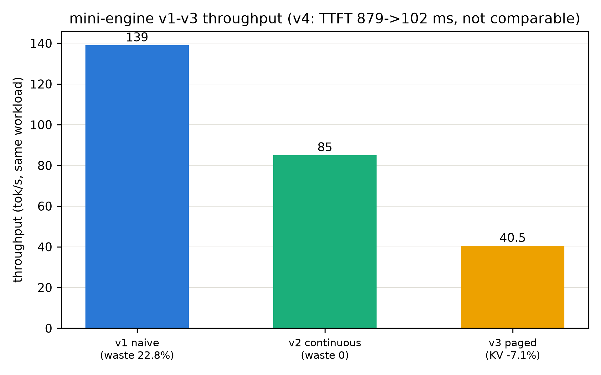

# 第 7 章 Chunked prefill 与调度折中（压测收官）

> **最小背景栏**：本章只依赖本册自己的账本——第 1 章的两阶段资源画像（prefill 算力受限/decode 访存受限）与第 4-6 章的四版引擎。SARATHI/Sarathi-Serve 的引用口径见 notes/03（前者为 arXiv 预印本、无正会版；会议定版是后者，OSDI 2024）。

## 7.1 干扰账：当长 prefill 闯进 decode 的池子

四版引擎各治一病，但还有一个场景谁都没管：批里正安稳地 decode 着，忽然来了一条 8k token 的长 prompt。它的 prefill 是一场算力盛宴（第 1 章的画像）——大矩阵乘铺满计算单元；同池的 decode 步是细水长流的小 kernel。盛宴开席时细水断流：**长 prefill 独占算力的那几秒里，全批 decode 集体停摆**——这就是 generation stall（生成停顿），Sarathi-Serve 论文（OSDI 2024）开篇图画的正是这幅时间线。

把 stall 画成时间线（图 7.1 占位：上轨 decode 的等步长小步、下轨一条 8k prefill 的大块横插进来——大块期间上轨出现一段空白，空白尽头标 TPOT 尖峰）。对用户这是「卡了一下」——聊天场景里几百毫秒的停顿就能被感知，秒级则不可接受。这笔干扰账的量级可以粗算：SARATHI 论文摘要给的口径——**decode 每个 token 的成本可达 prefill 的约 200 倍**（同等算力下，等价于说 prefill 一个 token 的开销只有 decode 的二百分之一）。用人话说：prefill 是批发价、decode 是零售价。混池时批发车堵住零售柜台，TTFT 与 TPOT 此消彼长的根源就在这——**prefill 抢算力则 TPOT 涨（decode 停摆）、保 decode 则 TTFT 涨（prefill 排队）**。第 1 章埋的「指标打架」，到调度层成了具体的工程取舍。

## 7.2 SARATHI 的切法：把 prefill 切成块、让 decode 搭车

SARATHI（arXiv:2308.16369）的解法直白而漂亮：**把长 prefill 切成等大的块（chunk），一块一块地喂**。原文定义一句直引：「chunked-prefills, which splits a prefill request into equal sized chunks」（切分请求为等大的块）。切了之后干嘛？**每块 prefill 与在途的 decode 拼批同跑**——decode 的 token 搭 prefill 块的车（论文把这个机制叫 piggybacking，搭便车）：prefill 块吃算力、decode 吃带宽，两类负载的资源画像恰好互补（第 1 章两阶段画像的直接应用！）——拼批后两种资源同时开工，谁也不闲着。

piggybacking 的资源账值得单独算一遍，因为它是「两阶段画像」最漂亮的工程应用。一块 512 token 的 prefill 块：FLOPs $\approx 2 \times 207\text{M} \times 512 \approx 0.21$ TFLOP、bytes $\approx$ 414 MB（权重一遍）——算术强度约 500 FLOP/Byte，屋顶平台段。同批 16 条 decode：合计 16×0.41 GFLOP $=$ 6.6 GFLOP、bytes $=$ 414 MB（权重共享一遍）——强度 16 FLOP/Byte，斜坡段。**拼批后 414 MB 的权重搬运两个房客分账：prefill 出算力、decode 出「顺路」**——各取所需的字面意思。这就是拼批不只是「凑数」而是「互补」的原因。停顿从「一次几秒」变成「每步几毫秒的摊薄」。会议定版 Sarathi-Serve 把这个思想推到服务级：**stall-free scheduling**（无停顿调度）——调度器保证任何 decode 步不被新 prefill 整体阻塞，报的容量提升 2.6-5.6×（对 vLLM，Mistral-7B 到 Falcon-180B 场景【官方论文】）。

预算这个旋钮值得再给它一个量化坐标：预算=每步拼批的 token 上限。它同时是三件事的上限——单步计算量（TTFT 波动的粒度）、长 prefill 的推进速度（完成时间≈长度÷预算×步时延）、以及 decode 的间隔上限（每步至少跑一次 decode 的保证由此而来）。设预算 512：一条 8k prefill 要 16 步推进完——每步里 decode 搭车走一步，TPOT 稳；预算 2048：4 步推完、TTFT 更低、但每步的计算块更肥（TPOT 的间隔变大）。**没有最优预算，只有负载定义的最优区间**——这正是「参数扫描」实验的意义（B6-1 欠账的另一面）。

**例 7.1（构造例：token 预算 16 的两步调度走查）**：调度器每步的 token 预算是 16（拼批上限）。当前在途：3 条 decode（各需 1 token/步）+ 一条 20 token 的新 prefill。**第 1 步**：decode 3 个 token（3 预算）+ prefill 切第一块 13 token——拼成 16 的批，一次前向（decode 搭车）；prefill 还剩 7。**第 2 步**：decode 3 + prefill 尾块 7 = 10 预算（余量 6 可再纳新请求）。两步走完：prefill 完成、decode 无一步停摆。**预算就是折中旋钮**：预算小则 TPOT 稳（decode 占比高）而 TTFT 涨（prefill 切得碎、完成得慢）；预算大则反之——真实引擎把它做成配置项（`max-num-batched-tokens` 一族），第 12 章 B6-1 的欠账正指向它的扫描实验。

## 7.3 抢占：极端压力下的最后一手

预算守不住时会怎样？并发洪峰下 KV 显存告急——活跃集装不下这么多在途请求。此时调度器只剩坏选项：**抢占**（preemption）——把某些请求整个请出去（它的 KV 或丢弃或换出），腾位置保住其余。被抢占的请求之后重来做（prefill 重算或从换出的 KV 恢复）。FastServe（arXiv:2305.05920）把抢占做成了主线机制（剩余长度可抢占的调度）；它的 31.4×/17.9× 数字是「同延迟约束下吞吐」的口径且系自报——引用时带好限定语。三难各自的价格签：**抢占-重算**（丢 KV、回来重 prefill）——浪费该请求已付的全部 prefill 计算，适合「它还要很久」的长请求；**抢占-换出**（KV 搬到主机内存）——省重算但付传输与管理的复杂度（KV 换入换出的带宽账）；**拒绝**（排队或 503）——把压力推给上游，保住在途请求的体验。真实引擎按请求进度与 KV 大小动态选择（刚 prefill 完的长请求被换出最亏——它的 KV 最贵；快完成的短请求最不该动）。压力工程的第一课：**不是让一切都不失败，而是失败得有章法**。

## 7.4 vllm 的落地证据（阅读锚对照）

chunked prefill 从 vLLM v0.6.0（2024-09 的性能博客）起对长上下文默认开启【厂商自报】；在阅读锚源码（v0.30.0）里，`enable_chunked_prefill` 的默认值是 `True`（vllm/config/scheduler.py 第 116 行——本仓浅克隆 grep 实证）——V1 调度器按 token 预算组织 prefill 块与 decode 的混合批。从论文机制到默认配置，一条线走通。运行栈（0.27.1）上的实测数字属于实验章的地界，本册对照框只钉源码事实（版本框注：阅读锚 v0.30.0、运行栈 0.27.1——口径纪律照 C-2）。

## 7.5 全书压测收官：四版引擎的增益分解

五部曲讲完（静态之弊→连续批处理→分页→前缀缓存→分块预填充），mini 引擎的账本可以总决算了（`bench_sweep.py`——含并发扫描档）：

**实物 7.1（四版引擎收官读数，出处：本机实测，同 workload 同种子；吞吐对照见图 7.3——）**

| 版本 | 解决什么 | 关键读数 |
|---|---|---|
| v1 naive | （反面教材） | 吞吐 139 tok/s；浪费位 22.8%；峰值 666 MiB |
| v2 连续批+KV | 浪费位、O(n²) | 浪费位 0；TPOT 59 ms；峰值 498 MiB |
| v3 分页 KV | 买断浪费、外部碎片 | KV 显存 −7.1%（教学负载）；浪费限一块内 |
| v4 前缀缓存 | 重复前缀 | 命中 66.7%；TTFT 879→102 ms（8.6×） |

增益分解的读法还要加一条**「台阶的正交性」**：五级台阶作用于不同的账目科目（浪费位、碎片、命中率、TPOT 平稳），所以原则上可叠乘——但每级台阶只在自己的负载形态下有收益（无重复前缀则 v4 白开、无长 prefill 则 ch7 白等）。**引擎配置是负载形状的函数**——这是容量规划（Book8 第 11 章的地界）在本册的第一次预告。并发扫描（v1/v2 在 B∈{1,2,4,8}）另有一张关键证据：v1 的吞吐随 B 近线性涨（28→43→85→169 tok/s）——批处理摊薄权重的基本盘；v2 同样涨但斜率缓（20→31→49→88）。两条曲线的每一点差距都是「手写执行层的 python 税」——而机制账（浪费位、TTFT 语义）在 v2 侧全部占优。四版对照表的读法最后补一个视角——**每版引入的新常量**：v1 常量=批大小（运营定）；v2 常量=活跃集上限（并发约束）；v3 常量=块大小（表项与碎片的折中）；v4 常量=缓存容量（命中率与显存的折中）；ch7 常量=token 预算（TTFT 与 TPOT 的折中）。**引擎调参的本质=给这些常量找负载定义的值**——五部曲不只是机制史，也是参数空间的扩张史。**第三层对拍**补上水位线：真实引擎（vllm 运行栈、同量级小模型）的单请求 decode TPOT 在 10-20 ms 量级——比我们的手写步进快 2-3 倍，差距的成分（融合 kernel、C++ 调度循环、图执行）正是「教学引擎与工业引擎」的那一公里。趋势级对照，绝对数不可比（模型不同、成熟度不同）——这两句是本册对照纪律的最后示范。

增益分解的瀑布于是长这样（把四步的「解决什么」串成一句话）：**批处理摊权重（吞吐基本盘）→ 连续调度消浪费（浪费位科目取消）→ 分页消碎片（容量利用率）→ 缓存消重复（TTFT 折扣）→ 分块消干扰（TPOT 平稳）**。五级台阶，每一级都只解决自己那一个问题——引擎没有银弹，只有一摞各管一段的扳手。

## 7.6 本章小结

F4 的最后一笔（KV 侧动因——chunked prefill 的拼批正是为了 KV 与算力的错峰）在此收线。带走的心智：**调度的本质是给「不同资源画像的活」排班——prefill 是批发、decode 是零售，chunked prefill 把批发拆成零售能搭车的小件；预算是折中旋钮、抢占是压力下的坏选项但必须有**。第二段「造引擎」至此收官：四版引擎、五部曲机制、一张增益分解瀑布。第三段开始逐项榨深度——先从最贴近算子的那层：注意力 kernel。

> **【欠账】** 本册的调度折中在真实引擎里是一个每步都跑的决策循环（预算、抢占、缓存感知的取舍代码化）——它的源码正身 → Book7 第 5 章

## 动手验证

- 压测收官与扫描：`source env.sh && ASCEND_RT_VISIBLE_DEVICES=<卡> python code/ch07/bench_sweep.py`（四版对照+并发扫描+增益瀑布；产物 `log/book6-ch07/`）
- SARATHI/Sarathi-Serve：arXiv:2308.16369 / 2403.02310（notes/03 §0：前者无正会版）
- 阅读锚默认值自查：`grep -n "enable_chunked_prefill" repos/vllm/vllm/config/scheduler.py`（本仓浅克隆实证行号）
