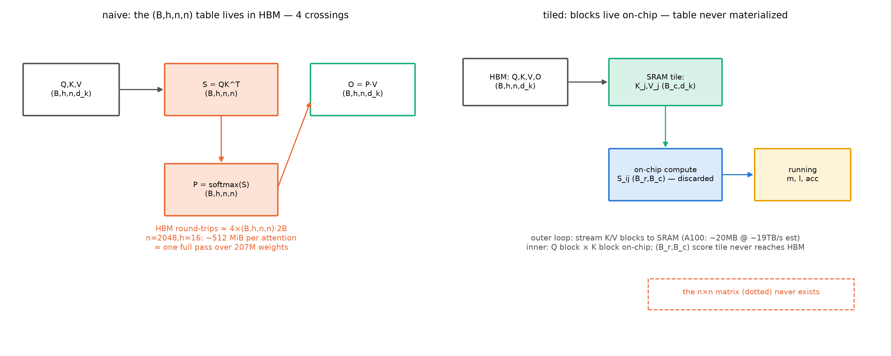
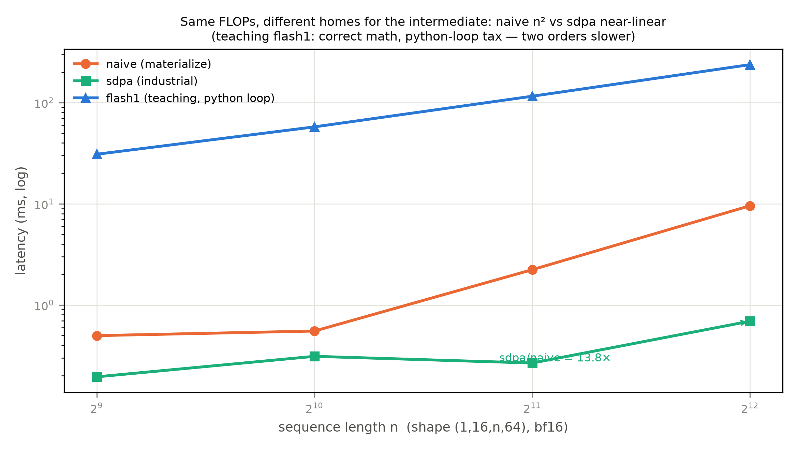

# 第 8 章 注意力 kernel：从铺表到 online softmax（数学最重章）

> **最小背景栏**：本章的数学只需 softmax 的定义（Book1 第 2 章教过：指数化+归一）与矩阵分块乘法（本科线代）。硬件侧只需「HBM 慢、片上快」的两级存储直觉——第 1 章 roofline 的余温，具体数字本节现补。Book5 第 5 章的 GDN chunkwise 在 8.6 回望，不重教。

## 8.1 Book1 那张表，工业界重写了算法

Book1 第 2 章手写缩放点积注意力时，我们把 $(n,d_k)\times(d_k,n)$ 的打分矩阵整个算出来、整个存下来——「一张 $n\times n$ 的表」。当时留了一句：工业界后来的推理引擎为这张表重写了算法（不再整个铺开）——Book1 第 11 章把它登记为 F17（手写 matmul+softmax 的工业界命运）。欠账到期，本章把它还清：先算清**为什么必须重写**（访存账），再学**怎么重写**（online softmax 的数学），最后**自己写一遍并对拍**（教学版 vs 工业版）。产出三样：一笔可手算的中间量交通账、一个从零的 FA1 式实现（对拍全绿）、一张 FA 谱系表——本章是「单项深化」段的第一站，站在最贴近算子的那一层回望全书。

先算交通账。naive 注意力对 $(B,h,n,n)$ 的打分矩阵 $S$ 与归一矩阵 $P$ 的完整旅程是：写 $S$ 进 HBM→读回来做 softmax→写 $P$→读回来加权 $V$——**四趟**。以本机口径算一笔（$B{=}1$、$h{=}16$、bf16、每元素 2 字节）：$n{=}2048$ 时 $S$ 一张就是 $16\times2048^2\times2\text{ B}=128\text{ MiB}$，四趟合计 $\approx512\text{ MiB}$ 的 HBM 往返——**一层注意力的中间量交通，约等于把 207M 的全部权重（414 MB）搬一遍**；而机器有 12 层——一趟前向的中间量交通合计约 6 GiB，**权重被搬了 15 遍**。$n{=}4096$ 时更悬殊：一层四趟约 2 GiB，中间量反超权重一个量级。论文的定罪句可以直引：「Standard attention implementations materialize the matrices $S$ and $P$ to HBM, which takes $O(N^2)$ memory」【证据等级：官方论文 2205.14135 §2.2，直引】。

这些中间量的**算术强度**还低得可怜：softmax（指数+归一）与加权（$P\cdot V$）是逐元素/归约操作，FLOPs 少、bytes 多——第 1 章 roofline 斜坡的最底部。而算它们的机器有两层存储（FA1 论文给的 A100 口径，也是本类 kernel 的通用地形）：**HBM** 40-80 GB、带宽 1.5-2.0 TB/s；**片上 SRAM** 每 SM 192 KB、108 个 SM 合计约 20 MB、带宽约 19 TB/s（估计值，引微基准【证据等级：官方论文 §2.1，估计口径照标】）——快 13 倍、小 2000 倍。910B3 侧按红线⑤如实写：华为无公开的片上规格页，HBM 带宽无官方数（本机实测 1190 GB/s，第 1 章）；「片上快、容量小」的两级结构同样成立，数字以实测口径分列。kernel 的任务由此明确：**让 $n^2$ 的中间量不进 HBM——在片上算完一块、只留最终结果**。FA1 的自我定义一句话给全三个关键词：「an IO-aware exact attention algorithm that uses tiling to reduce the number of memory reads/writes between GPU HBM and GPU on-chip SRAM」——IO 感知、精确、分块【证据等级：官方论文摘要，直引】。



图 8.1 铺表 vs 分块的数据搬运路径（自绘示意级；依据 FA1 论文 Fig 1 机制改绘——版权档：FA 论文 arXiv 默认 license 不贴原图）：左=naive 四趟 HBM 往返（$S/P$ 标形状）；右=分块双循环——外循环载 K/V 块进片上、内循环逐查询块算完即弃，虚线框的 $n\times n$ 大矩阵永不物化；两层存储的容量/带宽标注（A100 论文口径）。

## 8.2 online softmax：分块算 softmax 的数学难关

分块的 matmul 好办（块乘块累加），难点在 softmax——它是**全局归一**：每一行的分母是整行的和，块着算时「整行」还没见全。FlashAttention（FA1，arXiv:2205.14135，NeurIPS 2022）解开了这个结：**online softmax**——两状态在线修正。推导从标量直觉起步，再升到 tile 层的形式化——两层都要走，数学重章的规矩。

**标量层：一行打分的两状态账。**设某查询行对键 $1..n$ 的打分为 $s_1,\dots,s_n$。定义两个**可增量维护**的状态：$m$=至今所见最大值（数值安全锚）、$l$=以 $m$ 为底的归一系数。已处理键 $1..j$ 时：

$$m_j=\max_{i\le j}s_i,\qquad l_j=\sum_{i\le j}e^{s_i-m_j}$$

用人话说：指数先减去当前最大值（防溢出——fp32 到 $e^{88.7}$ 就上溢：一行打分 $[1, 100]$ 朴素算 $e^{100}/(e^1+e^{100})$ 直接得 NaN，减去行 max 后是 $e^0/(e^{-99}+e^0)$ 稳稳得 1.0），分母变成「减 $m$ 之后的和」。真正的 softmax 分母是 $\sum e^{s_i}$，但恒等式 $\frac{e^{s_i}}{\sum_k e^{s_k}}=\frac{e^{s_i-m}}{\sum_k e^{s_k-m}}$ 保证分子分母同乘 $e^{-m}$ 比值不变——**用哪个 $m$ 都行，只要同一行统一**。这就给了「边走边换 $m$」的自由。

**合并：新块来时旧账怎么折。**新增一块键 $j{+}1..j{+}T$，新块自己算出 $m_{blk}$ 与 $\sum_{i\in blk}e^{s_i-m_{blk}}$；老状态要迁到新底 $m_{new}=\max(m_{old},m_{blk})$——乘修正因子 $\alpha=e^{m_{old}-m_{new}}$、新块乘 $\beta=e^{m_{blk}-m_{new}}$：

$$l_{new}=\alpha\, l_{old}+\beta\sum_{i\in blk}e^{s_i-m_{blk}},\qquad acc_{new}=\alpha\, acc_{old}+\beta\sum_{i\in blk}e^{s_i-m_{blk}}v_i \tag{8.1}$$

| 符号 | 含义 | 形状 |
|---|---|---|
| $m,\,l$ | 行级 running max / 归一系数 | $(B,h,T,1)$ |
| $acc$ | 加权累积（未归一输出） | $(B,h,T,d_k)$ |
| $\alpha,\beta$ | 新旧底折算因子 | 标量（逐行） |

用人话说式 (8.1)：$\alpha=e^{m_{old}-m_{new}}$ 是「旧账本换新币」的汇率——旧底数下记的 $l$ 与 $acc$ 乘上汇率就是新底数下的等价账目，新块按 $\beta$ 折成同一底数直接入账。**没有任何一步需要回头重算**——这就是 online 的含义。整个数学三句话：**减 max 保安全、同乘 $e^{-m}$ 保等价、换底乘 $\alpha$ 保合并**。

**tile 层：把一行推广到一个查询块。**教学版 `fa1.py::flash_attn1` 按查询块（$T{=}128$）推进、键维全宽；FA1 正身（Algorithm 1）是**双向分块**——K/V 切 $B_c=\lceil M/4d\rceil$ 大小的块、Q 切 $B_r$ 大小的块，外循环载 K/V 块进 SRAM、内循环扫 Q 块（Q 与输出被重读 $T_c=n/B_c$ 遍——IO 定理的来源）；FA2（§2.3.1）的矩阵块版两块推导与式 (8.1) 同构。逐 tile 的形状流转收进表 8.2：

表 8.2 `flash_attn1` 单查询块的形状流转（块大小 $T$，键维全宽 $n$）

| 步骤 | 运算 | 输入形状 | 输出形状 | 说明 |
|---|---|---|---|---|
| 1 | 取查询块 | $q[:,\,:\,,i_0{:}i_0{+}T]$ | $(B,h,T,d_k)$ | 唯一常驻的查询侧量 |
| 2 | 块打分 | $(B,h,T,d_k)\cdot(B,h,d_k,n)$ | $(B,h,T,n)$ | **即弃中间量**——只在片上/寄存器活一次 |
| 3 | 块内 max 与指数 | $(B,h,T,n)$ | $m_{blk}$ $(B,h,T,1)$、$p$ $(B,h,T,n)$ | $p$ 即弃 |
| 4 | 合并（式 8.1） | 老 $m/l/acc$ + 块量 | 新 $m/l/acc$ | 老账按 $\alpha$ 折算 |
| 5 | 末步归一 | $acc/l$ | $(B,h,T,d_k)$ | 循环结束才除一次 |

归纳证明一小段（分块不改结果的论证闭环）：处理完第 $j$ 块后，$l$ 与 $acc$ 恰等于「全量公式以 $m_j$ 为底」的部分和——归纳奠基是首块（平凡），归纳步即式 (8.1) 的汇率折算（恒等变形）；行末 $m$ 停在全局最大，故 $acc/l$ 与一次算全的 softmax 加权**逐位相同**。论文的表述更漂亮："Setting the attention mask this way ensures that chunked-prefills computation is mathematically equivalent to the full prefill"——那是第 7 章的近亲；本章的对应句是 Algorithm 1 的两状态更新本身【证据等级：官方论文 §3.1，Algorithm 1 line 10-13——FA1 正文行间公式无编号，此为正身位置】。

**例 8.1（构造例：6 元素分 2 块的 online softmax 手算）** 打分 $s=[1,3,2,\;5,1,2]$（前 3 为块 A、后 3 为块 B），取 $v_1{=}1$、$v_2{=}2$、$v_3{=}0$、$v_4{=}1$、$v_5{=}0$、$v_6{=}3$。**块 A**：输入 $[1,3,2]$；$m_A=3$，$p_A=[e^{-2},e^0,e^{-1}]=[0.135,1,0.368]$，$l_A=1.503$，$acc_A=0.135\times1+1\times2+0.368\times0=2.135$。**块 B**：输入 $[5,1,2]$；$m_B=5$，$p_B=[1,0.018,0.050]$，$l_B=1.068$，块内加权和 $=1\times1+0.018\times0+0.050\times3=1.150$。**合并**：$m_{new}=5$、$\alpha=e^{3-5}=0.135$——$l=0.135\times1.503+1.068=1.270$；$acc=0.135\times2.135+1.150=1.438$。**输出**：$acc/l=1.438/1.270=1.132$。全量验算：$e^{s-m_{full}}=[0.135,1,0.368,1,0.018,0.050]$、和 $=1.270$、加权和 $=0.135+2+0+1+0+0.150=1.438$——**逐位一致**。这个例子让你看见：两块各算各的、只在合并处付一次汇率，最终账目与全量同源。

**例 8.2（构造例：$n{=}8$、$T{=}4$ 的分块字节账）** 设 $h{=}1$、bf16、只数打分矩阵侧的 HBM 流量。**铺表**：写 $S$（64 元素×2 B=128 B）+读 $S$+写 $P$+读 $P$=四趟×128 B=**512 B**。**分块**：两个查询块，每块的 $S_{ij}$ 是 $4	imes8$=32 元素×2 B=64 B、**片上算完即弃、不过 HBM**——HBM 只流过 $Q/K/V/O$（各 $8	imes d_k	imes2$ B，与 $n$ 线性）。输出读法：**$n$ 涨一倍，铺表账翻四倍、分块账翻一倍**——平方与线性分手的地方就在中间量的「住址」；把这个 $n{=}8$ 的账按 $n{=}2048$ 重算，就是 8.1 那笔 512 MiB 的来历。

复杂度账收尾（论文级）：FA1 的 IO 定理——「Standard attention (Algorithm 0) requires $\Theta(Nd+N^2)$ HBM accesses, while FlashAttention (Algorithm 1) requires $\Theta(N^2d^2M^{-1})$」（条件 $d\le M\le Nd$，$M$=SRAM 大小）【证据等级：官方论文 Theorem 2，直引】。教学版口径的直觉版：K/V 整体只流一遍（$\Theta(Nd)$），查询块与输出被重读 $n/B_c$ 遍、每遍 $\Theta(Nd)$——乘起来就是 $\Theta(N^2d^2/M)$。FLOPs 一点没省（精确注意力，非近似——FA1 标题里的 exact 正是此意）；省的全是**中间量的驻留位置**。roofline 的语言：把 softmax 与加权两段低强度操作的输入从 HBM 搬进片上——斜坡上的活搬到了不花 HBM 带宽的地方。

FA1 还有第二件兵器值得点名：**重计算**（recomputation）。前向只存输出 $O$ 与逐行统计量 $(m,l)$——$S/P$ 压根不存；反向要梯度时，在片上由 $Q,K,V$ 块**重算** $S,P$。代价是反向 FLOPs 反而更多（GPT-2 medium 实测：66.6→75.2 GFLOPs），收益是 HBM 访问锐减——**时延 41.7→7.3 ms，多算了 13% 的活、快了 5.7 倍**【证据等级：官方论文 Fig 2 左】。这是「FLOPs 便宜、带宽贵」在反向的复刻：普通检查点技术用速度换内存，FA1 用「多算」换「少搬」——方向拧过来反而赢了。与它对照的 Rabe-Staats 线（存各块临时输出最后合并）目标省「占用量」、FA1 省「访问量」——论文附录的对比讲得很清楚：访问量少则占用必少，反之不然【证据等级：官方论文附录 A】。

## 8.3 从零实现与对拍：三层读数

`code/ch08/fa1.py` 给出双实现：`fa1.py::naive_attention`（铺表——Book1 的做法原样）与 `fa1.py::flash_attn1`（分块+online 修正，tile 可调）。数值对拍先行（CPU fp32，全因果掩码）：

**实物 8.1**（三方对拍与 NPU 时延扫描；看什么——对拍两行先立正确性，时延四档再读结构）

```text
[对拍 CPU fp32] flash1 vs naive max|Δ|=7.15e-07 | flash1 vs sdpa max|Δ|=4.02e-07
[NPU n= 512] naive 0.498 ms | flash1 30.915 ms | sdpa 0.195 ms     （sdpa/naive = 2.6×）
[NPU n=1024] naive 0.553 ms | flash1 57.656 ms | sdpa 0.311 ms
[NPU n=2048] naive 2.234 ms | flash1 115.834 ms | sdpa 0.267 ms
[NPU n=4096] naive 9.576 ms | flash1 237.693 ms | sdpa 0.692 ms    （sdpa/naive = 13.8×）
```

【证据等级：本机实测，Atlas 910B3，bf16，形状 $(1,16,n,64)$，warmup 后 3 次均值，`log/book6-ch08/fa1_base.json`】两组读数分开消化。**对拍两行**：教学实现与铺表基线、与工业 sdpa 三方一致到 $10^{-7}$ 量级——式 (8.1) 的数学在代码里成立，「分块不改结果」不是口号。**时延四档三个故事**（图 8.3）：**naive 的平方律**——$0.50\to0.55\to2.23\to9.58$ ms，进入平方主导区（$n\ge1024$）后每翻倍翻约四倍（首档被固定开销压平、仅 1.1×——与 sdpa 段同因），中间量的 HBM 往返主导（$n{=}4096$ 时打分矩阵一张 512 MiB bf16）；**sdpa 的平坦**——$0.20\to0.69$ ms 远低于平方律、近乎平坦（$n\times8$ 时延仅 3.5×、个别档还有回落），对 naive 的优势从 512 档的 2.6× 拉到 4096 档的 **13.8×**——「不铺表」的收益在自家卡上兑现（时延的绝对差随 $n$ 平方涨、比值随 $n$ 线性涨——512→4096 档 $n$ 涨 8 倍，实测优势涨约 5.3 倍、低于理论的 8 倍，固定开销拖累所致）。这行还藏着三层对拍的手算层——理论、实测、工业三层在一条曲线上对齐；**教学版 flash1 的「反常」**——它比 naive 慢 25-104×（一到两个数量级）：教学版只分块了查询维、块中间量 $(B,h,T,n)$ 仍走 HBM，还背 python 逐块循环的税。**它示范的是算法结构（online softmax 的数学与形状流转），不是性能**——真正的 FA 收益来自「块驻留片上」的深度工程（寄存器/SRAM 分块、算子融合、并行布局），那是 kernel 工程的专门手艺（Book7 的地界，本册隔着玻璃看）。教学诚实账：结构对、对拍齐、性能留给工业版——三层对拍在 kernel 章的读法（理论层的字节账见 8.2，本机实测层在此，工业对照层即 sdpa 列）。



图 8.3 三实现的时延-序列长曲线（自产，喂 `fa1_base.json` 四档，log 轴——教学版慢一到两个量级需对数轴才能同框）：naive 平方律、sdpa 近乎平坦（13.8×）、教学 flash1 结构正确但背着 python 循环税。

## 8.4 sdpa 与本机两事实

`F.scaled_dot_product_attention`（sdpa）是 PyTorch 的统一入口——Python 层只是一层 docstring 包装，函数体直接落在 C++ 算子里（`functional.py` L5932 的一行赋值）；docstring 自述后端谱：「FlashAttention-2 / Memory-Efficient / math 实现」三路自动选择，且明说「optimized kernels…when using the **CUDA backend**. For all other backends, the PyTorch implementation will be used」，还提醒 fused 浮点融合会让不同后端的输出有细微差异（对拍时留心）【证据等级：本机源码 docstring，torch 2.10——版本框注】。本机（torch 2.10+torch-npu 2.10.0.post4）实测两条事实（`03_probe_sdpa.py`，notes/04 P1）：其一，**裸调可用**——npu/bf16 全组合跑通，与 CPU fp32 参照差在 bf16 量级内（8.3 的 sdpa 列正用它）；其二，**`sdpa_kernel` 的后端门控在 NPU 上逐位失效**——强制 FLASH/EFFICIENT/MATH/CUDNN 四种后端，输出与默认分发逐位一致（连 NPU 上不存在的后端也「成功」）。机制归因有源码锚：`sdpa_kernel` 的实现是进出上下文时逐个拨 `torch._C._set_sdp_use_{cudnn,flash,mem_efficient,math}` 这排 **CUDA 语义的布尔开关**（`torch/nn/attention/__init__.py` L112-155）——门控是「选 CUDA 后端」不是「换算法」，torch_npu 注册的 kernel 不消费这些标志，拨了等于没拨。

**实物 8.2**（四后端逐位一致读数；看什么——四种「不同后端」的输出完全相同：门控没咬合）

```text
sdpa_kernel([FLASH_ATTENTION])   out == default  (torch.equal: True)
sdpa_kernel([EFFICIENT_ATTENTION]) out == default (True)
sdpa_kernel([MATH])              out == default  (True)
sdpa_kernel([CUDNN_ATTENTION])   out == default  (True)   # NPU 上并不存在 CUDNN 后端——也"成功"
```

【证据等级：本机实测（探针摘录，notes/04 P1），bf16/NPU】给写代码的读者的实用结论：**NPU 上不能靠后端开关选 kernel**——sdpa 是黑盒，想要特定行为要么换输入形状、要么等 Book7 讲的引擎侧 attention 后端配置。顺带一句 Book1 的旧账在此兑现：全屏蔽行在铺表实现里出 NaN/0（softmax 空集），融合 kernel 按块短路——行为差异正是「实现即语义」的注脚（Book1 第 7 章融合 kernel 那句的 kernel 章回收）。

## 8.5 谱系一览：五代接力

表 8.1 FA 谱系（「本机可用性」列是中文教学书的独有视角）

| 版本 | 关键改进 | 代表数字 | 本机可用性 |
|---|---|---|---|
| FA1（2205.14135，NeurIPS'22） | online softmax+IO 感知定算法 | HBM 访问 40.3→4.4 GB（9×）；fwd+bwd 41.7→7.3 ms；GPT-2 训练 3.0× vs HF | 算法层已手写复现（fa1.py） |
| FA2（2307.08691，ICLR'24） | 减非 matmul、扩并行（序列维）、warp 分工 | A100 达峰值 MFU 73%（fwd+bwd 225 TFLOPs/s）；比 FA1 快约 2× | sdpa 的默认后端之一（CUDA 侧） |
| FA3（2407.08608，NeurIPS'24） | 异步 softmax、FP8 | H100 约 616 TFLOPs/s（**双口径：论文 ~840 为含稀疏的最优档**，引用须分列——复核清单已登记） | CUDA-only；NPU 侧无 |
| FlashInfer | 推理向 kernel 库化集成 | —（库，非论文单点） | Book7 的 attention 后端话题 |
| flex_attention（torch 内置） | 可编程打分修改+块掩码，Triton 编译路线 | score_mod=None 时数学上即 sdpa | 本仓 torch 2.10 在位（prototype） |
| FA4 | CUDA 12.x cute 路线原型 | — | **不可用**（见下） |

【FA1/FA2/FA3 行：证据等级官方论文；FA2 数字为摘要+Table 1 合并口径】FA2 的三改进有摘要正身：「(1) tweak the algorithm to reduce the number of non-matmul FLOPs (2) parallelize the attention computation, even for a single head, across different thread blocks…(3) within each thread block, distribute the work between warps to reduce communication」【证据等级：官方论文 2307.08691 摘要，直引】——三条各自对应一个数字故事：非 matmul 削减（softmax 的指数与归并不吃 TensorCore）、并行扩到序列维（FA1 只按 batch×heads 并行、108 个 SM 要 batch·heads≥80 才吃满——长序列小 batch 场景饿着）、warp 分工从 split-K（要 shared memory 归拢）换成 split-Q（零通信）。warp 分工值得多看半眼，因为它是「算术不变、访存剧变」的微观样本：FA1 里 4 个 warp 各拿 K/V 的一片、共享 Q——各家算出打分切片后必须写 shared memory、同步、求和归拢；FA2 换成各 warp 拿 Q 的一片、共享 K/V——每家独立算出自家输出的行切片，**一次同步都不用**。自回归场景还有白捡的一刀：因果掩码下块行列全零的整块直接跳过，约省 1.7-1.8×（大 $n$ 时近一半的块在掩码外）【证据等级：官方论文 §3.1】。块大小本身也是个旋钮（论文 Fig 2 中）：64-512 扫描下 HBM 访问与 runtime 随块增大同步双降——**块太小**则块的固定开销（载入/发射）摊不平，**块太大**则超过 SRAM 容量装不下、且 runtime 转被算术卡住（256 之后）——与第 5 章 KV 块大小、第 7 章 chunk 大小是同一族「容量约束下的粒度权衡」。还有一笔容易被 kernel 故事淹没的账：**省下的显存换成了质量**——GPT-2 small 的上下文扩 4 倍（1k→4k）仍比 Megatron 的 1k 快 30%，困惑度还好 0.7（18.2→17.5）；64K 序列上其他精确基线全部 OOM 时 FA 仍在跑【证据等级：官方论文 §4.2/§4.3】——$O(n)$ 内存不只是省钱，是把「更长的上下文」从不可能变成可选。

FA4 的占位说明按仓内证据四条件写准（本仓 `torch/nn/attention/_fa4.py` 一手核验）：`_fa4.py` 整文件 docstring 只有一句 "UBER PROTOTYPE!!!"；激活需要**外部 flash_attn.cute 包（本机未装）+ CUDA + 计算能力 9.0/10.0 + 显式 activate_flash_attention_impl** 四条件——NPU 机四条全不满足【证据等级：本机源码一手，torch 2.10】（社区传的「绑定 torch≥2.13」在本仓 grep 无据，口径照实）。NPU 侧的 fast attention 以 vllm-ascend 内置实现为准（待 Book7 核验）。torch 生态的目录谱一句话钉住：`torch/nn/attention/` 下是 sdpa 门控（`__init__` 的 SDPBackend）、flex_attention、varlen、`_fa4` 原型桥——**没有 `_fa3`**（FA3 是外部 ABI 稳定 wheel 挂接，仓内仅存 CI 兼容脚本【证据等级：本机源码一手】）。

## 8.6 回望：Book5 的 chunkwise 是同一个思想

现在回看 Book5 第 5 章的 GDN chunkwise（chunk 内并行、块间递推）与第 6 章的 KDA——它们的「块」与 FA 的「tile」是同一个思想在不同算子上的投影。公式级并排（左列=本章式 (8.1) 家族，右列=Book5 ch05 的 chunkwise 递推）：

| 机制 | FA 的 online softmax | GDN/KDA 的 chunkwise | 同构点 |
|---|---|---|---|
| 状态递推 | $l_{new}=\alpha l_{old}+\beta\,l_{blk}$ | $S_{new}=A\,S_{old}+B\,x_{blk}$（衰减+入账） | 增量入账、存量折算 |
| 折算因子 | $\alpha=e^{m_{old}-m_{new}}$（标量，数值安全） | $A$=门控衰减矩阵（逐通道） | 合并新块时的「汇率」 |
| 归一/输出 | 行末 $acc/l$ | 输出投影 | 延迟归一 |
| 中间量 | 打分块 $(B,h,T,n)$ 即弃 | chunk 状态定长 | 全局依赖拆成「块内并行+块间可合并」 |

一处类比要诚实降级：FA 的 $m$ 是**数值安全锚**（防指数上溢的工程装置），GDN 的衰减是**逐通道的状态折旧**（模型学出来的记忆机制）——$l$ 对状态累积的类比成立，$m$ 没有对应物（chunkwise 的打分无指数溢出问题，不需要 max 锚）。同构的是**结构**（分块+可合并状态），不是每个符号。线性注意力层没有 $n^2$ 中间量、kernel 压力天然小——架构侧（Book5）与系统侧（本册）在「访存友好」上殊途同归；而 SnapKV 的块级选择（第 3 章）与 flex_attention 的 BlockMask 跳块（块掩码「块内全稀疏才跳」的对齐约定，与硬件的连续加载偏好合拍——torch 源码 docstring 一手），则是「块粒度」思想在淘汰侧与编译侧的另外两次投胎。KDA 还有一句第 10 章要回收的伏笔：它的状态**原位更新、无法平凡回滚**——投机解码验证失败时要付「只缓存投影输入、片上重建」的账（B5-2 的张力在此埋点）。

## 8.7 本章小结

F1 的 kernel 半句（$O(n^2)$ 的显存与 kernel 还账）与 F17（那张表的铺法革命）在此合销：开篇的问题「为什么要重写」由交通账回答（$n{=}2048$ 时中间量四趟≈全权重一遍），「怎么重写」由 online softmax 回答（两状态+汇率合并，式 (8.1) 可手算、例 8.1 可跟走、fa1.py 对拍到 $10^{-7}$），「重写值多少」由实测回答（sdpa 对 naive 2.6×→13.8×，绝对差随 $n$ 平方增长）。**带走的心智**：两幅画。**其一，分块不改数学、只改中间量住在哪**——softmax 的全局归一被拆成「块内安全+块间汇率」，全局依赖从此有了通用的分解形态（8.6 的并排表说它超越具体算子）。**其二，kernel 工程的全部赌注押在存储层级上**——同样的 FLOPs，住在 HBM 就是账单、住在片上就是免费；读任何 kernel 代码，先找它的中间量住哪。教学版与工业版的两个数量级差距是下一册的请柬：寄存器级分块、算子融合、warp 编排——隔着玻璃看到的每一件，都将在 Book7 的源码里拆开。

> **【欠账】** attention 后端体系（registry 自动选择、FA/FlashInfer/MLA 系/linear 后端与 Book4-5 架构的一一对应）→ Book7 第 9 章

## 动手验证

```bash
cd 工作区根目录 && source env.sh
# ① 三方对拍+NPU 时延扫描（实物 8.1/图 8.3 数据源；CPU 对拍秒级、NPU 分钟级，先 npu-smi 选卡）
ASCEND_RT_VISIBLE_DEVICES=<卡> python "code/ch08/fa1.py" --bench-npu
#   验收行：对拍 max|Δ|=7.15e-07/4.02e-07 | n=4096 档 sdpa/naive=13.8×
# ② sdpa 后端门控实验（实物 8.2 数据源；CPU 分钟级）
python "code/00-feasibility/03_probe_sdpa.py"
# ③ 本章三图（图 8.1/8.2/8.3）
python "code/ch08/fig_ch08.py"
# ④ 正主：arXiv:2205.14135（FA1——Algorithm 1 的两状态更新是正身位置）/ 2307.08691（FA2——§2.3.1
#    矩阵块版推导与摘要三改进句）；FA3 2407.08608 的双口径数字见复核清单
```
