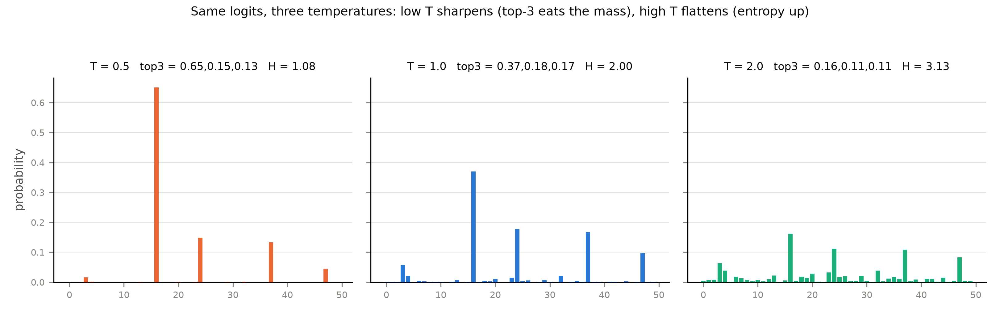
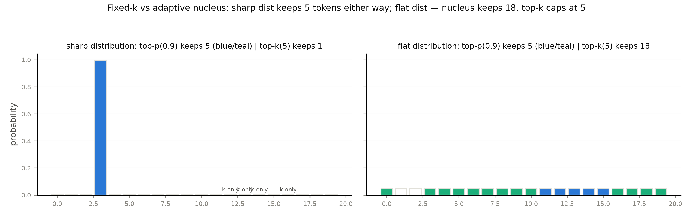

# 第 9 章 采样与 logits 处理器：从分布到 token

> **最小背景栏**：softmax 的定义与「分布」的概念（Book1 第 2 章）；temperature 与 top-k 的初见（Book2 第 11 章 11.3——那里「只借方法不深讲，系统拆解归推理册」，本章兑现这句契约：指回+系统化，严禁从零重教）。不需要任何新数学。

## 9.1 最后一道工序，也是一个新的层

上一章把注意力 kernel 榨完，机器的出口处躺着一个 $(B, V)$ 的 logits 张量（$V$=词表——207M 的 sp-32k 词表是 32,000 维）。「每个 token 40 ms 的解码循环」到这一步只剩最后一道工序：**从这个分布里选出一个 token id**。它是「引擎性能数字不因它改变、但产品手感全由它定」的一层——吞吐与 TPOT 的账里它只占百分之几，而同一个模型配不同的采样参数，产品性格能从「严谨的代码助手」变成「话痨的陪聊」。单项深化段（第 8-12 章）走到第二站，本章的问题只有一个：**从分布到 token，有哪些手艺、顺序为什么重要、工程上怎么落地**。产出四样：一套形式化的参数族（温度/截断/惩罚各配公式与手算例）、一个顺序敏感性的构造例、两台引擎（HF/vLLM）的管线对照、207M 实跑的三温度样例。

形状账先立（这层的全部运算都在两个形状之间打转）：logits $(B,V)$ →概率 $(B,V)$→token $(B,)$；惩罚需要的历史是一个计数向量 $(V,)$（每个 token 已出现几次）。仅此而已——本章没有矩阵乘。

## 9.2 温度：一把分布的缩放旋钮

温度（temperature）的机制 Book2 见过：logits 除以 $T$ 再 softmax——$\mathrm{softmax}(z/T)$。这里直接上形式化与读数（系统化增量）：

$$p_T(i)=\frac{e^{z_i/T}}{\sum_k e^{z_k/T}}$$

用人话说：$T$ 不改 logits 的**排序**（除以正数保序），只改头部「赢多少」——$T<1$ 锐化（头部更肥、熵更低），$T>1$ 平坦化（分布更平、熵更高），$T\to0$ 退化为贪心（全部质量塌到最大 logit）。两个 token 的概率比是 $e^{(z_i-z_j)/T}$：温差固定时 $T$ 越小比值越悬殊——**温度是「赢多少」的指数旋钮，不是「谁赢」的选择器**。

**例 9.1（构造例：5 token 分布在三个温度下的手算）** logits $z=[3,2,1,0,-1]$。**T=1**：$e^z=[20.1,7.39,2.72,1.00,0.37]$、和 $31.6$——$p=[0.64,0.23,0.086,0.032,0.012]$。**T=0.5**：$z/T=[6,4,2,0,-2]$、$e^{z/T}=[403,54.6,7.39,1.00,0.14]$、和 $466$——头部 $p_1=0.86$（五倍温差被放大成 7.4 倍比值）。**T=2**：$z/T=[1.5,1,0.5,0,-0.5]$、$e^{z/T}=[4.48,2.72,1.65,1.00,0.61]$、和 $10.5$——头部 $0.43$。输出读法：排序三个温度下纹丝不动、头部质量 $0.86\to0.64\to0.43$ 单调滑落（熵 $1.08\to1.99\to3.13$ 与之互补，图 9.1）——**温度调的是分布的「集中度」，选谁它从不插手**。



图 9.1 同一 logits 的三温度（自产，与 `samplers_base.json` 温度块同种子同读数）：低 T 锐化（top-3 吃掉几乎全部质量）、高 T 平坦化（熵升）。

## 9.3 截断：top-k 与 top-p 的两种哲学

温度管「赢多少」，截断管「谁有资格参赛」。**top-k**（Fan et al., 1805.04833）：保留概率最高的 $k$ 个、其余置 $-\infty$——个数截断，GPT-2 的默认是 $k{=}40$（Book2 11.3 已核）。**top-p / 核采样**（nucleus sampling，Holtzman et al., 1904.09751）：保留「累计概率达到 $p$ 的**最小集合**」——论文定义句："we define its top-p vocabulary $V(p)\subset V$ as the smallest set such that $\sum_{x\in V(p)}P(x)\ge p$"【证据等级：官方论文 §3.1，直引】。两法的哲学差就一句话：**top-k 给资格发固定名额，top-p 按概率质量发浮动名额**——分布尖时 nucleus 只保一两个（名额自适应收缩），分布平时能保十几个（名额自动放宽）。

为什么需要截断？Holtzman 给了一幅准确的物理图像：语言模型在每个位置输出的分布，其概率质量高度集中在一个**核**（nucleus）里——人类文本的实测里，高似然位置的核可以只有几十个 token、低似然位置（更难预测处）的核会自然扩大到几百个；而核外的**长尾**成千上万 token 合计分不掉多少质量，却是噪声的来源。**采样长尾是浪费也是风险**——浪费在于长尾 token 几乎从不该被选，风险在于偶尔被选中就打断连贯。证据群两路。自家证据先引：Book2 第 11 章的贪心复读教例——「The capital of France」整句循环，正是图 11.3 四解码对照里贪心臂的死法。论文侧（GPT-2 Large/WebText 5000 段，Table 1）更狠：**贪心生成的重复率 73.66%**（近四分之三的生成以进入复读环告终）、束搜索 b=16 也有 28.94%，而 **nucleus p=0.95 只有 0.36%**、纯采样 0.22%。同表还有一列要专门读：**困惑度与质量反相关**——贪心的困惑度 1.50 全场最低（最「自信」），却是最差的生成（复读）；人写文本反而 12.38。这一列拆掉一个常见直觉：**似然高不等于文本好**——逐 token 贪最优拼起来可以是全局最差，这正是截断与温度存在的深层理由（第 10 章的投机解码还会再撞见一次「逐 token 最优≠整体最优」）；人评分数（HUSE，越接近 1 越像人写）：nucleus **0.97** 全场最高、top-k=640 次之 0.94、贪心 1.50 的困惑度配上 Zipf 系数 1.00 是「三重退化铁证」【证据等级：官方论文 Table 1+§6.1】。机制因果链：长尾 token 的概率虽小，采样时被反复抽中会**打断连贯性**（纯采样的长尾是噪声）；而只贪头部又会掉进复读环——截断保留一个「大到足够多样、小到没有噪声」的核，两头都躲。

**例 9.2（构造例：尖/平两个分布的双法走查）** 尖分布：某 token 打分 8、其余 0（20 词表）；平分布：均匀（全 0）。**top-k=5**：两分布都恰保 5 个（个数固定——尖分布保了 4 个零概率的陪跑，平分布砍掉了 15 个同资格的）。**top-p=0.9**：尖分布保 **1** 个（头部独占质量）；平分布保 **18** 个（每个 0.05，凑到 0.9 要 18 个）。输出读法：自适应名额一目了然——**尖时敢砍到 1 个（防长尾）、平时敢放开 18 个（保多样）**；top-k 两个场景都是 5，一边浪费名额、一边错杀资格（图 9.2）。截断家族还有几位远亲一句点名：typical sampling（按「典型性」而非概率排）、eta/theta 截断（按熵自适应阈值）、min_p（按头部概率的比例下限——2024 年社区实践，vLLM 与 HF 都已收录但管线位置不同）；它们与本章两正主的差别都在「资格线怎么画」，机制课到此为止，另一族「硬约束截断」（语法/格式的强制掩码）是结构化输出的地界 → Book8 第 3 章。



图 9.2 top-k vs top-p 的保留集（自绘，数据与 `samplers_base.json` adaptive 块同款）：左=尖分布（nucleus 只保头部 1 个）、右=平分布（nucleus 保 18 个；top-k 恒 5）。

## 9.4 惩罚：三件「历史账」

截断按概率选资格，惩罚按**历史**改打分——已经出现过的 token，罚。三件的机制一句话分清：**repetition penalty**（CTRL 论文 1909.05858 正身）是**乘式**——正 logit 除以惩罚系数、负 logit 乘以系数（对称压向零）；**frequency penalty**（OpenAI API 口径）是**加式按次罚**——logit 减去「系数×出现次数」；**presence penalty** 是**加式出勤罚**——出现过就减一次定值、不管几次。形式化（$\mathrm{cnt}_i$=token $i$ 已出现次数）：

$$z'_i=\begin{cases}z_i/w & z_i>0,\ \mathrm{cnt}_i>0\ (\text{repetition})\\ z_i\cdot w & z_i<0,\ \mathrm{cnt}_i>0\ (\text{repetition})\end{cases}\qquad z'_i=z_i-w_f\cdot\mathrm{cnt}_i\ (\text{frequency})\qquad z'_i=z_i-w_p\cdot\mathbb{1}[\mathrm{cnt}_i>0]\ (\text{presence})$$

用人话说：repetition 是「打折」（双向压缩、力度温和、CTRL 建议 1.2 左右）；frequency 是「累犯加刑」（出现越多罚越重——治复读机的重炮）；presence 是「出场费」（只要出场就罚——逼模型谈新话题，不管它重复了多少次）。

**例 9.3（构造例：三件各罚多少的对照账）** logits $z=[2,\,1,\,0.5]$（3 词表），历史计数 $\mathrm{cnt}=[2,\,0,\,1]$（token 0 出现过 2 次、token 2 出现过 1 次）。**repetition $w{=}1.3$**：token 0 与 2 被罚——$2/1.3=1.54$、$0.5/1.3=0.38$（均为正 logit、走除法）→ $[1.54,\,1,\,0.38]$。**frequency $w_f{=}0.5$**：$[2-0.5\times2,\ 1,\ 0.5-0.5\times1]=[1.0,\ 1,\ 0]$——按次扣。**presence $w_p{=}0.5$**：$[1.5,\ 1,\ 0]$——出场一次就扣 0.5、token 0 出场两次也只扣一次。输出读法：token 0 在三件下的终值 $1.54/1.0/1.5$——**repetition 最温和（乘式压缩）、frequency 对累犯最狠、presence 一视同仁**；选哪件取决于你要治「复读」还是治「啰嗦」还是「话题僵化」。

**表 9.1 三件惩罚对照（记的是「历史账」，改的都是 logits）**

| 惩罚 | 改哪项 | 记账方式 | 适用 |
|---|---|---|---|
| repetition（乘式） | 正÷$w$、负×$w$ | 出现即记（含 prompt——HF decoder-only 默认与 vLLM 同） | 温和防复读（CTRL 建议 1.2） |
| frequency（加式） | $-w_f\times$次数 | 按出现次数累计（仅已生成输出） | 治复读机（累犯加刑） |
| presence（加式） | $-w_p\times$出勤 | 出现过记 1（仅已生成输出） | 逼新话题 |

> **【考据框】长度惩罚的血统（GNMT 那笔账的收口）**。Book1 第 8 章教 beam search 时留了欠账：长度惩罚 $\mathrm{score}=\log p/Y^{\alpha}$ 的 $\alpha$ 从哪来。血统三步：早期机器翻译按**整句**比大小，短句天然占便宜（$\log p$ 随长度单调变负）——先有「除长度」的朴素矫正；GNMT（Wu et al., 2016）§7 把它升级为 $\alpha$ 幂（几何平均的推广：$\alpha{=}1$ 是严格按长度平均、$\alpha{=}0$ 是完全不罚），并在机器翻译上扫出了 $\alpha\approx0.7$ 的甜点；Book1 式 (8.4) 的数值手感（$lp(1){=}1.00$、$lp(7){=}1.52$）你已手算过。自回归时代它为什么退居幕后：逐 token 生成的世界里没有「先凑齐整句再比大小」的节点——长度偏置没了比较的舞台；但「期望接受长度」会在第 10 章投机解码里以新面目回来（$\gamma$ 与 $\alpha$ 的联合账），一笔旧账两次投胎。

## 9.5 管线：顺序是一门语义

以上零件在实际引擎里**串成一条流水线**，而顺序不是免费的——**先罚后截、先温后截**是两条铁律，违反即变结果。铁律一的机制可以走一个逃逸例：设 token 甲已出现 5 次（frequency 的重点管制对象），本步分布里它排第 6、恰好被 top-5 截掉——**先截后罚**的世界里甲没被罚（截断后它已是 $-\infty$，罚不罚都不可能翻身），看起来无害；但下一步分布稍变、甲爬回第 4，**没被罚过的它原分入场**——惩罚的历史账在截断的缝隙里漏记了。**先罚后截**的世界里甲每步都在扣分、翻身成本逐日增高。惩罚要见全词表的计数、在截断之前完成——这是「账要在门关之前结」；铁律二的机制本节用构造例钉死：

**例 9.4（构造例：先温后核 vs 先核后温的保留集分歧）** logits $[1,2,3,0.5]$、$T{=}0.3$、top-p $0.9$。**先温后核**：$z/T=[3.3,6.7,10,1.7]$、softmax 得 $[0.0001,0.006,0.993,\dots]$——头部独占 99.3%，核采样保底「累计到 0.9」：**只保 token 2 一个**。**先核后温**：原分布 $[0.086,0.23,0.63,0.05]$、排序累计 $0.63\to0.86\to0.95$——保 $\{0,1,2\}$ 三个（0.95 处越过 0.9），温度此时只缩放保留集内的 logits、**集合不再变**。输出读法：两个顺序保出的资格集 $\{2\}$ 对 $\{0,1,2\}$ **不同**——温度改分布形状、核采样依赖分布形状，**形状敏感的操作与形状敏感的操作不可交换**；对照温度×top-k：线性缩放不改 top-k 集合（保序），可交换。**「管线顺序是分布形状的函数」**——这不是实现细节，是语义。

真实引擎的管线长什么样（两家实现对照框，均为本机安装包源码一手）：

> **【实现对照框】HF 与 vLLM 的采样管线（5.x / 0.27.1 实测口径）**。**HF**（transformers 5.14.1，`generation/utils.py` L1139-1310）：惩罚类先行（repetition 等）→「以前叫 LogitsWarpers」的截断族按 **Temperature→TopK→TopP→MinP→（typical/epsilon/eta）** 顺序追加——与我们的铁律同构（惩罚→温度→截断）。**vLLM V1**（0.27.1，`v1/sample/sampler.py` docstring 九步）：f32 转换→白名单/bad words→惩罚（repetition→frequency→presence）→temperature→min_p→**融合的 top-k/top-p**→softmax 重归一→multinomial。两家的 top-p 掩码算法逐句同构（升序 sort→cumsum→越线即删、保底 1 个、填 $-\infty$）。三条版本差异要钉住：①**HF v5 已删除 frequency/presence penalty**（类与属性双删，运行时无此参数）——OpenAI 口径的两件只在 vLLM 侧完整保留（取值域 $[-2,2]$，「We follow the definition in OpenAI API」源码注释原文）；②HF docs 仍写「top_k 默认 50」，但 5.x 安装版实测 `GenerationConfig()` 全 None（不设任何截断）——docs 是 4.x 惯性表述；③NPU 附注：vLLM 的 `TopKTopPSampler` 平台分派不含 ascend → 走 `forward_native` PyTorch 原生路径（本机 0.27.1+ascend 实测口径）【证据等级：本机源码/运行栈一手】。

## 9.6 贪心还是采样：场景与边界

什么时候必须贪心（greedy——直接取 argmax）、什么时候要采样？**必须贪心**：代码生成、数学推导、任何要求可复现与确定性的场景——同一个 prompt 两次运行应当给出同一答案，采样引入的随机性是负担不是特性。**要采样**：创作、对话、头脑风暴——多样性的价值高于一致性。边界三则值得点名。**其一，T=0 与贪心等价是实现级事实**：vLLM 无 do_sample 开关，`temperature=0` 即 greedy——源码把 $T<10^{-5}$ 判为贪心、并把 top_p/top_k/min_p 重置为恒等（截断参数失效；$0<T<10^{-2}$ 会被上夹并警告）【证据等级：本机源码（运行栈 0.27.1），vllm/sampling_params.py L458-506】；HF 走 do_sample=False 的另一条路，殊途同归。**其二，「T=0 完全可复现」有浮点边界**：批内求和顺序与硬件舍入可以让 argmax 在近似平局的两个 token 上翻转——工程口径是「贪心=可复现（同硬件同栈）」，跨栈不加保证。**其三，「管线只占 decode 步的百分之几」**这层位置感的账可以算了：$(B,V)$ 的 softmax+几次数乘 ≈ 每次 $3V$ 浮点运算，对 $V{=}32000$ 约 $10^5$ FLOP；一次 207M 前向是 $4\times10^8$ FLOP——**采样层的算力开销是前向的四千分之一**，这是「本章自始至终没碰 wall-clock」的定量理由（9.1 说「百分之几」是 wall-clock 口径——kernel 发射与同步把这点算力放大成毫秒级碎头；算力口径千分之一、时间口径百分之几，两个口径各自成立，桥就是这么搭的）。

**实物 9.1**（207M 三温度实跑样例；看什么——首 token 三温度相同（分布未截断时它稳居第一）、后续分歧随温度放大）

```text
prompt0（事实型） T=0.6: [30866, 349, 1401, 323, 264, 1275, 1757, 970, ...]
prompt0          T=1.0: [30866, 349, 2995, 2491, 901, 3289, 4876, 2468, ...]
prompt0          T=1.5: [30866, 12503, 2995, 11208, 901, 3289, 4876, 3738, ...]
prompt1（开放型） T=0.6: [30866, 708, 30884, 300, 883, 284, 4196, 290, ...]
prompt1          T=1.0: [30866, 7627, 3279, 817, 883, 284, 4196, 288, ...]
prompt1          T=1.5: [30866, 7627, 3279, 817, 883, 284, 4196, 1826, ...]
```

【证据等级：本机实测，Atlas 910B3，bf16，种子 20261002（每 prompt×温度独立），各 32 token，`log/book6-ch09/samplers_ckptgen_base.json`】三行一组地读：**首 token 全温度相同**（本例首位的概率优势足够大——排序不变性的实跑版）；第二 token 起 T=1.5 的选择明显更「野」（12503、11208 都是低温下不会出现的长尾选项）；开放型 prompt 的分歧比事实型更早出现（分布本来就更平——温度乘在更平的分布上分歧放大更快）。1000 步弱模型的文本质量不足以品评好坏，但**分歧结构**（何时分、分多开）与例 9.1 的手算完全同构。

## 9.7 本章小结

F8 的主落点在此清账：Book1 第 8 章欠下的「长度惩罚的账」（考据框三步血统+Book1 式 (8.4) 指回）与「一次验证多条候选」的预告（下一章兑现）。**带走的心智**：两幅画。**其一，采样参数是一把「稳定性—惊喜」的连续旋钮组**——温度调集中度（不选谁）、截断定资格（固定名额对浮动名额）、惩罚记历史（打折/累犯/出场费三种记法）——产品的「手感」就是这三个旋钮的组合，而它们的**顺序是语义的一部分**（例 9.4 的两个保留集）。**其二，从分布到 token 是「出口关税」**——引擎算得再快，最后一道工序决定用户体验的性格；反过来说，这一层几乎不花算力，调它的成本全在理解而非计算。下一章把「一次验证多条候选」从 Book1 的玩笑变成正题：串行墙上的第一道缝。

> **【欠账】** 采样管线的真实引擎实现（V1 采样器的九步循环、融合 top-k/top-p kernel、按请求的 seed 管理）——本章两家的黑盒对照在 Book7 第 11 章升为源码正身。→ Book7 第 11 章

## 动手验证

```bash
cd 工作区根目录 && source env.sh
# ① 全家福与顺序实验（例 9.2/9.4 数据源；CPU 秒级）
python "code/ch09/samplers.py"
#   验收行：adaptive {sharp:5/1, flat:5/18} | order 温→核保 {2}、核→温保 {0,1,2}
# ② 207M 三温度实跑（实物 9.1 数据源；NPU 分钟级，先 npu-smi 选卡）
ASCEND_RT_VISIBLE_DEVICES=<卡> python "code/ch09/samplers.py" --ckpt-gen
# ③ 本章两图（图 9.1/9.2）
python "code/ch09/fig_ch09.py"
# ④ 正主：Holtzman 1904.09751（Table 1 重复率/HUSE）；Fan 1805.04833（top-k）；
#    CTRL 1909.05858（repetition 乘式）；GNMT（长度惩罚 §7——考据框血统）
```
