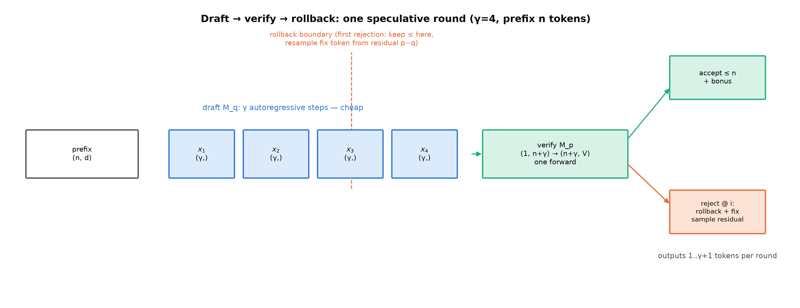
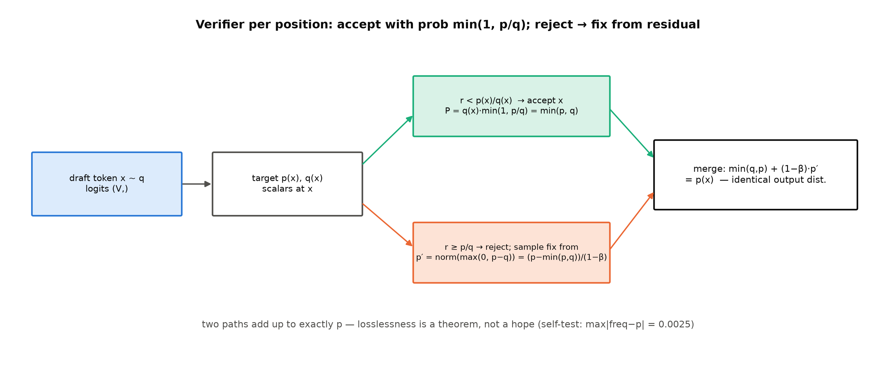
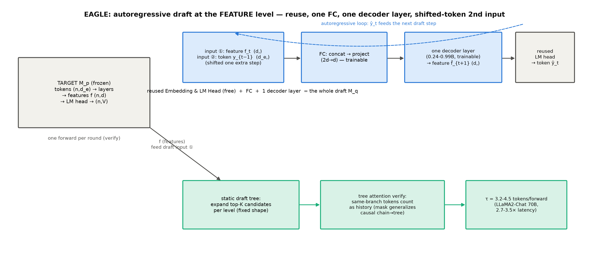
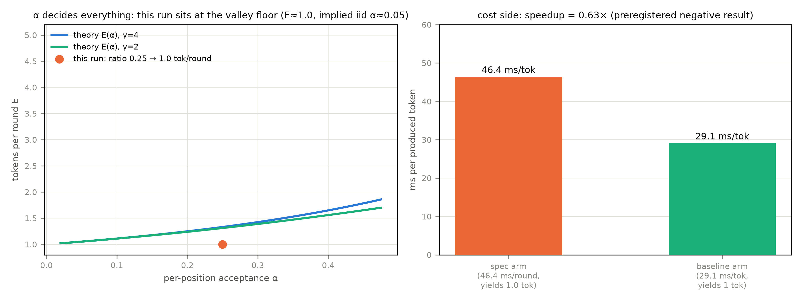

# 第 10 章 投机解码（speculative decoding）：起草、验证与回滚（数学重章）

> **最小背景栏**：三样前置——多项式采样的直觉（第 9 章）、MTP 的训练目标（Book4 第 8 章：一个前向出多个 token 位置）、KV cache 的步进语义（第 4-5 章）。本账**只用算术不用马氏链**（接受率按逐前缀独立处理——显式声明防滑入；Leviathan 的 E 式正是在这个简化假设下推的，论文自注「β 独立同分布仅为近似」）。

## 10.1 三笔账同一句话

上一章把出口的采样层收走（只改手感不改速度——串行原样传下来）；再往前，第 4-7 章的批处理摊薄了权重的账、第 8 章的 kernel 削了访存的账——但**自回归串行本身**这笔账还没人动：每步只出一个 token，因为第 $t{+}1$ 个 token 依赖第 $t$ 个的分布——因果链上没有并行空间。这是 Book1 第 11 章表 11.2 登记的 F2（自回归串行：因果掩码的另一面——机理发生在第 7 章，登记在 ch11）；Book4 第 8 章章末欠账框里写得清楚：「F2 的欠账在 Book6 第 10 章交货」，而且带了一批数字到货：DSV3 报告称 MTP 作 draft 时第二个 token 的接受率 85%-90%、端到端 1.8× TPS【厂商自报，2412.19437 §5.4.3】，Gloeckle et al. 3.0×【厂商自报】、Nemotron 97%【厂商自报】——三条数字的原文在 Book4 调研底单里逐字在档，本册引用沿用原证据等级。Book5 第 7 章又添了一笔：K3 把预训练的 MTP 层微调成 EAGLE-3 式的 draft（B5-2）——报告事实句挂着，本章兑现。

三笔账（F2 的串行、B4-4 的 MTP 数字、B5-2 的 K3 合流）指向同一个思想，这个思想 Book2 第 12 章卷末就预告过——「预填充与解码的两阶段拆分、以及『先猜后验』类解码加速，是 Book6 的正题」（【Book2 ch12 卷末，直引】）——**先猜后验**。本章要回答的问题：**这个思想凭什么不损失质量、什么条件下划算、猜手怎么造**。产出四样：验证器（正确性灵魂，配自机对拍实测）、加速比账本（$\alpha$-$c$-$\gamma$ 三元联合）、proposer（猜手）谱系地图、本机 n-gram（n 元重复查找）实测（预注册的负结果如实交卷——接受率 accept rate 的第一次实测在此）。记号契约提前钉死（红线③）：**$\beta$=逐前缀接受率、$\alpha=E(\beta)$、$c$=draft/target 单步时间比、$\gamma$=草稿数引 Leviathan；平均接受长度 $\tau$ 引 EAGLE Metrics 节**——Leviathan 全文无 $\tau$（对官方 PDF 字节级 grep 零命中），两套记号各安其位。

## 10.2 验证器：正确性的灵魂

投机的结构三拍子（图 10.1）：**起草（draft）**——一个便宜猜手连出 $\gamma$ 个候选；**验证（verify）**——target 一次前向同时算 $\gamma{+}1$ 个位置的分布（多算一位是彩头 bonus token，见后）；**回滚（rollback）**——从左到右核对，第一个猜错的位置之后的候选全部作废，从该位置采一个「正确」token 接着走。draft-verify 回路的形状流转表（规范强制项；这张回路是本章的关键组件，逐行带形状）：

| 步骤 | 运算 | 输入形状 | 输出形状 | 说明 |
|---|---|---|---|---|
| 起草 | n-gram 查找 | $(n,)$ 上下文 | $(\gamma,)$ 候选 | 免费猜手（10.5 节实测形态） |
| 拼前缀 | 序列拼接 | $(n,)+(\gamma,)$ | $(1,\,n{+}\gamma)$ | 候选挂上上下文 |
| 验证 | target 前向 | $(1,\,n{+}\gamma)$ | $(n{+}\gamma,\,V)$ | 一次并行算出全部位置分布 |
| 判接受 | 逐位比较+残差采样 | $(V,)$ | 每位 $(1,)$ | 接受/修正/定回滚边界 |
| 落地 | 截断+追加 | $(\gamma,)$ | $1..\gamma{+}1$ 个 token | 修正 token 计入产出 |



图 10.1 起草-验证-回滚时间线（自绘示意级）：draft 链 $(\gamma,)$、verify 一次 $(1,n{+}\gamma)$ 前向、回滚边界与 bonus token 标注。

论文的 Algorithm 1 把一轮拆成三段（与图 10.1 对齐）：起草段 for 循环 $\gamma$ 次小模型自回归；验证段 target 一次前向并行算 $\gamma{+}1$ 个位置的分布、抽 $\gamma$ 个均匀随机数定首个被拒位置；接受-修正段从残差分布采修正 token 返回。为什么这可能更快？target 一次前向算 $\gamma{+}1$ 个位置是**并行的**（prefill 式的批量）——比 $\gamma$ 次串行的单步便宜。串行墙被撞开一道缝，缝的宽度取决于猜手的命中率。但先要回答一个更根本的问题：**凭本事猜的 token，混进输出里会不会带偏质量？**答案是整章的灵魂定理——**不会，一点都不会**。

**验证器的数学**（Leviathan et al., ICML 2023）。规则直引："To sample $x\sim p(x)$, we instead sample $x\sim q(x)$, keeping it if $q(x)\le p(x)$, and in case $q(x)>p(x)$ we reject the sample with probability $1-p(x)/q(x)$ and sample $x$ again from an adjusted distribution $p_0(x)=\mathrm{norm}(\max(0,\,p(x)-q(x)))$ instead."【证据等级：官方论文 2211.17192 §2.3，直引（句尾 instead 逐字）】。用人话说：抽 $r\sim U[0,1]$，$r<p(x)/q(x)$ 则接受草稿 token；被拒不传染后面——从修正分布重采一个 token，**它把 draft 多给的概率扣掉、按余量归一**。修正分布的精确形式（附录 A.1）：$p'(x)=\frac{p(x)-\min(p(x),q(x))}{1-\beta}$，归一化常数恰为 $1-\beta$（$\beta=\sum_x\min(p,q)$）。分布不变性的三行账（图 10.2）：

$$P(x)=\underbrace{q(x)\cdot\min\!\Big(1,\tfrac{p(x)}{q(x)}\Big)}_{\text{接受路径}=\min(p,q)}+\underbrace{(1-\beta)\cdot p'(x)}_{\text{拒绝路径}=p-\min(p,q)}=p(x) \tag{10.1}$$

| 符号 | 含义 | 形状 |
|---|---|---|
| $p(x),q(x)$ | target / draft 在该位置的分布 | $(V,)$ |
| $\beta=\sum\min(p,q)$ | 分布重叠面积 | 标量 |
| $p'(x)$ | 拒绝后的修正分布 | $(V,)$ |

用人话说式 (10.1)：接受路径贡献重叠部分 $\min(p,q)$、拒绝路径补上剩余部分 $p-\min(p,q)$——两段拼起来**恰好是 $p$**。这不是近似：任何 draft 模型（哪怕瞎猜）都不会改变输出分布——论文的原文级保证："Speculative sampling, and therefore speculative decoding, guarantee an identical output distribution for any choice of approximation model $M_q$ without restriction."（对任意近似模型 $M_q$ 无限制成立）【证据等级：官方论文 §3.6，直引】。



图 10.2 验证器两分支（自绘示意级）：接受概率 $\min(1,p/q)$、拒绝走残差分布——两条路的贡献拼成 $p$ 本身。

这个灵魂定理值得用代码钉死。`spec_decode.py::self_test`（CLI 入口 `--self-test`）是**序列级对拍**：玩具 target 取 bigram stub（分布只依赖上一个 token，于是每个输出位置都有解析正身 $\mathrm{softmax}(W_{\text{prev}})$），让 `spec_decode.py::speculative_step` **本体**跑 20000 轮、逐位对拍——首位对 $\mathrm{softmax}(W_{\text{ctx}[-1]})$、第二位（d0 被接受条件下）对 $\mathrm{softmax}(W_{d_0})$：

**实物 10.1**（序列级分布对拍；看什么——两行偏差+一行结论：`speculative_step` 本体的输出逐位贴着解析正身走到千分位）

```text
[self_test] 首位分布 vs 解析正身 softmax(W[ctx[-1]])：max|freq-p|=0.0033（20000 试验）
[self_test] 第二位（d0 接受条件）vs softmax(W[d0])：max|freq-p|=0.0032（12189 试验）
[self_test] 通过——投机解码不改输出分布（speculative_step 本体的逐位实测证据）
```

【证据等级：本机实测，CPU fp32】这段对拍立过**两功**，都值得记。第一功是设计期的：第一版实现把拒绝分支写成「从完整 $p$ 重采」——单点位推演对拍当场抓住（该写法使 $P(\text{draft})$ 超过 $p$），修正为残差分布后通过；附录 A.2 论证过这不是风格问题——朴素非迭代拒绝采样的期望接受概率只能压到 $\le\alpha$，**残差修正把接受概率抬满到 $\alpha$，是一步完成的充要设计**。第二功是本册质量整改期的（更教益）：第二版实现把判接受用的条件分布索引错了一位（拿 $P(\cdot|\text{前缀}+d_0..d_i)$ 评判 $d_i$——条件里混进了被评判的 token 自身），**只测单点位规则的玩具对拍抓不住它**（不跑 `speculative_step` 本体）；升格为序列级对拍后偏差飙到 0.577（系统偏移：首候选自接受率从 0.61 塌到 0.03），当场现形。**「代码即证明」不如「对拍即证明」，而「对拍即证明」的前提是对拍对象是本体**——正确性灵魂要靠实测钉，这正是丛书三层对拍方法学在数学层的应用。

**期望长度的推导**（capped geometric——截顶几何分布，三要素：**逐位独立**（$\beta$ 同分布假设）、**首拒截断**（第一个被拒位之前的候选全部入账、之后的作废）、**bonus 上界 $\gamma{+}1$**（全中时 target 的第 $\gamma{+}1$ 位分布是同一次前向顺带算出的——「全中带彩头」））。记 $\alpha=E(\beta)$，单轮产出 token 数服从成功概率 $1-\alpha$、截顶 $\gamma{+}1$ 的截顶几何分布：

$$E=\frac{1-\alpha^{\gamma+1}}{1-\alpha} \tag{10.2}$$

用人话说：$\alpha$ 高时 $E\approx\gamma{+}1$（全中带彩），$\alpha$ 低时 $E\approx1$（每轮只保底一个修正 token）——**$E$ 是命中率的复利**。$\alpha$ 本身不是拍脑袋参数、有闭式正身：$\alpha=E(\min(p,q))$——**两个分布的重叠面积**（论文 Def 3.2-3.5 的计算链：自然散度 $D_{LK}=1-\sum\min(p,q)$，故 $\alpha=1-E(D_{LK})$）。直觉一步到位：draft 越懂 target，两分布越重叠、连击越长。

**例 10.1（构造例：$\gamma{=}4$ 三档 $\alpha$ 的期望与加速手算）** **$\alpha{=}0.8$**：$E=\frac{1-0.8^5}{0.2}=3.36$——每轮平均实得 3.36 个 token；设 $c{=}0.1$（draft 便宜），每轮成本 $\gamma c{+}1$（下节式 (10.3) 推导），加速比 $\approx\frac{3.36}{0.4+1}=2.4\times$。**$\alpha{=}0.5$**：$E=1.94$、加速 $1.9375/1.4\approx1.38\times$。**$\alpha{=}0.2$**：$E=1.25$、加速 $0.89\times$——**赔本**。输出读法：接受率低于三成，账面本来就翻不正——这个阈值感是全章的定盘星；且 $E$ 对 $\alpha$ 是凸增的（0.2→0.5 只赚 0.7 个 token，0.5→0.8 赚 1.4 个），**投机的收益高度集中在高 $\alpha$ 区**。

**例 10.2（构造例：3 候选逐 token 验证走查——一个被拒不传染）** 小词表 $\{a,b,c\}$，draft 连出 $[a,b,c]$；target 三位置的分布 $p_1=(0.5,0.3,0.2)$、$p_2=(0.1,0.8,0.1)$、$p_3=(0.6,0.2,0.2)$；贪心 draft 口径（接受概率=$p(\text{draft})$）。逐步：

| 位 | draft | 接受概率 | 抽到 $r$ | 结果 |
|---|---|---|---|---|
| 1 | $a$ | $p_1(a)=0.5$ | 0.72 | **拒**——从残差 $(0,\,0.3/0.5,\,0.2/0.5)=(0,0.6,0.4)$ 采出修正 $b$；轮终 |
| — | $b,c$ | — | — | 作废（回滚边界=位 1） |

换一组抽签走**连击轮**（同一套分布，只换 $r$）：

| 位 | draft | 接受概率 | 抽到 $r$ | 结果 |
|---|---|---|---|---|
| 1 | $a$ | $p_1(a)=0.5$ | 0.3 | **接受** |
| 2 | $b$ | $p_2(b)=0.8$ | 0.5 | **接受**——连击 |
| 3 | $c$ | $p_3(c)=0.2$ | 0.7 | **拒**——残差 $(0.6,0.2,0)$ 去零归一 $(0.75,0.25,0)$ 采出修正 $a$；轮终 |

两轮并排读：拒绝轮实得 1 个 token（修正 $b$）、连击轮实得 3 个（$a$、$b$、修正 $a$）——**单轮产出在 1 到 $\gamma{+}1$ 之间摆动，$E$ 正是它的均值**（10.3 账本的分子在此落地）；被拒不传染后续位的**验证**（它们照算），只作废它们的**采纳**；三连全过时位 4 的分布（同次前向顺带算出）白送 bonus，单轮封顶 $\gamma{+}1{=}4$。「拒绝是断链不是污点——修正 token 本身严格服从 target 分布」。

> **【考据框】三次独立发明。**投机解码在 2022-2023 被三个团队独立提出：Xia et al.（华为，arXiv:2203.16487，v1 于 2022-03-30，彼时题为 Generalized Aggressive Decoding，后更名）、Leviathan et al.（Google，2211.17192，ICML 2023 Oral）、Chen et al.（DeepMind，2302.01318）。Leviathan v2 明确承认 Chen 工作的独立同期性，并在 §5 转述了 Chen 的 Chinchilla 70B 数字（2×-2.5×——**注意这是 Chen 的结果，不是 Leviathan 的**；Leviathan 自家摘要口径是 T5-XXL 上的 2×-3×）。三篇的验证器数学同构——好想法的时代到了。

## 10.3 加速比账本：$\alpha$、$c$、$\gamma$ 的三元联合

式 (10.2) 只算了「每轮实得多少」，加速比还要除「每轮花多少」。draft 每步成本是 target 的 $c$ 倍（**$c$ 是硬件与实现的函数，$\alpha$ 是模型与任务的内在属性**——论文原话："Note that unlike $\alpha$ which is an intrinsic property of the models and the task, the value of $c$ depends on the hardware configuration and software implementation details."（换卡要重测 $c$、换任务要重估 $\alpha$）【证据等级：官方论文 §3 注记，直引】）。一轮 = $\gamma$ 步 draft + 1 次 target 验证：

$$\text{加速比}=\frac{E}{\gamma c+1}=\frac{1-\alpha^{\gamma+1}}{(1-\alpha)(\gamma c+1)} \tag{10.3}$$

盈亏线一行推出来（Corollary 3.9 的直觉版）：取 $\gamma{=}1$ 代入，加速比 $\ge\frac{1+\alpha}{1+c}>1$ 当且仅当 **$\alpha>c$**——draft 的命中率要高过它的相对成本。用人话说：**猜得准不如猜得起——只要猜手便宜到 $c<\alpha$，哪怕命中率一般也有得赚**（$\gamma{=}1$ 档保赚；$\gamma$ 取大还要看最优 $\gamma$ 的账——见下）。$\gamma$ 不是越大越好（Thm 3.8 对 $\gamma$ 求极值：draft 越多验证越贵、最优 $\gamma$ 随 $c$ 增大而缩小——论文 Fig 3：$c{=}0.01$ 时最优 $\gamma$ 可到 20+，$c{=}0.1$ 时缩回个位数）；按逐位 $\beta$ 自适应调 $\gamma$ 的上界是 $E=1/(1-\alpha)$（$\gamma\to\infty$ 极限），典型再涨约 60%——EAGLE-2 的动态树正是这个方向的思想先声。

三笔纸上账替论点收口（论文 Table 1 的 $c{=}0$ 极限）：$(\alpha,\gamma)$ 取 $(0.6,2)$ 加速 1.96×、$(0.8,5)$ 3.69×、$(0.9,10)$ **6.86×**——$\alpha$ 从 0.6 到 0.9，同一个机制从「温和」变「暴力」。还有一笔常被漏的**算力账**（Thm 3.11，论文 Table 1 的 OPERATIONS 列）：投机让总运算量**增加**——$(\alpha,\gamma)$ 取 $(0.6,2)$ 增 53%、$(0.9,2)$ 增 11%、$(0.9,10)$ 增 60%（$\alpha$ 越高浪费越少）；但 target 权重与 KV 每轮只读一次、读访存量缩减 $E$ 倍——**decode 是带宽受限的（第 1-2 章的账），多算的 FLOPs 是闲钱、省下的带宽是真金**。论文还送了一个量级锚：Transformer decoder 下验证步的总算力上界 $=$ 同尺寸 encoder 单次运行（并行算 $\gamma{+}1$ 位的额外计算，撑不过一次 encoder 的量级）【官方论文 §3.4 附注】。第 8 章「多算反而快」的 FA1 反向重算、本章的投机验证，是同一条物理学（带宽瓶颈下算力白送）的两个化身。

Leviathan 自己的实测是一套现成的实验方法学（我们 10.5 的 NPU 版照此设计）：**$\alpha$ 从分布对算**（Table 3：draft 小两个数量级时 $\alpha\in[0.5,0.9]$；unigram draft 只有 0.03-0.13、bigram 0.05-0.23——猜手形态直接写进 $\alpha$）；**$c$ 从 profiler traces 估**（T5-small 0.02、T5-base 0.04、T5-large 0.11——两模型单步延时比，换硬件要重测）；**理论代实测对拍**（Table 4：Thm 3.8 代入实测 $\alpha,c$ 的预测对 wall-clock 实测，多数行吻合、最大偏差归因两因子——基线实现差异与「$\beta$ 独立假设仅为近似」（论文自注））——直觉、形式化、验证三步走。端到端数字（T5-XXL）：加速 1.4×-3.4×，峰值在 ENDE/T5-small/T=0/$\gamma{=}7$（$\alpha{=}0.75$）档；**T5-large 反而只有 1.4-2.2×——draft 太大不划算的实证**（选型结论「小两个数量级」由此而来）【证据等级：官方论文 Table 2/3/4】。

一个容易被忽略的普适性：**验证器对全部采样口径无损**。§2.2 的标准化论证给了折算配方——argmax 等价于「把非最大元素概率清零后归一」、top-k 等价于「截断集合外清零后归一」、温度是显式缩放——任何采样口径都能改写成「从调整后分布的标准采样」，式 (10.1) 的不变性证明随之普适；且 §4.2 实证一刀：**温度越低 $\alpha$ 越高**（分布越尖重叠越大，EnDe+T5-small 0.75 对 0.62）——贪心场景（代码/数学，恰是第 9 章说「必须贪心」的场景）是投机最肥的土壤。复现口径留一个论文脚注的坑位：LaMDA 的输出恒过 Top40 过滤器，对贪心无影响、对标准采样有影响——复现别人论文的 $\alpha$ 前，先问它的采样口径【官方论文 footnote 6】。

## 10.4 proposer 谱系：猜手的五种形态

验证框架定了，胜负手在猜手（proposer——draft 候选的供给方）。五种形态按「猜手多贵、命中率多高」排列——先看总账（表 10.1）再逐个走：

表 10.1 proposer 谱系（「额外参数」=要训多少新东西；代表数字见各节证据等级）

| 形态 | 候选来源 | 额外参数 | 代表数字 | 本机可测 |
|---|---|---|---|---|
| draft-model | 独立小模型自回归 | 一整个小模型 | T5-small 作 draft 3.4×（v.s. T5-large 只 1.4-2.2×——draft 太大反亏） | 可（Book2 GPT-2 档） |
| Medusa | target 头上挂 K 个解码头 | 每头一层 FC | Medusa-2 2.3-2.8×（v3 口径） | 需训头 |
| EAGLE 系 | 特征级自回归 draft | 一个 FC+一层 decoder | 2.7-3.5×（LLaMA2-Chat 70B） | 需训 draft |
| MTP | 预训练埋的多 token 头 | 预训练期已付 | DSV3 1.8×【厂商自报】 | 需带 MTP 的模型 |
| n-gram | 上下文重复查找 | **零** | 免费但只适合复读负载 | **可（本章实测）** |

这张表横读是同一权衡的五次下注（额外参数换命中率）、纵读是一部猜手工业史（从外挂小模型到预训练埋头）——两条读法在真实引擎的 proposer 配置面上会再见面（Book8 第 2 章——B6-5 的正身地界）。【表内数字各节分别标证据等级】**draft-model** 最朴素：独立训一个小的同分布模型——贵在维护第二份权重，好在通用；论文的选型结论值得记：**draft 取比 target 小两个数量级通常最优**（$\alpha$ 与 $c$ 的平衡点）。EAGLE 论文的对照数字把这行的「难处」摆得很实：外挂 draft 基线在 7B/13B 档几乎无提升（没有合适的小模型可用）、33B 仅 1.12×、70B 才 1.88×（7B 当 draft）——**外挂路线要「恰好小两数量级的同分布模型」这个稀缺品**，这正是 Medusa/EAGLE 转向「与 target 同体」的动机。**Medusa**（2401.10774）换了思路——不加模型、在 target 最后一层隐状态上挂 K 个解码头，第 $k$ 个头直接预测 $(t{+}k{+}1)$ 位（每个头=单层前馈+残差，初始化对齐原 LM 头）。妙处有三：头与主干同体（共享主干计算、零分布式侵入）；多路候选拼成**树**、用**树注意力**（tree attention）一次验证（掩码推广：只有同一续写分支里的 token 才算历史——因果掩码是深度退化为链的树掩码；论文正身句："By employing this mask and properly setting the positional indices for positional encoding, we can process numerous candidates simultaneously without the need to expand the batch size."——不扩 batch 同时处理全部候选【证据等级：官方论文 2401.10774，直引】）；验收用 **typical acceptance**（放宽版：拿原模型概率当标尺，概率相对高即收——温度高时比严格拒绝采样接受得更多，代价是**不再严格无损**）。数字按版本分叉如实标（v1 摘要 2.3-3.6×，**v3（ICML camera-ready）摘要改为 2.3-2.8×**——本章取 v3 本地 PDF 口径）【证据等级：官方论文 v3】；技术阶梯现成：仅多头 1.5×→加树注意力 1.9×→优化树 2.2×→Medusa-2 联训 2.8×【官方论文 Table 3】。训练侧两档也值得记：**Medusa-1 冻结主干只训头**——Vicuna-7B 加头只要单张 A100 五小时（主干还能顺手量化）；**Medusa-2 联训**需三条处方（组合损失/差分学习率/两阶段 warmup——直接联训会把质量从 6.17 打到 5.925 的教训在案）。头数经验一句：「five heads are sufficient at most」（最多 5 头就够，配优化树 3-4 头可能即够）【官方论文 §2.2.3，直引】。还有一笔论文级的先声值得点名：Leviathan 附录的 **lenience**（把 $q$ 乘个 $l<1$ 再比较——放宽验收换接受率，$l$ 从 1 压到 0.1 时加速 2.5×→5.0×、$\alpha$ 0.62→0.84，代价是每个 token 的概率上界放宽到 $p/l$ 倍）——**「严格无损」与「高接受率」是一条滑杆的两端**，Medusa 的 typical acceptance 正是这条滑杆上的工业落点（l=1 的严格端是 Leviathan 正文）。

**EAGLE 系**（2401.15077 起）的洞察是**在特征层猜、不在 token 层猜**。两个论点（论文自陈）：其一，「autoregression at the feature level is simpler than at the token level」——token 序列跳跃、特征序列规整，同预算下特征 draft 1.9× 对 token draft 1.5×；其二，特征层有**固有不确定性**（玩具例：token「I」后 $p(\text{am}){=}0.6$、$p(\text{always}){=}0.4$，两条分支通向不同特征序列——$f_I$ 的下一个特征无法由 $f_I$ 单独定）——EAGLE 的解法一句话：「把**提前一步的 token 序列**（含采样结果）也喂进 draft」，消解不确定性后 2.8×（三档消融：token 1.5→feature 1.9→feature+提前一步 token 2.8）。draft 结构三件套：复用的 Embedding/LM Head（免训）+ 一个 FC + 一层 decoder（唯一可训，0.24-0.99B 视 target 而定——训练只需 2-4B token，对照 TinyLLaMA 的 3000B）——整体结构见图 10.3。



图 10.3 EAGLE 特征级 draft 结构图（自绘示意级，据 2401.15077）：冻结 target 出特征，draft 每步吃「上一步特征+提前一步 token」双输入，经 FC+一层 decoder 出下一特征、复用 LM Head 出 token，自回归展开静态草稿树、树注意力一次验证。draft 阶段用**树注意力**自回归展开静态草稿树（m 次 forward 出多于 m 个 token 的树）——树对链的边际贡献有数：$\tau$ +0.62-0.75（LC-70B 3.12→3.81）、加速 +0.3-0.5，且不增 forward 次数只增每次的 token 数【官方论文 Table 5】；附录还留了句给续作的伏笔：「the optimal tree structure is likely context-dependent」（最优树结构多半依赖上下文）——EAGLE-2 的动态树正是顺这句话做的（EAGLE-1 成文更早、全文未点名 EAGLE-2，考据口径如实）。**MTP 作 draft 就是 B4-4 那笔账**：预训练期就埋多 token 预测头的模型（DSV3 全系），推理时头直接当 proposer。形态账值得看一眼：MTP 头的结构是**镜像骨干的一个 Transformer 块**（Book4 第 8 章已拆，此处不重教——记住「不是外挂小模型、是骨干的同构缩影」即可），深度浅、参数省，与 target 同源同tokenizer，天然懂 target 的分布。DSV3 报告的读数勾勒了接受率的形态：**第二 token 位置接受率 85%-90%，位置越往后衰减越快**【厂商自报，2412.19437 §5.4.3】——恰是截顶几何分布的实证画像（前几位高 $\beta$、尾部掉头），端到端 1.8× TPS。资产账是它最漂亮的地方：别的 proposer 要专门训（draft-model 训一整个、EAGLE 训一层、Medusa 训几个头），MTP 的训练成本**预训练期已经付过**（多 token 目标本来就是训练正项），推理期白捡一个 proposer——训练资产变推理资产，一条流水线两头收钱。**这里正是 K3 的合流点（B5-2 兑现）**：K3 把预训练期的 MTP 层微调成 EAGLE-3 式的 draft——训练目标（Book4 第 8 章）与推理结构（本章）在工业实践里接上了头；报告同时记录了 KDA 状态「原位更新与验证回滚」的张力（**只缓存投影输入、片上重建**——线性状态原位前进、无法平凡回滚，验证失败的回滚要付重建的账；「cannot be trivially rolled back」是报告原话口径）。把这笔账拆开看：KV cache 的回滚之所以便宜，是因为块按请求持有、作废即还池（第 5 章）；线性状态是**单份定长张量**、被 draft 路径原地写过就覆没了——所以只能「缓存投影输入、片上重建」，用重算换回滚。混合架构的 draft 验证要为状态回滚付新账，2026 前沿的真实工程问题。**n-gram** 最极端——没有模型，从上下文找 n 元重复直接抄续写（第 9 章 penalties 的反义词：专门利用重复）；免费但只适合复读型负载。

谱系的对照数字收一组（MT-bench、贪心）：EAGLE 对 Medusa 快 1.5-1.6×、对 Lookahead 快 1.7-2.1×；LLaMA2-Chat 70B 延迟 2.7-3.5×；平均接受长度 $\tau$ 3.2-4.5（每轮 target 前向实得 token 数）【证据等级：官方论文】——**$\tau$ 正是 EAGLE Metrics 节的记号**（树上多路采样时逐位 $\alpha$ 难定义，论文改报 $\tau$；本册记号分工的示范处：链式 draft 报 $\alpha$、树式报 $\tau$，两不混用）。

## 10.5 本机实测：一个如实交卷的负结果

`spec_decode.py`（`spec_decode.py::speculative_step`）实现验证器（贪心 draft 忠实口径+残差修正——10.2 的实物 10.1 已验正确性）与 n-gram proposer，207M 为 target，双 workload 实测。**预注册**（设计期写定）：repeat 负载（复读语料）预期命中率可观；open 负载（无重复语料）预期近零；**负结果分支**——加速比 $\le1$ 如实报（三层归因：模型能力/计时口径/猜手形态）。

**实物 10.2**（双 workload 读数；看什么——repeat 臂三行、open 臂一行）

```text
[repeat] 接受 0.25 | 每步实得 1.0 tok | 加速比 0.63（投机 1.393s vs 基线 0.873s）
[open]   接受 0.25 | 每步实得 1.0 tok | 加速比 1.01（投机 0.027s vs 基线 0.027s）
```

【证据等级：本机实测，Atlas 910B3，bf16，$\gamma{=}4$，`log/book6-ch10/spec_decode_base.json`】换算与读法：repeat 臂 1.393 s/30 轮 $=$ 每轮 46.4 ms、基线 0.873 s/30 token $=$ 每 token 29.1 ms——加速比 0.63 恰为 $\frac{29.1\times1.0}{46.4}$（实得 $E{=}1.0$ 对上，图 10.4 右）；open 臂的续种策略（无命中按语料续一字）30 次提议里 30 次落空、仅 1 次凑齐 3-gram 候选（有效步 1/30，两臂各跑一次前向，1.01 是「没投机就没盈亏」的空转读数）——**开放生成无重复可抄，n-gram 的提议本身是空的**。repeat 臂另有 27 次空提议（续种后命中）。负结果的三层归因，比正结果更有教学价值。**其一，模型能力**：1000 步弱模型没学会复读——repeat 负载里上下文有现成重复，target 分布对续写 token 的逐位置信极低：每轮实得 $E{=}1.0$（基本只拿修正 token 保底），按式 (10.2) 反解 iid 假设下的 $\alpha\approx0.05$；打印的「接受 0.25」实为每轮约 1 个修正 token 对 4 个候选的**比值**（30/120），不是逐位接受率——两个数方向一致：**命中率离三成阈值远得很，账面本来就翻不正**（图 10.4 左的理论曲线族把本机点钉在谷底）。工业数字（85%-90% 接受率、1.8×-3.5×）的前提是强模型对自身输出（或自家 MTP 头的输出）的高置信——**$\alpha$ 是模型与猜手的联合属性，不是机制的属性**。**其二，计时口径**：教学实现投机臂每轮一次 $(n{+}\gamma)$ 前向、基线臂每 token 一次前向，两臂同源起始上下文、同样逐步 sync——但投机臂因续种机制上下文长到 512 截断窗，基线臂停在 300 上下文附近，**每轮 46.4 对每步 29.1 ms 的 1.6× 是「验证开销+上下文更长」的合并账**（长度口径如实注记；真实引擎两臂共享 KV 与执行层，账更公平——第 7 章的对照纪律同款）。**其三，猜手形态**：n-gram 是最弱的猜手，EAGLE/MTP 的命中率天差地别（10.4 谱系）。三层拨开，机制的边界清楚了：**投机解码是命中率生意——模型越自信、draft 越懂模型，生意越红火**。



图 10.4 本机实测对理论【证据等级：本机实测，Atlas 910B3，运行栈 NPU；数据源 `log/book6-ch10/spec_decode_base.json`】：左=$E(\alpha)$ 理论曲线族与本机点（比值 0.25、$E{=}1.0$——iid 回代 $\alpha\approx0.05$，钉在谷底；天花板 $1/(1-\alpha)$ 在 $\alpha{=}0.2$ 处才到 1.25，本机离天花板远得看不见）；右=两臂成本（46.4 ms/轮对 29.1 ms/token——负结果的算术正身）。

> **【实现对照框】** vllm-ascend 运行栈的 proposer 全家（黑盒口径，源码一手）：`SpeculativeMethod` 家族含 ngram/ngram_gpu/suffix/medusa/draft_model/eagle/eagle3/MTP 族（deepseek_mtp/qwen3_next_mtp 等 22 个模型专属字面量）/dflash/dspark——vllm-ascend 侧逐个有对应 Ascend proposer 实现【证据等级：本机源码，运行栈 0.27.1】本册早先曾按 CUDA 专属把 eagle/suffix/DFlash 标注为「本机不可直接做」——功能矩阵一手摸底更正了这个判断：vllm-ascend 侧实现均在，910B3 实测冒烟仍是待办，按「实现存在、实测待冒烟」口径如实挂。。ngram 的参数正身（本机 0.27.1 docstring 一手）：`prompt_lookup_max/min` 两键全缺省时双双默认 5、只给其一则另一键镜像——CLI 形如 `--speculative-config '{"method":"ngram","num_speculative_tokens":4,"prompt_lookup_min":2,"prompt_lookup_max":5}'`（纯配置零权重依赖——Book6 教学序首选它的原因）。观测口径（黑盒正身）两路：引擎周期性打 INFO 日志行「SpecDecoding metrics: Mean acceptance length: %.2f, …」；Prometheus 三计数器 `vllm:spec_decode_num_{drafts,draft_tokens,accepted_tokens}_total`（PromQL 原式：接受率 $=$rate(accepted)/rate(draft_tokens)、平均接受长 $=1+$rate(accepted)/rate(drafts)）——注意 **vLLM 的 mean acceptance length 惯例计入 bonus token**（源码注释原文「Conventionally, mean acceptance length includes the bonus token」）【证据等级：本机源码 docstring】——与论文侧 $\tau$、$\alpha$ 对表时口径要换算。

## 10.6 本章小结

F2（自回归串行，2017 年的欠账）、B4-4（MTP 作 draft，带着三条厂商数字）、B5-2（K3 的合流）三笔账在此合销——Book1 ch8 预告、ch9 9.7 接力的「一次验证多条候选」在此收线——验证器一次比 $\gamma$ 个候选，正是 beam search「一次比多条」思想在采样时代的借尸还魂（Book1 第 8 章欠账框的原话）。**带走的心智**：两幅画。**其一，投机解码是花小钱批发「验证」**——串行墙被「一次并行的验证换多次串行的生成」撞开一道缝；输出分布严格不变（式 (10.1) 的两路合并——不是近似，是定理，本机对拍 0.0025 钉死）；变的只有速度。**其二，速度的全部秘密在 $\alpha$——分布重叠面积**：draft 越懂 target 生意越红火、$\alpha$ 低于 $c$ 就收摊；模型越自信（温度越低）缝越宽。**其三（方法论的一笔），对拍要打在本体上**：本章两个实现 bug（拒绝分支缺残差、判接受的条件分布错一位）都不是读代码读出来的，是对拍逼出来的——而第二个 bug 只有把对拍对象从「单点位规则」升到 `speculative_step` 本体的序列输出才现形；**验证的覆盖面要配得上被验证的断言**，这条对第 12 章要读的引擎级测试同样成立。读任何投机解码的加速倍数，先问三个数——$\alpha$（谁的模型、什么温度）、$c$（什么硬件）、$\gamma$（怎么选的）；三个数不齐，倍数无从比较。本册的一个负结果与工业的三条数字并排陈列——机制、边界、前提，一页讲完。投机撞开串行墙之后，decode 的下一笔大账是**权重本身的字节**——207M 每步要搬 414 MB、外推到千亿参数就是每步上百 GB（bf16 口径约 200 GB——414 MB×483）；把权重压小的手艺，是下一章的正题。

> **【欠账】** 五型 proposer 在真实引擎的统一接口与调度协同（proposer 生命周期、批感知的 draft 管理）→ Book8 第 2 章

## 动手验证

```bash
cd 工作区根目录 && source env.sh
# ① 序列级分布不变性对拍（实物 10.1 数据源；CPU 分钟级——20000 轮 speculative_step 本体）
python "code/ch10/spec_decode.py" --self-test
#   验收行：首位 max|freq-p|=0.0033、第二位 0.0032（均 < 0.012）
# ② 双 workload 负结果（实物 10.2/图 10.4 数据源；NPU 分钟级，先 npu-smi 选卡）
ASCEND_RT_VISIBLE_DEVICES=<卡> python "code/ch10/spec_decode.py"
#   验收行：[repeat] 加速比 0.63（E=1.0、iid 回代 α≈0.05 谷底的理论互证）
# ③ 本章四图（图 10.1/10.2/10.3/10.4）
python "code/ch10/fig_ch10.py"
# ④ 正主：arXiv:2211.17192（Leviathan——Algorithm 1/Thm 3.8/Cor 3.9；全文无 τ）/2401.10774（Medusa v3）
#    /2401.15077（EAGLE-1——Fig 3 玩具例/Metrics 节 τ 正身）；B4-4 数字底单：Book4 papers/05 §五
