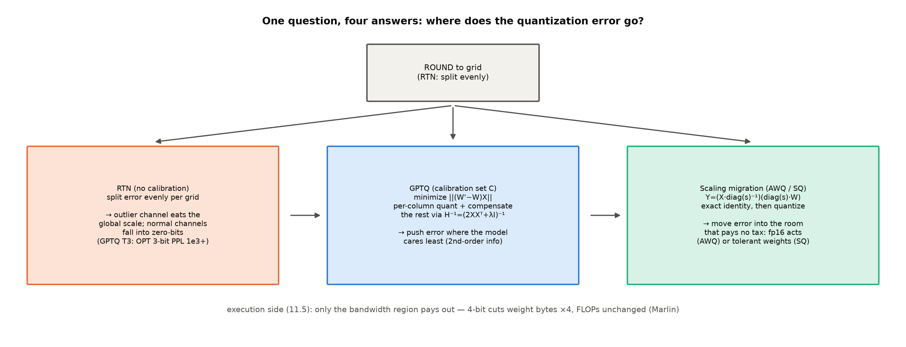
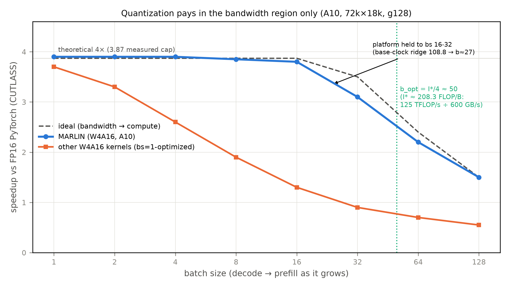

# 第 11 章 量化推理：把权重压小再跑起来

> **最小背景栏**：前置两块——量化-反量化的 round-trip 直觉（Book4 第 7 章的 FP8/MXFP4 格式课已教，本章不重教格式）与第 2 章的字节账（权重 $N\times$每参数字节、decode 带宽下限 $=$权重字节$÷$带宽）。KV 量化侧已在第 3 章讲过（KIVI 的非对称 2bit）——本章是权重侧与激活侧的主场。

## 11.1 接力棒从训练侧传来

两笔欠账在此到期。Book1 第 8 章读 2017 训练配方时记下：「低精度从训练侧一路传到推理侧（→ Book4 第 7 章、Book6 第 11 章）」【Book1 ch08 卷末 L206，直引】——Book4 第 7 章把训练侧教完（FP8 训练、MXFP4 量化感知），章末欠账框原话：「训练侧这一棒到此交棒：推理侧的量化（GPTQ/AWQ/KV 量化、FP8/MXFP4 部署矩阵）→ **Book6 第 11 章 / Book8 第 8 章**」【Book4 ch07 L196，直引】——本册收前半：**推理侧为什么更自由、怎么压、压完怎么跑得快**；部署矩阵的后半句留给 Book8。

上一章投机解码撞开串行墙后留下的话头还在：decode 每步仍要整搬 414 MB 权重字节（第 2 章预立的账：414 MB、0.348 ms 下限）——本章就来砍这笔账。推理侧自由在哪？训练要梯度（低精度必须可微、缩放因子要跟着训），推理只要前向——**训练后量化**（PTQ，post-training quantization）不必重训、不必数据全量重放，部署当天就能压。这份自由有多便宜，校准集（calibration set——量化时拿来统计分布的一小把真实输入）的账就是答案：GPTQ 全程只用 **128 条随机 2048-token 的 C4 片段**（零任务数据——对 175B 也只需约 26 万 token，训练尾巴的零头）、AWQ 用 **16 条 Pile 序列**、SmoothQuant 用 **512 条 Pile 随机句子**【证据等级：官方论文各自 §5 实验设置】——对 7B 级模型，几百万 token 的「训练尾巴」都不用，几万 token 就够压。自由的代价是精度风险全押在「压」这一下上；而「压完怎么跑」藏着一个格式矩阵：压到什么位宽（INT8/INT4/FP8）、压哪边（仅权重 W4A16 / 权重激活都压 W8A8 / 连 KV 也压）——位宽决定省多少字节，压哪边决定误差落在哪间房。

本章四种方法答的是同一个问题：**误差往哪摊**（图 11.1）。RTN 把误差均摊给网格（崩在离群）；GPTQ 按二阶信息把误差摊给模型最不在乎的地方；AWQ/SmoothQuant 用一个代数恒等式把误差搬进不收税的房间；Marlin 在执行侧把「省下的字节」兑成时间——但只在带宽区兑。



图 11.1 误差摊派三路线（自绘示意级）：同一个「round 到网格」动作，三种误差处置哲学——均摊（RTN）、按 Hessian 摊派（GPTQ）、恒等式搬家（AWQ/SQ）；执行侧（Marlin）决定红利在哪兑付。

## 11.2 RTN 的崩溃：误差不均才是死因

最朴素的压法是 round-to-nearest（RTN，四舍五入到最近档）：整一个缩放 $\Delta=\max|x|/(2^{N-1}-1)$（$N$ 为位宽），权重除以 $\Delta$、round、存低比特——**每档等宽，误差按「离网格多近」均摊**。缩放的作用域（口径）是第一变量：per-tensor 全张量一条尺、per-channel 每个输入通道（列）一条尺——离群所在的轴（KIVI 的 K 侧同款口径，见第 3 章）、per-token 每行（输出通道）一条尺——离群散布在每一行，行尺仍被撑大。真正的一课：**只有沿离群轴切尺才能隔离它——尺的轴向比粗细更要紧**。

`quant_sim.py::rtn_quant` 的实测（构造：$256\times128$ 权重、正态基底 ×0.02、**通道 3 的幅值 ×80** 制造一个离群通道，4bit）：

**实物 11.1**（RTN 三口径相对误差；看什么——一行读完「离群杀伤力随口径变细而递减」）

```text
per-tensor 0.683 | per-channel 0.141 | per-token 0.553      （相对误差=|Δ|均值/|x|均值；4bit）
```

【证据等级：本机实测，CPU，`log/book6-ch11/quant_sim_base.json`】per-tensor 的误差是 per-channel 的近五倍——离群通道把全局 $\Delta$ 撑大约 80 倍，正常通道的取值全被挤进最底下零头几档，**几乎量化成零**。

**例 11.1（构造例：4 个权重、1 个离群的 RTN 账——「为什么 per-tensor 崩」的手算版）** 权重 $w=[0.9,\ 1.0,\ 0.95,\ 80.0]$（末位离群），4bit 无符号 15 档。**per-tensor**：$\Delta=80/15\approx5.33$，量化后 $[\mathrm{round}(0.9/5.33),\dots]=[0,\ 0,\ 0,\ 15]\times5.33=[0,\ 0,\ 0,\ 80]$——**前三个权重全部归零**（逐元素相对误差均值 $(1{+}1{+}1{+}0)/4=0.75$；按本章口径 $|\Delta|$ 均值$/|x|$ 均值 是 0.034——离群把分母撑大、相对口径「看不见」伤害，这本身就是 per-tensor 的病）。**per-value 逐元素**（理想化参照）：每个值一条尺 $\Delta_i=w_i/15$，量化即精确表示——误差 0。**缩放迁移（11.4 预演）**：给离群通道配 $s=1/80$（把 80:1 的离群比缩回 1）乘进权重——该通道权重 $80\to1.0$（激活侧同通道乘回 80，落进不量化的 fp16 房间），权重变 $[0.9,\ 1.0,\ 0.95,\ 1.0]$、per-tensor $\Delta=1/15\approx0.067$——前三个权重的档位立刻回到 13-15 档。输出读法：**离群的伤害不是它自己量化不准，而是它把别人的尺撑坏**；口径变细（per-channel/迁移）治的都是「别人的尺」。

任务级的下场有论文正身。GPTQ 论文 Table 3：OPT 全家族 3bit RTN 在 WikiText2 上 PPL 从 125M 的 $1.3\times10^3$ 崩到 175B 的 $7.3\times10^3$（FP16 基线 8.34），4bit RTN 也有 10.54（对 FP16 8.34；PPL=perplexity 困惑度，越低越好）；Fig 1 的双联曲线把崩塌画在眼前——OPT 4bit RTN 在 66B 处跳到 110、BLOOM 3bit RTN 到 176B 处标 571，GPTQ 两联都贴着 FP16 走；LAMBADA 零样本上 3bit RTN 全家族贴随机水平（Fig 3 的线贴地走——「随机水平」的字面义：准确率掉到瞎猜档）【证据等级：官方论文 2210.17323 Table 3/Fig 1/Fig 3】。**误差不均，才是量化的死因；四舍五入本身没错。**

## 11.3 GPTQ：按二阶信息摊派误差

> **【考据框】谱系三步：OBD → OBS → OBQ → GPTQ。**「按敏感度删参数」的思想线：OBD（Optimal Brain Damage，LeCun et al., 1990）用对角近似做最优剪枝；OBS（Optimal Brain Surgeon，Hassibi, Stork & Wolff, 1993）升级到全 Hessian、删一个参数要**补偿**其余参数——GPTQ 论文引用的正是 Hassibi et al. 1993（注意别与 OBD 混写）；OBQ/OBC（arXiv:2208.11580，NeurIPS 2022，Optimal Brain Compression 框架的量化分支）把 OBS 从「删」改成「量化」、首次把 OBS 式压缩跑通现代深度网络（ResNet-50、transformer 级）；GPTQ（arXiv:2210.17323，ICLR 2023）把 OBQ 工程化到百亿参数级。一个引文陷阱：OBQ 的 ID 是 **2208.11580**，一位之差的 2208.10580 是一篇机器人综述。

GPTQ 的目标函数先立正身——逐层重建（不是逐权重贴近，是**输出贴近**）：对每个线性层，找量化后的 $W'$ 使

$$\arg\min_{W'} \|W'X - WX\|_F^2,\qquad H_F = 2X_F X_F^{\top} \tag{11.1}$$

其中 $X\in\mathbb{R}^{d_{\text{in}}\times m}$ 是 $m$ 条校准数据的层输入（形状：$(d_{\text{in}},m)$，转置习惯按列存样本）、$H_F=2X_FX_F^{\top}\in\mathbb{R}^{d_{\text{in}}\times d_{\text{in}}}$ 是该目标的 Hessian（$F$=尚未量化的下标集合）。用人话说式 (11.1)：**别的权重可以动——只要输出不变**；误差在输出空间是向量，向量可以对消。OBQ 的两联式（贪心选点+余量修正，GPTQ Eq(2) 的直接前身）：量化第 $q$ 个权重时，

$$w_q \leftarrow \mathrm{quant}(w_q),\qquad \delta_F = -\frac{w_q-\mathrm{quant}(w_q)}{[H_F^{-1}]_{qq}}\cdot (H_F^{-1})_{:,q} \tag{11.2}$$

| 符号 | 含义 | 形状/量纲 |
|---|---|---|
| $W, W'$ | 层权重 / 量化后权重 | $(d_{\text{out}}, d_{\text{in}})$ |
| $X$ | 校准集层输入（按列存样本） | $(d_{\text{in}}, m)$ |
| $H=2XX^{\top}(+\lambda I)$ | 重建目标的 Hessian（含阻尼） | $(d_{\text{in}}, d_{\text{in}})$ |
| $\delta_F$ | 施加到未量化权重的补偿 | $(d_{\text{out}},\,|F|)$ |
| $[H^{-1}]_{qq}$ | 被 quant 权重的自敏感度 | 标量 |

用人话说式 (11.2)：量化 $w_q$ 造成的误差，按 $H^{-1}$ 第 $q$ 列的比例**摊派**给所有还没量化的权重去对消——像拆东墙前先查账：哪面墙补得起（$[H^{-1}]_{qq}$ 小=不敏感=摊得起）。OBQ 逐权重反复「选点-量化-补偿-刷新 $H^{-1}$」（秩一刷新免重算逆，GPTQ Eq(3)），复杂度 $O(d_{\text{row}}\cdot d_{\text{col}}^3)$——ResNet-50（25M）就要约 1 GPU 小时，十亿参数不可及【证据等级：官方论文 §3】。

GPTQ 的三步工程化，每一步都先交代动机。**第一步，任意固定顺序替代贪心**——关键观察是 $H$ 只依赖层输入 $X$、与权重行无关，于是**全行共用同一个消元顺序**，逆矩阵的更新从每权重一次降到每列一次，复杂度砍掉 $d_{\text{row}}$ 倍（论文实测：贪心收益很小，换得不亏）；**第二步，惰性批更新**——列的舍入决策只受作用于该列自身的更新影响，于是以 $B=128$ 列为块、块内攒着批更新、块完一次全局更新（Eq(4)(5) 的多权重版公式），计算量不变、化解访存瓶颈；**第三步，Cholesky 重构**——数十亿参数下 $H^{-1}$ 数值上趋于不定，反复求逆会把误差推错方向；观察到「量化 $q$ 列只需要 $H^{-1}$ 的第 $q$ 行」，而对称消元本质上就是 Cholesky 分解（差一个平方根）——预先用成熟 kernel 一次算出全部所需行，配 $\lambda=1\%$ 平均对角元的阻尼，大模型上稳【证据等级：官方论文 §4 三步原文】——论文 Fig 2 把这套几何画得极清楚（左=Cholesky 形式的上三角逆 Hessian 表，右=按块推进的权重矩阵、白色列正在量化、蓝色区块完统一更新），值得一瞄。合计：OPT-175B 约 **4 GPU 小时**压完，首次让 175B 在单卡上生成。

先把式 (11.2) 摊开手算一遍（**例 11.2（构造例：两列权重的对消账——补偿到底在补什么）** 设 $w=[0.8,\ 0.5]$（两个输入通道的权重行）、2bit 档 $\{0,\pm1\}$、校准输入两通道强相关（$X=\begin{bmatrix}1&1\\1&0.6\end{bmatrix}$，按行=通道），$H=2XX^{\top}=\begin{bmatrix}4&3.2\\3.2&2.72\end{bmatrix}$、$H^{-1}=\begin{bmatrix}4.25&-5\\-5&6.25\end{bmatrix}$。量化第 1 列：$\mathrm{quant}(0.8)=1.0$、误差 $e=0.8-1.0=-0.2$；补偿 $\delta_2=-\frac{e}{[H^{-1}]_{11}}[H^{-1}]_{12}=-\frac{-0.2}{4.25}\times(-5)=-0.235$，第 2 列改成 $0.5-0.235=0.265$。验输出（样本 $x=(1,1)$）：只做 RTN 误差 $+0.2$；GPTQ 误差 $0.2-0.235=-0.035$——**缩小 5.7×**。输出读法：$H^{-1}_{12}<0$ 说「两通道同涨同跌」，第 1 列多算出来的 $+0.2$ 就让第 2 列**少算一点**来对冲——误差在输出空间对消，这正是「按二阶信息摊派」的最小标本。）这套「逐列量化+补偿」我们做了 toy 级本机复现（`quant_sim.py::main` 的 GPTQ-sim 臂：同一只带离群通道的 $W$、同一 4bit 逐列量化器，玩具 Hessian $=2XX^{\top}+1\%$ 阻尼、96 条伪校准样本，输出空间相对误差 $\|(W'-W)X\|_F/\|WX\|_F$）：

**实物 11.2**（GPTQ-sim 对拍 RTN；看什么——同一量化器，补偿让输出误差降 4 倍）

```text
RTN（逐列、无补偿）输出误差 0.1178 | GPTQ 单块版 0.0294 —— 改善 4.0×
```

【证据等级：本机实测，CPU fp32，`log/book6-ch11/quant_sim_base.json` 的 gptq_sim 块——toy Hessian 口径，非官方实现】证据群四件（全部官方论文级）：其一，主结果 Table 3——OPT-175B 4bit GPTQ PPL 8.37（FP16 8.34，仅 +0.03）对 RTN 10.54；其二，谱系对照 Table 8——OPT-125M 上 OBQ 4bit/3bit 32.52/69.32 对 GPTQ 31.12/53.85，**质量不降、时间砍三个数量级**；其三，死穴 Table 4（AWQ 论文做的跨方法对照）——LLaMA-7B INT3-g128：RTN 7.01、**GPTQ 不带 act-order 重排反劣化到 8.81**、带重排（GPTQ-R）6.53、AWQ 6.35（FP16 5.68）——GPTQ 的补偿依赖「先压不敏感列」，列敏感度排序本身是个隐含超参；其四，正交叠加 Table 9——AWQ+GPTQ 组合在 OPT 全家族再降一截（6.7B：7622→16.65→15.71；30B：8170→11.75→11.38）——**两种摊派哲学作用在不同对象上，可叠**（与 11.4 的恒等式收尾呼应）。

用人话总结这派：**别把误差均匀撒——撒给模型最不在乎的地方**（Hessian 告诉你哪里不在乎）。

## 11.4 AWQ 与 SmoothQuant：同一恒等式的两个方向

Han Lab 同门的两篇用了**同一个代数恒等式**：

$$Y = (X \cdot \mathrm{diag}(s)^{-1})\,(\mathrm{diag}(s)\cdot W),\qquad X\in\mathbb{R}^{B\times d},\ W\in\mathbb{R}^{d\times d'},\ s\in\mathbb{R}^{d}_{+} \tag{11.3}$$

| 符号 | 含义 | 形状/量纲 |
|---|---|---|
| $X$ | 一层输入激活（$B$ 为 token 批量——与 GPTQ 批更新的块大小 $B{=}128$ 不同物） | $(B, d)$ |
| $W$ | 层权重 | $(d, d')$ |
| $s$ | 逐输入通道缩放 | $(d,)$ |
| $Y$ | 输出 | $(B, d')$ |

输入逐通道除以 $s$、权重逐通道乘回 $s$，乘积**严格不变**（本机验证恒等误差 3e-05，浮点噪声级）。但两家用它搬**相反方向**的难度——图 11.1 右路的两半。

**SmoothQuant**（arXiv:2211.10438，ICML 2023）的动机是三条经验观察：权重好量化（分布平坦均匀）；激活的离群通道幅值可达其他通道的百倍、per-tensor 下霸占 $\max$ 让正常通道只剩两三档有效位；且离群**钉死在固定通道、跨 token 持续出现**（论文 Fig 4 的红竖条）——所以治它要用**逐通道**的 $s$。但逐通道激活缩放有硬件墙：模拟实验（论文 Table 1）里它确实能保精度（这是「理想解」的存在性证明），可 INT8 的 GEMM 指令流只容忍缩放作用在**外维**（输出的 token 维与通道维），作用在内维（输入通道）会打断高吞吐张量指令序列——**模拟里有效的解，硬件上不存在**；恒等式正是绕开这堵墙的通道。解法就是恒等式：把激活的逐通道难度**离线搬进权重**，$s$ 的闭式

$$s_j = \frac{\max|X_j|^{\alpha}}{\max|W_j|^{1-\alpha}} \tag{11.4}$$

$\alpha$ 是搬家比例旋钮（标量、$\in[0,1]$；符号承式 (11.3) 表——$\alpha{=}0$ 不搬、$\alpha{=}1$ 全搬给权重；$0.5$ 对半分）。用人话说：$\alpha$ 大=多迁给权重——离群越凶的模型 $\alpha$ 越大：论文的 $\alpha$ 谱，OPT/BLOOM 0.5、GLM-130B 0.75（约三成离群通道）、LLaMA-2 7B/13B 0.85、70B 0.9、Falcon-7B 0.6【证据等级：官方论文 §5.1/§5.5+Table 7】。崩溃与拯救的实证（Table 3）：朴素 W8A8 在 OPT-175B 上零样本 35.5%、PPL 崩到 93,080；SmoothQuant 同设置 66.4-66.8% 持平 FP16（O1/O2/O3 三档）【证据等级：官方论文 Table 3】。本机模拟同构（`quant_sim.py`：迁移后激活最大值 114.5→24、per-tensor INT8 误差 0.227→0.047，**改善 4.8×**，$\alpha{=}0.5$ 闭式）；端到端收益是 530B 模型 16 卡压到 8 卡。$s$ 融进前一算子（LayerNorm/linear）的参数里，**运行时零额外 kernel**——「离线等价变换」是这派的工程身份。

**AWQ**（Activation-aware Weight Quantization，激活感知权重量化——arXiv:2306.00978，MLSys 2024 最佳论文；名字就是题眼：看激活不看权重）反过来——**权重侧 4bit、激活侧 fp16 不动**（W4A16），用恒等式保护权重里最要命的 1%。先证「保 1% 有效、且只有激活能指认」（Table 1 三臂对照，OPT-6.7B INT3 PPL）：RTN 23.54、按**权重**幅值选 22.37（≈无效）、随机选 24.23、按**激活**幅值选 1% 通道 → **11.39**（FP16 10.86）【证据等级：官方论文 Table 1】——显著通道要看激活分布、不看权重自身。再证「不保 FP16 也能等效」：把显著通道乘 $s$ 放大再量化（激活侧除回），推导的误差比 $\frac{\Delta'}{\Delta}\cdot\frac{1}{s}<1$（三条经验事实：舍入误差近似均匀、放大单通道通常不动组内最大值 $\Delta'\approx\Delta$、$\Delta'$ 与 $x$ 都是 fp16 无量化税）——**保护=放大后相对分辨率变高**，无需混合精度。混合精度（那 1% 保 FP16）与缩放保护同效（论文 Fig 2 三联：RTN 43.2 对保 FP16 13.0 对缩放 13.0）——但混合精度对 kernel 不友好（一个 matmul 里两种位宽要分支处理），缩放是**等效替换**、硬件友好，这就是 AWQ 的立足点。$s$ 不可微，网格搜：$s=s_X^{\alpha}$ 单参数 $\alpha\in[0,1]$ 二十格（Pile 16 条校准）；甜点真存在且会过犹不及（Table 2：$s{=}2$ 时 23.54→11.92，$s{=}4$ 反弹 12.36——$\Delta'$ 被撑大的组到 21.2%，开始伤非显著通道）。工程收益 TinyChat 3.2-3.3×；还有一笔对比账值得记：同等效果 AWQ 只要 GPTQ 十分之一的校准集（16 对 192 条），跨域校准（PubMed↔Enron）AWQ PPL 只 +0.5-0.6、GPTQ +2.3-4.9——**不重建、不反传的方法不过拟合校准集**【证据等级：官方论文 Fig 8】。

一图流收束这派：**误差搬家，搬去不收税的房间**——AWQ 搬进激活的 fp16 房间（激活反正不压），SmoothQuant 搬进权重的钝感区（权重本来就耐压）；恒等式是搬家的合法性证明，例 11.1 的第三步是它的手算版。

## 11.5 Marlin：低比特权重的执行侧

压到 W4A16 只是存得小——**跑得快**需要 kernel：4bit 权重要解压后与 fp16 激活做混合精度 matmul，解压不能比乘法还慢。

> **【考据框】Marlin 的 ID 勘误。**网上常引的 arXiv:2401.00795 是一篇已撤稿的数学论文；Marlin 正身是 **2408.11743**（PPoPP 2025）。错号有来路：kernel 2024 年 1 月先在 GitHub 发布、论文 2024 年 8 月才上 arXiv，早期引用只能引仓库名、号是后来才对上的。

Marlin 论文最有教学价值的，是把第 2 章的 roofline 在 4bit 世界重算一遍。A10 的脊点强度 $I^*\approx200$ FLOP/Byte（图上精确标注 208.3 = boost 时钟 125 TFLOP/s ÷ 600 GB/s；base 时钟另有 108.8），而 W4A16 每 token 每 weight 恰好 2 FLOP、每 weight 占 0.5 Byte——**每加一个 batch 维 token，算术强度涨 4 FLOP/B**：$I(b)=4b$。转折批量（论文直引）："an A10 GPU has a FLOPs/Bytes ratio of ≈ 200 … the GPU can execute 100 FLOPs in the time it takes to load one 4-bit weight. Hence, memory loading will dominate runtime as long as the input batchsize is less than $b_{\text{opt}}\approx50$."【证据等级：官方论文 §3.1，直引】。

**例 11.3（真实数走查：三个 batch 档的强度账——红利在哪一区兑现）** 输入：$I(b)=4b$ FLOP/B、脊点 208.3（base 108.8）。步骤：**bs=1**（decode 稳态）：$I=4\ll108.8$——深度斜坡区，时间全花在读权重上，4bit 把访存砍 4 倍 → **近 4× 红利**；**bs=16**（拼批 decode）：$I=64$ 仍在斜坡（<108.8），红利基本保住；**bs=128**（prefill）：$I=512>208.3$——过了脊点进算力区天花板，而 4bit 的乘法吞吐与 FP16 相同（权重小了但乘法次数没少）→ 红利只剩 **1.5×** 量级。输出读法：**量化是带宽侧的优化，算力侧不买单**——这正是第 2 章「decode 是带宽生意、prefill 是算力生意」在量化上的投影（论文自引的后继 QQQ 走 4bit 权重配 INT8 张量核的方向，想把算力区的红利也吃到——同一判断的路线图）。

实测曲线（图 11.2，A10）把这笔账画满：



图 11.2 Marlin 加速-批量曲线（示意级重绘，锚点读数=Marlin 论文 Fig 1/摘要；$b_{\text{opt}}{=}I^*/4{\approx}50$ 竖线与双脊点 208.3/108.8 标注）。

读这张图先看平台：Marlin 在 bs≤16-32 保持约 **3.9×**（理论 4× 的 3.87 上限）、bs=128 仍有 1.5×；vLLM 端到端 7B/A10 报 3.19×（bs=2）→1.20×（bs=128）【证据等级：官方论文摘要/表 2】。三笔细节让故事完整：其一，「维持」的机制是**双峰重叠**——访存的空档里塞进解压与乘法，对照组的事实因此容易被读歪——其他 4bit kernel（PyTorch nightly/AWQ/ExLlamaV2/bitsandbytes）在 **bs=1 也接近 3.87×**，Marlin 的差异化贡献不是「更快」而是**把快「维持」到 bs 16-32**（它们按 M=1 优化、算力藏不进访存影子，批一大就崩）；其二，平台只保到 16-32 而非理论 50——base 时钟脊点 108.8 对应 $b\approx27$，长跑触发热节流把天花板压回 base 线（论文 Fig 11 显式画出 Throttling），实测与双脊点自洽——**屋顶不是一条线，是一族**；其三，大批量不掉队——bs 到 1024 前 Marlin 与未压缩 compute-bound matmul 几乎同速（再大至多慢 10%），即 prefill 档不付罚金【证据等级：官方论文 §4】。论文还如实说「不称无损」：同困惑度下有效压缩 3.33× 而非理论 3.87×（同 PPL 的速度档配比略有差异）——引用时别说成无损。

本机回扣一句：910B3 实测推导的脊点 $I^*\approx226$（第 1 章）与 A10 的 200 同量级——同型 W4A16 的理论转折批量 $b_{\text{opt}}\approx I^*/4\approx56$【推演级，未实测】；且 vllm-ascend 侧确有 W4A16 执行路线（11.6），Marlin 的账可以原样搬到本机屋顶上讲。生态一眼（工程现状，均标快照时点）：vLLM v0.30.0（本仓阅读锚）按 GPU 代际自动挑 W4A16 kernel（Hopper 用 Machete、Ampere/Turing 用 Marlin、老卡 ExLlama 兜底），**GPTQ/AWQ 检查点在 CUDA 侧默认走 Marlin**；TensorRT-LLM 的量化矩阵在 Ampere 行只放行 W4A16 GPTQ/AWQ 两个 Y，官方博客「bs≤4 选 weight-only、bs≥16 选双量化」与 Marlin roofline 从厂商侧互证【证据等级：厂商自报（Machete 无论文，正身是 Red Hat 技术文章）；TRT-LLM 官方文档 2026-10 快照】。

## 11.6 NPU 侧的量化面：本机一手口径

以上是 CUDA 世界的方法谱系——本机的昇腾侧长什么样？先给公平参照：主线 vLLM 对 GPTQ/AWQ 全放行（方法与硬件无关，差的是 kernel 接入）；NPU 侧三点如实报。

**其一，检查点格式的白名单六法**（vllm-ascend 运行栈源码一手）：

**实物 11.3**（量化白名单源码行摘录；看什么——六法名单里没有 gptq/awq）

```python
# repos/vllm-ascend/vllm_ascend/platform.py#L99-L106（运行栈 0.27.1rc1，一手源码）
supported_quantization: list[str] = [
    ASCEND_QUANTIZATION_METHOD,
    COMPRESSED_TENSORS_METHOD,
    FP8_METHOD,
    "deepseek_v4_fp8",
    "modelopt_mxfp8",
    "mxfp8",
]
```

GPTQ/AWQ 不在名单——`--quantization gptq` 被平台校验拒绝，本机量化实验因此取模拟口径（`quant_sim.py` 的误差账）而非端到端。**其二，但「检查点格式≠执行格式」**：执行层的 QuantType 枚举有 **8 种**（W8A8/W4A8/W8A8MXFP/W4A16/W4A4MXFP/W4A8MXFP/W8A8FP/W4A16MXFP，`quant_type.py#L30-37`）——**NPU 并非不能跑 4bit**：W4A16 路线走 torch_npu 原生的 `npu_convert_weight_to_int4pack`+`npu_weight_quant_batchmatmul`（权重离线打包、matmul 内解压），与 Marlin 的寄存器内位技巧解压是**两条实现路线、同一个 roofline 目标**（省权重字节）【证据等级：本机源码一手】。**其三，原生加速档与 FP8 的行为**：910B3 的原生矩阵加速档是 bf16/fp16 与 **INT8 W8A8**——`npu_quant_matmul` 算子族在位（bank 实证 Ascend910B3_20_AiCore_QuantBatchMatmulV3）；原生 FP8 检查点（block-wise）在 910B3 载入即 **BF16 反量化**执行（权重显存约 ×2、不提速）——「格式兼容≠算力利用」，选型时要么走 INT8 通道、要么等 FP8 原生世代。

INT8 通道有多真？补一个本机探针（notes/04 缺口 4 的销项；`int8_probe.py`，$4096^3$ 方阵，median-of-10、与 P2 五点曲线同款计时口径——bf16 基线档落在 P2 的 4096² 参考值同量级方为有效档）：

**实物 11.4**（W8A8 原生算子 wall-clock；看什么——两行读数+一行比值：INT8 通道真实存在、红利温和）

```text
torch.mm(bf16×bf16)              0.577 ms → 238.3 TFLOPS（P2 参考档 250.6 同量级——本档有效）
npu_quant_matmul(int8×int8)      0.421 ms → 326.8 TOPS
—— INT8 对 bf16 吞吐比 1.37×；对官方 INT8 换算峰值 626 TOPS（2.504×2 POPS÷8 卡）占 52%
```

【证据等级：本机实测，Atlas 910B3，卡 1，`log/book6-ch11/int8_probe_base.json`；官方 INT8 峰值为厂商换算口径】如实读三点：**其一**，W8A8 原生通道存在且可跑（1.37× 的吞吐差是真金——decode 的批量档上不无小补）；**其二**，红利温和而非翻倍——本教学口径的反量化在算子外（引擎的融合口径会好一拍），且实测对换算峰值只到五成，**「格式兼容」与「吃满算力」之间隔着 kernel 工程的距离**（与 11.6 开头 FP8 的教训同构）；**其三**，这个探针本身是一堂方法学课——初次试跑曾报出 4.15× 的假比值（bf16 臂欠热、欠同步），换 P2 同款口径（warmup 3+median 10+逐次同步）后回到 1.37×——**对照组不与既定底档对齐，比值就会说谎**。

**表 11.1 NPU 量化面一眼表**（运行栈 0.27.1rc1 一手口径；检查点格式与执行格式两列分开看）

| 层面 | 内容 | 一句话读法 |
|---|---|---|
| 检查点白名单 | ascend/compressed-tensors/fp8/deepseek_v4_fp8/modelopt_mxfp8/mxfp8 | gptq/awq 检查点被拦（平台校验层） |
| 执行格式 QuantType | 8 种，含 W4A16/W4A8 | 「NPU 不能 4bit」是误读——拦的是格式不是位宽 |
| 原生加速档 | bf16/fp16 + INT8（326.8 TOPS 实测、1.37× 于 bf16） | W8A8 是本机正菜但红利温和；FP8 走 BF16 反量化（不省不快） |
| W4A16 路线 | int4pack+weight_quant_batchmatmul | 与 Marlin 同 roofline 目标、不同实现路线 |
| KV int8 | torch_npu 算子在位、vllm-ascend 零引用——实际走 fused_infer_attention 的 antiquant 通道 | 落地路径已定谳（3 章实现对照框） |
| ModelSlim 通道 | ascend 量化法（310P 另有 ModelSlim 配置类） | 昇腾自家量化工具链入口（Book7 阅读对象） |

## 11.7 社区档位一眼：GGUF 与 llama.cpp

KV 量化（KIVI 的非对称 2bit）第 3 章已讲——与权重量化正交、可叠（注意 3.6 节的收益递减边界——证据是 3.4 的 Falcon 案例）。社区侧 GGUF/llama.cpp 把「压多小、掉多少、CPU 也能跑」做成了消费级生态，档位体系一张表看清（表 11.2；Llama-3-8B 基线，官方源码注释级、2026-10-10 快照；bpw=bits per weight，每权重有效比特数）：

**表 11.2 GGUF 档位一眼表（bpw=每权重有效比特数）**

| 档位 | 文件 | ΔPPL | 结构 |
|---|---|---|---|
| Q8_0 | 7.96 GB | +0.0026 | 32 权/块 + fp16 scale（legacy 简单块） |
| Q6_K | 6.14 GB | +0.0217 | 16×16 子块，有效 6.5625 bpw |
| Q5_K_M | 5.33 GB | +0.0569 | 8×32 子块，有效 5.5 bpw；敏感层升档 |
| Q4_K_M | 4.58 GB | +0.1754 | 8×32 子块，有效 4.5 bpw；敏感层升档 |
| Q4_0 | 4.34 GB | +0.4685 | legacy 简单块 |
| Q3_K_M | 3.74 GB | +0.6569 | 混合档（16×16 子块、4-bit 子块 scale，敏感层升档） |
| Q2_K | 2.96 GB | +3.5199 | 有效 2.625 bpw——底线档 |

【证据等级：官方源码注释级（llama.cpp quantize.cpp，社区事实）】读法两笔：其一，K-quants 的核心是**两级量化**——QK_K=256 的超级块内，子块 scale（与 min）自身再被超块 scale 量化，把双参数元数据从朴素 per-32 块的 1 bit/权摊薄到 0.5（Q4_K/Q5_K；Q2_K/Q6_K 分别 0.625/0.5625）——**以 Q4_0 的体积装下 Q4_1 的信息量**；其二，同 4bit 不同档（Q4_0 +0.4685 对 Q4_K_M +0.1754）——**同一个位宽内还有一整条精度-体积-速度三角**，`_M` 混合档把敏感层升档是小模型时代「1% 通道保护」的消费级远亲。生态已扩到 39 档（IQ 重要性矩阵系、TQ 三元系、MXFP4_MOE）——重要性矩阵正是 GPTQ 思想的社区方言。

## 11.8 本章小结

谱系总表收拢四派（含本机可测列——本册特色）：

**表 11.3 权重量化方法谱系（数字各节已标证据等级；「本机可测」=模拟口径）**

| 方法 | 位宽/格式 | 误差哲学 | 代表数字 | 本机可测 |
|---|---|---|---|---|
| RTN | 任意 | 均摊（崩在离群） | OPT 3bit PPL $10^3$ 级崩塌 | ✓（三口径+例 11.1） |
| GPTQ | W4/W3 | 按 $H^{-1}$ 二阶摊派 | 175B 4bit 8.37 vs FP16 8.34；4 GPU 时 | ✓（GPTQ-sim 臂 4×） |
| SmoothQuant | W8A8 | 难度搬给权重 | 35.5%→66.5% 零样本；16卡→8卡 | ✓（4.8× 模拟） |
| AWQ | W4A16 | 1% 通道搬进激活房 | 23.54→11.39；TinyChat 3.2-3.3× | 恒等式可验 |
| Marlin | W4A16 执行 | ——（kernel） | bs≤16-32 3.9×、bs=128 1.5× | NPU 同型推演 b_opt≈56 |

F18 与 B4-3 的前半在此交货。带走的心智两幅画：**其一，量化推理的全部手艺是「误差去不该去的地方别去」**——RTN 均摊、GPTQ 按敏感度摊、缩放迁移按房间税率搬，四派共享同一张摊派地图（图 11.1）。**其二，红利在带宽侧领**——本机账本直接兑现：207M 权重 414→207→104 MB，decode 带宽下限 0.348→0.174→0.087 ms（`quant_sim_base.json` 的 memory_bandwidth 块）；但 prefill 的算力账一分不少（例 11.3 的 1.5×），W8A8 的算力通道则是另一笔（326.8 TOPS 实测——1.37× 的温和红利，方法学一课见实物 11.4）。下一章是单项深化段的最后一榨：压小了还要**跑得顺**——两百个算子的发射开销是压不掉的，图执行来收这笔账。

> **【欠账】** 部署矩阵（哪种模型配哪种量化、精度-吞吐-SLO 三维修齐）→ Book8 第 8 章

## 动手验证

- 误差与搬家账（三臂：RTN 三口径/缩放迁移/GPTQ-sim）：`source env.sh && python code/ch11/quant_sim.py`（CPU 秒级；验收行：per-tensor 0.683 vs per-channel 0.141 | 迁移 4.8× | GPTQ-sim 0.1178→0.0294）
- W8A8 原生探针（实物 11.4 复现；NPU 秒级，先 npu-smi 选卡）：`ASCEND_RT_VISIBLE_DEVICES=<卡> python code/ch11/int8_probe.py`（median-of-10、bf16 对齐 P2 档；产物 `log/book6-ch11/int8_probe_base.json`）
- 本章两图：`python code/ch11/fig_ch11.py`
- NPU 量化面：`repos/vllm-ascend/vllm_ascend/platform.py#L99-L106`（白名单）+ `research/Book6-推理系统导论/sources/01-vllm-ascend功能矩阵.md` §量化
- 五篇正主：arXiv:2210.17323（GPTQ——Eq(1)-(5)/Table 3/8）/2306.00978（AWQ——Table 1/2/4/9）/2211.10438（SmoothQuant——Table 3/7）/2208.11580（OBQ——一位之差陷阱）/2408.11743（Marlin——b_opt≈50 直引；2401.00795 为撤稿错号）
