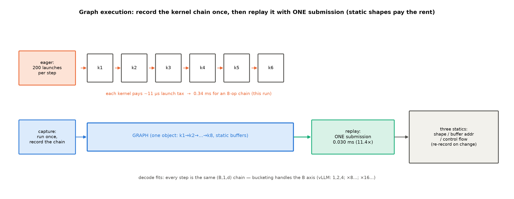
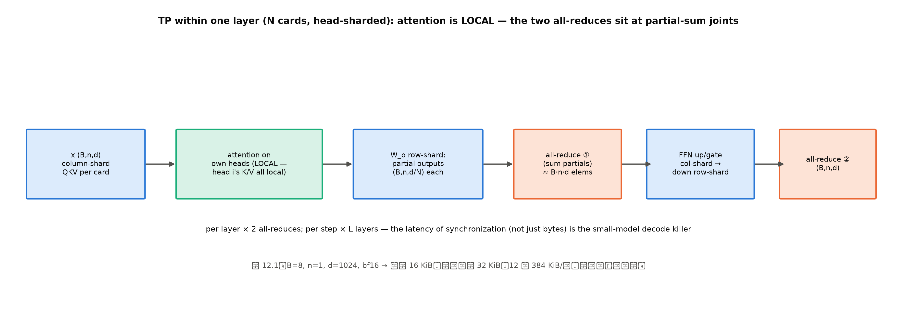
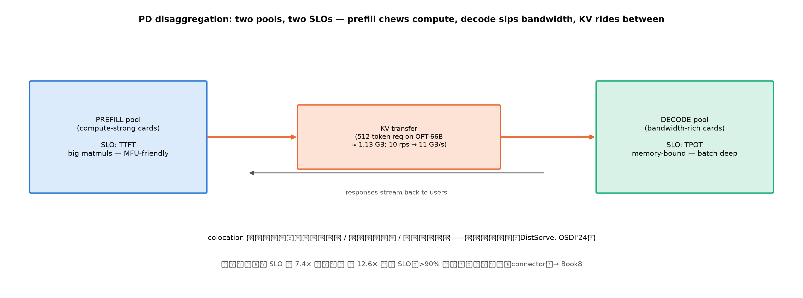

# 第 12 章 图执行与并行拓扑：把每一步榨干（原理层）

> **最小背景栏**：本章回收两条线——launch 开销（第 1 章 1.5 的实测发现、第 2 章价差表的主导行、贯穿各章的「手写执行层税」）与 Book4 第 1 章立下的切分动机（单卡装不下/喂不饱）。多卡实验本机有 7 张卡但拓扑实验以账本与原理为主（实测留 Book8 云档，写作要求 12 的显式标注）。

## 12.1 一句改道句的兑现

Book4 第 7 章的卷尾写得明白：「按丛书最终分工，多卡切分账已移驻系统侧讲（→ Book6 第 12 章/Book8 第 6 章），本章不碰，读者莫在此扑空」【Book4 ch07 成稿 L19，直引】——现在读者到了不扑空的地方。本章两件事、一先一后：**单卡内**把每一步的固定开销榨掉（图执行——第 2 章还账表的主导行在此核销）、**多卡间**把模型切开跑（并行拓扑——N5 的理论侧一笔）。前一件事处理的是「一条执行链上的税」，后一件处理的是「多条链怎么分工」——税与分工，是效率工程的两个正交维度。两件事共享同一个主题：**用静态性换效率**——把「每次都重新决定」变成「决定一次、反复执行」。路线图：12.2 先把发射税的账本收口（含图执行的本机收益读数），12.3-12.5 讲图执行与重叠的原理，12.6-12.7 把视角从单卡拉到多卡（四刀拓扑与 PD 分离），12.8 收束回全书旅程。

## 12.2 launch 开销的收口实测

第 1 章发现的 launch bound（25 ms/token 与 dtype、n0 几乎无关）在本章拿到三笔直接读数（`launch_probe.py::main`——`code/ch12/launch_probe.py`，Atlas 910B3，卡 1 空闲档；注：第三行的「8 算子链」是 8 条**语句**，profiler 实证每条语句拆成 2 个设备算子（Muls+Adds 各 8）——共 16 个 kernel，下文每算子账按 16 计）：

**实物 12.1**（发射与图执行读数；看什么——三行递进：单算子税、层内缩影、整链一次提交）

```text
裸发射（1 元素加法）：10.62 µs/kernel（前次实测 11.29——两次 10.6-11.3 µs 稳定）
RMSNorm 拆 4 小算子 0.186 ms vs 融合单算子 0.140 ms（拆分税 1.3×）
同一条 8 算子链：eager 逐发 0.342 ms vs NPUGraph 录一次 replay 0.030 ms（11.4×）
```

【证据等级：本机实测，`log/book6-ch12/launch_probe_base.json`】三行各讲一层：每发射一个 kernel 有约 11 微秒的固定成本（指令构造、下发、同步边界）——207M 一步 decode 的 kernel 数要分两种口径数：**融合理想化手数**约 210（每层 RMSNorm×2 计融合后 2、QKV 3、RoPE 2、注意力 3、$W_o$ 1、SwiGLU 4、残差 2——约 17/层×12+首尾 10）；而**教学实现的真身**（消费线 207M 的 RMSNorm 是手写分解版——float 上抛/pow/mean/rsqrt/乘回约 8 kernel 一枚）经 profiler 实测约 **600 个**——两数并排本身就是一课：**未融合的教学实现里，一枚 RMSNorm 就是 8 个 kernel**，融合与图执行要对付的正是这 600；每个 11 µs 的发射税，600 个就是约 6.4 毫秒的地板（发射与框架分发合计约 46 µs 是 host 侧税——发射税只是其中**可消除**的那部分，见下文三段分解）；层内例子更直观——同一段数学，拆成 4 个小算子逐个发射 0.186 ms、融合成一个算子 0.140 ms（拆分税 1.3×，融合是编译期的消除）。顺带把两笔税分干净：拆分档每条语句均摊 0.186/4≈46.5 µs（每设备算子约 23 µs——4 条语句拆 8 kernel），比裸发射的 10.6 µs 高一倍多——多出的部分是 **Python/torch 的每语句框架分发**（构造算子对象、查派发表、组织参数）；第 1 章反推的 125 µs/语句由此三段分解：裸发射约 11 µs + 框架分发约 12-35 µs（按算子/语句口径）+ 算子真实执行与同步（其余）；而第三行是本章主角——**同一条算子链，录一次、之后一次提交，0.342 ms 变 0.030 ms**。把 11.4× 摊到每个设备算子读一遍更清楚（profiler 实证链实为 16 kernel）：eager 链每算子 0.342/16≈21 µs，replay 链每算子 0.030/16≈1.9 µs——**图执行把每算子的 host 侧成本从「二十微秒级」压到「两微秒级」**，11.4× 不是魔法，是 46 µs 的分发税被一次性预付掉之后的除法。第 1 章那笔 96% 的未解释差额，原理层的第一笔偿还读数在此。消灭发射税的两条路就此分家：**融合**（fusion，编译期把多个算子合成一个）与**图执行**（运行期把整串 kernel 录制一次、之后一次提交）——后者正是 12.3 的正题。

## 12.3 CUDA Graph 原理：录一次、放一次

图执行是什么？NVIDIA 官方定义一句话（直引）："CUDA Graphs present another model for work submission in CUDA."——与流的逐 kernel 提交并列的**另一种工作提交模型**；它为什么快（直引）："first, CPU launch costs are reduced compared to streams, because much of the setup is done in advance"——大部分准备在实例化时一次付清【证据等级：官方文档，CUDA Programming Guide v13.4.2 ch.4.2，2026-10-10 取用；URL 有勘误——NVIDIA 已拆章，旧单页锚失效，正身 URL 见动手验证】。

机制朴素得像录音（图 12.1）：**capture**（捕获）阶段跑一遍 kernel 序列，整串操作被录成一个「计算图」对象——"work launched into the stream is not enqueued for execution. It is instead appended to an internal..."（捕获模式下发射的 kernel 不进执行队列、而是被记进图）【同上，直引】；**replay**（重放）阶段一次调用执行整串——两百次发射并成一次。约束也随之而来，三条静态换一条收益。三条约束各自有明确的机制根源，值得逐条看穿而不只是背清单。**形状静态**：kernel 发射时要拿到形状去选 tile 切法、算 grid 维度——形状就烧在发射参数里；录制时形状写死，变了就得重录（录制成本是毫秒级的前向一遍，decode 每秒几十步、每步 replay 同一张图，摊销一秒内回本）。**内存静态**：发射的指令里写的是缓冲区**地址**（立即数）——不是「某名字的张量」；replay 的新数据必须写进录制时那几块缓冲，引擎因此维护静态输入池、每步把新 batch 拷进固定位置再放图。**控制流静态**：图是发射序列本身，而序列里没有「如果」——分支意味着「这次发射还是不发射」，录制时必须二选一；动态控制流只能留在图外，由外层的普通代码判断后选择放哪张图。三条合起来读：**图执行用「世界不再变化」换「决定不再重做」**——decode 恰好住在一个形状、地址、控制流都日复一日不变的世界里，这正是它是图执行最佳客户的原因。decode 恰好天生长着静态形状——每步都是 $(B,1,d)$ 的同款小 kernel 链，只有 B 轴会变；解法是**凑桶**（bucketing）：把 B 归到固定档位、每桶录一张图——常见引擎取小档 1/2/4、再按 8/16 的步进设大档（vLLM 的默认桶表正是「1、2、4；8 的倍数；16 的倍数」，读数入 12.4 的实证锚）。录制的成本要付一次摊销账：录一张图≈跑一遍前向（毫秒级）——decode 每秒 30-40 步、每步都 replay 同一张图，**毫秒级的录制成本在第一秒就摊清**，这就是「形状档位有限才划算」的算术面。prefill 的变长输入则交给 **piecewise**（分段图）：静态的段录图、动态的段（变长 attention）留在图外——「能录的录、不能录的分段」，dispatch 按 FULL > PIECEWISE > 无图 的顺序找桶，找不到回 eager。



图 12.1 图执行机制（自绘示意级）：eager 逐算子发射（每 kernel ~11 µs 税）对 capture/replay 一次提交；读数锚为本机 NPUGraph 实测（8 算子链 11.4×）；右侧三静态约束与 decode 的桶表。

实操口径（写作要求 12 的显式标注）：**CUDA Graph 的 capture/replay 在本机无 CUDA 环境不可直接复现**——但图执行不是 CUDA 专属概念，NPU 侧的等价物下一节就用本机读数兑现（实物 12.1 第三行就是它）。

## 12.4 NPU 等价物：ACLGraph 实证锚

昇腾侧的图执行叫 **ACLGraph**（`torch.npu` 的 NPUGraph capture/replay 接口——实物 12.1 的第三行读数正出自它：`launch_probe.py` 里录制的 8 算子链，eager 0.342 ms 对 replay 0.030 ms）。**接口同构性**一手可验：`torch.npu.NPUGraph` 与 `torch.cuda.CUDAGraph` 是同一套 capture/replay 语义在两家的镜像（capture 上下文管理器、graph_pool、replay 方法）【证据等级：本机源码一手（torch_npu 2.10.0）】。引擎侧三事实以**实现对照框**口径给出（版本框注：运行栈 0.27.1rc1/阅读锚 v0.30.0；允许清单：默认值读数+开关对拍+一句事实句；机制展开是 Book7 第 8 章的地界）：**其一**，vllm-ascend 运行栈的图模式默认 **FULL_AND_PIECEWISE**——默认值由上游 vllm 继承（vllm-ascend 不自设默认、只做平台归一化；正身=官方设计文档 graph_mode.md L35/L132-139+上游 cuda_graphs.md L48，sources/01 三级锚），；**其二**，`VLLM_USE_BREAKABLE_CUDAGRAPH` 为 NPU 侧 opt-in 开关（导入即打印「Breakable CUDAGraph on Ascend is opt-in; using VLLM_USE_BREAKABLE_CUDAGRAPH=0.」——版本守卫日志，读者在环境里自己能看见；源码正身见实物 12.2）；**其三**，torch.compile 在昇腾后端被禁（inductor 不可用）——编译优化的等价物是 npugraph_ex 的 FX 层（一句事实句，机制地界 Book7）；NPU 还有一笔 CUDA 主线没有的细节：ACLGraph 对变长的处理用「attention 参数更新」机制（名词级点名，机制细节是 Book7 第 8 章的地界）——等价性核对时值得单独记的一格。三行实证锚立在原理与实现之间——「NPU 也有图执行、且默认开启」，12.2 的发射税答案在引擎里已经装好。源码位三级锚（sources/01 一手核验）摘录如下：

**实物 12.2**（vllm-ascend 图模式开关——源码行原样摘录；看什么——opt-in 的默认值与守卫断言的原文身份）

```python
# repos/vllm-ascend/vllm_ascend/platform.py#L67-72（opt-in 开关与导入期日志）
# Keep Breakable CUDAGraph opt-in on Ascend. Upstream may auto-enable it
# for selected architectures when the environment variable is absent.
value = os.environ.setdefault("VLLM_USE_BREAKABLE_CUDAGRAPH", "0")
logger.info_once(
    "Breakable CUDAGraph on Ascend is opt-in; using VLLM_USE_BREAKABLE_CUDAGRAPH=%s.",
    value,

# platform.py#L1209-1212（piecewise 模式的守卫断言——未开 opt-in 且非编译模式即拒绝）
    elif compilation_config.cudagraph_mode.requires_piecewise_compilation():
        # Our is_cuda_alike is False so we cannot reuse the assertion of upstream
        if compilation_config.mode != CompilationMode.VLLM_COMPILE and not envs_vllm.VLLM_USE_BREAKABLE_CUDAGRAPH:
            raise AssertionError(
```

【证据等级：本机源码一手（repos/vllm-ascend 0.27.1rc1 工作树，2026-10-10 摘录）；cudagraph_mode 默认档 FULL_AND_PIECEWISE 的正身=官方设计文档 graph_mode.md L35/L132-139 与上游 cuda_graphs.md L48（sources/01 三级锚）；机制展开 → Book7 第 8 章】

## 12.5 重叠执行：三流并行一句带过

图执行压缩「发射的串行」，**重叠**（overlap）压缩「等待的串行」。换一个镜头看同一支执行链：任一时刻，三条流各自在忙什么——CPU 在为第 $t{+}1$ 步构造指令（发射、采样准备、调度决策），NPU 在算第 $t$ 步，传输通道可能在搬第 $t{-}1$ 步的结果（输出 token 上主机、下一批输入下设备）。理想的引擎让三条流像流水线一样错峰推进、互不等待；现实的差距叫**重叠缺口**：CPU 侧每步几十毫秒的 Python 调度若慢于 NPU 侧的计算，NPU 就会算完一步后空转等指令——第 1 章 25 ms 的大头正是这种「单流视角」的串行（发射、决策、搬运排队走一条队）。工程形态首推 **dual-batch overlap**：把服务的 batch 一分为二，当一半在算前向时，另一半正好走 CPU 调度与准备——两半交替，三条流都被填满（ubatching 是它在 decode 段的同族变体）。这些微批重叠技术**本机不可实测**（标注：源码阅读+原理推演口径）；一句心智带走：**引擎的每一毫秒都在三个流上同时记账——单流视角的账本永远高估成本**。

## 12.6 并行拓扑：四刀切法与通信账

模型装不下单卡/单卡喂不饱需求时，切法四刀。**先立共同的账**：切分的收益是显存（或吞吐）乘 N，代价是**通信**——每刀都引入新的「卡间必须说话」的时刻，通信量与切法的几何直接相关。

**张量并行（TP，tensor parallelism）**：把每个权矩阵**按行/列切片**摊到 N 卡。一层的通信几何要讲准（图 12.2）：QKV 按列切（每卡拿到自己那份头的投影），**注意力本身在头切分下是本地完成的**——头 $i$ 的注意力只需要头 $i$ 的 K/V，而它们恰好在同一张卡上；两次 all-reduce 都出现在**部分和的接缝**上：第一次在 $W_o$（行切）之后——每卡那份 $(B,n,d/N)$ 的注意力输出乘以自己的 $W_o$ 切片 $(d/N,d)$，得到**同形 $(B,n,d)$ 的部分和**，对 $N$ 份部分和求和（all-reduce，全归约）才得完整输出；第二次在 FFN 的 down 投影（行切）之后，同理。**层内两次、每层都付**——TP 适合高带宽互连（卡间 NVLink/HCCS 级），是推理侧小模型多卡的主流。



图 12.2 TP 一层的两次 all-reduce（自绘示意级）：注意力在头切分下本地完成，通信只发生在部分和接缝（$W_o$ 后与 FFN down 后）。

**例 12.1（构造例：4 卡 TP 的一层通信账手算）** 设 207M 一层、batch 8、decode 步（序列 1）、bf16、4 卡。每次 all-reduce 的元素量 $=8\times1024=8{,}192$ 个、$16\text{ KiB}$；一层两次 $32\text{ KiB}$、12 层 $384\text{ KiB}$/步。输出读法：**数据量很小、同步次数很多**——384 KiB 在百 GB/s 互连上是微秒级，但 24 次/步的同步各有固定时延（与数据量无关的部分），同步税叠加才是小模型 decode 上 TP 跑不满的账根（α-β 两段式模型看更清：时延 $T=\alpha+\beta M$——$\alpha$ 固定时延、$\beta$ 每字节传输时间、$M$ 字节数；小报文时 $\alpha$ 项主导，decode 的 all-reduce 恰是小报文。910B3 卡间互连 HCCS 带宽 392 GB/s【证据等级：厂商自报（Atlas 800T A2 用户指南，papers/05 §3.1——卡间互连口径、非显存带宽）】——384 KiB/步在 392 GB/s 上是微秒级，结论不变：同步的 $\alpha$ 项才是主导）；换 prefill（n=512）同一步通信量 ×512 倍但仍摊在 n 个 token 上——TP 的性价比随批量上升。

**流水线并行（PP，pipeline parallelism）**：把**层**切开——卡 1 管 1-3 层、卡 2 管 4-6 层……激活像流水线上的工件传下去。通信量小（只在切点传一次 $(B,n,d)$ 激活），代价是**气泡**（bubble）——流水填充与排空时段有卡在等。

气泡的机制图像值得画一遍（文字版时间梯形）：$p{=}4$ 段流水、单批时，第 1 拍只有卡 1 在算（卡 2-4 没料）、第 2 拍卡 1-2、第 3 拍卡 1-3、第 4 拍起四卡齐转（稳态）、批结束后再花 3 拍排空（卡 2-4 依次收工、卡 1 早已闲）——**填充与排空两头的三角空转就是气泡**；批越大（微批越多）稳态段越长、两个三角占比越小。微批的**等长性**还有一层加成：各微批耗时相近时流水节拍才稳——第 7 章的等计算量混合批（SARATHI 的均匀微批）正是天然的等长微批，仿真气泡中位数降 6.29×（那条线在此回收）。

**例 12.2（构造例：气泡占比的两档手算——微批为什么救气泡）** 气泡占比公式：

$$\text{气泡占比} = \frac{p-1}{m+p-1} \tag{12.1}$$

| 符号 | 含义 | 量纲 |
|---|---|---|
| $p$ | 流水段数（切成几段） | 段（无量纲） |
| $m$ | 微批数 | 批（无量纲） |

用人话说：分子 $p{-}1$ 是填充+排空两头的三角空拍数（只与段数有关、不随批量变化），分母是总节拍数——**批越大，固定的三角越摊越薄**。**单批（m=1）4 段（p=4）**：$\frac{3}{4}=75\%$——四分之三的时间至少三张卡在等。**微批 m=4**：$\frac{3}{7}\approx43\%$；**m=8**：$\frac{3}{11}\approx27\%$；$m\to\infty$ 气泡趋零。三档并读：气泡随微批数**倒数级**收缩——八个微批把 75% 的空转压到 27%。输出读法：**微批越多气泡越小**——而连续到达的推理请求天然是多个微批（把 batch 切成微批依次灌入），这就是「推理比训练更适合 PP」的账面理由。

**专家并行（EP，expert parallelism）**：MoE 专属——**专家**为单位切卡，路由器把 token 派发给专家所在的卡（all-to-all 通信）、算完汇聚。all-to-all 的字节账：每卡发出/接收的是 token 的激活片 $(n_{\text{tok}},d)$——量与「每 token 去哪些专家」的分布直接相关。耦合的机制看两头：**负载不均时**，热专家所在卡既要多收 token 又要多算，其他卡空等它——通信等待与计算等待叠加（Book4 第 3 章训练侧的负载不均在服务侧原样复现，只是「损失尖峰」换成了「延迟尖峰」）；**分布均衡时**，all-to-all 是一次规整的置换通信、每卡收发同量，可与计算重叠。这就是 EP 部署总与负载均衡策略（容量因子、丢弃重路由、EPLB 类的重均衡）成对出现的原因——**拓扑决定通信的形状，均衡决定通信的等待**；Book4 表 1.4 的「派发开销梯度」是它的近亲概念——但口径要看清：那是**单进程**朴素 Python 逐专家循环的调度开销（MPS 实测，无卡间通信），不是通信账本身——跨卡 EP 的 all-to-all 是另一笔（每卡发出/接收与专家分布相关的 token 块）。

四刀的切什么/通信几何/代价并成一张速查表（表 12.1）。**数据并行（DP，data parallelism）**：不切模型——每卡一份完整副本各自接请求。零模型通信、代价是显存乘 N 与负载均衡。**注意与训练 DP 的语义差**：训练 DP 为聚合梯度而通信、推理 DP 为扩吞吐而不通信。推理 DP 的真正功课在**负载均衡**：副本间分请求的策略（round-robin、按队列长度、按 SLO 紧迫度）决定了有没有副本闲死而另一个排队——第 4-7 章 mini 引擎的调度直觉放大到副本维度，就是它的全部内容。

**表 12.1 四刀速查（切什么/通信几何/代价/适用）**

| 切法 | 切什么 | 通信几何 | 代价 | 每卡显存 | 适用 |
|---|---|---|---|---|---|
| TP | 权矩阵行列片 | 层内两次 all-reduce（每层都付） | 同步税×层深 | ÷N | 高带宽互连+单层太大 |
| PP | 层段 | 切点传一次激活 | 气泡 $\frac{p-1}{m+p-1}$ | ÷N | 深模型+微批充足 |
| EP | 专家 | all-to-all（与均衡耦合） | 负载不均 | ÷专家数（近） | MoE |
| DP | 不切（复制） | 零（推理语义） | 负载均衡 | ×N（各自全量） | 单卡装得下、扩吞吐 |

真实大系统的拓扑是四刀的组合拳（TP×PP×DP 三维切分）——组合的搜索空间正是系统设计的难处（→ Book8 第 6 章）。

## 12.7 PD 分离：两段画像的终局利用

第 1 章立的两阶段资源画像（prefill 算力受限/decode 访存受限）推到部署层的终局：**为什么让一台机器同时伺候两段？**混跑（colocation）的三笔代价：两段互相干扰（decode 的批被 prefill 的大算子卡住——第 7 章 generation stall 的根源）、资源配置耦合（一段要算力另一段要带宽，一台机器只能配一种）、调度目标打架（TTFT 与 TPOT 两把尺子挤一个队列）。**PD 分离**（prefill-decode disaggregation）把两组拆开（图 12.3）：prefill 组配算力强的卡、decode 组配带宽优的卡，请求在两组之间流转。两段的对照先立成表（表 12.2——第 1 章画像的部署版）：

**表 12.2 prefill 与 decode 的资源画像对照（分池的合法性）**

| 维度 | prefill 段 | decode 段 |
|---|---|---|
| 受限类型 | 算力（大矩阵） | 带宽（权重搬运） |
| 目标 SLO | TTFT | TPOT |
| 资源偏好 | 高 TFLOPS/卡 | 高 GB/s 与大显存（批深） |
| 混池干扰项 | 被 decode 小步抢占发射窗口 | 被 prefill 大算子卡住整步 |

两段画像的论文级正身与头条读数（DistServe，OSDI'24）：**双 SLO 约束下 7.4× 更多请求或 12.6× 更紧 SLO（>90% 请求守约）**；对 vLLM 基线的端到端提升，chatbot 负载 2.0-4.6×、summarization（OPT-66B）4.3× 请求率与 **12.6×** SLO 收紧【证据等级：官方论文 2401.09670】。动机侧它还给了一个干净的开篇实验：同一张卡混跑两段 goodput 1.6 rps、只跑 prefill 5.6、只跑 decode 10——**混跑让两头都吃瘪**，分池后按 2 卡 prefill+1 卡 decode 的配比拿到 10 rps 总吞吐（两段各自的弹性配比正是「多实例部署」的雏形——P 组与 D 组的卡数配比随负载潮汐调整：白天聊天负载短 prefill 多、批量代码补全长 prefill 多，配比不同——「分池」买的正是这份按段独立扩缩的自由）。



图 12.3 PD 分离部署形态（自绘示意级）：两组两 SLO、KV 在组间流转；KV 传输的量级账与 colocation 三代价标注。

分离的代价是**KV 传输**成为新账单：prefill 算完的整条 KV 要搬到 decode 组。量级账（论文直引）："the KV cache size of a single 512-token request on OPT-66B is approximately 1.13GB. Assuming an average arrival rate of 10 rps, we need to transfer 11.3GB data per second"——单条 512-token 请求 1.13 GB、10 rps 到达率就是 11.3 GB/s（约 90 Gbps）的持续传输需求【证据等级：官方论文，直引】；但同文也给了「这笔账可付」的读数：即便 OPT-175B，KV 传输占总时延 **不到 0.1%**，且跨节点有限带宽下 **>95% 请求的传输延迟 <30 ms**。NPU 侧顺手对拍一笔：11.3 GB/s 的需求对本机卡间 HCCS 392 GB/s（papers/05 §3.1 厂商口径）低一个多数量级——同向结论、方向不变（节点间网络才是真瓶颈）。传输不是分离的拦路虎，**connector 生态**（NIXL/mooncake 一族，怎么传、怎么压缩、一致性）才是工程主战场 → Book8 第 7 章。

## 12.8 本章小结

N5-软改道句兑现（多卡切分的理论侧一笔），B6-6 章末挂钩、B6-7 展望移交（并行落地与 PD 分离工程 → Book8 第 6/7 章）。本章也是全书**内容章的最后一站**——单项深化段（第 8-12 章：kernel→量化→图执行/并行）在此收官，回看全书三段旅程：第一段「没有引擎的生活」立的账（第 1-2 章），第二段四版引擎逐笔偿还（第 4-7 章），第三段单项榨干（第 8-12 章）——launch 这笔第 1 章挂起的 96% 差额，先被引擎还了大半（25.15→8.9 ms——Qwen3-0.6B 档、趋势级口径，ch07 登记在案）、原理层的账本在本章收口（裸发射 10.6 µs、拆分税 1.3×、图执行 11.4×）、工程层的完整实现留给下一册的源码。带走的心智：**「用静态性换效率」贯穿全章——图执行用静态形状换发射开销（录一次放一次）、TP/PP/EP/DP 用静态切分换通信账、PD 分离用静态分工换干扰消除；动态是税，静态是折扣**。下一章（第 13 章）收束全书：把十四站的账本合成一张总图，向 Book7 的源码旅程交棒。

> **【欠账】** capture/replay 的源码正身、piecewise 的切分逻辑、NPU 侧 ACLGraph 与 CUDA Graph 的逐项对照（等价性待核验口径）→ Book7 第 8 章

## 动手验证

- 发射税与图执行实测（实物 12.1 三行复现；NPU 秒级，先 npu-smi 选卡）：`source env.sh && ASCEND_RT_VISIBLE_DEVICES=<卡> python code/ch12/launch_probe.py`（裸发射 ~11 µs / 拆分税 1.3× / NPUGraph 11.4×；产物 `log/book6-ch12/launch_probe_base.json`）
- 本章三图：`python code/ch12/fig_ch12.py`
- 图模式实证锚：`python -c "import vllm"`（观察导入期 Breakable CUDAGraph 提示行）+ sources/01 §图模式
- 气泡与 TP 账：例 12.1/12.2 手算复核（构造例口径）
- 正主：DistServe arXiv:2401.09670（OSDI'24——7.4×/12.6×、KV 1.13 GB/11 GB/s、<0.1%/30ms 三组直引出处）；CUDA Programming Guide v13.4.2 ch.4.2（CUDA Graphs——URL 已拆章勘误，正身 `docs.nvidia.com/cuda/cuda-programming-guide/04-special-topics/cuda-graphs.html`）
