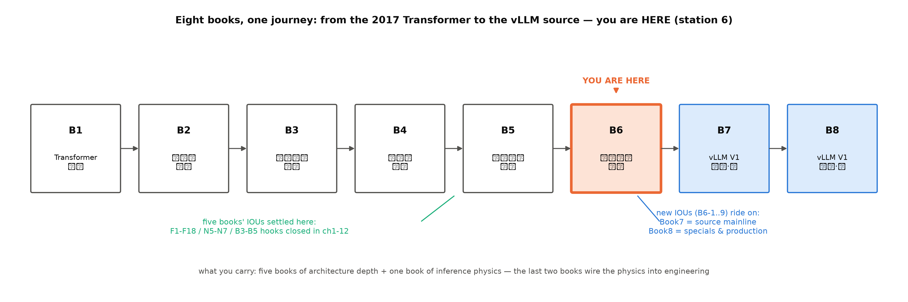

# 第 13 章 收束：推理物理学与它的引擎

## 13.1 开篇四问，交卷

上一章章末欠账框刚把图执行源码与并行落地两笔挂给 Book7/8（B6-6/B6-7）——那是本册埋钩的最后一笔。导览以「慢在哪/能救多少/钱从哪来」三问开卷、立了三段旅程（立账、造引擎、单项深化）；走完十四章回望，把这趟旅程折成四问交卷——这一节要做的不是罗列结论，而是把每问的**机制因果**重述一遍：忘掉细节后，读者应能凭本章重建心智。

**一问：模型在服务里是什么？**是 workload——三本账的合集：**权重账**（固定，$N\times$字节——不管来一条请求还是一百条，每步 decode 都要整份搬进算子）、**KV 账**（随请求生长的租约——例 2.2 那本除法的分母，容量规划的主项）、**token 流**（自回归的串行税——因果链上没有并行空间，第 10 章才撞开一道缝）。第 2 章的算术体系把它变成一页纸可算的账本：拿到任何 config，FLOPs（$2\times$激活参）、字节（权重+KV）、decode 下限（权重字节÷带宽）三分钟出数——第 1 章 25 ms 的「没有引擎的生活」从此每一分钱都有名字。

**二问：引擎是什么？**是把这三本账付得最便宜的机器——每件工具付得掉自己那笔账的**因果**值得各重述一句。批处理摊权重：一步前向同时服务 $B$ 条请求，权重的搬运费 $\div B$（例 4.1 的时隙账——v1 的 22.8% 浪费位就是这么消失的）；连续调度消浪费：请求到点就走、不等整批（浪费位科目直接取消）；分页消碎片：块为分配单位、按需给块（例 5.3 的块表走查——「逻辑相邻、物理不相邻」也能算注意力）；缓存消重复：相同前缀只算一次、命中即折扣（v4 命中 66.7% 起、TTFT 稳态 3.4-5.2×）；分块消干扰：大 prefill 切成小块与 decode 搭伙，decode 不再被整段 prefill 卡住（TPOT 平稳的那一级台阶）。三个深化项各榨一层：kernel 削访存（中间量不进 HBM）、投机破串行（一次验证批发 $\gamma$ 步——例 10.1/10.2 的期望长度账）、量化砍字节（误差搬家，414→104 MB 的带宽账）；图执行压发射（两百次发射并成一次——11.4× 的本机读数）。**九件工具没有银弹——每件只解决自己那笔账。**

**三问（对应导览三问的「钱从哪来」）：我们造出了什么？**四版 mini 引擎——每一版都是「一笔账逼出一台机器」的标本。**v1 naive** 把静态批的浪费摆在台面上：请求到齐才开算、算完一整批才换人，时隙账量出 22.8% 的浪费位——反面教材的价值是把「要解决什么」变成可测的数。**v2 连续批**把调度粒度从「批」降到「步」：每步后完成的请求离场、排队的进场，浪费位归零、TPOT 59 ms 有了语义（每步都是有效步）；代价是异长批的 padding 与掩码——selective batching 教的是「同一层里两种形状怎么拼着算」。**v3 分页**换掉的是显存的分配单位：块为最小单位、按需给块，教学负载省 7.1% 碎片、容量准入从 64 条翻到 724 条（11.3×）——「逻辑相邻、物理不相邻」的块表让 KV 不再要求连续大块。**v4 前缀缓存**把「重复计算」变成「重复命中」：哈希前缀对齐、命中即免算，三 workload 命中 66.7-86.6%、TTFT 稳态 3.4-5.2×；第 7 章的分块预填充再补第五级（A/B 对照尖峰 6.1×——decode 搭车小块 prefill）。执行层对拍逐位一致（第 4/5 章的 max|Δ|=0.00e+00——数学上与全量重算等价的实测证据）；性能与工业引擎的差距有名字、有口径（13.2 展开）。

**四问：还欠什么？**引擎实现层的全部——本册每章以「引擎必须回答的问题」收尾，那些问题在 vLLM 里有具体的源码答案。欠账单就是下一册的地图（13.3 决算、13.4 三扇门）。

四问之外，三段旅程各留一句总括。**立账段（第 1-3 章）**：从「25 毫秒的没有引擎的生活」出发，把手算立成三层对拍的第一层——roofline 给下限、实测给现状、差额给机制；KV 三线压缩把架构史变成容量账的台阶。**造引擎段（第 4-7 章）**：四版进化每版一笔账，收官时调度折中（chunked prefill 与抢占）把前面所有机制放进同一个决策循环——引擎自此有了「性格」可以调。**深化段（第 8-12 章）**：kernel、采样、投机、量化、图执行五个单项各自榨一层，彼此正交可叠——深化段的每一章都是「一个机制的红利边界在哪里」的可测答案。

## 13.2 四版引擎终账

回看收官总图（图 7.4 的吞吐-并发曲线，第 7 章）：四版引擎在同一 workload 下画出的台阶，就是 13.1 二问的实测版。终账表（表 13.1）补上各版同 workload 的吞吐纵向可比列（第 7 章并发扫描：v1 28→42→85→169 对 v2 20→31→49→88 tok/s——并发越高 v1 的静态批优势越显，教学负载下 v2 的 TPOT 语义才是主收益）：

**表 13.1 四版引擎终账**（同 workload 实测，Atlas 910B3；JSON 出处逐版点名）

| 版本 | 解决什么 | 关键读数 | 吞吐列（并发扫描） | 对应真实引擎机制 |
|---|---|---|---|---|
| v1 naive | 反面教材 | 吞吐 139 tok/s；浪费 22.8%【本机实测：log/book6-ch04】 | 28→42→85→169 tok/s | 静态批世界（Orca 之前） |
| v2 连续批 | 浪费位、$O(n^2)$ | 浪费 0；TPOT 59 ms【本机实测：log/book6-ch04】 | 20→31→49→88 tok/s | iteration 级调度+selective batching |
| v3 分页 | 碎片、买断浪费 | 碎片省 7.1%（教学负载）；容量准入 64→724 条【本机实测：log/book6-ch05】 | （同 v2 口径，收益在显存侧） | PagedAttention 块管理 |
| v4 前缀缓存 | 重复前缀 | 命中 66.7/86.6/82.2%；TTFT 稳态 3.4-5.2×、尖峰 8.6×【本机实测：log/book6-ch06】 | （叠加 v3，收益在 TTFT 侧） | 哈希前缀缓存 |

增益瀑布逐级复述（验收点的可复述版）：**v1→v2** 浪费位 22.8%→0（吞吐的账面损失换 TPOT 语义）；**v2→v3** 碎片 −7.1%、准入 ×11.3（收益在容量不在速度）；**v3→v4** 命中 66.7% 起、TTFT 尖峰 8.6×/稳态 3.4-5.2×（收益在首 token）；**+分块** 尖峰 6.1×（收益在干扰消除）；**+真实引擎** vllm 运行栈（Qwen3-0.6B，同量级小模型）8.9 ms/token 对 v2 的 59 ms——工程红利约 6.6×，与机制红利分账。每一级台阶**只动一个变量**——「台阶正交性」让每版的读数可归因；而每版引入的新常量（批大小、块大小、缓存容量、块长）就是调参的本质——四版进化教的不只是机制，还有「机制落地后旋钮长什么样」。

与真实引擎的对照（第 7 章第三层对拍）口径四要素钉死：对象=vllm 运行栈（0.27.1+vllm-ascend）、指标=同量级小模型单请求 decode TPOT、读数≈9 ms（8.9 ms/token，对 mini 引擎 v2 的 59 ms）、纪律=**趋势级可比、绝对数不可比**（栈/kernel/批形态全不同）。差距分解三层：**框架开销**（Python 调度循环对 C++——第 12 章的 125 µs/算子分解就是它的微观版）、**工程成熟度**（融合 kernel、图执行默认开——12.4 的三事实）、**生态**（connector/量化/观测的现成件）。v2/v3 吞吐低于 v1 的诚实注脚也在此读：**机制红利与工程红利是两层账**——教学引擎拿到前者（浪费位归零、TTFT 语义、容量利用率），后者由工业引擎补齐。把单轨自训模型注册进 vllm-ascend、与 mini 引擎逐项对照，是 Book7 第 10 章钦点的选做大作业（B6-9）。

终账之外还有一笔**方法学决算**——本册与工业论文共享的那套手艺：**三层对拍**（手算/引擎/真实引擎，层间差距是待解释对象而非误差）、**证据等级随行**（官方论文>技术报告>config 逆向>第三方复测>厂商自报——全书引用逐条挂标）、**预注册**（第 10 章投机实验的负结果分支在设计期写定，跑出 0.63× 如实交卷）、**对拍即证明**（分布不变性靠序列级对拍钉死、执行层等价靠 max|Δ|=0.00e+00 钉死——两个实现 bug 都是对拍逼出来的）、**口径显式**（同 dtype 相除、激活对激活、检查点格式≠执行格式）。这套手艺比任何一个数字都长寿——读下一册源码时，判断「这个设计为什么存在」依然靠它。

## 13.3 钩子决算

十八笔旧钩与八条新钩（第九条候选 B6-8 经裁定不埋）逐行销项（表 13.2，与导览表 0.2 同构闭环——「钩|埋点|回收落点|销项」四列）：

**表 13.2 伏笔决算总表（十八旧钩+B6 系；「半句」=Book7/8 的那半句原址保留不吞）**

| 钩 | 埋点（册·章） | 回收落点 | 销项一句 |
|---|---|---|---|
| F1 | Book1·ch11（表 11.2） | ch3/ch8 | 显存半句+kernel 半句分头清账 |
| F2 | Book1·ch11 | ch1/ch10 | 串行税立账，投机撞开一道缝 |
| F4 | Book1·ch11 | ch3/5/7 | KV 账本三线压缩+分页+调度折中 |
| F8 | Book1·ch8 | ch9/ch10 | 采样系统化+一次验证多条候选 |
| F10 | Book1·ch11（登记表） | ch6 | 上下文长度主线的服务侧终点：缓存经济学 |
| F17 | Book1·ch11（登记表） | ch8 | FA 谱系的推理册正身 |
| F18 | Book1·ch8 | ch11（半句→Book8） | 训练侧→推理侧量化交棒 |
| N6 | Book2·ch12 | ch6 | 前缀缓存场景正身 |
| N7 | Book2·ch12 | ch3/ch6 | 缓存经济学与 KV 三线压缩的账半句 |
| N5（软） | Book4·ch7 | ch12 | 多卡切分账原理侧一笔 |
| B3-1 | Book3·ch06 | ch3/ch5 | KV 三股省法 |
| B3-6 | Book3·大项目 | 全册 | 消费线语料/模型复用 |
| B4-3 | Book4·ch7 | ch11（半句→Book8） | 量化前半册内交货 |
| B4-4 | Book4·ch8 | ch10 | MTP 数字带进 proposer |
| B4-7 | Book4·ch09/ch12（DESIGN-409M） | ch2/ch3 | 两刀机激活账算例 |
| B5-1 | Book5·ch02 | ch5 | 分类型两类生命周期（滚动淘汰 vs 全保） |
| B5-2 | Book5·ch07 | ch10 | K3 的 MTP→EAGLE 合流 |
| B5-3 | Book5·ch08 | ch0/ch3（半句→Book8） | 混合 KV 终局预告 |
| B6-1~B6-7, B6-9 | 本册各章末欠账框 | Book7 第 5/6/8/10/12 章、Book8 第 2/6/7/9 章 | 见导览表 0.2（B6-8 裁定不埋） |

有借有还、无地址的许诺一条没有——五册埋来的账全部落在册内或带着明确地址出册；Book7/8 的半句原址保留十余处（逐条清单在调研底单 notes/05-伏笔回收清单.md，导览与收束章同指此档）。这张表不只是台账 hygiene：**欠账单是这套丛书的组织算法**。八册书的每一步递进都靠「上一册留下什么、下一册接什么」的显式契约缝合——读者任何时候迷路，翻回最近的欠账框就能定位自己在因果链上的坐标；而「B6-8 弱候选经裁定不埋」的注记同样有价值——**不埋也是一个决定**，克制与承诺共用同一张表。

## 13.4 三扇门

**Book7 主链路门**：本册每个算法，在那里有一个**点名到类**的模块等着——调度折中→`vllm/v1/core/sched/scheduler.py::Scheduler`（本册第 7 章 B6-4 的钩→Book7 第 5 章：每步的 admission/抢占决策循环）；分页与容量→`vllm/v1/core/kv_cache_manager.py::KVCacheManager`（本册第 5 章→Book7 第 6 章：块分配、准入、抢占的账本正身——例 5.3 的块表在引擎里的工业形态）；前缀缓存→`kv_cache_utils` 的哈希前缀实现（本册第 6 章 B6-3→Book7 第 6 章：哈希 vs radix 的答案）；图执行与编译→`vllm/compilation/backends.py::CompilerManager` 与 `PiecewiseCompileInterpreter`（本册第 12 章 B6-6→Book7 第 8 章：piecewise 的切分正身——类名就是机制名）；采样出口→`v1/sample/` 的九步管线（本册第 9 章欠账→Book7 第 11 章）；投机解码→`v1/spec_decode/` 的 proposer 全家（本册第 10 章对照框→Book8 第 2 章）。沿一条请求的生命周期把源码读穿【模块名经 repos/vllm v0.30.0 核对】。

**Book8 专题门**：混合架构的服务终局（KDA 状态与 MLA KV 同池共管——B5-1/B5-3/**B5-4** 的 Book8 第 1 章）、量化部署矩阵（B4-3 后半，第 11 章欠账框）、投机 proposer 的工程接口（B6-5——五型 proposer 的统一调度协同）、KV 的第四种省法 offload/tiering（B6-2）、并行与 PD 分离的工程生态（B6-7：connector 一族）。

**系统视角门**：八册地图走完第六站（图 13.1）——从 Transformer 原典到 vLLM 源码，读者手里已有五册的架构纵深+本册的推理物理。最后两册把物理接到工程上：**你算得出的账，去看工业界怎么付**。

图 13.1 八册地图（自绘，沿五册收束章图式）：第六站=本册；左侧五册旧账在本册清讫，右侧 B6 系新钩流向 Book7/8。

## 13.5 十四站各一句（复习地图）

迷路时的回程票：第 1 章立两阶段画像与 launch 之谜；第 2 章把手算立成三层对拍的第一层（72×/36× 价差）；第 3 章 KV 三线压缩（GQA→MQA→MLA 的容量台阶）；第 4 章连续批处理（浪费位归零）；第 5 章分页 KV（块表与碎片账）；第 6 章前缀缓存（哈希对齐与命中率）；第 7 章分块预填充与抢占（调度折中——引擎有了性格）；第 8 章 attention kernel（tile 化与 online softmax，多算换少访存）；第 9 章采样管线（顺序是语义）；第 10 章投机解码（分布不变定理+命中率生意）；第 11 章量化（误差摊派四派+红利在带宽侧）；第 12 章图执行与并行拓扑（静态换效率）；第 0 章导览与本章收束首尾扣环。每一句都是一章的「带走的心智」压缩包——展开任何一句，应该能回忆起那一章的核心 toy 例与关键读数。

## 13.6 带走的心智

三幅画带走。**其一，账本图景**：权重是固定账、KV 是流水账、自回归是串行税——模型是 workload，引擎是把账付得最便宜的机器；账单的每一项都有名字，有名字的账都能优化，优化后的差距都能实测。**其二，产权细化图景**：批处理五部曲是把「服务」这个笼统概念逐步拆出产权——批（吞吐归谁）、显存（容量归谁）、缓存（重复归谁）、算力（干扰归谁）；每一部曲都把一个以前含混的东西变成可记账、可交易的产权。**其三，静态性换效率**：图执行用静态形状换发射开销、切分用静态拓扑换通信账、PD 用静态分工换干扰消除——**动态是税，静态是折扣**。第 1 章那句「25 毫秒一个 token 的没有引擎的生活」（bf16 稳态档，四次重复 25.1-27.2），现在你不仅知道它的每一分钱花在哪，还亲手把其中几笔划掉了——这就是推理物理学的全部：**给「慢」记账，然后按账办事**。

## 13.7 术语表与源码地图

**术语表**（首现章 | 中英对照；全册 33 条主干）：TTFT 首 token 时间（ch1）| TPOT 每 token 时间（ch1）| roofline 屋顶线模型（ch1）| arithmetic intensity 算术强度（ch1）| ridge point 脊点（ch1）| launch overhead 发射开销（ch1）| MFU 模型算力利用率（ch2）| calibration set 校准集（ch11）| continuous batching 连续批处理（ch4）| iteration-level scheduling 迭代级调度（ch4）| selective batching 选择性批处理（ch4）| PagedAttention 分页注意力（ch5）| block table 块表（ch5）| copy-on-write 写时复制（ch5）| prefix caching 前缀缓存（ch6）| radix tree 基数树（ch6）| chunked prefill 分块预填充（ch7）| generation stall 生成停顿（ch7）| preemption 抢占（ch7）| piggybacking 搭车（ch7）| online softmax 在线 softmax（ch8）| nucleus sampling 核采样（ch9）| speculative decoding 投机解码（ch10）| draft/verify/rollback 起草/验证/回滚（ch10）| accept rate 接受率（ch10）| bonus token 彩头（ch10）| PTQ 训练后量化（ch11）| outlier channel 离群通道（ch3 首现、ch11 深化）| W8A8/W4A16 权重激活位宽格式（ch11）| CUDA Graph 图执行（ch12）| capture/replay 录制/回放（ch12）| TP/PP/EP/DP 张量/流水线/专家/数据并行（ch12）| PD 分离 prefill-decode disaggregation（ch12）。

**源码地图**（本册只点名、下两册精读；四仓各一句）：`repos/pytorch`——`torch/nn/attention/` 的 sdpa/flex_attention（第 8 章后端门控的阅读对象）；`repos/vllm`（v0.30.0 阅读锚，本册引用处已逐点版本框注）——V1 主体的 `v1/core/sched/`、`v1/core/kv_cache_manager.py`、`v1/worker/`、`compilation/`；`repos/vllm-ascend`（运行栈 0.27.1rc1）——实证锚三处源码位：chunked prefill 默认开关（repos/vllm `scheduler.py#L116`，v0.30.0 阅读锚）、图模式默认 FULL_AND_PIECEWISE（官方设计文档 graph_mode.md+上游继承——ch12 三级锚）、量化平台白名单六法（repos/vllm-ascend platform.py#L99-106）；`repos/torch-npu`——NPUGraph 与 npu_quant_matmul 算子族的接口正身。本册自产：`code/Book6-推理系统导论/` 四版引擎与教学件、`00-feasibility/` 探针底座——**全部可重跑**（最小复现入口：`source env.sh` 后逐章动手验证段的命令，NPU 件先 `npu-smi info` 选卡再 `ASCEND_RT_VISIBLE_DEVICES=<卡>`），数字可复现（JSON 底档在 `log/book6-ch*`）。

---

*本册实验全部在 Atlas 910B3（CANN 9.1.0 / torch 2.10 / torch-npu 2.10.0.post4 / vllm 0.27.1+vllm-ascend 0.27.1rc1）上实测；引用数字的证据等级随文标注；底单全档在 research/Book6-推理系统导论/。写作仓的图与随书代码快照见书仓 book6 卷。*
